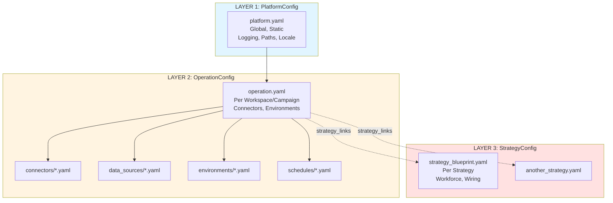
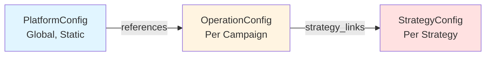

# Configuration Layers

**Status:** Architecture Foundation  
**Last Updated:** 2025-10-29

---

## Overview

S1mpleTraderV3 uses a **3-layer configuration hierarchy** that strictly separates platform settings, operation/campaign settings, and strategy-specific configuration. This separation enables reusability, clarity, and maintainability.



**Key Principles:**
- **Strict Separation**: Each layer has distinct scope and lifetime
- **Hierarchical Loading**: Platform → Operation → Strategy (just-in-time)
- **No Duplication**: Settings belong to exactly one layer
- **Fail-Fast Validation**: All validation during bootstrap

---

## The Three Layers



---

## Layer 1: PlatformConfig

### Purpose
Global, static platform settings that apply to all operations and strategies

### File
`platform.yaml` (typically in project root or `~/.simpletrader/`)

### Lifetime
- Loaded once at `OperationService.start()`
- Remains constant for entire application lifetime
- Changes require application restart

### Contents

```yaml
# platform.yaml

logging:
  level: "INFO"  # DEBUG, INFO, WARNING, ERROR
  format: "json"  # json, text
  output: "file"  # console, file, both
  log_dir: "./logs"

paths:
  plugins_dir: "./plugins"
  dto_registry: "./backend/dto_reg"
  config_dir: "./config"
  data_dir: "./data"

locale:
  timezone: "UTC"
  currency: "USD"

performance:
  max_parallel_strategies: 10
  tick_cache_ttl_seconds: 60
  event_queue_size: 1000
```

### What PlatformConfig DOES contain
- Logging configuration
- File paths and directories
- Locale settings (timezone, currency)
- Performance tuning (parallelism, cache sizes)

### What PlatformConfig does NOT contain
- Connectors (exchange APIs, data feeds)
- Execution environments (backtest, paper, live)
- Schedules (tick intervals, rebalancing)
- Strategy-specific settings

**Rationale:** Platform settings are environment-wide and don't change per operation

---

## Layer 2: OperationConfig

### Purpose
Workspace or campaign settings that group connectors, environments, and strategies

### File
`operation.yaml` + referenced files (connectors, data sources, environments, schedules)

### Lifetime
- Loaded per operation (e.g., "backtest_2025_Q1", "live_crypto_momentum")
- Shared by all strategies in the operation
- Changes require operation restart

### Structure

```yaml
# operation.yaml

operation:
  name: "momentum_backtest_2025"
  description: "Q1 2025 momentum strategy backtest"
  
  # References to external files
  connectors_file: "./connectors/binance_connector.yaml"
  data_sources_file: "./data_sources/binance_ohlcv.yaml"
  environments_file: "./environments/backtest_env.yaml"
  schedule_file: "./schedules/1h_schedule.yaml"
  
  # List of strategies to run in this operation
  strategy_links:
    - name: "btc_momentum_long"
      file: "./strategies/momentum/btc_long_blueprint.yaml"
      enabled: true
    
    - name: "eth_momentum_long"
      file: "./strategies/momentum/eth_long_blueprint.yaml"
      enabled: true
```

### Referenced Files

#### connectors/binance_connector.yaml
```yaml
connector:
  type: "binance"  # binance, coinbase, backtest_file, etc.
  api_key: "${BINANCE_API_KEY}"  # Environment variable
  api_secret: "${BINANCE_API_SECRET}"
  testnet: false
```

#### data_sources/binance_ohlcv.yaml
```yaml
data_source:
  type: "ohlcv_rest"
  connector_ref: "binance"  # References connector
  symbols:
    - "BTC/USDT"
    - "ETH/USDT"
  timeframes:
    - "1h"
    - "4h"
  lookback_days: 365
```

#### environments/backtest_env.yaml
```yaml
environment:
  type: "backtest"  # backtest, paper, live
  start_date: "2025-01-01"
  end_date: "2025-03-31"
  initial_capital: 10000
  commission: 0.001  # 0.1%
  slippage_model: "percentage"
  slippage_value: 0.0005  # 0.05%
```

#### schedules/1h_schedule.yaml
```yaml
schedule:
  type: "cron"
  expression: "0 * * * *"  # Every hour
  timezone: "UTC"
```

### What OperationConfig DOES contain
- Connector configurations (exchange APIs, backtest data files)
- Data source definitions (OHLCV providers, news feeds)
- Execution environment settings (backtest, paper, live)
- Schedule definitions (tick intervals, rebalancing times)
- List of strategies to run (`strategy_links`)

### What OperationConfig does NOT contain
- Platform-wide settings (those are in PlatformConfig)
- Strategy-specific worker configurations (those are in StrategyConfig)

**Rationale:** Operation settings define the "where, when, and which" for a group of strategies

---

## Layer 3: StrategyConfig

### Purpose
Complete strategy blueprint including workforce and strategy-specific wiring

### File
`strategy_blueprint.yaml` (referenced by OperationConfig's `strategy_links`)

### Lifetime
- Loaded just-in-time when strategy starts
- Unique per strategy instance
- Changes require strategy restart (not entire operation)

### Structure

```yaml
# strategies/momentum/btc_long_blueprint.yaml

strategy:
  name: "btc_momentum_long"
  description: "BTC long-only momentum strategy"
  symbol: "BTC/USDT"
  
  # Worker configuration (workforce)
  workforce:
    # Context Workers
    - worker_id: "ema_detector"
      plugin: "s1mple/ema_detector/v1.0.0"
      config:
        fast_period: 20
        slow_period: 50
        lookback_bars: 100
    
    - worker_id: "regime_classifier"
      plugin: "s1mple/regime_classifier/v1.0.0"
      config:
        lookback_periods: 50
        volatility_threshold: 0.02
    
    # Opportunity Workers
    - worker_id: "momentum_scout"
      plugin: "s1mple/momentum_signal/v1.0.0"
      config:
        min_confidence: 0.75
        ema_crossover: true
    
    # Planning Workers
    - worker_id: "limit_entry_planner"
      plugin: "s1mple/limit_entry_planner/v1.0.0"
      config:
        entry_offset_pct: 0.001  # 0.1% from signal price
    
    - worker_id: "kelly_sizer"
      plugin: "s1mple/kelly_sizer/v1.0.0"
      config:
        max_position_pct: 0.25  # 25% of portfolio
    
    # Strategy Planner (1 per strategy)
    - worker_id: "momentum_planner"
      plugin: "s1mple/swot_momentum_planner/v1.0.0"
      config:
        min_swot_score: 0.70
  
  # Strategy-specific event wiring
  wiring:
    file: "./wiring/btc_momentum_wiring.yaml"
```

### What StrategyConfig DOES contain
- Workforce definition (which workers, which plugins, config parameters)
- Strategy-specific event wiring (wiring_map.yaml reference)
- Strategy metadata (name, description, target symbol)

### What StrategyConfig does NOT contain
- Connector configurations (those are in OperationConfig)
- Environment settings (backtest vs live - those are in OperationConfig)
- Platform paths (those are in PlatformConfig)

**Rationale:** Strategy config is pure "what and how" - the strategy logic and parameters

---

## Configuration Loading Sequence

### Bootstrap Flow

```
1. OperationService.start()
   ↓
2. ConfigLoader.load_platform_config()
   → Reads platform.yaml
   → Validates against PlatformConfigSchema
   ↓
3. ConfigLoader.load_operation_config(operation_name)
   → Reads operation.yaml
   → Loads referenced files (connectors, data_sources, environments, schedule)
   → Validates against OperationConfigSchema
   ↓
4. For each strategy_link in operation.strategy_links:
   ↓
5. ConfigLoader.load_strategy_config(strategy_link.file)
   → Reads strategy_blueprint.yaml (JUST-IN-TIME)
   → Loads referenced wiring file
   → Validates against StrategyConfigSchema
   ↓
6. ConfigValidator.validate_cross_layer_dependencies()
   → Verify connector refs exist
   → Verify plugin refs exist
   → Verify DTO dependencies are satisfied
   → FAIL-FAST if validation errors
   ↓
7. ConfigTranslator.translate_to_buildspecs()
   → Generate connector_spec, workforce_spec, wiring_spec, etc.
   ↓
8. Factory Chain builds components
```

---

## Configuration Hierarchy Rules

### Rule 1: No Upward References
- PlatformConfig CANNOT reference OperationConfig or StrategyConfig
- OperationConfig CANNOT reference StrategyConfig
- StrategyConfig CAN reference OperationConfig resources (connectors, data sources)

### Rule 2: One Source of Truth
- Each setting belongs to exactly ONE layer
- No duplication across layers
- If uncertain, follow scope: Global → Platform, Workspace → Operation, Strategy → Strategy

### Rule 3: Just-In-Time Loading
- PlatformConfig: Loaded once at start
- OperationConfig: Loaded per operation
- StrategyConfig: Loaded per strategy (lazily)

### Rule 4: Fail-Fast Validation
- All validation during ConfigLoader/ConfigValidator phase
- No runtime configuration errors
- Invalid config = bootstrap failure (before any trading logic runs)

---

## Example: Multi-Strategy Operation

```yaml
# operation.yaml

operation:
  name: "crypto_portfolio_2025"
  connectors_file: "./connectors/binance.yaml"
  data_sources_file: "./data_sources/multi_symbol.yaml"
  environments_file: "./environments/live.yaml"
  schedule_file: "./schedules/1h_schedule.yaml"
  
  strategy_links:
    # Momentum strategies
    - name: "btc_momentum"
      file: "./strategies/momentum/btc_blueprint.yaml"
      enabled: true
    
    - name: "eth_momentum"
      file: "./strategies/momentum/eth_blueprint.yaml"
      enabled: true
    
    # Mean reversion strategies
    - name: "btc_mean_reversion"
      file: "./strategies/reversion/btc_blueprint.yaml"
      enabled: false  # Disabled for this run
    
    # DCA strategy
    - name: "weekly_dca"
      file: "./strategies/dca/weekly_dca_blueprint.yaml"
      enabled: true
```

**Result:**
- All 4 strategies share connectors, data sources, environment, schedule (from OperationConfig)
- Each strategy has unique workforce and wiring (from StrategyConfig)
- Platform settings (logging, paths) are global (from PlatformConfig)

---

## Related Documentation

- **[Layered Architecture](LAYERED_ARCHITECTURE.md)** - Bootstrap workflow and ConfigTranslator role
- **[Plugin Anatomy](PLUGIN_ANATOMY.md)** - Worker configuration parameters (schema.py)
- **[Architectural Shifts](ARCHITECTURAL_SHIFTS.md)** - BuildSpec-driven bootstrap (Shift #3)

---

**Last Updated:** 2025-10-29
