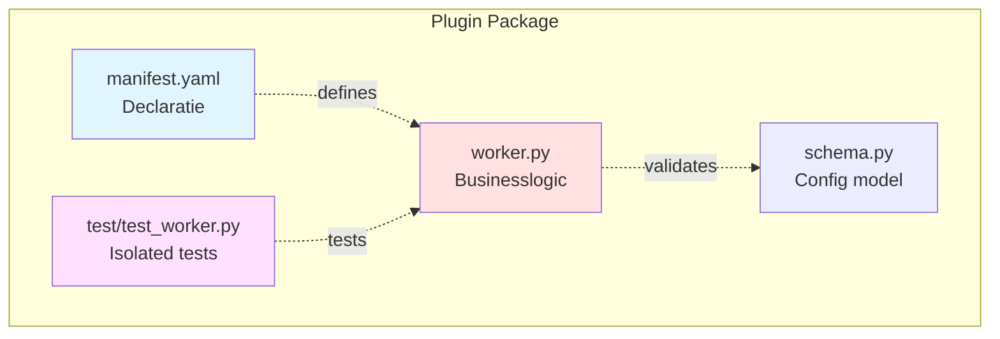

# Core Principles - Vision & Design Philosophy

## Visie

S1mpleTrader V3 is een **plugin-gedreven, event-driven** trading platform dat de volledige levenscyclus van handelsstrategieën ondersteunt. Het systeem is ontworpen voor **modulariteit, testbaarheid en configuratie-gedreven gedrag**.

## De 4 Fundamentele Principes

### 1. Plugin First

**Kernidee:** Alle strategische logica is ingekapseld in **zelfstandige, onafhankelijk testbare plugins**.

**Implicaties:**
- ✅ Workers zijn plugins (geen hardcoded business logic in platform)
- ✅ Elke plugin is een volledige Python package
- ✅ Plugins declareren dependencies via `manifest.yaml`
- ✅ Platform valideert plugin compatibility tijdens bootstrap
- ✅ Plugins kunnen geïsoleerd getest worden (unit tests zonder platform)

**Voorbeeld:**


### 2. Separation of Concerns

**Kernidee:** **Strikte scheiding** tussen wat, waar, hoe en waarmee.

**Componenten:**
- **Workers** (de "wat"): Businesslogic - context, signals, planning
- **ExecutionEnvironment** (de "waar"): Backtest vs Live vs Paper trading
- **Factories** (de "hoe"): Assembly van workers + dependencies
- **EventBus** (de "waarmee"): Communicatie tussen componenten

**Implicaties:**
- ✅ Workers weten NIETS van ExecutionEnvironment
- ✅ ExecutionEnvironment weet NIETS van worker businesslogic
- ✅ Factories orkestreren assembly, workers blijven pure logic
- ✅ EventBus is pure N-N broadcast (geen routing logic)

**Voorbeeld Violation:**
```python
# ❌ FOUT - Worker weet van ExecutionEnvironment
class MyWorker:
    def process(self):
        if self.env.is_backtest():  # VIOLATION!
            ...
```

**Correct:**
```python
# ✅ GOED - Worker krijgt config via dependency injection
class MyWorker:
    def __init__(self, config):
        self.risk_pct = config.risk_percentage
```

### 3. Configuratie-Gedreven

**Kernidee:** Het **gedrag** van de applicatie wordt volledig bestuurd door **mens-leesbare YAML-bestanden**.

**Metafoor:** De code is de motor, de configuratie is de bestuurder.

**Implicaties:**
- ✅ YAML definieert welke workers draaien
- ✅ YAML definieert worker parameters
- ✅ YAML definieert event wiring (worker A → worker B)
- ✅ YAML definieert execution environment
- ✅ Code bevat GEEN hardcoded strategy logic

**Voorbeeld:**
```yaml
# strategy_blueprint.yaml
workforce:
  context_workers:
    - plugin: "ema_detector"
      config:
        period: 20
  
  signal_workers:
    - plugin: "ema_cross_detector"
      config:
        fast_period: 12
        slow_period: 26

wiring:
  - source: "ema_detector"
    target: "ema_cross_detector"
```

**Voordeel:** Strategieën aanpassen = YAML wijzigen, GEEN code changes.

### 4. Contract-Gedreven

**Kernidee:** Alle data-uitwisseling wordt **gevalideerd** door strikte **Pydantic-schema's** (backend) en **TypeScript-interfaces** (frontend).

**Implicaties:**
- ✅ Workers produceren/consumeren Pydantic DTOs
- ✅ Type safety op compile-time (Pylance/mypy)
- ✅ Runtime validatie (Pydantic validators)
- ✅ Auto-generated API docs (OpenAPI/Swagger)
- ✅ Frontend-backend contract enforcement

**Voorbeeld:**
```python
# ✅ GOED - Expliciete DTO contract
class OpportunitySignal(BaseModel):
    signal_id: str
    confidence: Decimal
    signal_type: str
    
    @field_validator('confidence')
    @classmethod
    def validate_confidence(cls, v: Decimal) -> Decimal:
        if not 0 <= v <= 1:
            raise ValueError("Confidence must be 0.0-1.0")
        return v

# Worker output is validated
def process(self) -> DispositionEnvelope:
    signal = OpportunitySignal(  # Type-safe + validated
        signal_id=generate_id(),
        confidence=Decimal("0.85"),
        signal_type="BREAKOUT"
    )
    return DispositionEnvelope(
        disposition="PUBLISH",
        event_payload=signal
    )
```

**Anti-Pattern:**
```python
# ❌ FOUT - Ongevalideerde dicts
def bad_process(self):
    return {
        "confidence": 1.5,  # Runtime error! Not caught at compile time
        "signal_type": "INVALID"
    }
```

## Interactie Tussen Principes

Deze 4 principes **versterken elkaar**:

1. **Plugin First** + **Contract-Gedreven** = Type-safe plugin ecosystem
2. **Separation of Concerns** + **Configuratie-Gedreven** = Flexibele orchestratie zonder coupling
3. **Contract-Gedreven** + **Separation of Concerns** = Testbare interfaces

**Voorbeeld Synergie:**
```yaml
# Config-Gedreven (YAML)
wiring:
  - source: "ema_detector"
    target: "momentum_signal"
```

```python
# Contract-Gedreven (DTO validation)
class EMAOutputDTO(BaseModel):
    ema_20: Decimal

# Separation of Concerns (Worker knows nothing about wiring)
class MomentumSignalWorker(OpportunityWorker):
    def process(self):
        dtos = self.strategy_cache.get_required_dtos(self)
        ema_dto = dtos[EMAOutputDTO]  # Type-safe!
        
# Plugin First (Isolated testable)
def test_momentum_signal():
    mock_cache = Mock()
    mock_cache.get_required_dtos.return_value = {
        EMAOutputDTO: EMAOutputDTO(ema_20=Decimal("50000"))
    }
    worker = MomentumSignalWorker()
    worker.strategy_cache = mock_cache
    result = worker.process()
    assert result.disposition == "PUBLISH"
```

## Consequenties van Violaties

**Principe geschonden → Gevolg:**

| Principe | Violation | Consequentie |
|----------|-----------|--------------|
| Plugin First | Hardcoded strategy logic in platform | Niet testbaar, niet herbruikbaar |
| Separation of Concerns | Worker roept EventBus.publish() direct | Tight coupling, moeilijk testen |
| Configuratie-Gedreven | Worker leest environment variable | Niet reproduceerbaar, configuratie chaos |
| Contract-Gedreven | Dict-based data exchange | Runtime errors, geen type safety |

## Ontwerp Checklist

Bij elke nieuwe feature vraag je:

- [ ] Is dit een plugin of platform component? (Plugin First)
- [ ] Welke component is verantwoordelijk? (Separation of Concerns)
- [ ] Kan dit via YAML geconfigureerd worden? (Configuratie-Gedreven)
- [ ] Is er een Pydantic DTO voor deze data? (Contract-Gedreven)

**Als één van deze vragen "nee" is, heroverweeg het ontwerp.**

## Zie Ook

- [Architectural Shifts](ARCHITECTURAL_SHIFTS.md) - Hoe deze principes zich manifesteren in V3
- [Plugin Anatomy](PLUGIN_ANATOMY.md) - Plugin First in de praktijk
- [Point-in-Time Model](POINT_IN_TIME_MODEL.md) - Contract-Gedreven data flow
- [Configuration Layers](CONFIGURATION_LAYERS.md) - Configuratie-Gedreven in detail
