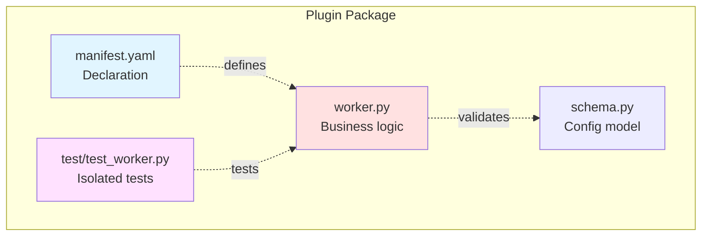

# docs/architecture/CORE_PRINCIPLES.md
# Core Principles - S1mpleTraderV3

**Status:** APPROVED
**Version:** 1.0
**Last Updated:** 2025-11-29

---

## Purpose

This document defines the **4 fundamental design principles** that guide all architectural decisions in S1mpleTrader V3. Every feature, component, and design choice must align with these principles.

**Target audience:** All developers working on the platform.

## Scope

**In Scope:**
- Plugin First principle
- Separation of Concerns principle
- Configuration-Driven principle
- Contract-Driven principle
- Principle interactions and violation consequences

**Out of Scope:**
- Implementation details → See specific architecture docs
- Coding standards → See [CODE_STYLE.md](../coding_standards/CODE_STYLE.md)

---

## 1. Vision

S1mpleTrader V3 is a **plugin-driven, event-driven** trading platform that supports the complete lifecycle of trading strategies. The system is designed for **modularity, testability, and configuration-driven behavior**.

## The 4 Fundamental Principles

### 1. Plugin First

**Core Idea:** All strategic logic is encapsulated in **self-contained, independently testable plugins**.

**Implications:**
- ✅ Workers are plugins (no hardcoded business logic in platform)
- ✅ Each plugin is a complete Python package
- ✅ Plugins declare dependencies via `manifest.yaml`
- ✅ Platform validates plugin compatibility during bootstrap
- ✅ Plugins can be tested in isolation (unit tests without platform)

**Example:**

```mermaid
graph TD
    subgraph Plugin["Plugin Package"]
        M[manifest.yaml<br/>Declaration]
        W[worker.py<br/>Business logic]
        S[schema.py<br/>Config model]
        T[test/test_worker.py<br/>Isolated tests]
    end
    
    M -.defines.-> W
    W -.validates.-> S
    T -.tests.-> W
    
    style M fill:#e1f5ff
    style W fill:#ffe1e1
    style T fill:#ffe1ff
```

### 2. Separation of Concerns

**Core Idea:** **Strict separation** between what, where, how, and with what.

**Components:**
- **Workers** (the "what"): Business logic - context, signals, planning
- **ExecutionEnvironment** (the "where"): Backtest vs Live vs Paper trading
- **Factories** (the "how"): Assembly of workers + dependencies
- **EventBus** (the "with what"): Communication between components

**Implications:**
- ✅ Workers know NOTHING about ExecutionEnvironment
- ✅ ExecutionEnvironment knows NOTHING about worker business logic
- ✅ Factories orchestrate assembly, workers remain pure logic
- ✅ EventBus is pure N-N broadcast (no routing logic)

**Example Violation:**
```python
# ❌ WRONG - Worker knows about ExecutionEnvironment
class MyWorker:
    def process(self):
        if self.env.is_backtest():  # VIOLATION!
            ...
```

**Correct:**
```python
# ✅ GOOD - Worker receives config via dependency injection
class MyWorker:
    def __init__(self, config):
        self.risk_pct = config.risk_percentage
```

### 3. Configuration-Driven

**Core Idea:** The **behavior** of the application is fully controlled by **human-readable YAML files**.

**Metaphor:** The code is the engine, the configuration is the driver.

**Implications:**
- ✅ YAML defines which workers run
- ✅ YAML defines worker parameters
- ✅ YAML defines event wiring (worker A → worker B)
- ✅ YAML defines execution environment
- ✅ Code contains NO hardcoded strategy logic

**Example:**
```yaml
# strategy_blueprint.yaml
workforce:
  context_workers:
    - plugin: "ema_detector"
      config:
        period: 20
  
  signal_workers:
    - plugin: "ema_cross_detector"
      config:
        fast_period: 12
        slow_period: 26

wiring:
  - source: "ema_detector"
    target: "ema_cross_detector"
```

**Advantage:** Adjusting strategies = modifying YAML, NO code changes.

### 4. Contract-Driven

**Core Idea:** All data exchange is **validated** by strict **Pydantic schemas** (backend) and **TypeScript interfaces** (frontend).

**Implications:**
- ✅ Workers produce/consume Pydantic DTOs
- ✅ Type safety at compile-time (Pylance/mypy)
- ✅ Runtime validation (Pydantic validators)
- ✅ Auto-generated API docs (OpenAPI/Swagger)
- ✅ Frontend-backend contract enforcement

**Example:**
```python
# ✅ GOOD - Explicit DTO contract
class Signal(BaseModel):
    signal_id: str
    confidence: Decimal
    signal_type: str
    
    @field_validator('confidence')
    @classmethod
    def validate_confidence(cls, v: Decimal) -> Decimal:
        if not 0 <= v <= 1:
            raise ValueError("Confidence must be 0.0-1.0")
        return v

# Worker output is validated
def process(self) -> DispositionEnvelope:
    signal = Signal(  # Type-safe + validated
        signal_id=generate_id(),
        confidence=Decimal("0.85"),
        signal_type="BREAKOUT"
    )
    return DispositionEnvelope(
        disposition="PUBLISH",
        event_payload=signal
    )
```

**Anti-Pattern:**
```python
# ❌ WRONG - Unvalidated dicts
def bad_process(self):
    return {
        "confidence": 1.5,  # Runtime error! Not caught at compile time
        "signal_type": "INVALID"
    }
```

## Interaction Between Principles

These 4 principles **reinforce each other**:

1. **Plugin First** + **Contract-Driven** = Type-safe plugin ecosystem
2. **Separation of Concerns** + **Configuration-Driven** = Flexible orchestration without coupling
3. **Contract-Driven** + **Separation of Concerns** = Testable interfaces

**Example Synergy:**
```yaml
# Configuration-Driven (YAML)
wiring:
  - source: "ema_detector"
    target: "momentum_signal"
```

```python
# Contract-Driven (DTO validation)
class EMAOutputDTO(BaseModel):
    ema_20: Decimal

# Separation of Concerns (Worker knows nothing about wiring)
class MomentumSignalWorker(SignalDetector):
    def process(self):
        dtos = self.strategy_cache.get_required_dtos(self)
        ema_dto = dtos[EMAOutputDTO]  # Type-safe!
        
# Plugin First (Isolated testable)
def test_momentum_signal():
    mock_cache = Mock()
    mock_cache.get_required_dtos.return_value = {
        EMAOutputDTO: EMAOutputDTO(ema_20=Decimal("50000"))
    }
    worker = MomentumSignalWorker()
    worker.strategy_cache = mock_cache
    result = worker.process()
    assert result.disposition == "PUBLISH"
```

## Consequences of Violations

**Principle violated → Consequence:**

| Principle | Violation | Consequence |
|----------|-----------|-------------|
| Plugin First | Hardcoded strategy logic in platform | Not testable, not reusable |
| Separation of Concerns | Worker calls EventBus.publish() directly | Tight coupling, hard to test |
| Configuration-Driven | Worker reads environment variable | Not reproducible, configuration chaos |
| Contract-Driven | Dict-based data exchange | Runtime errors, no type safety |

## Design Checklist

For every new feature, ask:

- [ ] Is this a plugin or platform component? (Plugin First)
- [ ] Which component is responsible? (Separation of Concerns)
- [ ] Can this be configured via YAML? (Configuration-Driven)
- [ ] Is there a Pydantic DTO for this data? (Contract-Driven)

**If any of these questions is "no", reconsider the design.**

---

## See Also

- [Plugin Anatomy](PLUGIN_ANATOMY.md) - Plugin First in practice
- [Point-in-Time Model](POINT_IN_TIME_MODEL.md) - Contract-Driven data flow
- [Configuration Layers](CONFIGURATION_LAYERS.md) - Configuration-Driven in detail
---

## Version History

| Version | Date | Author | Changes |
|---------|------|--------|--------|
| 1.0 | 2025-10-29 | Team | Initial document |
| 1.1 | 2025-11-29 | AI | English translation |
