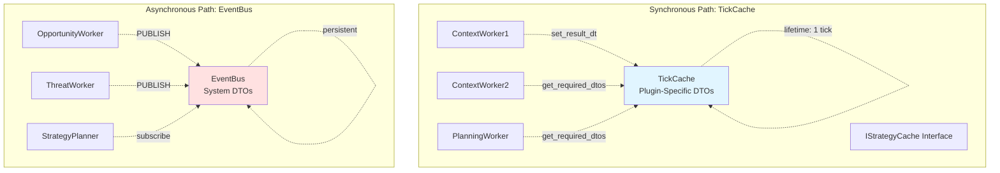
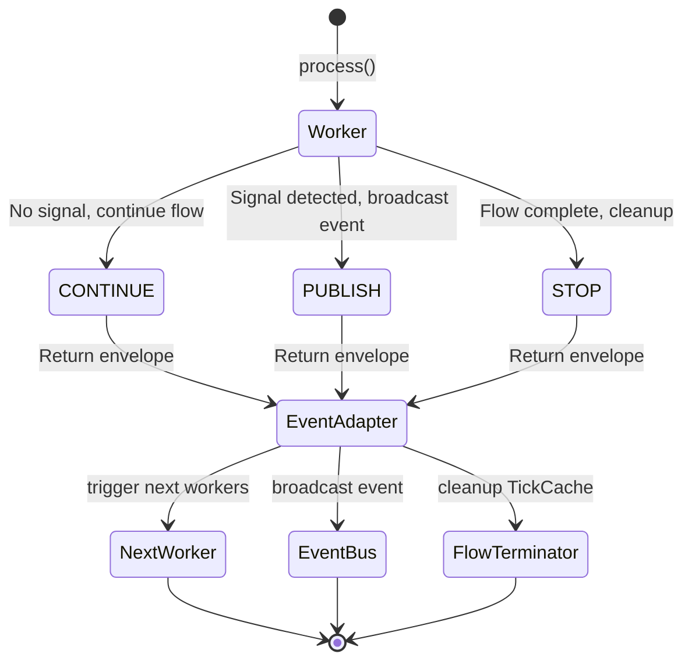

# Data Flow Architecture

**Status:** Architecture Foundation  
**Last Updated:** 2025-10-29

---

## Overview

S1mpleTraderV3 uses a **point-in-time data model** where all data exchange is based on a specific moment (tick), not accumulated datasets. Workers communicate through two distinct paths: **TickCache** (synchronous flow, objective facts) and **EventBus** (asynchronous signals, subjective interpretations).



**Key Principles:**
- **Point-in-Time**: No growing DataFrames, only DTOs for current tick
- **Two Paths**: TickCache for flow data, EventBus for signals
- **Type-Safe**: All data exchange via Pydantic DTOs
- **Explicit Dependencies**: Workers declare required DTOs in manifest

---

## The Two Communication Paths

### 1. TickCache - Synchronous Flow Data

**Purpose:** Direct worker-to-worker data transfer within a single tick flow

**Interface:** `IStrategyCache`

**Characteristics:**
- **Content:** Plugin-specific DTOs only (e.g., `EMAOutputDTO`, `RegimeOutputDTO`)
- **Nature:** Objective facts without interpretation (e.g., ema_20=50100.50, NOT "bullish")
- **Lifetime:** Single tick/flow (cleared after tick completes)
- **Access:** Via `IStrategyCache` (injected into workers)
- **Usage:** Context enrichment, intermediate calculations, planning sub-components
- **Philosophy:** ContextWorkers produce facts, consumers apply interpretation

**Worker Pattern:**
```python
class EMADetector(StandardWorker):
    strategy_cache: IStrategyCache  # Injected by WorkerFactory
    
    def process(self) -> DispositionEnvelope:
        # 1. Get run anchor (timestamp validation)
        run_anchor = self.strategy_cache.get_run_anchor()
        
        # 2. Calculate EMA (OBJECTIVE FACT)
        ema_value = calculate_ema(...)
        
        # 3. Store OBJECTIVE DTO to TickCache (NO interpretation!)
        output_dto = EMAOutputDTO(ema_20=ema_value, timestamp=run_anchor.timestamp)
        self.strategy_cache.set_result_dto(self, output_dto)
        
        # 4. Signal continuation
        return DispositionEnvelope(disposition="CONTINUE")
```

**Key Methods:**
- `get_run_anchor() -> RunAnchor` - Get current tick timestamp
- `set_result_dto(worker, dto)` - Store plugin-specific DTO
- `get_required_dtos(worker) -> dict[Type, BaseModel]` - Retrieve dependencies

---

### 2. EventBus - Asynchronous Signals

**Purpose:** External signals, alerts, decisions (strategy-level communication)

**Interface:** `DispositionEnvelope` return value

**Characteristics:**
- **Content:** System DTOs only (e.g., `OpportunitySignal`, `ThreatSignal`, `StrategyDirective`)
- **Lifetime:** Persistent until consumed by subscribers
- **Access:** Via `DispositionEnvelope(PUBLISH, ...)`
- **Usage:** Opportunity/threat signals, strategy decisions, execution directives

**Worker Pattern:**
```python
class BreakoutScout(StandardWorker):
    def process(self) -> DispositionEnvelope:
        # 1. Detect breakout
        if breakout_detected:
            # 2. Publish signal to EventBus
            return DispositionEnvelope(
                disposition="PUBLISH",
                event_name="OPPORTUNITY_DETECTED",
                event_payload=OpportunitySignal(  # System DTO!
                    signal_type="BREAKOUT",
                    confidence=0.85,
                    causality=...
                )
            )
        
        # 3. No signal - continue flow
        return DispositionEnvelope(disposition="CONTINUE")
```

---

## DispositionEnvelope Contract

**Definition:**
```python
@dataclass
class DispositionEnvelope:
    disposition: Literal["CONTINUE", "PUBLISH", "STOP"]
    event_name: Optional[str] = None          # Required for PUBLISH
    event_payload: Optional[BaseModel] = None # Required for PUBLISH (system DTO!)
```



### Disposition Types

#### 1. CONTINUE - Flow Progression

**When to use:** Worker completed processing, next worker(s) should execute

**Behavior:**
- EventAdapter triggers next worker(s) per `wiring_map.yaml`
- Adapter publishes internal system event for flow tracking
- TickCache data remains available for downstream workers

**Example:**
```python
# ContextWorker stores intermediate data
self.strategy_cache.set_result_dto(self, IndicatorSignalDTO(...))
return DispositionEnvelope(disposition="CONTINUE")
```

---

#### 2. PUBLISH - Signal Broadcasting

**When to use:** Worker detected signal/decision that needs platform-wide distribution

**Requirements:**
- `event_name` must be specified (custom event name)
- `event_payload` must be a **system DTO** (OpportunitySignal, ThreatSignal, StrategyDirective, etc.)

**Behavior:**
- Adapter validates payload is system DTO
- Publishes custom event to EventBus
- All subscribers to `event_name` are notified
- Flow may continue or stop (depends on wiring)

**Example:**
```python
# OpportunityWorker publishes signal
return DispositionEnvelope(
    disposition="PUBLISH",
    event_name="MOMENTUM_OPPORTUNITY",
    event_payload=OpportunitySignal(
        signal_type="MOMENTUM_BREAKOUT",
        confidence=0.92,
        causality=self._build_causality()
    )
)
```

**Valid System DTOs:**
- `OpportunitySignal` - Trading opportunity detected
- `ThreatSignal` - Risk/threat detected
- `StrategyDirective` - Strategy decision made
- `ExecutionDirective` - Execution plan ready (from platform aggregator)

---

#### 3. STOP - Flow Termination

**When to use:** Flow should end (final worker, error condition, no-action decision)

**Behavior:**
- Adapter publishes flow-stop event (e.g., `{strategy_id}_flow_stop`)
- FlowTerminator component handles cleanup
- TickCache is cleared
- Causality chain is logged to journal

**Example:**
```python
# StrategyPlanner decides no action
if not should_trade:
    return DispositionEnvelope(disposition="STOP")
```

---

## Worker Data Access Pattern

### Complete Example

```python
class MyOpportunityWorker(StandardWorker):
    # Dependencies injected by WorkerFactory
    strategy_cache: IStrategyCache
    ohlcv_provider: IOhlcvProvider
    state_provider: Optional[IStateProvider]  # If capability requested
    
    def process(self) -> DispositionEnvelope:
        # Step 1: Get run anchor (timestamp validation)
        run_anchor = self.strategy_cache.get_run_anchor()
        timestamp = run_anchor.timestamp
        
        # Step 2: Retrieve required DTOs from TickCache
        required_dtos = self.strategy_cache.get_required_dtos(self)
        ema_dto = required_dtos[EMAOutputDTO]
        regime_dto = required_dtos[RegimeOutputDTO]
        
        # Step 3: Get platform data
        df = self.ohlcv_provider.get_window(timestamp, lookback=100)
        
        # Step 4: Optional - Get persisted state
        if self.state_provider:
            last_signal = self.state_provider.get("last_signal_time")
        
        # Step 5: Detect opportunity
        if self._is_opportunity(ema_dto, regime_dto, df):
            # Step 6A: Publish signal
            return DispositionEnvelope(
                disposition="PUBLISH",
                event_name="OPPORTUNITY_DETECTED",
                event_payload=OpportunitySignal(...)
            )
        else:
            # Step 6B: Continue without signal
            return DispositionEnvelope(disposition="CONTINUE")
```

---

## DTO Sharing via Enrollment

**Plugin-Specific DTOs** are shared through a central registry:

### 1. Definition
Developer defines DTO in plugin's `dtos/` folder:
```python
# plugins/context_workers/ema_detector/dtos/ema_output_dto.py
from pydantic import BaseModel

class EMAOutputDTO(BaseModel):
    ema_20: float
    ema_50: float
    timestamp: datetime
```

### 2. Manifest Declaration
Plugin declares produced DTOs in `manifest.yaml`:
```yaml
dependencies:
  produces_dtos:
    - dto_class: "EMAOutputDTO"
      local_path: "dtos/ema_output_dto.py"
```

### 3. Enrollment
Platform copies to central registry during plugin enrollment:
```
backend/dto_reg/<vendor>/<plugin>/<version>/ema_output_dto.py
```

### 4. Consumption
Other plugins import from central location:
```python
from backend.dto_reg.s1mple.ema_detector.v1_0_0.ema_output_dto import EMAOutputDTO
```

### 5. Dependency Declaration
Consuming plugin declares requirement in manifest:
```yaml
dependencies:
  requires_dtos:
    - source: "backend.dto_reg.s1mple.ema_detector.v1_0_0.ema_output_dto"
      dto_class: "EMAOutputDTO"
```

---

## Platform Capabilities (Data Providers)

Workers request capabilities via `manifest.yaml` to access platform data:

### Standard Capability (Always Available)
```yaml
capabilities:
  context_access:
    enabled: true  # IStrategyCache (NOT configurable)
```

### Opt-In Capabilities
```yaml
capabilities:
  ohlcv_window:
    enabled: true  # IOhlcvProvider - OHLCV historical data
  
  multi_timeframe:
    enabled: true  # IMtfProvider - Multiple timeframe access
  
  state_persistence:
    enabled: true  # IStateProvider - Worker state storage
    scope: "strategy"  # OR "global"
  
  market_depth:
    enabled: true  # IDepthProvider - Order book data
  
  ledger_state:
    enabled: true  # ILedgerProvider - Portfolio/position state
  
  journaling:
    enabled: true  # IJournalWriter - Audit trail logging
```

**WorkerFactory** reads manifest, validates contracts, and injects requested providers at instantiation.

---

## Flow Example: Context → Opportunity → Planning

### Tick Start
```
TickCacheManager receives tick
└─> Publishes TICK_RECEIVED event
    └─> EventAdapter triggers ContextWorker
```

### Context Phase
```python
# EMADetector (ContextWorker)
def process(self):
    ema_value = calculate_ema(...)
    self.strategy_cache.set_result_dto(self, EMAOutputDTO(ema_20=ema_value))
    return DispositionEnvelope(disposition="CONTINUE")  # ← Triggers next worker
```

### Opportunity Phase
```python
# BreakoutScout (OpportunityWorker)
def process(self):
    required_dtos = self.strategy_cache.get_required_dtos(self)
    ema_dto = required_dtos[EMAOutputDTO]  # ← Retrieved from TickCache
    
    if ema_dto.ema_20 > resistance_level:
        return DispositionEnvelope(
            disposition="PUBLISH",  # ← Publishes to EventBus
            event_name="BREAKOUT_OPPORTUNITY",
            event_payload=OpportunitySignal(...)
        )
```

### Planning Phase
```python
# LimitEntryPlanner (PlanningWorker)
# Triggered by BREAKOUT_OPPORTUNITY event
def process(self):
    entry_plan = EntryPlan(entry_type="LIMIT", price=...)
    self.strategy_cache.set_result_dto(self, entry_plan)  # ← Sub-component
    return DispositionEnvelope(disposition="CONTINUE")
```

---

## Related Documentation

- **[Worker Taxonomy](WORKER_TAXONOMY.md)** - Worker categories and responsibilities
- **[Plugin Anatomy](PLUGIN_ANATOMY.md)** - How to implement workers
- **[Point-in-Time Model](POINT_IN_TIME_MODEL.md)** - DTO-centric data architecture
- **[Event-Driven Wiring](EVENT_DRIVEN_WIRING.md)** - EventAdapter configuration

---

**Last Updated:** 2025-10-29
