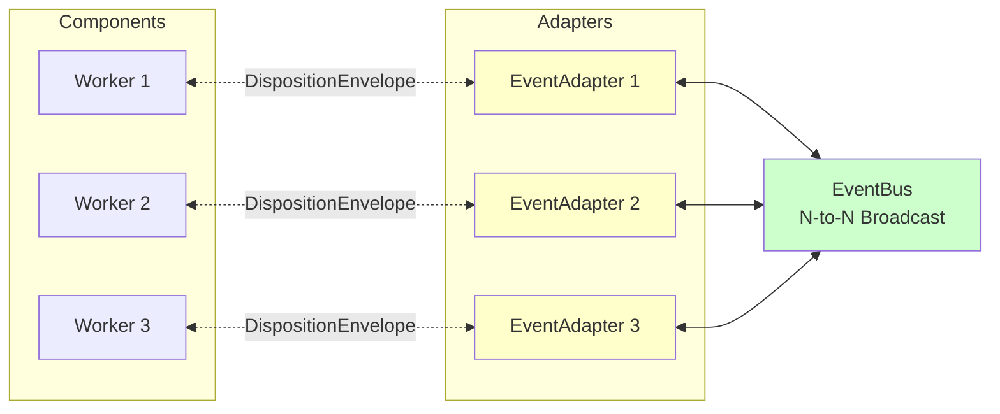
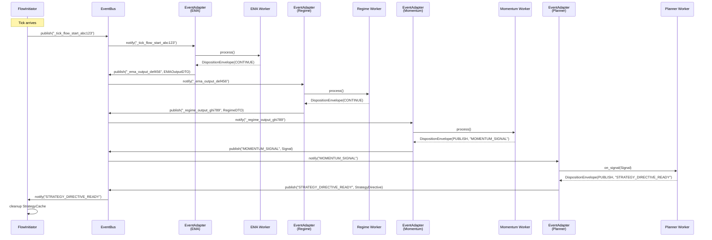
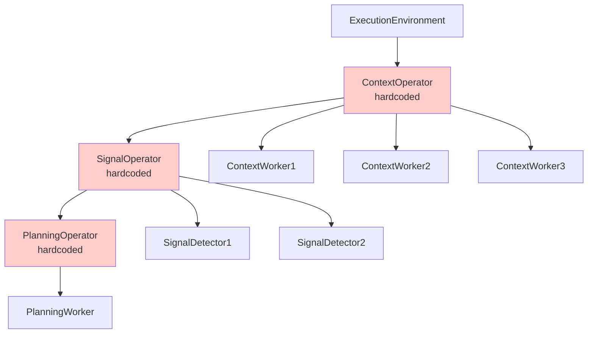
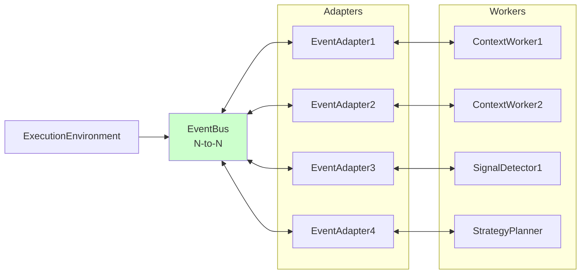

# Event-Driven Wiring

**Status:** Architecture Foundation  
**Last Updated:** 2025-10-29

---

## Overview

S1mpleTraderV3 uses an **event-driven architecture** where components (workers, singletons) communicate via EventBus and EventAdapters. This **flattened orchestration** replaces V2's operator-based model with direct, flexible wiring configured via YAML.



**Key Principles:**
- **No Operators**: Workers wired directly via EventAdapters (not grouped)
- **EventBus = N-to-N Broadcast**: Pure publish-subscribe, not point-to-point routing
- **One Adapter per Component**: Clear ownership and isolation
- **Configuration-Driven**: Wiring defined in `wiring_map.yaml`, generated by UI

---

## EventBus: Pure N-to-N Broadcast

### Purpose
EventBus is a **broadcast bus** for N-to-N communication, NOT a point-to-point router

### Characteristics
- **Publish-Subscribe**: Publishers don't know subscribers, subscribers don't know publishers
- **No Routing Logic**: EventBus doesn't interpret events or make routing decisions
- **Type Agnostic**: EventBus doesn't care about event payload types
- **Decoupling**: Components are bus-agnostic (communicate via EventAdapters)

### Two Event Types

#### 1. System Events (Internal, Flow Control)

**Purpose:** Flow coordination and data propagation

**Characteristics:**
- Generated by EventAdapters for `CONTINUE` disposition
- Unique names with UUID: `_worker_A_output_abc123`, `_tick_flow_start_xyz789`
- **Contain system DTO payloads** for flow continuity
- Not declared in manifest (automatically generated)

**Example:**
```python
# EventAdapter publishes system event after worker returns CONTINUE
event_name = f"_ema_detector_output_{uuid4()}"
eventbus.publish(
    event_name=event_name,
    payload=EMAOutputDTO(...)  # System DTO in payload!
)
```

---

#### 2. Custom Events (Public, Signals)

**Purpose:** Strategy-level signals and alerts

**Characteristics:**
- Declared in worker manifest (`publishes` section)
- Published via `PUBLISH` disposition
- Human-readable names: `SIGNAL_DETECTED`, `EMERGENCY_HALT`
- **No payload** (data retrieved from StrategyCache by subscribers)

**Example:**
```python
# Worker publishes custom event
return DispositionEnvelope(
    disposition="PUBLISH",
    event_name="BREAKOUT_SIGNAL",
    event_payload=Signal(...)  # Payload goes to StrategyCache, not event!
)
```

**Note:** This is a V2 pattern. V3 may include system DTOs in event payloads for easier consumption.

---

## EventAdapter: The Executor

### Purpose
EventAdapter is the **glue** between EventBus and components (workers, singletons)

**Key Concept:** Each component gets its **own** EventAdapter (1-to-1 relationship)

### Responsibilities

#### 1. Listen
- Subscribe to events specified in `wiring_spec`
- React when subscribed events are published

#### 2. Invoke
- Call component method with event payload
- Map event names to handler methods (`event_name → handler_method`)

#### 3. Interpret DispositionEnvelope
- Process worker's return value (DispositionEnvelope)
- Execute appropriate action based on disposition

#### 4. Publish
Execute publication instructions from DispositionEnvelope:

**CONTINUE Disposition:**
- Publish internal system event with unique UUID name
- Include system DTO in payload (for next worker)
- Event name format: `_{worker_id}_output_{uuid}`

**PUBLISH Disposition:**
- Publish custom event (from manifest)
- Validate event name is declared in manifest
- In V3: Include system DTO in payload

**STOP Disposition:**
- Publish flow-stop event
- Event name format: `_{strategy_id}_flow_stop_{uuid}`
- Trigger cleanup (FlowTerminator)

---

### EventAdapter Configuration

EventAdapters are configured by `EventWiringFactory` during bootstrap:

```python
adapter_config = {
    # Component reference
    'component_ref': worker_instance,
    'component_id': 'ema_detector_instance_1',
    
    # EventBus reference
    'eventbus_ref': eventbus,
    
    # Subscriptions (which events to listen to)
    'subscriptions': [
        '_tick_flow_start_abc123',  # System event from FlowInitiator
        '_regime_classifier_output_def456'  # System event from previous worker
    ],
    
    # Handler mapping (event → method)
    'handler_mapping': {
        '_tick_flow_start_abc123': 'process',
        '_regime_classifier_output_def456': 'process'
    },
    
    # Publication configuration
    'publication_config': {
        # System events (CONTINUE disposition)
        'system_events': {
            'CONTINUE': {
                'event_name': '_ema_detector_output_xyz789',  # UUID-based name
                'payload_dto_type': 'EMAOutputDTO'
            }
        },
        
        # Custom events (PUBLISH disposition)
        'custom_events': ['INDICATOR_UPDATED'],
        
        # Stop event (STOP disposition)
        'stop_event': '_strategy_btc_flow_stop_uvw456'
    }
}
```
---

## Wiring Configuration

### Base Wiring Template (Platform)

**File:** `base_wiring.yaml`

**Purpose:** Generic wiring rules for worker categories (reusable templates)

```yaml
base_wiring_id: "standard_trading_flow_v1"
description: "Standard trading pipeline: Context → Signal → Planning → Strategy"

wiring_rules:
  # Indicator → SignalDetector
  - wiring_id: "ind_to_sig"
    source:
      component_category: "ContextWorker"  # Category, not instance
      event_pattern: "IndicatorOutput"
      event_type: "SystemEvent"
    target:
      component_category: "SignalDetector"
      handler_method: "process"
  
  # Signal → StrategyPlanner
  - wiring_id: "sig_to_planner"
    source:
      component_category: "SignalDetector"
      event_pattern: "Signal"
      event_type: "SystemEvent"
    target:
      component_category: "StrategyPlanner"
      handler_method: "process"
```

**Note:** Base wiring uses **categories**, not specific instances

---

### Strategy Wiring Map (Generated by UI)

**File:** `strategy_wiring_map.yaml`

**Purpose:** Concrete wiring for specific worker instances in a strategy

**Generated By:** UI (based on base_wiring.yaml + workforce definition)

```yaml
strategy_wiring_id: "btc_momentum_strategy_wiring"
strategy_ref: "btc_momentum_long"

wiring_rules:
  # Tick flow start → First context worker
  - wiring_id: "tick_to_ema"
    source:
      component_id: "tick_cache_manager"  # Singleton
      event_name: "TICK_FLOW_START"
      event_type: "SystemEvent"
    target:
      component_id: "ema_detector_instance_1"  # Specific instance!
      handler_method: "process"
  
  # EMA → Regime (context chain)
  - wiring_id: "ema_to_regime"
    source:
      component_id: "ema_detector_instance_1"
      event_name: "_ema_detector_output_abc123"  # UUID-based
      event_type: "SystemEvent"
    target:
      component_id: "regime_classifier_instance_1"
      handler_method: "process"
  
  # Regime → SignalDetector (category transition)
  - wiring_id: "regime_to_momentum"
    source:
      component_id: "regime_classifier_instance_1"
      event_name: "_regime_classifier_output_def456"
      event_type: "SystemEvent"
    target:
      component_id: "momentum_scout_instance_1"
      handler_method: "process"
  
  # Signal → Strategy Planner
  - wiring_id: "momentum_to_planner"
    source:
      component_id: "momentum_scout_instance_1"
      event_name: "MOMENTUM_SIGNAL"
      event_type: "CustomEvent"
    target:
      component_id: "momentum_planner_instance_1"
      handler_method: "on_signal"
  
  # Emergency halt (custom event example)
  - wiring_id: "risk_to_emergency"
    source:
      component_id: "drawdown_monitor_instance_1"
      event_name: "EMERGENCY_HALT"
      event_type: "CustomEvent"
    target:
      component_id: "emergency_executor_instance_1"
      handler_method: "on_emergency_halt"
```

**Key Differences from Base Wiring:**
- Uses **concrete instance IDs**, not categories
- Includes **unique event names** (with UUIDs)
- Generated by UI based on workforce definition

---

## FlowInitiator: Flow Initiator

### Purpose
Singleton that manages tick flow lifecycle

### Responsibilities

#### 1. Listen for Initiating Events
```yaml
subscriptions:
  - RAW_TICK              # From ExecutionEnvironment
  - SCHEDULED_TASK:weekly_dca  # From Scheduler
  - NEWS_RECEIVED         # From external adapter
```

#### 2. On Event Receipt
```python
def on_initiating_event(self, event_name, payload):
    # 1. Create new StrategyCache snapshot
    tick_cache = {}
    timestamp = extract_timestamp(payload)
    
    # 2. Configure IStrategyCache
    self.strategy_cache.start_new_strategy_run(tick_cache, timestamp)
    
    # 3. Publish flow start event
    self.eventbus.publish(
        event_name="TICK_FLOW_START",
        payload=RunAnchor(timestamp=timestamp)
    )
```

#### 3. Workers Start Flow
- First workers in chain subscribe to `TICK_FLOW_START`
- Workers use `IStrategyCache` for data access
- Flow proceeds via `wiring_map.yaml` rules

#### 4. Cleanup
```python
def on_flow_complete(self, event_name, payload):
    # Listen for TICK_FLOW_COMPLETE or timeout
    self.strategy_cache.release_cache()
```

---

## Wiring Example: Complete Flow

### Scenario
BTC momentum strategy with EMA → Regime → SignalDetector → Planner



---

## Architectural Evolution: V2 vs V3

### V2 (Deprecated): Operator-Based



**Problems:**
- Hardcoded worker groupings
- Operators created unnecessary abstraction layer
- Inflexible wiring (couldn't skip categories)

---

### V3 (Current): Flattened Orchestration



**Improvements:**
- No operators (removed abstraction layer)
- Flexible wiring via `wiring_map.yaml`
- Workers can be chained in any order
- UI generates wiring from base templates

---

## Related Documentation

- **[Data Flow](DATA_FLOW.md)** - DispositionEnvelope and communication patterns
- **[Worker Taxonomy](WORKER_TAXONOMY.md)** - Worker categories and event patterns
- **[Layered Architecture](LAYERED_ARCHITECTURE.md)** - EventWiringFactory role in bootstrap
- **[Architectural Shifts](ARCHITECTURAL_SHIFTS.md)** - Platgeslagen Orkestratie (Shift #1)

---

**Last Updated:** 2025-10-29
