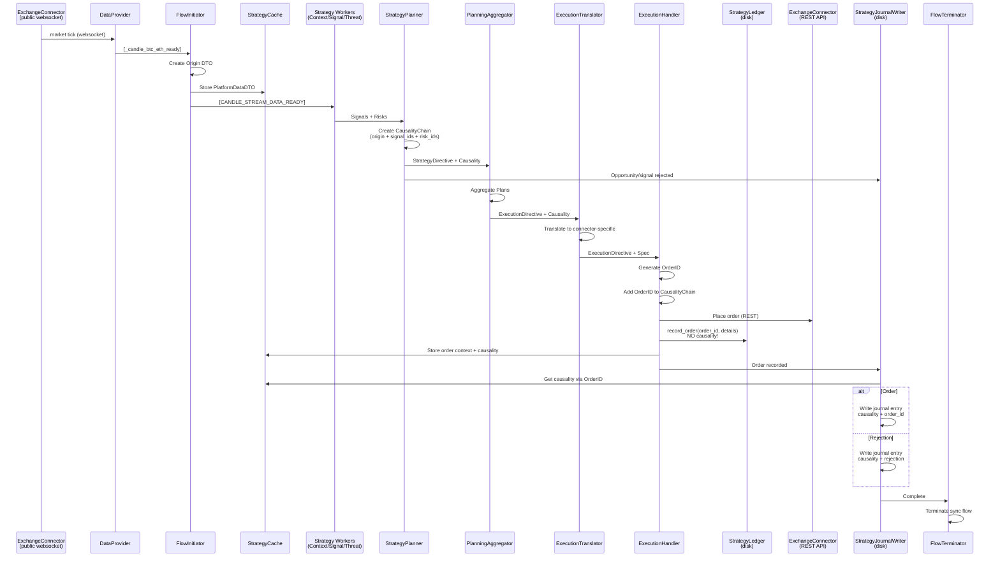
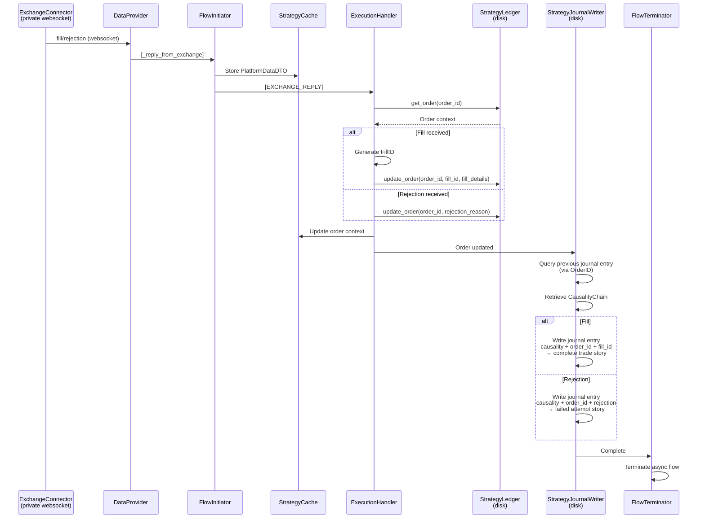
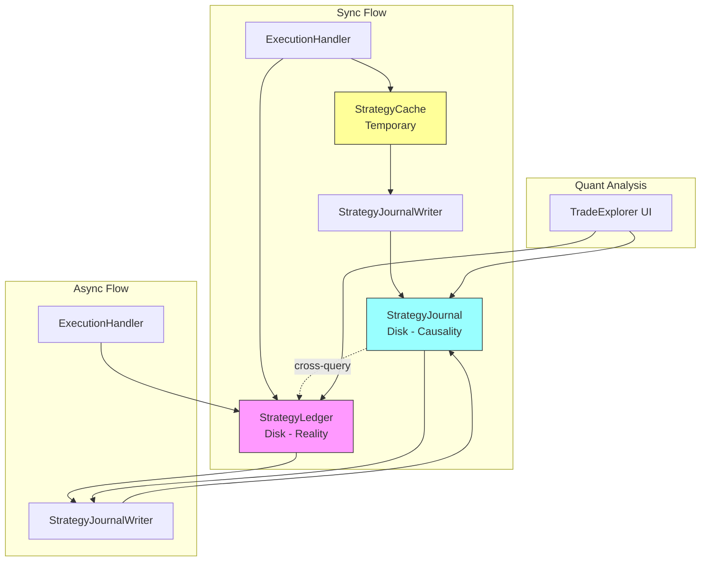

# Execution Flow Architecture - S1mpleTraderV3

**Status:** Architectural Contract - Definitive  
**Versie:** 1.0  
**Datum:** 2025-11-08

---

## Executive Summary

Dit document beschrijft de **complete execution flow** binnen een strategie - twee parallelle flows die beide via DataProvider → FlowInitiator starten. Dit document is **event bus agnostic** en focust op technische data flow.

**Flow 1: Sync Strategy Flow (Market Data → Order Placement)**
```
ExchangeConnector (public websocket: market ticks)
    ↓ 
DataProvider → [_candle_btc_eth_ready]
    ↓ 
FlowInitiator → [CANDLE_STREAM_DATA_READY] → StrategyCache
    ↓
Context Workers → Signal Detector / Threat Monitor → StrategyPlanner
    ↓
Entry/Exit/Size Planners → PlanningAggregator → ExecutionIntentPlanner
    ↓
PlanningAggregator → ExecutionTranslator
    ↓
ExecutionHandler 
    ├→ Creates OrderID
    ├→ Adds OrderID to CausalityChain
    ├→ ExchangeConnector (REST API: places order)
    └→ StrategyLedger.record_order(order_id, order_details)  ← NO causality!
    ↓
StrategyJournalWriter
    ├→ Retrieves CausalityChain from StrategyCache (via OrderID)
    └→ Writes journal entry: causality + order_id → causality persistence
    ↓
FlowTerminator
```

**Flow 2: Async Exchange Reply Flow (Fills/Rejections → Trade Reality)**
```
ExchangeConnector (private websocket: fills/rejections)
    ↓ 
DataProvider → [_reply_from_exchange]
    ↓ 
FlowInitiator → [EXCHANGE_REPLY] → StrategyCache
    ↓
ExecutionHandler
    ├→ Queries StrategyLedger.get_order(order_id)
    ├→ Generates FillID (if fill)
    └→ Updates StrategyLedger.update_order(order_id, fill_id, fill_details)
    ↓
StrategyJournalWriter
    ├→ Retrieves CausalityChain from previous journal entry (via OrderID lookup)
    └→ Writes journal entry: causality + order_id + fill_id → complete trade story
    ↓
FlowTerminator
```

**SRP Separation:**
- **StrategyLedger**: Persists order/fill/trade reality ONLY (NO causality storage)
- **StrategyJournalWriter**: Persists causality + correlates order_ids + fill_ids
- **FillID**: Symmetric ID (FIL_...) - captures actual execution (may differ from order)
- **Quant Analysis**: Cross-query StrategyJournal ↔ StrategyLedger via order_id/fill_id

**Key Principle:** 
> Order reality (StrategyLedger) and causality (StrategyJournal) are separate persistence concerns, correlated via order_id + fill_id for complete trade story analysis.

**Cross-reference:** PIPELINE_FLOW.md (phases 0-4), [CAUSALITY_CHAIN_DESIGN.md](../development/backend/dtos/CAUSALITY_CHAIN_DESIGN.md) (causality propagation)

---

## 1. Sync Flow - Market Data to Order Placement

### 1.1 Complete Flow Diagram



### 1.2 Key Operations

**FlowInitiator:**
- Creates Origin DTO from platform data
- Stores PlatformDataDTO in StrategyCache
- Initiates strategy flow with CANDLE_STREAM_DATA_READY event

**StrategyPlanner:**
- Creates CausalityChain with Origin (from PlatformDataDTO)
- Adds signal_ids, risk_ids during flow
- Propagates causality through pipeline

**ExecutionHandler:**
- Generates OrderID: `ORD_{YYYYMMDD}_{HHMMSS}_{hash}`
- Adds OrderID to CausalityChain: `causality.order_ids.append(order_id)`
- Stores order context + causality in StrategyCache
- Records order in StrategyLedger (NO causality storage!)

**StrategyLedger:**
- Persists order reality: status, details, timestamps
- NO causality storage (SRP separation)
- Queryable by ExecutionHandler (async flow)

**StrategyJournalWriter:**
- Retrieves CausalityChain from StrategyCache (via OrderID)
- Retrieves Context DTO's produced by StrategyWorkers from StrategyCache
- Writes journal entry: causality + order_id correlation + Context
- Enables later quant analysis

---

## 2. Async Flow - Exchange Reply to Trade Reality

### 2.1 Complete Flow Diagram



### 2.2 Key Operations

**FlowInitiator:**
- Stores PlatformDataTO in StrategyCache
- Triggers EXCHANGE_REPLY event

**ExecutionHandler (Async):**
- Queries StrategyLedger for order context
- Generates FillID: `FIL_{YYYYMMDD}_{HHMMSS}_{hash}` (if fill)
- Updates StrategyLedger with fill/rejection

**FillID Rationale:**
- Symmetric ID captures actual execution
- May differ from order (partial fills, price deviation)
- Enables precise trade reconstruction

**StrategyJournalWriter (Async):**
- Queries previous journal entry via OrderID
- Retrieves CausalityChain from previous entry
- Retrieves Context DTO's produced by StrategyWorkers from StrategyCache
- Writes updated entry: causality + order_id + fill_id + context
- Creates complete trade story: intent → order → fill → outcome

---

## 3. SRP Component Responsibilities

### 3.1 Responsibility Matrix

| Component | Responsibility | Stores Causality? | Stores Reality? |
|-----------|---------------|-------------------|-----------------|
| **ExecutionHandler** | Creates OrderID, updates CausalityChain | Via StrategyCache | No |
| **StrategyLedger** | Persists order/fill/trade reality | ❌ NO | ✅ YES |
| **StrategyJournalWriter** | Persists causality + correlates IDs | ✅ YES | ❌ NO |
| **StrategyCache** | Temporary context storage | ✅ YES (temp) | ✅ YES (temp) |

### 3.2 Storage Architecture



### 3.3 ID Propagation Pattern

```
Origin (in PlatformDataDTO)
    ↓
CausalityChain.origin = Origin
    ↓
Signal/Risk/Plan IDs added
    ↓
ExecutionHandler creates OrderID
    ↓
CausalityChain.order_ids.append(order_id)
    ↓
StrategyCache stores: order_id → {causality, order_details}
    ↓
StrategyJournalWriter writes: causality + order_id
    ↓
(async) ExecutionHandler creates FillID
    ↓
StrategyJournalWriter writes: causality + order_id + fill_id
    ↓
Complete trade story: WHY → WHAT → HOW → OUTCOME
```

---

## 4. Quant Analysis Integration

### 4.1 Cross-Query Pattern

```python
# Quant retrieves complete trade story
journal_entry = strategy_journal.get_entry(order_id="ORD_...")
causality = journal_entry.causality
order_details = journal_entry.order_id
fill_ids = journal_entry.fill_ids

# Query ledger for reality
order_reality = strategy_ledger.get_order(order_id)
fills_reality = [strategy_ledger.get_fill(fid) for fid in fill_ids]

# Complete analysis
story = {
    "causality": {
        "origin": causality.origin,  # WHY (tick/news/schedule)
        "signals": [cache.get(sid) for sid in causality.signal_ids],  # WHAT detected
        "risks": [cache.get(rid) for rid in causality.risk_ids],  # WHAT assessed
        "strategy": cache.get(causality.strategy_directive_id),  # WHAT decided
    },
    "reality": {
        "order_intent": order_reality,  # WHAT ordered
        "fills": fills_reality,  # WHAT executed
        "deviation": calculate_slippage(order_reality, fills_reality)  # HOW different
    }
}
```

### 4.2 Analysis Questions Enabled

**Causality Analysis:**
- Which origin types (tick/news/schedule) have best win rate?
- Which signal combinations lead to profitable trades?
- Which risk assessments prevent bad trades?

**Execution Analysis:**
- How much slippage between order intent and fill reality?
- Which execution strategies minimize slippage?
- Which market conditions cause highest deviation?

**Complete Story:**
- Why did this trade succeed/fail? (causality → reality correlation)
- Which decision points were optimal/suboptimal?
- How can strategy improve based on past patterns?

---

## 5. Related Documents

- **PIPELINE_FLOW.md** - Complete strategy pipeline (phases 0-4)
- **[CAUSALITY_CHAIN_DESIGN.md](../development/backend/dtos/CAUSALITY_CHAIN_DESIGN.md)** - CausalityChain structure and propagation
- **STRATEGY_LEDGER_DESIGN.md** - StrategyLedger persistence layer (prelim)
- **STRATEGY_JOURNAL_WRITER_DESIGN.md** - Journal correlation logic (prelim)
- **EXECUTION_HANDLER_DESIGN.md** - ExecutionHandler responsibilities (prelim)
- **FLOW_TERMINATOR_DESIGN.md** - Flow termination logic (prelim)
- **ORIGIN_DTO_DESIGN.md** - Origin DTO structure (prelim)

---

## 6. Key Architectural Decisions

1. **Dual Flow Architecture**: Sync (strategy) + Async (exchange reply) both terminate via FlowTerminator
2. **SRP Separation**: StrategyLedger (reality) ≠ StrategyJournal (causality), correlated via IDs
3. **ID Symmetry**: OrderID + FillID enable precise execution tracking
4. **FlowInitiator Dual Role**: Creates StrategyCache for both sync and async flows
5. **StrategyJournalWriter Before FlowTerminator**: Recording happens before termination (SRP)
6. **No Batch IDs in Causality**: Batching is pipeline plumbing, not causality
7. **Origin DTO**: Type-safe origin reference replaces tick_id/news_id/schedule_id
