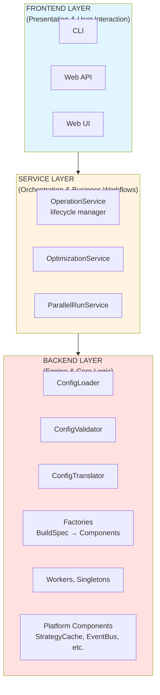
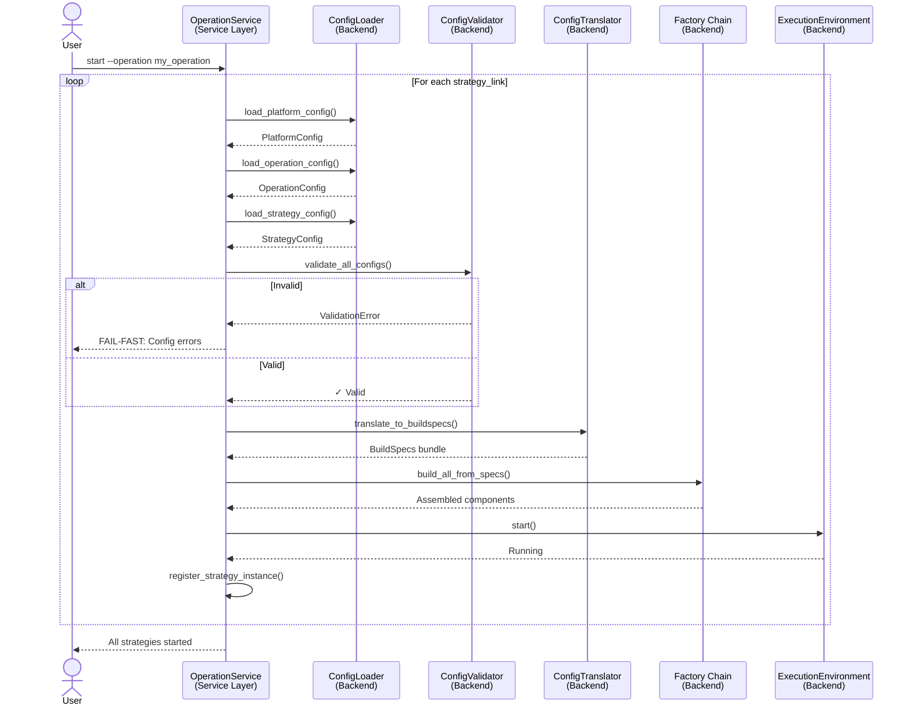
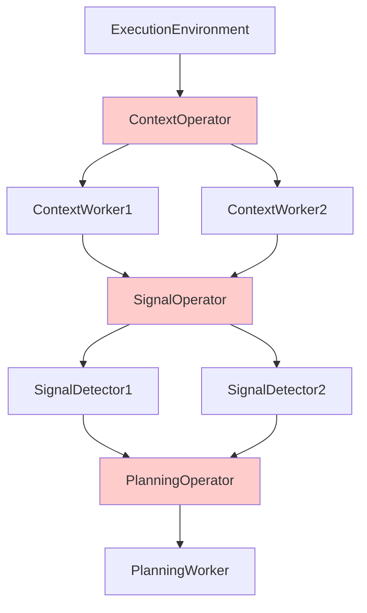
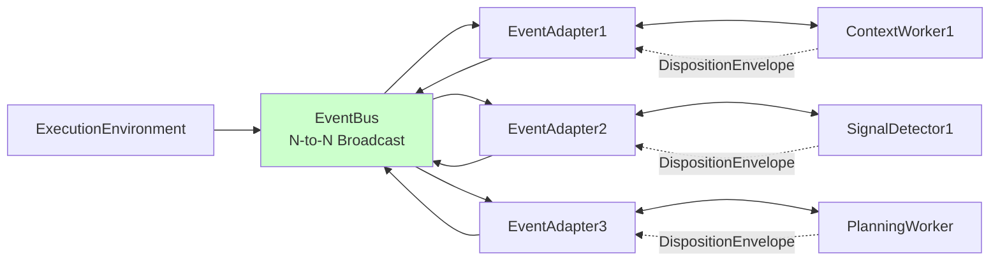
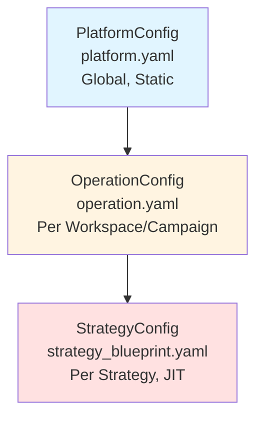

# Layered Architecture

**Status:** Architecture Foundation  
**Last Updated:** 2025-10-29

---

## Overview

S1mpleTraderV3 follows a **strict layered architecture** with unidirectional dependency flow. Each layer has distinct responsibilities and communicates through well-defined interfaces.

**Key Principles:**
- **Unidirectional Dependencies**: Frontend → Service → Backend (never upward)
- **Separation of Concerns**: Clear boundaries between presentation, orchestration, and engine
- **BuildSpec-Driven Bootstrap**: Configuration translated to BuildSpecs before component assembly
- **Fail-Fast Validation**: All validation during bootstrap, not runtime

---

## The Three Layers

---

## Layer Responsibilities

### 1. Frontend Layer

**Purpose:** User interaction and visualization

**Components:**
- **CLI** - Command-line interface for operations
- **Web API** - REST/GraphQL endpoints for external integrations
- **Web UI** - Browser-based dashboard and configuration

**Responsibilities:**
- Accept user commands
- Display strategy performance
- Provide configuration interfaces
- Monitor system health

**Communication:**
- **Downward:** Calls OperationService methods
- **Upward:** Receives events from EventBus (read-only subscriptions)

**Key Principle:** Frontend NEVER accesses Backend directly

---

### 2. Service Layer

**Purpose:** Orchestration and business workflows

**Components:**

#### OperationService (Lifecycle Manager)
- **Role:** Manages strategy lifecycle (start, stop, restart)
- **Responsibilities:**
  - Coordinate ConfigLoader/ConfigValidator/ConfigTranslator (backend components)
  - Coordinate Factory chain execution
  - Register strategy instances
  - Handle shutdown and cleanup

#### OptimizationService
- **Role:** Parameter optimization workflows
- **Responsibilities:**
  - Coordinate multiple strategy runs with different parameters
  - Collect and compare results
  - Report optimal parameter sets

#### ParallelRunService
- **Role:** Parallel strategy execution
- **Responsibilities:**
  - Run multiple strategies concurrently
  - Aggregate results across strategies
  - Monitor resource utilization

**Communication:**
- **Downward:** Calls Backend components (ConfigLoader, Factories)
- **Upward:** Exposes API to Frontend
- **Horizontal:** Orchestrates multiple strategies in parallel

---

### 3. Backend Layer

**Purpose:** Trading engine and core logic

**Components:**

#### Configuration Components

##### ConfigLoader
- **Role:** Load configuration files from disk/database
- **Responsibilities:**
  - Load PlatformConfig (once at startup)
  - Load OperationConfig (per operation)
  - Load StrategyConfig (per strategy, just-in-time)
  - Merge configurations respecting hierarchy

##### ConfigValidator
- **Role:** Validate configurations against schemas
- **Responsibilities:**
  - Schema validation (Pydantic models)
  - Cross-layer dependency validation
  - Plugin manifest validation
  - Fail-fast on invalid configuration

##### ConfigTranslator
- **Role:** Translate YAML → BuildSpecs
- **Responsibilities:**
  - Generate `connector_spec` from connector YAML
  - Generate `environment_spec` from environment YAML
  - Generate `workforce_spec` from workforce YAML
  - Generate `wiring_spec` from wiring YAML
  - **KEY:** ConfigTranslator is the ONLY "thinker" - Factories are pure builders

#### Factories (BuildSpec → Components)
- **ConnectorFactory** - Builds data connectors (CEX, DEX, Backtest)
- **DataSourceFactory** - Builds data sources (OHLCV providers)
- **EnvironmentFactory** - Builds execution environments
- **WorkerFactory** - Builds workers from plugins
- **EventWiringFactory** - Wires EventAdapters to EventBus

**Key Principle:** Factories are PURE BUILDERS - no decision logic, only assembly

#### Platform Components (Singletons)
- **StrategyCache** - Point-in-time DTO container (per strategy)
- **EventBus** - N-to-N event broadcast
- **FlowInitiator** - Tick flow initiator
- **PluginRegistry** - Plugin enrollment and metadata

#### Workers (Plugin Logic)
- Context, Signal, Risk, Planning, StrategyPlanner workers
- Loaded from plugins via WorkerFactory
- Bus-agnostic (communicate via EventAdapters)

**Communication:**
- **Upward:** Publishes events to EventBus (Service subscribes)
- **Horizontal:** Workers communicate via StrategyCache and EventBus

---

## Bootstrap Workflow (BuildSpec-Driven)

### Complete Bootstrap Sequence

### Key Bootstrap Concepts

#### ConfigTranslator is the "Thinker"

**Responsibility:** All decision logic for component construction

**What it does:**
- Interprets configuration intent
- Resolves dependencies
- Generates complete BuildSpecs
- Determines component wiring

**What it does NOT do:**
- Instantiate components (Factories do this)
- Validate configuration (ConfigValidator does this)
- Manage lifecycle (OperationService does this)

#### Factories are "Pure Builders"

**Responsibility:** Assemble components from BuildSpecs

**What they do:**
- Instantiate classes with provided parameters
- Inject dependencies as specified
- Return ready-to-use components

**What they do NOT do:**
- Make decisions about configuration
- Validate BuildSpec content
- Interpret user intent

---

## Architectural Evolution: Flattened Orchestration

### Old Architecture (V2 - Deprecated)

**Problem:** Operators created unnecessary abstraction layer, hardcoded groupings

---

### New Architecture (V3 - Current)

**Improvements:**
- **No Operators**: Direct wiring via EventAdapters
- **Flexibility**: Workers wired via `wiring_map.yaml` (not hardcoded)
- **Bus-Agnostic Workers**: Workers don't know about EventBus
- **One Adapter per Component**: Clear ownership and isolation

**Key Component:** EventWiringFactory creates and wires all EventAdapters during bootstrap

---

## Configuration Layers (Quick Reference)

See [Configuration Layers](CONFIGURATION_LAYERS.md) for details.

### 1. PlatformConfig
- **Scope:** Global, static
- **Loaded:** Once at OperationService start
- **Contains:** Logging, paths, locale
- **Does NOT contain:** Connectors, environments, schedules

### 2. OperationConfig
- **Scope:** Per workspace/campaign
- **Loaded:** Per operation
- **Contains:** Connectors, data sources, environments, schedule, strategy links
- **File:** `operation.yaml` + referenced files

### 3. StrategyConfig
- **Scope:** Per strategy
- **Loaded:** Just-in-time per strategy_link
- **Contains:** Workforce (workers), strategy-specific wiring
- **File:** `strategy_blueprint.yaml`

---

## Related Documentation

- **[Configuration Layers](CONFIGURATION_LAYERS.md)** - Detailed 3-layer config system
- **[Architectural Shifts](ARCHITECTURAL_SHIFTS.md)** - Critical V2 → V3 changes
- **[Event-Driven Wiring](EVENT_DRIVEN_WIRING.md)** - EventAdapter and wiring_map.yaml
- **[Platform Components](PLATFORM_COMPONENTS.md)** - Core singletons

---

**Last Updated:** 2025-10-29
