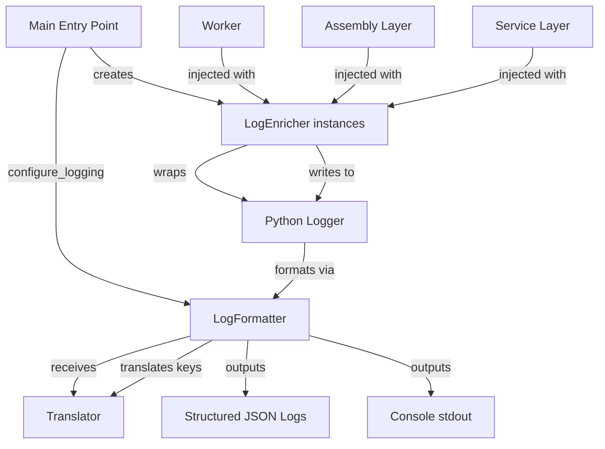

# LogEnricher Design (V3 Preliminary)

**Status:** Preliminary design based on V2 implementation  
**Last Updated:** 2025-10-29  
**Version:** 3.0

---

## 1. Overview

The **LogEnricher** is a structured logging wrapper that provides context injection, indentation support, and i18n compliance for all V3 system logs. It extends Python's standard `logging.LoggerAdapter` to enrich log records with contextual metadata while maintaining integration with the `Translator` for internationalized messages.

### Key Responsibilities

1. **Context Injection**: Automatically inject strategy_id, worker_id, component_type metadata into all log records
2. **Indentation Support**: Visual hierarchy in console logs via configurable indentation levels
3. **i18n Compliance**: All user-facing log messages use translation keys (dot-notation)
4. **Custom Log Levels**: Support domain-specific levels (SETUP, MATCH, FILTER, POLICY, RESULT, TRADE)
5. **Translation-Aware Formatting**: Cooperates with `LogFormatter` to translate keys and format values

---

## 2. Architecture Position

**Layer:** Backend (Utility)  
**Dependencies:**
- Python standard `logging` module
- `Translator` (backend.utils.translator)
- `LogLevel` enum (backend.core.enums)

**Injected Into:**
- All workers (ContextWorker, OpportunityWorker, ThreatWorker, PlanningWorker, StrategyPlanner)
- Assembly layer components (PluginEventAdapter, WorkerBuilder, OperatorFactory)
- Service layer components (OperationService, SchedulerService)

---

## 3. Component Collaboration



### Initialization Flow

1. **Startup** (`main.py`):
   - Load `PlatformConfig` (Pydantic model)
   - Create `Translator` instance from `config.core.language`
   - Call `configure_logging(config.logging, translator)`
   
2. **configure_logging**:
   - Register custom log levels (SETUP=15, MATCH=22, FILTER=23, etc.)
   - Create root logger handler
   - Attach `LogFormatter(translator=translator)`
   - Attach `LogProfiler(profile, profile_definitions)` filter
   - Configure handler output (stdout, JSON file, etc.)

3. **Component Initialization**:
   - Create `LogEnricher(logger, indent=0)` for each component
   - Inject enricher into worker constructors via dependency injection
   - Workers call `logger.info()`, `logger.policy()`, etc.

---

## 4. Implementation Details

### 4.1 LogFormatter (Translation Layer)

**Location:** `backend/utils/app_logger.py`

**Purpose:** Intercepts log records, translates message keys, formats with values, applies indentation

**Key Methods:**

```python
class LogFormatter(logging.Formatter):
    def __init__(self, fmt, datefmt, style='%', translator=None):
        super().__init__(fmt, datefmt, style)
        self.translator = translator
    
    def format(self, record: logging.LogRecord) -> str:
        key = record.msg
        values_dict = getattr(record, 'values', {})
        
        # Step 1: Translate key if valid (contains dot, no spaces)
        if self.translator and isinstance(key, str) and '.' in key and ' ' not in key:
            translated_template = self.translator.get(key, default=key)
        
        # Step 2: Format template with values
        if values_dict:
            try:
                final_message = translated_template.format(**values_dict)
            except (KeyError, TypeError):
                final_message = f"{translated_template} [FORMATTING ERROR]"
        
        # Step 3: Apply indentation
        indent_level = getattr(record, 'indent', 0)
        indented_message = "  " * indent_level + final_message
        record.msg = indented_message
        
        # Step 4: Standard formatting (e.g., [INFO   ])
        return super().format(record)
```

**Translation Logic:**
- Valid key: `"worker.process_start"` → looks up in YAML
- Invalid key (has spaces): `"Starting worker"` → passes through unchanged
- Missing key: Returns key itself as fallback

---

### 4.2 LogEnricher (Context Injection Layer)

**Location:** `backend/utils/app_logger.py`

**Purpose:** Provides standard logging interface with context enrichment and custom log level convenience methods

**Key Methods:**

```python
class LogEnricher(logging.LoggerAdapter):
    def __init__(self, logger: logging.Logger, indent: int = 0):
        super().__init__(logger, {'indent': indent})
    
    def process(self, msg, kwargs):
        # Merge adapter's context into kwargs
        kwargs["extra"] = kwargs.get("extra", {})
        kwargs["extra"].update(self.extra)
        
        # Move 'values' from kwargs into 'extra' for formatter
        if 'values' in kwargs:
            kwargs['extra']['values'] = kwargs.pop('values')
        
        return msg, kwargs
    
    # Custom level convenience methods
    def setup(self, key: str, **values): 
        self.log(CUSTOM_LEVELS[LogLevel.SETUP], key, values=values)
    
    def match(self, key: str, **values): 
        self.log(CUSTOM_LEVELS[LogLevel.MATCH], key, values=values)
    
    def filter(self, key: str, **values): 
        self.log(CUSTOM_LEVELS[LogLevel.FILTER], key, values=values)
    
    def policy(self, key: str, **values): 
        self.log(CUSTOM_LEVELS[LogLevel.POLICY], key, values=values)
    
    def result(self, key: str, **values): 
        self.log(CUSTOM_LEVELS[LogLevel.RESULT], key, values=values)
    
    def trade(self, key: str, **values): 
        self.log(CUSTOM_LEVELS[LogLevel.TRADE], key, values=values)
```

**Custom Log Levels:**

```python
CUSTOM_LEVELS = {
    LogLevel.SETUP: 15,    # Below INFO (20), plugin initialization
    LogLevel.MATCH: 22,    # Above INFO, signal matching
    LogLevel.FILTER: 23,   # Filter decisions
    LogLevel.POLICY: 24,   # Policy enforcement
    LogLevel.RESULT: 25,   # Execution results
    LogLevel.TRADE: 26,    # Trade events (highest INFO variant)
}
```

---

### 4.3 LogProfiler (Filtering Layer)

**Location:** `backend/utils/app_logger.py`

**Purpose:** Filter log records based on active profile configuration

**Implementation:**

```python
class LogProfiler(logging.Filter):
    def __init__(self, profile: str, profile_definitions: Dict[str, List[LogLevel]]):
        super().__init__()
        allowed_levels_for_profile = profile_definitions.get(profile, [])
        self.allowed_levels = {level.value for level in allowed_levels_for_profile}
    
    def filter(self, record: logging.LogRecord) -> bool:
        return record.levelname in self.allowed_levels
```

**Profile Configuration** (`platform.yaml`):

```yaml
logging:
  profile: "development"  # active profile
  profiles:
    development:
      - DEBUG
      - INFO
      - SETUP
      - MATCH
      - FILTER
      - POLICY
      - RESULT
      - TRADE
      - WARNING
      - ERROR
    
    production:
      - INFO
      - TRADE
      - WARNING
      - ERROR
    
    silent:
      - ERROR
```

---

## 5. Usage Patterns

### 5.1 Worker Integration

**Worker Constructor:**

```python
# backend/plugins/context_workers/ema_detector/worker.py
from backend.utils.app_logger import LogEnricher

class EMADetector(ContextWorker):
    def __init__(self, params: EMAParams, logger: LogEnricher):
        super().__init__(params)
        self.logger = logger
    
    def process(self, context: TradingContext) -> None:
        # Using translation key with formatted values
        self.logger.setup(
            'ema_detector.process_start',
            period=self.params.period,
            pair=context.pair
        )
        
        # Calculate EMA
        ema_value = self._calculate_ema(context)
        
        # Store result with custom log level
        self.logger.result(
            'ema_detector.ema_calculated',
            value=ema_value,
            timestamp=context.current_tick.timestamp
        )
```

**Translation File** (`locales/en.yaml`):

```yaml
ema_detector:
  process_start: "EMADetector processing {pair} with period={period}"
  ema_calculated: "EMA calculated: {value:.5f} at {timestamp}"
```

**Console Output:**

```
[SETUP  ] EMADetector processing BTC/USDT with period=20
[RESULT ] EMA calculated: 45123.45678 at 2025-10-29T10:30:00
```

---

### 5.2 Indentation for Nested Components

**Assembly Layer Example:**

```python
# backend/assembly/worker_builder.py
class WorkerBuilder:
    def __init__(self, logger: LogEnricher):
        self.logger = logger
    
    def build_worker(self, manifest: PluginManifest) -> IWorker:
        self.logger.info('worker_builder.build_start', plugin_id=manifest.plugin_id)
        
        # Create nested logger with increased indent
        nested_logger = LogEnricher(self.logger.logger, indent=1)
        
        # Build worker with nested logger
        worker = WorkerClass(params=params, logger=nested_logger)
        
        self.logger.info('worker_builder.build_complete', plugin_id=manifest.plugin_id)
        return worker
```

**Console Output:**

```
[INFO   ] Building worker for plugin: ema_detector
[SETUP  ]   EMADetector initializing with period=20
[INFO   ] Worker build complete: ema_detector
```

---

### 5.3 Error Logging with Context

**Exception Handling:**

```python
try:
    result = self._risky_operation(context)
except ValidationError as e:
    self.logger.error(
        'worker.validation_failed',
        worker_id=self.worker_id,
        error=str(e)
    )
    raise
```

**Translation:**

```yaml
worker:
  validation_failed: "Worker {worker_id} validation failed: {error}"
```

---

## 6. Translator Integration

### 6.1 Translator Lifecycle

**Initialization** (`main.py`):

```python
from backend.config.loaders import load_platform_config
from backend.utils.translator import Translator
from backend.utils.app_logger import configure_logging
from pathlib import Path

# Load configuration
platform_config = load_platform_config()

# Create translator
project_root = Path(__file__).parent
translator = Translator(platform_config, project_root)

# Configure logging with translator
configure_logging(platform_config.logging, translator)
```

### 6.2 Translation Key Structure

**Dot-Notation Hierarchy:**

```yaml
# Format: component.action_or_event

# Worker logs
ema_detector:
  process_start: "..."
  ema_calculated: "..."

# Assembly layer
worker_builder:
  build_start: "Building worker for plugin: {plugin_id}"
  build_complete: "Worker build complete: {plugin_id}"

# Service layer
operation_service:
  run_start: "Starting operation: {operation_id}"
  tick_processed: "Tick {tick_count} processed at {timestamp}"
```

**Pydantic Field Descriptions:**

```yaml
# Format: schema_name.field_name.desc

ema_params:
  period:
    desc: "The lookback period for EMA calculation"
  source:
    desc: "Price source (close, open, high, low)"

ledger_state:
  equity:
    desc: "Total current value of the ledger"
  available_cash:
    desc: "Cash available for new positions"
```

---

## 7. i18n Compliance Rules

### 7.1 Mandatory Translation Scope

**MUST use translation keys:**
1. **User-facing logs** (INFO level and above)
2. **Pydantic field descriptions** (all `Field(..., description="key")`)
3. **Plugin manifest fields** (display_name, description)

**MAY use hardcoded strings:**
1. **Developer-only DEBUG logs**
2. **Exception messages** (already in English)
3. **Internal validation errors**

### 7.2 Validation Pattern

**Correct:**

```python
# Translation key (valid: contains dot, no spaces)
logger.info('worker.process_start', pair=pair_name)

# Field description
equity: float = Field(..., description="ledger_state.equity.desc")
```

**Incorrect:**

```python
# Hardcoded user-facing text
logger.info(f'Starting worker for {pair_name}')  # ❌

# Hardcoded field description
equity: float = Field(..., description="Total equity value")  # ❌
```

---

## 8. V2 → V3 Migration Notes

### Changes from V2

1. **Translator Integration:**
   - V2: Translator injected into both LogFormatter AND individual loggers
   - V3: Translator ONLY in LogFormatter (single responsibility)

2. **Configuration:**
   - V2: Config passed as dict to `configure_logging(config, translator)`
   - V3: Pydantic model `LoggingConfig` passed to `configure_logging(logging_config, translator)`

3. **Context Binding:**
   - V2: Manual context injection via `logger.extra = {'worker_id': ...}`
   - V3: Same mechanism, but formalized in worker constructors

### Preserved from V2

1. **Custom log levels** (SETUP, MATCH, FILTER, POLICY, RESULT, TRADE)
2. **Indentation support** via `LogEnricher(logger, indent=n)`
3. **Translation key format** (dot-notation, e.g., `worker.process_start`)
4. **Profile-based filtering** via `LogProfiler`
5. **Values dictionary** for template formatting

---

## 9. Testing Strategy

### 9.1 Unit Tests

**Test LogFormatter:**

```python
# tests/unit/utils/test_app_logger.py
def test_log_formatter_translates_valid_key():
    mock_translator = Mock()
    mock_translator.get.return_value = "Translated: {value}"
    
    formatter = LogFormatter(translator=mock_translator)
    record = logging.LogRecord(
        name="test", level=logging.INFO, pathname="", lineno=0,
        msg="component.action", args=(), exc_info=None
    )
    record.values = {'value': 42}
    
    result = formatter.format(record)
    
    assert "Translated: 42" in result
    mock_translator.get.assert_called_once_with("component.action", default="component.action")

def test_log_formatter_preserves_hardcoded_strings():
    formatter = LogFormatter(translator=None)
    record = logging.LogRecord(
        name="test", level=logging.INFO, pathname="", lineno=0,
        msg="Hardcoded message", args=(), exc_info=None
    )
    
    result = formatter.format(record)
    
    assert "Hardcoded message" in result
```

**Test LogEnricher:**

```python
def test_log_enricher_injects_indent():
    logger = logging.getLogger("test")
    enricher = LogEnricher(logger, indent=2)
    
    with patch.object(logger, 'log') as mock_log:
        enricher.info("test.message")
        
        # Verify 'indent' in extra
        call_kwargs = mock_log.call_args[1]
        assert call_kwargs['extra']['indent'] == 2

def test_log_enricher_custom_levels():
    logger = logging.getLogger("test")
    enricher = LogEnricher(logger)
    
    with patch.object(logger, 'log') as mock_log:
        enricher.setup("test.setup", value=123)
        
        # Verify custom level used
        assert mock_log.call_args[0][0] == CUSTOM_LEVELS[LogLevel.SETUP]
```

### 9.2 Integration Tests

**Test Full Logging Pipeline:**

```python
def test_logging_pipeline_end_to_end(tmp_path):
    # Setup
    platform_config = create_test_platform_config()
    translator = Translator(platform_config, tmp_path)
    configure_logging(platform_config.logging, translator)
    
    # Create enricher
    logger = logging.getLogger("integration_test")
    enricher = LogEnricher(logger, indent=0)
    
    # Write log
    with capture_stdout() as output:
        enricher.info('test.integration', value=42)
    
    # Verify translation occurred
    assert "Test integration message: 42" in output.getvalue()
```

---

## 10. Configuration Reference

### 10.1 Platform Config Schema

**File:** `backend/config/schemas/platform_schema.py`

```python
from pydantic import BaseModel, Field
from typing import Dict, List
from backend.core.enums import LogLevel

class LoggingConfig(BaseModel):
    profile: str = Field(default="development", description="logging.profile.desc")
    profiles: Dict[str, List[LogLevel]] = Field(..., description="logging.profiles.desc")

class PlatformConfig(BaseModel):
    core: CoreConfig
    logging: LoggingConfig
```

### 10.2 Example Platform Config

**File:** `config/platform.yaml`

```yaml
core:
  language: "en"
  timezone: "UTC"

logging:
  profile: "development"
  profiles:
    development:
      - DEBUG
      - INFO
      - SETUP
      - MATCH
      - FILTER
      - POLICY
      - RESULT
      - TRADE
      - WARNING
      - ERROR
    
    production:
      - INFO
      - TRADE
      - WARNING
      - ERROR
    
    backtest:
      - SETUP
      - RESULT
      - TRADE
      - ERROR
    
    silent:
      - ERROR
```

---

## 11. Open Questions (V3 Design)

1. **Causality Tracking:**
   - V2 had `opportunity_id`, `trade_id`, `threat_id` in DTOs
   - Should LogEnricher auto-inject these from TradingContext?
   - **Decision needed:** Explicit binding vs automatic context extraction

2. **Structured JSON Output:**
   - V2 mentioned JSON logs for analysis
   - Should LogFormatter support multiple output formats?
   - **Decision needed:** JSON handler vs console handler split

3. **Performance:**
   - Translation lookup on every log call
   - Should we cache translated templates?
   - **Decision needed:** Add translation cache layer

4. **Worker Context Binding:**
   - Should workers receive pre-bound LogEnricher with worker_id?
   - Or bind manually in worker `__init__`?
   - **Decision needed:** DI pattern vs manual binding

---

## 12. References

### V2 Implementation

- **File:** `d:\dev\S1mpleTraderV2\backend\utils\app_logger.py`
- **Translator:** `d:\dev\S1mpleTraderV2\backend\utils\translator.py`
- **Documentation:** Section 10.5 (Gelaagde Logging & Traceability)
- **Documentation:** Section 10.7 (Overige Standaarden - i18n)

### V3 Preliminary Design

- **Architecture Layer:** Backend (Utility)
- **Integration Point:** `main.py` → `configure_logging()`
- **Injection Targets:** All workers, assembly components, services
- **Translation Source:** `locales/{language}.yaml` files

---

**End of Preliminary Design**
