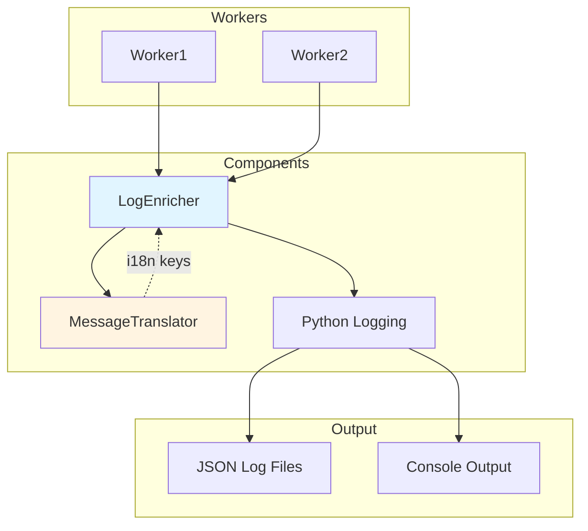
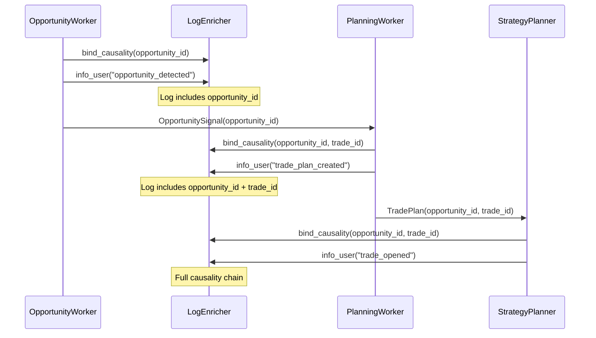

# LogEnricher Design - Structured Logging with i18n

**Status:** Architecture Design  
**Last Updated:** 2025-10-29

---

## Overview

`LogEnricher` is a platform utility that provides **structured, contextual logging** with **i18n compliance** for user-facing messages. It wraps Python's standard logging with automatic context injection and translation support.

**Key Principles:**
- **Structured Logging**: JSON-formatted logs with contextual metadata
- **i18n Compliance**: User-facing messages translated via MessageTranslator
- **Context Injection**: Automatic strategy_id, worker_id, run_anchor enrichment
- **Causality Tracking**: Integration with causality chain (opportunity_id, trade_id, threat_id)

---

## Architecture



---

## Core Responsibilities

### 1. Structured Logging

**Purpose:** Emit JSON-formatted logs with rich metadata

**Features:**
- Automatic timestamp (ISO 8601 UTC)
- Log level (DEBUG, INFO, WARNING, ERROR, CRITICAL)
- Component context (strategy_id, worker_id, component_type)
- Causality context (opportunity_id, trade_id, threat_id)
- Custom metadata (key-value pairs)

**Example Output:**
```json
{
  "timestamp": "2025-10-29T14:32:15.123456Z",
  "level": "INFO",
  "component_type": "OpportunityWorker",
  "component_id": "breakout_scout_instance_1",
  "strategy_id": "btc_momentum_long",
  "run_anchor": "2025-10-29T14:32:00.000000Z",
  "message": "Breakout opportunity detected",
  "metadata": {
    "confidence": 0.92,
    "breakout_type": "RESISTANCE",
    "price_level": 50000.0
  },
  "causality": {
    "opportunity_id": "550e8400-e29b-41d4-a716-446655440000"
  }
}
```

---

### 2. i18n Message Translation

**Purpose:** Translate user-facing log messages for international compliance

**Integration with MessageTranslator:**

```python
# LogEnricher delegates to MessageTranslator for user-facing messages
class LogEnricher:
    def __init__(self, translator: MessageTranslator, locale: str = "en_US"):
        self._translator = translator
        self._locale = locale
    
    def info_user(self, message_key: str, **params) -> None:
        """Log user-facing message (translated)."""
        translated = self._translator.translate(
            key=message_key,
            locale=self._locale,
            params=params
        )
        self._log("INFO", translated, is_user_facing=True, **params)
    
    def info_system(self, message: str, **metadata) -> None:
        """Log system message (English only, not translated)."""
        self._log("INFO", message, is_user_facing=False, **metadata)
```

**Message Keys (i18n Catalog):**
```yaml
# translations/en_US.yaml
opportunity_detected: "Opportunity detected: {signal_type} with {confidence}% confidence"
trade_opened: "Trade opened: {direction} {asset} at {entry_price}"
threat_triggered: "Risk threshold breached: {threat_type}"
flow_complete: "Strategy run completed in {duration}ms"

# translations/nl_NL.yaml
opportunity_detected: "Kans gedetecteerd: {signal_type} met {confidence}% vertrouwen"
trade_opened: "Trade geopend: {direction} {asset} op {entry_price}"
threat_triggered: "Risico drempel overschreden: {threat_type}"
flow_complete: "Strategie uitvoering voltooid in {duration}ms"
```

**Usage Pattern:**
```python
# Worker uses LogEnricher
class BreakoutScout(StandardWorker):
    logger: LogEnricher  # Injected by WorkerFactory
    
    def process(self) -> DispositionEnvelope:
        # System log (English, not translated)
        self.logger.info_system(
            "Processing breakout detection",
            worker_id=self.worker_id,
            input_dto_types=["RegimeOutputDTO", "SupportResistanceDTO"]
        )
        
        # User-facing log (translated)
        if opportunity_detected:
            self.logger.info_user(
                message_key="opportunity_detected",
                signal_type="BREAKOUT",
                confidence=92
            )
            
            return DispositionEnvelope(disposition="PUBLISH", ...)
```

---

### 3. Context Injection

**Purpose:** Automatically enrich logs with execution context

**Injected Context:**
- `strategy_id` - Current strategy instance
- `worker_id` - Worker instance identifier
- `component_type` - Worker category (ContextWorker, OpportunityWorker, etc.)
- `run_anchor` - Point-in-time timestamp (from IStrategyCache)
- `causality` - Causality chain IDs (opportunity_id, trade_id, threat_id)

**Context Binding:**
```python
# LogEnricher binds context during worker initialization
class LogEnricher:
    def bind_context(
        self,
        strategy_id: str,
        component_id: str,
        component_type: str,
        run_anchor: Optional[datetime] = None
    ) -> "LogEnricher":
        """Create a new LogEnricher with bound context."""
        enricher = LogEnricher(
            translator=self._translator,
            locale=self._locale,
            base_logger=self._base_logger
        )
        enricher._context = {
            "strategy_id": strategy_id,
            "component_id": component_id,
            "component_type": component_type,
            "run_anchor": run_anchor.isoformat() if run_anchor else None
        }
        return enricher
```

**WorkerFactory Integration:**
```python
# WorkerFactory binds LogEnricher with worker context
class WorkerFactory:
    def build_worker(self, worker_spec: WorkerSpec) -> IWorker:
        # Create worker-specific LogEnricher
        logger = self.platform_logger.bind_context(
            strategy_id=worker_spec.strategy_id,
            component_id=worker_spec.instance_id,
            component_type=worker_spec.worker_type
        )
        
        # Inject into worker
        worker = WorkerClass(params=worker_spec.params)
        worker.logger = logger
        
        return worker
```

---

### 4. Causality Chain Integration

**Purpose:** Track decision provenance across tick flows

**Causality IDs:**
- `opportunity_id` - UUID from OpportunitySignal
- `trade_id` - UUID from TradePlan
- `threat_id` - UUID from ThreatSignal

**Binding Causality:**
```python
# Worker binds causality context when generating signals
class MomentumScout(StandardWorker):
    def process(self) -> DispositionEnvelope:
        opportunity_id = uuid4()
        
        # Bind causality to logger for this flow
        self.logger.bind_causality(opportunity_id=opportunity_id)
        
        self.logger.info_user(
            message_key="opportunity_detected",
            signal_type="MOMENTUM_BREAKOUT",
            confidence=92
        )
        
        return DispositionEnvelope(
            disposition="PUBLISH",
            event_payload=OpportunitySignal(
                opportunity_id=opportunity_id,  # Same ID!
                ...
            )
        )
```

**Causality Propagation:**


---

## LogEnricher API

### Core Methods

```python
class LogEnricher:
    """Structured, contextual logger with i18n support."""
    
    # User-facing logs (translated)
    def info_user(self, message_key: str, **params) -> None:
        """Log user-facing INFO message (translated)."""
    
    def warning_user(self, message_key: str, **params) -> None:
        """Log user-facing WARNING message (translated)."""
    
    def error_user(self, message_key: str, **params) -> None:
        """Log user-facing ERROR message (translated)."""
    
    # System logs (English only, not translated)
    def debug(self, message: str, **metadata) -> None:
        """Log DEBUG message (system, not translated)."""
    
    def info_system(self, message: str, **metadata) -> None:
        """Log system INFO message (not translated)."""
    
    def warning_system(self, message: str, **metadata) -> None:
        """Log system WARNING message (not translated)."""
    
    def error_system(self, message: str, exception: Optional[Exception] = None, **metadata) -> None:
        """Log system ERROR message with optional exception."""
    
    # Context binding
    def bind_context(
        self,
        strategy_id: str,
        component_id: str,
        component_type: str,
        run_anchor: Optional[datetime] = None
    ) -> "LogEnricher":
        """Create new LogEnricher with bound context."""
    
    def bind_causality(
        self,
        opportunity_id: Optional[UUID] = None,
        trade_id: Optional[UUID] = None,
        threat_id: Optional[UUID] = None
    ) -> None:
        """Bind causality IDs to current logger instance."""
```

---

## MessageTranslator Integration

### MessageTranslator Responsibilities

**Purpose:** Centralized i18n translation service

**Responsibilities:**
- Load translation catalogs from YAML files
- Translate message keys to target locale
- Parameter interpolation (`{confidence}%` → `92%`)
- Fallback to English if translation missing

**Implementation:**
```python
class MessageTranslator:
    """i18n translation service."""
    
    def __init__(self, translations_dir: Path):
        self._translations = self._load_translations(translations_dir)
    
    def translate(self, key: str, locale: str, params: Dict[str, Any]) -> str:
        """
        Translate message key to target locale.
        
        Args:
            key: Message key (e.g., "opportunity_detected")
            locale: Target locale (e.g., "nl_NL")
            params: Interpolation parameters
        
        Returns:
            Translated message with parameters interpolated
        """
        # Get translation catalog for locale
        catalog = self._translations.get(locale, self._translations["en_US"])
        
        # Get message template
        template = catalog.get(key, f"[MISSING: {key}]")
        
        # Interpolate parameters
        return template.format(**params)
```

**Translation Catalog Structure:**
```
translations/
├── en_US.yaml       # English (default)
├── nl_NL.yaml       # Dutch
├── de_DE.yaml       # German
└── fr_FR.yaml       # French
```

---

## Configuration

### PlatformConfig Integration

```yaml
# platform.yaml
logging:
  level: "INFO"              # DEBUG, INFO, WARNING, ERROR
  format: "json"             # json, text
  output: "file"             # console, file, both
  log_dir: "./logs"
  
  # i18n settings
  default_locale: "en_US"
  translations_dir: "./translations"
  
  # User-facing vs system separation
  user_facing_level: "INFO"   # Minimum level for user-facing logs
  system_level: "DEBUG"       # Minimum level for system logs
```

### Log Output Separation

**Two Log Streams:**

1. **User-Facing Logs** (`logs/user_facing.log`)
   - Translated messages
   - INFO level and above
   - For end-users, UI display, alerts

2. **System Logs** (`logs/system.log`)
   - English only
   - DEBUG level and above
   - For developers, debugging, analysis

---

## Related Documentation

- **[Layered Architecture](LAYERED_ARCHITECTURE.md)** - Platform components
- **[Worker Taxonomy](WORKER_TAXONOMY.md)** - Worker integration patterns
- **[Causality Chain](../development/CAUSALITY_CHAIN.md)** - Opportunity/Trade/Threat IDs

---

**Last Updated:** 2025-10-29  
**Status:** Design Complete, Implementation Pending
