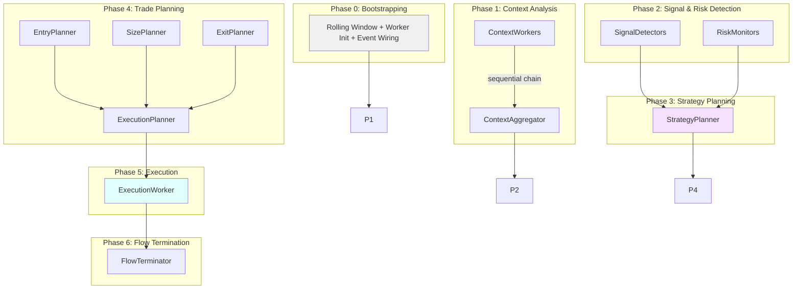
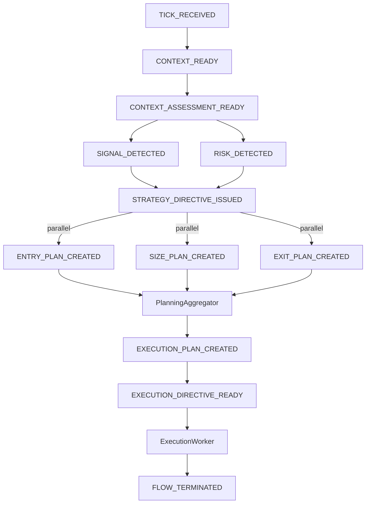

# Strategy Pipeline Architecture

**Status:** DEFINITIVE  
**Version:** 3.0  
**Last Updated:** 2025-11-28

---

## Purpose

This document describes the **complete strategy pipeline** of S1mpleTraderV3 - from market tick to trade execution. It defines the 6+1 phases, worker interactions, and data flow between components.

**Target audience:** Developers implementing strategy plugins or platform components.

## Scope

**In Scope:**
- Pipeline phases and their responsibilities
- Inter-phase communication patterns
- Event flow between workers
- Config-driven planner filtering

**Out of Scope:**
- Worker implementation details → See [WORKER_TAXONOMY.md][worker-taxonomy]
- Execution mechanics → See [EXECUTION_FLOW.md][execution-flow]
- Container lifecycle → See [TRADE_LIFECYCLE.md][trade-lifecycle]
- DTO specifications → See source files in `backend/dtos/`

## Prerequisites

Read these first:
1. [CORE_PRINCIPLES.md][core-principles] - 5 non-negotiable design principles
2. [WORKER_TAXONOMY.md][worker-taxonomy] - 6 worker categories

---

## 1. Pipeline Overview

### 1.1 The 6+1 Phases



### 1.2 Data Flow Summary

```
Market Tick
    ↓
StrategyCache (objective facts from ContextWorkers)
    ↓
EventBus (Signal + Risk DTOs)
    ↓
StrategyDirective (confidence + hints)
    ↓
EntryPlan + SizePlan + ExitPlan (parallel)
    ↓
ExecutionCommand (aggregated in ExecutionCommandBatch)
    ↓
StrategyLedger (containers: TradePlan → ExecutionGroup → Order → Fill)
```

### 1.3 Key Principles

1. **No Operators** - Workers wired via EventAdapters + `wiring_map.yaml`
2. **Point-in-Time Model** - No growing DataFrames, DTOs via IStrategyCache
3. **Config-Driven Filtering** - Planners selected by confidence ranges in YAML
4. **Bus-Agnostic Workers** - Return `DispositionEnvelope`, EventAdapter handles routing
5. **Objective Context** - ContextWorkers produce facts, consumers apply interpretation

---

## 2. Phase 0: Bootstrapping

**Goal:** Prepare the pipeline for the first "real" tick.

### 2.1 Rolling Window Setup

- Collect historical data for all configured timeframes
- Fill indicators for correct initialization
- Wait until minimum window size is reached

### 2.2 Worker Initialization

- Instantiate all workers according to workforce config
- Inject capabilities (state, events, journaling)
- Validate dependencies between workers

### 2.3 Event Wiring

- Assemble EventAdapters according to `wiring_map.yaml`
- Connect event listeners to publishers
- Validate event chain (no circular references)

### 2.4 FlowInitiator Setup

- Instantiate FlowInitiator per strategy
- Wire to DataProvider events (`PlatformDataDTO`)
- Ensures StrategyCache initialization before workers execute

**Output:** System ready to process ticks

**Cross-reference:** [FlowInitiator Design][flow-initiator-design]

---

## 3. Phase 1: Context Analysis

**Goal:** Build objective market "map" without interpretation.

### 3.1 ContextWorker Chain

**Execution:** Sequential chain-through
- Workers build on each other's output
- EventAdapters wired according to `wiring_map.yaml`
- Last worker output = enriched context

**Input:** Raw OHLCV data (current tick + historical window)

**Output:** 
- Plugin-specific DTOs stored in StrategyCache via `set_result_dto()`
- **Never** publishes to EventBus

**Worker Type:** `context_worker` (7 subtypes available)

**Critical:** ContextWorkers produce **objective facts only** (no "bullish", "strong", etc.)

**Cross-reference:** [WORKER_TAXONOMY.md - ContextWorker][worker-taxonomy]

### 3.2 Context Aggregation

**Component:** `ContextAggregator` (Platform worker)

**Responsibility:**
- Aggregate atomic context outputs → AggregatedContextAssessment
- Produce **strength** and **weakness** scores (0.0-1.0)
- Wired via EventAdapter: listens to last ContextWorker output

**Output:** `AggregatedContextAssessment` with objective scores

**Event:** `CONTEXT_ASSESSMENT_READY`

---

## 4. Phase 2: Signal & Risk Detection

**Goal:** Detect trading opportunities and risks through subjective interpretation.

### 4.1 Signal Detection

**Role:** Probabilistic and creative - "I see a possibility"

**Execution:** Parallel
- All detectors receive same context from StrategyCache
- EventAdapters fire workers simultaneously
- Generate independent signals

**Worker Type:** `signal_detector` (7 subtypes available)

**Input:** StrategyCache DTOs (objective facts from Phase 1)

**Output:**
```python
Signal(
    signal_id="SIG_20251027_143022_a8f3c",
    asset="BTCUSDT",
    direction="BUY",
    signal_type="fvg_entry",
    confidence=Decimal("0.85")  # Crucial for Phase 4 filtering
)
```

**Event:** `SIGNAL_DETECTED`

**Cross-reference:** [WORKER_TAXONOMY.md - SignalDetector][worker-taxonomy]

### 4.2 Risk Monitoring

**Role:** Vigilant and defensive - "Watch out for danger!"

**Execution:** Parallel (same as Signal Detection)

**Worker Type:** `risk_monitor` (5 subtypes available)

**Input:** 
- StrategyCache (market data)
- StrategyLedger (open positions, P&L)

**Output:**
```python
Risk(
    risk_id="RSK_20251027_143025_b7c4d",
    risk_type="MAX_DRAWDOWN_BREACH",
    severity=Decimal("0.90")  # 0.0-1.0
)
```

**Event:** `RISK_DETECTED`

**Cross-reference:** [WORKER_TAXONOMY.md - RiskMonitor][worker-taxonomy]

---

## 5. Phase 3: Strategy Planning

**Goal:** Combine signals and risks into strategic decision with confidence score.

### 5.1 Signal/Risk Confrontation

**Worker Type:** `strategy_planner` (1:1 with strategy)

**Responsibility:**
- Combine context assessment + signals + risks
- Produce **confidence score** for trade planners
- Generate **hints & constraints** (not execution orders!)
- **Hub** for iterative strategies (scheduled, position management)

**Input:**
- `AggregatedContextAssessment` (strength/weakness scores)
- `list[Signal]` (detected opportunities)
- `list[Risk]` (detected threats)

### 5.2 StrategyDirective Output

**StrategyDirective = Pure Data Container (NOT Orchestrator):**

**What it IS:**
- ✅ Aggregator of context, signals, risks
- ✅ Confidence score producer (0.0-1.0 for planner filtering)
- ✅ Hints/constraints container (via sub-directives)
- ✅ Causality tracker (which IDs led to this directive)

**What it is NOT:**
- ❌ Orchestrator (doesn't trigger planners, doesn't decide which runs)
- ❌ Event publisher (knows nothing of event wiring)
- ❌ Execution order (sub-directives are hints, not concrete orders)

**Output:**
```python
StrategyDirective(
    directive_id="STR_20251027_143030_c8e6f",
    confidence=Decimal("0.82"),
    
    # Sub-directives = Hints/Constraints
    entry_directive=EntryDirective(
        timing_preference=Decimal("0.82"),
        symbol="BTCUSDT",
        direction="BUY"
    ),
    size_directive=SizeDirective(
        aggressiveness=Decimal("0.66"),
        max_risk_amount=Decimal("1000")
    ),
    exit_directive=ExitDirective(
        profit_taking_preference=Decimal("0.75"),
        risk_reward_ratio=Decimal("2.5")
    ),
    
    scope="NEW_TRADE"  # or MODIFY_EXISTING, CLOSE_EXISTING
)
```

**Event:** `STRATEGY_DIRECTIVE_ISSUED`

### 5.3 Lifecycle Scopes

| Scope | Use Case | Planner Behavior |
|-------|----------|------------------|
| `NEW_TRADE` | Fresh opportunity | Create new TradePlan |
| `MODIFY_EXISTING` | Trailing stop, scale in/out | Modify existing containers |
| `CLOSE_EXISTING` | Emergency exit, take profit | Close position(s) |

**Iterative Strategies:**
- **Scheduled:** DCAPlanner listens to `WEEKLY_DCA_TICK`
- **Position updates:** TrailingStopPlanner listens to `POSITION_UPDATE`
- **Output:** All produce StrategyDirective (same DTO, different scope)

---

## 6. Phase 4: Trade Planning

**Goal:** Transform strategic hints into concrete execution plans.

### 6.1 Parallel Planners (Entry, Size, Exit)

**Execution Model:** Parallel via EventAdapters

**Worker Type:** `planning_worker` (4 subtypes)

**Config-Driven Filtering:**
```yaml
planning:
  entry:
    - plugin: "AggressiveMarketEntryPlanner"
      triggers:
        confidence: [0.8, 1.0]
    - plugin: "PatientLimitEntryPlanner"
      triggers:
        confidence: [0.3, 0.7]
```

**Planners are DUMB - Config is SMART:**
- WorkerFactory injects `PlannerMatcher` during assembly
- Planner checks `should_handle(directive)` via matcher
- No quant logic in filtering, only in planning

#### EntryPlanner → EntryPlan

**Decides:** WHAT to trade, WHERE to enter

```python
EntryPlan(
    plan_id="ENT_...",
    symbol="BTCUSDT",
    direction="BUY",
    order_type="LIMIT",
    limit_price=Decimal("95000.00")
)
```

#### SizePlanner → SizePlan

**Decides:** HOW MUCH to trade

```python
SizePlan(
    plan_id="SIZ_...",
    position_size=Decimal("0.5"),
    risk_amount=Decimal("1000.00"),
    leverage=Decimal("1.0")
)
```

#### ExitPlanner → ExitPlan

**Decides:** WHERE to exit

```python
ExitPlan(
    plan_id="EXT_...",
    stop_loss_price=Decimal("90000.00"),
    take_profit_price=Decimal("105000.00")
)
```

### 6.2 ExecutionPlanner (4th, Sequential)

**Execution:** Sequential - waits for all 3 parallel plans

**Responsibility:**
- Aggregate EntryPlan + SizePlan + ExitPlan
- Select execution algorithm (TWAP, Iceberg, Market, etc.)
- Configure algorithm parameters
- Has read access to StrategyLedger for algorithm selection

**Why Sequential?**

ExecutionPlanner decisions require **complete trade context**:
- Entry.order_type → affects algorithm choice
- Size.position_size → affects chunking strategy
- Exit margins → affects urgency

**Input:** All 3 plans + StrategyDirective

**Output:** ExecutionCommand with algorithm configuration (wrapped in ExecutionCommandBatch)

### 6.3 ExecutionCommand Assembly

**Component:** `PlanningAggregator` (Platform worker)

**Responsibility:**
- Track which plans are expected (3 parallel + 1 sequential)
- Wait for parallel phase completion (Entry, Size, Exit)
- Trigger ExecutionPlanner with all 3 plans
- Aggregate all 4 plans → ExecutionCommand(s) in ExecutionCommandBatch

**Output:**
```python
ExecutionCommand(
    command_id="EXC_...",
    causality=CausalityChain(...),
    entry_plan=EntryPlan(...),
    size_plan=SizePlan(...),
    exit_plan=ExitPlan(...),
    execution_plan=ExecutionPlan(
        algorithm="TWAP",
        slice_count=12,
        duration_minutes=60
    )
)
```

**Event:** `EXECUTION_COMMAND_BATCH_READY`

**Cross-reference:** [TRADE_LIFECYCLE.md - ExecutionPlanner][trade-lifecycle]

---

## 7. Phase 5: Execution

**Goal:** Execute trades via Ledger + Connector.

**Component:** `ExecutionWorker` (6th worker category)

**Responsibility:**
- Receive ExecutionCommandBatch via EventBus
- Query StrategyLedger for existing state (MODIFY/CLOSE scenarios)
- Register containers (ExecutionGroup, Order)
- Execute via IExecutionConnector (place/modify/cancel)
- Update StrategyLedger with results

**SRP: Planners decide WHAT, Workers execute HOW**

The operational lookup for existing orders belongs to ExecutionWorker (HOW), not ExecutionPlanner (WHAT).

**Full details:** [EXECUTION_FLOW.md][execution-flow]

---

## 8. Phase 6: Flow Termination

**Goal:** Clean up and persist causality.

**Component:** `FlowTerminator` (Platform worker)

### 8.1 Causality Reconstruction

- Query StrategyJournal with TriggerContext IDs
- Reconstruct complete decision chain
- Persist for quant analysis

### 8.2 Cleanup

- Log metrics
- Garbage collection
- Component reset

**Output:**
- Complete causality chain in Journal
- Metrics logged
- Components cleaned
- Event: `FLOW_TERMINATED` (optional for UI updates)

---

## 9. Event Flow Summary



### Event Wiring Pattern

```yaml
# wiring_map.yaml (generated during bootstrap)
event_wirings:
  - event: "STRATEGY_DIRECTIVE_ISSUED"
    subscribers:
      - worker: "aggressive_entry_planner"
      - worker: "patient_entry_planner"
      - worker: "fixed_risk_sizer"
      - worker: "structure_exit_planner"
  
  - event: "ENTRY_PLAN_CREATED"
    subscribers:
      - worker: "planning_aggregator"
  
  - event: "EXECUTION_DIRECTIVE_READY"
    subscribers:
      - worker: "execution_worker"
```

### Architectural Principles

1. **No Direct Coupling:**
   - Workers don't know each other
   - Communication only via events + DTOs
   - Event wiring determined by config, not code

2. **Config-Driven Filtering:**
   - All planners listen to same event
   - PlannerMatcher checks `should_handle()`
   - Example: 3 entry planners listen, 1 handles (based on confidence)

3. **PlanningAggregator = Coordinator (NOT Orchestrator):**
   - Detects phase completion (state tracking)
   - Triggers next phase via events
   - Aggregates results → ExecutionCommandBatch
   - No planner selection logic (config does this!)

---

## 10. Configuration Hierarchy

```
platform.yaml
    ├─ Global settings
    └─ Logging config
        ↓
operation.yaml
    ├─ Connectors (exchange APIs)
    ├─ Data sources
    └─ strategy_links (list of strategies)
        ↓
strategy_blueprint.yaml (per strategy)
    ├─ workforce
    │   ├─ context_workers: [...]
    │   ├─ signal_detectors: [...]
    │   ├─ risk_monitors: [...]
    │   ├─ strategy_planner: {...}
    │   └─ planning_workers:
    │       ├─ entry: [{plugin, triggers}, ...]
    │       ├─ size: [{plugin, triggers}, ...]
    │       ├─ exit: [{plugin, triggers}, ...]
    │       └─ execution: [{plugin, triggers}, ...]
    └─ wiring (event connections)
        ↓
plugin_manifest.yaml (per worker)
    ├─ identification (type, subtype)
    ├─ capabilities (events, state, journaling)
    └─ dependencies (requires_dtos, provides_dtos)
```

---

## Related Documentation

- **[CORE_PRINCIPLES.md][core-principles]** - 5 non-negotiable design principles
- **[WORKER_TAXONOMY.md][worker-taxonomy]** - 6 worker categories and responsibilities
- **[EXECUTION_FLOW.md][execution-flow]** - Sync/async execution mechanics
- **[TRADE_LIFECYCLE.md][trade-lifecycle]** - Container hierarchy and Ledger access
- **[ARCHITECTURAL_SHIFTS.md][arch-shifts]** - 3 critical architectural shifts

<!-- Link definitions -->
[core-principles]: ./CORE_PRINCIPLES.md "Core design principles"
[worker-taxonomy]: ./WORKER_TAXONOMY.md "Worker categories"
[execution-flow]: ./EXECUTION_FLOW.md "Execution mechanics"
[trade-lifecycle]: ./TRADE_LIFECYCLE.md "Trade lifecycle"
[arch-shifts]: ./ARCHITECTURAL_SHIFTS.md "Architectural shifts"
[flow-initiator-design]: ../development/backend/core/FLOW_INITIATOR_DESIGN.md "FlowInitiator design"

---

## Version History

| Version | Date | Author | Changes |
|---------|------|--------|---------|
| 3.0 | 2025-11-28 | AI | Major revision: removed ExecutionIntent/Translator pattern, aligned with Signal/Risk terminology, ARCHITECTURE_TEMPLATE format |
| 2.0 | 2025-10-28 | AI | ExecutionIntent architecture (deprecated) |
| 1.0 | 2025-10-27 | AI | Initial pipeline documentation |

---

**Archive:** Previous version (v2.0 with ExecutionIntent pattern) archived at `docs/archive/PIPELINE_FLOW_v4_deprecated.md`
