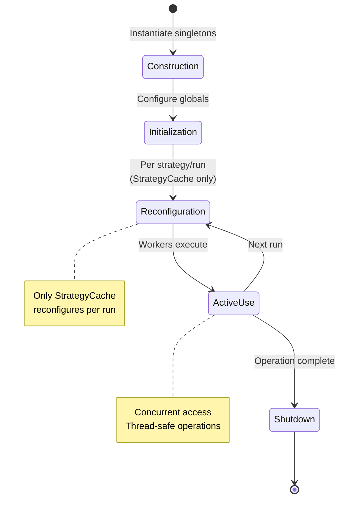
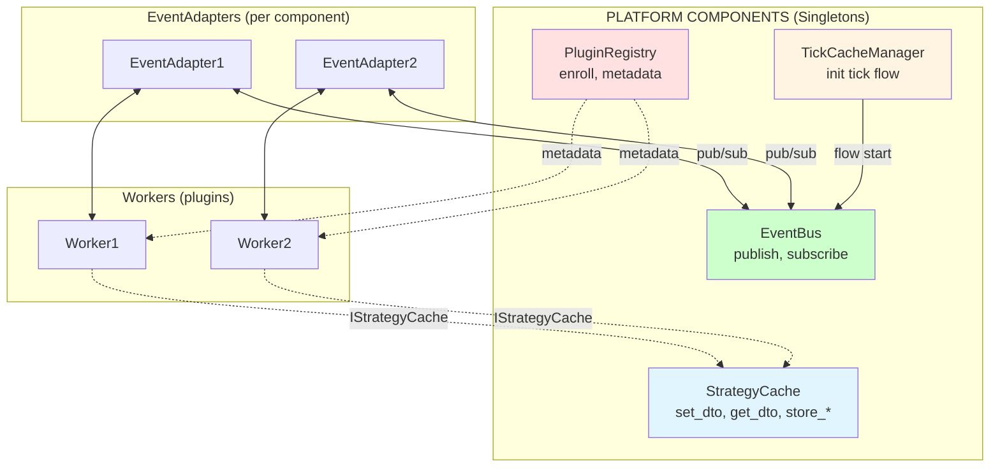

# Platform Components - Core Infrastructure

**S1mpleTrader V3** - Shared singletons providing infrastructure for strategy execution

## Overview

Platform components are **shared singleton services** that provide infrastructure for all strategies. Unlike workers (strategy-specific), platform components are:

- ✅ **Singleton**: One instance per application
- ✅ **Shared**: All strategies use same instance
- ✅ **Infrastructure**: Not business logic
- ✅ **Stateless** (EventBus) or **Multi-Tenant** (StrategyCache)

## Core Platform Components

### 1. EventBus - N-to-N Event Communication

**Status:** ✅ Implemented (Phase 1.2)  
**Location:** `backend/core/eventbus.py`  
**Protocol:** `backend/core/interfaces/eventbus.py`  
**Tests:** 33/33 passing (15 protocol + 18 implementation)

**Purpose:**
Enables asynchronous, decoupled communication between strategies and platform services via pub/sub messaging.

**Key Features:**
- ✅ **Topic-based routing**: Subscribe to specific topics or wildcards
- ✅ **Thread-safe**: Concurrent publish/subscribe operations
- ✅ **Error isolation**: Handler failures don't affect other subscribers
- ✅ **Wildcard support**: `signal.*` matches all signal topics
- ✅ **Subscription management**: Subscribe/unsubscribe dynamically

**Architecture:**
```python
# EventBus is platform singleton
event_bus = EventBus()

# Workers never call EventBus directly
# EventAdapter bridges worker ↔ EventBus

class EventAdapter:
    def __init__(self, worker: IWorker, event_bus: IEventBus):
        self._worker = worker
        self._event_bus = event_bus
    
    def wire(self, topics: list[str]) -> None:
        """Subscribe worker to topics."""
        for topic in topics:
            self._event_bus.subscribe(topic, self._on_event)
    
    def unwire(self) -> None:
        """Unsubscribe worker from all topics."""
        for topic in self._topics:
            self._event_bus.unsubscribe(topic, self._on_event)
    
    def _on_event(self, event: dict) -> None:
        """Handle incoming event."""
        envelope = self._worker.process()
        
        if envelope.disposition == "PUBLISH":
            self._event_bus.publish(
                topic=envelope.event_topic,
                payload=envelope.event_payload
            )
```

**Usage Patterns:**

1. **Worker → Platform Signal** (via DispositionEnvelope)
   ```python
   # Worker produces signal
   return DispositionEnvelope(
       disposition="PUBLISH",
       event_topic="signal.ema_crossover",
       event_payload=Signal(...)
   )
   
   # EventAdapter publishes to EventBus
   adapter._event_bus.publish(
       topic="signal.ema_crossover",
       payload=signal
   )
   ```

2. **Platform → Worker Trigger**
   ```python
   # Platform publishes event
   event_bus.publish("tick.received", tick_data)
   
   # EventAdapter receives event
   # Calls worker.process()
   ```

3. **Platform → Platform Communication**
   ```python
   # Journal subscribes to signals
   event_bus.subscribe("signal.*", journal.log_signal)
   event_bus.subscribe("risk.*", journal.log_risk)
   
   # Notifier subscribes to signals
   event_bus.subscribe("signal.high_confidence", notifier.send_alert)
   ```

**Topic Conventions:**
- `tick.received` - New tick data available
- `signal.*` - Signals (ema_crossover, rsi_oversold, etc.)
- `risk.*` - Risk signals (stop_loss_breach, portfolio_risk_high, etc.)
- `context.*` - Context updates (trend_shift, volatility_spike, etc.)
- `execution.*` - Execution events (order_filled, order_rejected, etc.)

**See:** [EVENTBUS_DESIGN.md](../development/#Archief/EVENTBUS_DESIGN.md) for detailed design (archived - fully implemented).

---

### 2. StrategyCache - Strategy Data Access Layer

**Status:** ✅ Implemented (Phase 1.2)  
**Location:** `backend/core/strategy_cache.py`  
**Protocol:** `backend/core/interfaces/strategy_cache.py`  
**Tests:** 20/20 passing

**Purpose:**
Provides thread-safe, strategy-isolated data access for workers via TickCache and persistent signal/plan storage.

**Key Features:**
- ✅ **Multi-tenant isolation**: Each strategy has isolated data
- ✅ **RunAnchor validation**: Ensures point-in-time consistency
- ✅ **TickCache lifecycle**: Clear/reconfigure per tick
- ✅ **Signal/Plan storage**: Persistent storage for Signal/Risk outputs
- ✅ **Type-safe access**: Generic methods for DTO retrieval

**Architecture:**
```python
# StrategyCache is platform singleton
strategy_cache = StrategyCache()

# Reconfigured per strategy run
strategy_cache.reconfigure(
    strategy_id="EMA_CROSSOVER_01",
    run_anchor=RunAnchor(timestamp=pd.Timestamp.now(tz="UTC"))
)

# Workers access via IStrategyCache protocol
class MyWorker:
    def __init__(self, config: WorkerConfig):
        self._config = config
        self._cache: IStrategyCache | None = None
    
    def initialize(self, strategy_cache: IStrategyCache) -> None:
        """Phase 2: Inject StrategyCache dependency."""
        self._cache = strategy_cache
    
    def process(self) -> DispositionEnvelope:
        # Read from TickCache
        ema_dto = self._cache.get_result_dto(EMAOutputDTO)
        
        # Write to TickCache
        self._cache.set_result_dto(self, MyOutputDTO(...))
        
        # Store signal (persistent)
        self._cache.store_signal(signal)
        
        return DispositionEnvelope(disposition="CONTINUE")
```

**Data Flows:**

1. **TickCache (Sync, Worker → Worker)**
   - Via `set_result_dto()` / `get_result_dto()`
   - Plugin-specific DTOs (EMAOutputDTO, RSIOutputDTO, etc.)
   - Lifespan: Single tick/run
   - Cleared after run completes

2. **Signal Storage (Persistent)**
   - Via `store_signal()` / `get_signal()`
   - System DTOs (Signal, Risk, ContextFactor)
   - Lifespan: Persistent (database-backed)
   - Used for analytics, journaling, UI

3. **Plan Storage (Persistent)**
   - Via `store_entry_plan()` / `get_entry_plan()`
   - Planning DTOs (EntryPlan, SizePlan, ExitPlan, ExecutionPlan)
   - Lifespan: Persistent until executed/expired
   - Used for execution coordination

**Lifecycle:**
```python
# 1. Initialize (once per application start)
cache = StrategyCache()

# 2. Reconfigure (per strategy run)
cache.reconfigure(strategy_id="STRAT_001", run_anchor=anchor)

# 3. Workers interact (during run)
cache.set_result_dto(worker, dto)
cache.store_signal(signal)

# 4. Clear TickCache (after run)
cache.clear_tick_cache()

# 5. Reconfigure for next run
cache.reconfigure(strategy_id="STRAT_002", run_anchor=new_anchor)
```

**See:** [POINT_IN_TIME_MODEL.md](POINT_IN_TIME_MODEL.md) for data flow details.

---

### 3. TickCacheManager - Flow Orchestration (Pending)

**Status:** ❌ Phase 3.3 (Not Yet Implemented)  
**Location:** `backend/core/tick_cache_manager.py` (future)

**Purpose:**
Orchestrates tick-by-tick flow execution: EventBus events → Worker chains → TickCache clearing.

**Responsibilities:**
- Listen to `tick.received` events
- Trigger worker chain execution (via EventBus)
- Coordinate StrategyCache.clear_tick_cache()
- Manage flow state transitions

**Design Considerations:**
- Should it be event-driven or polling-based?
- How to handle multi-strategy concurrent execution?
- Error recovery: partial tick failures?

**Pending Design Decision** - Not yet started.

---

### 4. PluginRegistry - Plugin Discovery (Future)

**Status:** ❌ Phase 2 (Not Yet Designed)  
**Location:** `backend/core/plugin_registry.py` (future)

**Purpose:**
Discovers, validates, and registers worker plugins from `plugins/` directory.

**Responsibilities:**
- Scan `plugins/` for manifest.yaml files
- Validate plugin structure (manifest + worker + schema)
- Register workers for factory instantiation
- Provide plugin metadata to UI

**Pending Design** - Not yet started.

---

## Platform Component Contracts

### Singleton Pattern

All platform components follow singleton pattern:

```python
# ❌ WRONG - Multiple instances
cache1 = StrategyCache()
cache2 = StrategyCache()  # Different instance!

# ✅ CORRECT - Singleton
class StrategyCache:
    _instance = None
    
    def __new__(cls):
        if cls._instance is None:
            cls._instance = super().__new__(cls)
        return cls._instance

# All references point to same instance
cache1 = StrategyCache()
cache2 = StrategyCache()
assert cache1 is cache2  # ✅ Same instance
```

### Thread Safety

Platform components must be thread-safe (concurrent strategy execution):

```python
# Example: EventBus uses locks
class EventBus:
    def __init__(self):
        self._handlers: dict[str, list[Callable]] = {}
        self._lock = threading.Lock()
    
    def subscribe(self, topic: str, handler: Callable) -> None:
        with self._lock:
            if topic not in self._handlers:
                self._handlers[topic] = []
            self._handlers[topic].append(handler)
```

### Lifecycle Management

Platform components have defined lifecycle:



**Example:**
```python
# 1. Construction
event_bus = EventBus()
strategy_cache = StrategyCache()

# 2. Initialization
# (EventBus has no init phase)

# 3. Reconfiguration (StrategyCache only)
strategy_cache.reconfigure(strategy_id="STRAT_001", run_anchor=anchor)

# 4. Active Use
event_bus.publish("tick.received", tick_data)
strategy_cache.set_result_dto(worker, dto)

# 5. Shutdown
event_bus.shutdown()  # Unsubscribe all handlers
strategy_cache.shutdown()  # Clear all caches
```

---

## Integration with Workers

### Workers Are Bus-Agnostic

Workers **never** import or depend on EventBus:

```python
# ❌ WRONG - Worker depends on EventBus
class MyWorker:
    def __init__(self, event_bus: IEventBus):
        self._event_bus = event_bus  # Tight coupling!
    
    def process(self):
        self._event_bus.publish("topic", payload)  # Direct call

# ✅ CORRECT - Worker returns DispositionEnvelope
class MyWorker:
    def process(self) -> DispositionEnvelope:
        return DispositionEnvelope(
            disposition="PUBLISH",
            event_topic="topic",
            event_payload=payload
        )
```

**EventAdapter bridges worker ↔ EventBus** (Phase 3).

### Workers Use IStrategyCache Protocol

Workers depend on IStrategyCache protocol, not concrete StrategyCache:

```python
# Worker uses protocol (abstract interface)
class MyWorker:
    def initialize(self, strategy_cache: IStrategyCache) -> None:
        self._cache = strategy_cache  # Protocol, not concrete class
    
    def process(self) -> DispositionEnvelope:
        dto = self._cache.get_result_dto(SomeDTO)  # Protocol method
        self._cache.set_result_dto(self, MyDTO(...))  # Protocol method
        return DispositionEnvelope(disposition="CONTINUE")
```

**Benefits:**
- Easy mocking for tests (no concrete dependency)
- Workers decoupled from StrategyCache implementation
- Can swap cache implementation without changing workers

---

## Component Interaction Diagram



**Flow:**
1. EventBus publishes `tick.received` event
2. EventAdapter receives event, calls worker.process()
3. Worker reads DTOs from StrategyCache._tick_cache
4. Worker writes output DTO to StrategyCache._tick_cache
5. Worker returns DispositionEnvelope(PUBLISH, payload)
6. EventAdapter publishes payload to EventBus
7. EventBus broadcasts to all subscribers

---

## Implementation Status

| Component | Protocol | Implementation | Tests | Status |
|-----------|----------|----------------|-------|--------|
| **EventBus** | IEventBus | EventBus | 33/33 ✅ | Phase 1.2 Complete |
| **StrategyCache** | IStrategyCache | StrategyCache | 20/20 ✅ | Phase 1.2 Complete |
| **IWorkerLifecycle** | IWorkerLifecycle | - | 0/~10 | Phase 1.2 In Progress |
| **TickCacheManager** | - | - | - | Phase 3.3 Pending |
| **PluginRegistry** | - | - | - | Phase 2 Pending |

**See:** [IMPLEMENTATION_STATUS.md](../implementation/IMPLEMENTATION_STATUS.md) for detailed metrics.

---

## Related Documentation

- **EventBus Design:** [EVENTBUS_DESIGN.md](../development/#Archief/EVENTBUS_DESIGN.md) - Archived (fully implemented + tested)
- **IWorkerLifecycle Design:** [IWORKERLIFECYCLE_DESIGN.md](../development/#Archief/IWORKERLIFECYCLE_DESIGN.md) - Archived (fully implemented + tested)
- **Point-in-Time Model:** [POINT_IN_TIME_MODEL.md](POINT_IN_TIME_MODEL.md) - StrategyCache data flows
- **Architectural Shifts:** [ARCHITECTURAL_SHIFTS.md](ARCHITECTURAL_SHIFTS.md) - V2 → V3 changes
- **Implementation Status:** [../implementation/IMPLEMENTATION_STATUS.md](../implementation/IMPLEMENTATION_STATUS.md) - Current progress

---

**Last Updated:** 2025-10-29  
**Status:** EventBus + StrategyCache + IWorkerLifecycle complete (all tested)
