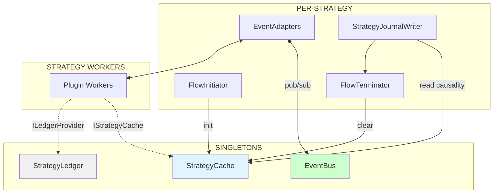

# docs/architecture/PLATFORM_COMPONENTS.md
# Platform Components - S1mpleTraderV3

**Status:** DEFINITIVE
**Version:** 2.0
**Last Updated:** 2025-11-28---

## Purpose

This document describes the **platform-level infrastructure components** that provide shared services for all strategy workers in S1mpleTrader V3.

**Target audience:** Developers implementing strategy workers or extending platform infrastructure.

## Scope

**In Scope:**
- Singleton infrastructure components (EventBus, StrategyCache, StrategyLedger)
- Per-strategy platform workers (FlowInitiator, FlowTerminator, StrategyJournalWriter)
- Event routing infrastructure (EventAdapter)
- Component lifecycle and thread-safety patterns

**Out of Scope:**
- Strategy workers (plugins) → See [WORKER_TAXONOMY.md][worker-taxonomy]
- Event wiring configuration → See [EVENT_DRIVEN_WIRING.md][event-wiring]
- Container hierarchy → See [TRADE_LIFECYCLE.md][trade-lifecycle]

## Prerequisites

Read these first:
1. [CORE_PRINCIPLES.md][core-principles] - Plugin-first, separation of concerns
2. [WORKER_TAXONOMY.md][worker-taxonomy] - The 6 strategy worker categories

---

## 1. Component Categories

Platform components fall into two categories:

| Category | Lifecycle | Examples |
|----------|-----------|----------|
| **Singletons** | One per application | EventBus, StrategyCache, StrategyLedger |
| **Per-Strategy** | One per strategy instance | FlowInitiator, FlowTerminator, StrategyJournalWriter, EventAdapter |

### 1.1 Key Characteristics

- ✅ **Infrastructure**: Core plumbing, not business logic
- ✅ **Stateless or Multi-Tenant**: No strategy-specific state in singletons
- ✅ **Thread-Safe**: Concurrent access from multiple strategies
- ✅ **Protocol-Based**: Workers access via interfaces (IStrategyCache, IEventBus)

---

## 2. Singleton Components

### 2.1 EventBus - N-to-N Event Communication

**Status:** ✅ Implemented  
**Location:** `backend/core/eventbus.py`  
**Protocol:** `backend/core/interfaces/eventbus.py`

**Purpose:** Asynchronous, decoupled pub/sub messaging between components.

**Key Features:**
- Topic-based routing with wildcard support (`signal.*`)
- Thread-safe concurrent operations
- Error isolation (handler failures don't affect others)

**Workers are bus-agnostic:** They return `DispositionEnvelope`, EventAdapter handles routing.

---

### 2.2 StrategyCache - Strategy Data Access Layer

**Status:** ✅ Implemented  
**Location:** `backend/core/strategy_cache.py`  
**Protocol:** `backend/core/interfaces/strategy_cache.py`

**Purpose:** Thread-safe, strategy-isolated DTO storage for workers.

**Key Features:**
- Multi-tenant isolation per strategy
- RunAnchor validation for point-in-time consistency
- Cleared after each tick/run completes

**Data Flows:**
1. **Sync (Worker → Worker):** `set_result_dto()` / `get_result_dto()`
2. **Signal Storage:** `store_signal()` for persistent signals

---

### 2.3 StrategyLedger - Trade State Persistence

**Status:** 🔄 Design Phase  
**Location:** `backend/core/strategy_ledger.py` (future)  
**Protocol:** TBD

**Purpose:** Single source of truth for all trade state containers.

**Owns:**
- TradePlan → ExecutionGroup → Order → Fill hierarchy
- Container lifecycle (create, update, close)
- Query interface for ExecutionWorker

**Access Patterns:**
| Component | Access |
|-----------|--------|
| StrategyPlanner | Read (check duplicates) |
| TradePlanners | Read (current position/exits) |
| ExecutionWorker | Read + Write (full CRUD) |

**Cross-reference:** [TRADE_LIFECYCLE.md][trade-lifecycle] for container hierarchy.

---

## 3. Per-Strategy Components

### 3.1 FlowInitiator - Pipeline Entry Point

**Status:** ✅ Implemented  
**Location:** `backend/core/flow_initiator.py`

**Purpose:** Initializes StrategyCache before workers execute.

**Responsibilities:**
1. Receive trigger from DataProvider/Scheduler
2. Call `StrategyCache.start_new_run(origin)`
3. Store `PlatformDataDTO` in cache
4. Emit event to start Phase 1 workers

**Critical:** Prevents race condition where workers access cache before initialization.

**Cross-reference:** [TRIGGER_ARCHITECTURE.md][trigger-arch] for trigger flow.

---

### 3.2 FlowTerminator - Pipeline Exit Point

**Status:** 🔄 Design Phase  
**Location:** `backend/core/flow_terminator.py` (future)

**Purpose:** Clean up after pipeline run completes.

**Responsibilities:**
1. Log metrics (execution time, worker counts)
2. Clear StrategyCache for next run
3. Garbage collection
4. Emit `FLOW_TERMINATED` event (optional, for UI)

**Triggered by:** StrategyJournalWriter completion OR timeout.

---

### 3.3 StrategyJournalWriter - Causality Persistence

**Status:** 🔄 Design Phase  
**Location:** `backend/core/strategy_journal_writer.py` (future)

**Purpose:** Persist causality chain for quant analysis.

**Responsibilities:**
1. Retrieve CausalityChain from StrategyCache (via OrderID)
2. Write journal entry: causality + order_id + context
3. Enable analysis: WHY → WHAT → HOW → OUTCOME

**Timing:** Executes BEFORE FlowTerminator (SRP separation).

**Cross-reference:** [EXECUTION_FLOW.md][execution-flow] for sync/async flows.

---

### 3.4 EventAdapter - Worker ↔ EventBus Bridge

**Status:** 🔄 Phase 3  
**Location:** `backend/core/event_adapter.py` (future)

**Purpose:** Bridge between workers and EventBus (workers stay bus-agnostic).

**Responsibilities:**
1. Subscribe to events per `wiring_map.yaml`
2. Invoke worker's `process()` method on event
3. Interpret `DispositionEnvelope` return value
4. Publish events based on disposition (CONTINUE/PUBLISH/STOP)

**One adapter per component:** Clear ownership and isolation.

**Cross-reference:** [EVENT_DRIVEN_WIRING.md][event-wiring] for wiring configuration.

---

## 4. Component Interaction

```mermaid
graph TB
    subgraph Singletons["SINGLETONS"]
        Bus[EventBus]
        Cache[StrategyCache]
        Ledger[StrategyLedger]
    end
    
    subgraph PerStrategy["PER-STRATEGY"]
        FI[FlowInitiator]
        EA[EventAdapters]
        SJW[StrategyJournalWriter]
        FT[FlowTerminator]
    end
    
    subgraph Workers["STRATEGY WORKERS"]
        W[Plugin Workers]
    end
    
    FI -->|init| Cache
    EA <-->|pub/sub| Bus
    EA <--> W
    W -.->|IStrategyCache| Cache
    W -.->|ILedgerProvider| Ledger
    SJW -->|read causality| Cache
    SJW --> FT
    FT -->|clear| Cache
    
    style Bus fill:#ccffcc
    style Cache fill:#e1f5ff
    style Ledger fill:#f0f0f0
```

---

## 5. Implementation Status

| Component | Protocol | Status | Tests |
|-----------|----------|--------|-------|
| **EventBus** | IEventBus | ✅ Complete | 33/33 |
| **StrategyCache** | IStrategyCache | ✅ Complete | 20/20 |
| **FlowInitiator** | IWorker + IWorkerLifecycle | ✅ Complete | 14/14 |
| **StrategyLedger** | TBD | 🔄 Design | - |
| **FlowTerminator** | TBD | 🔄 Design | - |
| **StrategyJournalWriter** | TBD | 🔄 Design | - |
| **EventAdapter** | TBD | 🔄 Phase 3 | - |

**See:** [IMPLEMENTATION_STATUS.md][impl-status] for detailed metrics.

---

## Related Documentation

- **[WORKER_TAXONOMY.md][worker-taxonomy]** - The 6 strategy worker categories
- **[TRIGGER_ARCHITECTURE.md][trigger-arch]** - FlowInitiator trigger flow
- **[EXECUTION_FLOW.md][execution-flow]** - Sync/async execution flows
- **[TRADE_LIFECYCLE.md][trade-lifecycle]** - Container hierarchy
- **[EVENT_DRIVEN_WIRING.md][event-wiring]** - EventAdapter configuration

<!-- Link definitions -->
[worker-taxonomy]: ./WORKER_TAXONOMY.md "Strategy worker categories"
[trigger-arch]: ./TRIGGER_ARCHITECTURE.md "Trigger layer architecture"
[execution-flow]: ./EXECUTION_FLOW.md "Execution flow"
[trade-lifecycle]: ./TRADE_LIFECYCLE.md "Trade lifecycle"
[event-wiring]: ./EVENT_DRIVEN_WIRING.md "Event wiring"
[core-principles]: ./CORE_PRINCIPLES.md "Core design principles"
[impl-status]: ../implementation/IMPLEMENTATION_STATUS.md "Implementation status"

---

## Version History

| Version | Date | Author | Changes |
|---------|------|--------|---------|
| 2.0 | 2025-11-28 | AI | Major revision: ARCHITECTURE_TEMPLATE format, added StrategyLedger/FlowTerminator/StrategyJournalWriter/EventAdapter, reorganized into Singletons vs Per-Strategy |
| 1.0 | 2025-11-09 | AI | Initial document with EventBus, StrategyCache, FlowInitiator |
