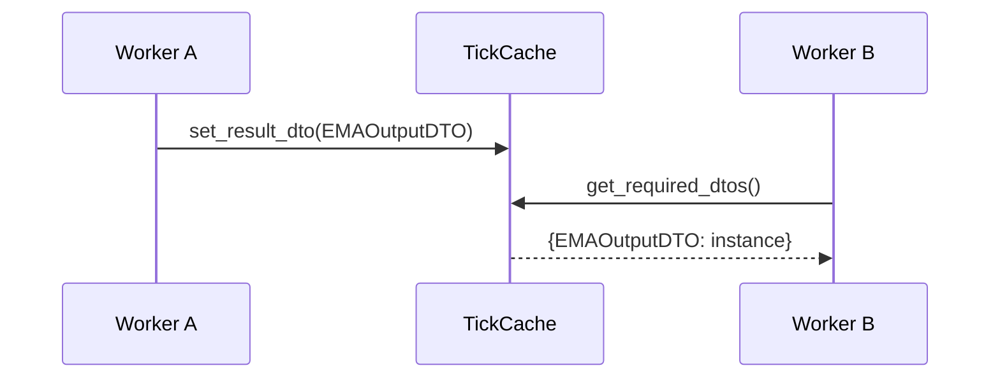
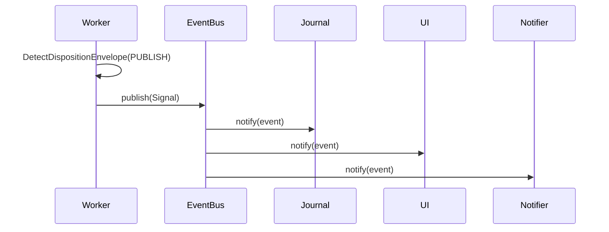

# Point-in-Time Data Model - DTO-Centric Architecture

**Core Concept:** Alle data-uitwisseling is gebaseerd op **één specifiek moment** (tick), NIET op een groeiende dataset.

## Kernprincipes

### 1. Immutability per Tick
- ✅ Elke tick = nieuwe TickCache
- ✅ Workers lezen/schrijven DTOs, muteren nooit
- ✅ TickCache cleared na run completion

### 2. Type-Safe DTO Contracts
- ✅ Alle data via Pydantic BaseModel
- ✅ Workers declareren requires_dtos in manifest
- ✅ Bootstrap validates DTO dependencies

### 3. Explicit Dependencies
- ✅ No implicit data passing (no hidden DataFrame columns)
- ✅ manifest.yaml = source of truth
- ✅ DependencyValidator ensures producers exist

## IStrategyCache - The Central Container

**Status:** ✅ IMPLEMENTED (`backend/core/strategy_cache.py`, 20 tests passing)

### Interface
```python
class RunAnchor(BaseModel):
    """Point-in-time validation anchor."""
    timestamp: datetime
    model_config = ConfigDict(frozen=True)

class IStrategyCache(Protocol):
    """DTO container for one strategy run."""
    
    def start_new_strategy_run(
        self,
        strategy_cache: Dict[Type[BaseModel], BaseModel],
        timestamp: datetime
    ) -> None: ...
    
    def get_run_anchor(self) -> RunAnchor: ...
    
    def get_required_dtos(
        self,
        requesting_worker: IWorker
    ) -> Dict[Type[BaseModel], BaseModel]: ...
    
    def set_result_dto(
        self,
        producing_worker: IWorker,
        result_dto: BaseModel
    ) -> None: ...
    
    def has_dto(self, dto_type: Type[BaseModel]) -> bool: ...
    
    def clear_cache(self) -> None: ...
```

### Usage Pattern
```python
class MyWorker(StandardWorker):
    strategy_cache: IStrategyCache  # Injected by WorkerFactory
    
    def process(self) -> DispositionEnvelope:
        # 1. Get timestamp anchor (for platform provider validation)
        anchor = self.strategy_cache.get_run_anchor()
        
        # 2. Get required input DTOs
        dtos = self.strategy_cache.get_required_dtos(self)
        ema_dto = dtos[EMAOutputDTO]  # Type-safe lookup
        
        # 3. Use platform providers (with timestamp validation)
        df = self.ohlcv_provider.get_window(
            end_time=anchor.timestamp,
            lookback=100
        )
        
        # 4. Calculate
        result = my_calculation(ema_dto, df)
        
        # 5. Produce output DTO (stored in TickCache)
        self.strategy_cache.set_result_dto(
            self,
            MyOutputDTO(value=result, timestamp=anchor.timestamp)
        )
        
        return DispositionEnvelope(disposition="CONTINUE")
```

## Two Communication Paths

### Path 1: TickCache (Sync, Flow-Data)

**Purpose:** Worker-to-worker data passing within one strategy run.

**Characteristics:**
- ✅ Synchronous access
- ✅ Plugin-specific DTOs
- ✅ Type-based storage (one DTO instance per type)
- ✅ Lifetime: one tick/run
- ✅ Accessed via `IStrategyCache`

**Flow:**



**Example DTOs:**
- `EMAOutputDTO` (from EMA ContextWorker)
- `RSIOutputDTO` (from RSI ContextWorker)
- `VolumeProfileDTO` (from Volume ContextWorker)

### Path 2: EventBus (Async, Signals)

**Purpose:** Platform signals, alerts, external notifications.

**Characteristics:**
- ✅ Asynchronous broadcast
- ✅ System DTOs only (Signal, Risk, etc.)
- ✅ N-to-N communication
- ✅ Persisted via EventBus subscribers
- ✅ Published via `DispositionEnvelope(PUBLISH)`

**Flow:**



**Example DTOs:**
- `Signal` (confidence-based signal)
- `Risk` (severity-based warning)
- `StrategyDirective` (SWOT-driven decision)
- `ExecutionDirective` (ready-to-execute plan)

## DTO Dependency Resolution

### Manifest Declaration
```yaml
# plugins/signal_workers/ema_cross_detector/manifest.yaml
dependencies:
  requires_dtos:
    - source: "backend.dto_reg.s1mple.ema_detector.v1_0_0.ema_output_dto"
      dto_class: "EMAOutputDTO"
  
  produces_dtos:
    - dto_class: "EMACrossSignalDTO"
      local_path: "dtos/ema_cross_signal_dto.py"
```

### Bootstrap Validation
```python
# DependencyValidator (runs at bootstrap)
validator = DependencyValidator()
validator.validate_dto_dependencies(workforce_spec)

# Checks:
# 1. Every requires_dtos has a producer in workforce
# 2. DTO imports are valid
# 3. No circular dependencies
```

### Runtime Resolution
```python
# Worker gets DTOs from cache (no manifest inspection!)
dtos = self.strategy_cache.get_required_dtos(self)
ema_dto = dtos[EMAOutputDTO]  # Type-safe, validated at bootstrap
```

## DTO Sharing via Enrollment

**Plugin-specific DTOs** worden gedeeld via centraal register:

### 1. Definition
```python
# plugins/context_workers/ema_detector/dtos/ema_output_dto.py
class EMAOutputDTO(BaseModel):
    ema_20: Decimal
    timestamp: datetime
```

### 2. Manifest
```yaml
# plugins/context_workers/ema_detector/manifest.yaml
dependencies:
  produces_dtos:
    - dto_class: "EMAOutputDTO"
      local_path: "dtos/ema_output_dto.py"
```

### 3. Enrollment (Platform)
```
backend/dto_reg/s1mple/ema_detector/v1_0_0/
└── ema_output_dto.py  # Copied during plugin enrollment
```

### 4. Consumption
```python
# Other plugins import from central registry
from backend.dto_reg.s1mple.ema_detector.v1_0_0.ema_output_dto import EMAOutputDTO
```

## TickCacheManager - Flow Lifecycle

**Singleton** die strategy run lifecycle beheert:

### 1. Flow Initiation
```python
# Listens to:
# - RAW_TICK (from ExecutionEnvironment)
# - SCHEDULED_TASK (from Scheduler)
# - NEWS_RECEIVED (from NewsAdapter)

def on_tick_event(self, event):
    # 1. Create new TickCache
    cache = {}
    
    # 2. Configure StrategyCache singleton
    self.strategy_cache.start_new_strategy_run(
        strategy_cache=cache,
        timestamp=event.timestamp
    )
    
    # 3. Publish flow start event
    self.event_bus.publish("TICK_FLOW_START", None)
```

### 2. Worker Execution
```python
# First workers in chain listen to TICK_FLOW_START
# EventAdapter triggers worker.process()
# Workers use IStrategyCache to read/write DTOs
# Flow progresses via wiring_map.yaml
```

### 3. Flow Cleanup
```python
# Listens to:
# - TICK_FLOW_COMPLETE
# - timeout (configurable)

def on_flow_complete(self):
    self.strategy_cache.clear_cache()
```

## Pre-Filled TickCache

Platform capability providers kunnen TickCache **pre-populaten**:

```python
# Platform fills cache before worker chain starts
cache = {
    OHLCVDataDTO: OHLCVDataDTO(
        timestamp=tick.timestamp,
        open=tick.open,
        high=tick.high,
        low=tick.low,
        close=tick.close,
        volume=tick.volume
    )
}

strategy_cache.start_new_strategy_run(cache, tick.timestamp)

# Workers can now access platform data
dtos = self.strategy_cache.get_required_dtos(self)
ohlcv = dtos[OHLCVDataDTO]  # Pre-filled by platform!
```

## Exceptions

### NoActiveRunError
```python
# Raised when cache operation without active run
try:
    anchor = strategy_cache.get_run_anchor()
except NoActiveRunError:
    # Call start_new_strategy_run() first!
```

### MissingContextDataError
```python
# Raised when required DTO not in cache
# This indicates:
# - Bootstrap validation bug
# - Wiring configuration error
# - Producer worker didn't run
```

### UnexpectedDTOTypeError
```python
# Raised when worker produces DTO not in manifest
# Fix: Update manifest.produces_dtos OR remove DTO production
```

## Testing Patterns

### Mock IStrategyCache
```python
def test_my_worker():
    # Arrange
    mock_cache = Mock(spec=IStrategyCache)
    mock_cache.get_run_anchor.return_value = RunAnchor(
        timestamp=datetime(2025, 10, 28, 10, 30, 0, tzinfo=timezone.utc)
    )
    mock_cache.get_required_dtos.return_value = {
        InputDTO: InputDTO(value=100)
    }
    
    worker = MyWorker()
    worker.strategy_cache = mock_cache
    
    # Act
    result = worker.process()
    
    # Assert
    mock_cache.set_result_dto.assert_called_once()
    assert result.disposition == "CONTINUE"
```

## Benefits Summary

✅ **Memory Efficient**: TickCache cleared after each run
✅ **Type-Safe**: Pydantic validation + Pylance type checking
✅ **Testable**: Mock IStrategyCache, inject test DTOs
✅ **Debuggable**: Explicit dependencies, no hidden state
✅ **Concurrent-Safe**: Immutable DTOs, no shared mutable state
✅ **Performance**: Type-based O(1) lookup, no DataFrame overhead

## Zie Ook

- [Platform Components](PLATFORM_COMPONENTS.md) - StrategyCache implementation
- [Worker Taxonomy](WORKER_TAXONOMY.md) - Worker data access patterns
- [Architectural Shifts](ARCHITECTURAL_SHIFTS.md#verschuiving-2) - Why this model?
- [Reference: StrategyCache](../reference/platform/strategy_cache.md) - Implementation details
