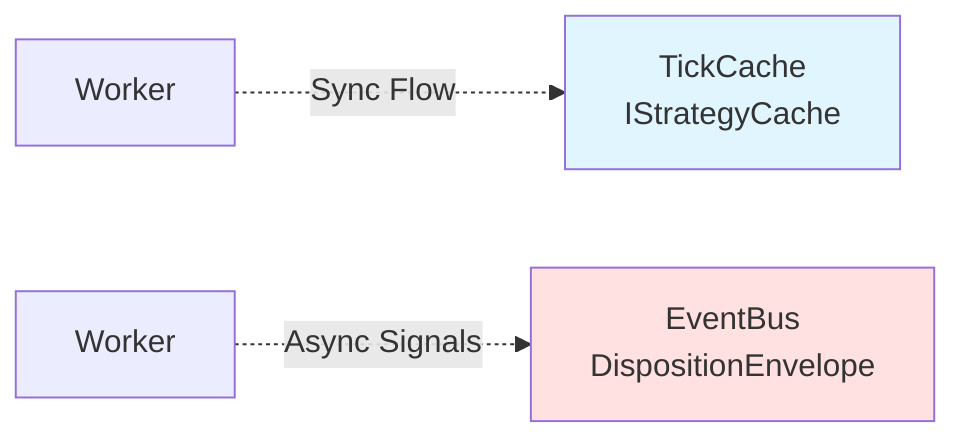
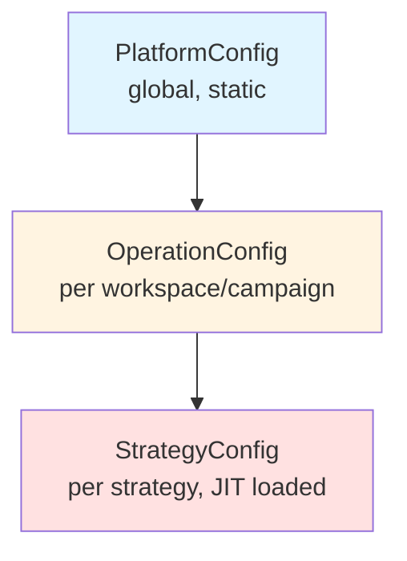

# Architecture Documentation - Navigation

**S1mpleTrader V3** - Plugin-First, Event-Driven Trading Platform

## Quick Start

**New to the project?** Read in this order:
1. [Core Principles](CORE_PRINCIPLES.md) - Vision + 4 fundamental principles
2. [Pipeline Flow](PIPELINE_FLOW.md) - Complete 6+1 phase pipeline from tick to execution
3. [Point-in-Time Model](POINT_IN_TIME_MODEL.md) - DTO-Centric data flow
4. [Worker Taxonomy](WORKER_TAXONOMY.md) - 6 worker categories
5. [Platform Components](PLATFORM_COMPONENTS.md) - Core infrastructure

**Implementing a feature?** Jump to:
- **Workers**: [Worker Taxonomy](WORKER_TAXONOMY.md) → [Plugin Anatomy](PLUGIN_ANATOMY.md)
- **Platform**: [Platform Components](PLATFORM_COMPONENTS.md)
- **Configuration**: [Configuration Layers](CONFIGURATION_LAYERS.md)

## Architecture Overview

### Foundation Concepts

| Document | Purpose | Key Topics |
|----------|---------|------------|
| [Core Principles](CORE_PRINCIPLES.md) | Vision + Design Philosophy | Plugin First, Separation of Concerns, Config-Driven, Contract-Driven |
| [Objective Data Philosophy](OBJECTIVE_DATA_PHILOSOPHY.md) | **Quant Leap Philosophy** | Objective ContextWorkers, Subjective Consumers, No SWOT Aggregation |
| [Pipeline Flow](PIPELINE_FLOW.md) | **COMPLETE PIPELINE** | 6+1 Phases: Bootstrapping → Context → Opportunity/Threat → Strategy → Planning → Translation → Execution |
| [Layered Architecture](LAYERED_ARCHITECTURE.md) | System Layers | Frontend → Service → Backend, Dependency flow |

### Configuration & Bootstrap

| Document | Purpose | Key Topics |
|----------|---------|------------|
| [Configuration Layers](CONFIGURATION_LAYERS.md) | 3-Layer Config System | PlatformConfig, OperationConfig, StrategyConfig |
| [Layered Architecture](LAYERED_ARCHITECTURE.md#bootstrap-workflow) | Bootstrap Process | ConfigLoader → Validator → Translator → Factories |

### Data Model & Communication

| Document | Purpose | Key Topics |
|----------|---------|------------|
| [Point-in-Time Model](POINT_IN_TIME_MODEL.md) | **CORE DATA MODEL** | TickCache, IStrategyCache, RunAnchor, DTO flow |
| [Data Flow](DATA_FLOW.md) | Worker Communication | DispositionEnvelope, CONTINUE/PUBLISH/STOP |
| [Event-Driven Wiring](EVENT_DRIVEN_WIRING.md) | Event Architecture | EventBus, EventAdapter, wiring_map.yaml |
| [AsyncIO Architecture](ASYNC_IO_ARCHITECTURE.md) | **ASYNC & TIMING** | AsyncIO patterns, Timing separation, Event-driven state |
| [Event Architecture](EVENT_ARCHITECTURE.md) | Complete Event System | Event producers, EventStore, EventQueue, Delivery guarantees |

### Workers & Plugins

| Document | Purpose | Key Topics |
|----------|---------|------------|
| [Worker Taxonomy](WORKER_TAXONOMY.md) | 5 Worker Categories | Context, Signal, Risk, Planning, StrategyPlanner |
| [Plugin Anatomy](PLUGIN_ANATOMY.md) | Plugin Structure | manifest.yaml, worker.py, schema.py, DTOs |

### Platform Infrastructure

| Document | Purpose | Key Topics |
|----------|---------|------------|
| [Platform Components](PLATFORM_COMPONENTS.md) | Core Singletons | StrategyCache, EventBus, TickCacheManager, PluginRegistry |
| [LogEnricher Design](LOGENRICHER_DESIGN.md) | **PRELIMINARY** - Structured Logging | LogFormatter, LogEnricher, Translator, i18n compliance |

## Critical Path for New Developers

### Phase 1: Understanding the Model
1. ✅ Read [Core Principles](CORE_PRINCIPLES.md) - Design philosophy
2. ✅ Read [Pipeline Flow](PIPELINE_FLOW.md) - Complete 6+1 phase pipeline
3. ✅ Read [Point-in-Time Model](POINT_IN_TIME_MODEL.md) - DTO-centric data flow
4. ✅ Read [Worker Taxonomy](WORKER_TAXONOMY.md) - 6 worker categories
5. ✅ Skim [Platform Components](PLATFORM_COMPONENTS.md) - Core infrastructure

### Phase 2: Implementation Patterns
1. ✅ Study [Plugin Anatomy](PLUGIN_ANATOMY.md)
2. ✅ Review [Data Flow](DATA_FLOW.md)
3. ✅ Check [Platform Components](PLATFORM_COMPONENTS.md)

### Phase 3: Deep Dive (as needed)
- Configuration complex? → [Configuration Layers](CONFIGURATION_LAYERS.md)
- Event wiring issues? → [Event-Driven Wiring](EVENT_DRIVEN_WIRING.md)
- Bootstrap debugging? → [Layered Architecture](LAYERED_ARCHITECTURE.md#bootstrap-workflow)

## Architecture Decisions

**Key Design Choices:**
- **No SWOT Aggregation**: ContextWorkers produce objective facts, consumers interpret (see [Objective Data Philosophy](OBJECTIVE_DATA_PHILOSOPHY.md))
- **No Operators**: Workers wired via EventAdapters (see [Event-Driven Wiring](EVENT_DRIVEN_WIRING.md))
- **No Growing DataFrames**: Point-in-Time DTOs only (see [Point-in-Time Model](POINT_IN_TIME_MODEL.md))
- **Fail-Fast Bootstrap**: Validation during assembly, not runtime (see [Layered Architecture](LAYERED_ARCHITECTURE.md#bootstrap-workflow))

## Quick Reference

### Data Flow Paths

```mermaid
graph LR
    W1[Worker] -.Sync Flow.-> TC[TickCache<br/>IStrategyCache]
    W2[Worker] -.Async Signals.-> Bus[EventBus<br/>DispositionEnvelope]
    
    style TC fill:#e1f5ff
    style Bus fill:#ffe1e1
```

- **Sync Flow** (worker → worker): TickCache via `IStrategyCache.set_result_dto()`
- **Async Signals** (worker → platform): EventBus via `DispositionEnvelope(PUBLISH)`

### Worker Output Types
- **CONTINUE**: Trigger next worker(s) in chain
- **PUBLISH**: Publish custom event + payload to EventBus
- **STOP**: End flow, trigger cleanup

### Configuration Hierarchy

```mermaid
graph TD
    P[PlatformConfig<br/>global, static]
    O[OperationConfig<br/>per workspace/campaign]
    S[StrategyConfig<br/>per strategy, JIT loaded]
    
    P --> O
    O --> S
    
    style P fill:#e1f5ff
    style O fill:#fff4e1
    style S fill:#ffe1e1
```

## Related Documentation

- **Implementation Status**: [../implementation/IMPLEMENTATION_STATUS.md](../implementation/IMPLEMENTATION_STATUS.md)
- **Coding Standards**: [../coding_standards/](../coding_standards/)
- **Reference Examples**: [../reference/](../reference/)
- **Project Roadmap**: [../TODO.md](../TODO.md)

---

**Last Updated:** 2025-11-02  
**Maintained By:** Development Team  
**For Questions:** See relevant detailed document or TODO.md for current work
