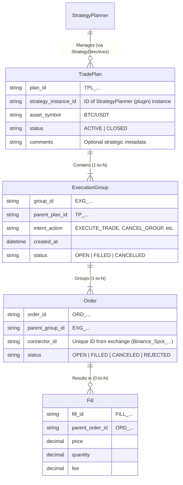

# Trade Lifecycle & Architecture - S1mpleTraderV3

**Status:** Definitive  
**Version:** 1.0  
**Goal:** This document complements `PIPELINE_FLOW.md` and `EXECUTION_FLOW.md`. It defines the data hierarchy, lifecycle scopes, and interaction patterns between strategic plugins and platform components.

---

## 1. Data Hierarchy (Nesting)

The lifecycle of a strategy is not managed by a single "Trade DTO" traveling through the pipeline, but by a strict hierarchy of **Persisted Entities** in the `StrategyLedger`. This ensures a clear separation of concerns.

### 1.1. Container Structure



### 1.2. Ownership Matrix

| Level | Entity | Creator | Manager (State Updates) | Consumer (Read) | Description |
| :--- | :--- | :--- | :--- | :--- | :--- |
| **Strategic** | **TradePlan** | StrategyLedger | StrategyPlanner (indirect) | StrategyPlanner (Self) | The long-lived container for the *entire* strategy (e.g., Grid, DCA). Created by Ledger upon first ExecutionGroup registration. |
| **Tactical** | **ExecutionGroup** | ExecutionPlanner | ExecutionWorker | StrategyPlanner (read-only) | State Container for 1-N orders from one ExecutionDirective. Atomic tactical execution unit (e.g., "one TWAP run"). **Design:** [EXECUTION_GROUP_DESIGN.md](../development/EXECUTION_GROUP_DESIGN.md) |
| **Operational** | **Order** | ExecutionWorker | ExecutionWorker | ExchangeConnector | Concrete exchange instruction. No strategic context. Environment-agnostic placement via IExecutionConnector. |
| **Result** | **Fill** | ExchangeConnector | N/A (Immutable) | StrategyLedger | Immutable market reality. [cite: Async Exchange Reply Flow] |


---

## 2. Access Levels & StrategyLedger Interaction

The `StrategyLedger` enforces access control based on worker role. Intelligence resides in workers, not the Ledger (SRP).

### Level 1: Strategy Domain (High-Level)

**User:** StrategyPlanner
**Rights:** Read `TradePlan` and `ExecutionGroup` summaries
**Forbidden:** Direct Order/Fill manipulation

### Level 2: Execution Planning Domain (Mid-Level)

**User:** ExecutionPlanner
**Rights:** Read TradePlan/ExecutionGroup data for planning decisions; **Creates** ExecutionGroup entities
**Key Responsibility:** Registers new ExecutionGroup in Ledger when generating ExecutionDirective

### Level 3: Execution Domain (Low-Level)

**User:** ExecutionWorker
**Rights:** Full ExecutionGroup state management (read/update); Order/Fill registration via IExecutionConnector
**Key Responsibility:** Updates ExecutionGroup state as execution progresses

> **Note:** Detailed Ledger API design is ongoing. See [TODO.md](../TODO.md) for StrategyLedger interface design tasks.

---

## 3. ExecutionPlanner & ExecutionDirective

The **ExecutionPlanner** (Plugin Worker, Phase 5) aggregates all four trade plans and creates the ExecutionDirective.

### 3.1. ExecutionPlanner Role

**Input:** `EntryPlan`, `SizePlan`, `ExitPlan`, `ExecutionPlan`, `StrategyDirective` (from StrategyCache)

**Process:**
*   Inherits from `BaseExecutionPlanner` (handles aggregation boilerplate for all 4 plans)
*   Creates ExecutionGroup entity and registers it in StrategyLedger
*   Determines execution strategy based on ExecutionPlan hints
*   Applies config-driven filtering (confidence ranges)

**Output:** `ExecutionDirective` (contains ExecutionGroup reference) via `Disposition.CONTINUE`

> **Design:** See [EXECUTION_PLANNER_DESIGN.md](../development/EXECUTION_PLANNER_DESIGN.md) *(TODO)*

### 3.2. ExecutionDirective Structure

See DTO: [execution_directive.py](../../backend/dtos/execution/execution_directive.py)

**Key Fields:**
*   `directive_id`: Unique execution identifier
*   `causality`: Full traceability chain
*   4 Optional plans: `entry_plan`, `size_plan`, `exit_plan`, `execution_plan`
*   Validation: At least 1 plan required

### 3.3. ExecutionAction (Enum)

The `ExecutionPlan.action` field (part of the 4th plan) defines the operational command:

#### A. Creation Commands

*   **EXECUTE_TRADE**
    *   **Meaning:** "Place new orders according to the attached Entry/Size/Exit plans."
    *   **Context:** Used with `scope=NEW_TRADE` (new entry) or `scope=CLOSE_EXISTING` (new close order).
    *   **Consequence:** ExecutionWorker creates 1-to-N orders via IExecutionConnector (e.g., for a TWAP sequence).

#### B. Cancellation Commands

*   **CANCEL_GROUP**
    *   **Meaning:** "Cancel all open (unfilled) orders belonging to this TargetGroupID."
    *   **Context:** Used with `scope=MODIFY_EXISTING`. E.g., StrategyPlanner retracts a specific set of grid orders.
    *   **Consequence:** ExecutionWorker calls `ledger.get_open_order_ids(group_id)` and cancels via IExecutionConnector.
*   **CANCEL_ALL_IN_PLAN**
    *   **Meaning:** "Emergency Stop. Cancel *all* open orders within the TargetPlanID."
    *   **Context:** Used with `scope=CLOSE_EXISTING` (Panic/Crash).
    *   **Consequence:** ExecutionWorker calls `ledger.get_open_order_ids` for *every active group* in the plan and cancels via IExecutionConnector.

#### C. Modification Commands

*   **MODIFY_ORDERS**
    *   **Meaning:** "Adjust parameters (e.g., price, quantity) of existing, open orders in TargetGroupID."
    *   **Context:** Used with `scope=MODIFY_EXISTING` (e.g., Trailing Stop). Requires the ExitPlan (or EntryPlan) to provide the new parameters.
    *   **Consequence:** ExecutionWorker generates cancel-replace or modify calls via IExecutionConnector.

---

## 4. The Lifecycle Scopes (The "WHAT")

The `StrategyDirective.scope` is the **imperative command** (the "WHAT") from the StrategyPlanner (the "General"). [cite: Phase 3: STRATEGY PLANNING] This is *not* a hint. It dictates how the downstream TradePlanners (Specialists) must behave.

### Scope 1: NEW_TRADE (Creation)

*   **Command:** Create new exposure.
*   **Planner Reaction:**
    *   Entry/Size/Exit/Routing: All planners are "active" and in their *Core Business*. They determine **HOW** the new position is created.

### Scope 2: MODIFY_EXISTING (Mutation)

*   **Command:** Modify an existing `TradePlan` or `ExecutionGroup`.
*   **Planner Reaction:**
    *   Entry/Size: Usually passive (do nothing).
    *   Exit: Active if the SL/TP is adjusted.
    *   Routing: Active to determine the urgency of the *change*.
*   **Example:** A Trailing Stop StrategyPlanner sends `scope=MODIFY_EXISTING` with an `exit_hint` (new SL). Only the ExitPlanner and RoutingPlanner respond to this.

### Scope 3: CLOSE_EXISTING (Termination)

*   **Command:** Bring exposure to zero and/or cancel open orders.
*   **Planner Reaction:** The planners operate in "Close" mode.
    *   Entry: Often forces `MARKET` type.
    *   Size: Proposes (via Ledger query) 100% of the `netPositionSize`.
    *   Exit: Generates plans to cancel all open SL/TP orders.
    *   Routing: Sets urgency (usually high).

---

## 5. Reusability (The Base Class Pattern)

To prevent an "explosion of specialists" (e.g., NewEntryPlanner, ModifyEntryPlanner, CloseEntryPlanner), reusability is enforced via **Abstract Base Classes** in the platform.

The `TradePlanner` (Specialist Plugin) inherits from a base class and implements only the logic relevant to its specialization.

```python
# Example: Base Class for an EntryPlanner
class BaseEntryPlanner(ABC):

    def plan(self, directive: StrategyDirective) -> Optional[EntryPlan]:
        """
        The Master Method called by the pipeline.
        This logic resides in the platform, NOT in the plugin.
        """
        if directive.scope == StrategyScope.NEW_TRADE:
            # Quant's logic is called
            return self.on_new_trade(directive)
            
        elif directive.scope == StrategyScope.MODIFY_EXISTING:
            # Default: do nothing on 'modify'
            return self.on_modify_trade(directive)
            
        elif directive.scope == StrategyScope.CLOSE_EXISTING:
            # Default: generate a 'Market Sell' plan
            return self.on_close_trade(directive)
            
        return None

    # --- Methods for the Quant to implement ---

    @abstractmethod
    def on_new_trade(self, directive: StrategyDirective) -> EntryPlan:
        """
        Quant implements THIS (Core Business).
        E.g., "Calculate RSI and return a Limit order plan."
        """
        pass

    def on_modify_trade(self, directive: StrategyDirective) -> Optional[EntryPlan]:
        """
        Quant can override this.
        Default (in Base Class): return None
        """
        return None
        
    def on_close_trade(self, directive: StrategyDirective) -> EntryPlan:
        """
        Quant can override this (e.g., for a 'Limit' close).
        Default (in Base Class): return EntryPlan(order_type="MARKET")
        """
        return EntryPlan(order_type="MARKET", direction=...) # Determine 'direction' based on size
```

---

## 6. ExecutionWorker Architecture

### 6.1. Core Responsibilities

The **ExecutionWorker** (Plugin Worker, Phase 6) executes the `ExecutionDirective`.

**Key Characteristics:**
*   **Stateless in Memory:** No instance variables for execution state
*   **Stateful via Ledger:** Retrieves/updates `ExecutionGroup` state container
*   **Environment Agnostic:** Identical behavior across Backtest/Paper/Live via `IExecutionConnector`
*   **Exchange-Native Protection:** Places SL/TP directly on exchange (zero platform latency)

### 6.2. State Container Pattern

See DTO: [execution_group.py](../../backend/dtos/execution/execution_group.py)

The `ExecutionGroup` is a **pure data container** holding:
*   Core state: `target_size`, `filled_size`, `active_order_ids`
*   Lifecycle: `status` (PENDING → ACTIVE → COMPLETED/CANCELLED)
*   Algorithm metadata: `metadata` dict for algorithm-specific state (e.g., TWAP slicing)

**Interaction:** Worker retrieves state → applies logic → persists updates

### 6.3. Environment Agnosticism

Workers interact with markets via `IExecutionConnector` (dependency injection):
*   `BacktestExecutionConnector`: Simulated fills
*   `PaperExecutionConnector`: Paper trading
*   `LiveExecutionConnector`: Real exchange API

Worker code is identical across all environments.

> **Design:** See [EXECUTION_WORKER_DESIGN.md](../development/EXECUTION_WORKER_DESIGN.md) *(TODO)*

### 6.4. Integrated Protection

SL/TP orders are placed **directly on exchange** (not platform-side triggers):
*   ExitPlanner specifies levels → ExecutionWorker places exchange-native orders
*   Exchange handles trigger (zero latency, guaranteed execution)
*   Worker only updates parameters (trailing stop adjustments)

---

## 7. Event-Driven Wiring

The connection between ExecutionPlanner and ExecutionWorker follows standard Event-Driven Wiring as described in **[EVENT_DRIVEN_WIRING.md](EVENT_DRIVEN_WIRING.md)**.

### Wiring Generation via StrategyBuilder

Wiring is realized in the **StrategyBuilder** (Web UI) based on the **dependencies pattern** declared in worker manifests:

1. **Plugin Manifests** declare inputs/outputs and dependencies:
   ```yaml
   # ExecutionPlanner manifest
   inputs:
     - event_name: "TRADE_PLANS_READY"
   outputs:
     - event_name: "_EXECUTION_DIRECTIVE_READY"  # System event pattern
   dependencies:
     - "./ExecutionWorker"  # Downstream worker
   ```

2. **StrategyBuilder UI** reads manifests and generates `strategy_wiring_map.yaml`:
   ```yaml
   wiring_rules:
     - source:
         component_id: "twap_planner_inst_1"
         event_pattern: "_twap_planner_inst_1_output_*"
       target:
         component_id: "twap_worker_inst_1"
         handler_method: "process_directive"
   ```

3. **EventAdapter** uses wiring map to route events at runtime (no filtering logic needed)

**Key Benefits:**
*   ExecutionPlanner returns `Disposition.CONTINUE` with `ExecutionDirective`
*   EventAdapter generates unique System Event based on component instance
*   EventBus broadcasts to explicitly wired ExecutionWorker (no runtime filtering)
*   Worker receives **only** directives intended for it

**See:**
*   [EVENTADAPTER_DESIGN.md](../development/EVENTADAPTER_DESIGN.md) - EventAdapter architecture
*   [FLOW_INITIATOR_MANIFEST.md](../development/backend/core/FLOW_INITIATOR_MANIFEST.md) - Manifest structure

---

## 8. Related Documentation

*   **[PIPELINE_FLOW.md](PIPELINE_FLOW.md)** - Complete 7-phase pipeline overview
*   **[EXECUTION_FLOW.md](EXECUTION_FLOW.md)** - Detailed Sync/Async execution flows
*   **[WORKER_TAXONOMY.md](WORKER_TAXONOMY.md)** - Worker categories and patterns
*   **[EVENT_DRIVEN_WIRING.md](EVENT_DRIVEN_WIRING.md)** - EventAdapter configuration
