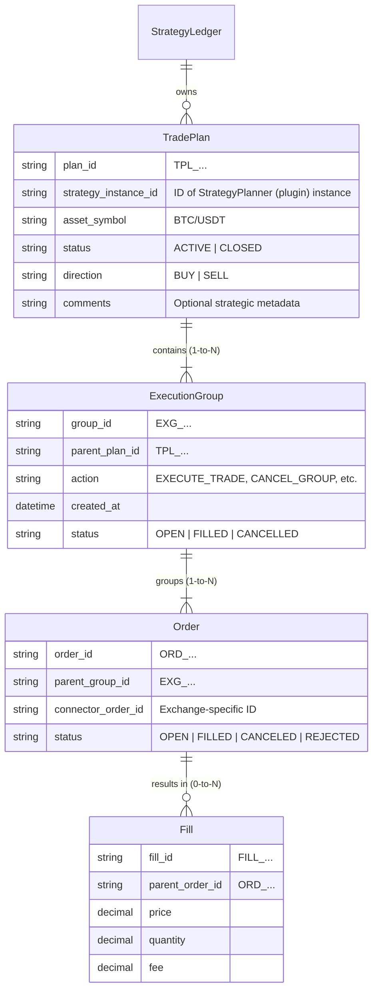

# Trade Lifecycle & Architecture - S1mpleTraderV3

**Status:** Definitive  
**Version:** 2.0  
**Last Updated:** 2025-11-27  
**Goal:** This document complements `PIPELINE_FLOW.md` and `EXECUTION_FLOW.md`. It defines the data hierarchy, lifecycle scopes, and interaction patterns between strategic plugins and platform components.

---

## 1. Data Hierarchy (Nesting)

The lifecycle of a strategy is not managed by a single "Trade DTO" traveling through the pipeline, but by a strict hierarchy of **Persisted Entities** in the `StrategyLedger`. This ensures a clear separation of concerns.

**Core Principle:** The StrategyLedger is the **single source of truth** for all trade state. All containers (TradePlan, ExecutionGroup, Order, Fill) are owned exclusively by the Ledger.

### 1.1. Container Structure



### 1.2. On-Demand Container Creation

Containers are created **lazily** by the StrategyLedger when needed:

1. **Order Registration** → ExecutionWorker requests order registration
2. **ExecutionGroup Creation** → Ledger creates ExecutionGroup if order needs a parent
3. **TradePlan Creation** → Ledger creates TradePlan if ExecutionGroup needs a parent

This bottom-up pattern ensures containers only exist when actual trading activity requires them.

```
ExecutionWorker requests: "Register this order"
    └─→ Ledger: "Order needs ExecutionGroup EXG_001"
        └─→ Ledger: "ExecutionGroup needs TradePlan TPL_001"
            └─→ Ledger creates TPL_001
        └─→ Ledger creates EXG_001 (parent: TPL_001)
    └─→ Ledger creates ORD_001 (parent: EXG_001)
```


---

## 2. Ledger Access Patterns

Workers interact with the StrategyLedger based on their responsibilities. The Ledger enforces access control; intelligence resides in workers (SRP).

### 2.1. Access by Component

| Component | Access Type | Ledger Interaction (descriptive) |
|-----------|-------------|----------------------------------|
| **StrategyPlanner** | Read | Reads active plans and their status to make strategic decisions |
| **EntryPlanner** | Read | Reads plan direction (long/short) when handling close scenarios |
| **SizePlanner** | Read | Reads current position size to calculate required delta |
| **ExitPlanner** | Read | Reads current exit levels to determine if modification is needed |
| **ExecutionPlanner** | Read | Reads plan metadata to select appropriate execution algorithm |
| **ExecutionWorker** | Read + Write | Full access: creates containers, registers orders, records fills, queries existing orders for modifications |

### 2.2. Access by Lifecycle Scope

| Scope | StrategyPlanner | Entry | Size | Exit | ExecutionPlanner | ExecutionWorker |
|-------|-----------------|-------|------|------|------------------|-----------------|
| **NEW_TRADE** | Read: check duplicates | — | — | — | — | Write: create all |
| **MODIFY_EXISTING** | Read: plan status | Read: direction | Read: current size | Read: exit levels | Read: active groups | Read + Write |
| **CLOSE_EXISTING** | Read: all active plans | Read: direction | Read: full size | Read: all orders | Read: all groups | Read + Write |

### 2.3. SRP: Planners vs Workers

**Planners decide WHAT** (trade intent):
- EntryPlanner: "Limit order @ $95k"
- SizePlanner: "Target size: 1.5 BTC"
- ExitPlanner: "SL @ $90k, TP @ $105k"
- ExecutionPlanner: "Use TWAP, 12 slices, 60 min"

**Workers execute HOW** (trade actions):
- Lookup existing orders for modifications
- Register new containers in Ledger
- Execute via Connector (place/modify/cancel)
- Update state after execution

> **Note:** Detailed Ledger API design is ongoing. See [TODO.md][todo] for StrategyLedger interface design tasks.

---

## 3. ExecutionPlanner & ExecutionDirective

The **ExecutionPlanner** is the 4th TradePlanner (Phase 4). It aggregates the three other plans and selects the execution algorithm.

### 3.1. ExecutionPlanner Role

**Input:** `EntryPlan`, `SizePlan`, `ExitPlan`, `StrategyDirective` (from StrategyCache)

**Process:**
*   Aggregates the 3 trade plans from other TradePlanners
*   Selects appropriate execution algorithm (e.g., TWAP, Iceberg, Market)
*   Configures algorithm parameters based on plans and strategy hints
*   Applies config-driven filtering (confidence ranges)

**Output:** `ExecutionDirective` with concrete algorithm configuration

> **Note:** ExecutionPlanner does NOT write to Ledger. It only reads plan metadata for algorithm selection. Container creation happens in ExecutionWorker.

### 3.2. ExecutionDirective Structure

See DTO: [execution_directive.py][dto-execution-directive]

**Key Fields:**
*   `directive_id`: Unique execution identifier
*   `causality`: Full traceability chain
*   4 Optional plans: `entry_plan`, `size_plan`, `exit_plan`, `execution_plan`
*   Validation: At least 1 plan required

### 3.3. ExecutionAction (Enum)

The `ExecutionPlan.action` field (part of the 4th plan) defines the operational command:

#### A. Creation Commands

*   **EXECUTE_TRADE**
    *   **Meaning:** "Place new orders according to the attached Entry/Size/Exit plans."
    *   **Context:** Used with `scope=NEW_TRADE` (new entry) or `scope=CLOSE_EXISTING` (new close order).
    *   **Consequence:** ExecutionWorker creates 1-to-N orders via IExecutionConnector (e.g., for a TWAP sequence).

#### B. Cancellation Commands

*   **CANCEL_GROUP**
    *   **Meaning:** "Cancel all open (unfilled) orders belonging to this TargetGroupID."
    *   **Context:** Used with `scope=MODIFY_EXISTING`. E.g., StrategyPlanner retracts a specific set of grid orders.
    *   **Consequence:** ExecutionWorker queries Ledger for open orders in group, then cancels via IExecutionConnector.
*   **CANCEL_ALL_IN_PLAN**
    *   **Meaning:** "Emergency Stop. Cancel *all* open orders within the TargetPlanID."
    *   **Context:** Used with `scope=CLOSE_EXISTING` (Panic/Crash).
    *   **Consequence:** ExecutionWorker queries Ledger for all open orders across all groups in the plan, then cancels via IExecutionConnector.

#### C. Modification Commands

*   **MODIFY_ORDERS**
    *   **Meaning:** "Adjust parameters (e.g., price, quantity) of existing, open orders in TargetGroupID."
    *   **Context:** Used with `scope=MODIFY_EXISTING` (e.g., Trailing Stop). Requires the ExitPlan (or EntryPlan) to provide the new parameters.
    *   **Consequence:** ExecutionWorker generates cancel-replace or modify calls via IExecutionConnector.

---

## 4. The Lifecycle Scopes (The "WHAT")

The `StrategyDirective.scope` is the **imperative command** (the "WHAT") from the StrategyPlanner (the "General"). [cite: Phase 3: STRATEGY PLANNING] This is *not* a hint. It dictates how the downstream TradePlanners (Specialists) must behave.

### Scope 1: NEW_TRADE (Creation)

*   **Command:** Create new exposure.
*   **Planner Reaction:**
    *   Entry/Size/Exit/Routing: All planners are "active" and in their *Core Business*. They determine **HOW** the new position is created.

### Scope 2: MODIFY_EXISTING (Mutation)

*   **Command:** Modify an existing `TradePlan` or `ExecutionGroup`.
*   **Planner Reaction:**
    *   Entry/Size: Usually passive (do nothing).
    *   Exit: Active if the SL/TP is adjusted.
    *   ExecutionPlanner: Active to determine the urgency of the *change*.
*   **Example:** A Trailing Stop StrategyPlanner sends `scope=MODIFY_EXISTING` with an `exit_hint` (new SL). Only the ExitPlanner and ExecutionPlanner respond to this.

### Scope 3: CLOSE_EXISTING (Termination)

*   **Command:** Bring exposure to zero and/or cancel open orders.
*   **Planner Reaction:** The planners operate in "Close" mode.
    *   Entry: Often forces `MARKET` type.
    *   Size: Reads full position size from Ledger for complete closure.
    *   Exit: Generates plans to cancel all open SL/TP orders.
    *   ExecutionPlanner: Sets urgency (usually high).

---

## 5. Reusability (The Base Class Pattern)

Om een explosie van specialisten te voorkomen (NewEntryPlanner, ModifyEntryPlanner, CloseEntryPlanner), biedt het platform **Abstract Base Classes** voor TradePlanners.

Plugins implementeren alleen scope-specifieke methods:

*   `on_new_trade()`: Core business logic (verplicht)
*   `on_modify_trade()`: Override voor modificatie-scenarios (optioneel, default: None)
*   `on_close_trade()`: Override voor close-scenarios (optioneel, default: MARKET order)

De base class routeert automatisch naar de juiste method op basis van `directive.scope`.

**Zie:** [BASEWORKER_DESIGN_PRELIM.md][baseworker-design] voor implementatiedetails.

---

## 6. ExecutionWorker Architecture

### 6.1. Core Responsibilities

The **ExecutionWorker** (Plugin Worker, Phase 5) executes the `ExecutionDirective`.

**Key Characteristics:**
*   **Stateless in Memory:** No instance variables for execution state
*   **Stateful via Ledger:** Retrieves/updates state containers in StrategyLedger
*   **Environment Agnostic:** Identical behavior across Backtest/Paper/Live via `IExecutionConnector`
*   **Exchange-Native Protection:** Places SL/TP directly on exchange (zero platform latency)
*   **Operational Lookups:** Queries Ledger for existing orders during modifications

### 6.2. State Container Pattern

See DTO: [execution_group.py][dto-execution-group]

The `ExecutionGroup` is a **mutable state container** holding:
*   Execution strategy: which algorithm (TWAP, SINGLE, etc.)
*   Execution progress: quantity tracking (target vs filled), associated order IDs
*   Lifecycle state: status progression (PENDING → ACTIVE → terminal state)

**Interaction:** Worker retrieves state → applies logic → persists updates → executes via Connector

### 6.3. Operational Flow

For each directive received, ExecutionWorker:

1. **Read** existing state from Ledger (if MODIFY/CLOSE scope)
2. **Decide** what orders to place/modify/cancel (algorithm logic)
3. **Execute** via IExecutionConnector (place/modify/cancel orders)
4. **Write** state updates to Ledger (register orders, record fills)

### 6.4. Environment Agnosticism

Workers interact with markets via `IExecutionConnector` (dependency injection):
*   `BacktestExecutionConnector`: Simulated fills
*   `PaperExecutionConnector`: Paper trading
*   `LiveExecutionConnector`: Real exchange API

Worker code is identical across all environments.

### 6.5. Integrated Protection

SL/TP orders are placed **directly on exchange** (not platform-side triggers):
*   ExitPlanner specifies levels → ExecutionWorker places exchange-native orders
*   Exchange handles trigger (zero latency, guaranteed execution)
*   Worker only updates parameters (trailing stop adjustments)

---

## 7. Event-Driven Wiring

ExecutionPlanner en ExecutionWorker communiceren via het standaard Event-Driven Wiring patroon:

*   **Manifest-based:** Plugins declareren inputs/outputs in manifests
*   **Build-time wiring:** StrategyBuilder genereert routing configuratie
*   **Runtime isolation:** Elke worker ontvangt alleen voor hem bestemde events

Deze architectuur zorgt voor loose coupling tussen planners en workers.

**Zie:** [EVENT_DRIVEN_WIRING.md][event-wiring] voor wiring configuratie en manifest structuur.

---

## 8. Related Documentation

*   **[PIPELINE_FLOW.md][pipeline-flow]** - Complete pipeline overview
*   **[EXECUTION_FLOW.md][execution-flow]** - Detailed Sync/Async execution flows
*   **[WORKER_TAXONOMY.md][worker-taxonomy]** - Worker categories and patterns
*   **[EVENT_DRIVEN_WIRING.md][event-wiring]** - EventAdapter configuration

<!-- Link definitions (automatically hidden in rendered output) -->

[pipeline-flow]: ./PIPELINE_FLOW.md "Complete pipeline overview"
[execution-flow]: ./EXECUTION_FLOW.md "Detailed Sync/Async execution flows"
[worker-taxonomy]: ./WORKER_TAXONOMY.md "Worker categories and patterns"
[event-wiring]: ./EVENT_DRIVEN_WIRING.md "EventAdapter configuration"
[baseworker-design]: ../development/BASEWORKER_DESIGN_PRELIM.md "Base class pattern implementation"
[todo]: ../TODO.md "Project roadmap and technical debt"
[dto-execution-directive]: ../../backend/dtos/execution/execution_directive.py "ExecutionDirective DTO"
[dto-execution-group]: ../../backend/dtos/execution/execution_group.py "ExecutionGroup DTO"

---

## Version History

| Version | Date | Changes |
|---------|------|---------|
| v1.0 | 2025-10-28 | Initial document |
| v2.0 | 2025-11-27 | Removed Ownership Matrix (redundant with diagram), added Ledger Access Patterns section, clarified on-demand container creation, fixed ExecutionPlanner role (read-only, no Ledger writes), replaced RoutingPlanner references with ExecutionPlanner |
