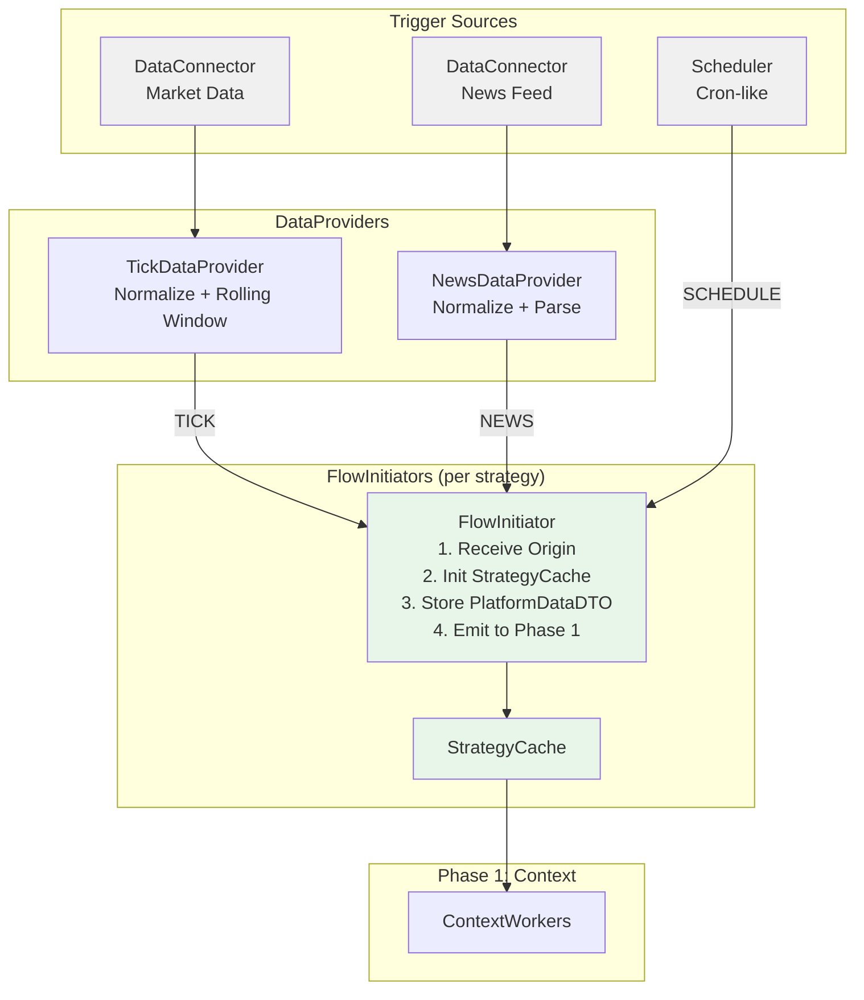
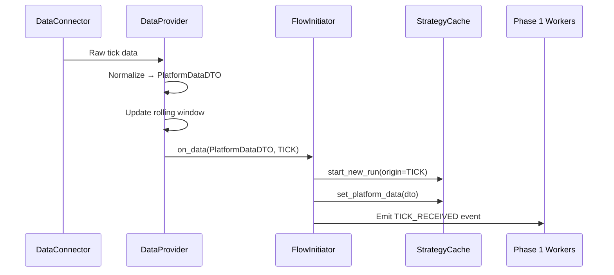

# docs/architecture/TRIGGER_ARCHITECTURE.md
# Trigger Architecture - S1mpleTraderV3

**Status:** DRAFT
**Version:** 0.1
**Last Updated:** 2025-11-28---

## 1. Document Purpose

This document describes the Trigger Layer architecture that initiates pipeline runs in S1mpleTrader.

**Scope:**
- Trigger sources: DataConnectors, Scheduler
- Data normalization: DataProviders
- Pipeline bridging: FlowInitiator
- Origin types and their usage

**Out of Scope:**
- Pipeline phases 1-6 → See [PIPELINE_FLOW.md][pipeline-flow]
- Worker implementation → See [WORKER_TAXONOMY.md][worker-taxonomy]
- Event wiring → See [EVENT_DRIVEN_WIRING.md][event-wiring]
- Strategy bootstrapping (separate from runtime triggers)

**Related Documents:**
- [FlowInitiator Design][flow-initiator-design]
- [DataProvider Design][data-provider-design]
- [EVENT_DRIVEN_WIRING.md][event-wiring]

---

## 2. Architectural Overview

### 2.1 Trigger Flow



### 2.2 Origin Types

```python
class OriginType(Enum):
    TICK = "TICK"         # Market data trigger
    NEWS = "NEWS"         # News feed trigger  
    SCHEDULE = "SCHEDULE" # Time-based trigger
```

Each pipeline run carries an `Origin` that identifies the trigger source. This enables:
- **Causality tracking:** Why did this pipeline run start?
- **Conditional processing:** Workers can behave differently based on origin
- **Audit trail:** Complete traceability from trigger to execution

---

## 3. Core Components

### 3.1 DataConnectors

**Purpose:** Interface with external data sources.

**Responsibilities:**
- Connect to market data feeds (broker APIs, websockets)
- Connect to news providers (RSS, APIs)
- Handle reconnection, heartbeats, error recovery
- Raw data forwarding to DataProviders

**Characteristics:**
- Platform-level component (not per-strategy)
- One connector per external source
- Stateless (no business logic)

### 3.2 DataProviders

**Purpose:** Normalize and enrich raw data.

**Responsibilities:**
- Convert raw data → `PlatformDataDTO`
- Maintain rolling windows (shared across strategies)
- Calculate derived data (e.g., candle aggregation)
- Publish to registered FlowInitiators

**Characteristics:**
- Platform-level component (shared)
- Instrument-aware (e.g., per symbol)
- Caches historical data for indicator warmup

**Key Types:**

| Provider | Input | Output | Rolling Window |
|----------|-------|--------|----------------|
| `TickDataProvider` | Raw tick | `PlatformDataDTO` | OHLCV candles per timeframe |
| `NewsDataProvider` | Raw news | `PlatformDataDTO` | Recent headlines |

### 3.3 Scheduler

**Purpose:** Time-based pipeline triggers.

**Use Cases:**
- Daily strategy evaluation (EOD analysis)
- Periodic rebalancing
- Scheduled maintenance checks

**Characteristics:**
- Cron-like scheduling
- Triggers FlowInitiator directly (no DataProvider)
- Origin type: `SCHEDULE`

**POC Reference:** See `proof_of_concepts/async_event_architecture_poc.py`

### 3.4 FlowInitiator

**Purpose:** Bridge between triggers and pipeline.

**Responsibilities:**
1. Receive trigger with `Origin`
2. Call `StrategyCache.start_new_run(origin)`
3. Store `PlatformDataDTO` in cache
4. Emit event to activate Phase 1 workers

**Characteristics:**
- Per-strategy instance
- Stateless (state lives in StrategyCache)
- Single responsibility: initialize and bridge

**Cross-reference:** [FlowInitiator Design][flow-initiator-design]

---

## 4. Integration Points

### 4.1 Strategy Registration

```
Strategy A  ──registers──▶  TickDataProvider (EURUSD)
Strategy A  ──registers──▶  NewsDataProvider (FX News)
Strategy A  ──registers──▶  Scheduler (EOD 17:00 ET)

Strategy B  ──registers──▶  TickDataProvider (GBPUSD)
Strategy B  ──registers──▶  TickDataProvider (EURUSD)
```

Multiple strategies can share the same DataProvider (EURUSD ticks).

### 4.2 Event Flow



---

## 5. Open Design Questions

> **Note:** These questions need resolution during implementation.

### 5.1 Scheduler → FlowInitiator Routing

**Question:** How does Scheduler know which FlowInitiators to trigger?

**Options:**
1. **Registration pattern:** FlowInitiators register for specific schedules
2. **Config-driven:** `workforce_config.yaml` defines schedule → strategy mapping
3. **Broadcast:** Scheduler broadcasts, FlowInitiator filters

**Leaning:** Option 1 (explicit registration) aligns with DataProvider pattern.

### 5.2 Multi-Trigger Coordination

**Question:** What happens if TICK and SCHEDULE trigger simultaneously?

**Options:**
1. **Queue-based:** Process sequentially (order by timestamp)
2. **Priority-based:** SCHEDULE waits for TICK completion
3. **Merge:** Combine into single run with multiple origins

**Leaning:** Option 1 (queue) for simplicity in MVP.

### 5.3 DataProvider Lifecycle

**Question:** When does DataProvider start collecting? Before any strategy subscribes?

**Options:**
1. **Eager:** Platform startup (always collecting)
2. **Lazy:** First subscription triggers collection
3. **Config-driven:** Explicit list of instruments to collect

**Leaning:** Option 3 for resource efficiency.

---

## 6. Related Documents

- **[PIPELINE_FLOW.md][pipeline-flow]** - Pipeline phases 1-6
- **[EVENT_DRIVEN_WIRING.md][event-wiring]** - Event adapter architecture
- **[FlowInitiator Design][flow-initiator-design]** - Detailed design
- **[DataProvider Design][data-provider-design]** - Detailed design

---

## 7. Version History

| Version | Date | Author | Changes |
|---------|------|--------|---------|
| 0.1 | 2025-11-28 | AI | Initial draft extracted from PIPELINE_FLOW.md Phase 0 |

<!-- Link definitions -->
[pipeline-flow]: ./PIPELINE_FLOW.md "Pipeline phases"
[worker-taxonomy]: ./WORKER_TAXONOMY.md "Worker categories"
[event-wiring]: ./EVENT_DRIVEN_WIRING.md "Event wiring"
[flow-initiator-design]: ../development/backend/core/FLOW_INITIATOR_DESIGN.md "FlowInitiator design"
[data-provider-design]: ../development/backend/core/DATA_PROVIDER_DESIGN.md "DataProvider design"
