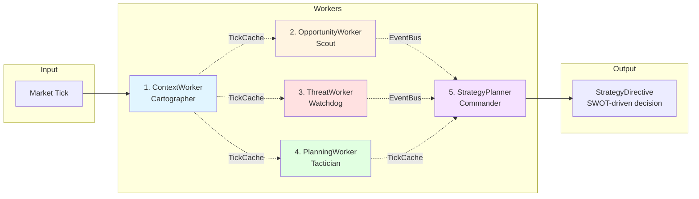

# Worker Taxonomy

**Status:** Architecture Foundation  
**Last Updated:** 2025-10-29

---

## Overview

S1mpleTraderV3 organizes all strategy logic into **5 worker categories**, each with distinct responsibilities in the trading pipeline. Workers are plugin-first components that process data through a **point-in-time model** without maintaining state across ticks.



**Key Principles:**
- **No Operators**: Workers are wired directly via EventAdapters (not grouped under operators)
- **Single Responsibility**: Each worker category has one clear purpose
- **Event-Driven**: Workers communicate via EventBus (async signals) or TickCache (sync flow)
- **Plugin-First**: All workers are loaded from plugins, configured via YAML

---

## The 5 Worker Categories

### 1. ContextWorker - "The Cartographer"

**Purpose:** Enrich market data with objective context analysis

**Responsibilities:**
- Technical indicator calculation (EMA, RSI, Bollinger Bands)
- Market regime classification (trending, ranging, volatile)
- Structural analysis (support/resistance, chart patterns)
- Statistical transformations (z-scores, percentiles)

**Output Pattern:**
- Stores plugin-specific DTOs to `TickCache` via `set_result_dto()`
- **NEVER** publishes events to EventBus
- Output consumed by downstream workers (Opportunity, Threat, Planning)

**7 Subtypes:**
1. `REGIME_CLASSIFICATION` - Market state identification
2. `STRUCTURAL_ANALYSIS` - Support/resistance, pivots
3. `INDICATOR_CALCULATION` - Technical indicators
4. `STATISTICAL_TRANSFORM` - Z-scores, percentiles, distributions
5. `PATTERN_RECOGNITION` - Chart patterns (triangles, flags, etc.)
6. `VOLATILITY_ANALYSIS` - ATR, Bollinger width, volatility regimes
7. `CORRELATION_ANALYSIS` - Inter-asset correlations

**Example Workers:**
- `EMADetector` - Exponential moving average calculation
- `RegimeClassifier` - Trend/range/volatile regime detection
- `SupportResistanceMapper` - Key level identification

---

### 2. OpportunityWorker - "The Scout"

**Purpose:** Detect subjective trading opportunities based on context

**Responsibilities:**
- Pattern-based entry signals (breakouts, reversals)
- Momentum opportunity detection
- Mean reversion setups
- Cross-asset opportunities (correlation plays)

**Output Pattern:**
- Primary: `DispositionEnvelope(PUBLISH)` with `OpportunitySignal` (system DTO)
- Secondary: Can store intermediate scores to `TickCache`

**7 Subtypes:**
1. `TECHNICAL_PATTERN` - Chart pattern breakouts
2. `MOMENTUM_SIGNAL` - Trend continuation signals
3. `MEAN_REVERSION` - Oversold/overbought reversal
4. `VOLUME_ANALYSIS` - Volume-based anomalies
5. `CROSS_ASSET` - Correlation/spread opportunities
6. `SENTIMENT_SIGNAL` - Sentiment-driven setups
7. `STATISTICAL_ARBITRAGE` - Statistical edge detection

**Example Workers:**
- `BreakoutScout` - Support/resistance breakout detection
- `MomentumDivergence` - Price/momentum divergence signals
- `MeanReversionSetup` - Bollinger squeeze reversal opportunities

---

### 3. ThreatWorker - "The Watchdog"

**Purpose:** Detect risks and threats to positions/portfolio

**Responsibilities:**
- Portfolio risk monitoring (drawdown, concentration)
- Market risk detection (black swan events, liquidity crises)
- Position-specific threats (stop loss triggers, adverse moves)
- System health monitoring (connection, data quality)

**Output Pattern:**
- `DispositionEnvelope(PUBLISH)` with `ThreatSignal` (system DTO)
- Triggers defensive strategies (emergency exits, risk reduction)

**5 Subtypes:**
1. `PORTFOLIO_RISK` - Drawdown, concentration, correlation risks
2. `MARKET_RISK` - Black swan events, volatility spikes
3. `POSITION_RISK` - Per-trade risk monitoring
4. `SYSTEM_HEALTH` - Connection, data feed, execution issues
5. `LIQUIDITY_RISK` - Slippage, market depth degradation

**Example Workers:**
- `DrawdownMonitor` - Portfolio drawdown threat detection
- `VolatilitySpike` - Abnormal volatility event detection
- `LiquidityCrisis` - Market depth degradation alerts

---

### 4. PlanningWorker - "The Strategist"

**Purpose:** Transform signals into concrete trade plans

**Responsibilities:**
- Entry planning (price levels, order types, timing)
- Exit planning (profit targets, stop losses, trailing)
- Position sizing (risk-based, kelly criterion, fixed)
- Execution intent planning (urgency, visibility, slippage tolerance)

**Output Pattern:**
- Intermediate: `set_result_dto()` with plan DTOs (`EntryPlan`, `SizePlan`, `ExitPlan`, `ExecutionIntent`)
- Final: Platform aggregator (`PlanningAggregator`) combines into `ExecutionDirective`

**4 Subtypes:**
1. `ENTRY_PLANNING` - Where/when to enter (limit, market, stop)
2. `EXIT_PLANNING` - Profit targets, stop losses, trailing
3. `SIZE_PLANNING` - Position size calculation (risk %, kelly, fixed)
4. `EXECUTION_INTENT_PLANNING` - Urgency, visibility, slippage tolerance

**Example Workers:**
- `LimitEntryPlanner` - Limit order entry at optimal price
- `TrailingStopPlanner` - Dynamic stop loss adjustment
- `KellySizer` - Kelly criterion position sizing
- `StealthExecutionPlanner` - Low-visibility TWAP execution

**Note:** Planning workers produce **sub-component DTOs** (EntryPlan, SizePlan, ExitPlan, ExecutionIntent) that do NOT extend the causality chain. The platform's `PlanningAggregator` combines these into `ExecutionDirective` which DOES extend causality.

---

### 5. StrategyPlanner - "The Decision Maker"

**Purpose:** Produce `StrategyDirective` based on triggers (SWOT, tick, threat, schedule)

**Responsibilities:**
- Entry strategy decisions (new trade opportunities)
- Position management (modify existing positions)
- Risk control (emergency exits, drawdown limiters)
- Scheduled operations (DCA, rebalancing)

**Output Pattern:**
- `DispositionEnvelope(PUBLISH)` with `StrategyDirective` (system DTO)
- **1-to-1 relationship**: Each strategy has exactly 1 StrategyPlanner

**4 Logical Categories** (documentation only, not enforced):
1. **Entry Strategies** - Scope: `NEW_TRADE`, Trigger: SWOT/Opportunity
2. **Position Management** - Scope: `MODIFY_EXISTING`, Trigger: tick/periodic
3. **Risk Control** - Scope: `CLOSE_EXISTING`, Trigger: threat/drawdown
4. **Scheduled Operations** - Scope: `NEW_TRADE`, Trigger: schedule

**Example Workers:**
- `SWOTMomentumPlanner` - SWOT-based momentum entry strategy
- `TrailingStopManager` - Trailing stop position management
- `EmergencyExitPlanner` - Threat-triggered emergency exit
- `DCAScheduler` - Scheduled dollar-cost averaging

**Causality:** StrategyPlanner extends causality chain with `strategy_directive_id`.

---

## Worker Communication Patterns

### Data Flow Paths

1. **TickCache (Synchronous, Flow Data)**
   - Via `IStrategyCache.set_result_dto(worker, dto)`
   - For direct worker-to-worker data transfer
   - Contains **plugin-specific DTOs only**
   - Lifetime: Single tick/flow
   - Used by: ContextWorker, intermediate outputs from Opportunity/Planning

2. **EventBus (Asynchronous, Signals)**
   - Via `DispositionEnvelope(PUBLISH, event_name, event_payload)`
   - For external signals, alerts, decisions
   - Contains **system DTOs only** (OpportunitySignal, ThreatSignal, StrategyDirective)
   - Used by: OpportunityWorker, ThreatWorker, StrategyPlanner

### DispositionEnvelope Contract

Workers return `DispositionEnvelope` to indicate intent:

```python
@dataclass
class DispositionEnvelope:
    disposition: Literal["CONTINUE", "PUBLISH", "STOP"]
    event_name: Optional[str] = None         # Required for PUBLISH
    event_payload: Optional[BaseModel] = None  # Required for PUBLISH (system DTO!)
```

**Adapter Behavior:**
- **CONTINUE**: Trigger next worker(s) per wiring_map, publish internal system event
- **PUBLISH**: Validate & publish custom event to EventBus (payload MUST be system DTO)
- **STOP**: Publish flow-stop event for cleanup

---

## Platform Aggregators (NOT Workers)

**Important:** The following components are **platform components**, not plugin workers:

1. **ContextAggregator**
   - Input: `list[ContextFactor]` (from ContextWorkers)
   - Output: `AggregatedContextAssessment` (system DTO)
   - Extends causality chain with `context_assessment_id`

2. **PlanningAggregator**
   - Input: 4 plan DTOs (`EntryPlan`, `SizePlan`, `ExitPlan`, `ExecutionIntent`)
   - Output: `ExecutionDirective` (system DTO)
   - Extends causality chain with `execution_directive_id`

These aggregators are part of the platform orchestration, not part of the worker taxonomy.

---

## Historical Note: Removed Categories

**ExecutionWorker** (V2) has been **removed**:
- `TRADE_INITIATION` → Now platform orchestration (ExecutionHandler + EventAdapter)
- Other subtypes → Migrated to StrategyPlanner category

---

## Related Documentation

- **[Data Flow](DATA_FLOW.md)** - Detailed communication patterns
- **[Plugin Anatomy](PLUGIN_ANATOMY.md)** - How to implement workers
- **[Event-Driven Wiring](EVENT_DRIVEN_WIRING.md)** - EventAdapter configuration
- **[Strategy Pipeline](../development/#Archief/STRATEGY_PIPELINE_ARCHITECTURE.md)** - Complete 6-phase pipeline

---

**Last Updated:** 2025-10-29
