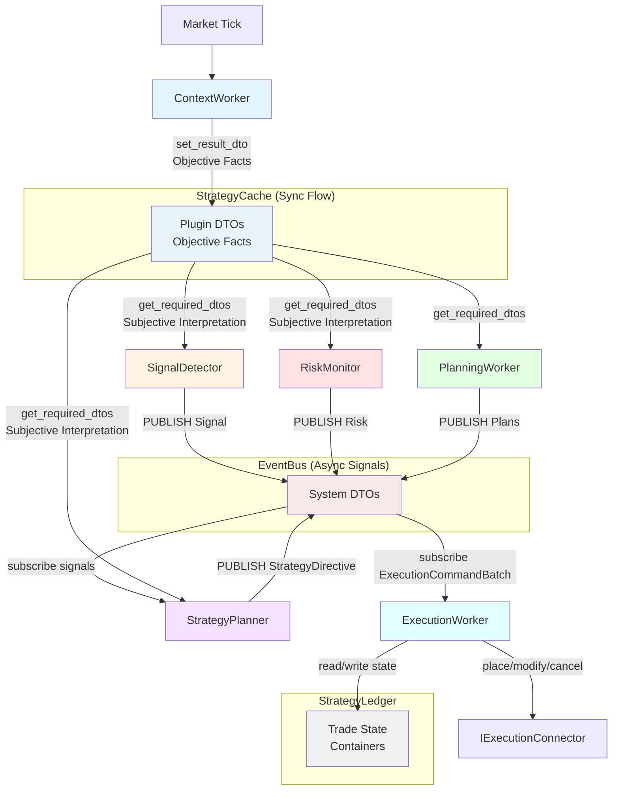

# Worker Taxonomy

**Status:** Architecture Foundation  
**Version:** 2.0  
**Last Updated:** 2025-11-27

---

## Overview

S1mpleTraderV3 organizes all strategy logic into **6 worker categories**, each with distinct responsibilities in the trading pipeline. Workers are plugin-first components that process data through a **point-in-time model** without maintaining state across ticks.



**Key Flow Principles:**
- **ContextWorker**: Writes **objective facts** to StrategyCache only (NEVER EventBus)
- **SignalDetector**: Reads StrategyCache → Applies **subjective interpretation** → Publishes Signal to EventBus
- **RiskMonitor**: Reads StrategyCache → Applies **subjective interpretation** → Publishes Risk to EventBus
- **PlanningWorker**: Reads StrategyCache + Ledger → Publishes Plans (EntryPlan, SizePlan, ExitPlan, ExecutionPlan) to EventBus
- **StrategyPlanner**: Subscribes to EventBus signals + Reads StrategyCache → Applies **subjective interpretation** → Publishes StrategyDirective
- **ExecutionWorker**: Subscribes to ExecutionCommandBatch → Reads/writes StrategyLedger → Executes via IExecutionConnector

**Key Principles:**
- **No Operators**: Workers are wired directly via EventAdapters (not grouped under operators)
- **Single Responsibility**: Each worker category has one clear purpose
- **Event-Driven**: Workers communicate via EventBus (async signals) or StrategyCache (sync flow)
- **Plugin-First**: All workers are loaded from plugins, configured via YAML
- **Objective Context**: ContextWorkers produce facts, consumers apply interpretation

---

## Worker Categories: Type vs Subtype

### Type (Architectural Role) - ENFORCED

The **`type`** field in `manifest.yaml` defines the worker's **architectural role** and determines:
- ✅ **Output contracts** - What the worker may produce
- ✅ **Communication paths** - StrategyCache vs EventBus
- ✅ **Interface requirements** - Which methods must be implemented
- ✅ **Platform validation** - Bootstrap checks enforce type contracts

**6 Valid Types:**
- `context_worker` - Stores DTOs to StrategyCache via `set_result_dto()` (NEVER EventBus)
- `signal_detector` - May publish `Signal` to EventBus
- `risk_monitor` - May publish `Risk` to EventBus  
- `planning_worker` - Produces plan DTOs (EntryPlan, SizePlan, ExitPlan, ExecutionPlan)
- `strategy_planner` - Publishes `StrategyDirective` to EventBus
- `execution_worker` - Executes trades via Ledger + Connector (read/write access)

### Subtype (Descriptive Label) - NOT ENFORCED

The **`subtype`** field is a **descriptive tag** used for:
- ✅ **Documentation** - Helps developers understand plugin purpose
- ✅ **UI Filtering** - Strategy Builder can group by subtype
- ✅ **Discovery** - Easier to find relevant plugins
- ❌ **NOT validated** - No architectural impact
- ❌ **NOT enforced** - Platform ignores subtypes during execution

**Example:**
```yaml
identification:
  type: "context_worker"      # ENFORCED - Defines output contracts
  subtype: "indicator_calculation"  # DESCRIPTIVE - Just a label
```

A `context_worker` with `subtype: "indicator_calculation"` is **architecturally identical** to a `context_worker` with `subtype: "structural_analysis"`. Both store DTOs to StrategyCache, neither can publish to EventBus.

**27+ Subtypes Available:** See individual worker category sections below for suggested subtypes per type.

---

## The 6 Worker Categories

### 1. ContextWorker - "The Cartographer"

**Purpose:** Produce objective, factual market data without interpretation

**Responsibilities:**
- Technical indicator calculation (EMA, RSI, Bollinger Bands)
- Market regime classification (trending, ranging, volatile)
- Structural analysis (support/resistance, chart patterns)
- Statistical transformations (z-scores, percentiles)

**Critical Philosophy - Objective Facts Only:**
- ✅ ContextWorkers produce **objective DTOs** (e.g., `EMAOutputDTO(ema_20=50100.50)`)
- ✅ **NO subjective interpretation** (no "bullish", "strong", "weakness" labels)
- ✅ **NO aggregation** - Each worker produces its own discrete DTO
- ✅ Consumers (SignalDetectors, StrategyPlanners) apply their own interpretation

**Output Pattern:**
- Stores plugin-specific DTOs to `StrategyCache` via `set_result_dto()`
- **NEVER** publishes events to EventBus
- Output consumed by downstream workers (SignalDetector, RiskMonitor, Planning)

**7 Subtypes (Descriptive Tags):**
1. `REGIME_CLASSIFICATION` - Market state identification
2. `STRUCTURAL_ANALYSIS` - Support/resistance, pivots
3. `INDICATOR_CALCULATION` - Technical indicators
4. `STATISTICAL_TRANSFORM` - Z-scores, percentiles, distributions
5. `PATTERN_RECOGNITION` - Chart patterns (triangles, flags, etc.)
6. `VOLATILITY_ANALYSIS` - ATR, Bollinger width, volatility regimes
7. `CORRELATION_ANALYSIS` - Inter-asset correlations

**Example Workers:**
- `EMADetector` - Exponential moving average calculation
- `RegimeClassifier` - Trend/range/volatile regime detection
- `SupportResistanceMapper` - Key level identification

---

### 2. SignalDetector - "The Scout"

**Purpose:** Detect subjective trading signals based on context

**Responsibilities:**
- Pattern-based entry signals (breakouts, reversals)
- Momentum signal detection
- Mean reversion setups
- Cross-asset signals (correlation plays)

**Output Pattern:**
- Primary: `DispositionEnvelope(PUBLISH)` with `Signal` (system DTO)
- Secondary: Can store intermediate scores to `StrategyCache`

**7 Subtypes:**
1. `TECHNICAL_PATTERN` - Chart pattern breakouts
2. `MOMENTUM_SIGNAL` - Trend continuation signals
3. `MEAN_REVERSION` - Oversold/overbought reversal
4. `VOLUME_ANALYSIS` - Volume-based anomalies
5. `CROSS_ASSET` - Correlation/spread opportunities
6. `SENTIMENT_SIGNAL` - Sentiment-driven setups
7. `STATISTICAL_ARBITRAGE` - Statistical edge detection

**Example Workers:**
- `BreakoutScout` - Support/resistance breakout detection
- `MomentumDivergence` - Price/momentum divergence signals
- `MeanReversionSetup` - Bollinger squeeze reversal opportunities

---

### 3. RiskMonitor - "The Watchdog"

**Purpose:** Detect risks and risks to positions/portfolio

**Responsibilities:**
- Portfolio risk monitoring (drawdown, concentration)
- Market risk detection (black swan events, liquidity crises)
- Position-specific risks (stop loss triggers, adverse moves)
- System health monitoring (connection, data quality)

**Output Pattern:**
- `DispositionEnvelope(PUBLISH)` with `Risk` (system DTO)
- Triggers defensive strategies (emergency exits, risk reduction)

**5 Subtypes:**
1. `PORTFOLIO_RISK` - Drawdown, concentration, correlation risks
2. `MARKET_RISK` - Black swan events, volatility spikes
3. `POSITION_RISK` - Per-trade risk monitoring
4. `SYSTEM_HEALTH` - Connection, data feed, execution issues
5. `LIQUIDITY_RISK` - Slippage, market depth degradation

**Example Workers:**
- `DrawdownMonitor` - Portfolio drawdown risk detection
- `VolatilitySpike` - Abnormal volatility event detection
- `LiquidityCrisis` - Market depth degradation alerts

---

### 4. PlanningWorker - "The Strategist"

**Purpose:** Transform signals into concrete trade plans

**Responsibilities:**
- Entry planning (price levels, order types, timing)
- Exit planning (profit targets, stop losses, trailing)
- Position sizing (risk-based, kelly criterion, fixed)
- Execution planning (algorithm selection, urgency, slippage tolerance)

**Ledger Access:** Read-only (for MODIFY/CLOSE scopes)
- SizePlanner reads current position size
- ExitPlanner reads current exit levels
- ExecutionPlanner reads plan metadata for algorithm selection

**Output Pattern:**
- TradePlanners (Entry, Size, Exit): `set_result_dto()` with plan DTOs
- ExecutionPlanner: Aggregates 3 plans → `ExecutionCommandBatch` (via PlanningAggregator) to EventBus

**4 Subtypes (The 4 TradePlanners):**
1. `ENTRY_PLANNING` - Where/when to enter (limit, market, stop)
2. `SIZE_PLANNING` - Position size calculation (risk %, kelly, fixed)
3. `EXIT_PLANNING` - Profit targets, stop losses, trailing
4. `EXECUTION_PLANNING` - Algorithm selection, urgency, slippage tolerance

**Example Workers:**
- `LimitEntryPlanner` - Limit order entry at optimal price
- `KellySizer` - Kelly criterion position sizing
- `TrailingStopPlanner` - Dynamic stop loss adjustment
- `TWAPExecutionPlanner` - TWAP algorithm selection with parameters

**Note:** The ExecutionPlanner is the 4th TradePlanner. It aggregates the other 3 plans and selects the execution algorithm. It does NOT write to Ledger - container creation happens in ExecutionWorker.

---

### 5. StrategyPlanner - "The Decision Maker"

**Purpose:** Produce `StrategyDirective` based on triggers (signals, tick, risk, schedule)

**Responsibilities:**
- Entry strategy decisions (new trade opportunities)
- Position management (modify existing positions)
- Risk control (emergency exits, drawdown limiters)
- Scheduled operations (DCA, rebalancing)

**Output Pattern:**
- `DispositionEnvelope(PUBLISH)` with `StrategyDirective` (system DTO)
- **1-to-1 relationship**: Each strategy has exactly 1 StrategyPlanner

**4 Logical Categories** (documentation only, not enforced):
1. **Entry Strategies** - Scope: `NEW_TRADE`, Trigger: Signal detection
2. **Position Management** - Scope: `MODIFY_EXISTING`, Trigger: tick/periodic
3. **Risk Control** - Scope: `CLOSE_EXISTING`, Trigger: risk/drawdown
4. **Scheduled Operations** - Scope: `NEW_TRADE`, Trigger: schedule

**Example Workers:**
- `MomentumEntryPlanner` - Signal-based momentum entry strategy
- `TrailingStopManager` - Trailing stop position management
- `EmergencyExitPlanner` - Risk-triggered emergency exit
- `DCAScheduler` - Scheduled dollar-cost averaging

**Causality:** StrategyPlanner extends causality chain with `strategy_directive_id`.

---

### 6. ExecutionWorker - "The Executor"

**Purpose:** Execute trade actions via StrategyLedger and IExecutionConnector

**Responsibilities:**
- Order placement (new orders via Connector)
- Order modification (trailing stops, price adjustments)
- Order cancellation (group cancel, emergency flatten)
- State management (register orders, record fills in Ledger)
- Operational lookups (find existing orders for modifications)

**Ledger Access:** Full read/write
- Creates ExecutionGroup and Order containers
- Updates container state as execution progresses
- Queries existing orders for MODIFY/CLOSE operations
- Records fills from Connector callbacks

**Input Pattern:**
- Receives `ExecutionDirective` via EventBus wiring
- Directive specifies: action (EXECUTE/MODIFY/CANCEL), plans, target IDs

**Output Pattern:**
- No EventBus output (terminal worker)
- State changes persisted to StrategyLedger
- Orders executed via IExecutionConnector

**Key Characteristics:**
- **Stateless in Memory:** No instance variables for execution state
- **Stateful via Ledger:** All state in StrategyLedger containers
- **Environment Agnostic:** Same code for Backtest/Paper/Live (via IExecutionConnector)
- **Exchange-Native Protection:** SL/TP placed directly on exchange

**4 Subtypes:**
1. `MARKET_EXECUTION` - Simple market order execution
2. `ALGORITHMIC_EXECUTION` - TWAP, VWAP, Iceberg algorithms
3. `BRACKET_EXECUTION` - Entry + SL + TP as atomic unit
4. `SMART_ROUTING` - Multi-venue order routing

**Example Workers:**
- `MarketExecutor` - Simple market order placement
- `TWAPWorker` - Time-weighted average price execution
- `IcebergWorker` - Hidden size iceberg orders
- `BracketWorker` - Entry with exchange-native SL/TP

**SRP:** ExecutionWorker executes HOW (operational details), while Planners decide WHAT (trade intent). See [TRADE_LIFECYCLE.md](TRADE_LIFECYCLE.md) for detailed responsibility split.

---

## Worker Communication Patterns

### Data Flow Paths

1. **StrategyCache (Synchronous, Flow Data)**
   - Via `IStrategyCache.set_result_dto(worker, dto)`
   - For direct worker-to-worker data transfer
   - Contains **plugin-specific DTOs only**
   - Lifetime: Single tick/flow
   - Used by: ContextWorker, intermediate outputs from PlanningWorker

2. **EventBus (Asynchronous, Signals)**
   - Via `DispositionEnvelope(PUBLISH, event_name, event_payload)`
   - For external signals, alerts, decisions
   - Contains **system DTOs only** (Signal, Risk, StrategyDirective)
   - Used by: SignalDetector, RiskMonitor, StrategyPlanner

### DispositionEnvelope Contract

Workers return `DispositionEnvelope` to indicate intent:

```python
@dataclass
class DispositionEnvelope:
    disposition: Literal["CONTINUE", "PUBLISH", "STOP"]
    event_name: Optional[str] = None         # Required for PUBLISH
    event_payload: Optional[BaseModel] = None  # Required for PUBLISH (system DTO!)
```

**Adapter Behavior:**
- **CONTINUE**: Trigger next worker(s) per wiring_map, publish internal system event
- **PUBLISH**: Validate & publish custom event to EventBus (payload MUST be system DTO)
- **STOP**: Publish flow-stop event for cleanup

---

## Platform Components (NOT Workers)

The following are **platform components**, not plugin workers. They are part of core orchestration:

1. **FlowInitiator** - Bootstraps strategy flows, manages worker lifecycle
2. **EventAdapter** - Routes events between workers based on wiring_map
3. **StrategyLedger** - Owns all trade state containers (TradePlan, ExecutionGroup, Order, Fill)

---

## Related Documentation

- **[Trade Lifecycle](TRADE_LIFECYCLE.md)** - Container ownership, Ledger access patterns
- **[Data Flow](DATA_FLOW.md)** - Detailed communication patterns
- **[Plugin Anatomy](PLUGIN_ANATOMY.md)** - How to implement workers
- **[Event-Driven Wiring](EVENT_DRIVEN_WIRING.md)** - EventAdapter configuration

---

## Version History

| Version | Date | Changes |
|---------|------|---------|
| v1.0 | 2025-10-29 | Initial document with 5 worker categories |
| v2.0 | 2025-11-27 | Added ExecutionWorker as 6th category, updated PlanningWorker (ExecutionPlanner is 4th TradePlanner), removed PlanningAggregator (aggregation now in ExecutionPlanner), added Ledger access descriptions |
