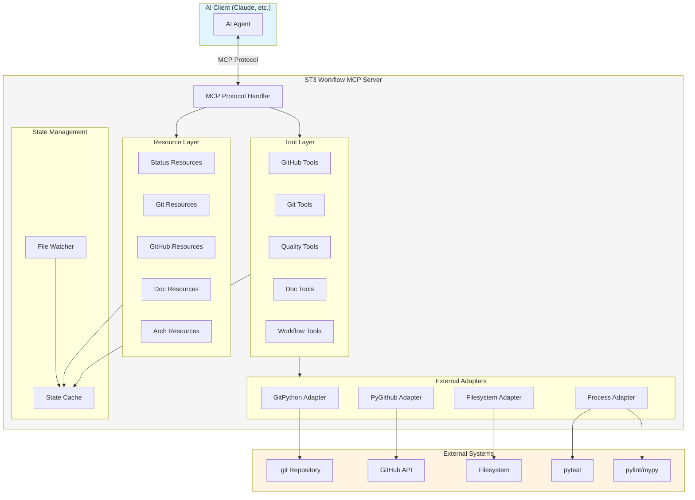
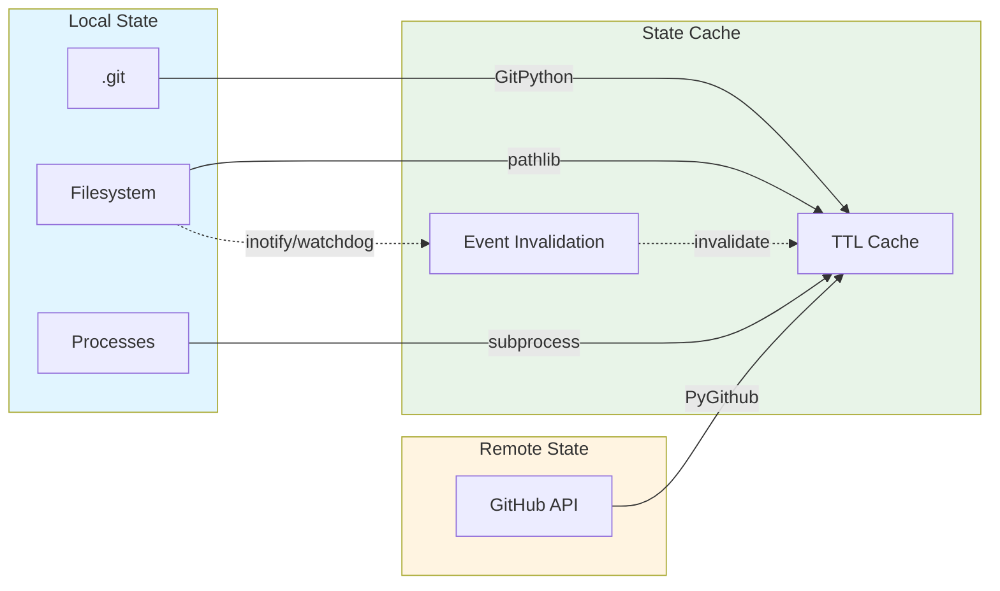

# docs/dev_tooling/ARCHITECTURE.md
# ST3 Workflow MCP Server - Architecture

**Status:** PRELIMINARY  
**Version:** 1.0  
**Created:** 2025-12-08  
**Last Updated:** 2025-12-08  

---

## 1. Overview

### 1.1 Purpose

The ST3 Workflow MCP Server is a **Model Context Protocol server** that automates the S1mpleTrader V3 development workflow. It provides AI assistants with structured access to:

- **GitHub-native project management** (issues, projects, milestones)
- **Git workflow automation** (branching, conventional commits, TDD phases)
- **Quality gate enforcement** (pre-commit checks, linting, testing)
- **Documentation validation** (template compliance, link checking)
- **Architecture compliance** (anti-pattern detection, DTO validation)

### 1.2 Design Philosophy

The MCP server follows the same core principles as ST3 itself:

| Principle | Application in MCP Server |
|-----------|---------------------------|
| **Contract-Driven** | All data exchange via typed Pydantic models |
| **Config-Driven** | Server behavior configurable via YAML |
| **Separation of Concerns** | Resources (read) vs Tools (write) strictly separated |
| **Fail-Fast** | Validation before action, actionable error messages |

### 1.3 Key Capabilities

```
┌─────────────────────────────────────────────────────────────────────────────┐
│                        ST3 Workflow MCP Server                              │
├─────────────────────────────────────────────────────────────────────────────┤
│  RESOURCES (Read-Only)           │  TOOLS (Actions)                        │
│  ─────────────────────────────   │  ────────────────────────────────────   │
│  • Implementation dashboard      │  • GitHub issue management              │
│  • Test metrics & coverage       │  • Git branch & commit operations       │
│  • Quality gate status           │  • Quality gate execution               │
│  • Git state & TDD phase         │  • Documentation generation             │
│  • GitHub issues & projects      │  • Architecture validation              │
│  • Documentation inventory       │  • Workflow orchestration               │
│  • Architecture violations       │  • Status dashboard sync                │
└─────────────────────────────────────────────────────────────────────────────┘
```

---

## 2. Tech Stack

### 2.1 Decision: Python MCP SDK

| Aspect | Choice | Rationale |
|--------|--------|-----------|
| **Language** | Python 3.11+ | 100% consistency with ST3 project |
| **MCP SDK** | `mcp` (pip install mcp) | Official Anthropic Python SDK |
| **Async** | asyncio | Native Python async, ST3 compatible |
| **Git** | GitPython | Mature, Pythonic git interface |
| **GitHub** | PyGithub | Official GitHub API client |
| **Config** | YAML (PyYAML) | Consistent with ST3 configuration |
| **Validation** | Pydantic v2 | Consistent with ST3 DTOs |
| **Testing** | pytest | Unified with ST3 test suite |
| **Type Checking** | pyright | Existing ST3 configuration |

### 2.2 Why Not TypeScript?

While TypeScript has a more mature MCP SDK ecosystem, Python was chosen because:

1. **Project Consistency**: ST3 is 100% Python with strict quality standards
2. **Solo Developer**: No context switching between languages
3. **Unified Toolchain**: Same pyproject.toml, pytest, pyright configuration
4. **Code Sharing**: MCP server can import ST3 types (DTOs, enums, utilities)
5. **Deployment**: Same Python venv, no Node.js runtime required

---

## 3. Component Architecture

### 3.1 High-Level Component Diagram



### 3.2 Component Responsibilities

| Component | Responsibility |
|-----------|----------------|
| **MCP Protocol Handler** | JSON-RPC message handling, request routing |
| **Resource Layer** | Read-only data provision via `st3://` URIs |
| **Tool Layer** | State-modifying actions with validation |
| **State Cache** | TTL-based caching, invalidation on events |
| **File Watcher** | Filesystem event detection for cache invalidation |
| **Adapters** | External system integration (git, GitHub, filesystem, processes) |

### 3.3 Directory Structure

```
mcp_server/                      # Could be separate repo or st3 subpackage
├── __init__.py
├── server.py                    # MCP server entry point
├── config.py                    # Server configuration (Pydantic)
├── protocol/
│   ├── __init__.py
│   ├── handler.py               # MCP protocol handling
│   └── types.py                 # MCP message types
├── resources/
│   ├── __init__.py
│   ├── base.py                  # Resource base class
│   ├── status.py                # st3://status/* resources
│   ├── git.py                   # st3://git/* resources
│   ├── github.py                # st3://github/* resources
│   ├── docs.py                  # st3://docs/* resources
│   └── architecture.py          # st3://arch/* resources
├── tools/
│   ├── __init__.py
│   ├── base.py                  # Tool base class
│   ├── github_tools.py          # Issue, PR, project tools
│   ├── git_tools.py             # Branch, commit, merge tools
│   ├── quality_tools.py         # Quality gate, test tools
│   ├── doc_tools.py             # Documentation tools
│   └── workflow_tools.py        # Orchestration tools
├── adapters/
│   ├── __init__.py
│   ├── git_adapter.py           # GitPython wrapper
│   ├── github_adapter.py        # PyGithub wrapper
│   ├── filesystem_adapter.py    # File operations
│   └── process_adapter.py       # Subprocess execution
├── state/
│   ├── __init__.py
│   ├── cache.py                 # TTL-based state cache
│   └── watcher.py               # File system watcher
├── validators/
│   ├── __init__.py
│   ├── commit_validator.py      # Conventional commit validation
│   ├── branch_validator.py      # Branch naming validation
│   ├── doc_validator.py         # Document template validation
│   └── arch_validator.py        # Architecture pattern validation
└── tests/
    ├── __init__.py
    ├── conftest.py              # Shared fixtures
    ├── test_resources/
    ├── test_tools/
    ├── test_adapters/
    └── test_validators/
```

---

## 4. Resources

Resources provide **read-only access** to project state via URI-based addressing.

### 4.1 URI Scheme

All resources use the `st3://` URI scheme:

```
st3://{category}/{resource_name}[/{sub_resource}]
```

### 4.2 Resource Categories

| Category | URI Prefix | Description |
|----------|------------|-------------|
| **Status** | `st3://status/` | Implementation metrics, test counts, quality scores |
| **Git** | `st3://git/` | Local git state, branches, commits, TDD phase |
| **GitHub** | `st3://github/` | Issues, PRs, projects, milestones |
| **Docs** | `st3://docs/` | Documentation inventory, compliance, links |
| **Architecture** | `st3://arch/` | Violations, DTO registry, patterns |

### 4.3 Resource List

| Resource URI | Description | Refresh |
|--------------|-------------|---------|
| `st3://status/implementation` | Test counts, quality gates per module | 30s |
| `st3://status/tests` | Real-time test metrics | on-save |
| `st3://status/quality-gates` | Quality scores for modified files | on-save |
| `st3://git/status` | Branch, uncommitted changes, staged files | 5s |
| `st3://git/log` | Recent commits with conventional parsing | 10s |
| `st3://git/tdd-phase` | Current TDD phase (RED/GREEN/REFACTOR) | on-commit |
| `st3://git/branch` | Branch name, type, linked issue | 5s |
| `st3://github/issues` | Open issues with labels, milestones | 60s |
| `st3://github/pull-requests` | Open PRs with review status | 60s |
| `st3://github/project` | Project board state | 60s |
| `st3://github/milestones` | Milestone progress | 300s |
| `st3://docs/inventory` | All docs with line counts, compliance | 300s |
| `st3://docs/compliance` | Per-doc template validation results | on-save |
| `st3://arch/violations` | Detected anti-pattern violations | on-save |
| `st3://arch/dtos` | DTO registry with validation info | 60s |

---

## 5. Tools

Tools perform **state-modifying actions** with validation and error handling.

### 5.1 Tool Categories

| Category | Purpose | Examples |
|----------|---------|----------|
| **GitHub** | Issue & project management | create_issue, update_issue, move_card |
| **Git** | Branch & commit operations | create_branch, commit, merge |
| **Quality** | Quality gate execution | run_gates, fix_whitespace, run_tests |
| **Docs** | Documentation management | validate_template, check_links, generate |
| **Architecture** | Compliance checking | check_patterns, validate_dto |
| **Workflow** | Multi-step orchestration | start_feature, complete_phase, prepare_merge |

### 5.2 Tool List Summary

| Tool | Category | Side Effects |
|------|----------|--------------|
| `create_issue` | GitHub | Creates GitHub issue |
| `update_issue` | GitHub | Modifies GitHub issue |
| `add_issue_comment` | GitHub | Creates GitHub comment |
| `link_issues` | GitHub | Modifies issue relationships |
| `move_project_card` | GitHub | Modifies project board |
| `create_feature_branch` | Git | Creates & switches branch |
| `commit_with_convention` | Git | Creates validated commit |
| `stage_files` | Git | Modifies staging area |
| `merge_to_main` | Git | Merges branch, optionally deletes |
| `run_quality_gates` | Quality | None (read-only check) |
| `fix_whitespace` | Quality | Modifies files |
| `run_tests` | Quality | None (read-only check) |
| `validate_doc_template` | Docs | None (validation) |
| `check_doc_links` | Docs | None (validation) |
| `generate_doc_from_template` | Docs | Creates file |
| `check_arch_compliance` | Arch | None (validation) |
| `validate_dto` | Arch | None (validation) |
| `validate_plugin_manifest` | Arch | None (validation) |
| `start_feature` | Workflow | Creates issue + branch |
| `complete_tdd_phase` | Workflow | Commits + updates issue |
| `prepare_merge` | Workflow | Quality check + merge/PR |
| `sync_status_dashboard` | Workflow | Updates STATUS.md |

---

## 6. State Management

### 6.1 State Sources



### 6.2 Cache Strategy

| State Source | TTL | Invalidation |
|--------------|-----|--------------|
| Git status | 5s | File watcher |
| Git log | 10s | On commit |
| GitHub issues | 60s | Conditional request (ETag) |
| GitHub project | 60s | Conditional request |
| Filesystem (docs) | 300s | File watcher |
| Test results | On-demand | Test file change |
| Quality gates | On-demand | Source file change |

### 6.3 GitHub Rate Limiting

```yaml
rate_limiting:
  authenticated_limit: 5000  # requests per hour
  tracking: true             # Monitor X-RateLimit-Remaining
  strategy:
    - Use conditional requests (If-None-Match) for cached data
    - Batch requests where possible
    - Exponential backoff on 403
    - Graceful degradation: return cached data if rate limited
```

---

## 7. Error Handling Strategy

### 7.1 Error Categories

| Category | HTTP-like Code | Recovery |
|----------|----------------|----------|
| **Validation Error** | 400 | Return specific field errors |
| **Not Found** | 404 | Return helpful suggestions |
| **Conflict** | 409 | Return current state, suggest resolution |
| **Rate Limited** | 429 | Return cached data, retry-after |
| **External Failure** | 502 | Graceful degradation, offline mode |
| **Internal Error** | 500 | Log, return safe error message |

### 7.2 Actionable Error Messages

All errors follow the pattern:
```
WHAT went wrong + WHY it happened + HOW to fix it
```

**Example:**
```json
{
  "error": "BranchNameInvalid",
  "message": "Branch name 'my feature' is invalid",
  "reason": "Branch names cannot contain spaces",
  "resolution": "Use 'feature/my-feature' format instead",
  "valid_patterns": ["feature/*", "fix/*", "refactor/*", "docs/*"]
}
```

### 7.3 Graceful Degradation

| Failure | Degradation |
|---------|-------------|
| GitHub API down | Use cached data, disable GitHub tools, enable offline git tools |
| Git repo corrupt | Return error, suggest `git status` manually |
| pytest not found | Skip test resources, return setup instructions |
| File permission error | Return specific path, suggest permission fix |

---

## 8. Security Considerations

### 8.1 Authentication

| System | Method | Storage |
|--------|--------|---------|
| **GitHub** | Personal Access Token (PAT) | Environment variable `GITHUB_TOKEN` |
| **Git** | SSH keys or credential helper | System git config |
| **Filesystem** | Process user permissions | N/A |

### 8.2 Token Scopes (Minimum Required)

```yaml
github_token_scopes:
  - repo              # Full repository access
  - project           # Project board access
  - read:org          # Read organization (for projects)
```

### 8.3 File System Access Scope

```yaml
filesystem_access:
  read:
    - "{workspace}/**/*.py"
    - "{workspace}/**/*.md"
    - "{workspace}/**/*.yaml"
    - "{workspace}/**/*.json"
    - "{workspace}/**/*.toml"
    - "{workspace}/.git/**"
  write:
    - "{workspace}/**/*.py"        # For whitespace fix
    - "{workspace}/**/*.md"        # For doc generation
    - "{workspace}/.git/**"        # For git operations
  excluded:
    - "{workspace}/.venv/**"
    - "{workspace}/node_modules/**"
    - "{workspace}/__pycache__/**"
```

### 8.4 Audit Logging

All state-modifying operations are logged:

```python
@dataclass
class AuditEntry:
    timestamp: datetime
    tool_name: str
    parameters: dict
    user_context: str  # AI agent identifier
    result: Literal["success", "failure"]
    details: str
```

---

## 9. Extension Points

### 9.1 Adding New Resources

```python
# resources/my_resource.py
from mcp_server.resources.base import Resource

class MyResource(Resource):
    uri = "st3://category/my-resource"
    description = "Description for AI agent"
    refresh_trigger = "polling"  # or "event"
    cache_ttl = 60  # seconds
    
    async def fetch(self) -> dict:
        """Fetch resource data."""
        return {"key": "value"}
```

Register in `resources/__init__.py`:
```python
RESOURCES = [
    ...,
    MyResource,
]
```

### 9.2 Adding New Tools

```python
# tools/my_tool.py
from mcp_server.tools.base import Tool, ToolParameter

class MyTool(Tool):
    name = "my_tool"
    description = "Description for AI agent"
    category = "workflow"
    
    parameters = [
        ToolParameter(name="param1", type="string", required=True),
        ToolParameter(name="param2", type="boolean", default=False),
    ]
    
    side_effects = ["modifies X", "creates Y"]
    idempotent = False
    supports_dry_run = True
    
    async def execute(self, params: dict, dry_run: bool = False) -> dict:
        """Execute the tool action."""
        if dry_run:
            return {"would_do": "description"}
        # Actual implementation
        return {"result": "success"}
```

### 9.3 Adding New Validators

```python
# validators/my_validator.py
from mcp_server.validators.base import Validator, ValidationResult

class MyValidator(Validator):
    name = "my_pattern"
    description = "What this validates"
    
    def validate(self, file_path: str, content: str) -> ValidationResult:
        errors = []
        warnings = []
        
        # Validation logic
        if some_violation:
            errors.append(ValidationError(
                line=42,
                message="What's wrong",
                fix="How to fix it"
            ))
        
        return ValidationResult(
            valid=len(errors) == 0,
            errors=errors,
            warnings=warnings
        )
```

---

## 10. Related Documentation

| Document | Purpose |
|----------|---------|
| [TOOLS_AND_RESOURCES.md](TOOLS_AND_RESOURCES.md) | Detailed specifications for all resources and tools |
| [GITHUB_SETUP.md](GITHUB_SETUP.md) | GitHub configuration (templates, labels, branch protection) |
| [PHASE_WORKFLOWS.md](PHASE_WORKFLOWS.md) | TDD phase workflows and automation |
| [IMPLEMENTATION_PLAN.md](IMPLEMENTATION_PLAN.md) | Build order and milestones |

---

## Version History

| Version | Date | Changes |
|---------|------|---------|
| 1.0 | 2025-12-08 | Initial architecture design |
