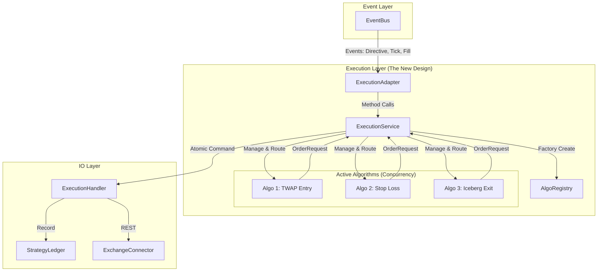
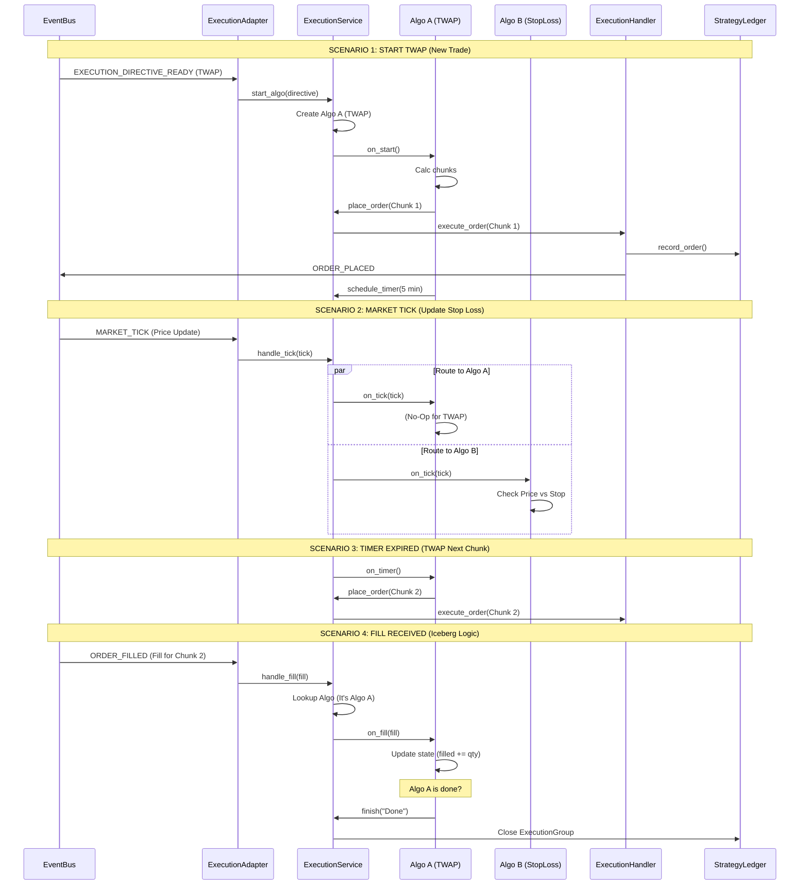

# Execution Service Flow Visualization

Dit diagram visualiseert hoe de `ExecutionService` fungeert als de centrale "Fleet Manager" voor parallelle algoritmen, geïntegreerd in de Event-Driven architectuur.

## 1. The Big Picture (Component Relaties)

## 2. Detailed Sequence Flow

Hier zien we de levenscyclus van een **TWAP Algo** (Algo A) en een **Stop Loss** (Algo B) die tegelijk draaien.

## 3. Toelichting

1.  **De Adapter (EA):** Is de enige die de EventBus kent. Hij vertaalt events naar method calls op de Service.
2.  **De Service (ES):**
    *   Is de "Router". Bij een Tick roept hij *alle* relevante algo's aan. Bij een Fill roept hij *alleen* de eigenaar aan.
    *   Is de "Gateway". Alle orders van alle algo's gaan via de Service naar de Handler.
3.  **De Algo's (AA, AB):**
    *   Leven in hun eigen bubbel.
    *   Weten niet dat ze naast elkaar draaien.
    *   Reageren puur op hooks (`on_tick`, `on_timer`).

Dit diagram laat zien dat multipliciteit (Concurrency) volledig wordt gemanaged door de `ExecutionService`, zonder dat de rest van het systeem complexer wordt.
