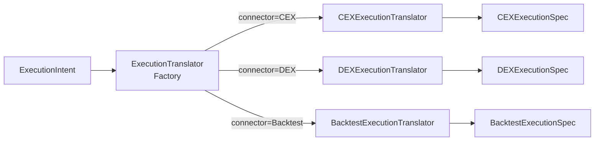

# Migration Guide - v3.0 → v4.0 ExecutionIntent Architecture

**Versie:** 1.0  
**Datum:** 2025-10-28  
**Breaking Changes:** 6 major changes  
**Impact:** HIGH - Core execution layer volledig gerefactored

---

## Executive Summary

**v4.0 introduceert ExecutionIntent Architecture** - een connector-agnostic execution layer die de fundamentele flaw in v3.0 RoutingPlan oplost: connector-specificity leakage naar strategy layer.

**Core Problem Solved:**
```python
# ❌ v3.0 - Connector-specifiek lekt naar strategy
RoutingPlan(
    timing="TWAP",
    time_in_force="GTC",     # CEX-only concept!
    iceberg_preference=0.5,  # CEX-only concept!
)

# ✅ v4.0 - Universele trade-offs (connector-agnostic)
ExecutionIntent(
    execution_urgency=Decimal("0.2"),    # Universal
    visibility_preference=Decimal("0.1"), # Universal
    max_slippage_pct=Decimal("0.01")     # Universal
)
```

**Migration Strategy:**
1. ✅ Update documentation (STRATEGY_PIPELINE_ARCHITECTURE.md)
2. 🔄 Create Migration Guide (this document)
3. ⏳ Implement new DTOs (ExecutionIntent, ExecutionGroup, etc)
4. ⏳ Update existing DTOs (DirectiveScope, ExitDirective, etc)
5. ⏳ Implement ExecutionTranslator layer
6. ⏳ Update workers (BaseRoutingPlanner → BaseExecutionIntentPlanner)
7. ⏳ Update event wirings
8. ⏳ Update tests

---

## Breaking Changes Overview

| **Component** | **v3.0** | **v4.0** | **Impact** | **Migration Effort** |
|--------------|----------|----------|-----------|---------------------|
| 1. RoutingPlan DTO | `RoutingPlan` | `ExecutionIntent` | HIGH | Major refactor (universal trade-offs) |
| 2. Planning Worker | `BaseRoutingPlanner` | `BaseExecutionIntentPlanner` | HIGH | Logic changes (no connector-specific) |
| 3. Event Names | `ROUTING_PLANNING_REQUESTED` | `EXECUTION_INTENT_REQUESTED` | MEDIUM | Event wiring updates |
| 4. ExecutionDirective | `routing_plan: RoutingPlan` | `execution_intent: ExecutionIntent` | HIGH | Field rename + type change |
| 5. Translation Layer | _(none)_ | `ExecutionTranslator` | HIGH | New platform component |
| 6. Order Tracking | _(none)_ | `ExecutionGroup` | MEDIUM | New DTO for multi-order tracking |

---

## 1. RoutingPlan → ExecutionIntent (DTO Refactor)

### What Changed

**OLD DTO (v3.0) - DEPRECATED:**
```python
@dataclass(frozen=True)
class RoutingPlan:
    """❌ DEPRECATED - Connector-specifieke concepten lekken naar strategy"""
    plan_id: str
    
    # Execution tactics (CEX-specific!)
    timing: str                      # "IMMEDIATE", "TWAP", "LAYERED"
    time_in_force: str               # "GTC", "IOC", "FOK" (CEX-only!)
    
    # Risk controls
    max_slippage_pct: Decimal
    
    # Preferences (CEX-biased)
    execution_urgency: Decimal       # 0.0-1.0
    iceberg_preference: Optional[Decimal]  # CEX-only concept!
```

**NEW DTO (v4.0):**
```python
@dataclass(frozen=True)
class ExecutionIntent:
    """✅ Connector-agnostic universal trade-offs"""
    intent_id: str
    action: ExecutionAction  # EXECUTE_TRADE, CANCEL_ORDER, MODIFY_ORDER
    
    # === UNIVERSAL TRADE-OFFS ===
    execution_urgency: Decimal       # 0.0-1.0 (patience vs speed)
    visibility_preference: Decimal   # 0.0-1.0 (stealth vs transparency)
    max_slippage_pct: Decimal        # Hard limit
    
    # Time constraints (optional)
    must_complete_immediately: bool = False
    max_execution_window_minutes: Optional[int] = None
    
    # === OPTIONAL HINTS (niet binding) ===
    preferred_execution_style: Optional[str] = None  # "TWAP", "VWAP", "ICEBERG"
    chunk_count_hint: Optional[int] = None
    chunk_distribution: Optional[str] = None  # "UNIFORM", "FRONT_LOADED"
    min_fill_ratio: Optional[Decimal] = None
```

### Migration Steps

**Step 1: Field Mapping**

| **OLD Field (RoutingPlan)** | **NEW Field (ExecutionIntent)** | **Notes** |
|---------------------------|-------------------------------|----------|
| `plan_id` | `intent_id` | Simple rename |
| _(new)_ | `action` | NEW - EXECUTE_TRADE, CANCEL_ORDER, MODIFY_ORDER |
| `execution_urgency` | `execution_urgency` | NO CHANGE (already universal) |
| ❌ `timing` | → `preferred_execution_style` | Now a HINT (not binding) |
| ❌ `time_in_force` | → _(removed)_ | Moved to CEXExecutionSpec (translator) |
| `max_slippage_pct` | `max_slippage_pct` | NO CHANGE |
| ❌ `iceberg_preference` | → `visibility_preference` | Universal concept (0.0-1.0) |
| _(new)_ | `must_complete_immediately` | NEW - Hard constraint |
| _(new)_ | `max_execution_window_minutes` | NEW - Time window |
| _(new)_ | `chunk_count_hint` | NEW - Optional hint |
| _(new)_ | `chunk_distribution` | NEW - Optional hint |

**Step 2: Code Migration Example**

```python
# ❌ OLD CODE (v3.0)
class TWAPRouter(BaseRoutingPlanner):
    def plan(self, request: RoutingRequest) -> RoutingPlan:
        return RoutingPlan(
            plan_id=generate_id(),
            timing="TWAP",                    # Connector-specific!
            time_in_force="GTC",              # CEX-only!
            max_slippage_pct=Decimal("0.01"),
            execution_urgency=Decimal("0.2"),
            iceberg_preference=Decimal("0.5")  # CEX-only!
        )

# ✅ NEW CODE (v4.0)
class TWAPIntentPlanner(BaseExecutionIntentPlanner):
    def plan(self, request: ExecutionRequest) -> ExecutionIntent:
        return ExecutionIntent(
            intent_id=generate_id(),
            action=ExecutionAction.EXECUTE_TRADE,
            
            # Universal trade-offs
            execution_urgency=Decimal("0.2"),      # Low urgency (patient)
            visibility_preference=Decimal("0.3"),  # Some stealth preferred
            max_slippage_pct=Decimal("0.01"),
            
            # Optional hints (connector kan interpreteren)
            preferred_execution_style="TWAP",
            chunk_count_hint=5,
            chunk_distribution="UNIFORM"
        )
```

---

## 2. BaseRoutingPlanner → BaseExecutionIntentPlanner (Worker Refactor)

### What Changed

**Worker Rename + Logic Shift:**

| **Aspect** | **v3.0** | **v4.0** |
|-----------|----------|----------|
| Base Class | `BaseRoutingPlanner` | `BaseExecutionIntentPlanner` |
| Input DTO | `RoutingRequest` | `ExecutionRequest` |
| Output DTO | `RoutingPlan` | `ExecutionIntent` |
| Responsibility | "Route execution" (connector-aware) | "Express trade-offs" (connector-agnostic) |

### Migration Steps

**Step 1: Rename Worker Files**

```bash
# Rename plugin files
mv plugins/execution/routing_planners/twap_router.py \
   plugins/execution/intent_planners/twap_intent_planner.py

mv plugins/execution/routing_planners/iceberg_router.py \
   plugins/execution/intent_planners/stealth_intent_planner.py
```

**Step 2: Update Worker Base Class**

```python
# ❌ OLD (v3.0)
from backend.core.workers.base_routing_planner import BaseRoutingPlanner

class TWAPRouter(BaseRoutingPlanner):
    def plan(self, request: RoutingRequest) -> RoutingPlan:
        pass

# ✅ NEW (v4.0)
from backend.core.workers.base_execution_intent_planner import BaseExecutionIntentPlanner

class TWAPIntentPlanner(BaseExecutionIntentPlanner):
    def plan(self, request: ExecutionRequest) -> ExecutionIntent:
        pass
```

**Step 3: Refactor Decision Logic**

```python
# ❌ OLD LOGIC (v3.0) - Connector-specific decisions
class TWAPRouter(BaseRoutingPlanner):
    def plan(self, request: RoutingRequest) -> RoutingPlan:
        # Decision 1: Timing (connector-specific string)
        if request.size_plan.position_size > Decimal("1.0"):
            timing = "TWAP"  # ← CEX-specific!
        else:
            timing = "IMMEDIATE"
        
        # Decision 2: TIF (CEX-only concept)
        if request.entry_plan.order_type == "MARKET":
            tif = "IOC"  # ← CEX-only!
        else:
            tif = "GTC"
        
        # Decision 3: Iceberg (CEX-only)
        iceberg = (
            request.size_plan.position_size > Decimal("5.0")
            if True else None  # ← CEX-only!
        )
        
        return RoutingPlan(
            timing=timing,
            time_in_force=tif,
            iceberg_preference=iceberg,
            max_slippage_pct=Decimal("0.01")
        )

# ✅ NEW LOGIC (v4.0) - Universal trade-offs
class TWAPIntentPlanner(BaseExecutionIntentPlanner):
    def plan(self, request: ExecutionRequest) -> ExecutionIntent:
        # Decision 1: Urgency (universal 0.0-1.0)
        if request.entry_plan.order_type == "MARKET":
            urgency = Decimal("0.9")  # High urgency
        elif request.size_plan.position_size > Decimal("1.0"):
            urgency = Decimal("0.2")  # Low urgency (TWAP hint)
        else:
            urgency = Decimal("0.5")  # Balanced
        
        # Decision 2: Visibility (universal 0.0-1.0)
        if request.size_plan.position_size > Decimal("5.0"):
            visibility = Decimal("0.1")  # Low visibility (stealth)
        else:
            visibility = Decimal("0.7")  # Normal visibility
        
        # Decision 3: Slippage tolerance (universal)
        profit_margin = (
            request.exit_plan.take_profit_price -
            request.entry_plan.limit_price
        )
        slippage = (
            Decimal("0.0005")  # 0.05% tight voor scalping
            if profit_margin < Decimal("0.005")
            else Decimal("0.005")  # 0.5% loose voor swing
        )
        
        # Hints (optional - connector kan interpreteren)
        chunk_hint = None
        if urgency < Decimal("0.3") and request.size_plan.position_size > Decimal("1.0"):
            chunk_hint = int(request.size_plan.position_size / Decimal("0.2"))
        
        return ExecutionIntent(
            action=ExecutionAction.EXECUTE_TRADE,
            execution_urgency=urgency,
            visibility_preference=visibility,
            max_slippage_pct=slippage,
            preferred_execution_style="TWAP" if chunk_hint else None,
            chunk_count_hint=chunk_hint,
            chunk_distribution="UNIFORM"
        )
```

---

## 3. Event Flow Updates

### Event Renamings

| **OLD Event (v3.0)** | **NEW Event (v4.0)** | **Trigger** | **Payload** |
|---------------------|---------------------|-----------|------------|
| `ROUTING_PLANNING_REQUESTED` | `EXECUTION_INTENT_REQUESTED` | PlanningAggregator | ExecutionRequest |
| `ROUTING_PLAN_CREATED` | `EXECUTION_INTENT_CREATED` | ExecutionIntentPlanner | ExecutionIntent |
| _(new)_ | `TRANSLATION_REQUESTED` | PlanningAggregator | ExecutionDirective |
| _(new)_ | `TRANSLATION_COMPLETE` | ExecutionTranslator | ConnectorExecutionSpec + ExecutionGroup |

### Migration Steps

**Step 1: Update Event Constants**

```python
# backend/core/events/event_types.py

# ❌ REMOVE (v3.0)
ROUTING_PLANNING_REQUESTED = "ROUTING_PLANNING_REQUESTED"
ROUTING_PLAN_CREATED = "ROUTING_PLAN_CREATED"

# ✅ ADD (v4.0)
EXECUTION_INTENT_REQUESTED = "EXECUTION_INTENT_REQUESTED"
EXECUTION_INTENT_CREATED = "EXECUTION_INTENT_CREATED"
TRANSLATION_REQUESTED = "TRANSLATION_REQUESTED"
TRANSLATION_COMPLETE = "TRANSLATION_COMPLETE"
```

**Step 2: Update Event Wirings**

```yaml
# config/wiring_map.yaml

# ❌ OLD (v3.0)
event_wirings:
  - event: "ROUTING_PLANNING_REQUESTED"
    subscribers:
      - worker: "twap_router"
        method: "on_routing_request"

# ✅ NEW (v4.0)
event_wirings:
  - event: "EXECUTION_INTENT_REQUESTED"
    subscribers:
      - worker: "twap_intent_planner"
        method: "on_execution_request"
  
  # NEW: Translation phase
  - event: "TRANSLATION_REQUESTED"
    subscribers:
      - worker: "execution_translator_factory"
        method: "on_translation_request"
```

**Step 3: Update Worker Event Handlers**

```python
# ❌ OLD (v3.0)
class PlanningAggregator:
    def on_exit_plan_created(self, plan: ExitPlan):
        # Trigger routing phase
        self.event_bus.publish(
            event_name="ROUTING_PLANNING_REQUESTED",
            payload=RoutingRequest(...)
        )

# ✅ NEW (v4.0)
class PlanningAggregator:
    def on_exit_plan_created(self, plan: ExitPlan):
        # Trigger execution intent phase
        self.event_bus.publish(
            event_name="EXECUTION_INTENT_REQUESTED",
            payload=ExecutionRequest(...)
        )
    
    def on_execution_intent_created(self, intent: ExecutionIntent):
        # Aggregate all 4 plans
        directive = ExecutionDirective(
            entry_plan=self._entry_plan,
            size_plan=self._size_plan,
            exit_plan=self._exit_plan,
            execution_intent=intent  # ← NEW field
        )
        
        # Trigger translation phase (NEW)
        self.event_bus.publish(
            event_name="TRANSLATION_REQUESTED",
            payload=directive
        )
```

---

## 4. ExecutionDirective Field Change

### What Changed

**Field Rename + Type Change:**

```python
# ❌ OLD (v3.0)
@dataclass(frozen=True)
class ExecutionDirective:
    directive_id: str
    causality: CausalityChain
    entry_plan: EntryPlan
    size_plan: SizePlan
    exit_plan: ExitPlan
    routing_plan: RoutingPlan  # ← OLD field

# ✅ NEW (v4.0)
@dataclass(frozen=True)
class ExecutionDirective:
    directive_id: str
    causality: CausalityChain
    entry_plan: EntryPlan
    size_plan: SizePlan
    exit_plan: ExitPlan
    execution_intent: ExecutionIntent  # ← NEW field (renamed + type changed)
```

### Migration Steps

**Step 1: Update DTO Definition**

```python
# backend/dtos/execution/execution_directive.py

from backend.dtos.strategy.execution_intent import ExecutionIntent  # NEW import

@dataclass(frozen=True)
class ExecutionDirective:
    # ... other fields ...
    execution_intent: ExecutionIntent  # Renamed from routing_plan
```

**Step 2: Update All References**

```bash
# Find all usages
grep -r "routing_plan" backend/ services/ tests/

# Update each reference
# OLD: directive.routing_plan.timing
# NEW: directive.execution_intent.execution_urgency
```

**Step 3: Update Tests**

```python
# ❌ OLD TEST (v3.0)
def test_execution_directive_creation():
    directive = ExecutionDirective(
        directive_id="EXE_001",
        causality=CausalityChain(...),
        entry_plan=EntryPlan(...),
        size_plan=SizePlan(...),
        exit_plan=ExitPlan(...),
        routing_plan=RoutingPlan(timing="TWAP", ...)  # ← OLD
    )
    
    assert directive.routing_plan.timing == "TWAP"

# ✅ NEW TEST (v4.0)
def test_execution_directive_creation():
    directive = ExecutionDirective(
        directive_id="EXE_001",
        causality=CausalityChain(...),
        entry_plan=EntryPlan(...),
        size_plan=SizePlan(...),
        exit_plan=ExitPlan(...),
        execution_intent=ExecutionIntent(  # ← NEW
            action=ExecutionAction.EXECUTE_TRADE,
            execution_urgency=Decimal("0.2"),
            visibility_preference=Decimal("0.3"),
            max_slippage_pct=Decimal("0.01")
        )
    )
    
    assert directive.execution_intent.execution_urgency == Decimal("0.2")
```

---

## 5. ExecutionTranslator Layer (NEW Component)

### What's New

**NEW Platform Component** - Translates universal ExecutionIntent → connector-specific execution specs.



### Implementation Steps

**Step 1: Create Abstract Base**

```python
# backend/core/execution/execution_translator.py

from abc import ABC, abstractmethod
from typing import Tuple
from backend.dtos.execution.execution_directive import ExecutionDirective
from backend.dtos.execution.execution_group import ExecutionGroup

class ExecutionTranslator(ABC):
    """
    Abstract base voor connector-specifieke translators.
    
    NIET een plugin - dit is platform infrastructuur!
    """
    
    @abstractmethod
    def translate(
        self,
        directive: ExecutionDirective
    ) -> Tuple['ConnectorExecutionSpec', ExecutionGroup]:
        """
        Vertaal ExecutionIntent → connector spec + execution group.
        
        Returns:
            (ConnectorExecutionSpec, ExecutionGroup)
        """
        pass
```

**Step 2: Implement CEX Translator**

```python
# backend/core/execution/cex_execution_translator.py

class CEXExecutionTranslator(ExecutionTranslator):
    def translate(
        self,
        directive: ExecutionDirective
    ) -> Tuple[CEXExecutionSpec, ExecutionGroup]:
        intent = directive.execution_intent
        
        # Translate urgency → order type + TIF
        if intent.execution_urgency > Decimal("0.8"):
            order_type = "MARKET"
            tif = "IOC"
        else:
            order_type = directive.entry_plan.order_type
            tif = "GTC"
        
        # Translate visibility → iceberg
        use_iceberg = (
            intent.visibility_preference < Decimal("0.3") and
            directive.size_plan.position_size > Decimal("5.0")
        )
        
        # Translate urgency + hint → TWAP
        if intent.chunk_count_hint:
            chunk_count = intent.chunk_count_hint
        elif intent.execution_urgency < Decimal("0.3"):
            chunk_count = self._calculate_chunks(
                directive.size_plan.position_size
            )
        else:
            chunk_count = 1
        
        spec = CEXExecutionSpec(
            order_type=order_type,
            time_in_force=tif,
            chunk_count=chunk_count,
            iceberg_enabled=use_iceberg,
            max_slippage_bps=int(intent.max_slippage_pct * 10000)
        )
        
        group = ExecutionGroup(
            group_id=f"EXG_{generate_id()}",
            parent_directive_id=directive.directive_id,
            execution_strategy="TWAP" if chunk_count > 1 else "SINGLE_ORDER",
            order_ids=[],
            status=ExecutionGroupStatus.PENDING
        )
        
        return spec, group
```

**Step 3: Create Translator Factory**

```python
# backend/core/execution/execution_translator_factory.py

class ExecutionTranslatorFactory:
    """Factory voor connector-specifieke translators."""
    
    def __init__(self, connector_type: str):
        self.connector_type = connector_type
        self._translator = self._create_translator()
    
    def _create_translator(self) -> ExecutionTranslator:
        if self.connector_type == "CEX":
            return CEXExecutionTranslator()
        elif self.connector_type == "DEX":
            return DEXExecutionTranslator()
        elif self.connector_type == "BACKTEST":
            return BacktestExecutionTranslator()
        else:
            raise ValueError(f"Unknown connector: {self.connector_type}")
    
    def on_translation_request(
        self,
        directive: ExecutionDirective
    ) -> DispositionEnvelope:
        """Event handler voor TRANSLATION_REQUESTED."""
        spec, group = self._translator.translate(directive)
        
        return DispositionEnvelope(
            disposition=Disposition.CONTINUE,
            payload={
                "connector_spec": spec,
                "execution_group": group
            },
            next_event="TRANSLATION_COMPLETE"
        )
```

---

## 6. ExecutionGroup (NEW DTO)

### What's New

**NEW DTO** - Tracks related orders from same ExecutionDirective (e.g., TWAP chunks).

```python
@dataclass(frozen=True)
class ExecutionGroup:
    """
    Tracks related orders from same ExecutionDirective.
    
    Example: TWAP generates 5 orders → 1 ExecutionGroup
    Enables: "Cancel entire TWAP" (group-level operation)
    """
    group_id: str                      # "EXG_20251027_143045_k3d2f"
    parent_directive_id: str           # Which ExecutionDirective created this
    execution_strategy: str            # "TWAP", "ICEBERG", "SINGLE_ORDER"
    
    order_ids: List[str]               # ["ORD_001", "ORD_002", "ORD_003"]
    status: ExecutionGroupStatus       # PENDING, PARTIALLY_FILLED, COMPLETED, CANCELLED
    
    created_at: datetime
    completed_at: Optional[datetime] = None
```

### Use Cases

**1. Cancel Entire TWAP:**
```python
# Strategy detects flash crash
threat = ThreatSignal(threat_type="FLASH_CRASH", severity=0.95)

# Query active execution groups
groups = ledger.get_execution_groups(status=ExecutionGroupStatus.PENDING)

# Cancel entire TWAP (all 5 orders at once)
for group in groups:
    if group.execution_strategy == "TWAP":
        ledger.cancel_execution_group(group.group_id)
```

**2. Track TWAP Progress:**
```python
# Get specific execution group
group = ledger.get_execution_group("EXG_12345")

# Check progress
filled_orders = [
    oid for oid in group.order_ids 
    if ledger.get_order(oid).status == OrderStatus.FILLED
]
progress = len(filled_orders) / len(group.order_ids)
print(f"TWAP {progress*100:.0f}% complete")
```

---

## Migration Checklist

### Phase 1: Documentation ✅
- [x] Update STRATEGY_PIPELINE_ARCHITECTURE.md
- [x] Create MIGRATION_GUIDE_V4.md
- [ ] Update agent.md references

### Phase 2: DTOs
- [ ] Create ExecutionIntent DTO (TDD: 15+ tests)
- [ ] Create ExecutionRequest DTO
- [ ] Create ExecutionGroup DTO (TDD: 10+ tests)
- [ ] Create ExecutionDirectiveBatch DTO (TDD: 8+ tests)
- [ ] Create CEXExecutionSpec DTO
- [ ] Create DEXExecutionSpec DTO
- [ ] Create BacktestExecutionSpec DTO
- [ ] Update ExecutionDirective (routing_plan → execution_intent)
- [ ] Update DirectiveScope (+ CANCEL_ORDER enum)
- [ ] Update ExitDirective (+ action, target_position_id)
- [ ] Update ExitPlan (+ action, position_id)
- [ ] Update RoutingDirective (+ action, target_order_id)

### Phase 3: Workers
- [ ] Create BaseExecutionIntentPlanner (abstract)
- [ ] Migrate TWAPRouter → TWAPIntentPlanner
- [ ] Migrate IcebergRouter → StealthIntentPlanner
- [ ] Migrate MarketRouter → HighUrgencyIntentPlanner
- [ ] Update PlanningAggregator (new event triggers)

### Phase 4: Platform Components
- [ ] Create ExecutionTranslator (abstract base)
- [ ] Implement CEXExecutionTranslator
- [ ] Implement DEXExecutionTranslator
- [ ] Implement BacktestExecutionTranslator
- [ ] Create ExecutionTranslatorFactory
- [ ] Update ExecutionHandler (accept ConnectorExecutionSpec)

### Phase 5: Interfaces
- [ ] Define IStrategyLedger interface
- [ ] Implement get_execution_groups()
- [ ] Implement cancel_execution_group()
- [ ] Implement get_open_orders()
- [ ] Implement cancel_order()

### Phase 6: Events
- [ ] Rename ROUTING_PLANNING_REQUESTED → EXECUTION_INTENT_REQUESTED
- [ ] Rename ROUTING_PLAN_CREATED → EXECUTION_INTENT_CREATED
- [ ] Add TRANSLATION_REQUESTED event
- [ ] Add TRANSLATION_COMPLETE event
- [ ] Update all event wirings (config/wiring_map.yaml)
- [ ] Update EventAdapter handlers

### Phase 7: Tests
- [ ] Update all routing_plan references in tests
- [ ] Add ExecutionIntent DTO tests (15+)
- [ ] Add ExecutionGroup DTO tests (10+)
- [ ] Add ExecutionTranslator tests (CEX/DEX/Backtest)
- [ ] Add IStrategyLedger interface tests
- [ ] Integration test: Flash crash scenario
- [ ] Integration test: TWAP execution flow

### Phase 8: Quality
- [ ] Run full test suite
- [ ] Pylint 10/10 on all new files
- [ ] Update Quality Metrics Dashboard
- [ ] Code review
- [ ] Documentation review

---

## Testing Strategy

### Unit Tests (Per Component)

**ExecutionIntent DTO:**
```python
def test_execution_intent_creation()
def test_execution_intent_validation_urgency()
def test_execution_intent_validation_visibility()
def test_execution_intent_validation_slippage()
def test_execution_intent_action_execute_trade()
def test_execution_intent_action_cancel_order()
def test_execution_intent_hints_optional()
def test_execution_intent_chunk_count_hint()
def test_execution_intent_immutability()
def test_execution_intent_json_serialization()
# ... 15+ tests total
```

**ExecutionTranslator (CEX):**
```python
def test_cex_translator_high_urgency()
def test_cex_translator_low_urgency()
def test_cex_translator_stealth_visibility()
def test_cex_translator_twap_chunking()
def test_cex_translator_iceberg_enabled()
def test_cex_translator_execution_group_creation()
# ... 10+ tests per translator
```

### Integration Tests

**Flash Crash Scenario:**
```python
def test_flash_crash_emergency_close():
    """
    Scenario: Flash crash detected, strategy closes all positions + cancels TWAP.
    
    Validates:
    - ThreatWorker detects flash crash
    - StrategyPlanner queries IStrategyLedger
    - Strategy creates multiple ExecutionDirectives (close + cancel)
    - ExecutionHandler executes all atomically
    - All positions closed, all groups cancelled
    """
    # Setup
    strategy = setup_strategy_with_open_positions()
    twap_group = create_active_twap_execution()
    
    # Trigger flash crash
    threat = ThreatSignal(threat_type="FLASH_CRASH", severity=0.95)
    
    # Strategy queries ledger
    positions = strategy.ledger.get_open_positions()
    groups = strategy.ledger.get_execution_groups()
    
    # Strategy creates directives
    directives = []
    for pos in positions:
        directives.append(create_close_directive(pos.position_id))
    for group in groups:
        directives.append(create_cancel_directive(group.group_id))
    
    # Execute batch
    batch = ExecutionDirectiveBatch(
        directives=directives,
        execution_mode=ExecutionMode.ATOMIC
    )
    strategy.execute_batch(batch)
    
    # Verify
    assert len(strategy.ledger.get_open_positions()) == 0
    assert len(strategy.ledger.get_execution_groups()) == 0
```

**TWAP Execution Flow:**
```python
def test_twap_execution_flow():
    """
    Scenario: Strategy executes large order via TWAP.
    
    Validates:
    - ExecutionIntentPlanner generates low urgency + chunk_hint
    - CEXExecutionTranslator creates 5 chunks
    - ExecutionGroup tracks all 5 orders
    - Progress tracking works
    - Group completion updates status
    """
    # Setup
    directive = create_large_buy_directive(size=5.0)  # 5 BTC
    
    # ExecutionIntentPlanner
    intent = intent_planner.plan(ExecutionRequest(...))
    assert intent.execution_urgency < Decimal("0.3")
    assert intent.chunk_count_hint == 5
    
    # Translation
    spec, group = cex_translator.translate(directive)
    assert spec.chunk_count == 5
    assert group.execution_strategy == "TWAP"
    
    # Execution
    handler.execute(directive, spec, group)
    
    # Verify group tracking
    tracked_group = ledger.get_execution_group(group.group_id)
    assert len(tracked_group.order_ids) == 5
    assert tracked_group.status == ExecutionGroupStatus.PENDING
```

---

## Rollback Plan

**If v4.0 migration fails:**

1. **Revert DTO changes** - Restore RoutingPlan DTO
2. **Revert worker renames** - Restore BaseRoutingPlanner
3. **Revert event names** - Restore ROUTING_PLANNING_REQUESTED
4. **Revert ExecutionDirective** - Restore routing_plan field
5. **Remove ExecutionTranslator** - Remove platform component
6. **Remove ExecutionGroup** - Remove tracking DTO
7. **Run v3.0 test suite** - Ensure clean rollback

**Version control safety:**
```bash
# Create v4.0 feature branch
git checkout -b feature/execution-intent-architecture

# All v4.0 work happens on feature branch
# Can rollback by: git checkout main
```

---

## Support & Questions

**Contact:** Architecture Team  
**Documentation:** `docs/development/STRATEGY_PIPELINE_ARCHITECTURE.md`  
**Issues:** Create GitHub issue with label `v4.0-migration`

---

**End of Migration Guide**
