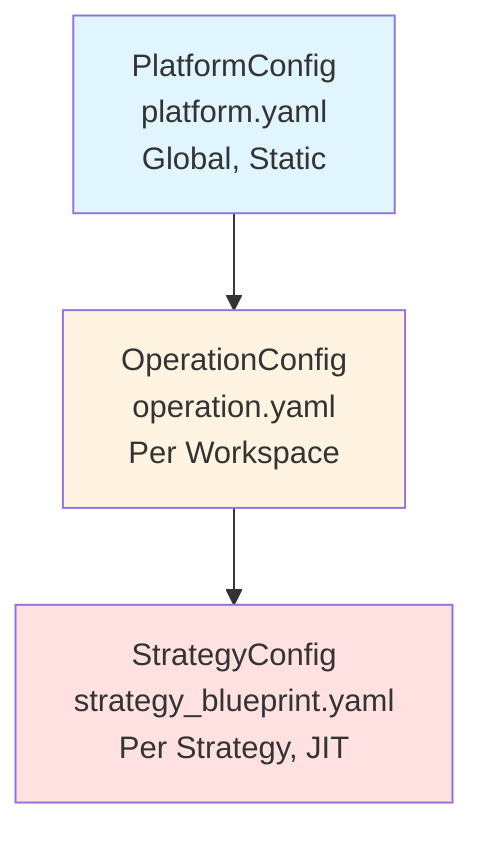
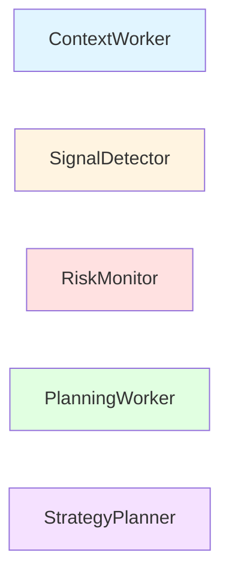
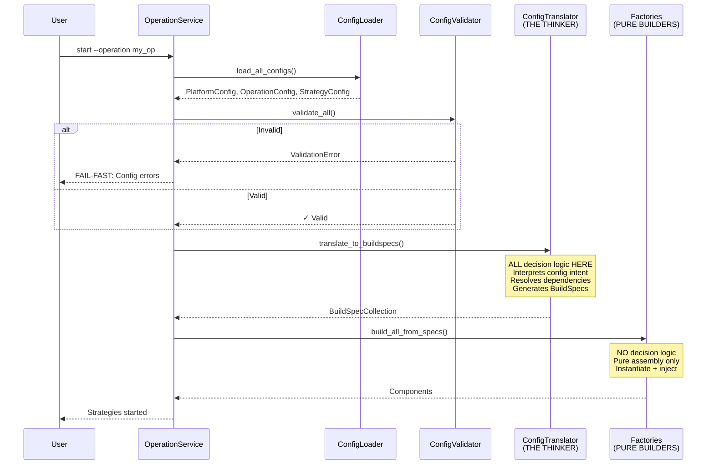

# Configuration Schema Architecture - V3 Design

**Status:** Week 1 Design - Implementation Ready  
**Date:** 2025-10-30  
**Priority:** CRITICAL PATH - Blocks all downstream components  
**Revised:** Based on docs/architecture/ (V3 architecture authority)  
**Next Steps:** Schema-by-schema parameter brainstorming (details TBD)

---

## CRITICAL: Read Architecture Docs First

**⚠️ VERPLICHT:** Dit document veronderstelt begrip van de V3 architectuur. Lees eerst:

1. ✅ [ARCHITECTURAL_SHIFTS.md](../architecture/ARCHITECTURAL_SHIFTS.md) - **NON-NEGOTIABLE**
2. ✅ [WORKER_TAXONOMY.md](../architecture/WORKER_TAXONOMY.md) - 5 worker categories
3. ✅ [CONFIGURATION_LAYERS.md](../architecture/CONFIGURATION_LAYERS.md) - 3-layer config hierarchy
4. ✅ [PLUGIN_ANATOMY.md](../architecture/PLUGIN_ANATOMY.md) - Manifest structure

---

## Overview

S1mpleTrader V3 gebruikt een **3-layer configuration hierarchy** met **BuildSpec-driven bootstrap**. Config schemas valideren YAML, ConfigTranslator vertaalt naar BuildSpecs, Factories assembleren components.

```
YAML Files  →  ConfigLoader  →  Config Schemas  →  ConfigValidator  →  ConfigTranslator  →  BuildSpecs  →  Factories  →  Components
(User)         (Hydration)      (Validation)       (Cross-check)        (Translation)       (Machine)      (Assembly)     (Runtime)
```

**Key Architectural Decisions:**

1. **NO Operators** - Workers wired directly via EventAdapters (Shift #1)
2. **NO Growing DataFrames** - Point-in-Time DTOs only (Shift #2)
3. **NO Runtime YAML Parsing** - BuildSpec-driven bootstrap (Shift #3)

---

## Table of Contents

1. [Architectural Principles](#architectural-principles)
2. [Configuration Layers](#configuration-layers)
3. [Complete Schema Inventory](#complete-schema-inventory)
4. [Future-Proofing Fields](#-future-proofing-fields-week-1---details-tbd)
5. [Worker Manifest Schema](#worker-manifest-schema)
6. [BuildSpec Schemas](#buildspec-schemas)
7. [Config-to-BuildSpec Translation](#config-to-buildspec-translation)
8. [Implementation Strategy](#implementation-strategy)

---

## Architectural Principles

### 1. The Three Layers

**Zie:** [CONFIGURATION_LAYERS.md](../architecture/CONFIGURATION_LAYERS.md)



**Layer 1: PlatformConfig**
- **Scope:** Global, static (één instantie per applicatie)
- **Loaded:** Eenmaal bij OperationService.start()
- **Contains:** Logging, paths, locale, performance tuning
- **File:** `platform.yaml`

**Layer 2: OperationConfig**
- **Scope:** Per workspace/campaign
- **Loaded:** Per operation
- **Contains:** Connectors, data sources, environments, schedules, strategy_links
- **File:** `operation.yaml` + referenced files (connectors/*.yaml, etc.)

**Layer 3: StrategyConfig**
- **Scope:** Per strategy
- **Loaded:** Just-in-time per strategy_link
- **Contains:** Workforce (worker instances), strategy-specific wiring
- **File:** `strategy_blueprint.yaml` + `wiring_map.yaml` (UI-generated)

---

### 2. Worker Taxonomy (5 Categories)

**Zie:** [WORKER_TAXONOMY.md](../architecture/WORKER_TAXONOMY.md) voor gedetailleerde flow



**Directory Structure:**
```
plugins/
├── context_workers/        # ContextWorker plugins
├── signal_detectors/       # SignalDetector plugins
├── risk_monitors/          # RiskMonitor plugins
├── planning_workers/       # PlanningWorker plugins
└── strategy_planners/      # StrategyPlanner plugins
```

**1. ContextWorker** - Enrichment (EMA, RSI, Regime Classification)
- Output: `set_result_dto()` → TickCache (plugin-specific DTOs)
- Communication: TickCache only (NEVER EventBus)
- Subtypes: 7 (regime_classification, indicator_calculation, etc.)

**2. SignalDetector** - Signal Detection (Breakouts, Momentum)
- Output: `DispositionEnvelope(PUBLISH, Signal)`
- Communication: EventBus (async signals)
- Subtypes: 7 (technical_pattern, momentum_signal, etc.)

**3. RiskMonitor** - Risk Monitoring (Drawdown, Volatility Spikes)
- Output: `DispositionEnvelope(PUBLISH, Risk)`
- Communication: EventBus (async signals)
- Subtypes: 5 (portfolio_risk, market_risk, etc.)

**4. PlanningWorker** - Plan Generation (Entry, Size, Exit, Execution Intent)
- Output: `set_result_dto()` → TickCache (EntryPlan, SizePlan, etc.)
- Communication: TickCache (sub-component DTOs)
- Subtypes: 4 (entry_planning, size_planning, etc.)
- **Note:** PlanningAggregator (platform component) combines into ExecutionDirective

**5. StrategyPlanner** - Decision Making (SWOT-based decisions)
- Output: `DispositionEnvelope(PUBLISH, StrategyDirective)`
- Communication: EventBus (strategy decisions)
- Cardinality: **Exactly 1 per strategy** (1-to-1 relationship)
- Categories: 4 (Entry, Position Management, Risk Control, Scheduled)

---

### 3. Manifest-Driven Dependencies

**Zie:** [PLUGIN_ANATOMY.md](../architecture/PLUGIN_ANATOMY.md)

**Manifest Structure:**
```yaml
# plugins/[category]/[plugin_name]/manifest.yaml

identification:
  name: "ema_detector"
  display_name: "EMA Detector"
  type: "context_worker"  # Worker category
  subtype: "indicator_calculation"  # Worker subtype (see taxonomy)
  version: "1.0.0"

dependencies:
  # NIEUWE STRUCTUUR (V3 - Point-in-Time DTOs)
  requires_dtos:
    - source: "backend.dto_reg.s1mple.regime_classifier.v1_0_0.regime_output_dto"
      dto_class: "RegimeOutputDTO"
  
  produces_dtos:
    - dto_class: "EMAOutputDTO"
      local_path: "dtos/ema_output_dto.py"

capabilities:
  context_access:
    enabled: true  # IStrategyCache - ALTIJD present, NIET configureerbaar
  
  ohlcv_window:
    enabled: true  # IOhlcvProvider - Historical OHLCV data
  
  state_persistence:
    enabled: true  # IStateProvider - Worker state storage
    scope: "strategy"  # OR "global"
  
  journaling:
    enabled: true  # IJournalWriter - Audit trail
```

**DEPRECATED (V2 - DataFrame columns):**
```yaml
# ❌ ACHTERHAALD - V2 DataFrame dependencies
dependencies:
  requires: ['close', 'volume']  # DataFrame columns
  provides: ['ema_20']           # DataFrame columns
```

---

### 4. BuildSpec-Driven Bootstrap

**Zie:** [LAYERED_ARCHITECTURE.md](../architecture/LAYERED_ARCHITECTURE.md#bootstrap-workflow)



**ConfigTranslator = THE THINKER**
- Interprets configuration intent
- Resolves dependencies (manifest → class path, etc.)
- Generates complete BuildSpecs
- **KEY:** ConfigTranslator is de ENIGE component met beslislogica

**Factories = PURE BUILDERS**
- Instantiate classes with provided parameters
- Inject dependencies as specified
- Return ready-to-use components
- **KEY:** Factories maken GEEN beslissingen, alleen assemblage

---

## Configuration Layers

### Layer 1: PlatformConfig

**File:** `platform.yaml`

```yaml
# platform.yaml

logging:
  level: "INFO"  # DEBUG, INFO, WARNING, ERROR
  format: "json"  # json, text
  output: "file"  # console, file, both
  log_dir: "./logs"

paths:
  plugins_dir: "./plugins"
  dto_registry: "./backend/dto_reg"
  config_dir: "./config"
  data_dir: "./data"

locale:
  timezone: "UTC"
  currency: "USD"

performance:
  max_parallel_strategies: 10
  tick_cache_ttl_seconds: 60
  event_queue_size: 1000
```

**Schema:** `platform_schema.py`
```python
class LoggingConfig(BaseModel):
    level: Literal["DEBUG", "INFO", "WARNING", "ERROR"]
    format: Literal["json", "text"]
    output: Literal["console", "file", "both"]
    log_dir: Path

class PathsConfig(BaseModel):
    plugins_dir: Path
    dto_registry: Path
    config_dir: Path
    data_dir: Path

class LocaleConfig(BaseModel):
    timezone: str  # IANA timezone string
    currency: str  # ISO 4217 currency code

class PerformanceConfig(BaseModel):
    max_parallel_strategies: int = Field(ge=1, le=100)
    tick_cache_ttl_seconds: int = Field(ge=10, le=3600)
    event_queue_size: int = Field(ge=100, le=10000)

class PlatformConfig(BaseModel):
    logging: LoggingConfig
    paths: PathsConfig
    locale: LocaleConfig
    performance: PerformanceConfig
```

---

### Layer 2: OperationConfig

**File:** `operation.yaml` + referenced files

```yaml
# operation.yaml

operation:
  name: "momentum_backtest_2025"
  description: "Q1 2025 momentum strategy backtest"
  
  # References to external files
  connectors_file: "./connectors/binance_connector.yaml"
  data_sources_file: "./data_sources/binance_ohlcv.yaml"
  environments_file: "./environments/backtest_env.yaml"
  schedule_file: "./schedules/1h_schedule.yaml"
  
  # List of strategies to run
  strategy_links:
    - name: "btc_momentum_long"
      file: "./strategies/momentum/btc_long_blueprint.yaml"
      enabled: true
      environment_ref: "backtest_q1_2025"  # Operation connects strategy to environment
```

**Schema:** `operation_schema.py`
```python
class StrategyLink(BaseModel):
    """Reference to strategy blueprint + execution context.
    
    Operation is de LIJM: verbindt strategy (WAT) + environment (WAAR).
    """
    name: str
    file: Path  # Path to strategy_blueprint.yaml (environment-agnostic)
    enabled: bool = True  # NEW: Auto-start control (Week 1 prep for Phase 2)
    environment_ref: str  # NEW: Which environment to use (REQUIRED - operation context)

class OperationConfig(BaseModel):
    """Complete operation configuration (composite)."""
    operation_name: str
    description: str = ""
    
    # Referenced configs (loaded by ConfigLoader)
    connectors: List[ConnectorConfig]
    data_sources: List[DataSourceConfig]
    environments: List[EnvironmentConfig]
    schedule: ScheduleConfig
    
    # Strategy links (JIT loaded)
    strategy_links: List[StrategyLink]
```

---

### 🔮 Future-Proofing Fields (Week 1 - Details TBD)

**Architectuur Principe: Operation is de LIJM**

- **Strategy Blueprint** = Environment-agnostic (WAT doet de strategy?)
- **Environment** = Strategy-agnostic (WAAR draait het?)
- **Operation** = Verbindt strategy + environment (HOE wordt het uitgevoerd?)

**Rationale:**
- ✅ Maximum herbruikbaarheid (strategy in meerdere operations/environments)
- ✅ SRP: Elk component focust op kerntaak
- ✅ Flexibiliteit: Strategy werkt ook buiten operation context (andere services)
- ✅ Losstaande modules zoals platform modules

---

#### 1. `StrategyLink.enabled: bool = True`

**Purpose:** Auto-start control for strategies binnen een operation.

**Huidige Behavior (Week 1-6):**
- Waarde: Altijd `True` (default)
- Effect: Alle strategy_links worden automatisch gestart bij operation.start()
- Implementation: ConfigTranslator laadt ALLE strategy_links met `enabled=True`

**Toekomstige Behavior (Week 7+, Phase 2: Manual Control):**
- Waarde: User-configureerbaar (`true` of `false`)
- Effect: `enabled=false` → strategy NIET automatisch gestart
- Use case: User wil 3 van 5 strategieën starten, rest handmatig later activeren
- Implementation: OperationService.start() filtert op `enabled=True`, UI toont "Start Strategy" button voor disabled strategies

**Brainstorm Topics:**
- Validatie: Minimaal 1 enabled strategy verplicht?
- Dependency handling: Wat als strategy A afhankelijk is van disabled strategy B?
- State persistence: enabled-status opslaan in runtime state?
- Hot-reload: enabled-flag wijzigen zonder operation restart?

---

#### 2. `StrategyLink.environment_ref: str`

**Purpose:** Welke environment gebruikt deze strategy? (backtest/paper/live)

**ARCHITECTUUR:** `environment_ref` zit in **StrategyLink** (Operation layer), NIET in StrategyBlueprint.

**Waarom?**
- Strategy Blueprint is **environment-agnostic** (herbruikbaar)
- Operation is de **lijm** die strategy + environment verbindt
- Dezelfde blueprint kan in meerdere operations/environments draaien
- SRP: Blueprint = "WAT", Environment = "WAAR", Operation = "HOE"

**Huidige Behavior (Week 1-13):**
- Waarde: **REQUIRED** in StrategyLink (geen default)
- Effect: Operation MOET expliciet environment kiezen per strategy
- Implementation: ConfigTranslator resolves `environment_ref` → EnvironmentBuildSpec
- Validatie: `environment_ref` MOET bestaan in `operation.environments`

**Toekomstige Behavior (Week 13+, Phase 4: Environment Promotion):**
- Runtime environment switching (backtest → paper → live)
- UI "Promote to Paper/Live" buttons
- Causality tracking van promoties
- State migration tussen environments

**Brainstorm Topics:**
- Validatie: Strict check dat environment_ref bestaat in operation.environments?
- Multi-environment: Kunnen meerdere strategies DEZELFDE environment delen? (Ja)
- Same blueprint, multiple environments: Kan strategy_link TWEE keer refereren naar zelfde blueprint met verschillende environments? (Ja)
- Environment switching: Runtime promotie zonder YAML edit? (Future)
- Causality tracking: environment_ref wijziging = nieuwe causality root?
- State migration: Worker state meenemen bij environment promotie?

**Example (Correct Architecture):**
```yaml
# operation_backtest.yaml
operation_name: "Q1_2025_Backtest"

environments:
  - environment_id: "btc_backtest_q1"
    type: "backtest"
    start_date: "2025-01-01"
    end_date: "2025-03-31"
    initial_capital: 10000

strategy_links:
  - name: "btc_momentum_backtest"
    file: "./strategies/btc_momentum_blueprint.yaml"  # Shared, reusable
    enabled: true
    environment_ref: "btc_backtest_q1"  # ← Operation connects strategy to environment

# operation_paper.yaml
operation_name: "Live_Paper_Trading"

environments:
  - environment_id: "btc_paper_testnet"
    type: "paper"
    api_mode: "testnet"

strategy_links:
  - name: "btc_momentum_paper"
    file: "./strategies/btc_momentum_blueprint.yaml"  # SAME blueprint, reused
    enabled: true
    environment_ref: "btc_paper_testnet"  # ← Different environment, same strategy

# strategies/btc_momentum_blueprint.yaml (ENVIRONMENT-AGNOSTIC)
strategy_id: "btc_momentum_v1"
name: "BTC Momentum Long"
symbol: "BTC/USDT"
# NO environment_ref - blueprint is reusable
workforce:
  context_workers:
    - plugin_id: "trend_classifier"
      ...
```

**Use Case: Same Blueprint, Multiple Environments in ONE Operation:**
```yaml
# operation_multi_env.yaml
environments:
  - environment_id: "backtest_q1"
    type: "backtest"
    ...
  - environment_id: "backtest_q2"
    type: "backtest"
    ...
  - environment_id: "paper_testnet"
    type: "paper"
    ...

strategy_links:
  - name: "momentum_backtest_q1"
    file: "./strategies/btc_momentum.yaml"
    environment_ref: "backtest_q1"
  
  - name: "momentum_backtest_q2"
    file: "./strategies/btc_momentum.yaml"  # SAME blueprint
    environment_ref: "backtest_q2"
  
  - name: "momentum_paper"
    file: "./strategies/btc_momentum.yaml"  # SAME blueprint
    environment_ref: "paper_testnet"
```

**Promotie Workflow (Future):**
1. Backtest operation draait met `environment_ref: "backtest_q1"`
2. Validatie succesvol → User kopieert strategy_link naar paper operation
3. Paper operation: `environment_ref: "paper_testnet"` (zelfde blueprint)
4. Paper trading succesvol → User kopieert naar live operation
5. Live operation: `environment_ref: "production"` (zelfde blueprint)
6. Causality chain tracked per operation

---

**Referenced Configs:**

#### connectors/binance_connector.yaml
```yaml
connector:
  type: "binance"
  api_key: "${BINANCE_API_KEY}"
  api_secret: "${BINANCE_API_SECRET}"
  testnet: false
```

#### data_sources/binance_ohlcv.yaml
```yaml
data_source:
  type: "ohlcv_rest"
  connector_ref: "binance"
  symbols: ["BTC/USDT", "ETH/USDT"]
  timeframes: ["1h", "4h"]
  lookback_days: 365
```

#### environments/backtest_env.yaml
```yaml
environment:
  type: "backtest"
  start_date: "2025-01-01"
  end_date: "2025-03-31"
  initial_capital: 10000
  commission: 0.001
  slippage_model: "percentage"
  slippage_value: 0.0005
```

#### schedules/1h_schedule.yaml
```yaml
schedule:
  type: "cron"
  expression: "0 * * * *"  # Every hour
  timezone: "UTC"
```

---

### Layer 3: StrategyConfig

**Files:** `strategy_blueprint.yaml` + `wiring_map.yaml` (UI-generated)

```yaml
# strategies/momentum/btc_long_blueprint.yaml
# ENVIRONMENT-AGNOSTIC: No environment_ref, fully reusable

strategy:
  name: "btc_momentum_long"
  description: "BTC long-only momentum strategy"
  symbol: "BTC/USDT"  # What to trade
  # NO environment_ref - Operation is the glue that connects strategy to environment
  
  workforce:
    context_workers:
      - worker_id: "ema_detector_1"
        plugin: "s1mple/ema_detector/v1.0.0"
        config:
          fast_period: 20
          slow_period: 50
    
    opportunity_workers:
      - worker_id: "momentum_scout_1"
        plugin: "s1mple/momentum_signal/v1.0.0"
        config:
          min_confidence: 0.75
    
    planning_workers:
      - worker_id: "limit_entry_planner_1"
        plugin: "s1mple/limit_entry_planner/v1.0.0"
        config:
          entry_offset_pct: 0.001
      
      - worker_id: "kelly_sizer_1"
        plugin: "s1mple/kelly_sizer/v1.0.0"
        config:
          max_position_pct: 0.25
    
    strategy_planner:  # EXACTLY 1 required!
      - worker_id: "momentum_planner_1"
        plugin: "s1mple/swot_momentum_planner/v1.0.0"
        config:
          min_swot_score: 0.70
```

**Schema:** `strategy_blueprint_schema.py`
```python
class WorkerConfig(BaseModel):
    """Configuration for ONE worker instance."""
    worker_id: str = Field(..., description="Unique instance ID within strategy")
    plugin: str = Field(..., description="Plugin identifier: 'vendor/name/version'")
    config: Dict[str, Any] = Field(default_factory=dict, description="Plugin-specific params")

class Workforce(BaseModel):
    """Complete workforce for a strategy."""
    context_workers: List[WorkerConfig] = Field(default_factory=list)
    opportunity_workers: List[WorkerConfig] = Field(default_factory=list)
    threat_workers: List[WorkerConfig] = Field(default_factory=list)
    planning_workers: List[WorkerConfig] = Field(default_factory=list)
    strategy_planner: WorkerConfig  # EXACTLY 1 required
    
    @field_validator('strategy_planner')
    @classmethod
    def validate_strategy_planner(cls, v):
        if not v:
            raise ValueError("strategy_planner is required (exactly 1)")
        return v

class StrategyBlueprint(BaseModel):
    """Complete strategy blueprint - defines WHO (workforce).
    
    ENVIRONMENT-AGNOSTIC: Blueprint heeft GEEN environment_ref.
    Operation is de lijm die strategy + environment verbindt.
    """
    strategy_id: str
    name: str
    description: str = ""
    symbol: str  # Target trading pair
    
    workforce: Workforce
```

---

## Complete Schema Inventory

### Week 1 Implementation Priority

**4 Core Schema Files** (Week 1 CRITICAL PATH):

1. ✅ **`worker_manifest_schema.py`** (FIRST - highest priority)
   - WorkerManifest - Plugin contract (I/O, capabilities, events)
   - SchemaReference - Plugin's config schema reference
   - DependencyDeclaration - DTO dependencies (requires/produces)
   - CapabilityDeclaration - Platform providers requested
   - CustomEventDeclaration - Custom events worker can publish
   - EventWiring - Custom events worker listens to

2. ✅ **`strategy_blueprint_schema.py`** (SECOND)
   - StrategyBlueprint - Complete strategy workforce
   - Workforce - Worker category groupings
   - WorkerConfig - Worker instance configuration

3. ✅ **`wiring_config_schema.py`** (THIRD)
   - WiringConfig - Uniform wiring structure
   - WiringRule - Single wiring rule
   - WiringSource - Event source
   - WiringTarget - Event target

4. ✅ **`buildspec_schemas.py`** (FOURTH - machine instructions)
   - WorkerBuildSpec - Instructions to build ONE worker
   - WiringBuildSpec - Complete wiring instructions
   - ConnectorBuildSpec - Connector build instructions
   - DataSourceBuildSpec - Data source build instructions
   - EnvironmentBuildSpec - Environment build instructions
   - StrategyBuildSpec - Complete strategy build instructions
   - BuildSpecCollection - Complete operation build instructions

**Remaining Schemas** (Week 2+):

5. ⏳ **`platform_schema.py`** (Layer 1)
6. ⏳ **`operation_schema.py`** (Layer 2 - composite)
7. ⏳ **`connector_schema.py`** (Layer 2)
8. ⏳ **`data_source_schema.py`** (Layer 2)
9. ⏳ **`environment_schema.py`** (Layer 2)
10. ⏳ **`schedule_schema.py`** (Layer 2)

---

## Worker Manifest Schema

**File:** `backend/config/schemas/worker_manifest_schema.py`

**Purpose:** Validate plugin manifest.yaml (plugin contract)

```python
from pydantic import BaseModel, Field, field_validator
from typing import List, Optional, Literal, Dict

class SchemaReference(BaseModel):
    """Reference to plugin's parameter schema."""
    path: str = Field(..., description="Relative path to schema.py")
    class_name: str = Field(..., description="Pydantic class name")

class DependencyDeclaration(BaseModel):
    """DTO dependencies (Point-in-Time model)."""
    
    # DTOs required from other workers
    requires_dtos: List[Dict[str, str]] = Field(
        default_factory=list,
        description="List of {source: path, dto_class: name}"
    )
    
    # DTOs produced by this worker
    produces_dtos: List[Dict[str, str]] = Field(
        default_factory=list,
        description="List of {dto_class: name, local_path: path}"
    )

class CapabilityDeclaration(BaseModel):
    """Platform capability requests."""
    
    # Standard capability (ALWAYS available)
    context_access: Dict[str, bool] = Field(
        default={"enabled": True},
        description="IStrategyCache - REQUIRED, NOT configurable"
    )
    
    # Opt-in capabilities
    ohlcv_window: Optional[Dict[str, bool]] = Field(
        default=None,
        description="IOhlcvProvider - Historical OHLCV data"
    )
    
    multi_timeframe: Optional[Dict[str, bool]] = Field(
        default=None,
        description="IMtfProvider - Multiple timeframes"
    )
    
    state_persistence: Optional[Dict[str, Any]] = Field(
        default=None,
        description="IStateProvider - Worker state storage (scope: strategy/global)"
    )
    
    market_depth: Optional[Dict[str, bool]] = Field(
        default=None,
        description="IDepthProvider - Order book data"
    )
    
    ledger_state: Optional[Dict[str, bool]] = Field(
        default=None,
        description="ILedgerProvider - Portfolio/position state"
    )
    
    journaling: Optional[Dict[str, bool]] = Field(
        default=None,
        description="IJournalWriter - Audit trail"
    )
    
    events: Optional[Dict[str, Any]] = Field(
        default=None,
        description="Event-driven worker capabilities (publishes, wirings)"
    )

class CustomEventDeclaration(BaseModel):
    """Custom event this plugin can publish."""
    event_name: str
    description: str = ""
    payload_type: Optional[str] = None

class EventWiring(BaseModel):
    """Custom event this plugin listens to."""
    listens_to: str
    invokes: Dict[str, str]  # {"method": "on_event", "description": "..."}

class WorkerManifest(BaseModel):
    """
    Complete plugin manifest contract.
    
    Defines the interface, capabilities, and event declarations
    for a single worker plugin.
    """
    
    # Identification (nested under 'identification' in YAML)
    identification: Dict[str, Any] = Field(..., description="Plugin metadata")
    
    # Dependencies (Point-in-Time DTO model)
    dependencies: DependencyDeclaration = Field(
        default_factory=DependencyDeclaration,
        description="DTO dependencies"
    )
    
    # Capabilities
    capabilities: CapabilityDeclaration = Field(
        default_factory=CapabilityDeclaration,
        description="Platform capability requests"
    )
    
    @field_validator('identification')
    @classmethod
    def validate_identification(cls, v):
        """Validate identification section."""
        required_fields = ['name', 'display_name', 'type', 'subtype', 'version']
        for field in required_fields:
            if field not in v:
                raise ValueError(f"identification.{field} is required")
        
        # Validate worker type
        valid_types = ['context_worker', 'opportunity_worker', 'threat_worker', 
                       'planning_worker', 'strategy_planner']
        if v['type'] not in valid_types:
            raise ValueError(f"identification.type must be one of {valid_types}")
        
        return v
```

**Key Design Decisions:**

1. ✅ **Nested YAML structure** - `identification:`, `dependencies:`, `capabilities:`
2. ✅ **context_access always enabled** - NOT configurable (required for all workers)
3. ✅ **Optional capabilities** - Only include if needed (e.g., `ohlcv_window`)
4. ✅ **Point-in-Time DTOs** - `requires_dtos` / `produces_dtos` (NOT DataFrame columns)
5. ✅ **Event capabilities** - Optional `events:` with `publishes` and `wirings`

---

## BuildSpec Schemas

**File:** `backend/config/schemas/buildspec_schemas.py`

**Purpose:** Validate ConfigTranslator output (machine instructions for Factories)

```python
from pydantic import BaseModel, Field
from typing import List, Dict, Any, Set, Literal

class WorkerBuildSpec(BaseModel):
    """Complete instructions to build ONE worker instance."""
    
    worker_id: str = Field(..., description="Unique worker instance ID")
    plugin_id: str = Field(..., description="Plugin identifier: vendor/name/version")
    worker_class_path: str = Field(..., description="Absolute import path to worker class")
    init_params: Dict[str, Any] = Field(..., description="Validated init parameters")
    
    # Capabilities to inject (from manifest)
    needs_state_persistence: bool = Field(default=False)
    needs_event_capability: bool = Field(default=False)
    needs_journaling: bool = Field(default=False)
    
    # Custom events this worker can publish (from manifest.capabilities.events.publishes)
    allowed_publications: Set[str] = Field(default_factory=set)
    
    # Platform providers to inject (from manifest.capabilities)
    providers: Dict[str, Any] = Field(
        default_factory=dict,
        description="Provider injection config: {ohlcv_window: {...}, state_persistence: {...}}"
    )

class WiringBuildSpec(BaseModel):
    """Complete wiring instructions for EventWiringFactory."""
    
    wiring_id: str
    wiring_rules: List[Dict[str, Any]]  # List of WiringRule (from wiring_config_schema)
    
    # Additional metadata for validation
    component_registry: Dict[str, str] = Field(
        default_factory=dict,
        description="component_id → type (worker/singleton) for validation"
    )

class ConnectorBuildSpec(BaseModel):
    """Instructions to build connector."""
    connector_id: str
    connector_type: str  # "binance", "coinbase", "backtest_file", etc.
    connection_params: Dict[str, Any]

class DataSourceBuildSpec(BaseModel):
    """Instructions to build data source."""
    data_source_id: str
    source_type: str  # "ohlcv_rest", "ohlcv_websocket", etc.
    connector_ref: str  # Reference to connector_id
    symbols: List[str]
    timeframes: List[str]
    lookback_days: int

class EnvironmentBuildSpec(BaseModel):
    """Instructions to build environment."""
    environment_id: str
    environment_type: Literal["backtest", "paper", "live"]
    config: Dict[str, Any]  # start_date, end_date, initial_capital, etc.

class StrategyBuildSpec(BaseModel):
    """Complete instructions to build entire strategy."""
    
    strategy_id: str
    
    # All component specs
    workers: List[WorkerBuildSpec]
    wiring: WiringBuildSpec
    
    # Environment context
    connector_refs: List[str]  # References to connector_ids
    data_source_refs: List[str]  # References to data_source_ids
    environment_ref: str  # Reference to environment_id

class BuildSpecCollection(BaseModel):
    """
    Complete build instructions for entire operation.
    
    This is the FINAL output of ConfigTranslator.
    """
    
    # Operation-wide resources
    connectors: List[ConnectorBuildSpec]
    data_sources: List[DataSourceBuildSpec]
    environments: List[EnvironmentBuildSpec]
    platform_wiring: WiringBuildSpec  # Singleton wiring (TickCacheManager, etc.)
    
    # Per-strategy
    strategies: List[StrategyBuildSpec]
```

**Key Design Decisions:**

1. ✅ **Denormalized** - BuildSpecs contain ALL info needed (no cross-references during build)
2. ✅ **Flattened** - Nested config structures flattened for easy factory consumption
3. ✅ **Enriched** - ConfigTranslator adds derived data (class_path, allowed_publications, etc.)
4. ✅ **Validated** - Both Config Schemas AND BuildSpec Schemas validate (double-check)

---

## Config-to-BuildSpec Translation

### ConfigTranslator = The Thinker

**Zie:** [LAYERED_ARCHITECTURE.md](../architecture/LAYERED_ARCHITECTURE.md#bootstrap-workflow)

**Responsibility:** ALL decision logic for component construction

```python
class ConfigTranslator:
    """
    Translates validated configs into BuildSpecs.
    
    THE ONLY component with decision logic.
    Factories are PURE BUILDERS - no interpretation, only assembly.
    """
    
    def translate_to_buildspecs(
        self,
        platform_config: PlatformConfig,
        operation_config: OperationConfig,
        strategy_configs: List[StrategyConfig]
    ) -> BuildSpecCollection:
        """
        THE ASSEMBLY POINT - where all config layers converge.
        
        This method has access to:
        1. Platform settings (paths for plugin discovery)
        2. Operation resources (connectors, data sources, environments)
        3. Strategy blueprints (workforce)
        4. Strategy wiring maps (UI-generated)
        5. All manifests (via PluginRegistry)
        
        Output: Complete, flattened BuildSpecs ready for Factories
        """
        
        # 1. Translate operation-wide resources
        connector_specs = [self._translate_connector(c) for c in operation_config.connectors]
        data_source_specs = [self._translate_data_source(d) for d in operation_config.data_sources]
        environment_specs = [self._translate_environment(e) for e in operation_config.environments]
        platform_wiring_spec = self._translate_wiring(operation_config.platform_wiring)
        
        # 2. Translate strategies
        strategy_specs = []
        for strategy_config in strategy_configs:
            # 2a. Translate workers
            worker_specs = []
            for worker_config in strategy_config.workforce.all_workers():
                manifest = self._plugin_registry.get_manifest(worker_config.plugin)
                worker_spec = self._translate_worker(worker_config, manifest)
                worker_specs.append(worker_spec)
            
            # 2b. Translate wiring
            wiring_spec = self._translate_wiring(
                strategy_config.wiring_map,
                worker_specs
            )
            
            # 2c. Build complete StrategyBuildSpec
            strategy_spec = StrategyBuildSpec(
                strategy_id=strategy_config.strategy_id,
                workers=worker_specs,
                wiring=wiring_spec,
                connector_refs=[c.connector_id for c in connector_specs],
                data_source_refs=[d.data_source_id for d in data_source_specs],
                environment_ref=environment_specs[0].environment_id
            )
            strategy_specs.append(strategy_spec)
        
        # 3. Build complete BuildSpecCollection
        return BuildSpecCollection(
            connectors=connector_specs,
            data_sources=data_source_specs,
            environments=environment_specs,
            platform_wiring=platform_wiring_spec,
            strategies=strategy_specs
        )
    
    def _translate_worker(
        self,
        worker_config: WorkerConfig,
        manifest: WorkerManifest
    ) -> WorkerBuildSpec:
        """
        Translate WorkerConfig → WorkerBuildSpec.
        
        Enrichments:
        - Plugin ID → Absolute class path
        - Config dict → Validated params (via manifest schema)
        - Manifest capabilities → Boolean flags
        - Manifest publishes → Set of allowed event names
        """
        
        # 1. Resolve plugin class path
        plugin_id = manifest.identification['name']
        version = manifest.identification['version']
        class_path = f"plugins.{plugin_id.replace('/', '.')}.v{version.replace('.', '_')}.worker.{manifest.identification['class_name']}"
        
        # 2. Validate params against plugin schema
        schema_ref = manifest.identification.get('schema')
        if schema_ref:
            schema_class = self._load_schema_class(schema_ref)
            validated_params = schema_class(**worker_config.config).model_dump()
        else:
            validated_params = worker_config.config
        
        # 3. Extract capabilities
        caps = manifest.capabilities
        needs_state = caps.state_persistence is not None and caps.state_persistence.get('enabled', False)
        needs_events = caps.events is not None and caps.events.get('enabled', False)
        needs_journal = caps.journaling is not None and caps.journaling.get('enabled', False)
        
        # 4. Extract custom events
        allowed_pubs = set()
        if caps.events and 'publishes' in caps.events:
            for event_decl in caps.events['publishes']:
                allowed_pubs.add(event_decl['event_name'])
        
        # 5. Build provider injection config
        providers = {}
        if caps.ohlcv_window and caps.ohlcv_window.get('enabled'):
            providers['ohlcv_window'] = caps.ohlcv_window
        if caps.state_persistence and caps.state_persistence.get('enabled'):
            providers['state_persistence'] = caps.state_persistence
        # ... other providers
        
        # 6. Build WorkerBuildSpec
        return WorkerBuildSpec(
            worker_id=worker_config.worker_id,
            plugin_id=worker_config.plugin,
            worker_class_path=class_path,
            init_params=validated_params,
            needs_state_persistence=needs_state,
            needs_event_capability=needs_events,
            needs_journaling=needs_journal,
            allowed_publications=allowed_pubs,
            providers=providers
        )
```

**Key Transformations:**

1. ✅ **Plugin ID → Absolute class path** (manifest.name + version → import path)
2. ✅ **Config dict → Validated params** (via plugin's schema.py)
3. ✅ **Manifest capabilities → Boolean flags** (enabled: true → needs_X: True)
4. ✅ **Manifest publishes → Set of allowed event names** (for EventAdapter validation)
5. ✅ **Provider injection config** (which providers to inject + config)

---

## Implementation Strategy

### Broadcast Pattern Configuration Requirements

**CRITICAL:** Event wiring config MUST follow broadcast pattern with handler-based filtering.

**Architectural Principle:**
> EventWiringDTO blijft **simpel** (source + target only). Filtering gebeurt **consistent op DTO inhoud basis** in worker handlers, NIET in configuratie. **Geen payload_filter velden in schema, geen hints in YAML.**

#### WiringRule Schema Constraints

```python
# backend/config/schemas/wiring_config_schema.py

class WiringSourceDTO(BaseModel):
    component_id: str           # Source component
    event_name: str             # Event name (generic for broadcast)
    event_type: str             # DTO type name
    
    # ❌ NO payload_filter: Optional[Dict[str, Any]]
    # ❌ NO filter_condition: Optional[str]
    # ❌ NO when_clause: Optional[str]

class WiringTargetDTO(BaseModel):
    component_id: str           # Target component
    handler_method: str         # Handler method name
    
    # ❌ NO filter fields here either!

class WiringRuleDTO(BaseModel):
    wiring_id: str
    source: WiringSourceDTO
    target: WiringTargetDTO
    
    # ✅ ONLY routing topology - NO filtering logic!
```

**Rationale:**
- **Separation of Concerns:** Wiring = routing, Filtering = business logic (in handlers)
- **Type Safety:** Handlers receive full DTO, inspect fields in code
- **Flexibility:** Change filtering without config changes
- **Testability:** Filter logic = unit testable Python code, not YAML strings

#### Broadcast Pattern Validation

```python
# backend/config/validators/wiring_validator.py

class BroadcastPatternValidator:
    """
    Validates broadcast pattern consistency at bootstrap.
    """
    
    def validate_flow_initiator_wiring(
        self, 
        wiring_rules: List[WiringRuleDTO]
    ) -> None:
        """
        Ensure all flow initiators wired to EXTERNAL_EVENT_RECEIVED.
        """
        flow_initiators = [
            "tick_cache_manager",
            "news_event_manager", 
            "scheduled_task_manager",
            "user_action_manager"
        ]
        
        for initiator in flow_initiators:
            rules = [r for r in wiring_rules if r.target.component_id == initiator]
            
            if not rules:
                raise ValueError(f"Flow initiator {initiator} not wired!")
            
            if len(rules) > 1:
                raise ValueError(f"Flow initiator {initiator} has multiple wirings!")
            
            rule = rules[0]
            if rule.source.event_name != "EXTERNAL_EVENT_RECEIVED":
                raise ValueError(
                    f"{initiator} must listen to EXTERNAL_EVENT_RECEIVED, "
                    f"not {rule.source.event_name}"
                )
    
    def validate_no_deprecated_events(
        self,
        wiring_rules: List[WiringRuleDTO]
    ) -> None:
        """
        Ensure no deprecated specific events in config.
        """
        deprecated = [
            "TICK_RECEIVED",
            "NEWS_RECEIVED", 
            "SCHEDULED_TASK_TRIGGERED",
            "USER_ACTION_RECEIVED"
        ]
        
        for rule in wiring_rules:
            if rule.source.event_name in deprecated:
                raise ValueError(
                    f"Deprecated event {rule.source.event_name}! "
                    f"Use EXTERNAL_EVENT_RECEIVED with payload filtering."
                )
```

#### YAML Configuration Examples

**✅ CORRECT - Broadcast Pattern:**

```yaml
# platform_wiring.yaml
platform_wiring:
  # All flow initiators listen to SAME event
  - wiring_id: "os_to_tick_manager"
    source:
      component_id: "operation_service"
      event_name: "EXTERNAL_EVENT_RECEIVED"  # Generic event
      event_type: "ExternalEvent"
    target:
      component_id: "tick_cache_manager"
      handler_method: "on_external_event"
  
  - wiring_id: "os_to_news_manager"
    source:
      component_id: "operation_service"
      event_name: "EXTERNAL_EVENT_RECEIVED"  # Same event!
      event_type: "ExternalEvent"
    target:
      component_id: "news_event_manager"
      handler_method: "on_external_event"
  
  - wiring_id: "os_to_scheduled_task_manager"
    source:
      component_id: "operation_service"
      event_name: "EXTERNAL_EVENT_RECEIVED"  # Same event!
      event_type: "ExternalEvent"
    target:
      component_id: "scheduled_task_manager"
      handler_method: "on_external_event"
  
  - wiring_id: "os_to_user_action_manager"
    source:
      component_id: "operation_service"
      event_name: "EXTERNAL_EVENT_RECEIVED"  # Same event!
      event_type: "ExternalEvent"
    target:
      component_id: "user_action_manager"
      handler_method: "on_external_event"
```

**❌ DEPRECATED - Specific Events:**

```yaml
# ❌ FOUT - Suggereert 4 verschillende events
platform_wiring:
  - source:
      event_name: "TICK_RECEIVED"  # ❌ Deprecated!
    target:
      component_id: "tick_cache_manager"
  
  - source:
      event_name: "NEWS_RECEIVED"  # ❌ Deprecated!
    target:
      component_id: "news_event_manager"
```

**❌ WRONG - Filter Fields in Config:**

```yaml
# ❌ FOUT - Filtering hoort in handler code!
platform_wiring:
  - source:
      event_name: "EXTERNAL_EVENT_RECEIVED"
      payload_filter:  # ❌ NO! This violates architecture!
        event_type: "TICK"
    target:
      component_id: "tick_cache_manager"
```

#### Handler-Based Filtering Contract

**All flow initiators MUST implement:**

```python
class BaseFlowInitiator(ABC):
    @abstractmethod
    def get_event_type(self) -> str:
        """Return expected event_type for filtering."""
        pass
    
    def on_external_event(self, event: Event[ExternalEvent]) -> DispositionEnvelope:
        # Step 1: Filter on payload.event_type
        if event.payload.event_type != self.get_event_type():
            return DispositionEnvelope(disposition=Disposition.CONTINUE)
        
        # Step 2: Transform payload
        flow_payload = self.transform_payload(event.payload)
        
        # Step 3: Publish flow start
        return DispositionEnvelope(
            disposition=Disposition.PUBLISH,
            next_payload=flow_payload,
            event_name=self.get_flow_start_event_name()
        )
```

**Concrete example:**

```python
class TickCacheManager(BaseFlowInitiator):
    def get_event_type(self) -> str:
        return "TICK"  # ✅ Filtering in code, not config!
    
    def transform_payload(self, payload: ExternalEvent) -> TradingContext:
        # Build TradingContext from tick data...
        return TradingContext(...)
```

#### Configuration Impact Summary

| **Aspect** | **Before** | **After** | **Action** |
|-----------|-----------|---------|-----------|
| Wiring rules count | 1 per event type | 4 rules, same event | Update platform_wiring.yaml |
| Event name | Specific (TICK_RECEIVED) | Generic (EXTERNAL_EVENT_RECEIVED) | Update OperationService |
| Payload structure | Event-specific | ExternalEvent DTO with discriminator | Create ExternalEvent DTO |
| Filtering location | ❌ No standard | ✅ BaseFlowInitiator.on_external_event() | Implement template method |
| WiringRuleDTO schema | Simple | ✅ Stays simple (NO new fields!) | No schema changes |
| Config validation | Basic structure | + Broadcast pattern checks | Add BroadcastPatternValidator |

---

### Week 1 Deliverables

**4 Schema Files → 60+ Tests**

**Day 1-2: worker_manifest_schema.py** (20+ tests)
- ✅ WorkerManifest validation
- ✅ Nested YAML structure (identification, dependencies, capabilities)
- ✅ Worker type validation (5 valid categories)
- ✅ Worker subtype validation (per category)
- ✅ DTO dependencies (requires_dtos, produces_dtos)
- ✅ Capability declarations (context_access always enabled)
- ✅ Event declarations (publishes, wirings)

**Day 3: strategy_blueprint_schema.py** (15+ tests)
- ✅ StrategyBlueprint validation
- ✅ Workforce structure (5 worker categories)
- ✅ WorkerConfig validation (worker_id, plugin, config)
- ✅ strategy_planner uniqueness (exactly 1 required)

**Day 4: wiring_config_schema.py** (15+ tests)
- ✅ WiringConfig validation
- ✅ WiringRule structure
- ✅ Uniform structure across base/platform/strategy wiring
- ✅ Event type validation (SystemEvent, CustomEvent)

**Day 5: buildspec_schemas.py** (10+ tests)
- ✅ WorkerBuildSpec validation
- ✅ WiringBuildSpec validation
- ✅ StrategyBuildSpec validation
- ✅ BuildSpecCollection validation
- ✅ Cross-reference consistency

**Remaining Schemas (Week 2+):**
- ⏳ platform_schema.py (5+ tests)
- ⏳ operation_schema.py (10+ tests)
- ⏳ connector_schema.py (5+ tests)
- ⏳ data_source_schema.py (5+ tests)
- ⏳ environment_schema.py (5+ tests)
- ⏳ schedule_schema.py (5+ tests)

### TDD Workflow per Schema

**RED → GREEN → REFACTOR (3 commits per schema)**

**Phase 1: RED (Write Tests First)**
```python
# tests/unit/config/test_worker_manifest_schema.py

def test_worker_manifest_basic_structure():
    """WorkerManifest accepts valid basic structure."""
    data = {
        "identification": {
            "name": "ema_detector",
            "display_name": "EMA Detector",
            "type": "context_worker",
            "subtype": "indicator_calculation",
            "version": "1.0.0"
        },
        "dependencies": {
            "produces_dtos": [
                {"dto_class": "EMAOutputDTO", "local_path": "dtos/ema_output_dto.py"}
            ]
        },
        "capabilities": {
            "context_access": {"enabled": True},
            "ohlcv_window": {"enabled": True}
        }
    }
    manifest = WorkerManifest(**data)
    assert manifest.identification['name'] == "ema_detector"

def test_worker_manifest_rejects_invalid_type():
    """WorkerManifest rejects invalid worker type."""
    data = {
        "identification": {
            "name": "test",
            "display_name": "Test",
            "type": "invalid_type",  # ❌ Invalid!
            "subtype": "test",
            "version": "1.0.0"
        }
    }
    with pytest.raises(ValidationError):
        WorkerManifest(**data)

# ... 18 more tests
```

**Phase 2: GREEN (Implement Minimal)**
```python
# backend/config/schemas/worker_manifest_schema.py

class WorkerManifest(BaseModel):
    identification: Dict[str, Any]
    dependencies: DependencyDeclaration = Field(default_factory=DependencyDeclaration)
    capabilities: CapabilityDeclaration = Field(default_factory=CapabilityDeclaration)
    
    @field_validator('identification')
    @classmethod
    def validate_identification(cls, v):
        valid_types = ['context_worker', 'opportunity_worker', 'threat_worker', 
                       'planning_worker', 'strategy_planner']
        if v.get('type') not in valid_types:
            raise ValueError(f"type must be one of {valid_types}")
        return v
```

**Phase 3: REFACTOR (Add Docs, Validators)**
```python
class WorkerManifest(BaseModel):
    """
    Complete plugin manifest contract.
    
    Validates the manifest.yaml structure for worker plugins.
    Ensures all required fields are present and valid.
    
    Example:
        ```yaml
        identification:
          name: "ema_detector"
          type: "context_worker"
        ```
    """
    
    identification: Dict[str, Any] = Field(
        ...,
        description="Plugin metadata (name, type, version, etc.)"
    )
    # ... add comprehensive Field descriptions
```

---

## Critical Design Decisions

### 1. NO event_map.yaml in V3

**V2 had `event_map.yaml`:**
```yaml
# V2: event_map.yaml
events:
  - event_name: "ContextReady"
    payload_dto: "TradingContext"
    category: "tick"
```

**V3 Decision: REMOVE event_map.yaml**

**Rationale:**

1. **SystemEvents:** Generated by UI with unique UUID names (`_ema_detector_output_abc123`)
   - No global registry needed - names are deterministic per strategy
   - Event validation via wiring_map.yaml

2. **CustomEvents:** Declared in `manifest.capabilities.events.publishes`
   - Contract enforcement via manifest validation
   - No central registry needed

3. **EventAdapter validates** at runtime:
   - Custom events must be in manifest.publishes
   - System events generated deterministically

**Result:** One less schema! Event validation via manifest + wiring_map.

---

### 2. Where Strategy Config "Comes Together"

**The Assembly Point:** `ConfigTranslator.translate_to_buildspecs()`

```python
def translate_to_buildspecs(
    self,
    platform_config: PlatformConfig,
    operation_config: OperationConfig,
    strategy_configs: List[StrategyConfig]
) -> BuildSpecCollection:
    """
    THE ASSEMBLY POINT - where all config layers converge.
    
    This method has access to:
    1. Strategy blueprint (workforce)
    2. Strategy wiring map (UI-generated)
    3. Operation resources (connectors, data sources, environments)
    4. Platform settings (paths, for plugin discovery)
    5. All manifests (via PluginRegistry)
    
    Output: Complete, flattened BuildSpecs ready for Factories
    """
```

**Key Properties:**

1. ✅ **Single Responsibility:** ConfigTranslator is the ONLY "thinker"
2. ✅ **Agnostic Design:** Uses Pydantic models (not YAML parsing)
3. ✅ **Minimal Coupling:** Factories only see BuildSpecs, never configs
4. ✅ **Testability:** Can mock configs with in-memory Pydantic objects

---

### 3. Minimizing YAML Parsing at Startup

**Problem:** Parsing YAML files is slow - minimize overhead

**Solution: Lazy Loading + Caching**

```python
class ConfigLoader:
    def __init__(self):
        self._cache: Dict[str, Any] = {}
    
    def load_platform_config(self) -> PlatformConfig:
        """Load once, cache forever."""
        if 'platform' not in self._cache:
            yaml_data = self._read_yaml('platform.yaml')
            self._cache['platform'] = PlatformConfig(**yaml_data)
        return self._cache['platform']
    
    def load_operation_config(self, operation_name: str) -> OperationConfig:
        """Load once per operation."""
        cache_key = f'operation_{operation_name}'
        if cache_key not in self._cache:
            # Load operation.yaml + referenced files
            # ... build composite OperationConfig
            self._cache[cache_key] = operation_config
        return self._cache[cache_key]
    
    def load_strategy_config(self, blueprint_path: str) -> StrategyConfig:
        """Load just-in-time per strategy."""
        cache_key = f'strategy_{blueprint_path}'
        if cache_key not in self._cache:
            # Load strategy_blueprint.yaml + wiring_map.yaml
            # ... build StrategyConfig
            self._cache[cache_key] = strategy_config
        return self._cache[cache_key]
```

**Benefits:**

1. ✅ **Platform config:** Loaded once (1 YAML file)
2. ✅ **Operation config:** Loaded once per operation (~5-10 YAML files)
3. ✅ **Strategy config:** Loaded JIT per strategy (2 YAML files per strategy)
4. ✅ **Manifests:** Loaded once during plugin discovery (cached in PluginRegistry)

**Total YAML Parsing:**
- Startup: ~10 files (platform + operation)
- Per strategy start: ~2 files (blueprint + wiring_map)

---

## Summary

**Week 1 Implementation Focus:**

1. ✅ **4 Core Schema Files:**
   - `worker_manifest_schema.py` (plugin contracts)
   - `strategy_blueprint_schema.py` (workforce definition)
   - `wiring_config_schema.py` (uniform wiring structure)
   - `buildspec_schemas.py` (machine instructions)

2. ✅ **60+ Tests:** TDD approach, RED-GREEN-REFACTOR per schema

3. ✅ **Clear Separation:**
   - Config Schemas validate USER INPUT (YAML)
   - BuildSpec Schemas validate MACHINE INSTRUCTIONS (ConfigTranslator output)
   - Runtime DTOs validate DATA FLOW (worker outputs)

4. ✅ **Translation Bridge:**
   - ConfigTranslator is the ONLY "thinker" (decision logic)
   - Factories are PURE BUILDERS (assembly only)
   - Uses Pydantic interfaces (agnostic to YAML structure)

5. ✅ **V3 Architecture Alignment:**
   - NO Operators (EventAdapter-based wiring)
   - NO Growing DataFrames (Point-in-Time DTOs)
   - NO Runtime YAML (BuildSpec-driven bootstrap)

6. ✅ **Future-Proofing (Backwards Compatible):**
   - `StrategyLink.enabled: bool = True` - Auto-start control (Phase 2 prep)
   - `StrategyBlueprint.environment_ref: str = "default_backtest"` - Environment selection (Phase 4 prep)
   - Additive fields with defaults = non-breaking evolution
   - Detailed brainstorm topics documented for each parameter

**Next Steps (Week 2):**
- ConfigLoader implementation (YAML → Config objects)
- ConfigValidator implementation (cross-config validation)
- ConfigTranslator implementation (Config → BuildSpecs)
- Remaining resource schemas (platform, operation, connector, etc.)

**Next Steps (Schema-by-Schema Brainstorming):**
- WorkerManifest parameters (capabilities, dependencies, events)
- StrategyBlueprint parameters (workforce, symbol, environment_ref)
- WiringConfig parameters (rules, sources, targets)
- BuildSpec parameters (all BuildSpec types)
- Parameter validation rules, defaults, constraints
- User journey workflows per parameter

---

**Last Updated:** 2025-10-30  
**Status:** Ready for Week 1 Implementation  
**Target:** 60+ tests passing, all schemas validated  
**Authority:** docs/architecture/ (V3 architecture source of truth)

