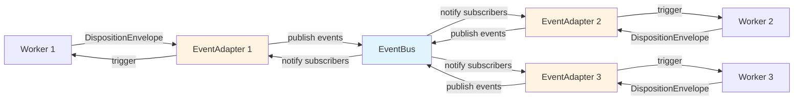
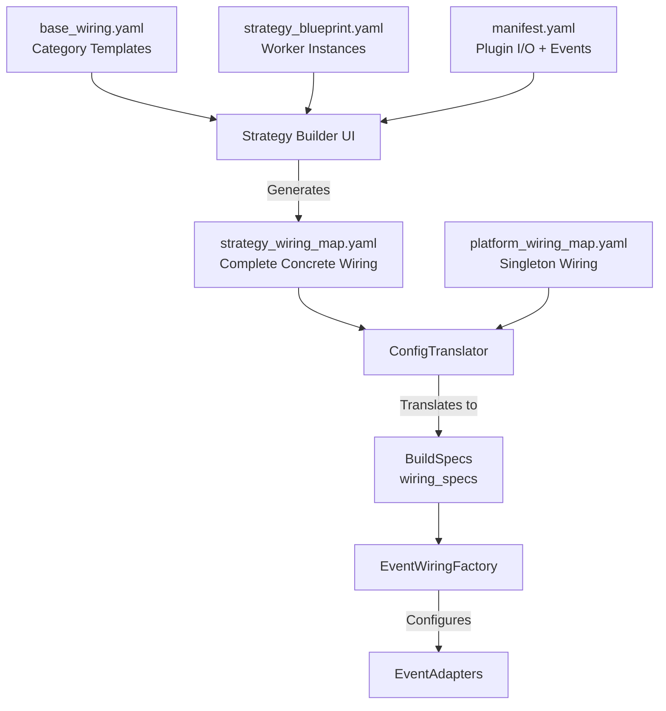
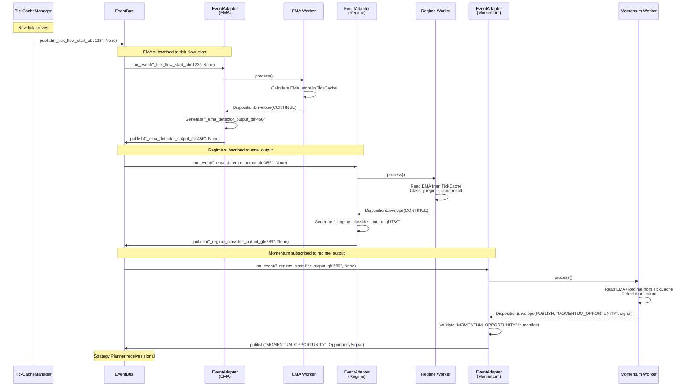

# EventAdapter Design - Worker-EventBus Bridge

**Status:** Design Approved  
**Implementation Phase:** Phase 2.1 (Assembly Layer)  
**Created:** 2025-10-30  
**Priority:** HIGH - Critical Path Component

---

## Overview

EventAdapter is the **glue component** between workers and EventBus, enabling event-driven worker orchestration without coupling workers to the EventBus infrastructure. Each worker/component gets its own EventAdapter instance (1-to-1 relationship).

### Core Principles

1. **Bus-Agnostic Workers**: Workers never import or depend on EventBus
2. **DispositionEnvelope Interpretation**: Adapter translates worker intent to bus actions
3. **Pre-Configured Wiring**: All event names pre-generated by UI and embedded in BuildSpecs
4. **Pure Execution**: EventAdapter executes pre-determined wiring, never generates event names

---

## Architecture Context

### Platgeslagen Orkestratie (Flattened Orchestration)

V3 removes V2's Operator layer and uses direct event-driven wiring:



**Key Relationships:**
- EventAdapter ↔ Worker: 1-to-1 (each worker has dedicated adapter)
- EventAdapter ↔ EventBus: N-to-1 (all adapters share platform singleton)
- EventBus ↔ EventAdapter: N-to-N (pub/sub pattern)

---

## Responsibilities

### 1. Event Subscription Management

Subscribe to events specified in wiring configuration:

```python
# EventAdapter subscribes to events on behalf of worker
subscriptions = [
    "_tick_flow_start_abc123",      # System event from TickCacheManager
    "_ema_detector_output_def456",  # System event from previous worker
    "EMERGENCY_HALT"                # Custom event from threat worker
]

for event_name in subscriptions:
    subscription_id = event_bus.subscribe(
        event_name=event_name,
        handler=self._on_event_received,
        scope="STRATEGY",
        strategy_id=strategy_id
    )
```

### 2. Worker Invocation

Trigger worker when subscribed event is published:

```python
def _on_event_received(self, event_name: str, payload: BaseModel | None) -> None:
    """Handle event notification from EventBus."""
    # 1. Map event to handler method (from wiring config)
    handler_method = self._handler_mapping[event_name]  # e.g., "process"
    
    # 2. Invoke worker method
    method = getattr(self._worker, handler_method)
    envelope = method(payload)  # Returns DispositionEnvelope
    
    # 3. Interpret disposition
    self._handle_disposition(envelope, event_name)
```

### 3. DispositionEnvelope Interpretation

Process worker's return value and execute appropriate action:

```python
def _handle_disposition(
    self, 
    envelope: DispositionEnvelope, 
    triggering_event: str
) -> None:
    """Execute action based on worker's disposition."""
    
    if envelope.disposition == Disposition.CONTINUE:
        # Publish pre-configured system event for flow continuation
        system_event_name = self._system_event_publications.get("CONTINUE")
        if not system_event_name:
            raise ValueError(
                f"No system event configured for CONTINUE disposition "
                f"in component '{self._component_id}'"
            )
        
        self._event_bus.publish(
            event_name=system_event_name,
            payload=None,  # Data in TickCache, not event payload
            scope="STRATEGY",
            strategy_id=self._strategy_id
        )
    
    elif envelope.disposition == Disposition.PUBLISH:
        # Publish custom event with optional payload
        self._validate_custom_event(envelope.event_name)
        self._event_bus.publish(
            event_name=envelope.event_name,
            payload=envelope.event_payload,
            scope="STRATEGY",
            strategy_id=self._strategy_id
        )
    
    elif envelope.disposition == Disposition.STOP:
        # Publish pre-configured flow-stop event for cleanup
        stop_event_name = self._system_event_publications.get("STOP")
        if not stop_event_name:
            raise ValueError(
                f"No system event configured for STOP disposition "
                f"in component '{self._component_id}'"
            )
        
        self._event_bus.publish(
            event_name=stop_event_name,
            payload=None,
            scope="STRATEGY",
            strategy_id=self._strategy_id
        )
```

### 4. Custom Event Validation

Validate custom events against manifest declarations:

```python
def _validate_custom_event(self, event_name: str) -> None:
    """Validate worker is allowed to publish this custom event.
    
    Custom events MUST be declared in worker's manifest.yaml.
    
    Raises:
        ValueError: If event_name not in manifest's publishes list
    """
    if event_name not in self._allowed_publications:
        raise ValueError(
            f"Worker '{self._component_id}' attempted to publish "
            f"undeclared event '{event_name}'. "
            f"Allowed events: {self._allowed_publications}"
        )
```

---

## Wiring Map Lifecycle

EventAdapter receives **pre-configured event names** from BuildSpecs. Understanding the complete lifecycle is critical:

### Configuration Flow



### Phase 1: base_wiring.yaml (Template)

**Purpose:** Reusable template defining standard flow between **worker categories**

**Example:**
```yaml
base_wiring_id: "standard_trading_flow_v1"
wiring_rules:
  - wiring_id: "ctx_to_opp"
    source: 
      component_id: "ContextWorker"      # Category, not instance
      event_name: "ContextOutput"        # Logical event
      event_type: "SystemEvent"
    target:
      component_id: "OpportunityWorker"
      handler_method: "process"          # Default handler
```

**Key Characteristics:**
- Uses **category names** (ContextWorker, OpportunityWorker)
- Defines **logical transitions**
- Never used directly at runtime
- Input for UI Strategy Builder

### Phase 2: UI Strategy Builder (Generator)

**Responsibility:** Generate complete, concrete `strategy_wiring_map.yaml`

**Intelligence:**

**Serial Positioning:**
```
User drags: [EMA_Fast] → [EMA_Slow] in ContextWorker slot

UI Generates:
- ContextReady → ema_fast_instance_1
- ema_fast_OUTPUT → ema_slow_instance_1  # UI-generated event name
- ema_slow_OUTPUT → OpportunityWorker
```

**Parallel Positioning:**
```
User drags: [EMA_Fast] ∥ [EMA_Slow] in ContextWorker slot

UI Generates:
- ContextReady → ema_fast_instance_1
- ContextReady → ema_slow_instance_1    # Fan-out
- ema_fast_OUTPUT → OpportunityWorker
- ema_slow_OUTPUT → OpportunityWorker
```

**Custom Event Wiring:**
```
Plugin manifest.yaml has:
publishes: ["EMERGENCY_HALT"]

Another plugin has:
listens_to: ["EMERGENCY_HALT"]
invokes: { method: "on_emergency_halt" }

UI auto-generates wiring rule:
- source: emergency_monitor_instance_1, event: EMERGENCY_HALT
- target: position_closer_instance_1, handler: on_emergency_halt
```

### Phase 3: strategy_wiring_map.yaml (Concrete Wiring)

**Purpose:** Complete, explicit wiring for **specific worker instances**

**Example:**
```yaml
strategy_wiring_id: "btc_momentum_strategy_wiring"
strategy_ref: "btc_momentum_long"

wiring_rules:
  # Tick flow start → First context worker
  - wiring_id: "tick_to_ema_fast"
    source:
      component_id: "tick_cache_manager"
      event_name: "_TICK_FLOW_START"        # Platform event
      event_type: "SystemEvent"
    target:
      component_id: "ema_fast_instance_1"   # Concrete instance
      handler_method: "process"
  
  # Sequential flow (UI-generated event name)
  - wiring_id: "ema_fast_to_ema_slow"
    source:
      component_id: "ema_fast_instance_1"
      event_name: "_ema_fast_OUTPUT_2025_10_30_14_23_45_abc"  # UI-generated
      event_type: "SystemEvent"
    target:
      component_id: "ema_slow_instance_1"
      handler_method: "process"
  
  # Custom event (from manifest)
  - wiring_id: "emergency_to_closer"
    source:
      component_id: "emergency_monitor_instance_1"
      event_name: "EMERGENCY_HALT"           # CustomEvent from manifest
      event_type: "CustomEvent"
    target:
      component_id: "position_closer_instance_1"
      handler_method: "on_emergency_halt"    # From manifest.invokes
```

**Key Characteristics:**
- Uses **instance IDs** (ema_fast_instance_1)
- Contains **concrete event names** (UI-generated)
- Includes **SystemEvents and CustomEvents**
- Maps events to **specific handler methods**

### Phase 4: ConfigTranslator (Bridge to BuildSpecs)

**Input:**
- `strategy_wiring_map.yaml` (UI-generated)
- `platform_wiring_map.yaml` (static)

**Process:**
1. Parse wiring maps into BuildSpec format
2. Validate all referenced components exist
3. Validate all event names are consistent
4. **NO event name generation** - all names from config

**Output:** `BuildSpecs` with embedded `wiring_specs`

### Phase 5: EventWiringFactory (Builder)

**Input:** `BuildSpecs.wiring_specs` (machine-readable)

**Process:**
```python
def create_adapters(
    strategy_id: str,
    workers: Dict[str, IWorker],
    wiring_spec: WiringSpec  # From BuildSpecs
) -> Dict[str, EventAdapter]:
    """
    Create EventAdapters from pre-validated wiring_spec.
    
    NO event generation - all names pre-configured.
    """
    adapters = {}
    
    # Build subscription map from wiring_spec
    subscription_map = self._build_subscription_map(wiring_spec)
    
    # Create adapters
    for component_id, worker in workers.items():
        adapter = EventAdapter(
            component_id=component_id,
            worker=worker,
            event_bus=self._event_bus,
            strategy_id=strategy_id,
            subscriptions=subscription_map[component_id],
            handler_mapping=self._build_handler_mapping(...),
            allowed_publications=self._build_publications(...),
            system_event_publications=self._build_system_publications(...)  # NEW
        )
        adapters[component_id] = adapter
    
    return adapters
```

**Output:** Configured EventAdapter instances

### Phase 6: EventAdapter (Executor)

**Responsibilities:**
1. ✅ Subscribe to events (event names from `subscriptions`)
2. ✅ Invoke worker methods (method names from `handler_mapping`)
3. ✅ Interpret DispositionEnvelope
4. ✅ Publish events **using pre-configured event names**
5. ❌ ~~Generate event names~~ (REMOVED)

---

## Class Design

### EventAdapter

**Location:** `backend/assembly/event_adapter.py`

```python
from typing import Dict, Set, Callable, Any
from pydantic import BaseModel

from backend.core.interfaces.eventbus import IEventBus
from backend.core.interfaces.worker import IWorker
from backend.core.enums import Disposition
from backend.dtos.shared.disposition_envelope import DispositionEnvelope


class EventAdapter:
    """
    Bridge between worker and EventBus.
    
    Enables event-driven worker orchestration while keeping workers
    bus-agnostic. Each worker gets its own adapter instance.
    
    Responsibilities:
        - Subscribe to events on behalf of worker
        - Invoke worker when events are received
        - Interpret DispositionEnvelope and execute actions
        - Publish pre-configured system events for flow tracking
        - Validate custom event publications
    
    Architecture:
        Worker ←→ EventAdapter (1-to-1)
        EventAdapter ←→ EventBus (N-to-1)
        EventBus ←→ EventAdapter (N-to-N pub/sub)
    
    Event Name Lifecycle:
        All event names are PRE-CONFIGURED by UI and embedded in BuildSpecs.
        EventAdapter NEVER generates event names at runtime.
    """
    
    def __init__(
        self,
        component_id: str,
        worker: IWorker,
        event_bus: IEventBus,
        strategy_id: str,
        subscriptions: list[str],
        handler_mapping: Dict[str, str],
        allowed_publications: Set[str],
        system_event_publications: Dict[str, str]
    ):
        """
        Initialize EventAdapter.
        
        All event names are PRE-CONFIGURED from BuildSpecs.
        No runtime event generation occurs.
        
        Args:
            component_id: Unique identifier for this worker instance
                (e.g., "ema_detector_instance_1")
            worker: Worker instance to adapt
            event_bus: Platform EventBus singleton
            strategy_id: Strategy this worker belongs to
            subscriptions: Event names to subscribe to (pre-configured by UI)
                (e.g., ["_tick_flow_start_abc", "_ema_output_def"])
            handler_mapping: Maps event_name → worker method name
                (e.g., {"_tick_flow_start_abc": "process"})
            allowed_publications: Custom events worker may publish
                (from manifest publishes list)
            system_event_publications: Pre-configured system event names per disposition
                (e.g., {"CONTINUE": "_ema_fast_OUTPUT_abc", "STOP": "_flow_STOP_xyz"})
        """
        self._component_id = component_id
        self._worker = worker
        self._event_bus = event_bus
        self._strategy_id = strategy_id
        self._subscriptions = subscriptions
        self._handler_mapping = handler_mapping
        self._allowed_publications = allowed_publications
        self._system_event_publications = system_event_publications
        
        # Track subscription IDs for cleanup
        self._subscription_ids: list[str] = []
        
        # Subscribe to all configured events
        self._subscribe_to_events()
    
    def _subscribe_to_events(self) -> None:
        """Subscribe to all events in subscriptions list."""
        for event_name in self._subscriptions:
            subscription_id = self._event_bus.subscribe(
                event_name=event_name,
                handler=self._on_event_received,
                scope="STRATEGY",
                strategy_id=self._strategy_id
            )
            self._subscription_ids.append(subscription_id)
    
    def _on_event_received(
        self, 
        event_name: str, 
        payload: BaseModel | None
    ) -> None:
        """
        Handle event notification from EventBus.
        
        Called by EventBus when a subscribed event is published.
        
        Args:
            event_name: Name of the published event
            payload: Optional event payload (System DTO or None)
        """
        # Map event to worker handler method
        handler_method_name = self._handler_mapping.get(event_name)
        
        if not handler_method_name:
            # Should never happen (only subscribed to mapped events)
            raise ValueError(
                f"No handler mapping for event '{event_name}' "
                f"in component '{self._component_id}'"
            )
        
        # Invoke worker method
        handler_method = getattr(self._worker, handler_method_name)
        envelope = handler_method(payload) if payload else handler_method()
        
        # Validate return type
        if not isinstance(envelope, DispositionEnvelope):
            raise TypeError(
                f"Worker method '{handler_method_name}' must return "
                f"DispositionEnvelope, got {type(envelope)}"
            )
        
        # Execute disposition
        self._handle_disposition(envelope, event_name)
    
    def _handle_disposition(
        self, 
        envelope: DispositionEnvelope,
        triggering_event: str
    ) -> None:
        """
        Execute action based on worker's disposition.
        
        Args:
            envelope: Worker's output envelope
            triggering_event: Event that triggered this worker
        """
        if envelope.disposition == Disposition.CONTINUE:
            self._handle_continue_disposition()
        
        elif envelope.disposition == Disposition.PUBLISH:
            self._handle_publish_disposition(envelope)
        
        elif envelope.disposition == Disposition.STOP:
            self._handle_stop_disposition()
        
        else:
            # Should never happen (Enum type validated by Pydantic)
            raise ValueError(f"Unknown disposition: {envelope.disposition}")
    
    def _handle_continue_disposition(self) -> None:
        """
        Handle CONTINUE disposition.
        
        Publishes pre-configured system event to trigger next worker(s) in chain.
        Data passed via TickCache, not event payload.
        """
        system_event_name = self._system_event_publications.get("CONTINUE")
        
        if not system_event_name:
            raise ValueError(
                f"No system event configured for CONTINUE disposition "
                f"in component '{self._component_id}'"
            )
        
        self._event_bus.publish(
            event_name=system_event_name,
            payload=None,  # Data in TickCache
            scope="STRATEGY",
            strategy_id=self._strategy_id
        )
    
    def _handle_publish_disposition(
        self, 
        envelope: DispositionEnvelope
    ) -> None:
        """
        Handle PUBLISH disposition.
        
        Validates custom event is allowed, then publishes with payload.
        
        Args:
            envelope: Envelope with event_name and optional event_payload
        
        Raises:
            ValueError: If event_name not in allowed_publications
        """
        # Validate event is declared in manifest
        self._validate_custom_event(envelope.event_name)
        
        # Publish custom event
        self._event_bus.publish(
            event_name=envelope.event_name,
            payload=envelope.event_payload,
            scope="STRATEGY",
            strategy_id=self._strategy_id
        )
    
    def _handle_stop_disposition(self) -> None:
        """
        Handle STOP disposition.
        
        Publishes pre-configured flow-stop event to trigger cleanup.
        FlowTerminator component handles TickCache cleanup.
        """
        stop_event_name = self._system_event_publications.get("STOP")
        
        if not stop_event_name:
            raise ValueError(
                f"No system event configured for STOP disposition "
                f"in component '{self._component_id}'"
            )
        
        self._event_bus.publish(
            event_name=stop_event_name,
            payload=None,
            scope="STRATEGY",
            strategy_id=self._strategy_id
        )
    
    def _validate_custom_event(self, event_name: str) -> None:
        """
        Validate worker is allowed to publish this custom event.
        
        Custom events MUST be declared in worker's manifest.yaml publishes list.
        
        Args:
            event_name: Custom event name to validate
        
        Raises:
            ValueError: If event_name not in allowed_publications
        """
        if event_name not in self._allowed_publications:
            raise ValueError(
                f"Worker '{self._component_id}' attempted to publish "
                f"undeclared event '{event_name}'. "
                f"Allowed events: {sorted(self._allowed_publications)}"
            )
    
    def shutdown(self) -> None:
        """
        Graceful shutdown and cleanup.
        
        Unsubscribes from all events. Called during strategy teardown.
        """
        for subscription_id in self._subscription_ids:
            try:
                self._event_bus.unsubscribe(subscription_id)
            except Exception:
                # Log error but continue cleanup
                pass
        
        self._subscription_ids.clear()
```

---

## EventWiringFactory Design

### Purpose

Creates EventAdapter instances from BuildSpecs during bootstrap.

**Location:** `backend/assembly/event_wiring_factory.py`

```python
from typing import Dict, List, Set
from backend.assembly.event_adapter import EventAdapter
from backend.core.interfaces.eventbus import IEventBus
from backend.core.interfaces.worker import IWorker


class EventWiringFactory:
    """
    Factory for creating and wiring EventAdapters.
    
    Consumes BuildSpecs (output of ConfigTranslator) and creates EventAdapter
    instances for each worker/component, subscribing them to EventBus.
    
    Key Design:
        - Input: BuildSpecs (NOT YAML configs)
        - All event names pre-configured (UI-generated)
        - Pure factory pattern (no validation, no generation)
    
    Responsibilities:
        - Parse BuildSpec wiring_specs
        - Create EventAdapter per worker
        - Wire adapters to EventBus
        - Return adapter registry for lifecycle management
    """
    
    def __init__(self, event_bus: IEventBus):
        """
        Initialize EventWiringFactory.
        
        Args:
            event_bus: Platform EventBus singleton
        """
        self._event_bus = event_bus
    
    def create_adapters(
        self,
        strategy_id: str,
        workers: Dict[str, IWorker],
        wiring_spec: WiringSpec  # BuildSpec, NOT YAML
    ) -> Dict[str, EventAdapter]:
        """
        Create EventAdapters for all workers in strategy.
        
        All event names are pre-configured in wiring_spec (UI-generated).
        Factory does NOT generate or validate event names.
        
        Args:
            strategy_id: Strategy identifier
            workers: Map of component_id → worker instance
            wiring_spec: WiringSpec from BuildSpecs (ConfigTranslator output)
        
        Returns:
            Map of component_id → EventAdapter instance
        
        Example:
            >>> workers = {
            ...     "ema_detector_instance_1": ema_worker,
            ...     "regime_classifier_instance_1": regime_worker
            ... }
            >>> wiring_spec = WiringSpec(
            ...     wiring_rules=[
            ...         WiringRule(
            ...             source=WiringSource(
            ...                 component_id="ema_detector_instance_1",
            ...                 event_name="_ema_detector_OUTPUT_abc123",  # UI-generated
            ...                 event_type="SystemEvent"
            ...             ),
            ...             target=WiringTarget(
            ...                 component_id="regime_classifier_instance_1",
            ...                 handler_method="process"
            ...             )
            ...         )
            ...     ]
            ... )
            >>> adapters = factory.create_adapters(
            ...     strategy_id="btc_momentum",
            ...     workers=workers,
            ...     wiring_spec=wiring_spec
            ... )
        """
        adapters = {}
        
        # Build subscription map per worker
        subscription_map = self._build_subscription_map(wiring_spec)
        
        # Build allowed publications per worker (from BuildSpecs)
        publications_map = self._build_publications_map(wiring_spec)
        
        # Build system event publications per worker (from BuildSpecs)
        system_publications_map = self._build_system_publications_map(wiring_spec)
        
        # Create adapter for each worker
        for component_id, worker in workers.items():
            adapter = EventAdapter(
                component_id=component_id,
                worker=worker,
                event_bus=self._event_bus,
                strategy_id=strategy_id,
                subscriptions=subscription_map.get(component_id, []),
                handler_mapping=self._build_handler_mapping(
                    component_id, 
                    wiring_spec
                ),
                allowed_publications=publications_map.get(component_id, set()),
                system_event_publications=system_publications_map.get(component_id, {})
            )
            
            adapters[component_id] = adapter
        
        return adapters
    
    def _build_subscription_map(
        self, 
        wiring_spec: WiringSpec
    ) -> Dict[str, List[str]]:
        """
        Build map of component_id → [event_names to subscribe to].
        
        Extracts target components from wiring rules.
        
        Args:
            wiring_spec: WiringSpec from BuildSpecs
        
        Returns:
            Map of component_id → list of event names
        
        Example:
            {
                "regime_classifier_instance_1": [
                    "_ema_detector_OUTPUT_abc123",  # Pre-configured by UI
                    "_TICK_FLOW_START"
                ]
            }
        """
        subscription_map = {}
        
        for rule in wiring_spec.wiring_rules:
            target_id = rule.target.component_id
            source_event = rule.source.event_name
            
            if target_id not in subscription_map:
                subscription_map[target_id] = []
            
            subscription_map[target_id].append(source_event)
        
        return subscription_map
    
    def _build_handler_mapping(
        self,
        component_id: str,
        wiring_spec: WiringSpec
    ) -> Dict[str, str]:
        """
        Build event_name → handler_method mapping for component.
        
        Args:
            component_id: Component to build mapping for
            wiring_spec: WiringSpec from BuildSpecs
        
        Returns:
            Map of event_name → handler_method_name
        
        Example:
            {
                "_ema_detector_OUTPUT_abc123": "process",
                "EMERGENCY_HALT": "on_emergency_halt"
            }
        """
        handler_mapping = {}
        
        for rule in wiring_spec.wiring_rules:
            if rule.target.component_id == component_id:
                event_name = rule.source.event_name
                handler_method = rule.target.handler_method
                handler_mapping[event_name] = handler_method
        
        return handler_mapping
    
    def _build_publications_map(
        self,
        wiring_spec: WiringSpec
    ) -> Dict[str, Set[str]]:
        """
        Build map of component_id → allowed custom events.
        
        Extracts custom event publications from BuildSpecs.
        
        Args:
            wiring_spec: WiringSpec from BuildSpecs
        
        Returns:
            Map of component_id → set of allowed event names
        
        Example:
            {
                "momentum_scout_instance_1": {
                    "MOMENTUM_OPPORTUNITY",
                    "MOMENTUM_LOST"
                }
            }
        """
        publications_map = {}
        
        for rule in wiring_spec.wiring_rules:
            if rule.source.event_type == "CustomEvent":
                component_id = rule.source.component_id
                event_name = rule.source.event_name
                
                if component_id not in publications_map:
                    publications_map[component_id] = set()
                
                publications_map[component_id].add(event_name)
        
        return publications_map
    
    def _build_system_publications_map(
        self,
        wiring_spec: WiringSpec
    ) -> Dict[str, Dict[str, str]]:
        """
        Build map of component_id → {disposition → event_name}.
        
        Extracts system event publications for CONTINUE/STOP dispositions.
        
        Args:
            wiring_spec: WiringSpec from BuildSpecs
        
        Returns:
            Map of component_id → {disposition → event_name}
        
        Example:
            {
                "ema_fast_instance_1": {
                    "CONTINUE": "_ema_fast_OUTPUT_abc123",
                    "STOP": "_btc_momentum_FLOW_STOP"
                }
            }
        """
        system_publications_map = {}
        
        for rule in wiring_spec.wiring_rules:
            if rule.source.event_type == "SystemEvent":
                component_id = rule.source.component_id
                event_name = rule.source.event_name
                
                if component_id not in system_publications_map:
                    system_publications_map[component_id] = {}
                
                # Infer disposition from event name pattern
                if "_OUTPUT_" in event_name or "output" in event_name.lower():
                    system_publications_map[component_id]["CONTINUE"] = event_name
                elif "_STOP" in event_name or "stop" in event_name.lower():
                    system_publications_map[component_id]["STOP"] = event_name
        
        return system_publications_map
```

---

## Configuration Format

### strategy_wiring_map.yaml Structure

Generated by UI based on worker positioning and manifest declarations:

```yaml
strategy_wiring_id: "btc_momentum_strategy_wiring"
strategy_ref: "btc_momentum_long"

wiring_rules:
  # Tick flow start → First context worker
  - wiring_id: "tick_to_ema"
    source:
      component_id: "tick_cache_manager"
      event_name: "_TICK_FLOW_START"
      event_type: "SystemEvent"
    target:
      component_id: "ema_detector_instance_1"
      handler_method: "process"
  
  # EMA → Regime (context chain)
  - wiring_id: "ema_to_regime"
    source:
      component_id: "ema_detector_instance_1"
      event_name: "_ema_detector_output_def456"  # UUID-based
      event_type: "SystemEvent"
    target:
      component_id: "regime_classifier_instance_1"
      handler_method: "process"
  
  # Opportunity signal → Strategy Planner
  - wiring_id: "momentum_to_planner"
    source:
      component_id: "momentum_scout_instance_1"
      event_name: "MOMENTUM_OPPORTUNITY"  # Custom event
      event_type: "CustomEvent"
    target:
      component_id: "momentum_planner_instance_1"
      handler_method: "on_opportunity"
  
  # Emergency halt (multi-subscriber example)
  - wiring_id: "threat_to_emergency_1"
    source:
      component_id: "drawdown_monitor_instance_1"
      event_name: "EMERGENCY_HALT"
      event_type: "CustomEvent"
    target:
      component_id: "emergency_executor_instance_1"
      handler_method: "on_emergency_halt"
  
  - wiring_id: "threat_to_emergency_2"
    source:
      component_id: "drawdown_monitor_instance_1"
      event_name: "EMERGENCY_HALT"
      event_type: "CustomEvent"
    target:
      component_id: "position_closer_instance_1"
      handler_method: "on_emergency_halt"
```

---

## Worker Integration Pattern

### Worker Implementation (Bus-Agnostic)

```python
# plugins/context_workers/ema_detector/worker.py
from backend.core.interfaces.worker import IWorker, IWorkerLifecycle
from backend.core.enums import Disposition
from backend.dtos.shared.disposition_envelope import DispositionEnvelope

class EMADetector(IWorker, IWorkerLifecycle):
    """EMA detection worker - completely bus-agnostic."""
    
    def __init__(self, manifest: PluginManifest, params: EMAParams):
        self._manifest = manifest
        self._params = params
        self._cache = None
    
    @property
    def name(self) -> str:
        return self._manifest.plugin_id
    
    def initialize(self, strategy_cache: IStrategyCache, **capabilities) -> None:
        """Two-phase initialization."""
        self._cache = strategy_cache
    
    def process(self) -> DispositionEnvelope:
        """
        Main processing method - called by EventAdapter.
        
        Worker is UNAWARE of:
        - EventBus existence
        - EventAdapter existence
        - Other workers in chain
        - Event names or wiring
        
        Worker only knows:
        - Read data from TickCache (via IStrategyCache)
        - Perform calculation
        - Store result in TickCache
        - Return CONTINUE disposition
        """
        # 1. Read tick data from TickCache
        tick = self._cache.get_current_tick()
        
        # 2. Calculate EMA
        ema_value = self._calculate_ema(tick.close, self._params.period)
        
        # 3. Store result in TickCache
        result_dto = EMAOutputDTO(ema_value=ema_value)
        self._cache.set_result_dto(self, result_dto)
        
        # 4. Return CONTINUE (EventAdapter handles flow routing)
        return DispositionEnvelope(disposition=Disposition.CONTINUE)
    
    def shutdown(self) -> None:
        """Cleanup."""
        pass
```

### EventAdapter Bridges Worker ↔ EventBus

```python
# EventAdapter receives event from EventBus
def _on_event_received(self, event_name: str, payload: BaseModel | None):
    # Call worker.process() (worker is bus-agnostic)
    envelope = self._worker.process()
    
    # Interpret disposition and publish pre-configured event
    if envelope.disposition == Disposition.CONTINUE:
        # Use pre-configured system event name (UI-generated)
        system_event = self._system_event_publications["CONTINUE"]
        self._event_bus.publish(system_event, None, "STRATEGY", self._strategy_id)
```

---

## Complete Flow Example

### Scenario: EMA → Regime → Momentum Chain

**Workers:**
1. `ema_detector_instance_1` - Calculates EMA
2. `regime_classifier_instance_1` - Classifies market regime
3. `momentum_scout_instance_1` - Detects momentum opportunities

**Sequence:**



**Key Points:**
- Workers are completely bus-agnostic
- EventAdapters handle all event plumbing
- System events auto-generated with UUIDs
- Custom events validated against manifest
- Data flows through TickCache, not event payloads

---

## Testing Strategy

### Unit Tests

**Test EventAdapter:**

```python
# tests/unit/assembly/test_event_adapter.py
import pytest
from unittest.mock import Mock, patch
from backend.assembly.event_adapter import EventAdapter
from backend.core.enums import Disposition
from backend.dtos.shared.disposition_envelope import DispositionEnvelope

def test_event_adapter_subscribes_on_init():
    """EventAdapter subscribes to all events on initialization."""
    mock_bus = Mock()
    mock_worker = Mock()
    
    adapter = EventAdapter(
        component_id="test_worker",
        worker=mock_worker,
        event_bus=mock_bus,
        strategy_id="test_strategy",
        subscriptions=["EVENT_A", "EVENT_B"],
        handler_mapping={"EVENT_A": "process", "EVENT_B": "process"},
        allowed_publications=set(),
        system_event_publications={}
    )
    
    assert mock_bus.subscribe.call_count == 2
    # Verify subscriptions
    calls = mock_bus.subscribe.call_args_list
    assert calls[0][1]["event_name"] == "EVENT_A"
    assert calls[1][1]["event_name"] == "EVENT_B"

def test_event_adapter_invokes_worker_on_event():
    """EventAdapter invokes worker method when event received."""
    mock_bus = Mock()
    mock_worker = Mock()
    mock_worker.process.return_value = DispositionEnvelope(disposition=Disposition.CONTINUE)
    
    adapter = EventAdapter(
        component_id="test_worker",
        worker=mock_worker,
        event_bus=mock_bus,
        strategy_id="test_strategy",
        subscriptions=["EVENT_A"],
        handler_mapping={"EVENT_A": "process"},
        allowed_publications=set(),
        system_event_publications={"CONTINUE": "_test_OUTPUT_abc"}
    )
    
    # Simulate event
    adapter._on_event_received("EVENT_A", None)
    
    # Verify worker called
    mock_worker.process.assert_called_once()

def test_event_adapter_publishes_system_event_on_continue():
    """EventAdapter publishes pre-configured system event for CONTINUE disposition."""
    mock_bus = Mock()
    mock_worker = Mock()
    mock_worker.process.return_value = DispositionEnvelope(disposition=Disposition.CONTINUE)
    
    adapter = EventAdapter(
        component_id="test_worker",
        worker=mock_worker,
        event_bus=mock_bus,
        strategy_id="test_strategy",
        subscriptions=["EVENT_A"],
        handler_mapping={"EVENT_A": "process"},
        allowed_publications=set(),
        system_event_publications={"CONTINUE": "_test_worker_OUTPUT_xyz123"}
    )
    
    # Simulate event
    adapter._on_event_received("EVENT_A", None)
    
    # Verify pre-configured system event published
    publish_calls = [c for c in mock_bus.publish.call_args_list]
    assert len(publish_calls) == 1
    assert publish_calls[0][1]["event_name"] == "_test_worker_OUTPUT_xyz123"

def test_event_adapter_validates_custom_events():
    """EventAdapter rejects undeclared custom events."""
    mock_bus = Mock()
    mock_worker = Mock()
    mock_worker.process.return_value = DispositionEnvelope(
        disposition=Disposition.PUBLISH,
        event_name="UNDECLARED_EVENT"
    )
    
    adapter = EventAdapter(
        component_id="test_worker",
        worker=mock_worker,
        event_bus=mock_bus,
        strategy_id="test_strategy",
        subscriptions=["EVENT_A"],
        handler_mapping={"EVENT_A": "process"},
        allowed_publications={"DECLARED_EVENT"},  # Not UNDECLARED_EVENT
        system_event_publications={}
    )
    
    # Should raise ValueError
    with pytest.raises(ValueError, match="undeclared event"):
        adapter._on_event_received("EVENT_A", None)

def test_event_adapter_publishes_custom_event_with_payload():
    """EventAdapter publishes custom event with payload."""
    mock_bus = Mock()
    mock_worker = Mock()
    mock_signal = Mock(spec=BaseModel)
    mock_worker.process.return_value = DispositionEnvelope(
        disposition=Disposition.PUBLISH,
        event_name="MOMENTUM_OPPORTUNITY",
        event_payload=mock_signal
    )
    
    adapter = EventAdapter(
        component_id="test_worker",
        worker=mock_worker,
        event_bus=mock_bus,
        strategy_id="test_strategy",
        subscriptions=["EVENT_A"],
        handler_mapping={"EVENT_A": "process"},
        allowed_publications={"MOMENTUM_OPPORTUNITY"},
        system_event_publications={}
    )
    
    adapter._on_event_received("EVENT_A", None)
    
    # Verify custom event published with payload
    publish_calls = [c for c in mock_bus.publish.call_args_list]
    assert any(
        c[1]["event_name"] == "MOMENTUM_OPPORTUNITY" and 
        c[1]["payload"] == mock_signal
        for c in publish_calls
    )

def test_event_adapter_cleanup_on_shutdown():
    """EventAdapter unsubscribes all events on shutdown."""
    mock_bus = Mock()
    mock_bus.subscribe.side_effect = ["sub_1", "sub_2"]
    mock_worker = Mock()
    
    adapter = EventAdapter(
        component_id="test_worker",
        worker=mock_worker,
        event_bus=mock_bus,
        strategy_id="test_strategy",
        subscriptions=["EVENT_A", "EVENT_B"],
        handler_mapping={"EVENT_A": "process", "EVENT_B": "process"},
        allowed_publications=set()
    )
    
    adapter.shutdown()
    
    # Verify unsubscribe called for all subscriptions
    assert mock_bus.unsubscribe.call_count == 2
    mock_bus.unsubscribe.assert_any_call("sub_1")
    mock_bus.unsubscribe.assert_any_call("sub_2")
```

**Test EventWiringFactory:**

```python
# tests/unit/assembly/test_event_wiring_factory.py
def test_event_wiring_factory_creates_adapters_for_all_workers():
    """Factory creates one adapter per worker."""
    mock_bus = Mock()
    factory = EventWiringFactory(mock_bus)
    
    workers = {
        "worker_1": Mock(spec=IWorker),
        "worker_2": Mock(spec=IWorker)
    }
    
    wiring_config = {
        "wiring_rules": [
            {
                "source": {"component_id": "tick_manager", "event_name": "TICK"},
                "target": {"component_id": "worker_1", "handler_method": "process"}
            }
        ]
    }
    
    adapters = factory.create_adapters("strategy_1", workers, wiring_config)
    
    assert len(adapters) == 2
    assert "worker_1" in adapters
    assert "worker_2" in adapters

def test_event_wiring_factory_builds_subscription_map():
    """Factory correctly maps events to target workers."""
    factory = EventWiringFactory(Mock())
    
    wiring_config = {
        "wiring_rules": [
            {
                "source": {"event_name": "EVENT_A"},
                "target": {"component_id": "worker_1"}
            },
            {
                "source": {"event_name": "EVENT_B"},
                "target": {"component_id": "worker_1"}
            },
            {
                "source": {"event_name": "EVENT_C"},
                "target": {"component_id": "worker_2"}
            }
        ]
    }
    
    subscription_map = factory._build_subscription_map(wiring_config)
    
    assert subscription_map["worker_1"] == ["EVENT_A", "EVENT_B"]
    assert subscription_map["worker_2"] == ["EVENT_C"]
```

### Integration Tests

**Test Full Flow:**

```python
# tests/integration/test_event_driven_flow.py
def test_ema_to_regime_flow():
    """Test complete EMA → Regime worker chain via EventAdapters."""
    # Setup
    event_bus = EventBus()
    ema_worker = EMADetector(manifest, params)
    regime_worker = RegimeClassifier(manifest, params)
    
    # Initialize workers
    strategy_cache = create_test_strategy_cache()
    ema_worker.initialize(strategy_cache)
    regime_worker.initialize(strategy_cache)
    
    # Create adapters
    factory = EventWiringFactory(event_bus)
    wiring_config = load_test_wiring_config("ema_to_regime.yaml")
    
    adapters = factory.create_adapters(
        strategy_id="test_strategy",
        workers={
            "ema_instance": ema_worker,
            "regime_instance": regime_worker
        },
        wiring_config=wiring_config
    )
    
    # Trigger flow
    event_bus.publish("_tick_flow_start", None, "STRATEGY", "test_strategy")
    
    # Verify chain executed
    assert strategy_cache.has_result("ema_instance")
    assert strategy_cache.has_result("regime_instance")
```

---

## Dependencies

### Imports

```python
# backend/assembly/event_adapter.py
from uuid import uuid4
from typing import Dict, Set, Callable
from pydantic import BaseModel

from backend.core.interfaces.eventbus import IEventBus
from backend.core.interfaces.worker import IWorker
from backend.dtos.shared.disposition_envelope import DispositionEnvelope
```

### Required Components

**Already Implemented:**
- ✅ EventBus (`backend/core/eventbus.py`)
- ✅ IEventBus protocol (`backend/core/interfaces/eventbus.py`)
- ✅ IWorker protocol (`backend/core/interfaces/worker.py`)
- ✅ DispositionEnvelope DTO (`backend/dtos/shared/disposition_envelope.py`)

**To Be Implemented:**
- ⏳ Workers (Phase 2+)
- ⏳ wiring_map.yaml parser (ConfigLoader)
- ⏳ PluginManifest with publishes field

---

## Open Questions

### 1. System Event Name Persistence

**Question:** Should system event names (UUID-based) be persisted across runs?

**Options:**
- **A. Generate new UUIDs each run**
  - Pros: Simple, no state management
  - Cons: Can't replay exact event sequence
  
- **B. Persist event names in wiring_map.yaml** ← **CURRENT DESIGN**
  - Pros: Deterministic event names, replay-friendly
  - Cons: UI must manage UUID generation

**Decision:** Option B - UI generates ALL event names, persisted in strategy_wiring_map.yaml

### 2. Handler Method Validation ✅ RESOLVED

**Question:** Should EventAdapter validate handler method exists at construction time?

**Resolution:** NO - EventAdapter does NOT validate. **ConfigValidator validates** (Phase 5).

**Rationale:**
```
ConfigValidator (Bootstrap)
    ↓ Validates handler methods exist on worker class
    ↓ Validates event names consistent
    ↓ Fail-fast during bootstrap
BuildSpecs (pre-validated)
    ↓
EventWiringFactory (trusts BuildSpecs)
    ↓
EventAdapter (pure execution, NO validation)
```

**EventAdapter assumes BuildSpecs are valid** - separation of concerns.

### 3. Multi-Handler Support ✅ KEEP FLEXIBLE

**Question:** Should workers support multiple handler methods, or just `process()`?

**Current Design:** Flexible mapping (event → any method name)

**Example:**
```python
handler_mapping = {
    "_tick_flow_start": "process",
    "EMERGENCY_HALT": "on_emergency_halt",
    "MOMENTUM_OPPORTUNITY": "on_opportunity"
}
```

**Recommendation:** Keep flexible (supports future StrategyPlanner with multiple handlers).

---

## Implementation Checklist

### EventAdapter Class
- [ ] Implement `EventAdapter` class
  - [ ] `__init__` with subscription setup
  - [ ] `_on_event_received` event handler
  - [ ] `_handle_disposition` dispatcher
  - [ ] `_handle_continue_disposition`
  - [ ] `_handle_publish_disposition`
  - [ ] `_handle_stop_disposition`
  - [ ] `_validate_custom_event`
  - [ ] `shutdown` cleanup

**Note:** EventAdapter does NOT validate handler methods - ConfigValidator does this during bootstrap.

### EventWiringFactory (Phase 5 - After BuildSpecs)
- [ ] Implement `EventWiringFactory`
  - [ ] `create_adapters` main factory method
  - [ ] `_build_subscription_map`
  - [ ] `_build_handler_mapping`
  - [ ] `_build_publications_map`
  - [ ] `_build_system_publications_map`

**Blocker:** Requires BuildSpecs (output of ConfigTranslator) - implement in Phase 5.

- [ ] Unit Tests (EventAdapter)
  - [ ] Subscription on init
  - [ ] Worker invocation
  - [ ] CONTINUE disposition
  - [ ] PUBLISH disposition (valid)
  - [ ] PUBLISH disposition (invalid event)
  - [ ] STOP disposition
  - [ ] Shutdown cleanup

- [ ] Unit Tests (EventWiringFactory)
  - [ ] Adapter creation
  - [ ] Subscription map building
  - [ ] Handler mapping building
  - [ ] Publications map building

- [ ] Integration Tests
  - [ ] Full worker chain flow
  - [ ] Custom event publication
  - [ ] Multi-subscriber events

- [ ] Documentation
  - [ ] Docstrings
  - [ ] Architecture docs update
  - [ ] Usage examples

---

## Related Documentation

- **EventBus Implementation:** [../development/#Archief/EVENTBUS_DESIGN.md](../development/#Archief/EVENTBUS_DESIGN.md)
- **IWorkerLifecycle:** [../development/#Archief/IWORKERLIFECYCLE_DESIGN.md](../development/#Archief/IWORKERLIFECYCLE_DESIGN.md)
- **DispositionEnvelope:** [backend/dtos/shared/disposition_envelope.py](../../backend/dtos/shared/disposition_envelope.py)
- **Event-Driven Wiring:** [../architecture/EVENT_DRIVEN_WIRING.md](../architecture/EVENT_DRIVEN_WIRING.md)
- **Data Flow:** [../architecture/DATA_FLOW.md](../architecture/DATA_FLOW.md)
- **Platform Components:** [../architecture/PLATFORM_COMPONENTS.md](../architecture/PLATFORM_COMPONENTS.md)

---

**End of Design Document**
