```mermaid
sequenceDiagram
    participant USER as User (UI)
    participant OS as OperationService
    participant Q as Event Queue
    participant EB as EventBus
    participant UAM as UserActionManager
    participant SP as EmergencyStopPlanner
    participant LDG as StrategyLedger
    
    Note over EB: Flow bezig - TICK processing
    
    USER->>OS: STOP ALL button pressed
    OS->>Q: queue.put(USER_ACTION, CRITICAL)
    
    Note over Q: Event gebufferd<br/>(high priority)
    
    Note over EB: Current flow completes
    
    OS->>Q: queue.get() → USER_ACTION (CRITICAL jumps queue!)
    OS->>EB: EXTERNAL_EVENT_RECEIVED<br/>payload: {type: USER_ACTION, data: {...}}
    
    EB->>UAM: EXTERNAL_EVENT_RECEIVED<br/>(UAM filters on event_type)
    UAM->>UAM: Accepts: event.type == USER_ACTION
    UAM->>EB: USER_ACTION_FLOW_START
    
    EB->>SP: USER_ACTION_FLOW_START
    SP->>LDG: get_open_positions()
    SP->>LDG: get_open_orders()
    
    Note over SP: Strategy DECIDES:<br/>Cancel all orders<br/>Close all positions
    
    SP->>EB: STRATEGY_DIRECTIVE_BATCH_ISSUED
    
    Note over EB: Execute batch...<br/>(Cancel + Close)
```

# Event Lifecycle Architecture - S1mpleTraderV3

**Status:** Definitief - Architectureel Fundament  
**Versie:** 1.0  
**Laatst Bijgewerkt:** 2025-10-30

---

## Executive Summary

Dit document beschrijft de **complete event lifecycle** van S1mpleTraderV3 - van external event ontvangst tot flow completion. Het legt de fundamenten voor:

1. **OperationService** - Event queue + flow state machine
2. **BaseFlowInitiator** - Template pattern voor flow starters
3. **BaseConfidencePlanner** - Template pattern voor planning workers
4. **Scheduler Integration** - Timer service binnen OperationService
5. **User Actions** - HIGH priority events (geen interrupts!)

**Kernprincipes:**
- **Alles is IWorker** - Platform + Strategy components implementeren IWorker Protocol
- **Event Queue** - FIFO processing met priority support
- **No Interrupts** - User actions zijn events, geen flow killers
- **Template Methods** - Herbruikbare patterns via abstract base classes
- **Config-Driven** - Filtering logica in config, niet in code

---

## 🔄 Event Lifecycle Overview


---

## 1. OperationService - Event Lifecycle Manager

**Verantwoordelijkheden:**
1. **Event Queueing** - Buffer external events (FIFO + priority)
2. **Flow State Management** - IDLE/PROCESSING/DRAINING state machine
3. **Scheduler Orchestration** - Integrate timer service
4. **Flow Initiator Registry** - Delegate event routing

### 1.1 Priority Queue

```python
from asyncio import PriorityQueue
from dataclasses import dataclass
from enum import IntEnum

class EventPriority(IntEnum):
    """Priority levels voor event queue."""
    CRITICAL = 0  # User STOP actions
    HIGH = 1      # Threat signals, risk events
    NORMAL = 2    # Market ticks, opportunities
    LOW = 3       # Scheduled tasks, housekeeping

@dataclass
class ExternalEvent:
    """
    Generic external event wrapper.
    
    OperationService publiceert ÉÉN generiek event (EXTERNAL_EVENT_RECEIVED).
    Flow initiators filteren op event_type in payload!
    """
    event_type: str          # Discriminator: "TICK", "NEWS", "SCHEDULED_TASK", "USER_ACTION"
    event_data: Any          # Type-specific payload (MarketTick, NewsEvent, etc.)
    priority: EventPriority
    timestamp: datetime

@dataclass
class PriorityEvent:
    """Internal event wrapper voor priority queue."""
    event_type: str          # "TICK", "NEWS", "SCHEDULED_TASK", "USER_ACTION"
    event_data: Any          # Payload (connector-specific)
    priority: EventPriority
    timestamp: datetime
```

**Queue Behavior:**
- **FIFO per priority level** - Events met zelfde priority in volgorde
- **Priority override** - HIGH events springen voor NORMAL
- **Backpressure** - Als flow bezig is, buffer event (geen blocking)

**Event Routing Principe:**
- OperationService publiceert: `EXTERNAL_EVENT_RECEIVED` met `ExternalEvent` payload
- ALLE flow initiators luisteren naar: `EXTERNAL_EVENT_RECEIVED`
- Filtering in handler: `if event.payload.event_type == self.get_event_type()`
- **EventBus doet broadcast**, **workers doen filtering**

### 1.2 Flow State Machine

```python
class FlowState(str, Enum):
    """Flow processing states."""
    IDLE = "IDLE"              # Klaar voor nieuwe flow
    PROCESSING = "PROCESSING"  # Flow in uitvoering
    DRAINING = "DRAINING"      # Shutdown - verwerk queue leeg

class OperationService:
    """
    Platform singleton - event lifecycle manager.
    
    Implements IWorker (via structural typing) - heeft ook EventAdapter!
    
    Verantwoordelijkheden:
    1. External event queue (priority-based buffering)
    2. Flow state machine (prevent overlapping flows)
    3. Scheduler integration (timer → event queue)
    4. Flow initiator registry (delegate event routing)
    5. FLOW_COMPLETE handling (cirkel sluiten!)
    """
    def __init__(
        self,
        event_bus: EventBus,
        scheduler: Scheduler,
        flow_initiators: dict[str, BaseFlowInitiator]
    ):
        self.event_bus = event_bus
        self.scheduler = scheduler
        self.flow_initiators = flow_initiators
        
        self.event_queue: PriorityQueue = PriorityQueue()
        self.flow_state: FlowState = FlowState.IDLE
        self.current_flow_id: Optional[str] = None
        self._capabilities: Optional[WorkerCapabilities] = None
    
    # === IWorker contract ===
    def get_worker_id(self) -> str:
        return "operation_service"
    
    def get_worker_type(self) -> str:
        return "PLATFORM_LIFECYCLE_MANAGER"
    
    def initialize(self, capabilities: WorkerCapabilities) -> None:
        """Platform injects capabilities during bootstrap."""
        self._capabilities = capabilities
    
    def cleanup(self) -> None:
        """Cleanup on shutdown - drain queue."""
        self.flow_state = FlowState.DRAINING
        # Process remaining events in queue
        while not self.event_queue.empty():
            self.event_queue.get_nowait()
    
    async def start(self):
        """Start event processing loops."""
        await asyncio.gather(
            self._process_event_queue(),
            self._process_scheduled_tasks()
        )
    
    async def _process_scheduled_tasks(self):
        """
        Monitor scheduler, queue scheduled tasks als events.
        
        Scheduler is GEEN externe trigger, maar interne timer service.
        """
        while True:
            # Check due tasks
            scheduled_tasks = await self.scheduler.get_due_tasks()
            
            for task in scheduled_tasks:
                # Scheduled task → event in queue
                await self.event_queue.put((
                    EventPriority.NORMAL,
                    PriorityEvent(
                        event_type="SCHEDULED_TASK",
                        event_data=task,
                        priority=EventPriority.NORMAL,
                        timestamp=datetime.now(UTC)
                    )
                ))
            
            await asyncio.sleep(1)  # Poll interval
    
    # === EventAdapter handler (FLOW_COMPLETE - sluit cirkel!) ===
    def on_flow_complete(self, event: Event) -> DispositionEnvelope:
        """
        Event handler voor FLOW_COMPLETE (van FlowTerminator).
        
        Via EventAdapter wired - sluit de event cirkel!
        """
        if event.flow_id != self.current_flow_id:
            logger.warning(f"FLOW_COMPLETE voor verkeerde flow: {event.flow_id}")
            return DispositionEnvelope(disposition=Disposition.STOP)
        
        logger.info(f"Flow {event.flow_id} voltooid")
        
        # Flow state wordt IDLE in _process_event_queue finally block
        # Dit is puur voor logging/metrics
        
        return DispositionEnvelope(
            disposition=Disposition.STOP,
            metadata={"flow_id": event.flow_id, "status": "completed"}
        )
    
    async def _process_event_queue(self):
        """
        Process queue SEQUENTIEEL - prevent overlapping flows.
        
        Flow:
        1. Get next event (blocking)
        2. Check flow state (IDLE required)
        3. Publish GENERIC external event (EXTERNAL_EVENT_RECEIVED)
        4. Wait for FLOW_COMPLETE (via EventAdapter!)
        5. Return to IDLE
        
        CRITICAL: OperationService publiceert ÉÉN generiek event met payload!
        Flow initiators filteren zelf op event_type in payload.
        """
        while True:
            # Get next event (blocks if queue empty)
            priority, event = await self.event_queue.get()
            
            # Flow state check - prevent overlapping flows
            if self.flow_state != FlowState.IDLE:
                # Flow nog bezig - requeue event
                await self.event_queue.put((priority, event))
                await asyncio.sleep(0.1)  # Backpressure
                continue
            
            # Start flow
            self.flow_state = FlowState.PROCESSING
            self.current_flow_id = generate_id()
            
            try:
                # Publish GENERIC external event
                # ALLE flow initiators luisteren naar dit event!
                # Filtering gebeurt in BaseFlowInitiator.on_external_event()
                self.event_bus.publish(Event(
                    name="EXTERNAL_EVENT_RECEIVED",  # ONE generic event!
                    payload=ExternalEvent(
                        event_type=event.event_type,  # Discriminator: "TICK", "NEWS", etc
                        event_data=event.event_data,
                        priority=event.priority,
                        timestamp=event.timestamp
                    ),
                    flow_id=self.current_flow_id
                ))
                
                # Wait for FLOW_COMPLETE (blocking!)
                await self.wait_for_flow_completion()
                
            finally:
                # Return to IDLE (altijd, ook bij errors)
                self.flow_state = FlowState.IDLE
                self.current_flow_id = None
    
    async def wait_for_flow_completion(self):
        """
        Wait voor FlowTerminator FLOW_COMPLETE event.
        
        Blocking until flow completes.
        OperationService heeft EventAdapter die on_flow_complete() triggert!
        """
        future = asyncio.Future()
        
        def on_complete(event: Event):
            if event.flow_id == self.current_flow_id:
                future.set_result(event)
        
        # Subscribe to FLOW_COMPLETE (one-time)
        self.event_bus.subscribe("FLOW_COMPLETE", on_complete)
        await future
    
    # === External Event Entry Points ===
    async def on_external_tick(self, tick: MarketTick):
        """External tick from WebSocket/API."""
        await self.event_queue.put((
            EventPriority.NORMAL,
            PriorityEvent(
                event_type="TICK",
                event_data=tick,
                priority=EventPriority.NORMAL,
                timestamp=datetime.now(UTC)
            )
        ))
    
    async def on_external_news(self, news: NewsEvent):
        """External news event."""
        await self.event_queue.put((
            EventPriority.HIGH,
            PriorityEvent(
                event_type="NEWS",
                event_data=news,
                priority=EventPriority.HIGH,
                timestamp=datetime.now(UTC)
            )
        ))
    
    async def on_user_action(self, action: UserAction):
        """
        User action (STOP button, manual trade, etc).
        
        GEEN interrupt - gewoon HIGH priority event!
        Strategy beslist WAT er gebeurt (cancel, close, ignore).
        """
        await self.event_queue.put((
            EventPriority.CRITICAL if action.action_type == "STOP_ALL" else EventPriority.HIGH,
            PriorityEvent(
                event_type="USER_ACTION",
                event_data=action,
                priority=EventPriority.CRITICAL,
                timestamp=datetime.now(UTC)
            )
        ))
```

**Kernprincipes:**
- ✅ **GEEN interrupts** - User actions zijn events, geen flow killers
- ✅ **FIFO processing** - Events binnen priority level in volgorde
- ✅ **Backpressure** - Als flow bezig is, buffer event (geen data loss)
- ✅ **State machine** - Voorkomt overlapping flows (data race conditions)

---

## 2. BaseFlowInitiator - Template Pattern

**Probleem:** OperationService moet verschillende event types onderscheiden (TICK, NEWS, SCHEDULED_TASK, USER_ACTION).

**Oplossing:** Abstract base class met **template method pattern** voor type-based routing.

### 2.1 Abstract Base Class

```python
from abc import ABC, abstractmethod
from typing import Generic, TypeVar

TEventData = TypeVar('TEventData')

class BaseFlowInitiator(ABC, Generic[TEventData]):
    """
    Abstract base voor flow initiators.
    
    Verantwoordelijkheden:
    1. Event type registration (welk event luistert deze initiator?)
    2. Flow type identification (welk soort flow start dit?)
    3. Payload transformation (external → internal DTO)
    4. Filtering logica (moet deze event een flow starten?)
    
    Template Method pattern:
    - on_external_event() orchestreert flow (FINAL - niet override!)
    - Subclasses implementeren ALLEEN abstracte methods
    """
    
    def __init__(self, worker_id: str):
        self._worker_id = worker_id
        self._capabilities: Optional[WorkerCapabilities] = None
    
    # === IWorker contract ===
    def get_worker_id(self) -> str:
        return self._worker_id
    
    def get_worker_type(self) -> str:
        return "PLATFORM_FLOW_INITIATOR"
    
    def initialize(self, capabilities: WorkerCapabilities) -> None:
        self._capabilities = capabilities
    
    def cleanup(self) -> None:
        pass
    
    # === Flow Initiator contract (abstract methods) ===
    @abstractmethod
    def get_event_type(self) -> str:
        """
        Welk event type triggert deze initiator?
        
        Returns:
            Event type string (bijv. "TICK", "NEWS", "SCHEDULED_TASK")
        """
        pass
    
    @abstractmethod
    def get_flow_start_event(self) -> str:
        """
        Welk event publiceert deze initiator om flow te starten?
        
        Returns:
            Flow start event name (bijv. "TICK_FLOW_START", "NEWS_FLOW_START")
        """
        pass
    
    @abstractmethod
    def transform_payload(self, event_data: TEventData) -> Any:
        """
        Transform external event data → internal DTO.
        
        Args:
            event_data: External event data (connector-specific)
        
        Returns:
            Internal DTO (bijv. TradingContext, NewsContext)
        """
        pass
    
    @abstractmethod
    def should_start_flow(self, event_data: TEventData) -> bool:
        """
        Filtering logica - moet deze event een flow starten?
        
        Args:
            event_data: External event data
        
        Returns:
            True als flow moet starten, False om te skippen
        """
        pass
    
    # === Template Method (FINAL - niet override!) ===
    def on_external_event(self, event: Event) -> DispositionEnvelope:
        """
        Template method - orchestreert flow initiation.
        
        Flow:
        1. Check event type (filter op payload.event_type)
        2. Check filtering (should_start_flow)
        3. Transform payload (transform_payload)
        4. Publish flow start event (get_flow_start_event)
        
        CRITICAL: Event heeft generieke naam (EXTERNAL_EVENT_RECEIVED),
        maar payload bevat event_type discriminator!
        
        Subclasses implementeren ALLEEN abstracte methods.
        """
        # 1. Check event type (payload filtering!)
        if event.payload.event_type != self.get_event_type():
            # Dit event is niet voor ons - skip
            return DispositionEnvelope(
                disposition=Disposition.STOP,
                metadata={
                    "reason": "event_type_mismatch",
                    "expected": self.get_event_type(),
                    "received": event.payload.event_type
                }
            )
        
        # 2. Check of flow moet starten
        if not self.should_start_flow(event.payload.event_data):
            return DispositionEnvelope(
                disposition=Disposition.STOP,
                metadata={
                    "reason": "flow_skipped",
                    "initiator": self._worker_id
                }
            )
        
        # 3. Transform payload
        internal_payload = self.transform_payload(event.payload.event_data)
        
        # 3. Publish flow start event
        return DispositionEnvelope(
            disposition=Disposition.PUBLISH,
            event_name=self.get_flow_start_event(),
            event_type=type(internal_payload).__name__,
            payload=internal_payload,
            metadata={
                "flow_type": self.get_event_type(),
                "initiator": self._worker_id
            }
        )
```

### 2.2 Concrete Implementaties

#### TickCacheManager - Tick Flow Initiator

```python
class TickCacheManager(BaseFlowInitiator[MarketTick]):
    """
    Platform worker - manages rolling window + initiates tick flows.
    
    Event Flow:
    TICK_RECEIVED → transform → TICK_FLOW_START
    """
    def __init__(self, cache_config: CacheConfig):
        super().__init__(worker_id="tick_cache_manager")
        self._cache = RollingWindowCache(cache_config)
    
    def get_event_type(self) -> str:
        return "TICK"
    
    def get_flow_start_event(self) -> str:
        return "TICK_FLOW_START"
    
    def transform_payload(self, tick: MarketTick) -> TradingContext:
        """
        Transform tick → TradingContext met rolling window.
        
        Side effect: Update cache met nieuwe tick.
        """
        self._cache.add_tick(tick)
        
        return TradingContext(
            symbol=tick.symbol,
            timeframe=tick.timeframe,
            enriched_df=self._cache.get_window(),
            current_tick=tick
        )
    
    def should_start_flow(self, tick: MarketTick) -> bool:
        """
        Skip flow als rolling window niet ready is.
        
        Voorbeeld: Eerste 100 ticks tijdens bootstrap.
        """
        return self._cache.is_window_ready()
```

#### NewsEventManager - News Flow Initiator

```python
class NewsEventManager(BaseFlowInitiator[NewsEvent]):
    """
    Platform worker - filters + initiates news flows.
    
    Event Flow:
    NEWS_RECEIVED → filter + transform → NEWS_FLOW_START
    """
    def __init__(self, news_config: NewsConfig):
        super().__init__(worker_id="news_event_manager")
        self._config = news_config
    
    def get_event_type(self) -> str:
        return "NEWS"
    
    def get_flow_start_event(self) -> str:
        return "NEWS_FLOW_START"
    
    def transform_payload(self, news: NewsEvent) -> NewsContext:
        """Transform raw news → NewsContext."""
        return NewsContext(
            event_type=news.event_type,
            severity=news.severity,
            affected_assets=news.affected_assets,
            timestamp=news.timestamp,
            raw_data=news
        )
    
    def should_start_flow(self, news: NewsEvent) -> bool:
        """
        Filter news op severity level.
        
        Voorbeeld: Alleen HIGH/CRITICAL news events.
        """
        return news.severity >= self._config.min_severity
```

#### ScheduledTaskManager - Scheduled Flow Initiator

```python
class ScheduledTaskManager(BaseFlowInitiator[ScheduledTask]):
    """
    Platform worker - executes scheduled tasks (DCA, rebalancing).
    
    Event Flow:
    EXTERNAL_EVENT_RECEIVED (event_type=SCHEDULED_TASK) → transform → SCHEDULED_FLOW_START
    """
    def __init__(self):
        super().__init__(worker_id="scheduled_task_manager")
    
    def get_event_type(self) -> str:
        return "SCHEDULED_TASK"
    
    def get_flow_start_event(self) -> str:
        return "SCHEDULED_FLOW_START"
    
    def transform_payload(self, task: ScheduledTask) -> ScheduledContext:
        """Transform scheduled task → ScheduledContext."""
        return ScheduledContext(
            task_type=task.task_type,  # "DCA", "REBALANCE"
            task_params=task.params,
            scheduled_at=task.scheduled_at,
            strategy_id=task.strategy_id
        )
    
    def should_start_flow(self, task: ScheduledTask) -> bool:
        """Always start flow voor scheduled tasks."""
        return True
```

#### UserActionManager - User Action Flow Initiator

```python
class UserActionManager(BaseFlowInitiator[UserAction]):
    """
    Platform worker - handles user-triggered actions.
    
    Event Flow:
    EXTERNAL_EVENT_RECEIVED (event_type=USER_ACTION) → transform → USER_ACTION_FLOW_START
    
    Strategy beslist WAT er gebeurt (cancel, close, ignore).
    """
    def __init__(self):
        super().__init__(worker_id="user_action_manager")
    
    def get_event_type(self) -> str:
        return "USER_ACTION"
    
    def get_flow_start_event(self) -> str:
        return "USER_ACTION_FLOW_START"
    
    def transform_payload(self, action: UserAction) -> UserActionContext:
        """Transform user action → UserActionContext."""
        return UserActionContext(
            action_type=action.action_type,  # "STOP_ALL", "CANCEL_ORDER"
            action_params=action.params,
            user_id=action.user_id,
            timestamp=action.timestamp
        )
    
    def should_start_flow(self, action: UserAction) -> bool:
        """Always process user actions."""
        return True
```

---

## 3. BaseConfidencePlanner - Planning Workers

**Probleem:** Planning workers (Entry, Size, Exit, ExecutionIntent) moeten filteren op confidence ranges.

**Oplossing:** Abstract base class met **config-driven filtering**.

### 3.1 Abstract Base Class

```python
from abc import ABC, abstractmethod
from decimal import Decimal

class BaseConfidencePlanner(ABC):
    """
    Abstract base voor confidence-filtered planners.
    
    Template Method pattern - config-driven filtering.
    
    Verantwoordelijkheden:
    1. Confidence range filtering (config-driven)
    2. Pure planning specialization (quant logic)
    
    Subclasses implementeren ALLEEN plan() method.
    """
    def __init__(
        self,
        worker_id: str,
        confidence_range: tuple[Decimal, Decimal]  # ← Config injectie!
    ):
        self._worker_id = worker_id
        self._min_confidence, self._max_confidence = confidence_range
        self._capabilities: Optional[WorkerCapabilities] = None
    
    # === IWorker contract ===
    def get_worker_id(self) -> str:
        return self._worker_id
    
    def get_worker_type(self) -> str:
        return "STRATEGY_PLANNER"
    
    def initialize(self, capabilities: WorkerCapabilities) -> None:
        self._capabilities = capabilities
    
    def cleanup(self) -> None:
        pass
    
    # === Filtering (Template Method) ===
    def should_handle(self, directive: StrategyDirective) -> bool:
        """
        Config-driven filtering - GEEN quant logica!
        
        Returns:
            True als confidence binnen range
        """
        return (
            self._min_confidence <= directive.confidence <= self._max_confidence
        )
    
    # === Planner logica (abstract - quant implementeert) ===
    @abstractmethod
    def plan(self, directive: StrategyDirective) -> EntryPlan:
        """
        Pure specialization - quant logica hier.
        
        Wordt ALLEEN aangeroepen als should_handle() == True.
        
        Args:
            directive: StrategyDirective (confidence already filtered)
        
        Returns:
            EntryPlan (specialized execution plan)
        """
        pass
    
    # === EventAdapter handler (Template Method) ===
    def on_strategy_directive(self, event: Event) -> DispositionEnvelope:
        """
        Event handler - routing via should_handle().
        
        Flow:
        1. Check confidence range (should_handle)
        2. Execute planning logic (plan)
        3. Publish plan event
        """
        directive = event.payload
        
        # Config-driven filtering
        if not self.should_handle(directive):
            return DispositionEnvelope(
                disposition=Disposition.STOP,
                metadata={
                    "reason": "confidence_out_of_range",
                    "confidence": str(directive.confidence),
                    "range": f"[{self._min_confidence}, {self._max_confidence}]"
                }
            )
        
        # Planner logica (quant-specific)
        plan = self.plan(directive)
        
        return DispositionEnvelope(
            disposition=Disposition.PUBLISH,
            event_name="ENTRY_PLAN_CREATED",  # Of SIZE_PLAN_CREATED, etc
            event_type="EntryPlan",
            payload=plan
        )
```

### 3.2 Concrete Implementaties

#### AggressiveMarketEntryPlanner

```python
class AggressiveMarketEntryPlanner(BaseConfidencePlanner):
    """
    Entry planner voor hoge confidence trades.
    
    Config: confidence_range [0.8, 1.0]
    Strategie: MARKET orders - immediate execution
    """
    def plan(self, directive: StrategyDirective) -> EntryPlan:
        """
        MARKET orders - aggressive execution.
        
        Geen limit price, geen stop price - pure market order.
        """
        return EntryPlan(
            plan_id=generate_id(),
            symbol=directive.entry_directive.symbol,
            direction=directive.entry_directive.direction,
            order_type="MARKET",  # ← Mijn specialisme!
            limit_price=None,
            stop_price=None
        )
```

#### PatientLimitEntryPlanner

```python
class PatientLimitEntryPlanner(BaseConfidencePlanner):
    """
    Entry planner voor medium confidence trades.
    
    Config: confidence_range [0.3, 0.7]
    Strategie: LIMIT orders - patient execution
    """
    def plan(self, directive: StrategyDirective) -> EntryPlan:
        """
        LIMIT orders - wait for preferred price.
        
        Gebruikt preferred_price_zone van directive.
        """
        return EntryPlan(
            plan_id=generate_id(),
            symbol=directive.entry_directive.symbol,
            direction=directive.entry_directive.direction,
            order_type="LIMIT",  # ← Mijn specialisme!
            limit_price=directive.entry_directive.preferred_price_zone.entry_price,
            stop_price=None
        )
```

### 3.3 Plugin Manifest - Confidence Range Config

```yaml
# aggressive_market_entry_planner.yaml
identification:
  plugin_id: "aggressive_market_entry_planner"
  plugin_type: "ENTRY_PLANNER"
  version: "1.0.0"

capabilities:
  events:
    listens_to:
      - event_name: "STRATEGY_DIRECTIVE_ISSUED"
        handler_method: "on_strategy_directive"
    publishes:
      - event_name: "ENTRY_PLAN_CREATED"
        event_type: "EntryPlan"

config_schema:
  type: "object"
  properties:
    confidence_range:
      type: "array"
      items:
        type: "number"
      minItems: 2
      maxItems: 2
      description: "Min/max confidence voor filtering [min, max]"
  required:
    - confidence_range

# Default config
default_config:
  confidence_range: [0.8, 1.0]  # ← High confidence only!
```

### 3.4 Strategy Blueprint - Config Override

```yaml
# adaptive_momentum_strategy.yaml
planning:
  entry:
    - plugin: "aggressive_market_entry_planner"
      config:
        confidence_range: [0.8, 1.0]  # ← Config override!
    
    - plugin: "patient_limit_entry_planner"
      config:
        confidence_range: [0.3, 0.7]  # ← Medium confidence
    
    - plugin: "layered_entry_planner"
      config:
        confidence_range: [0.5, 0.9]  # ← Overlap toegestaan!
```

**Kernprincipe:**
> "Meerdere planners kunnen OVERLAP hebben in confidence ranges. Platform fire ALLE planners die luisteren naar STRATEGY_DIRECTIVE_ISSUED. Elke planner checkt zelf should_handle() - multiple planners kunnen TRUE returnen!"

---

## 4. Scheduler Integration

**Kernidee:** Scheduler is GEEN externe trigger, maar **interne timer service** beheerd door OperationService.

### 4.1 Scheduler Interface

```python
from dataclasses import dataclass
from typing import Callable

@dataclass
class ScheduledTask:
    """Scheduled task definition."""
    task_id: str
    task_type: str          # "DCA", "REBALANCE", "REPORT"
    strategy_id: str        # Welke strategie triggert dit?
    params: dict            # Task-specific params
    cron_expression: str    # "0 9 * * MON" (every Monday 9AM)
    next_run: datetime
    last_run: Optional[datetime] = None

class Scheduler:
    """
    Timer service - manages cron-based scheduled tasks.
    
    GEEN externe trigger - pushed due tasks naar OperationService queue.
    """
    def __init__(self, schedule_config: dict):
        self._tasks: dict[str, ScheduledTask] = {}
        self._load_config(schedule_config)
    
    def register_task(self, task: ScheduledTask):
        """Register scheduled task."""
        self._tasks[task.task_id] = task
    
    async def get_due_tasks(self) -> list[ScheduledTask]:
        """
        Check welke tasks moeten draaien.
        
        Returns:
            List van due tasks (empty als niets due)
        """
        now = datetime.now(UTC)
        due_tasks = []
        
        for task in self._tasks.values():
            if task.next_run <= now:
                due_tasks.append(task)
                
                # Update next_run (via cron)
                task.next_run = self._calculate_next_run(task.cron_expression)
                task.last_run = now
        
        return due_tasks
```

### 4.2 OperationService Integration

```python
class OperationService:
    async def _process_scheduled_tasks(self):
        """
        Monitor scheduler, queue scheduled tasks als events.
        
        Polling interval: 1 seconde (configureerbaar).
        """
        while True:
            # Check due tasks
            scheduled_tasks = await self.scheduler.get_due_tasks()
            
            for task in scheduled_tasks:
                logger.info(f"Scheduled task due: {task.task_id} ({task.task_type})")
                
                # Scheduled task → event in queue
                await self.event_queue.put((
                    EventPriority.NORMAL,  # Of HIGH voor critical schedules
                    PriorityEvent(
                        event_type="SCHEDULED_TASK",
                        event_data=task,
                        priority=EventPriority.NORMAL,
                        timestamp=datetime.now(UTC)
                    )
                ))
            
            await asyncio.sleep(1)  # Poll interval
```

**Flow:**


---

## 5. User Actions - No Interrupts!

**Kernprincipe:** User actions zijn **HIGH/CRITICAL priority events**, GEEN flow interrupts.

### 5.1 User Action Types

```python
@dataclass
class UserAction:
    """User-triggered action."""
    action_id: str
    action_type: str  # "STOP_ALL", "CANCEL_ORDER", "MANUAL_TRADE"
    params: dict
    user_id: str
    timestamp: datetime

class UserActionType(str, Enum):
    """User action types."""
    STOP_ALL = "STOP_ALL"              # CRITICAL - stop all strategies
    CANCEL_ORDER = "CANCEL_ORDER"      # HIGH - cancel specific order
    CLOSE_POSITION = "CLOSE_POSITION"  # HIGH - close specific position
    MANUAL_TRADE = "MANUAL_TRADE"      # NORMAL - user-initiated trade
    PAUSE_STRATEGY = "PAUSE_STRATEGY"  # NORMAL - pause strategy
```

### 5.2 Priority Mapping

```python
class OperationService:
    async def on_user_action(self, action: UserAction):
        """
        User action entry point.
        
        Priority bepaald door action type (GEEN interrupt logic!).
        """
        # Priority mapping
        priority_map = {
            "STOP_ALL": EventPriority.CRITICAL,
            "CANCEL_ORDER": EventPriority.HIGH,
            "CLOSE_POSITION": EventPriority.HIGH,
            "MANUAL_TRADE": EventPriority.NORMAL,
            "PAUSE_STRATEGY": EventPriority.NORMAL
        }
        
        priority = priority_map.get(action.action_type, EventPriority.NORMAL)
        
        await self.event_queue.put((
            priority,
            PriorityEvent(
                event_type="USER_ACTION",
                event_data=action,
                priority=priority,
                timestamp=datetime.now(UTC)
            )
        ))
```

### 5.3 Strategy Handling - User Beslissing

```python
class EmergencyStopPlanner(BaseStrategyPlanner):
    """
    Strategy planner voor USER_STOP_ALL events.
    
    Strategy BESLIST wat er gebeurt - platform doet ALLEEN routing!
    """
    def on_user_action_flow_start(self, event: Event) -> DispositionEnvelope:
        """
        Handle USER_ACTION_FLOW_START event.
        
        User drukte STOP knop - strategy beslist:
        1. Cancel alle open orders?
        2. Close alle posities?
        3. Ignore (user vergiste zich)?
        """
        action_context = event.payload
        
        if action_context.action_type != "STOP_ALL":
            # Niet voor ons
            return DispositionEnvelope(disposition=Disposition.STOP)
        
        # Query ledger voor open positions + orders
        positions = self._capabilities.ledger.get_open_positions()
        orders = self._capabilities.ledger.get_open_orders()
        
        # Strategy BESLISSING:
        # 1. Cancel alle orders
        # 2. Close alle posities (MARKET orders)
        
        directives = []
        
        # Cancel orders
        for order in orders:
            directives.append(StrategyDirective(
                scope="CANCEL_ORDER",
                target_order_ids=[order.order_id],
                confidence=Decimal("1.0"),  # Emergency = max confidence
                # ... exit directive met CANCEL action
            ))
        
        # Close positions
        for position in positions:
            directives.append(StrategyDirective(
                scope="CLOSE_EXISTING",
                target_position_ids=[position.position_id],
                confidence=Decimal("1.0"),
                # ... exit directive met CLOSE_POSITION action
            ))
        
        # Publish batch directive
        return DispositionEnvelope(
            disposition=Disposition.PUBLISH,
            event_name="STRATEGY_DIRECTIVE_BATCH_ISSUED",
            payload=ExecutionDirectiveBatch(
                batch_id=generate_id(),
                directives=directives,
                execution_mode=ExecutionMode.PARALLEL,
                rollback_on_failure=False  # Best effort
            )
        )
```

**Flow:**


**Kernprincipe:**
> "User actions zijn GEEN interrupts - ze zijn HIGH/CRITICAL priority events. Strategy beslist WAT er gebeurt. Platform doet ALLEEN event routing + queueing."

---

## 6. Pattern Vergelijking

| **Aspect** | **BaseFlowInitiator** | **BaseConfidencePlanner** |
|-----------|---------------------|-------------------------|
| **Doel** | Event type routing | Confidence filtering |
| **Abstract Methods** | `get_event_type()`, `get_flow_start_event()`, `transform_payload()`, `should_start_flow()` | `plan()` |
| **Template Method** | `on_external_event()` (FINAL) | `on_strategy_directive()` (FINAL) |
| **Filtering** | `should_start_flow()` (business logic) | `should_handle()` (config-driven) |
| **Config Injection** | Constructor params (cache_config, news_config) | `confidence_range` tuple |
| **Subclass Focus** | Payload transformation | Pure planning specialization |
| **Generic Type** | `Generic[TEventData]` (type-safe payload) | N/A (StrategyDirective input) |
| **Use Case** | Platform flow initiators | Strategy planning workers |

**Gemeenschappelijk Patroon:**
1. **Template Method** - Orchestreert flow in base class (FINAL - niet override!)
2. **Abstract Methods** - Subclasses implementeren specifieke logica
3. **Config-Driven** - Filtering/behavior via config, niet code
4. **Type-Safe** - Compiler validatie + mypy compliance

---

## 7. Bootstrap Sequence

```python
class PlatformBootstrap:
    """
    Bootstrap platform workers + strategy workers.
    """
    def bootstrap(self) -> OperationService:
        """
        Bootstrap sequence:
        1. Create platform flow initiators (BaseFlowInitiator subclasses)
        2. Create platform aggregators/translators/terminators
        3. Create strategy workers (BaseConfidencePlanner subclasses)
        4. Wire all workers via EventAdapters
        5. Create + configure Scheduler
        6. Create OperationService met initiator registry
        """
        # === PHASE 1: Flow Initiators ===
        tick_initiator = self.factory.create_worker(
            worker_class=TickCacheManager,
            worker_config={"cache_config": self.config.cache_config},
            wiring_rules=self._get_platform_wiring_rules()
        )
        
        news_initiator = self.factory.create_worker(
            worker_class=NewsEventManager,
            worker_config={"news_config": self.config.news_config},
            wiring_rules=self._get_platform_wiring_rules()
        )
        
        scheduled_initiator = self.factory.create_worker(
            worker_class=ScheduledTaskManager,
            worker_config={},
            wiring_rules=self._get_platform_wiring_rules()
        )
        
        user_action_initiator = self.factory.create_worker(
            worker_class=UserActionManager,
            worker_config={},
            wiring_rules=self._get_platform_wiring_rules()
        )
        
        # Build initiator registry
        flow_initiators = {
            "TICK": tick_initiator,
            "NEWS": news_initiator,
            "SCHEDULED_TASK": scheduled_initiator,
            "USER_ACTION": user_action_initiator
        }
        
        # === PHASE 2: Platform Workers ===
        context_aggregator = self.factory.create_worker(...)
        planning_aggregator = self.factory.create_worker(...)
        execution_translator = self.factory.create_worker(...)
        execution_handler = self.factory.create_worker(...)
        flow_terminator = self.factory.create_worker(...)
        
        # === PHASE 3: Strategy Workers ===
        for strategy_link in self.config.strategy_links:
            blueprint = self._load_blueprint(strategy_link.blueprint_path)
            
            # Planning workers met confidence range injection
            for planner_spec in blueprint.planning.entry:
                self.factory.create_worker(
                    worker_class=self._load_plugin(planner_spec.plugin),
                    worker_config={
                        "confidence_range": tuple(planner_spec.config.confidence_range)
                    },
                    wiring_rules=blueprint.wiring_rules
                )
            
            # ... size/exit/execution intent planners
        
        # === PHASE 4: Scheduler ===
        scheduler = Scheduler(schedule_config=self.config.schedule_config)
        
        # Register scheduled tasks
        for strategy_link in self.config.strategy_links:
            if strategy_link.scheduled_tasks:
                for task_def in strategy_link.scheduled_tasks:
                    scheduler.register_task(ScheduledTask(
                        task_id=generate_id(),
                        task_type=task_def.task_type,
                        strategy_id=strategy_link.strategy_id,
                        params=task_def.params,
                        cron_expression=task_def.cron
                    ))
        
        # === PHASE 5: OperationService ===
        operation_service = OperationService(
            event_bus=self.event_bus,
            scheduler=scheduler,
            flow_initiators=flow_initiators
        )
        
        return operation_service
```

---

## 8. Wiring Rules - Platform vs Strategy

### 8.1 Platform Wiring (Flow Initiators)

```yaml
# platform_wiring_rules.yaml
platform_wiring:
  # OperationService → Flow Initiators (ALL use same event: EXTERNAL_EVENT_RECEIVED)
  - source:
      component_id: "operation_service"
      event_name: "EXTERNAL_EVENT_RECEIVED"
      event_type: "ExternalEvent"
    target:
      component_id: "tick_cache_manager"
      handler_method: "on_external_event"
  
  - source:
      component_id: "operation_service"
      event_name: "EXTERNAL_EVENT_RECEIVED"
      event_type: "ExternalEvent"
    target:
      component_id: "news_event_manager"
      handler_method: "on_external_event"
  
  - source:
      component_id: "operation_service"
      event_name: "EXTERNAL_EVENT_RECEIVED"
      event_type: "ExternalEvent"
    target:
      component_id: "scheduled_task_manager"
      handler_method: "on_external_event"
  
  - source:
      component_id: "operation_service"
      event_name: "EXTERNAL_EVENT_RECEIVED"
      event_type: "ExternalEvent"
    target:
      component_id: "user_action_manager"
      handler_method: "on_external_event"
  
  # Flow Initiators → Workers
  - source:
      component_id: "tick_cache_manager"
      event_name: "TICK_FLOW_START"
      event_type: "TradingContext"
    target:
      component_id: "context_worker_chain"
      handler_method: "on_tick_flow_start"
  
  - source:
      component_id: "news_event_manager"
      event_name: "NEWS_FLOW_START"
      event_type: "NewsContext"
    target:
      component_id: "news_strategy_planner"
      handler_method: "on_news_flow_start"
  
  # ... etc
  
  # FlowTerminator → OperationService (CIRKEL!)
  - source:
      component_id: "flow_terminator"
      event_name: "FLOW_COMPLETE"
      event_type: "FlowMetadata"
    target:
      component_id: "operation_service"
      handler_method: "on_flow_complete"
```

**Architectureel Principe:**
- OperationService publiceert **één generiek event**: `EXTERNAL_EVENT_RECEIVED`
- Event payload bevat: `event_type` ("TICK", "NEWS", "SCHEDULED_TASK", "USER_ACTION") + `event_data`
- **ALLE flow initiators** luisteren naar hetzelfde event `EXTERNAL_EVENT_RECEIVED`
- **Filtering gebeurt in de handler**: `BaseFlowInitiator.on_external_event()` checkt `event.type == self.get_event_type()`
- **Event routing via bus subscription**, NIET via if/elif chains in OperationService

### 8.2 Strategy Wiring (Planning Workers)

```yaml
# adaptive_momentum_strategy.yaml
wiring_rules:
  # StrategyPlanner → Planning Workers (parallel)
  - source:
      component_id: "adaptive_momentum_planner"
      event_name: "STRATEGY_DIRECTIVE_ISSUED"
      event_type: "StrategyDirective"
    target:
      component_id: "aggressive_market_entry_planner"
      handler_method: "on_strategy_directive"
  
  - source:
      component_id: "adaptive_momentum_planner"
      event_name: "STRATEGY_DIRECTIVE_ISSUED"
      event_type: "StrategyDirective"
    target:
      component_id: "patient_limit_entry_planner"
      handler_method: "on_strategy_directive"
  
  # ... size/exit planners
  
  # Planning Workers → PlanningAggregator
  - source:
      component_id: "aggressive_market_entry_planner"
      event_name: "ENTRY_PLAN_CREATED"
      event_type: "EntryPlan"
    target:
      component_id: "planning_aggregator"
      handler_method: "on_entry_plan_created"
```

---

## 9. Architecturele Consequenties

### 9.1 Protocol vs Abstract Base Class

| **Type** | **Use Case** | **Voorbeeld** |
|---------|-------------|--------------|
| **Protocol** | Universele contracts (duck typing) | `IWorker` |
| **Abstract Base Class** | Herbruikbare template patterns | `BaseFlowInitiator`, `BaseConfidencePlanner` |

**Rationale:**
- **Protocol** = "Als het quakt als een eend, is het een eend" (structural typing)
- **Abstract Base Class** = "Template method pattern - herbruikbare boilerplate"

### 9.2 Scheduler Position

**Conclusie:** Scheduler is GEEN aparte entry point, maar **timer service binnen OperationService**.

```
❌ FOUT:
External World → Scheduler → EventBus

✅ CORRECT:
External World → OperationService ← Scheduler (internal timer)
```

**Rationale:**
- Scheduled tasks moeten QUEUE respecteren (geen overlapping flows)
- Scheduled tasks moeten priority support hebben (HIGH voor critical schedules)
- Scheduler is platform infrastructuur, geen external trigger

### 9.3 User Actions - No Interrupts

**Conclusie:** User actions zijn **HIGH/CRITICAL priority events**, GEEN flow interrupts.

```
❌ FOUT:
User STOP → Interrupt current flow → Cancel orders

✅ CORRECT:
User STOP → Queue event (CRITICAL) → Wait for current flow → Process STOP event → Strategy decides what to do
```

**Rationale:**
- Platform heeft GEEN deterministische logica (alleen event routing)
- Strategy beslist WAT er gebeurt (cancel, close, ignore)
- Event queue zorgt voor FIFO + priority (no data races)

### 9.4 Interface Hierarchy

```python
# === Protocol (Universal Contract) ===
class IWorker(Protocol):
    """Duck typing - structural subtyping."""
    def get_worker_id(self) -> str: ...
    def get_worker_type(self) -> str: ...
    def initialize(self, capabilities: WorkerCapabilities) -> None: ...
    def cleanup(self) -> None: ...

# === Abstract Base Classes (Template Patterns) ===
class BaseFlowInitiator(ABC, Generic[TEventData]):
    """Template method voor flow initiation."""
    # Implements IWorker (structural)
    # Defines template method: on_external_event()
    # Abstract methods: get_event_type(), transform_payload(), etc

class BaseConfidencePlanner(ABC):
    """Template method voor confidence-filtered planning."""
    # Implements IWorker (structural)
    # Defines template method: on_strategy_directive()
    # Abstract method: plan()
```

**Rationale:**
- Protocol = GEEN inheritance, GEEN boilerplate
- Abstract Base = Template method pattern, herbruikbare boilerplate
- Subclasses implementeren ALLEEN business logic

---

## 10. Configuration Requirements - Broadcast Pattern Implications

### 10.1 WiringRuleDTO Simplicity - NO Filter Fields

**Architectureel Principe:**
> EventWiringDTO blijft **simpel** (source + target only). Filtering gebeurt **consistent op DTO inhoud basis** in worker handlers, NIET in configuratie. **Geen hints in YAML** - pure broadcast pattern waarbij workers zelf filteren.

**WiringRuleDTO Structure:**
```python
class WiringSourceDTO(BaseModel):
    component_id: str           # Source component
    event_name: str             # Event name (generic for broadcast)
    event_type: str             # DTO type name

class WiringTargetDTO(BaseModel):
    component_id: str           # Target component
    handler_method: str         # Handler method name

class WiringRuleDTO(BaseModel):
    wiring_id: str
    source: WiringSourceDTO
    target: WiringTargetDTO
    # ✅ NO payload_filter field!
    # ✅ NO filter_condition hints!
    # ✅ NO when clauses!
```

**Rationale:**
- **Separation of Concerns:** Wiring = routing topology, Filtering = business logic
- **Type Safety:** Handlers receive full DTO, can inspect all fields
- **Flexibility:** Workers can change filtering logic without config changes
- **Testability:** Filter logic in code = unit testable, not in config YAML

### 10.2 Broadcast Wiring Pattern

**Problem:** OperationService publiceert ONE generic event (`EXTERNAL_EVENT_RECEIVED`), maar heeft 4 verschillende flow initiators die moeten reageren.

**DEPRECATED Approach (4 separate rules):**
```yaml
# ❌ FOUT - Dit suggereert 4 verschillende events
platform_wiring:
  - source:
      event_name: "TICK_RECEIVED"
    target:
      component_id: "tick_cache_manager"
  
  - source:
      event_name: "NEWS_RECEIVED"
    target:
      component_id: "news_event_manager"
  
  - source:
      event_name: "SCHEDULED_TASK_TRIGGERED"
    target:
      component_id: "scheduled_task_manager"
  
  - source:
      event_name: "USER_ACTION_RECEIVED"
    target:
      component_id: "user_action_manager"
```

**CORRECT Approach (4 rules, same event name):**
```yaml
# ✅ CORRECT - Broadcast pattern explicit
platform_wiring:
  # ALL flow initiators listen to SAME event
  - wiring_id: "os_to_tick_manager"
    source:
      component_id: "operation_service"
      event_name: "EXTERNAL_EVENT_RECEIVED"  # Same event!
      event_type: "ExternalEvent"
    target:
      component_id: "tick_cache_manager"
      handler_method: "on_external_event"
  
  - wiring_id: "os_to_news_manager"
    source:
      component_id: "operation_service"
      event_name: "EXTERNAL_EVENT_RECEIVED"  # Same event!
      event_type: "ExternalEvent"
    target:
      component_id: "news_event_manager"
      handler_method: "on_external_event"
  
  - wiring_id: "os_to_scheduled_task_manager"
    source:
      component_id: "operation_service"
      event_name: "EXTERNAL_EVENT_RECEIVED"  # Same event!
      event_type: "ExternalEvent"
    target:
      component_id: "scheduled_task_manager"
      handler_method: "on_external_event"
  
  - wiring_id: "os_to_user_action_manager"
    source:
      component_id: "operation_service"
      event_name: "EXTERNAL_EVENT_RECEIVED"  # Same event!
      event_type: "ExternalEvent"
    target:
      component_id: "user_action_manager"
      handler_method: "on_external_event"
```

**Why 4 Rules Instead of 1 with Multiple Targets?**

EventWiringFactory processes **one-to-one** mappings:
```python
# Current EventWiringFactory design (from PLATFORM_VS_STRATEGY_WIRING.md)
for rule in wiring_rules:
    self.event_bus.subscribe(
        event_name=rule.source.event_name,
        handler=lambda event: self._route_to_target(event, rule.target)
    )
```

**Implication:** 4 separate subscriptions to same event = broadcast pattern.

**Alternative Design (NOT IMPLEMENTED):**
```yaml
# Hypothetical: Multi-target support
platform_wiring:
  - wiring_id: "os_broadcast"
    source:
      component_id: "operation_service"
      event_name: "EXTERNAL_EVENT_RECEIVED"
      event_type: "ExternalEvent"
    targets:  # Plural!
      - component_id: "tick_cache_manager"
        handler_method: "on_external_event"
      - component_id: "news_event_manager"
        handler_method: "on_external_event"
      - component_id: "scheduled_task_manager"
        handler_method: "on_external_event"
      - component_id: "user_action_manager"
        handler_method: "on_external_event"
```

**Decision:** Keep current one-to-one design. Explicit 4 rules make broadcast pattern visible.

### 10.3 Handler-Based Filtering Contract

**All flow initiators MUST implement filtering in handler:**

```python
class BaseFlowInitiator(ABC):
    """
    Template method for flow initiation with payload filtering.
    """
    
    @abstractmethod
    def get_event_type(self) -> str:
        """Return expected event_type value for filtering."""
        pass
    
    def on_external_event(self, event: Event[ExternalEvent]) -> DispositionEnvelope:
        """
        Template method - filtering + transformation.
        
        Step 1: Filter on payload.event_type (EARLY RETURN for wrong type)
        Step 2: Transform payload if type matches
        Step 3: Publish flow start event
        """
        # Step 1: Filter
        if event.payload.event_type != self.get_event_type():
            return DispositionEnvelope(
                disposition=Disposition.CONTINUE,
                next_payload=None
            )
        
        # Step 2: Transform (only if type matches)
        flow_payload = self.transform_payload(event.payload)
        
        # Step 3: Publish
        return DispositionEnvelope(
            disposition=Disposition.PUBLISH,
            next_payload=flow_payload,
            event_name=self.get_flow_start_event_name()
        )
```

**Concrete Implementations:**

```python
class TickCacheManager(BaseFlowInitiator):
    def get_event_type(self) -> str:
        return "TICK"  # Only process TICK events
    
    def transform_payload(self, payload: ExternalEvent) -> TradingContext:
        tick_data = payload.event_data
        # Build TradingContext from tick...
        return TradingContext(...)

class NewsEventManager(BaseFlowInitiator):
    def get_event_type(self) -> str:
        return "NEWS"  # Only process NEWS events
    
    def transform_payload(self, payload: ExternalEvent) -> NewsContext:
        news_data = payload.event_data
        # Build NewsContext from news...
        return NewsContext(...)
```

### 10.4 Configuration Impact Summary

| **Aspect** | **Implication** | **Action Required** |
|-----------|----------------|---------------------|
| **Wiring Rules Count** | 4 rules (all same event name) | Update platform_wiring.yaml |
| **Event Name Standardization** | `EXTERNAL_EVENT_RECEIVED` everywhere | Update OperationService |
| **Payload Structure** | `ExternalEvent` DTO with `event_type` discriminator | Create ExternalEvent DTO |
| **Handler Method** | All flow initiators use `on_external_event()` | Update BaseFlowInitiator |
| **Filtering Logic** | `get_event_type()` abstract method | Implement in all flow initiators |
| **WiringRuleDTO Schema** | NO new fields (stays simple) | No schema changes needed |
| **EventWiringFactory** | No changes (processes 4 rules normally) | No implementation changes |

### 10.5 Bootstrap Validation Checklist

**EventWiringFactory must validate:**

```python
def validate_broadcast_pattern(self, wiring_rules: List[WiringRuleDTO]) -> None:
    """
    Validate broadcast pattern consistency.
    """
    # 1. Check: All flow initiators wired to EXTERNAL_EVENT_RECEIVED
    flow_initiators = ["tick_cache_manager", "news_event_manager", 
                       "scheduled_task_manager", "user_action_manager"]
    
    for initiator in flow_initiators:
        matching_rules = [
            r for r in wiring_rules 
            if r.target.component_id == initiator
        ]
        
        if not matching_rules:
            raise ValueError(f"Flow initiator {initiator} not wired!")
        
        if len(matching_rules) > 1:
            raise ValueError(f"Flow initiator {initiator} has multiple wirings!")
        
        rule = matching_rules[0]
        if rule.source.event_name != "EXTERNAL_EVENT_RECEIVED":
            raise ValueError(
                f"{initiator} should listen to EXTERNAL_EVENT_RECEIVED, "
                f"not {rule.source.event_name}"
            )
    
    # 2. Check: NO deprecated specific events
    deprecated_events = ["TICK_RECEIVED", "NEWS_RECEIVED", 
                        "SCHEDULED_TASK_TRIGGERED", "USER_ACTION_RECEIVED"]
    
    for rule in wiring_rules:
        if rule.source.event_name in deprecated_events:
            raise ValueError(
                f"Deprecated event {rule.source.event_name} found! "
                f"Use EXTERNAL_EVENT_RECEIVED instead."
            )
    
    # 3. Check: Event type coverage (all event types have flow initiator)
    expected_types = {"TICK", "NEWS", "SCHEDULED_TASK", "USER_ACTION"}
    # This check requires runtime introspection of flow initiator instances
    # (call get_event_type() on each)
```

---

## 11. Volgende Stappen

**Implementatie Prioriteit:**

1. **Core Infrastructure** (Week 1)
   - [ ] `backend/core/base_flow_initiator.py` - Abstract base class
   - [ ] `backend/core/base_confidence_planner.py` - Abstract base class
   - [ ] `backend/core/operation_service.py` - Event lifecycle manager
   - [ ] `backend/core/scheduler.py` - Timer service

2. **Flow Initiators** (Week 1)
   - [ ] `backend/core/tick_cache_manager.py` - Tick flow initiator
   - [ ] `backend/core/news_event_manager.py` - News flow initiator
   - [ ] `backend/core/scheduled_task_manager.py` - Scheduled flow initiator
   - [ ] `backend/core/user_action_manager.py` - User action flow initiator

3. **Planning Workers** (Week 2)
   - [ ] Refactor existing planners naar `BaseConfidencePlanner`
   - [ ] Update plugin manifests met `confidence_range` config
   - [ ] Update strategy blueprints met confidence range overrides

4. **Testing** (Week 2)
   - [ ] Unit tests voor BaseFlowInitiator template method
   - [ ] Unit tests voor BaseConfidencePlanner filtering
   - [ ] Integration tests voor OperationService queue
   - [ ] Integration tests voor Scheduler → Queue flow

**Documentatie:**
- [ ] Update PLATFORM_VS_STRATEGY_WIRING.md met event lifecycle
- [ ] Update STRATEGY_PIPELINE_ARCHITECTURE.md met flow initiators
- [ ] Create WORKER_FACTORY_DESIGN.md voor bootstrap sequence

---

## Appendix: Event Flow Diagram (Complete)

```mermaid
sequenceDiagram
    participant EXT as External World
    participant OS as OperationService
    participant Q as Priority Queue
    participant SCHED as Scheduler
    participant EB as EventBus
    participant TCM as TickCacheManager
    participant CW as ContextWorkers
    participant SP as StrategyPlanner
    participant PP as PlanningWorkers
    participant EH as ExecutionHandler
    participant FT as FlowTerminator
    
    Note over EXT,FT: EXTERNAL EVENT ARRIVAL
    
    EXT->>OS: WebSocket Tick
    OS->>Q: queue.put(TICK, NORMAL)
    
    TIMER->>SCHED: Poll (1s interval)
    SCHED->>SCHED: get_due_tasks()
    SCHED->>Q: queue.put(SCHEDULED_TASK, NORMAL)
    
    EXT->>OS: User STOP button
    OS->>Q: queue.put(USER_ACTION, CRITICAL)
    
    Note over Q: Priority sort:<br/>1. USER_ACTION (CRITICAL)<br/>2. TICK (NORMAL)<br/>3. SCHEDULED_TASK (NORMAL)
    
    Note over OS,EB: FLOW START (CRITICAL priority jumps queue!)
    
    OS->>Q: queue.get() → USER_ACTION
    OS->>OS: Check flow_state (IDLE)
    OS->>OS: flow_state = PROCESSING
    OS->>EB: USER_ACTION_RECEIVED
    
    EB->>UAM: USER_ACTION_RECEIVED
    UAM->>UAM: should_start_flow() → True
    UAM->>UAM: transform_payload()
    UAM->>EB: USER_ACTION_FLOW_START
    
    EB->>SP: USER_ACTION_FLOW_START
    SP->>SP: Query ledger (positions/orders)
    SP->>SP: Create STOP directives
    SP->>EB: STRATEGY_DIRECTIVE_BATCH_ISSUED
    
    Note over EB,EH: Execute batch (cancel + close)
    
    EB->>EH: EXECUTION_DIRECTIVE_READY (batch)
    EH->>EH: Execute all directives
    EH->>EB: FLOW_STOP
    
    EB->>FT: FLOW_STOP
    FT->>FT: Cleanup + logging
    FT->>EB: FLOW_COMPLETE
    
    EB->>OS: FLOW_COMPLETE
    OS->>OS: flow_state = IDLE
    
    Note over OS,Q: NEXT EVENT (TICK - normal priority)
    
    OS->>Q: queue.get() → TICK
    OS->>EB: TICK_RECEIVED
    
    EB->>TCM: TICK_RECEIVED
    TCM->>TCM: should_start_flow() → True (window ready)
    TCM->>TCM: transform_payload() → TradingContext
    TCM->>EB: TICK_FLOW_START
    
    EB->>CW: TICK_FLOW_START
    Note over CW: Context analysis chain
    CW->>EB: CONTEXT_ASSESSMENT_READY
    
    EB->>SP: OPPORTUNITY_DETECTED + THREAT_DETECTED
    SP->>EB: STRATEGY_DIRECTIVE_ISSUED
    
    EB->>PP: STRATEGY_DIRECTIVE_ISSUED
    PP->>PP: should_handle() (confidence filter)
    PP->>EB: ENTRY_PLAN_CREATED
    
    Note over EB,EH: Planning aggregation + execution
    
    EB->>EH: EXECUTION_DIRECTIVE_READY
    EH->>EB: FLOW_STOP
    
    EB->>FT: FLOW_STOP
    FT->>EB: FLOW_COMPLETE
    
    EB->>OS: FLOW_COMPLETE
    OS->>OS: flow_state = IDLE
    
    Note over OS,Q: Queue continues...<br/>(SCHEDULED_TASK next)
```



---

**Document Einde**
