# Platform Wiring vs. Strategy Wiring - Duidelijke Scheiding

**Date:** 2025-10-30  
**Question:** Waar houdt platform wiring op en begint strategy wiring?

---

## TL;DR: De Grens

```
PLATFORM WIRING          STRATEGY WIRING
     ↓                         ↓
[Singletons]    →→→    [Strategy Workers]
     ↓                         ↓
 SHARED                  PER-STRATEGY
 GLOBAL                   ISOLATED
 INFRASTRUCTURE          BUSINESS LOGIC
```

**De Grens:**
- **Platform Wiring:** Singletons ↔ Singletons, Singletons ↔ Strategy (entry/exit points)
- **Strategy Wiring:** Strategy Workers ↔ Strategy Workers (binnen strategy)

---

## Platform Components (Singletons)

### Lijst van Platform Singletons


**Platform Singletons:**
1. ✅ **EventBus** - N-to-N event communication (shared across all strategies)
2. ✅ **StrategyCache** - Multi-tenant data access (shared singleton, strategy-isolated data)
3. ⏳ **TickCacheManager** - Flow orchestration (triggers tick flows, publishes TICK_FLOW_START)
4. ⏳ **ContextAggregator** - Platform worker (aggregates context outputs → AggregatedContextAssessment)
5. ⏳ **PlanningAggregator** - Platform worker (coordinates parallel planning + triggers ExecutionIntent)
6. ⏳ **ExecutionTranslator** - Platform factory (translates ExecutionIntent → ConnectorExecutionSpec)
7. ⏳ **PluginRegistry** - Worker plugin discovery

**Characteristics:**
- **Singleton:** Één instantie per applicatie
- **Shared:** Alle strategies gebruiken dezelfde instantie
- **Infrastructure:** Geen business logic
- **Stateless** (EventBus) of **Multi-Tenant** (StrategyCache)

---

## Platform Wiring: Infrastructure Connections

### Definitie

**Platform Wiring** = Verbindingen tussen **platform singletons** en **entry/exit points** van strategies.

### Platform Wiring Rules

**Architectuur:** WiringRuleDTO format (voor EventWiringFactory)

**Definitie:**
```python
class WiringSourceDTO(BaseModel):
    component_id: str           # Source component (e.g., "tick_cache_manager")
    event_name: str             # Event being published (e.g., "TICK_FLOW_START")
    event_type: Literal["SystemEvent", "CustomEvent"]

class WiringTargetDTO(BaseModel):
    component_id: str           # Target component (e.g., "ema_detector_instance_1")
    handler_method: str         # Method to invoke (e.g., "process")

class WiringRuleDTO(BaseModel):
    wiring_id: str             # Unique identifier
    source: WiringSourceDTO
    target: WiringTargetDTO
```

**Platform Wiring Examples:**

```yaml
# Platform singleton → Strategy workers (ENTRY POINTS)
platform_entry_wiring:
  # 1. TickCacheManager → First Context Worker
  - wiring_id: "tick_to_ema_detector"
    source:
      component_id: "tick_cache_manager"
      event_name: "TICK_FLOW_START"
      event_type: "SystemEvent"
    target:
      component_id: "ema_detector_instance_1"  # First in chain
      handler_method: "process"
  
  # 2. ContextAggregator → SignalDetectors
  - wiring_id: "context_agg_to_momentum_scout"
    source:
      component_id: "context_aggregator"
      event_name: "CONTEXT_ASSESSMENT_READY"
      event_type: "SystemEvent"
    target:
      component_id: "momentum_scout_instance_1"
      handler_method: "process"
  
  # 3. ContextAggregator → RiskMonitors
  - wiring_id: "context_agg_to_drawdown_monitor"
    source:
      component_id: "context_aggregator"
      event_name: "CONTEXT_ASSESSMENT_READY"
      event_type: "SystemEvent"
    target:
      component_id: "drawdown_monitor_instance_1"
      handler_method: "process"
  
  # 4. PlanningAggregator → Execution Intent Planners
  - wiring_id: "planning_agg_to_intent_planner"
    source:
      component_id: "planning_aggregator"
      event_name: "EXECUTION_INTENT_REQUESTED"
      event_type: "SystemEvent"
    target:
      component_id: "balanced_intent_planner_instance_1"
      handler_method: "plan"

# Strategy workers → Platform singletons (EXIT POINTS)
platform_exit_wiring:
  # 1. Last Context Worker → ContextAggregator
  - wiring_id: "regime_classifier_to_context_agg"
    source:
      component_id: "regime_classifier_instance_1"  # Last in chain
      event_name: "_regime_classifier_output_abc123"  # System event (UUID)
      event_type: "SystemEvent"
    target:
      component_id: "context_aggregator"
      handler_method: "on_context_output"
  
  # 2. Entry Planner → PlanningAggregator
  - wiring_id: "entry_planner_to_planning_agg"
    source:
      component_id: "limit_entry_planner_instance_1"
      event_name: "ENTRY_PLAN_CREATED"
      event_type: "SystemEvent"
    target:
      component_id: "planning_aggregator"
      handler_method: "on_entry_plan"
  
  # 3. Size Planner → PlanningAggregator
  - wiring_id: "size_planner_to_planning_agg"
    source:
      component_id: "kelly_sizer_instance_1"
      event_name: "SIZE_PLAN_CREATED"
      event_type: "SystemEvent"
    target:
      component_id: "planning_aggregator"
      handler_method: "on_size_plan"
  
  # 4. Exit Planner → PlanningAggregator
  - wiring_id: "exit_planner_to_planning_agg"
    source:
      component_id: "structure_exit_planner_instance_1"
      event_name: "EXIT_PLAN_CREATED"
      event_type: "SystemEvent"
    target:
      component_id: "planning_aggregator"
      handler_method: "on_exit_plan"
  
  # 5. Execution Intent Planner → PlanningAggregator
  - wiring_id: "intent_planner_to_planning_agg"
    source:
      component_id: "balanced_intent_planner_instance_1"
      event_name: "EXECUTION_INTENT_CREATED"
      event_type: "SystemEvent"
    target:
      component_id: "planning_aggregator"
      handler_method: "on_execution_intent"
```

**EventWiringFactory Usage:**
```python
class EventWiringFactory:
    def create_adapters(
        self,
        strategy_id: str,
        workers: Dict[str, IWorker],
        wiring_spec: WiringBuildSpec
    ) -> Dict[str, EventAdapter]:
        # Build maps from wiring rules
        subscription_map = {}
        handler_map = {}
        system_publications = {}
        
        for rule in wiring_spec.wiring_rules:
            target_id = rule.target.component_id
            
            # Build subscription list
            if target_id not in subscription_map:
                subscription_map[target_id] = []
            subscription_map[target_id].append(rule.source.event_name)
            
            # Build handler mapping
            if target_id not in handler_map:
                handler_map[target_id] = {}
            handler_map[target_id][rule.source.event_name] = rule.target.handler_method
        
        # Create adapters
        adapters = {}
        for component_id, worker in workers.items():
            adapter = EventAdapter(
                component_id=component_id,
                worker=worker,
                event_bus=self._event_bus,
                strategy_id=strategy_id,
                subscriptions=subscription_map.get(component_id, []),
                handler_mapping=handler_map.get(component_id, {}),
                allowed_publications=...,  # From manifest
                system_event_publications=...  # From wiring rules (CONTINUE disposition)
            )
            adapters[component_id] = adapter
        
        return adapters
```

**Key Principles:**
1. ✅ **WiringRuleDTO format** - Exact format voor EventWiringFactory
2. ✅ **Concrete component IDs** - `"ema_detector_instance_1"`, not categories
3. ✅ **Pre-configured event names** - UI generates, persisted in YAML
4. ✅ **Handler method validation** - ConfigValidator checks these exist

---

## Strategy Wiring: Business Logic Flow

### Definitie

**Strategy Wiring** = Verbindingen tussen **workers binnen één strategy** (business logic flow).

### Strategy Wiring Rules

```yaml
# strategy_wiring_map.yaml (PER STRATEGY, ISOLATED)
strategy_wiring_id: "btc_momentum_strategy_wiring"
strategy_ref: "btc_momentum_long"
description: "Wiring for BTC momentum long strategy workers"

wiring_rules:
  # 1. EMA Detector → Regime Classifier (Context Chain)
  - wiring_id: "ema_to_regime"
    source:
      component_id: "ema_detector_instance_1"  # Specific worker instance
      event_name: "_ema_detector_output_abc123"  # UUID-based system event
      event_type: "SystemEvent"
    target:
      component_id: "regime_classifier_instance_1"  # Specific worker instance
      handler_method: "process"
  
  # 2. Regime Classifier → Volatility Analyzer (Context Chain)
  - wiring_id: "regime_to_volatility"
    source:
      component_id: "regime_classifier_instance_1"
      event_name: "_regime_classifier_output_def456"
      event_type: "SystemEvent"
    target:
      component_id: "volatility_analyzer_instance_1"
      handler_method: "process"
  
  # 3. Volatility → Momentum Scout (Context → Signal Transition)
  - wiring_id: "volatility_to_momentum"
    source:
      component_id: "volatility_analyzer_instance_1"
      event_name: "_volatility_analyzer_output_ghi789"
      event_type: "SystemEvent"
    target:
      component_id: "momentum_scout_instance_1"
      handler_method: "process"
  
  # 4. Momentum Scout → Limit Entry Planner (Custom Event)
  - wiring_id: "momentum_to_entry_planner"
    source:
      component_id: "momentum_scout_instance_1"
      event_name: "MOMENTUM_OPPORTUNITY"  # Custom event (declared in manifest)
      event_type: "CustomEvent"
    target:
      component_id: "limit_entry_planner_instance_1"
      handler_method: "on_opportunity"
  
  # 5. Momentum Scout → Kelly Sizer (Same signal, different planner)
  - wiring_id: "momentum_to_sizer"
    source:
      component_id: "momentum_scout_instance_1"
      event_name: "MOMENTUM_OPPORTUNITY"  # Same custom event
      event_type: "CustomEvent"
    target:
      component_id: "kelly_sizer_instance_1"
      handler_method: "on_opportunity"
```

**Key Kenmerken:**
- ✅ Uses **specific worker instance IDs** (concrete instances)
- ✅ Connects **workers within same strategy** (business logic)
- ✅ ISOLATED per strategy (strategy A wiring ≠ strategy B wiring)
- ✅ Generated by UI based on strategy_blueprint.yaml

---

## De Grens Visueel

```mermaid
graph TB
    subgraph Platform["🏗️ PLATFORM LAYER (Singletons - Shared Infrastructure)"]
        direction LR
        TCM[TickCacheManager]
        CA[ContextAggregator]
        PA[PlanningAggregator]
        ET[ExecutionTranslator]
        EB[EventBus]
        
        style TCM fill:#90EE90,stroke:#2d5016,stroke-width:3px
        style CA fill:#90EE90,stroke:#2d5016,stroke-width:3px
        style PA fill:#90EE90,stroke:#2d5016,stroke-width:3px
        style ET fill:#90EE90,stroke:#2d5016,stroke-width:3px
        style EB fill:#90EE90,stroke:#2d5016,stroke-width:3px
    end
    
    subgraph StrategyA["⚙️ STRATEGY A (Isolated Business Logic)"]
        direction TB
        
        subgraph A_Context["Context Workers"]
            A_CW1[EMA Detector]
            A_CW2[Regime Classifier]
            A_CW1 --> A_CW2
        end
        
        subgraph A_Opp["SignalDetectors"]
            A_OW[Momentum Scout]
        end
        
        subgraph A_Planning["Planning Workers"]
            A_PW1[Entry Planner]
            A_PW2[Kelly Sizer]
            A_PW3[Exit Planner]
            A_PW4[Intent Planner]
        end
        
        A_CW2 --> A_OW
        A_OW --> A_PW1
        A_OW --> A_PW2
        A_OW --> A_PW3
        
        style A_CW1 fill:#ADD8E6,stroke:#1e5a8e,stroke-width:2px
        style A_CW2 fill:#ADD8E6,stroke:#1e5a8e,stroke-width:2px
        style A_OW fill:#FFE4B5,stroke:#8b6914,stroke-width:2px
        style A_PW1 fill:#D8BFD8,stroke:#5a2d5a,stroke-width:2px
        style A_PW2 fill:#D8BFD8,stroke:#5a2d5a,stroke-width:2px
        style A_PW3 fill:#D8BFD8,stroke:#5a2d5a,stroke-width:2px
        style A_PW4 fill:#D8BFD8,stroke:#5a2d5a,stroke-width:2px
    end
    
    subgraph StrategyB["⚙️ STRATEGY B (Isolated Business Logic)"]
        direction TB
        
        subgraph B_Context["Context Workers"]
            B_CW1[RSI Detector]
        end
        
        subgraph B_Opp["SignalDetectors"]
            B_OW[Mean Reversion]
        end
        
        subgraph B_Planning["Planning Workers"]
            B_PW1[Fixed Sizer]
            B_PW2[Exit Planner]
            B_PW3[Intent Planner]
        end
        
        B_CW1 --> B_OW
        B_OW --> B_PW1
        B_OW --> B_PW2
        
        style B_CW1 fill:#ADD8E6,stroke:#1e5a8e,stroke-width:2px
        style B_OW fill:#FFE4B5,stroke:#8b6914,stroke-width:2px
        style B_PW1 fill:#D8BFD8,stroke:#5a2d5a,stroke-width:2px
        style B_PW2 fill:#D8BFD8,stroke:#5a2d5a,stroke-width:2px
        style B_PW3 fill:#D8BFD8,stroke:#5a2d5a,stroke-width:2px
    end
    
    %% Platform Entry Points (thick green arrows)
    TCM -.->|"🟢 ENTRY<br/>TICK_FLOW_START"| A_CW1
    TCM -.->|"🟢 ENTRY<br/>TICK_FLOW_START"| B_CW1
    
    CA -.->|"🟢 ENTRY<br/>CONTEXT_READY"| A_OW
    CA -.->|"🟢 ENTRY<br/>CONTEXT_READY"| B_OW
    
    %% Platform Exit Points (thick red arrows)
    A_CW2 -.->|"🔴 EXIT<br/>Context Output"| CA
    B_CW1 -.->|"🔴 EXIT<br/>Context Output"| CA
    
    A_PW1 -.->|"🔴 EXIT<br/>EntryPlan"| PA
    A_PW2 -.->|"🔴 EXIT<br/>SizePlan"| PA
    A_PW3 -.->|"🔴 EXIT<br/>ExitPlan"| PA
    B_PW1 -.->|"🔴 EXIT<br/>SizePlan"| PA
    B_PW2 -.->|"🔴 EXIT<br/>ExitPlan"| PA
    
    %% Platform Coordination (bidirectional)
    PA <-.->|"🟡 Intent<br/>Request/Response"| A_PW4
    PA <-.->|"🟡 Intent<br/>Request/Response"| B_PW3
    
    %% Platform Translation
    PA -.->|"🟣 TRANSLATION<br/>ExecutionDirective"| ET
```



**Grens:**
- **Platform Wiring (Groen):** Singletons ↔ Strategy boundaries (entry/exit points)
- **Strategy Wiring (Blauw/Geel/etc):** Workers ↔ Workers binnen strategy

---

## Entry/Exit Points: Waar Platform en Strategy elkaar Raken

### Entry Points (Platform → Strategy)

**1. Tick Flow Start**
```yaml
# Wiring Rule per strategy (concrete component IDs)
- wiring_id: "tick_to_ema_detector_strategyA"
  source:
    component_id: "tick_cache_manager"
    event_name: "TICK_FLOW_START"
    event_type: "SystemEvent"
  target:
    component_id: "ema_detector_instance_A1"  # First context worker in Strategy A
    handler_method: "process"

- wiring_id: "tick_to_rsi_detector_strategyB"
  source:
    component_id: "tick_cache_manager"
    event_name: "TICK_FLOW_START"
    event_type: "SystemEvent"
  target:
    component_id: "rsi_detector_instance_B1"  # First context worker in Strategy B
    handler_method: "process"
```

**Resultaat:**
- Strategy A: `tick_cache_manager` publishes → `ema_detector_instance_A1` receives
- Strategy B: `tick_cache_manager` publishes → `rsi_detector_instance_B1` receives

---

**2. Context Assessment Ready**
```yaml
# Multiple wiring rules (one per signal detector)
- wiring_id: "context_agg_to_breakout_scout_A"
  source:
    component_id: "context_aggregator"
    event_name: "CONTEXT_ASSESSMENT_READY"
    event_type: "SystemEvent"
  target:
    component_id: "breakout_scout_A1"
    handler_method: "process"

- wiring_id: "context_agg_to_momentum_scout_A"
  source:
    component_id: "context_aggregator"
    event_name: "CONTEXT_ASSESSMENT_READY"
    event_type: "SystemEvent"
  target:
    component_id: "momentum_scout_A1"
    handler_method: "process"

- wiring_id: "context_agg_to_mean_reversion_B"
  source:
    component_id: "context_aggregator"
    event_name: "CONTEXT_ASSESSMENT_READY"
    event_type: "SystemEvent"
  target:
    component_id: "mean_reversion_scout_B1"
    handler_method: "process"
```

**Resultaat:**
- Strategy A: `context_aggregator` publishes → `breakout_scout_A1` + `momentum_scout_A1` both receive
- Strategy B: `context_aggregator` publishes → `mean_reversion_scout_B1` receives

---

**3. Execution Intent Requested**
```yaml
# Wiring Rule per strategy
- wiring_id: "planning_agg_to_balanced_intent_A"
  source:
    component_id: "planning_aggregator"
    event_name: "EXECUTION_INTENT_REQUESTED"
    event_type: "SystemEvent"
  target:
    component_id: "balanced_intent_planner_A1"
    handler_method: "plan"

- wiring_id: "planning_agg_to_high_urgency_intent_B"
  source:
    component_id: "planning_aggregator"
    event_name: "EXECUTION_INTENT_REQUESTED"
    event_type: "SystemEvent"
  target:
    component_id: "high_urgency_intent_planner_B1"
    handler_method: "plan"
```

**Resultaat:**
- Strategy A: `planning_aggregator` publishes → `balanced_intent_planner_A1` receives
- Strategy B: `planning_aggregator` publishes → `high_urgency_intent_planner_B1` receives

---

### Exit Points (Strategy → Platform)

**1. Context Workers → ContextAggregator**
```yaml
# Wiring Rules per strategy (last context worker per strategy)
- wiring_id: "volatility_analyzer_to_context_agg_A"
  source:
    component_id: "volatility_analyzer_A1"  # Last context worker in Strategy A
    event_name: "_volatility_analyzer_output_xyz789"
    event_type: "SystemEvent"
  target:
    component_id: "context_aggregator"
    handler_method: "on_context_output"

- wiring_id: "rsi_detector_to_context_agg_B"
  source:
    component_id: "rsi_detector_B1"  # Only (and thus last) context worker in Strategy B
    event_name: "_rsi_detector_output_abc456"
    event_type: "SystemEvent"
  target:
    component_id: "context_aggregator"
    handler_method: "on_context_output"
```

**Resultaat:**
- Strategy A: `volatility_analyzer_A1` publishes → `context_aggregator` receives
- Strategy B: `rsi_detector_B1` publishes → `context_aggregator` receives

---

**2. Planning Workers → PlanningAggregator**
```yaml
# Multiple wiring rules (one per planning worker across all strategies)
- wiring_id: "entry_planner_to_planning_agg_A"
  source:
    component_id: "entry_planner_A1"
    event_name: "ENTRY_PLAN_CREATED"
    event_type: "SystemEvent"
  target:
    component_id: "planning_aggregator"
    handler_method: "on_entry_plan"

- wiring_id: "kelly_sizer_to_planning_agg_A"
  source:
    component_id: "kelly_sizer_A1"
    event_name: "SIZE_PLAN_CREATED"
    event_type: "SystemEvent"
  target:
    component_id: "planning_aggregator"
    handler_method: "on_size_plan"

- wiring_id: "fixed_sizer_to_planning_agg_B"
  source:
    component_id: "fixed_sizer_B1"
    event_name: "SIZE_PLAN_CREATED"
    event_type: "SystemEvent"
  target:
    component_id: "planning_aggregator"
    handler_method: "on_size_plan"
```

**Resultaat:**
- Strategy A: `entry_planner_A1` + `kelly_sizer_A1` → `planning_aggregator`
- Strategy B: `fixed_sizer_B1` → `planning_aggregator`

---

**3. ExecutionIntentPlanner → PlanningAggregator**
```yaml
# Wiring Rules per strategy
- wiring_id: "balanced_intent_to_planning_agg_A"
  source:
    component_id: "balanced_intent_planner_A1"
    event_name: "EXECUTION_INTENT_CREATED"
    event_type: "SystemEvent"
  target:
    component_id: "planning_aggregator"
    handler_method: "on_execution_intent"

- wiring_id: "high_urgency_intent_to_planning_agg_B"
  source:
    component_id: "high_urgency_intent_planner_B1"
    event_name: "EXECUTION_INTENT_CREATED"
    event_type: "SystemEvent"
  target:
    component_id: "planning_aggregator"
    handler_method: "on_execution_intent"
```

**Resultaat:**
- Strategy A: `balanced_intent_planner_A1` → `planning_aggregator`
- Strategy B: `high_urgency_intent_planner_B1` → `planning_aggregator`

---

**4. PlanningAggregator → ExecutionTranslator**
```yaml
# Single platform wiring (shared across all strategies)
- wiring_id: "planning_agg_to_translator"
  source:
    component_id: "planning_aggregator"
    event_name: "TRANSLATION_REQUESTED"
    event_type: "SystemEvent"
  target:
    component_id: "execution_translator_factory"
    handler_method: "on_translation_request"
```

**Resultaat:**
- Platform-wide: `planning_aggregator` → `execution_translator_factory`

---

**5. Emergency Halt (Global Risk)**
```yaml
# Multiple wiring rules (one per risk monitor across all strategies)
- wiring_id: "drawdown_monitor_emergency_A"
  source:
    component_id: "drawdown_monitor_A1"
    event_name: "EMERGENCY_HALT"
    event_type: "CustomEvent"
  target:
    component_id: "emergency_executor"
    handler_method: "on_emergency_halt"

- wiring_id: "correlation_breach_emergency_B"
  source:
    component_id: "correlation_breach_B1"
    event_name: "EMERGENCY_HALT"
    event_type: "CustomEvent"
  target:
    component_id: "emergency_executor"
    handler_method: "on_emergency_halt"
```

**Resultaat:**
- ANY risk monitor (any strategy) → `emergency_executor` shuts down ALL strategies

---

## Configuration Structuur

### File Layout

```
config/
├── platform/
│   └── platform_wiring.yaml          # PLATFORM WIRING (singletons)
│
└── operations/
    └── operation_backtest_q1/
        ├── operation.yaml
        ├── environments/
        │   └── backtest_env.yaml
        │
        └── strategies/
            ├── btc_momentum/
            │   ├── strategy_blueprint.yaml     # Strategy workers (WHO)
            │   └── strategy_wiring_map.yaml    # STRATEGY WIRING (HOW)
            │
            └── eth_mean_reversion/
                ├── strategy_blueprint.yaml
                └── strategy_wiring_map.yaml
```

---

### Platform Wiring (Global)

**File:** `config/platform/platform_wiring.yaml`

**Scope:** ALLE operations, ALLE strategies

**Content:**
- Platform singleton ↔ Platform singleton connections
- Platform singleton ↔ Strategy workers (entry/exit points - concrete component IDs per strategy)
- Global event handlers (emergency halt, etc.)

**Format:** WiringRuleDTO (source + target with concrete component_id)

**Loaded:** EENMAAL bij application bootstrap

**Note:** Entry/exit points bevatten concrete worker instance IDs (generated during strategy assembly)

---

### Strategy Wiring (Per Strategy)

**File:** `config/operations/{operation}/strategies/{strategy}/strategy_wiring_map.yaml`

**Scope:** ÉÉN strategy binnen ÉÉN operation

**Content:**
- Worker ↔ Worker connections (specific instance IDs)
- Custom event routing (worker-specific)
- Business logic flow (context → signal → planning)

**Generated:** Door UI based on strategy_blueprint.yaml + base_wiring_template.yaml

**Loaded:** JIT per strategy tijdens operation.start()

---

## Bootstrap: Wiring Resolution

### Phase 1: Platform Singleton Initialization

```python
# 1. Load platform config
platform_config = ConfigLoader.load("config/platform/platform.yaml")

# 2. Create platform singletons
tick_cache_manager = TickCacheManager()
context_aggregator = ContextAggregator()
planning_aggregator = PlanningAggregator()
execution_translator = ExecutionTranslatorFactory()
event_bus = EventBus()
strategy_cache = StrategyCache()
plugin_registry = PluginRegistry()
```

---

### Phase 2: Strategy Assembly (Per Strategy)

```python
# For each strategy in operation:
for strategy_link in operation.strategy_links:
    # 1. Load strategy blueprint + wiring
    blueprint = ConfigLoader.load(strategy_link.blueprint_path)
    wiring_map = ConfigLoader.load(strategy_link.wiring_path)
    
    # 2. Validate config
    ConfigValidator.validate(blueprint, wiring_map)
    
    # 3. Translate to BuildSpecs
    build_specs = ConfigTranslator.translate(blueprint, wiring_map)
    
    # 4. Create worker instances
    workers = WorkerFactory.create_workforce(
        worker_specs=build_specs.workers,
        plugin_registry=plugin_registry
    )
    # Result: {"ema_detector_instance_1": EMADetector(...), ...}
    
    # 5. Create EventAdapters (from wiring BuildSpec)
    adapters = EventWiringFactory.create_adapters(
        strategy_id=strategy_link.strategy_id,
        workers=workers,
        wiring_spec=build_specs.wiring,  # Contains WiringRuleDTOs
        event_bus=event_bus
    )
    # EventWiringFactory builds:
    # - subscription_map: which events each worker subscribes to
    # - handler_map: which method per event
    # - system_publications: CONTINUE disposition events
    # - allowed_publications: CustomEvent validation
```

**EventWiringFactory Internal Logic:**
```python
class EventWiringFactory:
    def create_adapters(
        self, 
        strategy_id: str,
        workers: Dict[str, IWorker],
        wiring_spec: WiringBuildSpec,
        event_bus: IEventBus
    ) -> Dict[str, EventAdapter]:
        # Build maps from WiringRuleDTOs
        subscription_map = defaultdict(list)
        handler_map = defaultdict(dict)
        
        for rule in wiring_spec.wiring_rules:
            target_id = rule.target.component_id
            event_name = rule.source.event_name
            handler_method = rule.target.handler_method
            
            # Target subscribes to source event
            subscription_map[target_id].append(event_name)
            
            # Map event → handler method
            handler_map[target_id][event_name] = handler_method
        
        # Create EventAdapters
        adapters = {}
        for component_id, worker in workers.items():
            adapter = EventAdapter(
                component_id=component_id,
                worker=worker,
                event_bus=event_bus,
                strategy_id=strategy_id,
                subscriptions=subscription_map[component_id],
                handler_mapping=handler_map[component_id],
                allowed_publications=...,  # From worker manifest
                system_event_publications=...  # From wiring (CONTINUE)
            )
            adapters[component_id] = adapter
        
        return adapters
```

**No Resolution Needed:**
- Wiring rules already contain concrete component IDs
- No `component_category` or `target_selection` magic
- UI/Bootstrap generates concrete IDs during strategy creation

---

## Wiring Flexibility: Per Layer

### Platform Wiring Flexibility

**Kan wijzigen:**
- ❌ NOOIT (global infrastructure, shared across all operations)

**Wanneer wijzigen:**
- Platform upgrade (nieuwe singleton toegevoegd)
- Architecture shift (nieuwe entry/exit points)

**Impact:**
- ALLE operations, ALLE strategies (breaking change)

---

### Strategy Wiring Flexibility

**Kan wijzigen:**
- ✅ Per strategy (isolated)
- ✅ Per environment (backtest vs. live)
- ✅ Per operation (different wiring for different operations)

**Wanneer wijzigen:**
- Strategy logic change
- Performance optimization (sequential vs. parallel)
- Feature gating (backtest minimal, live extended)

**Impact:**
- ALLEEN die strategy (geen impact op andere strategies)

---

## Decision Tree: Platform of Strategy Wiring?

```
Start
  ↓
Is component een singleton?
  ↓
  YES → PLATFORM WIRING
  ↓
  NO → Is het een entry/exit point tussen singleton en strategy?
        ↓
        YES → PLATFORM WIRING
        ↓
        NO → STRATEGY WIRING
```

### Examples

| Component A | Component B | Wiring Type | Waarom? |
|-------------|-------------|-------------|---------|
| TickCacheManager | First ContextWorker | **Platform** | Singleton → Strategy (entry) |
| Last ContextWorker | ContextAggregator | **Platform** | Strategy → Singleton (exit) |
| PlanningWorker | PlanningAggregator | **Platform** | Strategy → Singleton (exit) |
| PlanningAggregator | ExecutionIntentPlanner | **Platform** | Singleton → Strategy (entry) |
| ExecutionIntentPlanner | PlanningAggregator | **Platform** | Strategy → Singleton (exit) |
| PlanningAggregator | ExecutionTranslator | **Platform** | Singleton → Singleton (infra) |
| EMA Detector | Regime Classifier | **Strategy** | Worker → Worker (binnen strategy) |
| OpportunityWorker | PlanningWorker | **Strategy** | Worker → Worker (binnen strategy) |
| ThreatWorker | EmergencyExecutor | **Platform** | Strategy → Singleton (platform safety) |
| EventBus | StrategyCache | **Platform** | Singleton → Singleton (infrastructure) |

---

## Practical Example: Volledige Wiring

### Strategy Wiring (BTC Momentum)

```yaml
# config/operations/backtest_q1/strategies/btc_momentum/strategy_wiring_map.yaml
strategy_wiring_id: "btc_momentum_wiring"
strategy_ref: "btc_momentum_long"

wiring_rules:
  # Platform Entry Point: Tick → First Context Worker
  - wiring_id: "tick_to_ema"
    source:
      component_id: "tick_cache_manager"
      event_name: "TICK_FLOW_START"
      event_type: "SystemEvent"
    target:
      component_id: "ema_detector_instance_1"
      handler_method: "process"
  
  # Context Chain (Strategy Internal)
  - wiring_id: "ema_to_regime"
    source:
      component_id: "ema_detector_instance_1"
      event_name: "_ema_detector_output_abc123"
      event_type: "SystemEvent"
    target:
      component_id: "regime_classifier_instance_1"
      handler_method: "process"
  
  - wiring_id: "regime_to_volatility"
    source:
      component_id: "regime_classifier_instance_1"
      event_name: "_regime_classifier_output_def456"
      event_type: "SystemEvent"
    target:
      component_id: "volatility_analyzer_instance_1"
      handler_method: "process"
  
  # Platform Exit Point: Last Context Worker → ContextAggregator
  - wiring_id: "volatility_to_context_agg"
    source:
      component_id: "volatility_analyzer_instance_1"
      event_name: "_volatility_analyzer_output_ghi789"
      event_type: "SystemEvent"
    target:
      component_id: "context_aggregator"
      handler_method: "on_context_output"
  
  # Platform Entry Point: ContextAggregator → SignalDetectors
  - wiring_id: "context_agg_to_momentum"
    source:
      component_id: "context_aggregator"
      event_name: "CONTEXT_ASSESSMENT_READY"
      event_type: "SystemEvent"
    target:
      component_id: "momentum_scout_instance_1"
      handler_method: "process"
  
  # Signal → Planning (Custom Event - Strategy Internal)
  - wiring_id: "momentum_to_entry_planner"
    source:
      component_id: "momentum_scout_instance_1"
      event_name: "MOMENTUM_OPPORTUNITY"
      event_type: "CustomEvent"
    target:
      component_id: "limit_entry_planner_instance_1"
      handler_method: "on_opportunity"
  
  - wiring_id: "momentum_to_kelly_sizer"
    source:
      component_id: "momentum_scout_instance_1"
      event_name: "MOMENTUM_OPPORTUNITY"
      event_type: "CustomEvent"
    target:
      component_id: "kelly_sizer_instance_1"
      handler_method: "on_opportunity"
  
  # Platform Exit Points: Planning Workers → PlanningAggregator
  - wiring_id: "entry_planner_to_planning_agg"
    source:
      component_id: "limit_entry_planner_instance_1"
      event_name: "ENTRY_PLAN_CREATED"
      event_type: "SystemEvent"
    target:
      component_id: "planning_aggregator"
      handler_method: "on_entry_plan"
  
  - wiring_id: "kelly_sizer_to_planning_agg"
    source:
      component_id: "kelly_sizer_instance_1"
      event_name: "SIZE_PLAN_CREATED"
      event_type: "SystemEvent"
    target:
      component_id: "planning_aggregator"
      handler_method: "on_size_plan"
  
  # Platform Entry Point: PlanningAggregator → ExecutionIntentPlanner
  - wiring_id: "planning_agg_to_intent"
    source:
      component_id: "planning_aggregator"
      event_name: "EXECUTION_INTENT_REQUESTED"
      event_type: "SystemEvent"
    target:
      component_id: "balanced_intent_planner_instance_1"
      handler_method: "plan"
  
  # Platform Exit Point: ExecutionIntentPlanner → PlanningAggregator
  - wiring_id: "intent_to_planning_agg"
    source:
      component_id: "balanced_intent_planner_instance_1"
      event_name: "EXECUTION_INTENT_CREATED"
      event_type: "SystemEvent"
    target:
      component_id: "planning_aggregator"
      handler_method: "on_execution_intent"
```

**Key Observations:**
- ✅ **Platform entry/exit points** mixed with **strategy internal wiring** in SAME file
- ✅ **Concrete component IDs** throughout (`"ema_detector_instance_1"`, not categories)
- ✅ **Pre-configured event names** (UI generated, e.g., `"_ema_detector_output_abc123"`)
- ✅ **WiringRuleDTO format** (source + target structure)

---

## Conclusie: Duidelijke Scheiding

### Platform Wiring

**Wat:** Singletons ↔ Singletons + Entry/Exit points  
**Scope:** Global, shared across ALL operations  
**File:** `config/platform/platform_wiring.yaml`  
**Loaded:** Eenmaal bij bootstrap  
**Flexibility:** Nooit (breaking change voor alle operations)

**Components:**
- TickCacheManager
- ContextAggregator
- PlanningAggregator
- ExecutionTranslator (factory)
- EventBus
- StrategyCache
- EmergencyExecutor

---

### Strategy Wiring

**Wat:** Workers ↔ Workers binnen strategy  
**Scope:** Per strategy, isolated  
**File:** `config/operations/{op}/strategies/{strat}/strategy_wiring_map.yaml`  
**Loaded:** JIT per strategy  
**Flexibility:** Per strategy, per environment (fully flexible)

**Components:**
- ContextWorkers
- OpportunityWorkers
- ThreatWorkers
- PlanningWorkers
- StrategyPlanner

---

### Broadcast Pattern Configuration Requirements

**CRITICAL:** Event wiring config follows **broadcast pattern with handler-based filtering**.

#### WiringRuleDTO Simplicity

**Architectureel Principe:**
> EventWiringDTO blijft **simpel** (source + target only). Filtering gebeurt **consistent op DTO inhoud basis** in worker handlers, NIET in configuratie. **Geen payload_filter velden, geen hints in YAML.**

```python
class WiringSourceDTO(BaseModel):
    component_id: str
    event_name: str
    event_type: str
    # ✅ NO filter fields!

class WiringTargetDTO(BaseModel):
    component_id: str
    handler_method: str
    # ✅ NO filter fields!

class WiringRuleDTO(BaseModel):
    wiring_id: str
    source: WiringSourceDTO
    target: WiringTargetDTO
    # ✅ ONLY routing topology - NO filtering logic!
```

#### Broadcast Pattern in Platform Wiring

**OperationService → Flow Initiators:**

```yaml
# ✅ CORRECT - All flow initiators listen to SAME generic event
platform_wiring:
  - wiring_id: "os_to_tick_manager"
    source:
      component_id: "operation_service"
      event_name: "EXTERNAL_EVENT_RECEIVED"  # Generic!
      event_type: "ExternalEvent"
    target:
      component_id: "tick_cache_manager"
      handler_method: "on_external_event"
  
  - wiring_id: "os_to_news_manager"
    source:
      component_id: "operation_service"
      event_name: "EXTERNAL_EVENT_RECEIVED"  # Same event!
      event_type: "ExternalEvent"
    target:
      component_id: "news_event_manager"
      handler_method: "on_external_event"
  
  - wiring_id: "os_to_scheduled_task_manager"
    source:
      component_id: "operation_service"
      event_name: "EXTERNAL_EVENT_RECEIVED"  # Same event!
      event_type: "ExternalEvent"
    target:
      component_id: "scheduled_task_manager"
      handler_method: "on_external_event"
  
  - wiring_id: "os_to_user_action_manager"
    source:
      component_id: "operation_service"
      event_name: "EXTERNAL_EVENT_RECEIVED"  # Same event!
      event_type: "ExternalEvent"
    target:
      component_id: "user_action_manager"
      handler_method: "on_external_event"
```

**Why 4 Rules Instead of 1?**
- EventWiringFactory processes **one-to-one** mappings
- 4 separate subscriptions = broadcast pattern
- Makes broadcast explicit in config

**❌ DEPRECATED - Specific Events:**

```yaml
# ❌ FOUT - Dit suggereert 4 verschillende events
platform_wiring:
  - source:
      event_name: "TICK_RECEIVED"  # ❌ Deprecated!
    target:
      component_id: "tick_cache_manager"
  
  - source:
      event_name: "NEWS_RECEIVED"  # ❌ Deprecated!
```

#### Handler-Based Filtering

**All flow initiators implement:**

```python
class BaseFlowInitiator(ABC):
    @abstractmethod
    def get_event_type(self) -> str:
        """Return expected event_type for filtering."""
        pass
    
    def on_external_event(self, event: Event[ExternalEvent]) -> DispositionEnvelope:
        # ✅ Filtering in CODE (not config!)
        if event.payload.event_type != self.get_event_type():
            return DispositionEnvelope(disposition=Disposition.CONTINUE)
        
        # Transform & publish if type matches
        flow_payload = self.transform_payload(event.payload)
        return DispositionEnvelope(
            disposition=Disposition.PUBLISH,
            next_payload=flow_payload,
            event_name=self.get_flow_start_event_name()
        )
```

**Concrete examples:**

```python
class TickCacheManager(BaseFlowInitiator):
    def get_event_type(self) -> str:
        return "TICK"  # ✅ Filtering logic in code!

class NewsEventManager(BaseFlowInitiator):
    def get_event_type(self) -> str:
        return "NEWS"  # ✅ Not in YAML config!
```

#### Configuration Validation

**Bootstrap MUST validate:**

```python
class BroadcastPatternValidator:
    def validate_flow_initiator_wiring(self, wiring_rules):
        """Ensure broadcast pattern consistency."""
        flow_initiators = [
            "tick_cache_manager",
            "news_event_manager",
            "scheduled_task_manager", 
            "user_action_manager"
        ]
        
        for initiator in flow_initiators:
            rules = [r for r in wiring_rules if r.target.component_id == initiator]
            
            if not rules:
                raise ValueError(f"{initiator} not wired!")
            
            if len(rules) > 1:
                raise ValueError(f"{initiator} has multiple wirings!")
            
            if rules[0].source.event_name != "EXTERNAL_EVENT_RECEIVED":
                raise ValueError(
                    f"{initiator} must listen to EXTERNAL_EVENT_RECEIVED"
                )
```

**Key Principles:**
- ✅ Wiring config = routing topology only
- ✅ Filtering logic = handler code (type-safe, testable)
- ✅ Broadcast pattern = explicit in config (4 rules, same event)
- ✅ Validation at bootstrap = catch config errors early

---

### De Grens (Samenvatting)

```
┌──────────────────────────────────────────────────┐
│         PLATFORM WIRING (Global)                 │
│                                                  │
│  OperationService → EXTERNAL_EVENT_RECEIVED (broadcast)
│         ↓          ↓          ↓          ↓       │
│    TickCache  NewsEvent  ScheduledTask  UserAction
│         ↓                                        │
│  TickCacheManager → [ENTRY: First ContextWorker]│
│         ↓                                        │
├─────────┼────────────────────────────────────────┤
│         ↓        STRATEGY WIRING (Isolated)      │
│   ContextWorker1 → ContextWorker2                │
│         ↓                                        │
├─────────┼────────────────────────────────────────┤
│  [EXIT: Last ContextWorker] → ContextAggregator  │
│         ↓                                        │
│  [ENTRY: Context Assessment] → OpportunityWorker │
│         ↓                                        │
├─────────┼────────────────────────────────────────┤
│         ↓        STRATEGY WIRING                 │
│   OpportunityWorker1 → OpportunityWorker2        │
│         ↓                                        │
│   PlanningWorker1 → PlanningWorker2              │
│         ↓                                        │
├─────────┼────────────────────────────────────────┤
│  [EXIT: Plans] → PlanningAggregator              │
│         ↓                                        │
│  [ENTRY: ExecutionIntent Request] → IntentPlanner│
│         ↓                                        │
│  [EXIT: ExecutionIntent] → PlanningAggregator    │
│         ↓                                        │
│  [PLATFORM: Translation] → ExecutionTranslator   │
│         ↓                                        │
│  [PLATFORM: Execution] → ExecutionHandler        │
│                                                  │
│         PLATFORM WIRING (Global)                 │
└──────────────────────────────────────────────────┘
```

**Bottom Line:**
- Platform wiring = Infrastructure lijm (singletons) + **Broadcast pattern**
- Strategy wiring = Business logic flow (workers)
- Entry/Exit points = Where they touch (platform wiring)
- **Filtering = Handler code** (NIET in wiring config!)

```mermaid
sequenceDiagram
    participant WS as WebSocket Feed
    participant Q as OperationService<br/>Event Queue
    participant EB as EventBus
    participant TCM as TickCacheManager
    participant FT as FlowTerminator
    
    Note over Q: State: IDLE
    
    WS->>Q: Tick 1 (BTC 50000)
    Q->>Q: queue.put(TICK, 50000)
    Q->>Q: State → PROCESSING
    
    WS->>Q: Tick 2 (BTC 50001) <br/> BURST!
    Q->>Q: queue.put(TICK, 50001) <br/> BUFFERED
    
    Q->>EB: TICK_RECEIVED (50000)
    EB->>TCM: TICK_RECEIVED
    TCM->>EB: TICK_FLOW_START
    
    Note over EB,TCM: Flow processing...<br/>(Context → Opp → Strategy → Plan → Execute)
    
    EB->>FT: FLOW_STOP
    FT->>EB: FLOW_COMPLETE
    EB->>Q: FLOW_COMPLETE
    
    Q->>Q: State → IDLE
    Q->>Q: queue.get() → Tick 2
    Q->>Q: State → PROCESSING
    
    Q->>EB: TICK_RECEIVED (50001)
    Note over EB: Process Tick 2...
```





