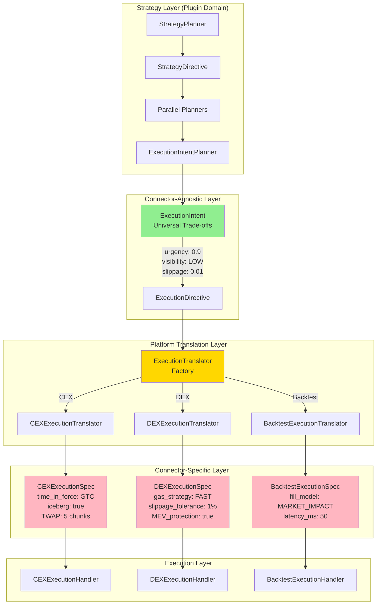
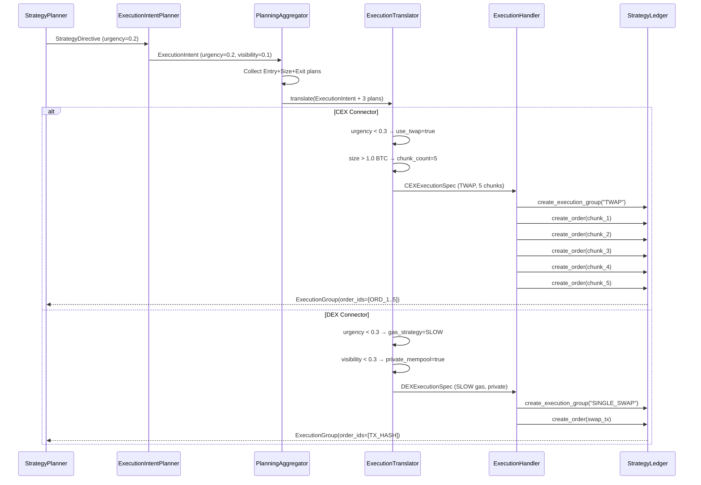
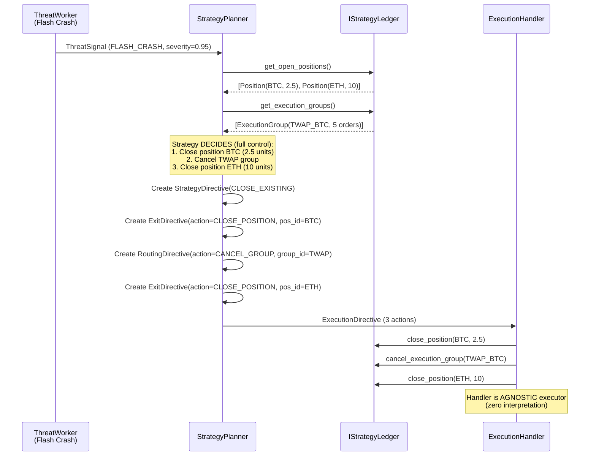
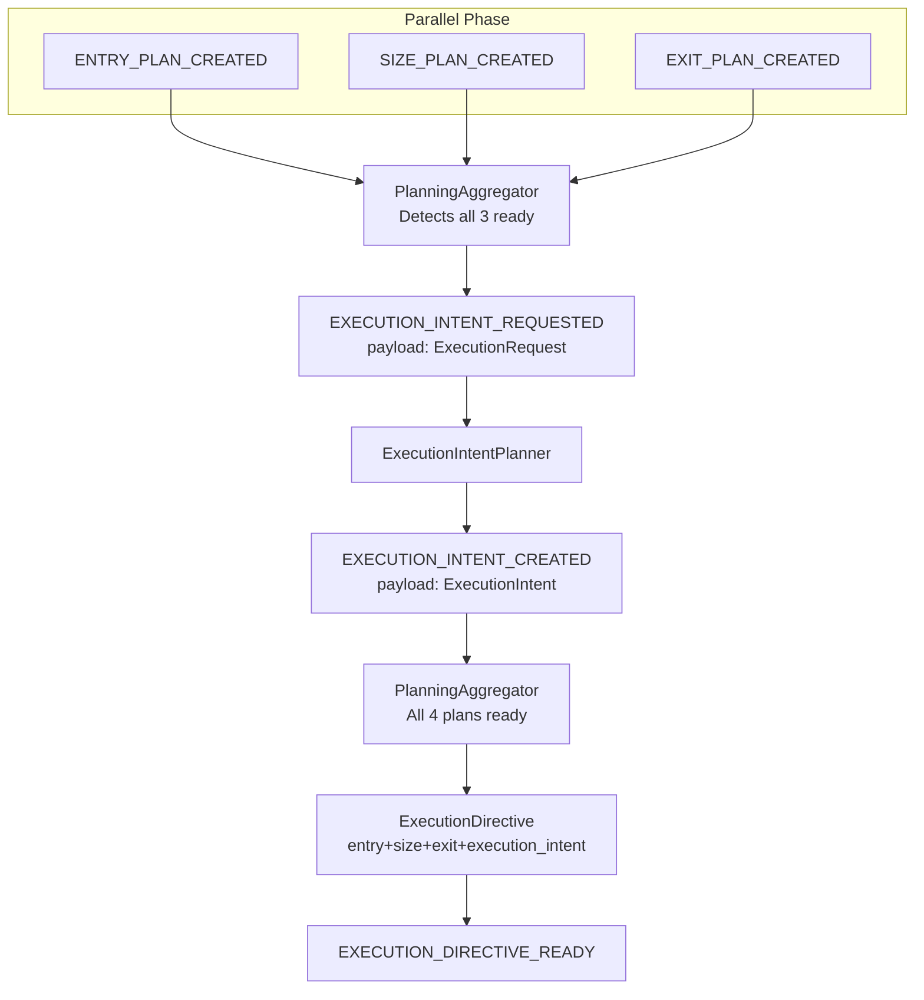
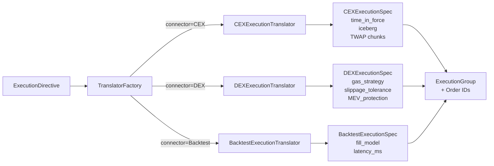
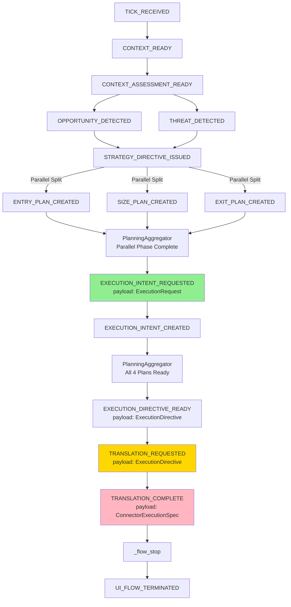
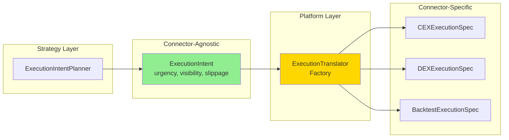

# Strategy Pipeline Architecture - S1mpleTraderV3

**Status:** Definitief - Leidend Document  
**Versie:** 4.0 (ExecutionIntent Architecture)  
**Laatst Bijgewerkt:** 2025-10-28

---

## 🔄 Version History

### v4.0 (2025-10-28) - ExecutionIntent Architecture
**Breaking Changes:**
- RoutingPlan → ExecutionIntent (connector-agnostic universal trade-offs)
- Nieuwe ExecutionTranslator layer (CEX/DEX/Backtest translation)
- ExecutionGroup tracking (multi-order relationships)
- IStrategyLedger dual-level API (groups vs orders)
- Event renames: ROUTING_* → EXECUTION_INTENT_*

**New Components:**
- ExecutionIntent DTO (urgency, visibility, slippage)
- ExecutionTranslator (platform layer, niet plugin)
- ExecutionGroup DTO (order relationship tracking)
- ExecutionDirectiveBatch (atomic multi-modifications)
- ConnectorExecutionSpec (CEX/DEX/Backtest specifiek)

**Core Principle Reinforcement:**
- Plugin-First: Execution strategy keuze blijft in plugins
- Connector-Agnostic: Strategy layer gebruikt universele concepten
- Strategy Control: Emergency scenarios - strategy specificeert EXACT wat
- Type Safety: Compiler prevents connector-specific leakage

### v3.0 (2025-10-27) - Original Architecture
- Confidence-Driven Specialization
- Plugin-First principe
- Bus-Agnostic Workers
- SRP overal

---

## Executive Summary

Dit document beschrijft de **volledige strategie pipeline** van S1mpleTraderV3 - van market tick tot trade execution. Het is het **enige leidende document** voor pipeline architectuur discussies.

**Kernprincipes:**
1. **Confidence-Driven Specialization** - Hyper-gefocuste planners filteren op confidence scores
2. **Plugin-First** - Alle quant logica in configureerbare plugins
3. **Bus-Agnostic Workers** - Geen EventBus dependency, pure DispositionEnvelope pattern
4. **SRP Overal** - Elke component één verantwoordelijkheid, dynamiek via aparte workers
5. **Platform = Framework** - Quant plugt specialisten in via YAML, geen code wijzigingen

---

## Pipeline Overzicht - De 6+1 Fases

```
┌─────────────────────────────────────────────────────────────────┐
│ Fase 0: BOOTSTRAPPING                                           │
│ - Build rolling window voor alle timeframes                     │
│ - Initialiseer workers en event wirings                         │
└─────────────────────────────────────────────────────────────────┘
                              ↓
┌─────────────────────────────────────────────────────────────────┐
│ Fase 1a: CONTEXT ANALYSE (Sequential)                           │
│ Workers: ContextWorker (7 subtypes)                             │
│ Doel: Markt "kaart" - Sterktes & Zwaktes ontdekken             │
│ Output: Verrijkte TradingContext (enriched_df)                  │
└─────────────────────────────────────────────────────────────────┘
                              ↓
┌─────────────────────────────────────────────────────────────────┐
│ Fase 1b: CONTEXT AGGREGATIE (Platform Component)                │
│ Component: ContextAggregator                                     │
│ Doel: Compleet zicht op markt binnen deze tick                  │
│ Output: AggregatedContextAssessment (strength/weakness scores)   │
└─────────────────────────────────────────────────────────────────┘
                              ↓
        ┌─────────────────────┴─────────────────────┐
        │                                           │
        ↓                                           ↓
┌──────────────────────┐                 ┌──────────────────────┐
│ Fase 2a: OPPORTUNITY │  (Parallel)     │ Fase 2b: THREATS     │
│ Detectie             │                 │ Detectie             │
│                      │                 │                      │
│ Workers: 7 subtypes  │                 │ Workers: 5 subtypes  │
│ Output: Opportunity  │                 │ Output: ThreatSignal │
│ Signal (confidence)  │                 │ (severity)           │
└──────────────────────┘                 └──────────────────────┘
        │                                           │
        └─────────────────────┬─────────────────────┘
                              ↓
┌─────────────────────────────────────────────────────────────────┐
│ Fase 3: STRATEGY PLANNING (Confrontatie)                        │
│ Worker: StrategyPlanner (1-op-1 met strategie)                  │
│ Input: SWOT Quadranten (Context + Opportunity + Threat)         │
│ Logica: Confrontatie matrix, gekwantificeerde beslissing        │
│ Output: StrategyDirective (confidence + 4 sub-directives)        │
│                                                                  │
│ KNOOPPUNT voor iteratieve strategieën:                          │
│ - Scheduled (DCA, rebalancing)                                  │
│ - Position management (trailing stops, partial exits)           │
│ - Risk control (emergency exits, drawdown limiters)             │
└─────────────────────────────────────────────────────────────────┘
                              ↓
┌─────────────────────────────────────────────────────────────────┐
│ Fase 4a: TRADE PLANNING (Parallel + Sequential)                 │
│                                                                  │
│ PARALLEL PHASE: (confidence-filtered specialisten)              │
│ ├─ EntryPlanner   → EntryPlan   (WHAT/WHERE trade)             │
│ ├─ SizePlanner    → SizePlan    (HOW MUCH)                     │
│ └─ ExitPlanner    → ExitPlan    (WHERE OUT)                    │
│                                                                  │
│ SEQUENTIAL PHASE: (krijgt context van eerdere plannen)          │
│ └─ ExecutionIntentPlanner → ExecutionIntent (HOW/WHEN)         │
│                                                                  │
│ Config-driven filtering: Quant definieert confidence ranges     │
│ - AggressiveMarketEntry: confidence [0.8-1.0]                   │
│ - PatientLimitEntry:     confidence [0.3-0.7]                   │
└─────────────────────────────────────────────────────────────────┘
                              ↓
┌─────────────────────────────────────────────────────────────────┐
│ Fase 4b: TRADE PLAN AGGREGATIE (Platform Component)             │
│ Component: PlanningAggregator                                    │
│ Input: 4 Plan DTOs (Entry, Size, Exit, ExecutionIntent)        │
│ Output: ExecutionDirective (complete execution package)         │
│ Event: EXECUTION_DIRECTIVE_READY                                │
└─────────────────────────────────────────────────────────────────┘
                              ↓
┌─────────────────────────────────────────────────────────────────┐
│ Fase 4c: EXECUTION TRANSLATION (Platform Layer)                 │
│ Component: ExecutionTranslator (connector-specific factory)     │
│ Input: ExecutionDirective (with ExecutionIntent)                │
│ Process: Translate universal trade-offs → connector spec        │
│ Output: ConnectorExecutionSpec (CEX/DEX/Backtest specific)      │
└─────────────────────────────────────────────────────────────────┘
                              ↓
┌─────────────────────────────────────────────────────────────────┐
│ Fase 5: EXECUTION (Environment-dependent)                       │
│ Component: ExecutionHandler (interface)                         │
│ Implementations:                                                 │
│ - BacktestHandler   → Direct ledger registration                │
│ - PaperHandler      → Paper trading simulation                  │
│ - LiveHandler       → Exchange API connector                    │
│ Output: DispositionEnvelope (STOP → _flow_stop event)          │
└─────────────────────────────────────────────────────────────────┘
                              ↓
┌─────────────────────────────────────────────────────────────────┐
│ Fase 6: RUN FINALE (Cleanup & Logging)                          │
│ Component: FlowTerminator                                        │
│ Responsibilities:                                                │
│ - Causality reconstruction (Journal queries via TriggerContext) │
│ - Logging & metrics                                             │
│ - Component cleanup & garbage collection                         │
└─────────────────────────────────────────────────────────────────┘
```

---

## Fase 0: Bootstrapping

**Doel:** Voorbereiden van de pipeline voor eerste "echte" tick

**Verantwoordelijkheden:**
1. **Rolling Window Opbouw**
   - Verzamel historische data voor alle timeframes
   - Vul indicators voor correcte initialisatie
   - Wacht tot minimum window size bereikt

2. **Worker Initialisatie**
   - Instantieer alle workers volgens workforce config
   - Inject capabilities (state, events, journaling)
   - Valideer dependencies

3. **Event Wiring**
   - Assembleer EventAdapters volgens wiring_map.yaml
   - Koppel event listeners aan publishers
   - Valideer event chain (geen circulaire refs)

**Output:** Klaar-voor-tick systeem

**Zie ook:** Bootstrap Workflow in `agent.md`

---

## Fase 1a: Context Analyse - "De Cartograaf"

**Rol:** Objectief en beschrijvend - "Dit is wat er is"

**Verantwoordelijkheid:**
- Verrijk micro market data (tick) met objectieve informatie
- Ontdek **Sterktes** en **Zwaktes** in de markt
- Geen filtering, geen oordelen - pure data verrijking

**Worker Type:** `ContextWorker` (7 subtypes)

**Execution:** Sequential chain-through
- Workers bouwen op elkaars output
- EventAdapters bedraad volgens wiring_map.yaml
- Laatste worker output = verrijkte TradingContext

**Input:** Raw OHLCV data (current tick + historical window)

**Process:**
```python
# Voorbeeld: ICT/SMC Strategie
context_workers:
  - MarketStructureDetector  # → adds: trend_direction, is_bos, is_choch
  - EMADetector              # → adds: ema_20, ema_50, ema_200
  - ADXRegimeClassifier      # → adds: regime ('trending'/'ranging')
```

**Output:**
- `TradingContext.enriched_df` - DataFrame met alle toegevoegde kolommen
- Event: `CONTEXT_READY` (trigger voor Fase 2)

**SWOT Mapping:** Dit is waar **Strengths** & **Weaknesses** worden verzameld

---

## Fase 1b: Context Aggregatie

**Component:** `ContextAggregator` (Platform worker, bus-agnostic)

**Verantwoordelijkheid:**
- Aggregeer atomaire context outputs → AggregatedContextAssessment
- Produceer **strength** en **weakness** scores (0.0-1.0)
- Symmetrie met Opportunity.confidence en Threat.severity
- Wired via EventAdapter: luistert naar laatste ContextWorker output

**Configuratie:** `aggregation_policy.yaml` (platform config)
```yaml
aggregation:
  method: "weighted_average"  # of "max", "consensus"
  weights:
    trend_strength: 0.4
    regime_clarity: 0.3
    structure_quality: 0.3
```

**Output:**
```python
AggregatedContextAssessment(
    assessment_id="CTX_20251027_143022_a8f3c",
    strength: Decimal("0.75"),  # Sterke trend, goede structuur
    weakness: Decimal("0.20"),  # Lage volatiliteit
    contributing_factors=[...]  # Welke context workers bijdroegen
)
```

**Event:** `CONTEXT_ASSESSMENT_READY`

---

## Fase 2a: Opportunity Detection - "De Verkenner"

**Rol:** Probabilistisch en creatief - "Ik zie een mogelijkheid"

**Verantwoordelijkheid:**
- Herken handelskansen op basis van patronen/theorieën
- Genereer "handelsideeën" zonder concrete plannen
- Filter op basis van strategische criteria

**Worker Type:** `OpportunityWorker` (7 subtypes)

**Execution:** Parallel
- Alle workers ontvangen dezelfde TradingContext
- EventAdapters fire workers simultaan
- Genereren onafhankelijke signalen

**Input:** Verrijkte TradingContext (uit Fase 1)

**Process:**
```python
# Meerdere opportunity detectors parallel
opportunity_workers:
  - FVGEntryDetector        # → FVG pattern na structure break
  - VolumeSpikeRefiner      # → Validates volume confirmation
  - DivergenceScanner       # → RSI divergence signals
```

**Output:**
```python
OpportunitySignal(
    signal_id="OPP_20251027_143022_a8f3c",
    timestamp=datetime.now(UTC),
    asset="BTCUSDT",
    direction="BUY",
    signal_type="fvg_entry",
    confidence=Decimal("0.85"),  # ← Cruciaal voor Fase 4 filtering!
    metadata={"gap_size": 8.5, "volume_percentile": 85}
)
```

**Event:** `OPPORTUNITY_DETECTED` (per signaal)

**SWOT Mapping:** Dit is waar **Opportunities** worden ontdekt

---

## Fase 2b: Threat Detection - "De Waakhond"

**Rol:** Vigilant en defensief - "Let op gevaar!"

**Verantwoordelijkheid:**
- Monitor risico's, bedreigingen, afwijkingen
- Publiceert waarschuwingen (handelt NOOIT zelf)
- Parallel aan Opportunity Detection

**Worker Type:** `ThreatWorker` (5 subtypes)

**Execution:** Event-Driven
- EventAdapters wired volgens manifest triggers
- Sommige op `TICK_RECEIVED`, sommige op `LEDGER_UPDATE`
- Parallel aan Opportunity Detection

**Input:**
- TradingContext (market data)
- StrategyLedger (open positions, P&L)

**Process:**
```python
threat_workers:
  - MaxDrawdownMonitor      # → Watches portfolio drawdown
  - CorrelationBreachDetector  # → Market correlation anomalies
  - LiquidityCrisisDetector    # → Order book depth issues
```

**Output:**
```python
ThreatSignal(
    threat_id="THR_20251027_143025_b7c4d",
    timestamp=datetime.now(UTC),
    threat_type="MAX_DRAWDOWN_BREACH",
    severity=Decimal("0.90"),  # 0.0-1.0 (CRITICAL)
    source_worker_id="max_drawdown_monitor",
    metadata={"current_dd": 0.08, "max_allowed": 0.05}
)
```

**Event:** `THREAT_DETECTED`

**SWOT Mapping:** Dit is waar **Threats** worden ontdekt

---

## Fase 3: Strategy Planning - "De Confrontatiematrix"

**Rol:** Strategisch en kwantitatief - "Hier is mijn cijfermatige beslissing"

**Verantwoordelijkheid:**
- **SWOT Confrontatie** - Combineer alle 4 quadranten
- Produceer **confidence score** voor trade planners
- Genereer **hints & constraints** (GEEN execution orders!)
- **Knooppunt** voor iteratieve strategieën (scheduled, position management)

**StrategyDirective = Pure Data Container (GEEN Orchestrator):**

**WAT STRATEGYDIRECTIVE IS:**
- ✅ SWOT aggregator (Strength + Weakness + Opportunity + Threat)
- ✅ Confidence score producer (0.0-1.0 voor planner filtering)
- ✅ Hints/constraints container (via sub-directives)
- ✅ Causality tracker (welke SWOT IDs → deze directive)

**WAT STRATEGYDIRECTIVE NIET IS:**
- ❌ Orchestrator (triggert geen planners, beslist niet welke planner draait)
- ❌ Event publisher (weet niets van event wiring)
- ❌ Execution order (sub-directives zijn hints, geen concrete orders)
- ❌ Flow controller (PlanningAggregator doet flow coordination)

**Architectureel Principe:**
> "StrategyDirective is een pure data DTO die SWOT analyse aggregeert en 
> hints/constraints produceert voor downstream planners. Event-driven wiring 
> (niet de directive zelf) bepaalt welke planners worden getriggerd."

**Worker Type:** `StrategyPlanner` (1-op-1 met strategie)

**Subtypes (documentatie only, niet enforced):**
- SWOT Entry Strategies (nieuwe trades)
- Position Management (trailing stops, partial exits)
- Risk Control (emergency exits, drawdown limiters)
- Scheduled Operations (DCA, rebalancing)

**Input:**
```python
# SWOT Quadranten
context_assessment: AggregatedContextAssessment  # S & W
opportunity_signals: list[OpportunitySignal]     # O
threat_signals: list[ThreatSignal]               # T
```

**Confrontatie Logica (quant-specifiek):**
```python
class AdaptiveMomentumPlanner(BaseStrategyPlanner):
    """
    StrategyPlanner = ENIGE plaats voor strategic decision making.
    
    Verantwoordelijk voor:
    - SWOT confrontatie (combine alle 4 quadranten)
    - Confidence score berekening
    - Hints/constraints generatie (GEEN execution orders!)
    """
    def confront(self, swot: SWOTInputs) -> StrategyDirective:
        # SWOT formule (quant-specifiek)
        confidence = (
            swot.context.strength * 0.3 +        # Strength
            swot.opportunity.confidence * 0.5 -  # Opportunity
            swot.threat.severity * 0.2           # Threat (negatief)
            # Weakness implicit in context.strength
        )
        
        # Produceer HINTS (niet execution orders!)
        return StrategyDirective(
            confidence=confidence,  # ← Voor planner filtering (config-driven)
            
            # Sub-directives = HINTS/CONSTRAINTS voor planners
            entry_directive=EntryDirective(
                timing_preference=confidence,  # Hint: higher conf = urgent
                symbol="BTCUSDT",              # Info: wat te handelen
                direction="BUY"                # Info: welke richting
            ),
            size_directive=SizeDirective(
                aggressiveness=confidence * 0.8,  # Hint: sizing strategie
                max_risk_amount=Decimal("1000")   # Constraint: hard limit
            ),
            # ... exit & execution intent hints
        )
```

**Output:**
```python
StrategyDirective(
    directive_id="STR_20251027_143030_c8e6f",
    causality=CausalityChain(...),  # All SWOT IDs
    
    # De kern: Confidence score voor config-driven planner filtering
    confidence=Decimal("0.82"),
    
    # Sub-directives = Hints/Constraints (GEEN concrete execution orders!)
    entry_directive=EntryDirective(
        timing_preference=Decimal("0.82"),     # HINT: urgency level
        symbol="BTCUSDT",                      # INFO: trading pair
        direction="BUY",                       # INFO: trade direction
        preferred_price_zone=PriceZone(...)    # HINT: price preference
    ),
    size_directive=SizeDirective(
        aggressiveness=Decimal("0.66"),        # HINT: sizing strategy
        max_risk_amount=Decimal("1000"),       # CONSTRAINT: hard limit
        account_risk_pct=Decimal("0.02")       # CONSTRAINT: max account risk
    ),
    exit_directive=ExitDirective(
        profit_taking_preference=Decimal("0.75"),  # HINT: exit strategy
        risk_reward_ratio=Decimal("2.5"),          # HINT: RR target
        stop_loss_tolerance=Decimal("0.015")       # CONSTRAINT: max SL distance
    ),
    execution_intent_directive=ExecutionIntentDirective(
        execution_urgency=Decimal("0.82"),         # HINT: execution urgency
        max_total_slippage_pct=Decimal("0.002")    # CONSTRAINT: hard limit
    ),
    
    # Scope (voor position management planners)
    scope="NEW_TRADE",  # of MODIFY_EXISTING, CLOSE_EXISTING
    target_trade_ids=[]
)
```

**Event:** `STRATEGY_DIRECTIVE_ISSUED`

**Iteratieve Strategieën:**
- **Scheduled triggers:** DCAPlanner luistert naar `WEEKLY_DCA_TICK`
- **Position updates:** TrailingStopPlanner luistert naar `POSITION_UPDATE`
- **Output:** Allemaal StrategyDirective (zelfde DTO, andere scope)

---

## 🏗️ Execution Architecture - Connector-Agnostic Design

### Architectureel Probleem: Connector-Specificity Leakage

**Historische Situatie (DEPRECATED):**
```python
# ❌ OUDE RoutingPlan - Connector-specifiek!
RoutingPlan(
    timing="TWAP",
    time_in_force="GTC",     # ← CEX-only (DEX heeft dit niet)
    iceberg_preference=0.5,  # ← CEX-only (blockchain is transparant)
    twap_duration_minutes=30 # ← Implementatie detail
)
```

**Probleem:** RoutingPlan lekt connector-specifieke concepten naar Strategy layer:
- `time_in_force="GTC"` bestaat niet op DEX (geen order book persistentie)
- `iceberg_preference` is CEX-concept (DEX heeft transparante mempool)
- TWAP implementaties verschillen fundamenteel (CEX=order splitting, DEX=batched swaps)

**Gevolg:** Strategy plugins worden **connector-aware** → Violatie van Plugin-First principe!

### Nieuwe Architectuur: ExecutionIntent + Translator Pattern

**Kernidee:** Strategy layer spreekt in **universele trade-offs**, platform vertaalt naar **connector-specifieke specs**.



### ExecutionIntent - Universal Trade-Offs

**Concept:** Strategy layer specificeert **wat** bereikt moet worden (trade-offs), niet **hoe** (implementatie).

```python
@dataclass(frozen=True)
class ExecutionIntent:
    """
    Connector-agnostic execution trade-offs.
    
    Strategy layer spreekt in universele concepten:
    - Urgency (hoe snel?)
    - Visibility (mag markt zien?)
    - Slippage (hoeveel prijs impact?)
    
    ExecutionTranslator vertaalt naar connector-specifieke spec.
    """
    intent_id: str
    action: ExecutionAction  # EXECUTE_TRADE, CANCEL_ORDER, MODIFY_ORDER
    
    # === UNIVERSAL TRADE-OFFS (alle connectors begrijpen dit) ===
    execution_urgency: Decimal       # 0.0-1.0 (patience vs speed)
    visibility_preference: Decimal   # 0.0-1.0 (stealth vs transparency)
    max_slippage_pct: Decimal        # Hard limit (universal concept)
    
    # Time constraints (optional)
    must_complete_immediately: bool = False
    max_execution_window_minutes: Optional[int] = None
    
    # === OPTIONAL HINTS (niet binding, connector kan interpreteren) ===
    preferred_execution_style: Optional[str] = None  # "TWAP", "VWAP", "ICEBERG"
    chunk_count_hint: Optional[int] = None           # Suggested chunking
    chunk_distribution: Optional[str] = None         # "UNIFORM", "FRONT_LOADED"
    min_fill_ratio: Optional[Decimal] = None         # Partial fill acceptance
```

**Universele Trade-Offs Uitgelegd:**

1. **execution_urgency (0.0-1.0)**
   - `0.0` = Maximum patience (kan dagen duren)
   - `0.5` = Balanced (uren tot dag)
   - `1.0` = Immediate (seconden)
   - **CEX interpretatie:** urgency > 0.8 → MARKET order, < 0.3 → LIMIT + TWAP
   - **DEX interpretatie:** urgency > 0.8 → Max gas + MEV protection, < 0.3 → Patient routing
   - **Backtest interpretatie:** urgency bepaalt fill latency model

2. **visibility_preference (0.0-1.0)**
   - `0.0` = Maximum stealth (verberg intentie)
   - `0.5` = Neutral
   - `1.0` = Full visibility (transparant)
   - **CEX interpretatie:** visibility < 0.3 → iceberg orders, > 0.7 → regular orders
   - **DEX interpretatie:** visibility < 0.3 → private mempool, > 0.7 → public broadcast
   - **Backtest interpretatie:** visibility bepaalt market impact model

3. **max_slippage_pct**
   - Hard limit op prijs afwijking
   - **CEX:** Limit price range voor TWAP chunks
   - **DEX:** Slippage tolerance in swap contract
   - **Backtest:** Rejects trades die model boundary overschrijden

**Hints vs Constraints:**

```python
# ✅ HINT (suggestie - connector kan negeren)
ExecutionIntent(
    preferred_execution_style="TWAP",  # Hint: "als mogelijk, gebruik TWAP"
    chunk_count_hint=5                 # Hint: "probeer 5 chunks"
)

# ✅ CONSTRAINT (hard requirement)
ExecutionIntent(
    max_slippage_pct=Decimal("0.01"),         # MUST: max 1% slippage
    must_complete_immediately=True,            # MUST: nu of fail
    max_execution_window_minutes=30            # MUST: binnen 30 min
)
```

### ExecutionTranslator - Platform Translation Layer

**Verantwoordelijkheid:** Vertaal universele ExecutionIntent → connector-specifieke execution spec.

```python
class ExecutionTranslator(ABC):
    """
    Abstract base voor connector-specifieke translators.
    
    NIET een plugin - dit is platform infrastructuur!
    Quant configureert ExecutionIntent, platform kiest translator.
    """
    
    @abstractmethod
    def translate(
        self,
        intent: ExecutionIntent,
        entry_plan: EntryPlan,
        size_plan: SizePlan,
        exit_plan: ExitPlan
    ) -> ConnectorExecutionSpec:
        """
        Vertaal universele intent + trade plans → connector spec.
        
        Args:
            intent: Universal trade-offs
            entry/size/exit: Trade karakteristieken (voor context)
        
        Returns:
            Connector-specifieke execution spec (CEX/DEX/Backtest)
        """
        pass
```

**Voorbeeld: CEX Translator**

```python
class CEXExecutionTranslator(ExecutionTranslator):
    def translate(
        self,
        intent: ExecutionIntent,
        entry_plan: EntryPlan,
        size_plan: SizePlan,
        exit_plan: ExitPlan
    ) -> CEXExecutionSpec:
        # Decision 1: Order Type (urgency + entry plan)
        if intent.execution_urgency > Decimal("0.8"):
            order_type = "MARKET"
            time_in_force = "IOC"
        elif entry_plan.order_type == "LIMIT":
            order_type = "LIMIT"
            time_in_force = "GTC"
        else:
            order_type = entry_plan.order_type
            time_in_force = "FOK"
        
        # Decision 2: TWAP Chunking (urgency + size + hint)
        use_twap = (
            intent.execution_urgency < Decimal("0.3") and
            size_plan.position_size > Decimal("1.0")
        )
        if use_twap:
            chunk_count = intent.chunk_count_hint or self._calculate_chunks(
                size_plan.position_size,
                intent.max_execution_window_minutes
            )
        else:
            chunk_count = 1
        
        # Decision 3: Iceberg (visibility + size)
        use_iceberg = (
            intent.visibility_preference < Decimal("0.3") and
            size_plan.position_size > Decimal("5.0")
        )
        
        return CEXExecutionSpec(
            order_type=order_type,
            time_in_force=time_in_force,
            chunk_count=chunk_count,
            chunk_distribution=intent.chunk_distribution or "UNIFORM",
            iceberg_enabled=use_iceberg,
            iceberg_visible_ratio=Decimal("0.1") if use_iceberg else None,
            max_slippage_bps=int(intent.max_slippage_pct * 10000)
        )
```

**Voorbeeld: DEX Translator**

```python
class DEXExecutionTranslator(ExecutionTranslator):
    def translate(
        self,
        intent: ExecutionIntent,
        entry_plan: EntryPlan,
        size_plan: SizePlan,
        exit_plan: ExitPlan
    ) -> DEXExecutionSpec:
        # Decision 1: Gas Strategy (urgency)
        if intent.execution_urgency > Decimal("0.8"):
            gas_strategy = "FAST"  # Max gas, frontrun protection
        elif intent.execution_urgency < Decimal("0.3"):
            gas_strategy = "SLOW"  # Patient, low gas
        else:
            gas_strategy = "STANDARD"
        
        # Decision 2: MEV Protection (visibility + size)
        use_mev_protection = (
            intent.visibility_preference < Decimal("0.5") or
            size_plan.position_value > Decimal("10000")  # > $10k
        )
        
        # Decision 3: Router Path (size determines DEX aggregation)
        if size_plan.position_size > Decimal("10.0"):
            router_strategy = "MULTI_DEX"  # Split across Uniswap + Sushiswap
        else:
            router_strategy = "SINGLE_DEX"
        
        return DEXExecutionSpec(
            gas_strategy=gas_strategy,
            slippage_tolerance_bps=int(intent.max_slippage_pct * 10000),
            mev_protection_enabled=use_mev_protection,
            private_mempool=intent.visibility_preference < Decimal("0.3"),
            router_strategy=router_strategy,
            deadline_minutes=intent.max_execution_window_minutes or 20
        )
```

### ExecutionGroup - Order Relationship Tracking

**Probleem:** TWAP genereert 5 orders - hoe track je dat dit bij elkaar hoort?

**Oplossing:** ExecutionGroup - abstract orders in logische groepen.

```python
@dataclass(frozen=True)
class ExecutionGroup:
    """
    Tracks related orders from same ExecutionDirective.
    
    Example: TWAP generates 5 orders → 1 ExecutionGroup
    Enables: "Cancel entire TWAP" (group-level operation)
    """
    group_id: str                      # "EXG_20251027_143045_k3d2f"
    parent_directive_id: str           # Which ExecutionDirective created this
    execution_strategy: str            # "TWAP", "ICEBERG", "SINGLE_ORDER"
    
    order_ids: List[str]               # ["ORD_001", "ORD_002", "ORD_003"]
    status: ExecutionGroupStatus       # PENDING, PARTIALLY_FILLED, COMPLETED, CANCELLED
    
    created_at: datetime
    completed_at: Optional[datetime] = None
```

**Flow Diagram:**



### IStrategyLedger - Dual-Level API

**Spanningsveld:** Strategy wil connector-agnostisch blijven, maar heeft soms low-level control nodig (emergency).

**Oplossing:** Dual-level API - hoog niveau (groups) + laag niveau (orders).

```python
class IStrategyLedger(ABC):
    """
    Portfolio state queries met dual-level abstractie.
    
    HIGH-LEVEL (connector-agnostic):
    - get_execution_groups() → Logical order groups
    - cancel_execution_group() → Cancel related orders
    
    LOW-LEVEL (connector-aware):
    - get_open_orders() → Individual orders/TXs
    - cancel_order() → Cancel specific order
    """
    
    # === HIGH-LEVEL API (connector-agnostic) ===
    @abstractmethod
    def get_open_positions(self) -> List[Position]:
        """Get all open positions."""
        pass
    
    @abstractmethod
    def get_execution_groups(
        self,
        status: Optional[ExecutionGroupStatus] = None
    ) -> List[ExecutionGroup]:
        """
        Get logical execution groups (abstracts orders).
        
        Use case: "Show me all active TWAP executions"
        """
        pass
    
    @abstractmethod
    def cancel_execution_group(self, group_id: str) -> bool:
        """
        Cancel entire execution group (all related orders).
        
        Connector-agnostic: Works on CEX (cancel 5 orders) and 
        DEX (cancel 1 transaction).
        """
        pass
    
    # === LOW-LEVEL API (connector-aware) ===
    @abstractmethod
    def get_open_orders(self) -> List[Order]:
        """
        Get individual orders/transactions.
        
        Use case: Fine-grained control (cancel specific TWAP chunk)
        Warning: Connector-specific details exposed!
        """
        pass
    
    @abstractmethod
    def cancel_order(self, order_id: str) -> bool:
        """
        Cancel specific order/transaction.
        
        Connector-aware: order_id format depends on connector
        (CEX: exchange order ID, DEX: transaction hash)
        """
        pass
```

**Emergency Scenario - Flash Crash:**



**Kernprincipe:** Strategy specificeert EXACT wat gedaan moet worden - Handler voert uit zonder interpretatie.

### ExecutionDirectiveBatch - Atomic Multi-Modifications

**Use Case:** Sluit 3 posities ALL-OR-NOTHING (flash crash scenario).

```python
@dataclass(frozen=True)
class ExecutionDirectiveBatch:
    """
    Atomic execution van meerdere directives.
    
    Use case: Emergency scenario - sluit meerdere posities tegelijk
    met rollback ondersteuning.
    """
    batch_id: str
    directives: List[ExecutionDirective]
    execution_mode: ExecutionMode  # SEQUENTIAL, PARALLEL, ATOMIC
    rollback_on_failure: bool = True
    
    created_at: datetime
```

**Execution Modes:**

```python
class ExecutionMode(str, Enum):
    SEQUENTIAL = "SEQUENTIAL"  # Execute 1-by-1, stop on first failure
    PARALLEL = "PARALLEL"      # Execute all simultaneously
    ATOMIC = "ATOMIC"          # All succeed or all rollback
```

---

## Fase 4a: Trade Planning - "Hyper-Gefocuste Specialisten"

**Rol:** Dom en gespecialiseerd - "Ik doe dit ene ding perfect"

**Verantwoordelijkheid:**
- **Geen filtering logica** - dat doet de config
- **Pure specialisatie** - één execution strategie
- **Statische output** - geen dynamische beslissingen

**Planners zijn DOM - Config is SLIM:**

### Config-Driven Filtering

```yaml
# strategy_blueprint.yaml
planning:
  entry:
    - plugin: "AggressiveMarketEntryPlanner"
      triggers:
        confidence: [0.8, 1.0]        # Alleen bij hoge confidence
        timing_preference: [0.8, 1.0] # En hoge urgency
    
    - plugin: "PatientLimitEntryPlanner"
      triggers:
        confidence: [0.3, 0.7]        # Bij medium confidence
        timing_preference: [0.0, 0.3] # En lage urgency
```

**WorkerFactory injecteert PlannerMatcher tijdens assembly:**
```python
class BaseEntryPlanner:
    # Injected by platform during assembly
    matcher: PlannerMatcher
    
    def should_handle(self, directive: StrategyDirective) -> bool:
        """Config-driven filtering - NO quant logic here."""
        return self.matcher.matches(
            confidence=directive.confidence,
            timing_pref=directive.entry_directive.timing_preference
        )
    
    def plan(self, directive: StrategyDirective) -> EntryPlan:
        """Pure specialization - quant logic here."""
        return EntryPlan(
            symbol=directive.entry_directive.symbol,
            direction=directive.entry_directive.direction,
            order_type="MARKET",  # Dit is mijn specialisme!
            limit_price=None
        )
```

### De 4 Trade Planners

**Execution Model:** Hybrid
- **Parallel:** Entry, Size, Exit (EventAdapters fire simultaan)
- **Sequential:** ExecutionIntent (EventAdapter wacht op 3 plannen → fires ExecutionIntent)

**Rationale:** ExecutionIntent beslissingen vereisen complete trade context (entry + size + exit)

**Orchestration:** PlanningAggregator (platform worker) detecteert completion van parallel phase, triggert execution intent phase

#### 1. EntryPlanner → EntryPlan (WHAT/WHERE)

**Output:**
```python
EntryPlan(
    plan_id="ENT_20251027_143035_d9f7a",
    
    # Trade identiteit
    symbol="BTCUSDT",
    direction="BUY",
    
    # Order spec (statisch)
    order_type="MARKET",  # of LIMIT, STOP_LIMIT
    limit_price=None,
    stop_price=None
)
```

**GEEN:**
- `created_at` (redundant - timestamp in plan_id)
- `timing` (→ ExecutionIntent.execution_urgency)
- `max_slippage_pct` (→ ExecutionIntent.max_slippage_pct)
- `planner_id`, `rationale` (→ StrategyJournal)

**Specialisten:**
- `AggressiveMarketEntryPlanner` - confidence [0.8-1.0]
- `PatientLimitEntryPlanner` - confidence [0.3-0.7]
- `LayeredEntryPlanner` - confidence [0.5-0.9], grote positions

#### 2. SizePlanner → SizePlan (HOW MUCH)

**Output:**
```python
SizePlan(
    plan_id="SIZ_20251027_143036_e2a8b",
    
    # Position sizing (absolute values)
    position_size=Decimal("0.5"),      # BTC
    position_value=Decimal("50000.00"), # USDT
    risk_amount=Decimal("1000.00"),     # USDT risk
    leverage=Decimal("1.0")             # No leverage
)
```

**GEEN:**
- `account_risk_pct` (was input voor planner, niet output)
- `max_position_value` (constraint voor planner, niet execution param)

**Specialisten:**
- `FixedRiskSizer` - altijd 1% account risk
- `KellyCriterionSizer` - optimaal volgens Kelly
- `AggressiveSizer` - confidence [0.8-1.0] → 2% risk

#### 3. ExitPlanner → ExitPlan (WHERE OUT)

**Output:**
```python
ExitPlan(
    plan_id="EXT_20251027_143037_f3b9c",
    
    # Risk boundaries (absolute prices, statisch)
    stop_loss_price=Decimal("49500.00"),
    take_profit_price=Decimal("51000.00")  # Of None
)
```

**GEEN:**
- `trailing_stop_config` - Aparte PositionMonitor worker publiceert nieuwe ExitPlan
- `breakeven_trigger` - Aparte worker, niet in statisch plan
- `partial_exit_levels` - ExecutionHandler splits, niet hier

**Specialisten:**
- `FixedRRExitPlanner` - altijd 2:1 RR
- `StructureBasedExit` - SL onder structure, TP op liquidity
- `AggressiveExitPlanner` - confidence [0.8-1.0] → 3:1 RR

#### 4. ExecutionIntentPlanner → ExecutionIntent (HOW/WHEN)

**Output:**
```python
ExecutionIntent(
    intent_id="EXI_20251027_143038_g4c1d",
    action=ExecutionAction.EXECUTE_TRADE,
    
    # Universal trade-offs (connector-agnostic)
    execution_urgency=Decimal("0.82"),      # 0.0-1.0 (patience vs speed)
    visibility_preference=Decimal("0.20"),  # 0.0-1.0 (stealth vs transparency)
    max_slippage_pct=Decimal("0.01"),      # 1% hard limit
    
    # Time constraints
    must_complete_immediately=False,
    max_execution_window_minutes=30,
    
    # Optional hints (connector kan interpreteren)
    preferred_execution_style="TWAP",  # Hint, niet binding
    chunk_count_hint=5,                # Suggested chunking
    chunk_distribution="UNIFORM"       # Distribution strategy
)
```

**GEEN connector-specifieke velden:**
- ❌ `time_in_force` - CEX concept (naar CEXExecutionSpec)
- ❌ `iceberg_preference` - CEX concept (naar CEXExecutionSpec)
- ❌ `twap_duration_minutes` - Implementatie detail (translator beslist)
- ❌ `post_only_flag` - Connector config
- ❌ `gas_strategy` - DEX concept (naar DEXExecutionSpec)

**Specialisten:**
- `HighUrgencyIntentPlanner` - confidence [0.8-1.0] → urgency=0.9
- `TWAPIntentPlanner` - grote orders → urgency=0.2, chunk_hint=5
- `StealthIntentPlanner` - visibility=0.1 (iceberg/private mempool hint)

---

## Fase 4b: Trade Plan Aggregatie

**Component:** `PlanningAggregator` (Platform worker, bus-agnostic)

**Verantwoordelijkheid:**
- Track welke plannen verwacht worden (3 parallel + 1 sequential)
- Wacht tot parallel phase compleet is (Entry, Size, Exit)
- Trigger ExecutionIntent phase met **alle 3 plans** als input
- Wacht tot ExecutionIntent klaar is
- Aggregeer alle 4 plans → ExecutionDirective
- Wired via EventAdapter: luistert naar ENTRY_PLAN_CREATED, SIZE_PLAN_CREATED, etc.

**Rationale Waarom ExecutionIntentPlanner ALLE 3 Plans Nodig Heeft:**

ExecutionIntent beslissingen zijn **multi-dimensional trade-offs** gebaseerd op:

1. **Entry Plan Dependencies:**
   - `order_type` → Beïnvloedt urgency (MARKET=hoge urgency, LIMIT=lage urgency)
   - `limit_price` → Beïnvloedt slippage tolerance
   - Voorbeeld: MARKET orders krijgen urgency=0.9, LIMIT orders urgency=0.3

2. **Size Plan Dependencies:**
   - `position_size` → Beïnvloedt chunk_count_hint (grote orders splitsen)
   - `position_value` → Beïnvloedt visibility (grote trades willen stealth)
   - Voorbeeld: Position > 10 BTC → chunk_hint=10, visibility=0.1

3. **Exit Plan Dependencies:**
   - `take_profit_price - entry_plan.limit_price` → Beïnvloedt slippage budget
   - `stop_loss_price` → Beïnvloedt urgency bij tight stops
   - Voorbeeld: Scalping (< 0.5% margin) → max_slippage=0.05%, swing (> 5% margin) → max_slippage=0.5%

**Mode Detection:**
- Direct Planning: OpportunitySignal → 3 parallel plannen → execution intent
- SWOT Planning: StrategyDirective → 3 parallel plannen → execution intent

**Process:**



**ExecutionRequest DTO:**
```python
@dataclass
class ExecutionRequest:
    """
    Aggregated input voor ExecutionIntentPlanner.
    
    Planner MOET alle 3 plans hebben voor optimale trade-off beslissing.
    Zie rationale hierboven voor dependencies.
    """
    strategy_directive: StrategyDirective  # Context + hints
    entry_plan: EntryPlan                  # WHAT/WHERE
    size_plan: SizePlan                    # HOW MUCH
    exit_plan: ExitPlan                    # WHERE OUT
```

**Voorbeeld ExecutionIntentPlanner Logic:**
```python
class BaseBalancedIntentPlanner(BaseExecutionIntentPlanner):
    """
    General-purpose intent planner - maps trade characteristics to universal trade-offs.
    
    NO feature creep - alleen universele concepten (urgency, visibility, slippage).
    """
    def plan(self, request: ExecutionRequest) -> ExecutionIntent:
        # Decision 1: Urgency (van Entry.order_type + Size)
        if request.entry_plan.order_type == "MARKET":
            urgency = Decimal("0.90")  # High urgency
        elif request.size_plan.position_size > Decimal("1.0"):
            urgency = Decimal("0.20")  # Low urgency for large orders
        else:
            urgency = Decimal("0.50")  # Balanced
        
        # Decision 2: Slippage tolerance (van profit margin)
        profit_margin = (
            request.exit_plan.take_profit_price - 
            request.entry_plan.limit_price
        )
        max_slippage = (
            Decimal("0.0005")  # 0.05% tight voor scalping
            if profit_margin < Decimal("0.005") 
            else Decimal("0.005")  # 0.5% loose voor swing
        )
        
        # Decision 3: Visibility (van Size - grote orders willen stealth)
        visibility = (
            Decimal("0.10")  # Low visibility
            if request.size_plan.position_size > Decimal("5.0")
            else Decimal("0.70")  # Normal visibility
        )
        
        # Decision 4: Time constraints (van urgency)
        must_complete_immediately = urgency > Decimal("0.8")
        max_window = None if must_complete_immediately else 30  # 30 min window
        
        return ExecutionIntent(
            action=ExecutionAction.EXECUTE_TRADE,
            execution_urgency=urgency,
            visibility_preference=visibility,
            max_slippage_pct=max_slippage,
            must_complete_immediately=must_complete_immediately,
            max_execution_window_minutes=max_window
            # NO preferred_execution_style - dat is translator's domein!
            # NO chunk_count_hint - translator beslist chunking
        )
```

**Output:**
```python
ExecutionDirective(
    directive_id="EXE_20251027_143040_h5d2e",
    causality=CausalityChain(...),  # Complete chain met alle plan IDs
    
    # Aggregated plans
    entry_plan=EntryPlan(...),
    size_plan=SizePlan(...),
    exit_plan=ExitPlan(...),
    execution_intent=ExecutionIntent(...)  # Universal trade-offs
)
```

**Event:** `EXECUTION_DIRECTIVE_READY`

**Architectureel Principe:**
> "ExecutionIntentPlanner is GEEN gelijkwaardige parallel planner, maar een ÉN-functie die 
> ALLE trade characteristics (Entry + Size + Exit) combineert tot universele trade-off specificatie."

---

## Fase 4c: Execution Translation

**Component:** `ExecutionTranslator` (Platform layer, connector-specific factory)

**Verantwoordelijkheid:**
- Ontvang ExecutionDirective (met ExecutionIntent)
- Vertaal universal trade-offs → connector-specific execution spec
- Creëer ExecutionGroup voor order tracking
- Implementaties: CEXExecutionTranslator, DEXExecutionTranslator, BacktestExecutionTranslator

**Input:** ExecutionDirective (complete package met ExecutionIntent)

**Translation Flow:**



**Process:**
```python
class ExecutionTranslator(ABC):
    @abstractmethod
    def translate(
        self,
        directive: ExecutionDirective
    ) -> Tuple[ConnectorExecutionSpec, ExecutionGroup]:
        """
        Vertaal ExecutionIntent → connector spec + track execution group.
        
        Returns:
            (ConnectorExecutionSpec, ExecutionGroup)
        """
        pass

class CEXExecutionTranslator(ExecutionTranslator):
    def translate(
        self,
        directive: ExecutionDirective
    ) -> Tuple[CEXExecutionSpec, ExecutionGroup]:
        intent = directive.execution_intent
        
        # Translate urgency → order type + time_in_force
        if intent.execution_urgency > Decimal("0.8"):
            order_type = "MARKET"
            tif = "IOC"
        else:
            order_type = directive.entry_plan.order_type
            tif = "GTC"
        
        # Translate visibility + size → iceberg
        use_iceberg = (
            intent.visibility_preference < Decimal("0.3") and
            directive.size_plan.position_size > Decimal("5.0")
        )
        
        # Translate urgency + hint → TWAP chunking
        if intent.chunk_count_hint:
            chunk_count = intent.chunk_count_hint
        elif intent.execution_urgency < Decimal("0.3"):
            chunk_count = self._calculate_chunks(directive.size_plan.position_size)
        else:
            chunk_count = 1
        
        spec = CEXExecutionSpec(
            order_type=order_type,
            time_in_force=tif,
            chunk_count=chunk_count,
            iceberg_enabled=use_iceberg,
            max_slippage_bps=int(intent.max_slippage_pct * 10000)
        )
        
        # Create execution group for tracking
        group = ExecutionGroup(
            group_id=f"EXG_{generate_id()}",
            parent_directive_id=directive.directive_id,
            execution_strategy="TWAP" if chunk_count > 1 else "SINGLE_ORDER",
            order_ids=[],  # Filled by handler
            status=ExecutionGroupStatus.PENDING
        )
        
        return spec, group
```

**Output:**
- Connector-specific execution spec (CEXExecutionSpec/DEXExecutionSpec/etc)
- ExecutionGroup (voor order tracking)

---

## Fase 5: Execution

**Component:** `ExecutionHandler` (interface, environment-dependent)

**Implementations:**
- `BacktestHandler` - Direct ledger registration
- `PaperHandler` - Paper trading simulation
- `LiveHandler` - Exchange API connector (gebruikt ConnectorExecutionSpec)

**Input:** 
- ExecutionDirective (complete package)
- ConnectorExecutionSpec (van Translator)
- ExecutionGroup (voor tracking)

**Process:**
```python
class BacktestHandler(ExecutionHandler):
    def execute(
        self,
        directive: ExecutionDirective,
        spec: BacktestExecutionSpec,
        group: ExecutionGroup
    ) -> DispositionEnvelope:
        # Gebruik spec voor connector-specifieke execution
        orders = self._create_orders(directive, spec)
        
        # Update execution group met order IDs
        group = group.with_order_ids([o.order_id for o in orders])
        
        # Registreer in StrategyLedger
        self.ledger.register_execution_group(group)
        for order in orders:
            self.ledger.register_order(order)
        
        return DispositionEnvelope(
            disposition=Disposition.STOP,
            metadata={"group_id": group.group_id}
        )
```

**Bus-Agnostic Pattern:**
- ExecutionHandler returnt STOP disposition
- EventAdapter detecteert STOP → publiceert `_flow_stop` event
- FlowTerminator luistert naar `_flow_stop`

**Output:**
- ExecutionGroup + Orders geregistreerd in StrategyLedger
- DispositionEnvelope (STOP)
- Event: `_flow_stop` (via EventAdapter)

---

## Fase 6: Run Finale - FlowTerminator

**Component:** `FlowTerminator` (Platform worker, bus-agnostic)

**Verantwoordelijkheid:**
- **Causality Reconstruction** - Query StrategyJournal met TriggerContext IDs
- **Logging & Metrics** - Persisteer complete decision chain
- **Cleanup** - Garbage collection, component reset

**Input:** ExecutionDirective met complete CausalityChain

**Causality Reconstruction:**
```python
class FlowTerminator:
    def on_flow_stop(self, directive: ExecutionDirective):
        # TriggerContext bevat alle IDs
        ctx = directive.causality
        
        # Reconstruct decision chain
        opportunity = journal.query(opportunity_id=ctx.opportunity_ids[0])
        directive_obj = journal.query(directive_id=ctx.strategy_directive_id)
        entry = journal.query(plan_id=ctx.entry_plan_id)
        size = journal.query(plan_id=ctx.size_plan_id)
        exit = journal.query(plan_id=ctx.exit_plan_id)
        execution_intent = journal.query(plan_id=ctx.execution_intent_id)
        
        # Log complete chain
        journal.write_decision_chain(...)
        
        # Cleanup
        self.cleanup_components()
```

**Output:**
- Complete causality chain in Journal
- Metrics logged
- Components cleaned
- Event: `UI_FLOW_TERMINATED` (optioneel voor UI updates)

---

## Event Flow Summary

**Executie Architectuur: Event-Driven Wiring (Platgeslagen Orkestratie)**



**Event Renamings (Breaking Changes):**

| **OLD Event** | **NEW Event** | **Reason** |
|--------------|--------------|-----------|
| `ROUTING_PLANNING_REQUESTED` | `EXECUTION_INTENT_REQUESTED` | RoutingPlan → ExecutionIntent (connector-agnostic) |
| `ROUTING_PLAN_CREATED` | `EXECUTION_INTENT_CREATED` | RoutingPlan → ExecutionIntent |
| _(new)_ | `TRANSLATION_REQUESTED` | New: Trigger ExecutionTranslator |
| _(new)_ | `TRANSLATION_COMPLETE` | New: ConnectorExecutionSpec ready |

**Trigger Mechanisme: Wie Triggert Wie?**

**NIEMAND triggert direct - alles via event-driven wiring:**

1. **StrategyPlanner → Trade Planners:**
   - StrategyPlanner publiceert `STRATEGY_DIRECTIVE_ISSUED` event
   - EventAdapter fire **ALLE** entry/size/exit planners parallel
   - Config-driven filtering: planners checken `should_handle(directive)` met confidence ranges
   - Voorbeeld: `AggressiveEntry` luistert naar event MAAR handelt alleen als `confidence ∈ [0.8, 1.0]`

2. **Trade Planners → PlanningAggregator:**
   - Elke planner publiceert `{ENTRY|SIZE|EXIT}_PLAN_CREATED` event
   - PlanningAggregator luistert naar alle 3 events
   - Intern state tracking: wacht tot alle 3 parallel plans binnen zijn

3. **PlanningAggregator → ExecutionIntentPlanner:**
   - PlanningAggregator detecteert parallel phase completion
   - Publiceert `EXECUTION_INTENT_REQUESTED` event met `ExecutionRequest` payload
   - ExecutionRequest bevat: StrategyDirective + Entry + Size + Exit plans
   - EventAdapter fire execution intent planners (opnieuw met config-driven filtering)

4. **ExecutionIntentPlanner → PlanningAggregator:**
   - ExecutionIntentPlanner publiceert `EXECUTION_INTENT_CREATED` event
   - PlanningAggregator luistert naar event
   - Aggregeert alle 4 plans → ExecutionDirective
   - Publiceert `EXECUTION_DIRECTIVE_READY` event

5. **PlanningAggregator → ExecutionTranslator:**
   - PlanningAggregator publiceert `TRANSLATION_REQUESTED` event
   - ExecutionTranslator (platform component) translates ExecutionIntent → ConnectorExecutionSpec
   - Publiceert `TRANSLATION_COMPLETE` event met spec + ExecutionGroup

6. **ExecutionTranslator → ExecutionHandler:**
   - ExecutionHandler luistert naar `TRANSLATION_COMPLETE`
   - Executes trade using connector-specific spec
   - Returns `_flow_stop` disposition

**Event Wiring Configuration:**
```yaml
# wiring_map.yaml (generated during bootstrap)
event_wirings:
  # StrategyDirective triggers parallel planning
  - event: "STRATEGY_DIRECTIVE_ISSUED"
    subscribers:
      - worker: "aggressive_entry_planner"
        method: "on_strategy_directive"
      - worker: "patient_entry_planner"
        method: "on_strategy_directive"
      - worker: "fixed_risk_sizer"
        method: "on_strategy_directive"
      - worker: "structure_exit_planner"
        method: "on_strategy_directive"
  
  # Planners report to aggregator
  - event: "ENTRY_PLAN_CREATED"
    subscribers:
      - worker: "planning_aggregator"
        method: "on_entry_plan"
  
  - event: "SIZE_PLAN_CREATED"
    subscribers:
      - worker: "planning_aggregator"
        method: "on_size_plan"
  
  - event: "EXIT_PLAN_CREATED"
    subscribers:
      - worker: "planning_aggregator"
        method: "on_exit_plan"
  
  # Aggregator triggers execution intent (sequential phase)
  - event: "EXECUTION_INTENT_REQUESTED"
    subscribers:
      - worker: "balanced_intent_planner"
        method: "on_execution_request"
      - worker: "high_urgency_intent_planner"
        method: "on_execution_request"
  
  # ExecutionIntentPlanner reports back to aggregator
  - event: "EXECUTION_INTENT_CREATED"
    subscribers:
      - worker: "planning_aggregator"
        method: "on_execution_intent"
  
  # Aggregator triggers translation (platform phase)
  - event: "TRANSLATION_REQUESTED"
    subscribers:
      - worker: "execution_translator_factory"
        method: "on_translation_request"
  
  # Translation complete triggers execution
  - event: "TRANSLATION_COMPLETE"
    subscribers:
      - worker: "backtest_handler"
        method: "on_translation_complete"
```

**Architecturele Principes:**

1. **Geen Directe Coupling:**
   - Workers kennen elkaar niet, weten niet wie luistert
   - Communicatie ALLEEN via events + DTOs
   - Event wiring bepaald door config, niet door code

2. **Config-Driven Filtering:**
   - Alle planners luisteren naar hetzelfde event
   - PlannerMatcher (injected door WorkerFactory) checkt `should_handle()`
   - Voorbeeld: 3 entry planners luisteren, maar alleen 1 handelt af (op basis van confidence)

3. **PlanningAggregator = Coordinator (GEEN Orchestrator):**
   - Detecteert completion van phases (state tracking)
   - Triggert next phase via events (EXECUTION_INTENT_REQUESTED)
   - Aggregeert resultaten → ExecutionDirective
   - GEEN planner selectie logica (config doet dit!)
   - GEEN business logic (pure coordination)

---

## DTO Hierarchy - Data Flow

```
Raw OHLCV
    ↓
TradingContext (enriched_df)
    ↓
AggregatedContextAssessment
    ├─→ OpportunitySignal (confidence)
    └─→ ThreatSignal (severity)
         ↓
StrategyDirective (confidence + 4 sub-directives)
    ↓ (parallel)
    ├─→ EntryPlan
    ├─→ SizePlan
    └─→ ExitPlan
         ↓ (sequential)
         └─→ ExecutionIntent (universal trade-offs)
              ↓
              └─→ ExecutionDirective (aggregated)
                   ↓ (platform translation)
                   └─→ ConnectorExecutionSpec (CEX/DEX/Backtest)
                        ↓
                        └─→ ExecutionGroup + Orders
                             ↓
Trade (in StrategyLedger)
```

---

## Configuration Hierarchy

```
platform.yaml
    ├─ Global settings
    ├─ Logging config
    └─ Default execution params (TWAP duration, etc.)
        ↓
operation.yaml
    ├─ Connectors (exchange APIs)
    ├─ Data sources
    ├─ Environments (backtest/paper/live)
    └─ strategy_links (lijst van strategieën)
        ↓
strategy_blueprint.yaml (per strategie)
    ├─ workforce (welke workers?)
    │   ├─ context_workers: [...]
    │   ├─ opportunity_workers: [...]
    │   ├─ threat_workers: [...]
    │   ├─ strategy_planner: {...}
    │   └─ planning_workers:
    │       ├─ entry: [{plugin, triggers}, ...]
    │       ├─ size: [{plugin, triggers}, ...]
    │       ├─ exit: [{plugin, triggers}, ...]
    │       └─ execution_intent: [{plugin, triggers}, ...]
    └─ wiring (event connections)
        ↓
plugin_manifest.yaml (per worker)
    ├─ identification (type, subtype)
    ├─ capabilities (events, state, journaling)
    ├─ dependencies (requires_dtos, provides_dtos)
    └─ config_schema (plugin-specific params)
```

---

## Architectural Patterns

### 0. ExecutionIntent Dependency Architecture - Waarom Sequential Na Parallel?

**Architecturele Beslissing:** ExecutionIntentPlanner MOET wachten op Entry+Size+Exit plans.

**Rationale:**

1. **Inhoudelijke Dependency (Kwantitatieve Fundering):**
   
   ExecutionIntent beslissingen zijn **multi-dimensional trade-offs** die ALLE 3 trade characteristics nodig hebben:
   
   - **Entry.order_type** → Urgency mapping (MARKET=0.9, LIMIT=0.3)
   - **Entry.limit_price + Exit.take_profit_price** → Slippage tolerance (tight voor scalp, loose voor swing)
   - **Size.position_size** → Visibility preference (grote orders willen stealth)
   
   **Universele trade-offs** (connector-agnostic) vereisen **complete trade context**.

2. **Executie Dependency (Event-Driven Wiring):**
   
   ```python
   # ExecutionIntentPlanner krijgt ExecutionRequest als input
   @dataclass
   class ExecutionRequest:
       strategy_directive: StrategyDirective  # Context
       entry_plan: EntryPlan                  # REQUIRED
       size_plan: SizePlan                    # REQUIRED
       exit_plan: ExitPlan                    # REQUIRED
   ```
   
   **Type-safe enforcement:** Router KAN NIET draaien zonder alle 3 plans (compiler error!).

3. **Flow Architectuur:**
   
   ```
   PARALLEL:  [EntryPlanner | SizePlanner | ExitPlanner]
                    ↓           ↓           ↓
   AGGREGATION:  PlanningAggregator (wacht tot 3 plans binnen)
                                     ↓
   SEQUENTIAL:         ExecutionIntentPlanner (gebruikt alle 3 plans)
                                     ↓
   TRANSLATION:         ExecutionTranslator (connector-specific)
                                     ↓
   OUTPUT:                  ExecutionGroup + Orders (compleet)
   ```

4. **Waarom GEEN 4-Parallel?**
   
   ❌ **Verkeerd:** `[Entry | Size | Exit | ExecutionIntent]` parallel
   
   **Problemen:**
   - ExecutionIntent zou moeten "raden" zonder complete info
   - Race conditions (intent beslissing voor size bekend is)
   - Sub-optimale trade-offs (kan niet optimaliseren over alle dimensions)
   
   ✅ **Correct:** `[Entry | Size | Exit]` parallel → `ExecutionIntent` sequential
   
   **Voordelen:**
   - ExecutionIntent heeft complete trade picture
   - Optimale universele trade-offs mogelijk
   - Type-safe: compiler dwingt correcte flow af

5. **Bevrijdend Inzicht:**
   
   > "Configurability and flexibility, hoewel geboden door event-driven architectuur,
   > moeten NIET altijd exposed worden. De 'lijm' (data contracts/DTOs) dwingt 
   > correctheid af en maakt verkeerde wiring onmogelijk."
   
   **Wat NIET configureerbaar is (en dat is goed!):**
   - Parallel → Sequential volgorde (inhoudelijk noodzakelijk)
   - ExecutionIntent dependency op 3 plans (type-safe enforcement)
   - PlanningAggregator coordination logic (platform verantwoordelijkheid)
   
   **Wat WEL configureerbaar is:**
   - Welke planners draaien (confidence filtering)
   - Planner-specifieke parameters (urgency thresholds, visibility preferences)
   - Event wiring details (welke events, welke methods)

**Conclusie:**
ExecutionIntentPlanner is **GEEN** gelijkwaardige parallel planner, maar een **ÉN-functie** die ALLE trade characteristics combineert tot universele trade-off specificatie. De sequential phase na parallel is **inhoudelijk noodzakelijk** en type-safe enforced.

---

### 1. Confidence-Driven Specialization

**Probleem:** Hoe kunnen quants meerdere entry strategieën pluggen zonder code wijzigingen?

**Oplossing:** Config-driven filtering op confidence ranges
```yaml
entry:
  - plugin: "Aggressive"
    triggers: {confidence: [0.8, 1.0]}
  - plugin: "Conservative"
    triggers: {confidence: [0.3, 0.6]}
```

WorkerFactory injecteert `PlannerMatcher` tijdens assembly, workers blijven dom.

### 2. Platgeslagen Orkestratie (Event-Driven)

**Architectuur:** Geen Operators - alleen EventAdapters + explicit wiring

**Pattern:**
```yaml
# wiring_map.yaml (generated from base_wiring.yaml templates)
event_wirings:
  - event: "CONTEXT_READY"
    subscribers:
      - worker: "fvg_detector"
        method: "on_context_ready"
      - worker: "breakout_scanner"
        method: "on_context_ready"
  
  - event: "ENTRY_PLAN_CREATED"
    subscribers:
      - worker: "planning_aggregator"
        method: "on_entry_plan"
```

**Geen orkestratie laag** - workers communiceren direct via events (bedraad door EventAdapters).

### 3. Bus-Agnostic Workers

**Probleem:** Workers moeten testbaar zijn zonder EventBus dependency.

**Oplossing:** DispositionEnvelope pattern
```python
# Worker returnt envelope, geen EventBus.publish()
return DispositionEnvelope(
    disposition=Disposition.PUBLISH,
    event_name="OPPORTUNITY_DETECTED",
    payload=opportunity_signal
)
```

EventAdapter (generic) handles event routing.

### 4. Statische Plan DTOs

**Probleem:** Trailing stops, breakeven rules - waar hoort dynamiek?

**Oplossing:** Aparte monitoring workers
- ExitPlan = statisch snapshot (SL = $49,500)
- TrailingStopWorker (scheduled) publiceert nieuwe ExitPlan bij update
- ExecutionHandler ziet nieuwe plan, update order

**SRP:** Plan DTOs = snapshots, Workers = dynamiek

### 5. Hybrid Execution (Parallel + Sequential)

**Probleem:** ExecutionIntent is afhankelijk van ALLE 3 trade characteristics (entry, size, exit).

**Oplossing:**
- **Parallel Phase:** Entry, Size, Exit planners (EventAdapters fire simultaan)
  - Geen onderlinge dependencies
  - Maximale throughput
  - Config-driven filtering (confidence ranges)

- **Sequential Phase:** ExecutionIntent planner (na aggregation van 3 plans)
  - **Input:** ExecutionRequest met Entry + Size + Exit plans
  - **Rationale:** Multi-dimensional trade-offs vereisen complete trade picture
  - **Type-safe:** Compiler dwingt af dat intent planner ALLE 3 plans heeft

**PlanningAggregator Coordination:**
```python
class PlanningAggregator:
    def _check_parallel_completion(self):
        """Detecteer wanneer alle 3 parallel plans binnen zijn."""
        if all([
            self.pending_plans["entry"],
            self.pending_plans["size"],
            self.pending_plans["exit"]
        ]):
            # Trigger sequential phase
            return DispositionEnvelope(
                disposition=Disposition.PUBLISH,
                event_name="EXECUTION_INTENT_REQUESTED",
                payload=ExecutionRequest(
                    strategy_directive=self.strategy_directive,
                    entry_plan=self.pending_plans["entry"],
                    size_plan=self.pending_plans["size"],
                    exit_plan=self.pending_plans["exit"]
                )
            )
```

**Architectural Enforcement:**
- DTOs maken verkeerde flow onmogelijk (type system)
- Event wiring enforceert sequential dependency (config)
- PlanningAggregator coordination (platform logic, niet configureerbaar)

---

## Referenties

**Primaire Bronnen:**
- V2 Architectuur: `ST2/docs/system/S1mpleTrader V2 Architectuur.md` (proven patterns)
- V2 Pipeline: Sectie 5 - Worker Ecosysteem & Workflow

**V3 Documentatie:**
- `agent.md` - Verwijst naar dit document (niet duplicate)
- `TODO.md` - Implementation roadmap
- `backend/dtos/causality.py` - CausalityChain implementation

**Addendums (V2 - Architecturale Verschuivingen):**
- Addendum 5.1 - Expliciet Bedraad Netwerk & Platgeslagen Orkestratie ⭐ **CRITICAL**
- Addendum 3.8 - Configuratie en Vertaal Filosofie
- Point-in-Time Data Model - DTO-Centric met TickCache

**Kwantitatieve Fundering:**
- Almgren-Chriss Market Impact Model (2000): Optimale execution vereist entry, exit, en size
- Industry Practice: Bloomberg EMSX, Goldman REDI, Morgan Stanley AES smart order routing

---

## Changelog

**2025-10-28 - v4.0 (ExecutionIntent Architecture)**
- ExecutionIntent replaces RoutingPlan (connector-agnostic)
- ExecutionTranslator layer added (CEX/DEX/Backtest translation)
- ExecutionGroup tracking for multi-order relationships
- IStrategyLedger dual-level API (high-level groups, low-level orders)
- Emergency scenario architecture validated (flash crash example)
- Breaking changes: RoutingPlan → ExecutionIntent, event renames
- Updated: All routing/router terminology → execution intent terminology

**2025-10-28 - v3.1 (ExecutionIntent Dependencies)**
- Toegevoegd: Pattern 0 - ExecutionIntent Dependency Architecture met kwantitatieve fundering
- Uitgebreid: Fase 3 - StrategyDirective rol (pure data container, GEEN orchestrator)
- Uitgebreid: Fase 4b - PlanningAggregator met ExecutionRequest DTO en rationale
- Uitgebreid: Event Flow Summary met trigger mechanisme en wiring examples
- Toegevoegd: Academische referenties (universele trade-offs, industry practice)
- Verheldering: "Configurability niet altijd exposed" principe

**2025-10-27 - v3.0 (Definitief)**
- Complete pipeline architectuur gedefinieerd
- Confidence-driven specialization pattern toegevoegd
- Hybrid execution model (parallel + sequential) gedocumenteerd
- Bus-agnostic worker pattern formalized
- Dit is nu het leidende document (agent.md verwijst hiernaar)

---

## 📚 Quick Reference - ExecutionIntent Architecture

### Key Components Summary



### DTO Cheat Sheet

| **DTO** | **Purpose** | **Layer** | **Key Fields** |
|---------|-------------|-----------|----------------|
| `ExecutionIntent` | Universal trade-offs | Strategy (connector-agnostic) | urgency, visibility, max_slippage |
| `ExecutionRequest` | Aggregated planning input | Platform | entry_plan, size_plan, exit_plan |
| `ExecutionGroup` | Multi-order tracking | Platform | group_id, order_ids[], execution_strategy |
| `ExecutionDirectiveBatch` | Atomic multi-modifications | Platform | directives[], execution_mode, rollback |
| `CEXExecutionSpec` | CEX execution details | Platform (CEX) | time_in_force, iceberg, chunk_count |
| `DEXExecutionSpec` | DEX execution details | Platform (DEX) | gas_strategy, slippage_tolerance, MEV |
| `BacktestExecutionSpec` | Backtest fill model | Platform (Backtest) | fill_model, latency_ms |

### Event Flow Cheat Sheet

| **OLD Event (v3.0)** | **NEW Event (v4.0)** | **Payload** |
|---------------------|---------------------|-------------|
| `ROUTING_PLANNING_REQUESTED` | `EXECUTION_INTENT_REQUESTED` | ExecutionRequest |
| `ROUTING_PLAN_CREATED` | `EXECUTION_INTENT_CREATED` | ExecutionIntent |
| _(new)_ | `TRANSLATION_REQUESTED` | ExecutionDirective |
| _(new)_ | `TRANSLATION_COMPLETE` | ConnectorExecutionSpec + ExecutionGroup |

### Worker Renames

| **OLD Worker (v3.0)** | **NEW Worker (v4.0)** | **Responsibility** |
|----------------------|----------------------|-------------------|
| `BaseRoutingPlanner` | `BaseExecutionIntentPlanner` | Generate universal trade-offs |
| _(new)_ | `ExecutionTranslator` | Translate intent → connector spec |
| _(new)_ | `CEXExecutionTranslator` | CEX-specific translation |
| _(new)_ | `DEXExecutionTranslator` | DEX-specific translation |
| _(new)_ | `BacktestExecutionTranslator` | Backtest-specific translation |

### Emergency Scenario Pattern

```python
# Flash crash detection
threat_signal = ThreatSignal(
    threat_type="FLASH_CRASH",
    severity=Decimal("0.95")
)

# Strategy queries ledger (full control)
positions = ledger.get_open_positions()
groups = ledger.get_execution_groups()

# Strategy creates EXACT directives
for position in positions:
    directive = create_close_directive(position.position_id)
    
for group in groups:
    directive = create_cancel_directive(group.group_id)

# Handler executes (zero interpretation)
handler.execute_batch(directives)
```

### Connector Translation Examples

**CEX Translation:**
```python
# Universal → CEX-specific
urgency=0.9 → order_type="MARKET", time_in_force="IOC"
urgency=0.2 → use_twap=True, chunk_count=5
visibility=0.1 → iceberg_enabled=True
```

**DEX Translation:**
```python
# Universal → DEX-specific
urgency=0.9 → gas_strategy="FAST", MEV_protection=True
urgency=0.2 → gas_strategy="SLOW", patient_routing=True
visibility=0.1 → private_mempool=True
```

**Backtest Translation:**
```python
# Universal → Backtest-specific
urgency=0.9 → fill_model="IMMEDIATE", latency_ms=10
urgency=0.2 → fill_model="MARKET_IMPACT", latency_ms=500
visibility=0.1 → impact_multiplier=0.5
```

---

**Einde Document**
