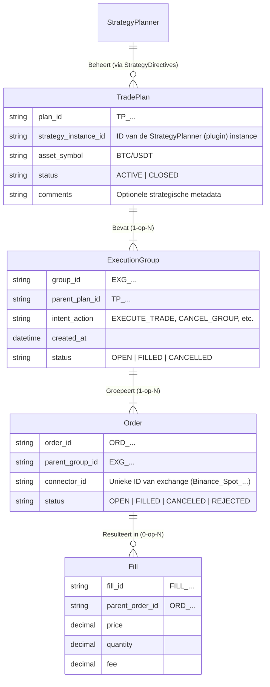

# **Trade Lifecycle & Architectuur - S1mpleTraderV3**

Status: Concept (Werkdocument)  
Versie: 0.1  
Doel: Dit document is een aanvulling op PIPELINE_FLOW.md en EXECUTION_FLOW.md. Het definieert de data-hiërarchie, de levenscyclus-scopes en de interactiepatronen tussen strategische plugins en platformcomponenten.

## **1. De Data Hiërarchie (Nesting)**

De levenscyclus van een strategie wordt niet beheerd door één "Trade DTO" die door de pijplijn reist, maar door een strikte hiërarchie van **Persisted Entities** in de StrategyLedger. Dit waarborgt een duidelijke scheiding van verantwoordelijkheden.

### **1.1. Container Structuur**

### **1.2. Ownership Matrix (Wie Werkt Met Wat?)**

| Niveau | Entiteit | Eigenaar (Write/Manage) | Consument (Read) | Omschrijving |
| :---- | :---- | :---- | :---- | :---- |
| **Strategisch** | **TradePlan** | StrategyPlanner (indirect) / StrategyLedger | StrategyPlanner (Self) | De langlopende container die de *volledige* strategie (bijv. Grid, DCA) omvat. Wordt aangemaakt door de Ledger bij de *eerste* ExecutionGroup. |
| **Tactisch** | **ExecutionGroup** | ExecutionTranslator | StrategyPlanner (Read-only Ref), StrategyLedger | Een logische set van 1-N orders die voortkomt uit **één** StrategyDirective. Dit is de atomaire eenheid van tactische uitvoering (bijv. "één TWAP-run"). |
| **Operationeel** | **Order** | ExecutionHandler | ExchangeConnector | De daadwerkelijke, concrete instructie aan de exchange. Bevat geen strategische context. |
| **Resultaat** | **Fill** | ExchangeConnector (via Async Flow) | StrategyLedger | De onveranderlijke, harde realiteit (waarheid) vanuit de markt. [cite: Async Exchange Reply Flow (Fills/Rejections → Trade Reality)] |

## **2. Toegangsniveaus & StrategyLedger API**

De StrategyLedger is een **"domme" toegangspoort** tot het grootboek en waarborgt SRP. Intelligentie bevindt zich *buiten* de Ledger. Componenten krijgen toegang op basis van hun rol.

### **Level 1: High-Level Access (Strategie Domein)**

* **Gebruiker:** StrategyPlanner (Plugin, de "Generaal").  
* **Rechten:** Mag *abstracte* TradePlan en ExecutionGroup data lezen.  
* **Verboden:** Mag **nooit** individuele Order objecten direct schrijven of wijzigen.  
* **Voorbeeld Methods:**  
  * ledger.get_active_trade_plan(strategy_instance_id): Haalt de "container" op.  
  * ledger.get_execution_groups(plan_id): Geeft een lijst van ExecutionGroup DTOs (ID, status).  
  * ledger.get_net_position(plan_id): Berekent de *huidige* exposure voor dit plan.

### **Level 2: Mid-Level Access (Translatie Domein)**

* **Gebruiker:** ExecutionTranslator (Platform, de "Uitpakker").  
* **Rechten:** Slaat de brug tussen abstracte groepen en concrete orders.  
* **Taak:** Moet weten welke Order IDs bij ExecutionGroup X horen om een CANCEL_GROUP commando te kunnen bouwen. [cite: Fase 4c: EXECUTION TRANSLATION]  
* **Voorbeeld Methods:**  
  * ledger.get_open_order_ids(group_id): Geeft lijst ["ORD_A", "ORD_B"].  
  * ledger.register_execution_group(group_dto)

### **Level 3: Low-Level Access (Executie Domein)**

* **Gebruiker:** ExecutionHandler (Platform, de "Uitvoerder").  
* **Rechten:** Schrijft de *feitelijke* Order en Fill data weg.  
* **Voorbeeld Methods:**  
  * ledger.register_order(order_dto)  
  * ledger.update_order_status(order_id, status)  
  * ledger.register_fill(fill_dto)

## **3. ExecutionIntent Commando Lijst**

De ExecutionIntent (DTO) bevat **operationele commando's**, geen strategische logica. Het is de output van de ExecutionPlanner (4th TradePlanner) en de input voor de ExecutionTranslator (Platform). [cite: ExecutionIntent - Universal Trade-Offs]

Een "Grid" is strategie (en dus onbekend voor de Translator). EXECUTE_TRADE is een operatie.

### **Uitputtende Lijst van ExecutionAction (Enum):**

#### **A. Creatie Commando's**

* **EXECUTE_TRADE**  
  * **Betekenis:** "Plaats nieuwe orders volgens de bijgevoegde Entry/Size/Exit plannen."  
  * **Context:** Wordt gebruikt bij scope=NEW_TRADE (nieuwe entry) of scope=CLOSE_EXISTING (nieuwe close-order).  
  * **Gevolg:** Translator maakt 1-op-N ConnectorExecutionSpec(s) aan (bijv. voor een TWAP).

#### **B. Annulerings Commando's**

* **CANCEL_GROUP**  
  * **Betekenis:** "Annuleer alle openstaande (niet-gevulde) orders die behoren bij deze TargetGroupID."  
  * **Context:** Gebruikt bij scope=MODIFY_EXISTING. Bijv. StrategyPlanner trekt een specifieke set grid-orders in.  
  * **Gevolg:** Translator roept ledger.get_open_order_ids(group_id) aan en bouwt een ConnectorExecutionSpec met annuleringsverzoeken.  
* **CANCEL_ALL_IN_PLAN**  
  * **Betekenis:** "Noodstop. Annuleer *alle* openstaande orders binnen het TargetPlanID."  
  * **Context:** Gebruikt bij scope=CLOSE_EXISTING (Panic/Crash).  
  * **Gevolg:** Translator roept ledger.get_open_order_ids aan voor *elke actieve groep* in het plan.

#### **C. Modificatie Commando's**

* **MODIFY_ORDERS**  
  * **Betekenis:** "Pas parameters aan (bijv. prijs, hoeveelheid) van bestaande, open orders in TargetGroupID."  
  * **Context:** Gebruikt bij scope=MODIFY_EXISTING (bijv. Trailing Stop). Vereist dat de ExitPlan (of EntryPlan) de nieuwe parameters meelevert.  
  * **Gevolg:** Translator genereert cancel_replace of modify API calls.

## **4. De Lifecycle Scopes (De "WHAT")**

De StrategyDirective.scope is de **dwingende opdracht** (de "WHAT") van de StrategyPlanner (de "Generaal"). [cite: Fase 3: STRATEGY PLANNING (Confrontatie)] Dit is *geen* hint. Het dicteert hoe de downstream TradePlanner (Specialisten) zich moeten gedragen.

### **Scope 1: NEW_TRADE (Creation)**

* **Opdracht:** Creëer nieuwe exposure.  
* **Reactie Planners:**  
  * Entry/Size/Exit/Routing: Alle planners zijn "actief" en in hun *Core Business*. Ze bepalen **HOE** de nieuwe positie wordt gecreëerd.

### **Scope 2: MODIFY_EXISTING (Mutation)**

* **Opdracht:** Wijzig een bestaande TradePlan of ExecutionGroup.  
* **Reactie Planners:**  
  * Entry/Size: Meestal passief (doen niets).  
  * Exit: Actief als de SL/TP wordt aangepast.  
  * Routing: Actief om de urgentie van de *wijziging* te bepalen.  
* **Voorbeeld:** Een Trailing Stop StrategyPlanner stuurt scope=MODIFY_EXISTING met een exit_hint (nieuwe SL). Alleen de ExitPlanner en ExecutionPlanner reageren hierop.

### **Scope 3: CLOSE_EXISTING (Termination)**

* **Opdracht:** Breng exposure naar nul en/of annuleer openstaande orders.  
* **Reactie Planners:** De planners opereren nu in "Close" modus.  
  * Entry: Forceert vaak MARKET type.  
  * Size: Slaat (via Ledger query) 100% van de netPositionSize voor.  
  * Exit: Genereert plannen om alle openstaande SL/TP orders te annuleren.  
  * Routing: Stelt urgentie in (meestal hoog).

## **5. Herbruikbaarheid (Het Base Class Patroon)**

Om een "explosie van specialisten" (bijv. NewEntryPlanner, ModifyEntryPlanner, CloseEntryPlanner) te voorkomen, wordt herbruikbaarheid afgedwongen via **Abstracte Base Classes** van het platform.

De TradePlanner (Specialist Plugin) erft van een base class en implementeert alleen de logica die relevant is voor zijn specialisme.

# Voorbeeld: Base Class voor een EntryPlanner  
class BaseEntryPlanner(ABC):

    def plan(self, directive: StrategyDirective) -> Optional[EntryPlan]:  
        """  
        De Master Method die de pipeline aanroept.  
        Deze logica zit in het platform, NIET in de plugin.  
        """  
        if directive.scope == StrategyScope.NEW_TRADE:  
            # Quant's logica wordt aangeroepen  
            return self.on_new_trade(directive)   
              
        elif directive.scope == StrategyScope.MODIFY_EXISTING:  
            # Default: doe niets bij een 'modify'  
            return self.on_modify_trade(directive)   
              
        elif directive.scope == StrategyScope.CLOSE_EXISTING:  
            # Default: genereer een 'Market Sell' plan  
            return self.on_close_trade(directive)   
              
        return None

    # --- Methoden voor de Quant om te implementeren ---

    @abstractmethod  
    def on_new_trade(self, directive: StrategyDirective) -> EntryPlan:  
        """  
        Quant implementeert DIT (Core Business).  
        Bijv. "Bereken RSI en return een Limit order plan."  
        """  
        pass

    def on_modify_trade(self, directive: StrategyDirective) -> Optional[EntryPlan]:  
        """  
        Quant kan dit overriden.  
        Default (in Base Class): return None  
        """  
        return None   
          
    def on_close_trade(self, directive: StrategyDirective) -> EntryPlan:  
        """  
        Quant kan dit overriden (bijv. voor een 'Limit' close).  
        Default (in Base Class): return EntryPlan(order_type="MARKET")  
        """  
        return EntryPlan(order_type="MARKET", direction=...) # Bepaal 'direction' o.b.v. size  
