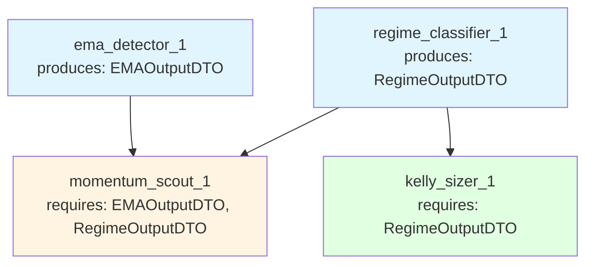

# Wiring Flexibility vs. Dependency Constraints - Deep Dive

**Date:** 2025-10-30  
**Question:** Kan een strategie met dezelfde blueprint maar andere wiring werken? Wat zijn de grenzen?

---

## TL;DR: Antwoord

**JA, wiring kan variëren** - MAAR met strikte constraints:

1. ✅ **Event wiring** (EventBus) = 100% flexibel (geen dependencies)
2. ⚠️ **DTO wiring** (TickCache) = BEPERKT flexibel (dependency graph constraints)
3. ❌ **Worker removal** = MEESTAL onmogelijk (dependency violations)

**Bottom Line:** Wiring flexibility stopt waar DTO dependencies beginnen.

---

## De Twee Wiring Domeinen

### 1. EventBus Wiring (100% Flexibel)

**Wat:** Workers die luisteren naar events en publishen

**Dependency Type:** GEEN - events zijn broadcasts zonder contracten

**Example:**
```yaml
# Wiring Variant A
wiring:
  - source: 
      event: "SIGNAL_DETECTED"
    target:
      worker_id: "momentum_planner_1"
      method: "process"

# Wiring Variant B (ANDERS maar VALID)
wiring:
  - source:
      event: "CUSTOM_TRIGGER"  # Ander event
    target:
      worker_id: "momentum_planner_1"
      method: "process"
```

**Waarom Flexibel?**
- Events zijn **opt-in subscribers** (worker beslist of hij luistert)
- Geen contractuele verplichting (worker werkt ook zonder events)
- Publisher weet niet wie luistert (loose coupling)

**Use Case: Verschillende triggers**
```yaml
# Backtest: Trigger op scheduled ticks
wiring_backtest.yaml:
  - source: { event: "TICK_FLOW_START" }
    target: { worker_id: "ema_detector_1", method: "process" }

# Live: Trigger op price change threshold
wiring_live.yaml:
  - source: { event: "PRICE_CHANGE_THRESHOLD" }
    target: { worker_id: "ema_detector_1", method: "process" }
```

**Conclusie:** EventBus wiring = **FULLY FLEXIBLE** ✅

---

### 2. DTO Wiring (Beperkt Flexibel)

**Wat:** Workers die DTOs produceren/consumeren via TickCache

**Dependency Type:** HARD CONTRACT - `requires_dtos` in manifest

**Example:**
```yaml
# momentum_scout manifest
dependencies:
  requires_dtos:
    - source: "backend.dto_reg.s1mple.ema_detector.v1_0_0.ema_output_dto"
      dto_class: "EMAOutputDTO"
    - source: "backend.dto_reg.s1mple.regime_classifier.v1_0_0.regime_output_dto"
      dto_class: "RegimeOutputDTO"
```

**Constraint:** Als `momentum_scout` in workforce zit, dan MOETEN deze DTOs aanwezig zijn in TickCache.

**Dit betekent:**
1. ✅ Producer workers MOETEN in workforce (ema_detector, regime_classifier)
2. ✅ Producer workers MOETEN vóór consumer executed worden (ordering)
3. ❌ Je KUNT NIET momentum_scout toevoegen zonder zijn dependencies

---

## Wiring Flexibility Matrix

| Scenario | Mogelijk? | Constraints | Example |
|----------|-----------|-------------|---------|
| **Wijzig event names** | ✅ JA | Geen | `TICK_FLOW_START` → `CUSTOM_TRIGGER` |
| **Wijzig execution order (event-driven)** | ✅ JA | Geen | Worker A eerst → Worker B eerst |
| **Wijzig execution order (DTO-driven)** | ⚠️ SOMS | Dependency graph moet respected worden | ❌ momentum_scout vóór ema_detector |
| **Voeg extra worker toe (no deps)** | ✅ JA | Geen | Extra RiskMonitor zonder requires_dtos |
| **Voeg extra worker toe (with deps)** | ⚠️ SOMS | Dependencies MOETEN satisfied zijn | ❌ Zonder producers in workforce |
| **Verwijder worker (no consumers)** | ✅ JA | Geen | Verwijder RiskMonitor die niemand nodig heeft |
| **Verwijder worker (has consumers)** | ❌ NEE | Dependency violation | ❌ Verwijder ema_detector terwijl momentum_scout het nodig heeft |
| **Vervang worker (zelfde DTO)** | ✅ JA | Nieuwe worker MOET zelfde DTO produceren | EMADetector v1 → EMADetector v2 |
| **Vervang worker (andere DTO)** | ❌ NEE | DTO contract breuk | EMAOutputDTO → SMAOutputDTO breaks consumers |

---

## Deep Dive: Dependency Graph Constraints

### Example Workforce

```yaml
workforce:
  context_workers:
    - worker_id: "ema_detector_1"
      plugin: "s1mple/ema_detector/v1.0.0"
      # produces: EMAOutputDTO
    
    - worker_id: "regime_classifier_1"
      plugin: "s1mple/regime_classifier/v1.0.0"
      # produces: RegimeOutputDTO
  
  signal_detectors:
    - worker_id: "momentum_scout_1"
      plugin: "s1mple/momentum_signal/v1.0.0"
      # requires: EMAOutputDTO, RegimeOutputDTO
  
  planning_workers:
    - worker_id: "kelly_sizer_1"
      plugin: "s1mple/kelly_sizer/v1.0.0"
      # requires: RegimeOutputDTO (for volatility adjustment)
```

### Dependency Graph



### Wiring Scenario's

#### ✅ Scenario 1: Wijzig Event Triggers (VALID)

**Original Wiring:**
```yaml
wiring:
  - source: { event: "TICK_FLOW_START" }
    target: { worker_id: "ema_detector_1", method: "process" }
  
  - source: { event: "TICK_FLOW_START" }
    target: { worker_id: "regime_classifier_1", method: "process" }
  
  - source: { worker_id: "ema_detector_1", disposition: "CONTINUE" }
    target: { worker_id: "momentum_scout_1", method: "process" }
```

**Variant Wiring (Backtest vs. Live):**
```yaml
# Backtest: Alle workers starten op scheduled tick
wiring_backtest.yaml:
  - source: { event: "TICK_FLOW_START" }
    target: { worker_id: "ema_detector_1", method: "process" }
  
  - source: { event: "TICK_FLOW_START" }
    target: { worker_id: "regime_classifier_1", method: "process" }
  
  - source: { event: "CONTEXT_COMPLETE" }  # Custom event na alle context workers
    target: { worker_id: "momentum_scout_1", method: "process" }

# Live: Ema alleen op price change, regime op schedule
wiring_live.yaml:
  - source: { event: "PRICE_CHANGE_0.1%" }  # High-frequency trigger
    target: { worker_id: "ema_detector_1", method: "process" }
  
  - source: { event: "HOURLY_SCHEDULE" }  # Low-frequency trigger
    target: { worker_id: "regime_classifier_1", method: "process" }
  
  - source: { event: "REGIME_UPDATED" }  # Regime signals readiness
    target: { worker_id: "momentum_scout_1", method: "process" }
```

**Waarom Valid?**
- Event names zijn arbitrary (geen contract)
- Workers zijn event-agnostic (luisteren alleen naar configured events)
- DTO dependencies blijven satisfied (producers draaien vóór consumers)

**Use Case:** Performance optimization (live vs. backtest execution frequency)

---

#### ⚠️ Scenario 2: Wijzig Execution Order (VALID maar BEPERKT)

**Original Order:**
1. `ema_detector_1` → Publishes EMAOutputDTO
2. `regime_classifier_1` → Publishes RegimeOutputDTO
3. `momentum_scout_1` → Reads both DTOs

**Variant Order (VALID):**
1. `regime_classifier_1` → Publishes RegimeOutputDTO
2. `ema_detector_1` → Publishes EMAOutputDTO
3. `momentum_scout_1` → Reads both DTOs

**Waarom Valid?**
- Beide producers draaien **vóór** consumer
- DTO dependencies satisfied

**Variant Order (INVALID):**
1. `momentum_scout_1` ❌ → Probeert DTOs te lezen (NIET AANWEZIG!)
2. `ema_detector_1` → Publishes EMAOutputDTO (TE LAAT)
3. `regime_classifier_1` → Publishes RegimeOutputDTO (TE LAAT)

**Waarom Invalid?**
- Consumer draait vóór producers
- `get_required_dtos()` faalt (DTOs missing in TickCache)

**Conclusie:** Execution order flexibel **BINNEN dependency constraints** ⚠️

---

#### ❌ Scenario 3: Verwijder Context Worker (INVALID)

**Original Workforce:**
```yaml
context_workers:
  - worker_id: "ema_detector_1"  # Produces EMAOutputDTO
  - worker_id: "regime_classifier_1"  # Produces RegimeOutputDTO

signal_detectors:
  - worker_id: "momentum_scout_1"  # Requires: EMAOutputDTO, RegimeOutputDTO
```

**Variant (Verwijder ema_detector):**
```yaml
context_workers:
  - worker_id: "regime_classifier_1"  # Produces RegimeOutputDTO
  # ema_detector REMOVED ❌

signal_detectors:
  - worker_id: "momentum_scout_1"  # Requires: EMAOutputDTO ← MISSING!
```

**Result:** Bootstrap FAILURE
```python
# DependencyValidator throws:
DependencyViolation: Worker 'momentum_scout_1' requires DTO 'EMAOutputDTO' 
                     but no producer found in workforce.
```

**Waarom Invalid?**
- `momentum_scout_1.manifest.requires_dtos` bevat `EMAOutputDTO`
- Geen worker in workforce produceert `EMAOutputDTO`
- **Hard contract violation**

**Conclusie:** Worker removal ALLEEN mogelijk als geen consumers ❌

---

#### ✅ Scenario 4: Vervang Worker (Zelfde DTO Contract)

**Original:**
```yaml
context_workers:
  - worker_id: "ema_detector_1"
    plugin: "s1mple/ema_detector/v1.0.0"
    # produces: EMAOutputDTO (fast_period, slow_period)
```

**Variant (Upgrade to v2):**
```yaml
context_workers:
  - worker_id: "ema_detector_2"
    plugin: "s1mple/ema_detector/v2.0.0"  # NEW version
    # produces: EMAOutputDTO (SAME DTO, improved calculation)
```

**Waarom Valid?**
- DTO contract **identiek** (EMAOutputDTO schema unchanged)
- Consumer (`momentum_scout_1`) krijgt nog steeds EMAOutputDTO
- Implementatie details irrelevant (consumer ziet alleen DTO)

**Use Case:** Plugin upgrades, A/B testing (verschillende implementaties, zelfde contract)

---

#### ❌ Scenario 5: Vervang Worker (Ander DTO Contract)

**Original:**
```yaml
context_workers:
  - worker_id: "ema_detector_1"
    plugin: "s1mple/ema_detector/v1.0.0"
    # produces: EMAOutputDTO
```

**Variant (Vervang met SMA):**
```yaml
context_workers:
  - worker_id: "sma_detector_1"
    plugin: "s1mple/sma_detector/v1.0.0"
    # produces: SMAOutputDTO ❌ (DIFFERENT DTO!)
```

**Result:** Bootstrap FAILURE
```python
# DependencyValidator throws:
DependencyViolation: Worker 'momentum_scout_1' requires DTO 'EMAOutputDTO' 
                     but no producer found in workforce.
                     Found: SMAOutputDTO (incompatible)
```

**Waarom Invalid?**
- Consumer verwacht `EMAOutputDTO` (manifest contract)
- Producer levert `SMAOutputDTO` (andere class)
- DTO types MUST match exactly

**Conclusie:** Worker replacement ALLEEN met identiek DTO contract ❌

---

## Complexe Scenario's: Rewiring Context Workers

### Vraag: Kan je context workers ANDERS bedraden tussen environments?

**Answer:** JA, maar met strikte grenzen:

#### ✅ VALID: Wijzig Event Triggers

**Backtest Wiring (Sequential):**
```yaml
wiring_backtest.yaml:
  - source: { event: "TICK_FLOW_START" }
    target: { worker_id: "ema_detector_1" }
  
  - source: { worker_id: "ema_detector_1", disposition: "CONTINUE" }
    target: { worker_id: "regime_classifier_1" }
  
  - source: { worker_id: "regime_classifier_1", disposition: "CONTINUE" }
    target: { worker_id: "volatility_analyzer_1" }
```

**Live Wiring (Parallel + Conditional):**
```yaml
wiring_live.yaml:
  # All context workers triggered simultaneously
  - source: { event: "TICK_FLOW_START" }
    target: { worker_id: "ema_detector_1" }
  
  - source: { event: "TICK_FLOW_START" }
    target: { worker_id: "regime_classifier_1" }
  
  # Volatility alleen als regime = VOLATILE
  - source: { event: "REGIME_VOLATILE" }
    target: { worker_id: "volatility_analyzer_1" }
```

**Waarom Valid?**
- Event triggers zijn flexibel (geen DTO dependencies)
- Alle producers draaien vóór consumers (order preserved)
- Conditional execution (volatility_analyzer optioneel)

**Use Case:** Performance (backtest = sequential, live = parallel execution)

---

#### ⚠️ COMPLEX: Conditional Worker Execution

**Scenario:** Volatility analyzer alleen in live, NIET in backtest

**Backtest Workforce:**
```yaml
context_workers:
  - worker_id: "ema_detector_1"  # Produces EMAOutputDTO
  - worker_id: "regime_classifier_1"  # Produces RegimeOutputDTO
  # NO volatility_analyzer

signal_detectors:
  - worker_id: "momentum_scout_1"  # Requires: EMAOutputDTO, RegimeOutputDTO (OK!)
```

**Live Workforce:**
```yaml
context_workers:
  - worker_id: "ema_detector_1"  # Produces EMAOutputDTO
  - worker_id: "regime_classifier_1"  # Produces RegimeOutputDTO
  - worker_id: "volatility_analyzer_1"  # Produces VolatilityDTO (EXTRA!)

signal_detectors:
  - worker_id: "momentum_scout_1"  # Requires: EMAOutputDTO, RegimeOutputDTO
  - worker_id: "high_vol_breakout_scout_1"  # Requires: VolatilityDTO (EXTRA!)
```

**Waarom Valid?**
- Backtest: Minimale workforce (alleen required workers)
- Live: Extended workforce (extra workers voor advanced signals)
- Dependencies satisfied in BOTH environments

**Key Insight:** Workforce kan UITBREIDEN over environments, maar **dependency contracts blijven strict**

---

#### ❌ INVALID: Remove Required Dependencies

**Scenario:** Verwijder regime_classifier in live (sneller, minder computation)

**Backtest (Original):**
```yaml
context_workers:
  - worker_id: "ema_detector_1"
  - worker_id: "regime_classifier_1"  # Produces RegimeOutputDTO

signal_detectors:
  - worker_id: "momentum_scout_1"  # Requires: RegimeOutputDTO
```

**Live (Simplified - INVALID):**
```yaml
context_workers:
  - worker_id: "ema_detector_1"
  # regime_classifier REMOVED ❌

signal_detectors:
  - worker_id: "momentum_scout_1"  # Requires: RegimeOutputDTO ← MISSING!
```

**Result:** Bootstrap FAILURE (dependency violation)

**Alternative (VALID):**
```yaml
# Live: Replace heavy regime_classifier with lightweight version
context_workers:
  - worker_id: "ema_detector_1"
  - worker_id: "simple_regime_classifier_1"  # Produces RegimeOutputDTO (lighter impl)

signal_detectors:
  - worker_id: "momentum_scout_1"  # Requires: RegimeOutputDTO ← SATISFIED!
```

**Key Insight:** Dependencies KUNNEN NIET verwijderd worden, alleen vervangen (zelfde DTO contract)

---

## Roet in het Eten: De Dependency Graph Beperkingen

### Fundamentele Constraints

```python
# DependencyValidator (bootstrap check)
class DependencyValidator:
    def validate_workforce(self, workforce: Workforce) -> ValidationResult:
        # 1. Build dependency graph
        graph = self._build_dependency_graph(workforce)
        
        # 2. Check for missing producers
        for worker in workforce.all_workers:
            for required_dto in worker.manifest.requires_dtos:
                if not graph.has_producer(required_dto):
                    raise DependencyViolation(
                        f"Worker '{worker.id}' requires DTO '{required_dto}' "
                        f"but no producer found in workforce."
                    )
        
        # 3. Check for circular dependencies
        if graph.has_cycles():
            raise CircularDependency("DTO dependency cycle detected")
        
        # 4. Validate execution order
        topological_order = graph.topological_sort()
        return ValidationResult(valid=True, execution_order=topological_order)
```

### Wat Dit Betekent voor Wiring

**Hard Rules:**
1. ✅ Event wiring = FULLY flexible (geen dependencies)
2. ❌ DTO dependencies = IMMUTABLE (manifest-declared contracts)
3. ⚠️ Execution order = Flexibel BINNEN topological constraints
4. ❌ Worker removal = ONLY if no downstream consumers
5. ✅ Worker addition = ONLY if dependencies satisfied
6. ✅ Worker replacement = ONLY if DTO contract identical

---

## Practical Examples: Backtest vs. Live Rewiring

### Example 1: Performance Optimization (VALID ✅)

**Backtest (Sequential, Heavy Computation):**
```yaml
workforce:
  context_workers:
    - worker_id: "ema_20_50"  # Fast + Slow EMA
    - worker_id: "regime_ml_classifier"  # ML-based regime (slow)
    - worker_id: "support_resistance_ml"  # ML-based S/R (slow)

wiring:
  # Sequential execution (one after another)
  - source: { event: "TICK_FLOW_START" }
    target: { worker_id: "ema_20_50" }
  - source: { worker_id: "ema_20_50", disposition: "CONTINUE" }
    target: { worker_id: "regime_ml_classifier" }
  - source: { worker_id: "regime_ml_classifier", disposition: "CONTINUE" }
    target: { worker_id: "support_resistance_ml" }
```

**Live (Parallel, Lightweight):**
```yaml
workforce:
  context_workers:
    - worker_id: "ema_20_50"  # Fast + Slow EMA
    - worker_id: "regime_simple_classifier"  # Rule-based (fast!)
    - worker_id: "support_resistance_simple"  # Price-level based (fast!)

wiring:
  # Parallel execution (all triggered simultaneously)
  - source: { event: "TICK_FLOW_START" }
    target: { worker_id: "ema_20_50" }
  - source: { event: "TICK_FLOW_START" }
    target: { worker_id: "regime_simple_classifier" }
  - source: { event: "TICK_FLOW_START" }
    target: { worker_id: "support_resistance_simple" }
```

**Key Changes:**
- Worker replacement: ML → Simple (SAME DTO contracts!)
- Wiring: Sequential → Parallel (event triggers)

**Why VALID:**
- DTO contracts identical (RegimeOutputDTO, SupportResistanceDTO)
- Dependencies satisfied
- Performance optimized per environment

---

### Example 2: Feature Gating (VALID ✅)

**Backtest (Minimal):**
```yaml
workforce:
  context_workers:
    - worker_id: "ema_detector"  # EMAOutputDTO
  
  signal_detectors:
    - worker_id: "simple_breakout_scout"  # Requires: EMAOutputDTO
```

**Live (Feature-Rich):**
```yaml
workforce:
  context_workers:
    - worker_id: "ema_detector"  # EMAOutputDTO
    - worker_id: "order_flow_analyzer"  # OrderFlowDTO (EXTRA!)
    - worker_id: "sentiment_tracker"  # SentimentDTO (EXTRA!)
  
  signal_detectors:
    - worker_id: "simple_breakout_scout"  # Requires: EMAOutputDTO
    - worker_id: "dark_pool_scout"  # Requires: OrderFlowDTO (EXTRA!)
    - worker_id: "sentiment_reversal_scout"  # Requires: SentimentDTO (EXTRA!)
```

**Why VALID:**
- Backtest: Minimal workforce (baseline testing)
- Live: Extended workforce (production features)
- No dependency violations (extra workers independent)

---

### Example 3: DTO Substitution (INVALID ❌)

**Backtest:**
```yaml
workforce:
  context_workers:
    - worker_id: "ema_detector"  # Produces: EMAOutputDTO
  
  signal_detectors:
    - worker_id: "ema_cross_scout"  # Requires: EMAOutputDTO
```

**Live (ATTEMPT: Replace EMA with SMA):**
```yaml
workforce:
  context_workers:
    - worker_id: "sma_detector"  # Produces: SMAOutputDTO ❌
  
  signal_detectors:
    - worker_id: "ema_cross_scout"  # Requires: EMAOutputDTO ← MISSING!
```

**Result:** Bootstrap FAILURE
```
DependencyViolation: Worker 'ema_cross_scout' requires 'EMAOutputDTO'
                     but found 'SMAOutputDTO' (incompatible)
```

**Why INVALID:**
- DTO contract breach (EMA → SMA different types)
- Consumer expects specific DTO class

**Solution (VALID):**
```yaml
workforce:
  context_workers:
    - worker_id: "ma_detector_adaptive"  # Produces: EMAOutputDTO (SMA impl internally)
  
  signal_detectors:
    - worker_id: "ema_cross_scout"  # Requires: EMAOutputDTO ← SATISFIED!
```

**Key:** Worker implementation kan SMA gebruiken INTERN, maar moet EMAOutputDTO produceren (contract compliance)

---

## Conclusie: De Grenzen van Wiring Flexibility

### ✅ FLEXIBEL (Zonder Roet)

1. **Event triggers wijzigen**
   - Backtest: `TICK_FLOW_START`
   - Live: `PRICE_CHANGE_THRESHOLD`
   - Geen DTO dependencies betrokken

2. **Execution order wijzigen (binnen constraints)**
   - ContextWorker A vóór B → B vóór A (beide producers)
   - Constraint: Producers vóór consumers

3. **Workers toevoegen (met satisfied dependencies)**
   - Extra ContextWorker zonder consumers
   - Extra SignalDetector met alle required DTOs aanwezig

4. **Workers vervangen (zelfde DTO contract)**
   - EMADetector v1 → v2 (produces EMAOutputDTO)
   - MLRegime → SimpleRegime (produces RegimeOutputDTO)

5. **Parallel vs. Sequential execution**
   - Event-driven: Alle workers tegelijk triggeren
   - Chain-driven: Workers één voor één

---

### ❌ NIET FLEXIBEL (Dependency Roet)

1. **Workers verwijderen (met consumers)**
   - EMADetector removed → EMA-dependent workers broken
   - **Hard constraint:** DTO contracts MUST be satisfied

2. **DTO substitution**
   - EMAOutputDTO → SMAOutputDTO (different types)
   - Consumer manifest = hard contract

3. **Execution order violation**
   - Consumer vóór producer
   - TickCache leeg = runtime failure

4. **Circular dependencies**
   - Worker A requires DTO from Worker B
   - Worker B requires DTO from Worker A
   - Bootstrap rejection

---

### ⚠️ BEPERKT FLEXIBEL (Met Zorg)

1. **Conditional worker execution**
   - Worker alleen in live, niet in backtest
   - **Constraint:** Downstream dependencies MOETEN satisfied blijven

2. **Feature gating**
   - Backtest: Minimale workforce
   - Live: Extended workforce
   - **Constraint:** Baseline dependencies altijd aanwezig

3. **Performance variants**
   - Backtest: Heavy ML workers
   - Live: Lightweight rule-based workers
   - **Constraint:** DTO contracts IDENTICAL

---

## Architectuur Implicatie: Dependency-Aware Wiring

### Design Recommendation

**Wiring MOET dependency-aware zijn:**

```python
# ConfigValidator moet BEIDE checken:
class WiringValidator:
    def validate_wiring(
        self, 
        workforce: Workforce, 
        wiring: WiringConfig
    ) -> ValidationResult:
        # 1. Event wiring validation (altijd OK)
        self._validate_event_wiring(wiring)
        
        # 2. DTO dependency validation (STRICT!)
        dependency_graph = DependencyGraph(workforce)
        execution_order = wiring.derive_execution_order()
        
        for worker in execution_order:
            for required_dto in worker.manifest.requires_dtos:
                # Check: Producer MUST have executed before consumer
                producer = dependency_graph.find_producer(required_dto)
                if not execution_order.is_before(producer, worker):
                    raise ExecutionOrderViolation(
                        f"Worker '{worker.id}' requires '{required_dto}' "
                        f"but producer '{producer.id}' executes AFTER consumer."
                    )
```

---

## Final Answer

**Kan een strategie met andere wiring werken?**

**JA - Binnen grenzen:**

1. **Event wiring** = 100% flexibel
   - Triggers, frequencies, conditions kunnen volledig verschillen
   - Backtest vs. Live: Sequential vs. Parallel execution
   - Performance optimizations

2. **DTO wiring** = Beperkt flexibel
   - Workers KUNNEN toegevoegd/vervangen worden
   - **MAAR:** DTO contracts zijn IMMUTABLE (manifest-declared)
   - Dependency graph MOET respected worden

3. **Roet in het eten?**
   - ✅ **NIET** voor event-driven wiring (fully flexible)
   - ❌ **WEL** voor DTO-driven wiring (strict contracts)

**Bottom Line:** Wiring flexibility eindigt waar DTO dependencies beginnen. EventBus = vrij, TickCache = gebonden.

---

## Aanbeveling voor Design

**Twee wiring files per environment:**

```yaml
# Base wiring (DTO-agnostic, environment-shared)
base_wiring.yaml:
  # Core dependency chain (IMMUTABLE)
  - source: { event: "TICK_FLOW_START" }
    target: { worker_id: "ema_detector" }
  
  - source: { worker_id: "ema_detector", disposition: "CONTINUE" }
    target: { worker_id: "momentum_scout" }

# Environment-specific wiring (event triggers)
wiring_backtest.yaml:
  extends: base_wiring.yaml
  overrides:
    - trigger_frequency: "1h"  # Scheduled ticks
    - execution_mode: "sequential"

wiring_live.yaml:
  extends: base_wiring.yaml
  overrides:
    - trigger_frequency: "price_change_0.1%"  # Event-driven
    - execution_mode: "parallel"
```

**Rationale:**
- Base wiring = DTO dependency chain (immutable)
- Environment wiring = Event triggers (flexible)
- Clear separation = veilige flexibility

