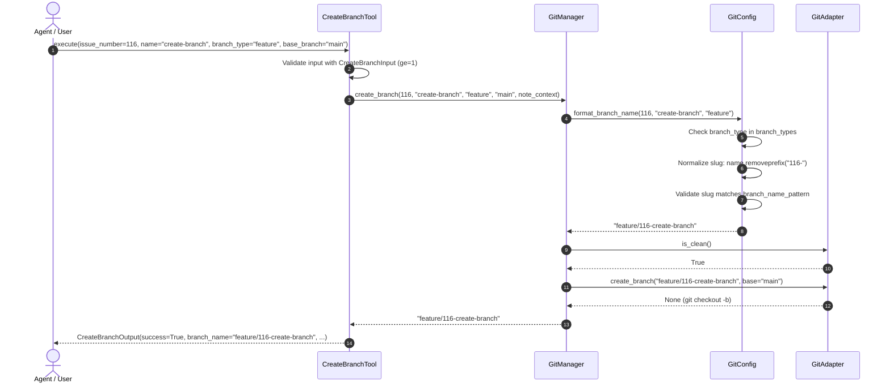

<!-- docs/development/issue116/design.md -->
<!-- template=design version=5827e841 created=2026-08-19T14:21Z updated=2026-08-19T14:25Z -->
# Design: Automatic Issue Number Formatting in create_branch Tool

**Status:** APPROVED  
**Version:** 1.0.0  
**Last Updated:** 2026-08-19

---

## Purpose

Define the concrete architectural design, interface contracts, data flow, error handling, and test migration strategy for adding automatic issue number formatting with a mandatory `issue_number` parameter to `create_branch`.

## Scope

**In Scope:**
- `CreateBranchInput` Pydantic model in `mcp_server/tools/git_tools.py`
- `CreateBranchTool` in `mcp_server/tools/git_tools.py`
- `GitConfig` schema value object in `mcp_server/config/schemas/git_config.py`
- `GitManager.create_branch` method in `mcp_server/managers/git_manager.py`
- Full test suite migration for all call sites in the blast radius

**Out of Scope:**
- Changes to other git tools (`git_checkout`, `git_merge`, `git_delete_branch`, etc.)
- Ambient state detection of issue numbers during `create_branch`
- Modification of unrelated configuration files

## Prerequisites

Read these first:
1. Read [docs/development/issue116/research.md](docs/development/issue116/research.md)
2. Read [docs/coding_standards/ARCHITECTURE_PRINCIPLES.md](docs/coding_standards/ARCHITECTURE_PRINCIPLES.md)
3. Read [docs/coding_standards/DOCUMENTATION_STANDARD.md](docs/coding_standards/DOCUMENTATION_STANDARD.md)

---

## 1. Context & Requirements

### 1.1. Problem Statement

The `create_branch` tool currently requires callers to manually prefix issue numbers into branch names (e.g. `name="116-create-branch-issue-number"`), which is error-prone, violates the Issue-First paradigm (Prime Directive #1), and diverges from other lifecycle tools (such as `initialize_project`) where `issue_number` is a mandatory typed parameter.

### 1.2. Requirements

**Functional:**
- `CreateBranchInput` defines `issue_number: int = Field(..., ge=1, description="GitHub issue number")` as a required parameter.
- `GitConfig.format_branch_name(issue_number: int, name: str, branch_type: str) -> str`:
  - Validates `branch_type` via `has_branch_type()`.
  - Normalizes `name` by stripping any redundant leading `{issue_number}-` prefix.
  - Validates the resulting slug against `branch_name_pattern`.
  - Returns `{branch_type}/{issue_number}-{slug}`.
- `GitManager.create_branch(issue_number: int, name: str, branch_type: str, base_branch: str, note_context: NoteContext) -> str`:
  - Delegates branch name formatting and validation to `self._git_config.format_branch_name(issue_number, name, branch_type)`.
  - Validates repository cleanliness (`is_clean`).
  - Calls `self.adapter.create_branch(full_name, base=base_branch)`.
- All tests calling `create_branch` or `CreateBranchInput` are updated to provide `issue_number`.

**Non-Functional:**
- **Fail-fast Validation (§4):** Reject invalid issue numbers (`< 1`), invalid branch types, or invalid branch slug regex matches before executing git operations.
- **Type Safety & Style:** 100% type annotations pass with `mypy --strict` and `pylint 10.00/10`.
- **Architectural Purity & Cohesion (§10, §3):** Git conventions logic lives in `GitConfig` (SSOT), orchestration in `GitManager`, tool entry in `CreateBranchTool`.

### 1.3. Constraints

- Adhere strictly to [docs/coding_standards/ARCHITECTURE_PRINCIPLES.md](docs/coding_standards/ARCHITECTURE_PRINCIPLES.md) (SOLID, DRY/SSOT, Config-First, Law of Demeter, Cohesion §10).
- Follow Approved Strategy: `clean_break` (mandatory `issue_number: int, ge=1`).
- Input schema enrichment via A4 tool property override, with no `ClassVar` or mutation on Pydantic models.
- All test call sites in the blast radius are migrated in the same cycle.

---

## 2. Design Options & Comparison

### Option A: Domain Helper in `GitConfig` (Recommended)

Add `format_branch_name(self, issue_number: int, name: str, branch_type: str) -> str` to `GitConfig`. `GitManager.create_branch` delegates name formatting and convention validation to this helper.

- **Pros:** High cohesion (§10). Mirrors `extract_issue_number` (prior art). Centralizes regex pattern validation and slug normalization in `GitConfig`. Keeps `GitManager` focused on git orchestration.
- **Cons:** Adds one helper method to `GitConfig`.

### Option B: Manager-Internal String Assembly

Perform string manipulation and prefix removal directly inside `GitManager.create_branch()`, calling `validate_branch_name` and `has_branch_type` individually.

- **Pros:** Avoids modifying `GitConfig`.
- **Cons:** Scatters branch naming knowledge between `GitManager` and `GitConfig`. Violates Cohesion (§10) and DRY/SSOT (§2).

| Criterion | Option A: `GitConfig.format_branch_name` | Option B: Manager-Internal Assembly |
|---|---|---|
| **Cohesion (§10)** | ✅ High (Git conventions encapsulated in GitConfig) | ❌ Low (Conventions split across manager and config) |
| **SSOT & DRY (§2)** | ✅ Single location for branch naming rules | ❌ Logic duplicated/fragmented |
| **Prior Art Alignment** | ✅ Direct mirror of `extract_issue_number` | ❌ Inconsistent with repo patterns |
| **Maintainability** | ✅ Easily unit tested in isolation on GitConfig | ❌ Requires mocking manager for naming tests |

---

## 3. Chosen Design & Interface Contracts

**Decision:** Option A — Domain Helper in `GitConfig` with mandatory `issue_number` across tool and manager layers.

### 3.1. Interface Contracts

#### 1. Tool Layer: `mcp_server/tools/git_tools.py`

```python
class CreateBranchInput(BaseModel):
    """Input for CreateBranchTool."""

    model_config = ConfigDict(extra="forbid")

    issue_number: int = Field(..., ge=1, description="GitHub issue number")
    name: str = Field(..., description="Branch name slug (kebab-case)")
    branch_type: str = Field(default="feature", description="Branch type")
    base_branch: str = Field(
        ...,
        description="Base branch to create from (e.g., 'HEAD', 'main', 'refactor/51-labels-yaml')",
    )


class CreateBranchTool(ICoreTool[CreateBranchInput, CreateBranchOutput]):
    # ...
    @property
    def input_schema(self) -> dict[str, Any]:
        assert self.args_model is not None
        schema = self.args_model.model_json_schema()
        schema["properties"]["branch_type"]["enum"] = list(self.manager.git_config.branch_types)
        schema["properties"]["name"]["pattern"] = self.manager.git_config.branch_name_pattern
        return schema

    async def execute(self, params: CreateBranchInput, context: NoteContext) -> CreateBranchOutput:
        branch_name = self.manager.create_branch(
            issue_number=params.issue_number,
            name=params.name,
            branch_type=params.branch_type,
            base_branch=params.base_branch,
            note_context=context,
        )
        return CreateBranchOutput(
            success=True,
            branch_name=branch_name,
            branch_type=params.branch_type,
            base_branch=params.base_branch,
        )
```

#### 2. Config Layer: `mcp_server/config/schemas/git_config.py`

```python
class GitConfig(BaseModel):
    # ... existing fields and validators ...

    def format_branch_name(self, issue_number: int, name: str, branch_type: str) -> str:
        """Format and validate a canonical branch name from components.

        Args:
            issue_number: GitHub issue number (must be >= 1).
            name: Branch name slug in kebab-case (leading issue prefix stripped if present).
            branch_type: Configured branch type (feature, bug, epic, etc.).

        Returns:
            Canonical full branch name (e.g. 'feature/116-create-branch-issue-number').

        Raises:
            ValueError: If issue_number < 1, branch_type is invalid, or slug fails pattern.
        """
        if issue_number < 1:
            raise ValueError(f"Invalid issue number: {issue_number}. Must be >= 1.")

        if not self.has_branch_type(branch_type):
            raise ValueError(
                f"Invalid branch type: '{branch_type}'. Allowed types: {', '.join(self.branch_types)}"
            )

        # Normalize name: strip leading '{issue_number}-' if caller passed it
        slug = name.removeprefix(f"{issue_number}-")

        if not self.validate_branch_name(slug):
            raise ValueError(
                f"Invalid branch name slug: '{slug}'. Must match pattern: {self.branch_name_pattern}"
            )

        return f"{branch_type}/{issue_number}-{slug}"
```

#### 3. Manager Layer: `mcp_server/managers/git_manager.py`

```python
class GitManager:
    # ...
    def create_branch(
        self,
        issue_number: int,
        name: str,
        branch_type: str,
        base_branch: str,
        note_context: NoteContext,
    ) -> str:
        """Create a new branch with explicit issue_number and base_branch."""
        try:
            full_name = self._git_config.format_branch_name(issue_number, name, branch_type)
        except ValueError as exc:
            if not self._git_config.has_branch_type(branch_type):
                note_context.produce(
                    Note(
                        key="allowed_branch_types",
                        params={"types": ", ".join(self._git_config.branch_types)},
                    )
                )
                raise ValidationError(
                    f"Invalid branch type: {branch_type}",
                    error_code="invalid_branch_type",
                    params={"branch_type": branch_type},
                ) from exc

            note_context.produce(
                Note(
                    key="branch_name_pattern_mismatch",
                    params={"pattern": self._git_config.branch_name_pattern},
                )
            )
            raise ValidationError(
                str(exc),
                error_code="invalid_branch_name",
                params={"name": name, "issue_number": issue_number},
            ) from exc

        if not self.adapter.is_clean():
            note_context.produce(
                Note(
                    key="dirty_workspace_branch_blocker",
                    params={},
                )
            )
            raise PreflightError(
                "Working directory is not clean",
                error_code="dirty_workdir",
                params={"branch": self.adapter.get_current_branch()},
            )

        self.adapter.create_branch(full_name, base=base_branch)
        return full_name
```

---

## 4. Data Flow



---

## 5. Test Migration Plan

All test call sites across the blast radius will be migrated atomically during the TDD implementation cycle:

| Test File | Test Method | Required Update |
|---|---|---|
| `tests/mcp_server/unit/tools/test_git_tools.py` | `test_create_branch_tool_calls_manager_with_explicit_base` | Pass `issue_number=123` to `CreateBranchInput` and assert mock manager receives `123` |
| `tests/mcp_server/unit/tools/test_git_tools.py` | `test_create_branch_tool_with_branch_name_as_base` | Pass `issue_number=51` |
| `tests/mcp_server/unit/tools/test_git_tools.py` | New validation tests | Add tests for missing `issue_number`, `issue_number=0`, negative `issue_number` |
| `tests/mcp_server/unit/managers/test_git_manager.py` | `test_create_branch_valid` | Pass `issue_number=123`, assert `feature/123-my-feature` |
| `tests/mcp_server/unit/managers/test_git_manager.py` | `test_create_branch_epic_valid` | Pass `issue_number=91`, assert `epic/91-test-suite-cleanup` |
| `tests/mcp_server/unit/managers/test_git_manager.py` | `test_create_branch_invalid_type` / `_invalid_name` | Pass `issue_number=123` |
| `tests/mcp_server/unit/managers/test_git_manager.py` | `test_create_branch_passes_base_to_adapter` | Pass `issue_number=123` |
| `tests/mcp_server/managers/test_git_manager_config.py` | `test_create_branch_uses_git_config_branch_types` / `_name_pattern` | Pass `issue_number=123` |
| `tests/mcp_server/unit/integration/test_git.py` | `test_git_manager_create_branch_*` | Pass `issue_number` in all manager calls |
| `tests/mcp_server/unit/integration/test_all_tools.py` | `test_create_branch_tool_flow` | Pass `issue_number=123` in `CreateBranchInput` |
| `tests/mcp_server/unit/managers/test_note_migration.py` | `test_dirty_workspace_produces_generic_note` | Pass `issue_number=123` |

---

## 6. Key Design Decisions

| Decision | Impact | Rationale |
|---|---|---|
| **Mandatory `issue_number: int` (`ge=1`)** | Tool contract & all tests | Enforces Issue-First Development (Prime Directive #1), guarantees branch conformity, prevents downstream extraction failures. |
| **`GitConfig.format_branch_name` Helper** | GitConfig & GitManager | Centralizes branch naming conventions, slug normalization, and regex validation in GitConfig (Cohesion §10 & SSOT §2). |
| **Slug Normalization (`removeprefix`)** | Normalizes `116-foo` to `foo` | Idempotent handling prevents double prefixing (`116-116-foo`). |
| **A4 Tool Schema Property Override** | Tool Layer | Dynamic schema reflection for enum and regex patterns without ClassVar model pollution (Principle §12). |

---

## 7. Open Questions

| Question | Options | Status | Resolution |
|---|---|---|---|
| Slug normalization placement | GitConfig vs GitManager | Resolved | Placed in `GitConfig.format_branch_name` for cohesion. |

---

## Related Documentation

- **[docs/development/issue116/research.md][related-1]**
- **[docs/coding_standards/ARCHITECTURE_PRINCIPLES.md][related-2]**
- **[docs/coding_standards/DOCUMENTATION_STANDARD.md][related-3]**
- **[.pgmcp/config/git.yaml][related-4]**

<!-- Link definitions -->

[related-1]: docs/development/issue116/research.md
[related-2]: docs/coding_standards/ARCHITECTURE_PRINCIPLES.md
[related-3]: docs/coding_standards/DOCUMENTATION_STANDARD.md
[related-4]: .pgmcp/config/git.yaml

---

## Version History

| Version | Date | Author | Changes |
|---------|------|--------|---------|
| 1.0.0 | 2026-08-19 | Agent | Initial design with Option A GitConfig domain helper and clean_break mandatory issue_number |
