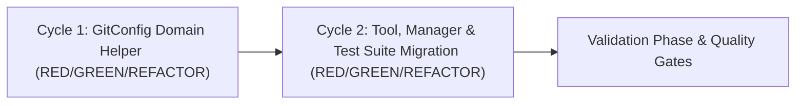

<!-- docs/development/issue116/planning.md -->
<!-- template=planning version=130ac5ea created=2026-08-19T14:24Z updated=2026-08-19T14:28Z -->
# Planning: Automatic Issue Number Formatting in create_branch Tool

**Status:** APPROVED  
**Version:** 1.0.0  
**Last Updated:** 2026-08-19

---

## Purpose

Decompose the execution of Issue #116 into sequential, well-isolated TDD cycles with clear deliverables, comprehensive test suite migration, and objective exit criteria.

## Scope

**In Scope:**
- `GitConfig` schema in `mcp_server/config/schemas/git_config.py`
- `CreateBranchInput` and `CreateBranchTool` in `mcp_server/tools/git_tools.py`
- `GitManager.create_branch` in `mcp_server/managers/git_manager.py`
- Full test suite migration across `tests/mcp_server/`

**Out of Scope:**
- Other git tools or workflows
- Ambient context detection of issue numbers

## Prerequisites

Read these first:
1. Read [docs/development/issue116/design.md](docs/development/issue116/design.md)
2. Read [docs/coding_standards/ARCHITECTURE_PRINCIPLES.md](docs/coding_standards/ARCHITECTURE_PRINCIPLES.md)
3. Read [docs/coding_standards/TYPE_CHECKING_PLAYBOOK.md](docs/coding_standards/TYPE_CHECKING_PLAYBOOK.md)
4. Read [docs/coding_standards/DOCUMENTATION_STANDARD.md](docs/coding_standards/DOCUMENTATION_STANDARD.md)

---

## Summary

Plan for implementing mandatory `issue_number` in the `create_branch` tool with the `GitConfig.format_branch_name` domain helper and migrating the test suite in two sequential TDD cycles.

---

## Cycle Overview

---

## TDD Cycles

### Cycle 1: C1 — GitConfig Domain Helper & Convention Validation

**Goal:** Implement the `GitConfig.format_branch_name(issue_number, name, branch_type) -> str` domain helper with slug normalization and regex validation.

#### Deliverables:
- **`D1.1`:** Add `GitConfig.format_branch_name(self, issue_number: int, name: str, branch_type: str) -> str` in `mcp_server/config/schemas/git_config.py`.
- **`D1.2`:** Add comprehensive unit tests in `tests/mcp_server/unit/config/test_git_config.py` covering format success, prefix normalization (`removeprefix`), invalid issue number rejection (`< 1`), invalid branch type rejection, and pattern mismatch rejection.

#### Tests:
- `test_format_branch_name_valid`
- `test_format_branch_name_normalizes_existing_prefix`
- `test_format_branch_name_invalid_issue_number`
- `test_format_branch_name_invalid_type`
- `test_format_branch_name_invalid_slug_pattern`

#### Exit Criteria:
- All `GitConfig.format_branch_name` unit tests pass with 100% branch/type/slug validation coverage.

---

### Cycle 2: C2 — Tool Contract, GitManager & Test Suite Migration

**Goal:** Update `CreateBranchInput`, `CreateBranchTool`, and `GitManager.create_branch` to make `issue_number: int` mandatory, and migrate all call sites across the test suite.

#### Deliverables:
- **`D2.1`:** Update `CreateBranchInput` in `mcp_server/tools/git_tools.py` with mandatory `issue_number: int = Field(..., ge=1, description="GitHub issue number")`.
- **`D2.2`:** Update `CreateBranchTool.execute` to pass `params.issue_number` to `GitManager.create_branch`.
- **`D2.3`:** Update `GitManager.create_branch` signature and delegation to `_git_config.format_branch_name`.
- **`D2.4`:** Migrate all test call sites across `tests/mcp_server/unit/tools/test_git_tools.py`, `tests/mcp_server/unit/managers/test_git_manager.py`, `tests/mcp_server/managers/test_git_manager_config.py`, `tests/mcp_server/unit/integration/test_git.py`, `tests/mcp_server/unit/integration/test_all_tools.py`, and `tests/mcp_server/unit/managers/test_note_migration.py`.

#### Tests:
- `tests/mcp_server/unit/tools/test_git_tools.py`
- `tests/mcp_server/unit/managers/test_git_manager.py`
- `tests/mcp_server/managers/test_git_manager_config.py`
- `tests/mcp_server/unit/integration/test_git.py`
- `tests/mcp_server/unit/integration/test_all_tools.py`
- `tests/mcp_server/unit/managers/test_note_migration.py`

#### Exit Criteria:
- Full test suite passes. Quality gates (mypy strict + pylint 10.00/10) pass.

---

## Deliverables Summary Table

| Cycle | Deliverable ID | Description | Target File(s) |
|---|---|---|---|
| **C1** | `D1.1` | Domain helper `GitConfig.format_branch_name` | `mcp_server/config/schemas/git_config.py` |
| **C1** | `D1.2` | Unit tests for `format_branch_name` | `tests/mcp_server/unit/config/test_git_config.py` |
| **C2** | `D2.1` | Mandatory `issue_number` in `CreateBranchInput` | `mcp_server/tools/git_tools.py` |
| **C2** | `D2.2` | Update `CreateBranchTool.execute` | `mcp_server/tools/git_tools.py` |
| **C2** | `D2.3` | Update `GitManager.create_branch` | `mcp_server/managers/git_manager.py` |
| **C2** | `D2.4` | Migrate all 11 test methods across 6 test files | `tests/mcp_server/...` |

---

## Risks & Mitigation

| Risk | Mitigation |
|---|---|
| Missed test caller in blast radius | Exhaustive grep search completed during research & design; verified by running complete `pytest` test suite. |
| Schema drift in tool presentation | Tool `input_schema` property tested via `test_all_tools.py` and `test_git_tools.py`. |

---

## Related Documentation

- **[docs/development/issue116/research.md][related-1]**
- **[docs/development/issue116/design.md][related-2]**
- **[docs/coding_standards/ARCHITECTURE_PRINCIPLES.md][related-3]**

<!-- Link definitions -->

[related-1]: docs/development/issue116/research.md
[related-2]: docs/development/issue116/design.md
[related-3]: docs/coding_standards/ARCHITECTURE_PRINCIPLES.md

---

## Version History

| Version | Date | Author | Changes |
|---------|------|--------|---------|
| 1.0.0 | 2026-08-19 | Agent | Initial planning with 2 TDD cycles and deliverable mapping |
