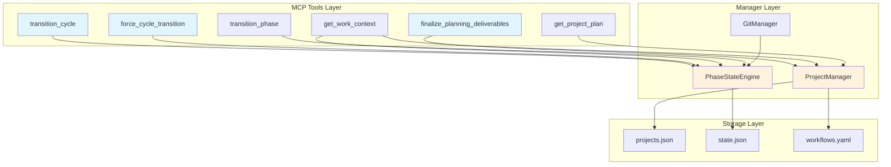
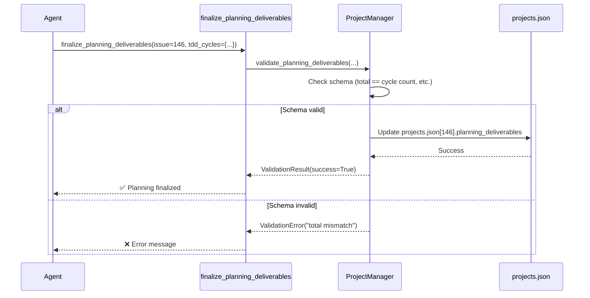
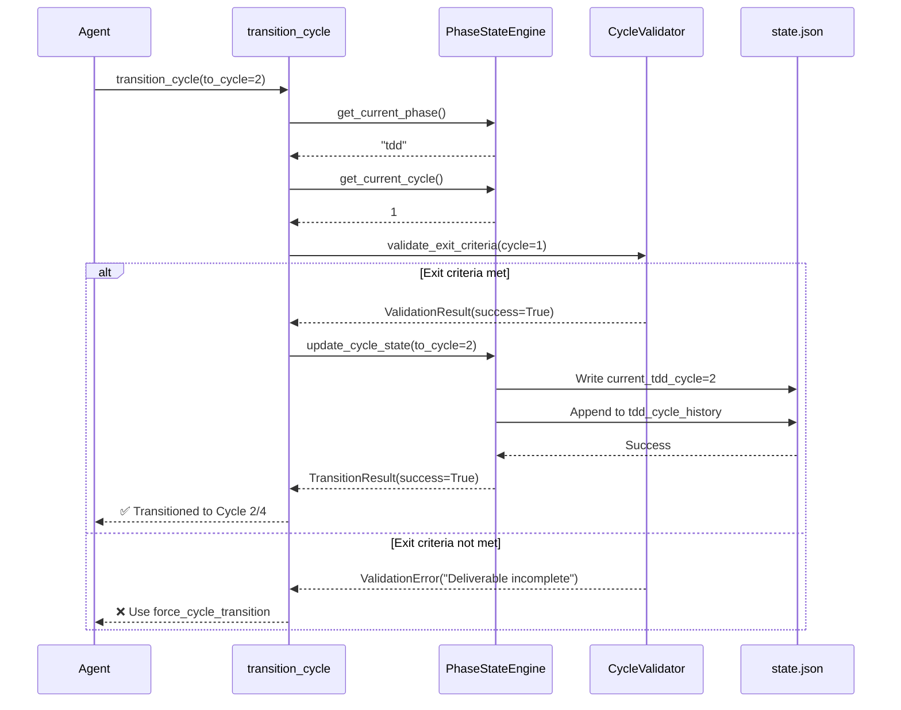
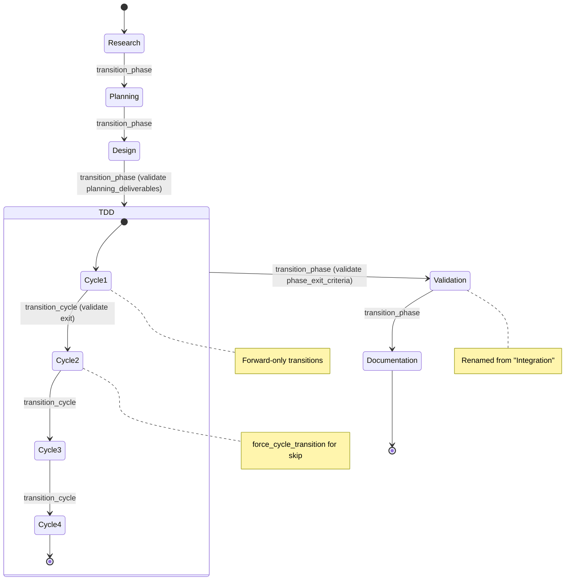
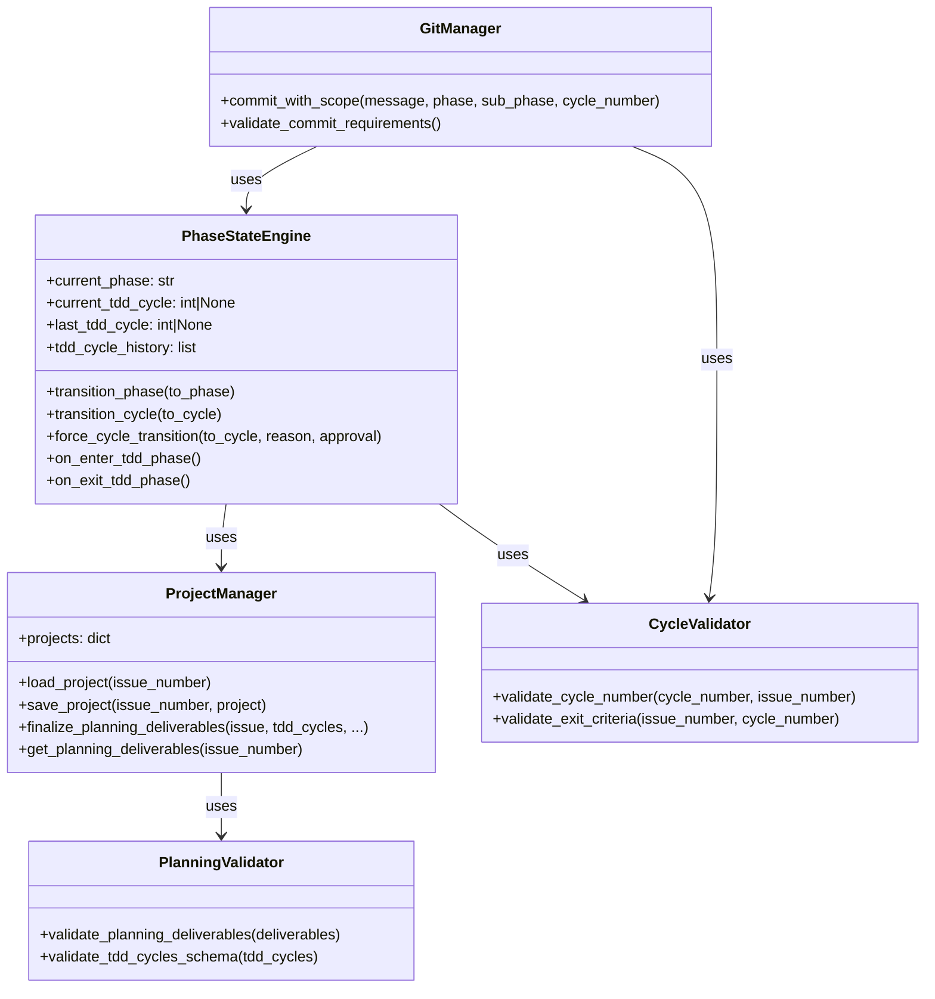

<!-- docs/development/issue146/design.md -->
<!-- template=design version=5827e841 created=2026-02-17T11:00:00Z updated= -->
# Issue #146 TDD Cycle Tracking & Validation - Design

**Status:** DRAFT  
**Version:** 1.0  
**Last Updated:** 2026-02-17

---

## Scope

**In Scope:**
Tool signatures, class diagrams, sequence diagrams, module organization, validation patterns, phase rename (manual recovery)

**Out of Scope:**
Implementation code, test cases, performance optimization

---

## 1. Context & Requirements

### 1.1. Problem Statement

TDD cycle tracking missing: no planning deliverables storage, no cycle state in state.json, no validation of cycle_number parameter, no discovery tools visibility, confusing 'integration' phase terminology

### 1.2. Requirements

**Functional:**
- [ ] Store planning_deliverables in projects.json
- [ ] Track current_tdd_cycle in state.json
- [ ] Validate cycle_number for all TDD commits
- [ ] Transition tools: transition_cycle, force_cycle_transition
- [ ] Discovery tools show cycle info during TDD
- [ ] Rename integration phase to validation

**Non-Functional:**
- [ ] Mirror PhaseStateEngine transition patterns
- [ ] Graceful degradation for discovery tools
- [ ] Strict validation for TDD workflow
- [ ] Audit trail for forced transitions
- [ ] Manual recovery errors for "integration" → "validation" rename

### 1.3. Constraints

None
---

## 2. Design Options

### 2.1. Option A: Extend PhaseStateEngine (CHOSEN)

**Approach:** Add cycle tracking fields to existing PhaseStateEngine, create new MCP tools

**Pros:**
- ✅ Consistent with existing architecture patterns
- ✅ Reuses transition validation logic
- ✅ Minimal new abstractions (DRY principle)
- ✅ state.json already managed by PhaseStateEngine

**Cons:**
- ❌ PhaseStateEngine grows in responsibility (but still cohesive)

### 2.2. Option B: Separate CycleManager

**Approach:** Create new CycleManager class parallel to PhaseStateEngine

**Pros:**
- ✅ Single Responsibility (cycle management separate from phase management)

**Cons:**
- ❌ Duplicates transition logic (force transitions, validation, audit trail)
- ❌ Two state managers writing to state.json (coordination complexity)
- ❌ Inconsistent with existing patterns

### 2.3. Option C: Hybrid (CycleState + PhaseStateEngine coordination)

**Approach:** CycleState handles cycle-specific logic, PhaseStateEngine orchestrates

**Pros:**
- ✅ Clean separation of concerns

**Cons:**
- ❌ Over-engineering for current scope
- ❌ Complex coordination between two managers
- ❌ Not following YAGNI principle

---

## 3. Chosen Design

**Decision:** Option A - Extend PhaseStateEngine with cycle tracking, create 3 new MCP tools (finalize_planning_deliverables, transition_cycle, force_cycle_transition), enhance 2 discovery tools, rename integration→validation phase

**Rationale:** Mirrors existing PhaseStateEngine patterns for consistency, strict validation enforces quality, conditional visibility reduces noise, integration→validation improves clarity

**Key Decisions from Planning:**
1. **PhaseStateEngine owns cycle state** (not separate manager)
2. **ProjectManager stores planning_deliverables** (projects.json)
3. **Conditional visibility** in get_work_context (TDD phase only)
4. **Forward-only transitions** with force override (human approval required)
5. **Entry-time validation** blocking (preventive not reactive)
6. **Integration→Validation rename** for all workflows

---

## 4. Architecture Overview

### 4.1. Component Diagram



### 4.2. Module Organization

```
mcp_server/
├── tools/
│   ├── planning_tools.py          # NEW: finalize_planning_deliverables
│   ├── transition_tools.py        # NEW: transition_cycle, force_cycle_transition
│   ├── discovery_tools.py         # ENHANCE: get_work_context
│   └── project_tools.py           # ENHANCE: get_project_plan
│
├── managers/
│   ├── phase_state_engine.py     # ENHANCE: cycle state management
│   ├── project_manager.py        # ENHANCE: planning_deliverables schema
│   └── git_manager.py             # ENHANCE: cycle_number validation
│
└── validators/
    ├── cycle_validator.py         # NEW: cycle number validation
    └── planning_validator.py      # NEW: planning deliverables validation
```

---

## 5. Tool Contracts

### 5.1. finalize_planning_deliverables

**Purpose:** Store planning outcomes in projects.json at end of planning phase

**Signature:**
```python
def finalize_planning_deliverables(
    issue_number: int,
    tdd_cycles: dict,
    validation_plan: dict | None = None,
    documentation_plan: dict | None = None
) -> FinalizationResult:
    """
    Finalize planning deliverables and store in projects.json.
    
    Args:
        issue_number: Issue number for the project
        tdd_cycles: TDD cycle definitions with deliverables and exit criteria
        validation_plan: Validation phase objectives and exit criteria
        documentation_plan: Documentation requirements and exit criteria
    
    Returns:
        FinalizationResult with success status and validation errors
    
    Raises:
        ValidationError: If planning_deliverables already exist or schema invalid
    """
```

**Input Schema:**
```json
{
  "tdd_cycles": {
    "total": 4,
    "phase_exit_criteria": "All cycles complete, quality gates green",
    "cycles": [
      {
        "cycle": 1,
        "name": "Schema & Storage",
        "deliverables": ["ProjectManager schema", "PhaseStateEngine fields"],
        "exit_criteria": "Schema validated, tests pass"
      }
    ]
  },
  "validation_plan": {
    "objectives": ["Smoke tests", "Performance"],
    "exit_criteria": "All smoke tests green"
  },
  "documentation_plan": {
    "sections": ["API Docs", "Architecture Update"],
    "exit_criteria": "Docs reviewed and merged"
  }
}
```

**Validation Rules:**
- `tdd_cycles.total` must equal `len(tdd_cycles.cycles)`
- Each cycle must have unique sequential number (1-based)
- `deliverables` array must not be empty
- `exit_criteria` string must not be empty
- Planning deliverables must not already exist in projects.json

**Error Scenarios:**
1. Planning deliverables already finalized → `"Planning already finalized for issue #146"`
2. Invalid schema → `"Validation error: total (5) != cycle count (4)"`
3. Missing required fields → `"Cycle 2: exit_criteria missing"`

---

### 5.2. transition_cycle

**Purpose:** Transition to next TDD cycle (forward-only, sequential preferred)

**Signature:**
```python
def transition_cycle(
    to_cycle: int,
    issue_number: int | None = None  # Auto-detect from current branch
) -> TransitionResult:
    """
    Transition to next TDD cycle with exit criteria validation.
    
    Args:
        to_cycle: Target cycle number (must be > current_cycle)
        issue_number: Optional issue number (auto-detected if omitted)
    
    Returns:
        TransitionResult with success status and transition details
    
    Raises:
        ValidationError: If not in TDD phase, backwards transition, or exit criteria not met
    """
```

**Validation Logic:**
```python
# 1. Check current phase
if current_phase != "tdd":
    raise ValidationError("Not in TDD phase")

# 2. Check planning deliverables exist
if "planning_deliverables" not in project:
    raise ValidationError("Planning deliverables not found")

# 3. Check forward-only
if to_cycle <= current_tdd_cycle:
    raise ValidationError("Backwards transition not allowed. Use force_cycle_transition.")

# 4. Check previous cycle exit criteria (if sequential)
if to_cycle == current_tdd_cycle + 1:
    validate_exit_criteria(current_tdd_cycle)
else:
    raise ValidationError("Non-sequential transition. Use force_cycle_transition.")

# 5. Update state
state["current_tdd_cycle"] = to_cycle
append_to_history(to_cycle, forced=False)
```

**Output:**
```json
{
  "success": true,
  "from_cycle": 1,
  "to_cycle": 2,
  "timestamp": "2026-02-17T11:15:00Z",
  "message": "✅ Transitioned to TDD Cycle 2/4: Validation Logic"
}
```

---

### 5.3. force_cycle_transition

**Purpose:** Force cycle transition (skip cycles or ignore exit criteria)

**Signature:**
```python
def force_cycle_transition(
    to_cycle: int,
    skip_reason: str,
    human_approval: str,
    issue_number: int | None = None
) -> TransitionResult:
    """
    Force cycle transition with audit trail.
    
    Args:
        to_cycle: Target cycle number
        skip_reason: Justification for forced transition
        human_approval: Human approval statement (e.g., "User: John approved 2026-02-17")
        issue_number: Optional issue number (auto-detected if omitted)
    
    Returns:
        TransitionResult with success status and audit details
    
    Raises:
        ValidationError: If skip_reason or human_approval empty
    """
```

**Audit Trail:**
```json
{
  "cycle": 4,
  "name": "Transition Tools",
  "entered": "2026-02-17T11:20:00Z",
  "forced": true,
  "skip_reason": "Cycles 2-3 covered by epic parent tests",
  "human_approval": "User: John approved 2026-02-17",
  "skipped_cycles": [2, 3]
}
```

---

### 5.4. get_work_context Enhancement

**Changes:**
- Add `tdd_cycle_info` section (conditional on TDD phase)
- Graceful degradation if planning_deliverables missing

**New Output (during TDD phase):**
```json
{
  "branch": "feature/146-tdd-cycle-tracking",
  "workflow_phase": "tdd",
  "sub_phase": "green",
  "tdd_cycle_info": {
    "current": 2,
    "total": 4,
    "name": "Validation Logic",
    "deliverables": [
      "Cycle number validation",
      "Planning deliverables checks",
      "Error messages"
    ],
    "exit_criteria": "All validation scenarios covered",
    "status": "in_progress"
  },
  "recent_commits": [...],
  "active_issue": {...}
}
```

**Outside TDD Phase:**
```json
{
  "workflow_phase": "design"
  // NO tdd_cycle_info (conditional visibility)
}
```

---

### 5.5. get_project_plan Enhancement

**Changes:**
- Add `planning_deliverables` section (complete structure)

**New Output:**
```json
{
  "issue_number": 146,
  "workflow_name": "feature",
  "required_phases": ["research", "planning", "design", "tdd", "validation", "documentation"],
  "current_phase": "tdd",
  "planning_deliverables": {
    "tdd_cycles": {
      "total": 4,
      "phase_exit_criteria": "All cycles complete, quality gates green",
      "cycles": [...]
    },
    "validation_plan": {...},
    "documentation_plan": {...}
  }
}
```

---

## 6. PhaseStateEngine Extensions

### 6.1. New State Fields

**state.json additions:**
```json
{
  "current_tdd_cycle": 2,           // Active cycle (null if not in TDD)
  "last_tdd_cycle": 2,              // Historical (persists after TDD exit)
  "tdd_cycle_history": [
    {
      "cycle": 1,
      "name": "Schema & Storage",
      "entered": "2026-02-15T10:00:00Z",
      "completed": "2026-02-16T14:30:00Z",
      "forced": false
    },
    {
      "cycle": 2,
      "name": "Validation Logic",
      "entered": "2026-02-16T14:35:00Z",
      "completed": null,
      "forced": false
    }
  ]
}
```

### 6.2. Phase Entry/Exit Hooks

**on_enter_tdd_phase():**
```python
def on_enter_tdd_phase(issue_number: int):
    """Validate planning deliverables before TDD entry."""
    project = load_project(issue_number)
    
    # Check planning_deliverables exist
    if "planning_deliverables" not in project:
        raise ValidationError(
            "Cannot enter TDD phase without planning deliverables",
            recovery="Run finalize_planning_deliverables tool"
        )
    
    # Check tdd_cycles defined
    if project["planning_deliverables"]["tdd_cycles"]["total"] == 0:
        raise ValidationError(
            "No TDD cycles defined",
            recovery="Update planning_deliverables with tdd_cycles"
        )
    
    # Initialize cycle state
    state = load_state()
    state["current_tdd_cycle"] = None  # Explicit transition_cycle required
    save_state(state)
```

**on_exit_tdd_phase():**
```python
def on_exit_tdd_phase():
    """Archive current cycle, validate phase exit criteria."""
    state = load_state()
    
    # Move current to last (historical)
    state["last_tdd_cycle"] = state["current_tdd_cycle"]
    state["current_tdd_cycle"] = None
    
    # Validate phase exit criteria
    project = load_project(state["issue_number"])
    phase_criteria = project["planning_deliverables"]["tdd_cycles"]["phase_exit_criteria"]
    
    if not check_phase_exit_criteria(phase_criteria):
        raise ValidationError(
            f"TDD phase exit criteria not met: {phase_criteria}",
            recovery="Use force_phase_transition with reason + approval"
        )
    
    save_state(state)
```

---

## 7. Validation Logic

### 7.1. Cycle Number Validation

**Location:** `mcp_server/validators/cycle_validator.py`

**Class Structure:**
```python
class CycleValidator:
    def validate_cycle_number(
        self,
        cycle_number: int | None,
        issue_number: int
    ) -> ValidationResult:
        """Validate cycle_number against planning deliverables."""
        
        # 1. Check required
        if cycle_number is None:
            return self._error("cycle_number required for all TDD commits")
        
        # 2. Load planning deliverables
        project = self.project_manager.load_project(issue_number)
        if "planning_deliverables" not in project:
            return self._error("Cannot commit to TDD without planning deliverables")
        
        # 3. Check range
        total_cycles = project["planning_deliverables"]["tdd_cycles"]["total"]
        if cycle_number < 1 or cycle_number > total_cycles:
            return self._error(
                f"cycle_number {cycle_number} out of range (1-{total_cycles})"
            )
        
        return ValidationResult(success=True)
```

### 7.2. Exit Criteria Validation

**Class Structure:**
```python
class ExitCriteriaValidator:
    def validate_cycle_exit_criteria(
        self,
        issue_number: int,
        cycle_number: int
    ) -> ValidationResult:
        """Check if cycle exit criteria are met."""
        
        project = self.project_manager.load_project(issue_number)
        cycle_data = self._get_cycle_data(project, cycle_number)
        
        # Check deliverables completed
        for deliverable in cycle_data["deliverables"]:
            if not self._is_deliverable_complete(deliverable):
                return self._error(f"Deliverable incomplete: {deliverable}")
        
        # Check custom exit criteria
        if not self._check_exit_criteria(cycle_data["exit_criteria"]):
            return self._error(f"Exit criteria not met: {cycle_data['exit_criteria']}")
        
        return ValidationResult(success=True)
```

---

## 8. Integration → Validation Phase Rename

### 8.1. Affected Files

**Configuration:**
- `.st3/workflows.yaml` - all workflow definitions
- `.st3/projects.json` - existing projects with "integration" phase

**Code:**
- `mcp_server/managers/phase_state_engine.py` - transition logic
- `backend/core/scope_encoder.py` - scope generation (P_INTEGRATION → P_VALIDATION)

**Documentation:**
- All docs/ references to "integration" phase

### 8.2. Migration Strategy

**Approach:** Strict manual recovery (no automatic migration)

**Phase 1: Update Workflows (Hard Breaking Change)**
```yaml
# workflows.yaml - direct update
required_phases:
  - research
  - planning
  - design
  - tdd
  - validation  # Renamed from "integration"
  - documentation
```

**Phase 2: Update Scope Encoding**
```python
# backend/core/scope_encoder.py
PHASE_SCOPE_MAP = {
    "research": "P_RESEARCH",
    "planning": "P_PLANNING",
    "design": "P_DESIGN",
    "tdd": "P_TDD",
    "validation": "P_VALIDATION",  # Renamed from P_INTEGRATION
    "documentation": "P_DOCUMENTATION"
}
```

**Phase 3: Error Handling for Legacy Projects**
```python
# PhaseStateEngine validation
def validate_phase_exists(phase: str, workflow_name: str) -> None:
    """Strict validation - fails on unrecognized phase."""
    valid_phases = get_workflow_phases(workflow_name)
    
    if phase not in valid_phases:
        # Check if user is using old "integration" term
        if phase == "integration":
            raise PhaseValidationError(
                f"Phase 'integration' renamed to 'validation' in Issue #146.\n"
                f"\n"
                f"MANUAL RECOVERY:\n"
                f"1. Edit .st3/state.json: Change 'current_phase' from 'integration' to 'validation'\n"
                f"2. Edit .st3/projects.json: Update issue entry's 'required_phases' array\n"
                f"3. Use transition_phase(to_phase='validation') to continue\n"
                f"\n"
                f"See docs/development/issue146/design.md for details."
            )
        
        raise PhaseValidationError(
            f"Unknown phase '{phase}' for workflow '{workflow_name}'.\n"
            f"Valid phases: {', '.join(valid_phases)}"
        )
```

**Phase 4: Documentation Updates**
- All docs/ references to "integration" phase updated to "validation"
- Agent.md tool references updated
- MCP reference docs updated

### 8.3. Rollout Plan

1. **TDD Cycle 1:** Update workflows.yaml (hard breaking change)
2. **TDD Cycle 1:** Update scope encoding (P_INTEGRATION → P_VALIDATION)
3. **TDD Cycle 2:** Add strict validation with actionable error messages
4. **TDD Cycle 3:** Update all documentation (docs/, agent.md, references)
5. **Manual Migration:** Users update existing projects.json entries manually

**Migration Impact:**
- ❌ NO automatic migration code
- ❌ NO backward-compatible aliases
- ✅ STRICT validation fails on "integration"
- ✅ ACTIONABLE error messages with recovery steps
- ✅ MANUAL fix: Edit .st3/state.json and .st3/projects.json

---

## 9. Sequence Diagrams

### 9.1. Planning Finalization Flow



### 9.2. Cycle Transition Flow



### 9.3. State Machine Extension



---

## 10. Class Relationships



---

## 11. Error Message Templates

### 11.1. Missing Planning Deliverables
```
❌ ValidationError: Cannot enter TDD phase without planning deliverables

Context:
- Current phase: planning
- Planning deliverables: NOT FOUND

Recovery:
Run finalize_planning_deliverables tool:
  finalize_planning_deliverables(
      issue_number=146,
      tdd_cycles={...}
  )
```

### 11.2. Missing Cycle Number
```
❌ ValidationError: cycle_number required for TDD commits

Current: test(P_TDD_SP_RED): add test
Required: test(P_TDD_SP_C2_RED): add test

Recovery:
Add cycle_number parameter:
  git_add_or_commit(cycle_number=2, ...)
```

### 11.3. Invalid Cycle Number
```
❌ ValidationError: cycle_number out of range

Attempted: 5
Allowed: 1-4

Recovery:
1. Fix cycle_number: git commit --amend
2. Update planning: finalize_planning_deliverables(...)
```

### 11.4. Exit Criteria Not Met
```
❌ ValidationError: Cycle 2 exit criteria not met

Exit Criteria: "All validation scenarios covered"

Incomplete:
  ❌ Error message templates

Recovery:
1. Complete deliverables (recommended)
2. Force transition: force_cycle_transition(to_cycle=3, skip_reason="...", human_approval="...")
```

---

### 3.1. Key Design Decisions

| Decision | Rationale |
|----------|-----------|
| Extend PhaseStateEngine (not separate CycleManager) | Mirrors existing pattern, avoids StateManager duplication, maintains SRP |
| Comprehensive planning_deliverables schema | Captures all TDD cycle definitions, exit criteria, validation plans (vs minimal cycle names) |
| Forward-only cycle transitions | Prevents accidental regression, maintains clear progression (force override available) |
| Conditional visibility (TDD phase only) | Reduces noise in get_work_context for non-TDD phases |
| Entry-time blocking validation | Prevents invalid state before work starts (vs runtime detection) |
| Both JSON + text formatting | Dual output for agents (structured) and developers (readable) |
| Strict Integration→Validation rename | No aliases, manual recovery only - aligns with minimal backward-compat constraint |

## Related Documentation
- **[research.md][related-1]**
- **[planning.md][related-2]**
- **[../../reference/mcp/phase_state_engine.md][related-3]**

<!-- Link definitions -->

[related-1]: research.md
[related-2]: planning.md
[related-3]: ../../reference/mcp/phase_state_engine.md

---

## Version History

| Version | Date | Author | Changes |
|---------|------|--------|---------|
| 1.0 | 2026-02-17 | Agent | Initial draft |
