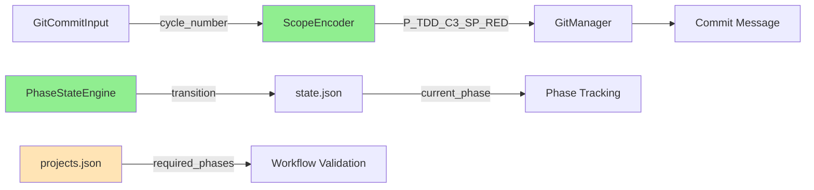
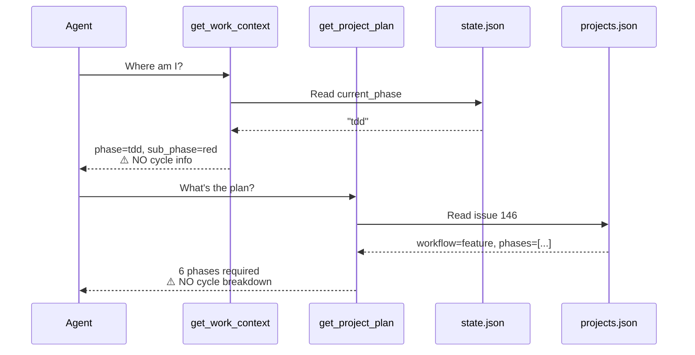

<!-- docs/development/issue146/research.md -->
<!-- template=research version=8b7bb3ab created=2026-02-17T09:00:00Z -->
# Issue #146 TDD Cycle Tracking & Validation Research

**Status:** IN PROGRESS  
**Version:** 2.0  
**Last Updated:** 2026-02-17

---

## Purpose

Investigate TDD cycle tracking requirements for state machine extension, identifying gaps in current architecture and exploring solution options without making implementation decisions.

## Scope

**In Scope:**
- Current implementation analysis (cycle_number parameter, PhaseStateEngine patterns)
- Gap identification (missing storage, validation, transitions, observability)
- Alternative approaches discovery (schema options, validation strategies, breaking change approaches)
- Discovery tools impact analysis (get_work_context, get_project_plan cycle visibility)
- Backward compatibility constraints

**Out of Scope:**
- Architecture decisions (planning phase)
- Implementation specifications (design phase)
- Test strategy details (planning/design phase)
- Migration tooling design (design phase)

## Prerequisites

Read these first:
1. [Issue #138 complete](../issue138/) - Workflow-first architecture with scope encoding
2. [.st3/projects.json](.st3/projects.json) - Project metadata schema
3. [.st3/state.json](.st3/state.json) - Live branch state schema  
4. [mcp_server/managers/phase_state_engine.py](mcp_server/managers/phase_state_engine.py#L127-L250) - Transition/force_transition patterns
5. [backend/core/scope_encoder.py](backend/core/scope_encoder.py#L57) - cycle_number parameter exists

---

## Problem Statement

TDD cycle tracking is disconnected from workflow state machine. Planning phase can define cycle breakdown (e.g., Issue #138 documented 4 cycles), but:
- No persistent storage in projects.json
- No live tracking in state.json
- No validation of cycle_number parameter against plan
- No transition tools for cycle progression
- No visibility in discovery tools (get_work_context, get_project_plan)

**Impact:** Agents invent arbitrary cycle numbers (Issue #138: "cycle 3.1, 3.2, 3.6") without enforcement, causing workflow confusion and non-deterministic progression.

## Research Goals

1. Map current implementation landscape (what EXISTS)
2. Identify capability gaps (what's MISSING)
3. Discover alternative solution approaches (OPTIONS, not decisions)
4. Analyze discovery tools integration points
5. Define backward compatibility constraints

---

## 1. Current Implementation Analysis

### 1.1 Existing Components



**Found:**
- ✅ `cycle_number` parameter accepted in `GitCommitInput` (line 145)
- ✅ `ScopeEncoder.generate_scope()` formats cycle into scope (e.g., `P_TDD_C3_SP_RED`)
- ✅ `PhaseStateEngine` has transition/force_transition pattern
- ✅ Test coverage exists: `test_git_commit_tool_with_cycle_number`

**Code Evidence:**
```python
# mcp_server/tools/git_tools.py:145
cycle_number: int | None = Field(
    default=None,
    description="Cycle number (e.g., 1, 2, 3). Optional, used in multi-cycle TDD.",
)

# backend/core/scope_encoder.py:147
if cycle_number is not None:
    return f"P_{phase_upper}_SP_C{cycle_number}_{sub_phase_upper}"
```

### 1.2 Missing Components

**Gap Analysis:**

| Component | Status | Impact |
|-----------|--------|--------|
| Planning deliverables storage | ❌ Missing | No source of truth for cycle definitions |
| Current cycle tracking in state.json | ❌ Missing | No live cycle state |
| cycle_number validation | ❌ Missing | Arbitrary values accepted (999, -1, etc.) |
| Cycle transition tools | ❌ Missing | No sequential progression enforcement |
| Discovery tools cycle visibility | ❌ Missing | Agent blind to cycle context |

**Evidence:**
```python
# backend/core/scope_encoder.py:147 - NO validation
if cycle_number is not None:
    return f"P_{phase_upper}_SP_C{cycle_number}_{sub_phase_upper}"
    # ⚠️ Accepts cycle_number=999 without error

# .st3/projects.json - NO cycle fields
{
  "146": {
    "workflow_name": "feature",
    "required_phases": [...],
    // ⚠️ No tdd_cycles, no validation_plan, no documentation_plan
  }
}

# .st3/state.json - NO cycle tracking
{
  "current_phase": "tdd",
  // ⚠️ No current_tdd_cycle, no tdd_cycle_transitions
}
```

---

## 2. Gap Deep-Dive

### 2.1 Validation Gap

**Current Behavior:**
```python
# All these SUCCEED without error:
git_add_or_commit(cycle_number=999, ...)  # No project plan → no validation
git_add_or_commit(cycle_number=-5, ...)   # Negative cycle accepted
git_add_or_commit(cycle_number=None, ...) # Missing cycle for TDD sub-phase
```

**Questions Raised:**
- Should cycle_number be REQUIRED for TDD sub-phases (red/green/refactor)?
- Should cycle_number be FORBIDDEN for non-TDD phases?
- What are recovery options when validation fails?

### 2.2 Storage Gap

**Projects.json Missing Fields:**

Option 1: Flat structure
```json
{
  "146": {
    "tdd_total_cycles": 4,
    "tdd_cycle_1_name": "Schema Design",
    "tdd_cycle_1_deliverables": [...]
  }
}
```

Option 2: Nested structure
```json
{
  "146": {
    "planning_deliverables": {
      "tdd_cycles": {
        "total": 4,
        "cycles": [...]
      }
    }
  }
}
```

Option 3: Separate file (`.st3/cycles/issue146.json`)

**Questions Raised:**
- Which schema balances readability vs extensibility?
- Should validation_plan and documentation_plan be stored together?
- How to handle projects without cycles (backward compat)?

### 2.3 State Tracking Gap

**State.json Missing Fields:**

Current (Phase only):
```json
{
  "current_phase": "tdd",
  "transitions": [...]
}
```

Option A: Flat cycle field
```json
{
  "current_phase": "tdd",
  "current_cycle": 2
}
```

Option B: Nested TDD context
```json
{
  "current_phase": "tdd",
  "tdd_context": {
    "current_cycle": 2,
    "cycle_transitions": [...]
  }
}
```

**Questions Raised:**
- Should current_cycle persist after leaving TDD phase?
- Should cycle transitions have separate audit trail from phase transitions?
- How to handle re-entering TDD phase (resume last cycle vs restart)?

### 2.4 Transition Tooling Gap

**PhaseStateEngine has transition/force_transition:**
```python
# Phase transitions exist
transition(branch, to_phase="design")
force_transition(branch, to_phase="ready", skip_reason="...", human_approval="...")
```

**Cycle transitions do NOT exist:**
```python
# Would need:
transition_cycle(branch, to_cycle=2)  # ❌ Does not exist
force_cycle_transition(branch, to_cycle=4, skip_reason="...")  # ❌ Does not exist
```

**Questions Raised:**
- Should cycle transitions mirror phase transitions architecture?
- Should force_cycle_transition require human_approval like force_transition?
- What's the semantic difference: cycle skip vs phase skip?

---

## 3. Discovery Tools Impact Analysis

### 3.1 Tool Roles in Workflow



### 3.2 Current Tool Gap

**get_work_context() Current Output:**
```json
{
  "current_branch": "feature/146-tdd",
  "workflow_phase": "tdd",
  "sub_phase": "red",
  "phase_source": "commit-scope",
  "recent_commits": [...],
  "active_issue": {...}
  // ⚠️ MISSING: current_cycle, total_cycles, cycle_deliverables
}
```

**get_project_plan() Current Output:**
```json
{
  "issue_number": 146,
  "workflow_name": "feature",
  "required_phases": ["research", "planning", ..., "tdd", ...],
  "current_phase": "tdd"
  // ⚠️ MISSING: tdd_cycles breakdown, validation_plan, documentation_plan
}
```

### 3.3 Desired Tool Enhancement (Options)

**Option A: Add cycle fields to existing output**
- get_work_context() adds `tdd_cycle_info` section
- get_project_plan() adds `planning_deliverables` section

**Option B: Separate tool**
- New `get_tdd_cycle_context()` tool
- Dedicated cycle-specific information

**Option C: Merge tools**
- Single `get_dev_context()` combining both

**Questions Raised:**
- Which option maintains tool cohesion?
- Should cycle info be always visible or only during TDD phase?
- How to handle cycle info for projects without planning deliverables?

### 3.4 Tool Usage Patterns

**From agent.md analysis:**

```
# Phase 1: Orientation Protocol
get_work_context()       → "Where am I?" (frequency: multiple per session)
get_project_plan(146)    → "What's the plan?" (frequency: 1-2x total)
```

**With Cycle Tracking:**
```
# During TDD Phase
get_work_context()       → Should show: cycle 2/4, current deliverables
get_project_plan(146)    → Should show: all 4 cycles defined in planning
```

**Impact:** Discovery tools are PRIMARY way agents understand context. Missing cycle info → agents improvise cycle numbers.

---

## 4. Backward Compatibility Constraints

### 4.1 User Requirement

**Constraint:** "Minimale backward compatibility - alleen graceful failure met recovery"

**Interpretation:**
- ❌ NO silent fallbacks to old behavior
- ❌ NO dual-mode support (with/without cycles)
- ✅ STRICT validation with actionable errors
- ✅ MANUAL recovery options (not automatic migration)

### 4.2 Breaking Change Scenarios

**Scenario 1: Old project (no planning deliverables)**
```python
git_add_or_commit(workflow_phase="tdd", sub_phase="red", message="...")
# Option A: ERROR - "No planning deliverables found for issue #146"
# Option B: WARNING - "Proceeding without cycle tracking"
# Option C: REQUIRE - "Run finalize_planning first"
```

**Scenario 2: Missing cycle_number in TDD**
```python
git_add_or_commit(workflow_phase="tdd", sub_phase="red", message="...")
# cycle_number omitted
# Option A: ERROR - "cycle_number required when project has planning deliverables"
# Option B: Auto-detect from state.json current_cycle
# Option C: ERROR always for TDD sub-phases
```

**Scenario 3: Invalid cycle_number**
```python
git_add_or_commit(cycle_number=99, ...)  # Project has total_cycles=4
# Option A: ERROR - "cycle_number 99 exceeds total_cycles 4"
# Option B: WARNING - "Creating cycle 99 outside plan"
# Option C: ERROR with recovery options
```

### 4.3 Recovery Options Discovery

**For ERROR scenarios, what recovery paths exist?**

| Error | Recovery Option 1 | Recovery Option 2 | Recovery Option 3 |
|-------|------------------|------------------|------------------|
| No planning deliverables | Run `finalize_planning()` | Create minimal plan | Skip cycle tracking (opt-out flag?) |
| Missing cycle_number | Add to commit: `cycle_number=N` | Auto-use state.json value | ERROR (no recovery) |
| Invalid cycle_number | Fix commit: `git commit --amend` | Update plan: increase total_cycles | Force transition to valid cycle |

**Questions Raised:**
- Should recovery be manual-only or offer automated options?
- Which errors are FATAL vs WARNING?
- How to communicate recovery options in error messages?

---

## 5. Alternative Solution Approaches

### 5.1 Cycle Scope Format Enforcement

**Current:** Both formats accepted
```
P_TDD_SP_RED              ← No cycle (backward compat)
P_TDD_C3_SP_RED          ← With cycle
```

**Option A: Strict enforcement (breaking change)**
- REQUIRE cycle for TDD sub-phases
- ERROR if missing
- Grace period: warning → error

**Option B: Conditional enforcement**
- REQUIRE cycle IF project has planning_deliverables
- OPTIONAL if no deliver ables (legacy support)

**Option C: Opt-in enforcement**
- New field: `enforce_cycle_tracking: true` in projects.json
- Only enforced if opted-in

### 5.2 Planning Deliverable Schema

**Option 1: Minimalist (cycles only)**
```json
{
  "tdd_cycles": {
    "total": 4,
    "cycles": [
      {"cycle": 1, "name": "Schema Design"}
    ]
  }
}
```

**Option 2: Comprehensive (3 components from research.md v1.2)**
```json
{
  "planning_deliverables": {
    "tdd_cycles": {...},
    "validation_plan": {...},
    "documentation_plan": {...}
  }
}
```

**Option 3: Separate files per deliverable type**
```
.st3/plans/issue146_tdd.json
.st3/plans/issue146_validation.json
.st3/plans/issue146_docs.json
```

### 5.3 Cycle Transition Validation

**Option A: Sequential-only (strict)**
- Can only go 1→2→3→4
- force_cycle_transition for skip

**Option B: Forward-only (flexible)**
- Can go 1→3 (skip 2)
- Cannot go backwards (3→1)

**Option C: Free navigation (permissive)**
- Any cycle → any cycle
- Audit trail required

**Questions Raised:**
- Mirror phase transition strictness?
- Should skip_reason be required for non-sequential?
- What about re-doing a cycle (3→2 for fixes)?

### 5.4 State Persistence Strategy

**Option A: Ephemeral cycle state**
- current_tdd_cycle only exists during TDD phase
- Cleared on phase exit
- Must re-initialize on re-entry

**Option B: Persistent cycle state**
- current_tdd_cycle retained after TDD
- Historical record
- Resume from last cycle on re-entry

**Option C: Hybrid**
- Move to `last_tdd_cycle` on exit
- New `current_tdd_cycle` on re-entry

---

## 6. Error Message Templates (Discovery)

### 6.1 Missing Planning Deliverables

**Error Pattern:**
```
ValidationError: No TDD cycles defined for issue #146

Context:
- Current phase: tdd
- Project workflow: feature
- Planning deliverables: NOT FOUND in projects.json

Recovery options:
1. Run finalize_planning tool to define cycles
   finalize_planning(issue=146, tdd_cycles={...})
2. Skip cycle tracking for this project (NOT RECOMMENDED)
   [Mechanism TBD in planning phase]

Why this matters:
TDD cycle tracking requires planning deliverables to validate cycle_number.
Without a plan, cycle numbers cannot be enforced.
```

### 6.2 Invalid Cycle Number

**Error Pattern:**
```
ValidationError: cycle_number exceeds planned cycles

Attempted: cycle_number=5
Allowed: 1-4 (total_cycles=4 from projects.json)

Context:
- Current project: Issue #146
- Planning deliverables: FOUND
- Defined cycles: 4

Recovery options:
1. Fix commit message
   git commit --amend -m "test(P_TDD_C3_SP_RED): ..."
2. Update planning (if genuinely need more cycles)
   finalize_planning(issue=146, tdd_cycles={"total": 5, ...})
3. Force cycle transition (state only, NOT for commits)
   force_cycle_transition(to_cycle=4, skip_reason="...")

Note: force_cycle_transition updates STATE, not commit messages.
```

### 6.3 Missing Cycle Number in TDD

**Error Pattern:**
```
ValidationError: cycle_number required for TDD sub-phase

Current: test(P_TDD_SP_RED): add test  ← Missing cycle
Required: test(P_TDD_C{N}_SP_RED): add test

Context:
- Current phase: tdd
- Current sub_phase: red
- Project has planning deliverables: YES
- Total cycles: 4
- Current cycle (from state.json): 2

Valid examples:
- test(P_TDD_C2_SP_RED): add failing test
- feat(P_TDD_C2_SP_GREEN): implement feature
- refactor(P_TDD_C2_SP_REFACTOR): clean code

Recovery:
Add cycle_number parameter:
  git_add_or_commit(
      workflow_phase="tdd",
      sub_phase="red",
      cycle_number=2,  ← Add this
      message="add failing test"
  )
```

---

## 7. Open Research Questions

### 7.1 Schema Design
- Q1: Nested planning_deliverables vs flat cycle fields?
- Q2: Store validation_plan + documentation_plan alongside tdd_cycles?
- Q3: Per-cycle deliverables list vs just cycle names?
- Q4: Exit criteria per cycle vs per project?

### 7.2 Validation Strategy
- Q5: Require cycle_number for ALL TDD commits or only sub-phases?
- Q6: Validate against planning deliverables always or only if present?
- Q7: Should cycle_number=None auto-resolve from state.json?

### 7.3 Backward Compatibility
- Q8: Grace period for warnings → errors?
- Q9: Opt-in vs opt-out cycle tracking?
- Q10: Automatic migration vs manual finalize_planning?

### 7.4 Discovery Tools
- Q11: Extend get_work_context vs new tool?
- Q12: Show cycle info always or conditional on TDD phase?
- Q13: How to format cycle deliverables for readability?

### 7.5 Transition Semantics
- Q14: Sequential-only vs forward-only cycle transitions?
- Q15: human_approval required for force_cycle_transition?
- Q16: Can cycles be re-done (backwards transition)?

---

## 8. Integration → Validation Rename Impact

**From research.md v1.1 finding:**

E2E tests are already per TDD cycle (works well). "Integration" phase is confusing.

**Rename Proposal:** `integration` → `validation`
**Rationale:** Validation = real-life proven operation (staging, smoke tests, regression)

**Impact on Cycle Tracking:**
```json
// planning_deliverables schema
{
  "tdd_cycles": {
    "cycles": [
      {
        "integration_tests": ["..."]  // ← Per cycle E2E tests (stays)
      }
    ]
  },
  "validation_plan": {  // ← Renamed from "integration_plan"
    "objectives": ["Smoke tests", "Performance", "Regression"],
    "exit_criteria": "All smoke tests green"
  }
}
```

**Questions Raised:**
- Should rename happen in Issue #146 or separate?
- Impact on workflows.yaml (all workflows reference "integration")?
- Migration path for existing projects.json?

---

## Findings Summary

### What EXISTS:
✅ cycle_number parameter in GitCommitInput
✅ ScopeEncoder formats cycle into scope (P_TDD_C3_SP_RED)
✅ PhaseStateEngine transition/force_transition pattern
✅ Test coverage for cycle format

### What's MISSING:
❌ Planning deliverables storage (projects.json)
❌ Live cycle tracking (state.json)
❌ cycle_number validation logic
❌ Cycle transition tools
❌ Discovery tools cycle visibility

### Key Insights:
1. **Validation Gap:** cycle_number=999 accepted without error
2. **Storage Gap:** No source of truth for cycle definitions
3. **Observability Gap:** Agent blind to cycle context (causes invented cycle numbers)
4. **Semantic Gap:** Unclear when cycle transitions vs phase transitions
5. **Backward Compat:** User requires strict enforcement, minimal legacy support

---

## Related Documentation
- **[Issue #138 Design](../issue138/design.md)** - Scope format with cycle_number
- **[Issue #138 Planning](../issue138/planning.md)** - Vertical cycles concept (4 cycles example)
- **PhaseStateEngine** - [mcp_server/managers/phase_state_engine.py](../../../mcp_server/managers/phase_state_engine.py#L127-L250)
- **ScopeEncoder** - [backend/core/scope_encoder.py](../../../backend/core/scope_encoder.py#L57-L147)
- **GitCommitInput** - [mcp_server/tools/git_tools.py](../../../mcp_server/tools/git_tools.py#L145)
- **get_work_context** - [mcp_server/tools/discovery_tools.py](../../../mcp_server/tools/discovery_tools.py#L99-L298)
- **get_project_plan** - [mcp_server/tools/project_tools.py](../../../mcp_server/tools/project_tools.py#L306-L340)

---

## Version History

| Version | Date | Author | Changes |
|---------|------|--------|---------|
| 2.0 | 2026-02-17 | Agent | Complete research with gap analysis, discovery tools impact, backward compat constraints, Mermaid diagrams |
| 1.2 | 2026-02-15 | Agent | Integration→validation rename, 3-component planning deliverables |
| 1.1 | 2026-02-15 | Agent | Expanded to validation/documentation plans |
| 1.0 | 2026-02-15 | Agent | Initial problem statement |
