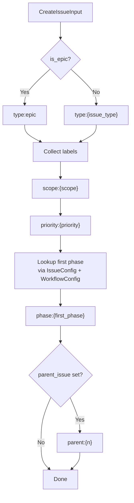
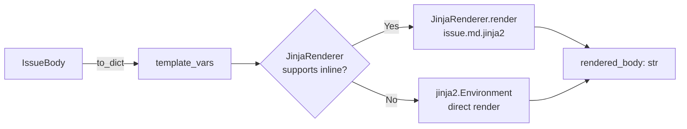
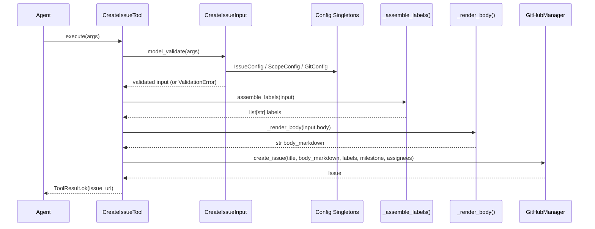
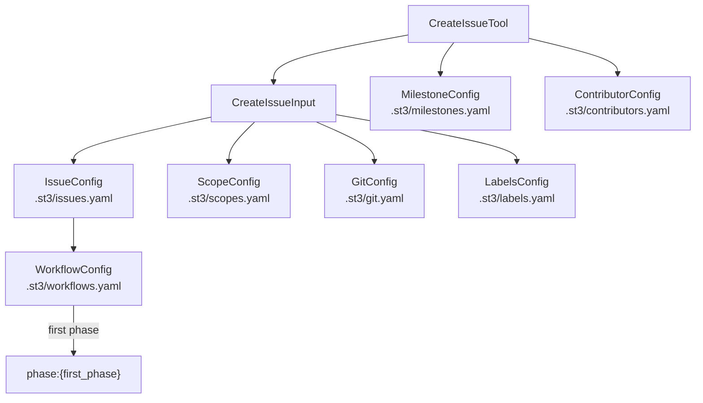

<!-- docs/development/issue149/design.md -->
<!-- template=design version=5827e841 created=2026-02-18 updated=2026-02-18 -->
# Design: Redesign create_issue Tool (Issue #149)

**Status:** DRAFT
**Version:** 1.0
**Last Updated:** 2026-02-18

---

## Purpose

Define the detailed technical design for the redesigned `create_issue` tool: new config singleton classes, Pydantic schema reshape, internal label assembly, and Jinja2 body rendering.

## Scope

**In Scope:**
- `mcp_server/tools/issue_tools.py`
- `mcp_server/config/issue_config.py` (new)
- `mcp_server/config/scope_config.py` (new)
- `mcp_server/config/milestone_config.py` (new)
- `mcp_server/config/contributor_config.py` (new)
- `.st3/issues.yaml` (new — list schema with `label` field)
- `.st3/scopes.yaml` (new — flat list: `architecture`, `mcp-server`, `platform`, `tooling`, `workflow`, `documentation`)
- `.st3/milestones.yaml` (new, empty)
- `.st3/contributors.yaml` (new, empty)
- `.st3/labels.yaml` (cleanup: remove `status:*`, fix `parent:*` pattern, add `type:chore`)
- `.st3/git.yaml` (add `issue_title_max_length: 72`)

**Out of Scope:**
- `get_issue` / `list_issues` (issue #150)
- `create_branch` enrichment (issue #116)
- GitHub Projects integration
- Retroactive issue renaming

## Prerequisites

- [docs/development/issue149/research.md](docs/development/issue149/research.md)
- [docs/development/issue149/planning.md](docs/development/issue149/planning.md)
- [mcp_server/config/git_config.py](mcp_server/config/git_config.py) — singleton pattern to replicate
- [mcp_server/scaffolding/templates/concrete/issue.md.jinja2](mcp_server/scaffolding/templates/concrete/issue.md.jinja2) — body template

---

## 1. Problem Statement

`CreateIssueInput` currently accepts free-form, unvalidated input: title has no length constraint, body is a raw string, and labels are unchecked. There is no enforced convention for issue type, scope, or priority. This makes automated issue creation convention-blind and produces inconsistent GitHub issues that violate labelling standards.

---

## 2. Requirements

### 2.1 Functional

| ID | Requirement |
|----|-------------|
| REQ-F1 | `CreateIssueInput` must require `issue_type`, validated against `issues.yaml`; unknown values produce `ValidationError` with list of valid types |
| REQ-F2 | `title` must have max length from `git.yaml` (`issue_title_max_length: 72`) |
| REQ-F3 | `priority` required, validated against `labels.yaml` `priority:*` category |
| REQ-F4 | `scope` required, validated against `scopes.yaml` names (`architecture`, `mcp-server`, `platform`, `tooling`, `workflow`, `documentation`) |
| REQ-F5 | `body` required as `IssueBody` instance (not `str`); `problem` field required within `IssueBody` |
| REQ-F6 | `is_epic=True` must override `type:*` label to `type:epic` regardless of `issue_type` |
| REQ-F7 | `parent_issue >= 1` must produce label `parent:{n}`; values `< 1` must be rejected |
| REQ-F8 | `milestone` must be validated against `milestones.yaml` (permissive when list empty) |
| REQ-F9 | `assignees` must be validated against `contributors.yaml` (permissive when list empty) |
| REQ-F10 | Tool must automatically set `phase:*` label from first phase of `issue_type`'s workflow |
| REQ-F11 | `IssueBody` must be rendered to GitHub issue body markdown via `issue.md.jinja2` |
| REQ-F12 | `labels.yaml` must not contain `status:*` labels |
| REQ-F13 | `labels.yaml` `parent:*` pattern must be `^parent:\d+$` (not `^parent:issue-\d+$`) |
| REQ-F14 | `labels.yaml` must contain `type:chore` label |

### 2.2 Non-Functional

| ID | Requirement |
|----|-------------|
| REQ-NF1 | All new Python files scaffolded via `scaffold_artifact` |
| REQ-NF2 | All Pydantic models exposed via MCP must have `json_schema_extra` with ≥ 2 examples |
| REQ-NF3 | All test functions have `-> None` return type annotation |
| REQ-NF4 | Fixtures injecting other fixtures use `@pytest.fixture(name="x")` with private `_x` function name |
| REQ-NF5 | All config singletons follow `GitConfig.from_file()` pattern |
| REQ-NF6 | All `@field_validator` methods are synchronous |
| REQ-NF7 | Quality gates pass after each TDD cycle: Ruff format, lint, type check, pytest, coverage ≥ 90% |
| REQ-NF8 | `execute()` handles `ValidationError`, `ExecutionError`, and rendering errors via `ToolResult.error()` with actionable messages |

---

## 3. Design Options Considered

### Option A: Tool-layer only (chosen)

Structured fields in `CreateIssueInput`. Label assembly and body rendering in `CreateIssueTool.execute()`. Config singletons in `mcp_server/config/`. Manager and adapter unchanged.

**Pros:** Minimal blast radius. Manager API stable. Config is mockable. Tool layer is the correct boundary for input normalisation.
**Cons:** `execute()` grows — mitigated by extracting `_assemble_labels()` and `_render_body()` as private helpers.

### Option B: Manager-layer label assembly

Move label assembly into `GitHubManager.create_issue()`.

**Cons:** Manager becomes aware of project conventions (violates SRP). Manager should not depend on `labels.yaml` or `issues.yaml`.

### Option C: Separate `LabelAssembler` service

Extract label assembly into a standalone service class.

**Cons:** Over-engineering for 6 label derivation rules. Private helpers on the tool are sufficient and independently testable.

**Decision: Option A** — tool-layer only, minimum blast radius, config singletons stay in `mcp_server/config/`.

---

## 4. Key Decisions

| # | Decision | Rationale |
|---|----------|-----------|
| D1 | `issue_type` is required (not optional) | No sensible default exists. An optional with a default would silently allow convention violations. |
| D2 | `labels` field removed entirely from `CreateIssueInput` | Free-form labels bypass all validation. Structured derivation guarantees label conventions. |
| D3 | `body` changes from `str` to `IssueBody` nested Pydantic model | Ensures consistent GitHub issue structure. `issue.md.jinja2` is already tested. Breaking change accepted per planning. |
| D4 | `scopes.yaml` contains only scope names (no `label` field) | `labels.yaml` is SSOT for label existence. Label derived by convention: `scope:{name}`. |
| D5 | `milestones.yaml` and `contributors.yaml` start empty; validation is permissive when list is empty | Prevents blocking issue creation before files are populated. Documented as known limitation. |
| D6 | `is_epic=True` overrides `type:*` to `type:epic` (one type label per issue) | Two type labels are ambiguous for tooling. `get_issue` (#150) must identify type unambiguously. |
| D7 | `phase:*` label derived from first workflow phase in `issues.yaml` → `workflows.yaml` | Phase is a workflow-state concern, not an authoring concern. |

---

## 5. Design

### 5.1 Config Singleton Layer

All four new config classes follow the `GitConfig.from_file()` pattern:

```python
@classmethod
def from_file(cls, path: Path | None = None) -> "IssueConfig":
    resolved = path or Path(".st3/issues.yaml")
    data = yaml.safe_load(resolved.read_text())
    return cls.model_validate(data)
```

#### `IssueConfig` (`.st3/issues.yaml`)

```python
class IssueTypeEntry(BaseModel):
    name: str
    workflow: str
    label: str          # e.g. "type:bug" — hotfix maps to "type:bug", not "type:hotfix"

class IssueConfig(BaseModel):
    version: str
    issue_types: list[IssueTypeEntry]
    optional_label_inputs: dict[str, Any] = {}

    def get_workflow(self, issue_type: str) -> str: ...
    def get_label(self, issue_type: str) -> str: ...
```

`get_label()` is the key method for label assembly: `hotfix` returns `"type:bug"`, not `"type:hotfix"`.

**`.st3/issues.yaml` schema:**

```yaml
version: "1.0"
issue_types:
  - name: feature
    workflow: feature
    label: "type:feature"
  - name: bug
    workflow: bug
    label: "type:bug"
  - name: hotfix
    workflow: hotfix
    label: "type:bug"
  - name: refactor
    workflow: refactor
    label: "type:refactor"
  - name: docs
    workflow: docs
    label: "type:docs"
  - name: chore
    workflow: feature
    label: "type:chore"
  - name: epic
    workflow: epic
    label: "type:epic"
required_label_categories:
  - type
  - priority
  - scope
optional_label_inputs:
  is_epic:
    type: bool
    label: "type:epic"
    behavior: "Overrides type:* label from issue_type"
  parent_issue:
    type: int
    label_pattern: "parent:{value}"
    description: "Applies parent:{issue_number} label (e.g., parent:91)"
```

#### `ScopeConfig` (`.st3/scopes.yaml`)

```python
class ScopeConfig(BaseModel):
    version: str
    scopes: list[str]

    def has_scope(self, name: str) -> bool: ...
```

**`.st3/scopes.yaml` schema (flat list):**

```yaml
version: "1.0"
scopes:
  - architecture
  - mcp-server
  - platform
  - tooling
  - workflow
  - documentation
```

No `label` field — label is `scope:{name}` by convention.

#### `MilestoneConfig` (`.st3/milestones.yaml`)

```python
class MilestoneEntry(BaseModel):
    number: int
    title: str
    state: str = "open"

class MilestoneConfig(BaseModel):
    version: str
    milestones: list[MilestoneEntry] = []

    def validate_milestone(self, title: str) -> bool: ...
```

Starts empty. Validation is permissive when `milestones` is `[]`.

#### `ContributorConfig` (`.st3/contributors.yaml`)

```python
class ContributorEntry(BaseModel):
    login: str
    name: str | None = None

class ContributorConfig(BaseModel):
    version: str
    contributors: list[ContributorEntry] = []

    def validate_assignee(self, login: str) -> bool: ...
```

Starts empty. Validation is permissive when `contributors` is `[]`.

---

### 5.2 `IssueBody` Nested Model

```python
class IssueBody(BaseModel):
    problem: str                        # required
    expected: str | None = None
    actual: str | None = None
    context: str | None = None
    steps_to_reproduce: str | None = None
    related_docs: list[str] | None = None
```

Maps directly to the variables consumed by `issue.md.jinja2`.

---

### 5.3 Redesigned `CreateIssueInput`

```python
class CreateIssueInput(BaseModel):
    model_config = ConfigDict(...)

    issue_type: str
    title: str
    priority: str
    scope: str
    body: IssueBody

    # Optional label-producing fields
    is_epic: bool = False
    parent_issue: int | None = None
    milestone: str | None = None
    assignees: list[str] | None = None

    @field_validator("issue_type")
    @classmethod
    def validate_issue_type(cls, v: str) -> str: ...

    @field_validator("title")
    @classmethod
    def validate_title_length(cls, v: str) -> str: ...

    @field_validator("priority")
    @classmethod
    def validate_priority(cls, v: str) -> str: ...

    @field_validator("scope")
    @classmethod
    def validate_scope(cls, v: str) -> str: ...

    @field_validator("parent_issue")
    @classmethod
    def validate_parent_issue(cls, v: int | None) -> int | None: ...
```

`json_schema_extra` provides ≥ 2 usage examples per REQ-NF2.

---

### 5.4 Label Assembly

`_assemble_labels()` is a private method on `CreateIssueTool`. It is pure (no side effects) and independently testable.

**Assembly rules (in order):**

```
type_label     = "type:epic"                              if is_epic
               = IssueConfig.get_label(issue_type)        otherwise  # hotfix → "type:bug"
scope_label    = "scope:{scope}"
priority_label = "priority:{priority}"
phase_label    = "phase:{first_phase}"    from workflows.yaml via issue_type → workflow
parent_label   = "parent:{n}"            if parent_issue is not None
```



---

### 5.5 Body Rendering

`_render_body()` uses `issue.md.jinja2`. The rendering approach depends on whether `JinjaRenderer` supports inline usage (verified in cycle 3). Fallback is direct `jinja2.Environment`.



---

### 5.6 `CreateIssueTool.execute()` Flow



---

### 5.7 `.st3/` YAML Changes

#### `.st3/git.yaml`

Add field:
```yaml
issue_title_max_length: 72
```

#### `.st3/labels.yaml`

- **Remove** all `status:*` labels (4 labels)
- **Update** `freeform_exceptions` pattern: `^parent:issue-\d+$` → `^parent:\d+$`
- **Add** `type:chore` label

#### `.st3/issues.yaml`

New file — see schema in §5.1. Includes `optional_label_inputs` section:

```yaml
optional_label_inputs:
  is_epic:
    label: "type:epic"
    description: "Overrides type:* when True"
  parent_issue:
    label_pattern: "parent:{n}"
    description: "Applies parent:{n} label"
```

#### `.st3/scopes.yaml`

New file — flat list of valid scope names. See §5.1 for full schema.

```yaml
version: "1.0"
scopes:
  - architecture
  - mcp-server
  - platform
  - tooling
  - workflow
  - documentation
```

---

## 6. Config Dependency Map



---

## 7. Affected Files

| File | Change Type |
|------|-------------|
| `mcp_server/tools/issue_tools.py` | Modify — reshape `CreateIssueInput`, add `IssueBody`, add private helpers |
| `mcp_server/config/issue_config.py` | New (scaffold) |
| `mcp_server/config/scope_config.py` | New (scaffold) |
| `mcp_server/config/milestone_config.py` | New (scaffold) |
| `mcp_server/config/contributor_config.py` | New (scaffold) |
| `.st3/issues.yaml` | New |
| `.st3/scopes.yaml` | New |
| `.st3/milestones.yaml` | New (empty) |
| `.st3/contributors.yaml` | New (empty) |
| `.st3/labels.yaml` | Modify — remove `status:*`, fix `parent:*` pattern, add `type:chore` |
| `.st3/git.yaml` | Modify — add `issue_title_max_length` |
| `tests/unit/config/test_issue_config.py` | New (scaffold) |
| `tests/unit/config/test_scope_config.py` | New (scaffold) |
| `tests/unit/config/test_milestone_config.py` | New (scaffold) |
| `tests/unit/config/test_contributor_config.py` | New (scaffold) |
| `tests/unit/tools/test_issue_tools.py` | Modify — update existing tests + add new |

---

## 8. Open Questions

1. Does `JinjaRenderer.render()` support inline invocation (no file output, returns string)? If not, fall back to direct `jinja2.Environment`. Verify in cycle 3.
2. Should `MilestoneConfig` and `ContributorConfig` expose a `sync_from_github()` stub (not implemented) as a documented future extension point? Recommendation: yes — `NotImplemented` stub with docstring.

---

## 9. Related Documents

- [docs/development/issue149/research.md](docs/development/issue149/research.md)
- [docs/development/issue149/planning.md](docs/development/issue149/planning.md)
- [docs/coding_standards/CODE_STYLE.md](docs/coding_standards/CODE_STYLE.md)
- [docs/coding_standards/QUALITY_GATES.md](docs/coding_standards/QUALITY_GATES.md)
- [mcp_server/config/git_config.py](mcp_server/config/git_config.py)
- [mcp_server/tools/git_tools.py](mcp_server/tools/git_tools.py)
- [mcp_server/scaffolding/templates/concrete/issue.md.jinja2](mcp_server/scaffolding/templates/concrete/issue.md.jinja2)
