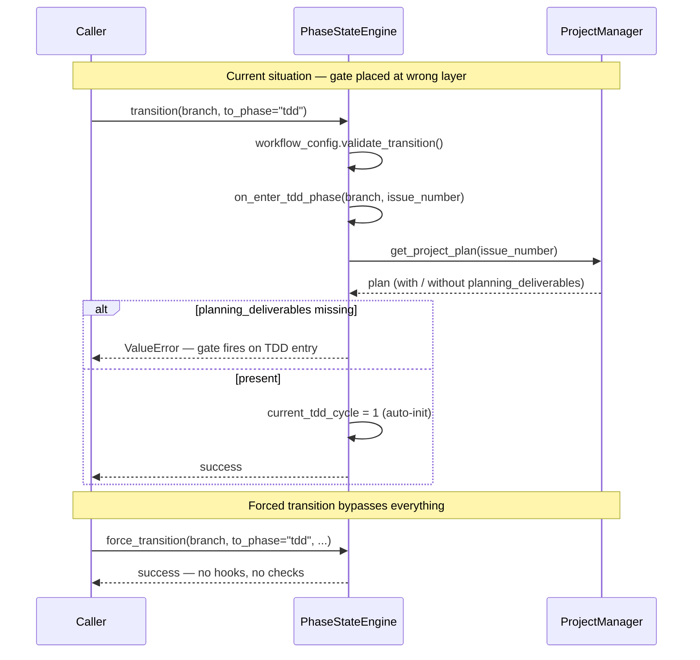

<!-- docs/development/issue229/research.md -->
<!-- template=research version=8b7bb3ab created=2026-02-19 updated=2026-02-19 -->
# Phase Deliverables Enforcement — exit gate (hard) + entry warning (soft)

**Status:** DRAFT  
**Version:** 1.1  
**Last Updated:** 2026-02-19

---

## Purpose

Investigate the current implementation of phase-transition hooks in `PhaseStateEngine` and establish the requirements for a config-driven deliverables enforcement strategy.

## Scope

**In Scope:**
- `PhaseStateEngine`: `on_enter_tdd_phase`, `on_exit_tdd_phase`, `transition()`, `force_transition()`
- `workphases.yaml`: current structure and extensibility
- `projects.json`: `planning_deliverables` schema (as introduced in #146)
- Existing tests touching phase hooks and transition validation

**Out of Scope:**
- Design decisions for the new implementation (→ design.md)
- Implementation of `exit_requires` / `entry_expects` (→ TDD phase)
- Deliverable types beyond `planning_deliverables` and `tdd_cycle_history`
- Changes to `workflow_config.py` or `workflows.yaml`

## Prerequisites

Read these first:
1. Issue #146 branch: `feature/146-tdd-cycle-tracking`
2. `PhaseStateEngine` architecture: [mcp_server/managers/phase_state_engine.py](../../../mcp_server/managers/phase_state_engine.py)
3. `workphases.yaml`: [.st3/workphases.yaml](../../../.st3/workphases.yaml)

---

## Problem Statement

The current `on_enter_tdd_phase` hook validates whether `planning_deliverables` exist in `projects.json`, raising a `ValueError` if they are absent. This is architecturally incorrect: the TDD phase has no responsibility for the output of the Planning phase. Furthermore, the check can be bypassed entirely via a forced transition. There is no consistent mechanism for validating deliverables at phase exit or entry.

## Research Goals

- Understand how the current phase-transition hooks are implemented in `PhaseStateEngine`
- Inventory which deliverables are relevant per phase (current and extensible)
- Determine whether `workphases.yaml` is suitable as SSOT for per-phase deliverable contracts
- Establish how the engine can dynamically read and enforce `exit_requires` / `entry_expects`
- Inventory which existing tests must be updated
- Document open questions for the planning phase

---

## Background

Issue #146 (TDD Cycle Tracking) introduced `on_enter_tdd_phase` as a hook that validates the presence of `planning_deliverables`. During the validation phase of #146, it was identified that this gate is placed at the wrong layer: the TDD phase should not be responsible for Planning output. At the same time, there is no exit gate on the Planning phase itself, meaning deliverables are never enforced when leaving that phase. This issue introduces a generic, config-driven solution.

---

## Findings

### Current hook flow

### Hook implementation details

- **`on_enter_tdd_phase` (line 552):** Validates `planning_deliverables` present in project plan → raises `ValueError` if absent. Hard gate on TDD entry — architecturally incorrect.
- **`on_exit_tdd_phase` (line 574):** Preserves `last_tdd_cycle`, clears `current_tdd_cycle`. Logs a warning if the phase is exited without any cycles — does not block (soft gate).
- **`transition()` (line 129):** Calls `on_exit_tdd_phase` when leaving TDD, and `on_enter_tdd_phase` when entering. Both hooks are hardcoded by phase name — no generic mechanism.
- **`force_transition()` (line 193):** Bypasses all workflow validation and phase hooks entirely — no deliverable check possible on forced transitions.

### Configuration and schema

- **`workphases.yaml`:** Currently defines `subphases`, `default_commit_type`, and `display_name` per phase. No `exit_requires` or `entry_expects` fields — extensible without breaking changes.
- **`projects.json` schema:** `planning_deliverables` is stored via `save_planning_deliverables()` in `ProjectManager`. Key structure: `{ tdd_cycles: { total, cycles: [...] } }`. Field is optional — not all issues populate it.

### Test impact

- **`tests/unit/managers/test_phase_state_engine.py`** — `TestTDDPhaseHooks` and `TestTransitionHooksWiring` must be revised when refactoring `on_enter_tdd_phase`.

---

## Open Questions

- ❓ Should `force_transition()` also invoke exit/entry hooks, or is that deliberately out of scope (forced = audit trail sufficient)?
- ❓ Should `entry_expects` be checked before or after saving the transition to `state.json`?
- ❓ How to handle phases with no deliverables — empty `exit_requires: []` or absence of the field?
- ❓ Should `exit_requires` keys reference top-level keys in the project plan, or can nested paths be used (e.g. `planning_deliverables.tdd_cycles`)?
- ❓ Is `tdd_cycle_history` a meaningful exit gate for TDD, or is it too strict (what if 0 cycles were run)?

---

## Related Documentation

- **[PhaseStateEngine implementation][related-1]**
- **[workphases.yaml — phase metadata SSOT][related-2]**
- **[ProjectManager — save_planning_deliverables(), get_project_plan()][related-3]**
- **[test_phase_state_engine.py — TestTDDPhaseHooks, TestTransitionHooksWiring][related-4]**
- **[Issue #146 design — TDD cycle tracking + planning_deliverables schema][related-5]**

<!-- Link definitions -->
[related-1]: ../../../mcp_server/managers/phase_state_engine.py
[related-2]: ../../../.st3/workphases.yaml
[related-3]: ../../../mcp_server/managers/project_manager.py
[related-4]: ../../../tests/unit/managers/test_phase_state_engine.py
[related-5]: ../issue146/design.md

---

## Version History

| Version | Date | Author | Changes |
|---------|------|--------|---------|
| 1.1 | 2026-02-19 | Agent | Translated to English, fixed list rendering, added Mermaid diagram |
| 1.0 | 2026-02-19 | Agent | Initial draft |
