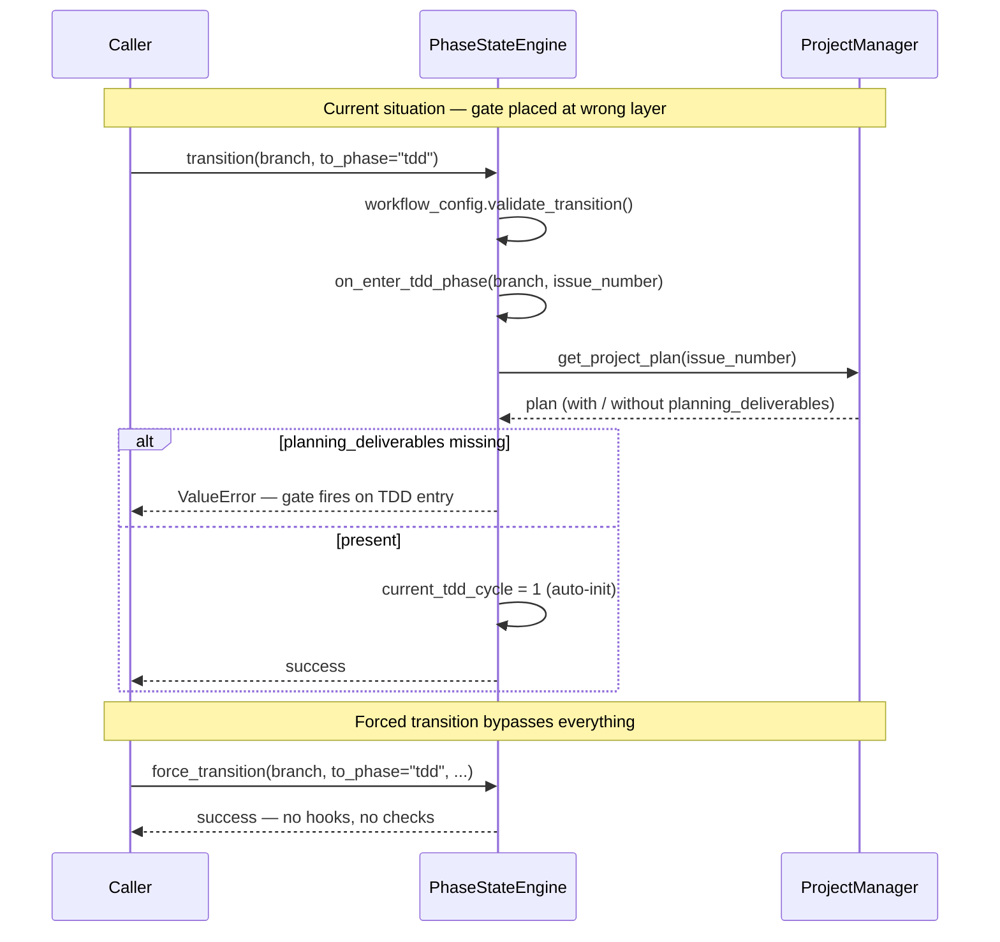
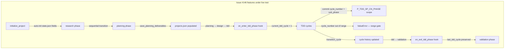

<!-- docs/development/issue229/research.md -->
<!-- template=research version=8b7bb3ab created=2026-02-19 updated=2026-02-19 -->
# Phase Deliverables Enforcement — exit gate (hard) + entry warning (soft)

**Status:** DRAFT  
**Version:** 1.2  
**Last Updated:** 2026-02-19

---

## Purpose

Investigate the current implementation of phase-transition hooks in `PhaseStateEngine` and establish the requirements for a config-driven deliverables enforcement strategy.

## Scope

**In Scope:**
- `PhaseStateEngine`: `on_enter_tdd_phase`, `on_exit_tdd_phase`, `transition()`, `force_transition()`
- `workphases.yaml`: current structure and extensibility
- `projects.json`: `planning_deliverables` schema (as introduced in #146)
- Existing tests touching phase hooks and transition validation

**Out of Scope:**
- Design decisions for the new implementation (→ design.md)
- Implementation of `exit_requires` / `entry_expects` (→ TDD phase)
- Deliverable types beyond `planning_deliverables` and `tdd_cycle_history`
- Changes to `workflow_config.py` or `workflows.yaml`

## Prerequisites

Read these first:
1. Issue #146 branch: `feature/146-tdd-cycle-tracking`
2. `PhaseStateEngine` architecture: [mcp_server/managers/phase_state_engine.py](../../../mcp_server/managers/phase_state_engine.py)
3. `workphases.yaml`: [.st3/workphases.yaml](../../../.st3/workphases.yaml)

---

## Problem Statement

The current `on_enter_tdd_phase` hook validates whether `planning_deliverables` exist in `projects.json`, raising a `ValueError` if they are absent. This is architecturally incorrect: the TDD phase has no responsibility for the output of the Planning phase. Furthermore, the check can be bypassed entirely via a forced transition. There is no consistent mechanism for validating deliverables at phase exit or entry.

## Research Goals

- Understand how the current phase-transition hooks are implemented in `PhaseStateEngine`
- Inventory which deliverables are relevant per phase (current and extensible)
- Determine whether `workphases.yaml` is suitable as SSOT for per-phase deliverable contracts
- Establish how the engine can dynamically read and enforce `exit_requires` / `entry_expects`
- Inventory which existing tests must be updated
- Document open questions for the planning phase

---

## Background

Issue #146 (TDD Cycle Tracking) introduced `on_enter_tdd_phase` as a hook that validates the presence of `planning_deliverables`. During the validation phase of #146, it was identified that this gate is placed at the wrong layer: the TDD phase should not be responsible for Planning output. At the same time, there is no exit gate on the Planning phase itself, meaning deliverables are never enforced when leaving that phase. This issue introduces a generic, config-driven solution.

---

## Findings

### Current hook flow



### Hook implementation details

- **`on_enter_tdd_phase` (line 552):** Validates `planning_deliverables` present in project plan → raises `ValueError` if absent. Hard gate on TDD entry — architecturally incorrect.
- **`on_exit_tdd_phase` (line 574):** Preserves `last_tdd_cycle`, clears `current_tdd_cycle`. Logs a warning if the phase is exited without any cycles — does not block (soft gate).
- **`transition()` (line 129):** Calls `on_exit_tdd_phase` when leaving TDD, and `on_enter_tdd_phase` when entering. Both hooks are hardcoded by phase name — no generic mechanism.
- **`force_transition()` (line 193):** Bypasses all workflow validation and phase hooks entirely — no deliverable check possible on forced transitions.

### Configuration and schema

- **`workphases.yaml`:** Currently defines `subphases`, `default_commit_type`, and `display_name` per phase. No `exit_requires` or `entry_expects` fields — extensible without breaking changes.
- **`projects.json` schema:** `planning_deliverables` is stored via `save_planning_deliverables()` in `ProjectManager`. Key structure: `{ tdd_cycles: { total, cycles: [...] } }`. Field is optional — not all issues populate it.

### Test impact

- **`tests/unit/managers/test_phase_state_engine.py`** — `TestTDDPhaseHooks` and `TestTransitionHooksWiring` must be revised when refactoring `on_enter_tdd_phase`.

---

## Issue #146 Validation Opportunities

This branch (`feature/229-phase-deliverables-enforcement`) is based on `feature/146-tdd-cycle-tracking`, making every workflow action on this branch a live exercise of #146 machinery. The table below maps each planned #229 workflow step to the #146 feature it exercises, and what the expected observable outcome is.



| #229 Workflow Step | #146 Feature Exercised | Expected Outcome |
|--------------------|------------------------|------------------|
| `initialize_project(229)` | State init with `current_tdd_cycle=None`, `tdd_cycle_history=[]` | Fields present in `state.json` |
| `research → planning` (sequential) | `workflow_config.validate_transition()` | Transition succeeds |
| `planning → research` (forced) | `force_transition()` audit trail | `forced=True`, `skip_reason` in `state.json` |
| `save_planning_deliverables(229, {...})` | `ProjectManager.save_planning_deliverables()` | Key present in `projects.json["229"]` |
| `planning → design → tdd` | `on_enter_tdd_phase` hook | `current_tdd_cycle=1` auto-initialized |
| Commit with `cycle_number=1, sub_phase="red"` | Scope generation `P_TDD_SP_C{N}_{PHASE}` | Commit message: `test(P_TDD_SP_C1_RED): ...` |
| Commit with `cycle_number=1, sub_phase="green"` | Scope generation | Commit message: `feat(P_TDD_SP_C1_GREEN): ...` |
| `transition_cycle(to_cycle=2)` | Cycle transition + history append | `current_tdd_cycle=2`, cycle 1 in `tdd_cycle_history` |
| Commit with `cycle_number=99` (out of range) | Range validation `_validate_cycle_number_range` | `ValueError: cycle_number must be in range [1..N]` |
| `tdd → validation` | `on_exit_tdd_phase` hook | `last_tdd_cycle` set, `current_tdd_cycle=None` |

### What #146 does NOT yet enforce (expected gaps)

These are the gaps that #229 itself will close — observing them during the trial confirms the need for this issue:

| Gap | Where it manifests |
|-----|--------------------|
| Leaving Planning without `planning_deliverables` is silent | `planning → design` succeeds with no deliverables present |
| Entering TDD with missing `planning_deliverables` raises in wrong place | `on_enter_tdd_phase` raises `ValueError` — should be planning exit |
| Forced `design → tdd` skips the planning deliverables check entirely | No error, no warning |

### MCP tool registration pattern

New tools follow the `BaseTool` subclass pattern. Tools in `mcp_server/tools/project_tools.py` already handle `initialize_project` and `get_project_plan`. `save_planning_deliverables` will become `SavePlanningDeliverablesTool` in that same file, registered in `server.py` alongside the existing project tools.

### Structured deliverables schema (`projects.json`)

During the planning phase trial, the `planning_deliverables` schema was extended with a `validates` key per deliverable — the same schema that the Option-C checker will consume at phase exit:

```jsonc
{
  "id": "D1.2",
  "description": "DeliverableChecker implementation",
  "validates": {
    "type": "file_exists",           // file_exists | contains_text | absent_text | key_path
    "file": "mcp_server/managers/deliverable_checker.py"
  }
}
```

Supported `type` values:

| Type | Applies to | Check |
|------|-----------|-------|
| `file_exists` | Any file | File is present on disk |
| `contains_text` | `.py`, `.md`, any text | File contains literal string `text` |
| `absent_text` | `.py`, `.md`, any text | File does NOT contain `text` |
| `key_path` | `.json`, `.yaml` | Dot-notation path resolves to a value |

Note: SCAFFOLD-header check (original Option-C formulation) is a special case of `contains_text` where `text = "<!-- template="`.

---

## Open Questions

- ✅ **Should `force_transition()` invoke hooks?** No — forced transitions are an audit-trail escape hatch by design. Invoking gates would defeat the purpose. GAP-03 scope: log a warning listing which gates were skipped. Not blocked.
- ✅ **`entry_expects` before or after saving transition to `state.json`?** Before — a failed entry warning should never leave residual state.
- ✅ **Phases with no deliverables — empty `exit_requires: []` or absence of field?** Absence of field = no-op. Empty list also = no-op. Existing phases without the field must not break.
- ✅ **`exit_requires` references — top-level keys or nested paths?** Nested dot-notation paths allowed; the checker resolves them in JSON/YAML. Python files use `contains_text`/`absent_text` instead.
- ✅ **Is `tdd_cycle_history` a meaningful exit gate for TDD?** Out of scope for #229 — too strict, breaks legitimate 0-cycle exits. Not added to `exit_requires` on `tdd` phase.

---

## Related Documentation

- **[PhaseStateEngine implementation][related-1]**
- **[workphases.yaml — phase metadata SSOT][related-2]**
- **[ProjectManager — save_planning_deliverables(), get_project_plan()][related-3]**
- **[test_phase_state_engine.py — TestTDDPhaseHooks, TestTransitionHooksWiring][related-4]**
- **[Issue #146 design — TDD cycle tracking + planning_deliverables schema][related-5]**

<!-- Link definitions -->
[related-1]: ../../../mcp_server/managers/phase_state_engine.py
[related-2]: ../../../.st3/workphases.yaml
[related-3]: ../../../mcp_server/managers/project_manager.py
[related-4]: ../../../tests/unit/managers/test_phase_state_engine.py
[related-5]: ../issue146/design.md

---

## Version History

| Version | Date | Author | Changes |
|---------|------|--------|---------|
| 1.2 | 2026-02-19 | Agent | Added structured deliverables schema, MCP tool pattern, answered all open questions |
| 1.1 | 2026-02-19 | Agent | Translated to English, fixed list rendering, added Mermaid diagram |
| 1.0 | 2026-02-19 | Agent | Initial draft |
