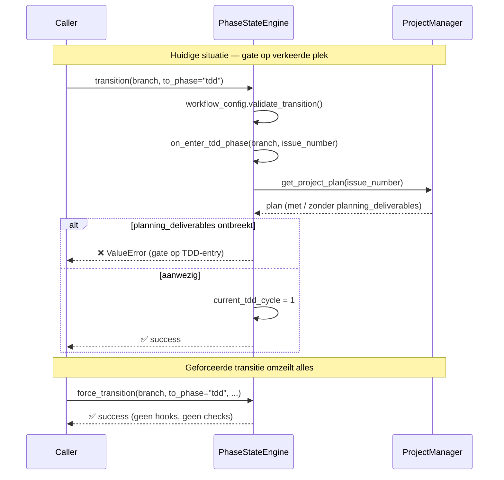

<!-- docs/development/issue229/research.md -->
<!-- template=research version=8b7bb3ab created=2026-02-19 updated= -->
# Phase Deliverables Enforcement — exit gate (hard) + entry warning (soft)

**Status:** DRAFT  
**Version:** 1.0  
**Last Updated:** 2026-02-19

---

## Purpose

Onderzoek de huidige implementatie van fase-transitie hooks en bepaal de vereisten voor een config-gedreven deliverables enforcement strategie.

## Scope

**In Scope:**
- `PhaseStateEngine`: `on_enter_tdd_phase`, `on_exit_tdd_phase`, `transition()`, `force_transition()`
- `workphases.yaml`: huidige structuur en uitbreidbaarheid
- `projects.json`: `planning_deliverables` schema (zoals geïntroduceerd in #146)
- Bestaande tests die raken aan fase-hooks en transitie-validatie

**Out of Scope:**
- Design-beslissingen over de nieuwe implementatie (→ design.md)
- Implementatie van `exit_requires` / `entry_expects` (→ TDD fase)
- Andere deliverable-types buiten `planning_deliverables` en `tdd_cycle_history`
- Aanpassingen aan `workflow_config.py` of `workflows.yaml`

## Prerequisites

Read these first:
1. Issue #146 branch actief: feature/146-tdd-cycle-tracking
2. Kennis van PhaseStateEngine architectuur (mcp_server/managers/phase_state_engine.py)
3. workphases.yaml gelezen en begrepen
---

## Problem Statement

De huidige `on_enter_tdd_phase` hook valideert of `planning_deliverables` aanwezig zijn in `projects.json`. Dit is architectureel incorrect: TDD-fase kent verantwoordelijkheid die bij de Planning-fase hoort. Bovendien is de check te omzeilen via een geforceerde transitie. Er is geen consistent mechanisme voor fase-uitgang/binnenkomst validatie van deliverables.

## Research Goals

- Begrijpen hoe de huidige fase-transitie hooks geïmplementeerd zijn in PhaseStateEngine
- Inventariseren welke deliverables per fase relevant zijn (nu en uitbreidbaar)
- Onderzoeken of workphases.yaml geschikt is als SSOT voor deliverable-contracten per fase
- Bepalen hoe de engine dynamisch exit_requires / entry_expects kan lezen en afdwingen
- Inventariseren welke bestaande tests aangepast moeten worden
- Vastleggen van open vragen voor de planning-fase

---

## Background

In issue #146 (TDD Cycle Tracking) werd `on_enter_tdd_phase` geïntroduceerd als hook die valideert of `planning_deliverables` bestaan. Tijdens de validation-fase van #146 is vastgesteld dat deze gate op de verkeerde plek zit: de TDD-fase kent geen verantwoordelijkheid voor Planning-output. Tegelijkertijd ontbreekt een exit gate op de Planning-fase zelf, waardoor deliverables niet worden afgedwongen bij het verlaten van die fase. Dit issue introduceert een generieke, config-gedreven oplossing.

---

## Findings

- **`on_enter_tdd_phase` (regel 552):** Valideert `planning_deliverables` aanwezig in project plan → gooit `ValueError` als ze ontbreken. Dit is een harde gate op entry — architectureel incorrect.
- **`on_exit_tdd_phase` (regel 574):** Slaat `last_tdd_cycle` op en wist `current_tdd_cycle`. Logt een warning als de fase verlaten wordt zonder cycles — maar blokkeert niet (zachte gate).
- **`transition()` (regel 129):** Roept `on_exit_tdd_phase` aan bij verlaten van TDD, en `on_enter_tdd_phase` bij binnenkomst. Beide hooks zijn hardcoded per fase-naam — geen generiek mechanisme.
- **`force_transition()` (regel 193):** Omzeilt alle workflow-validatie én fase-hooks volledig — geen enkel deliverable-check mogelijk bij geforceerde transities.
- **`workphases.yaml`:** Bevat momenteel `subphases`, `default_commit_type` en `display_name` per fase. Geen `exit_requires` of `entry_expects` velden — uitbreidbaar zonder breaking changes.
- **`projects.json` schema:** `planning_deliverables` wordt opgeslagen via `save_planning_deliverables()` in `ProjectManager`. Sleutelstructuur: `{ tdd_cycles: { total, cycles: [...] } }`. Veld is optioneel — niet alle issues hebben het.
- **Bestaande tests:** `tests/unit/managers/test_phase_state_engine.py` — `TestTDDPhaseHooks` en `TestTransitionHooksWiring`. Deze moeten herzien worden bij refactor van `on_enter_tdd_phase`.

## Open Questions

- ❓ Moet `force_transition()` ook exit/entry hooks aanroepen, of blijft dat bewust buiten scope (forced = audit trail volstaat)?
- ❓ Wordt `entry_expects` gecontroleerd vóór of ná het opslaan van de transitie in state.json?
- ❓ Hoe wordt omgegaan met fases die geen deliverables hebben — lege `exit_requires: []` of afwezigheid van het veld?
- ❓ Moeten `exit_requires` sleutels verwijzen naar top-level keys in het project plan, of kan het ook geneste paden zijn (bijv. `planning_deliverables.tdd_cycles`)?
- ❓ Is `tdd_cycle_history` een zinvolle exit gate voor TDD, of is het te streng (wat als er 0 cycles zijn gedraaid)?

## Related Documentation
- **[mcp_server/managers/phase_state_engine.py — volledige implementatie fase hooks][related-1]**
- **[.st3/workphases.yaml — huidige fase-metadata structuur][related-2]**
- **[mcp_server/managers/project_manager.py — save_planning_deliverables(), get_project_plan()][related-3]**
- **[tests/unit/managers/test_phase_state_engine.py — TestTDDPhaseHooks, TestTransitionHooksWiring][related-4]**
- **[docs/development/issue146/design.md — TDD cycle tracking design inclusief planning_deliverables schema][related-5]**

<!-- Link definitions -->

[related-1]: mcp_server/managers/phase_state_engine.py — volledige implementatie fase hooks
[related-2]: .st3/workphases.yaml — huidige fase-metadata structuur
[related-3]: mcp_server/managers/project_manager.py — save_planning_deliverables(), get_project_plan()
[related-4]: tests/unit/managers/test_phase_state_engine.py — TestTDDPhaseHooks, TestTransitionHooksWiring
[related-5]: docs/development/issue146/design.md — TDD cycle tracking design inclusief planning_deliverables schema

---

## Version History

| Version | Date | Author | Changes |
|---------|------|--------|---------|
| 1.0 | 2026-02-19 | Agent | Initial draft |