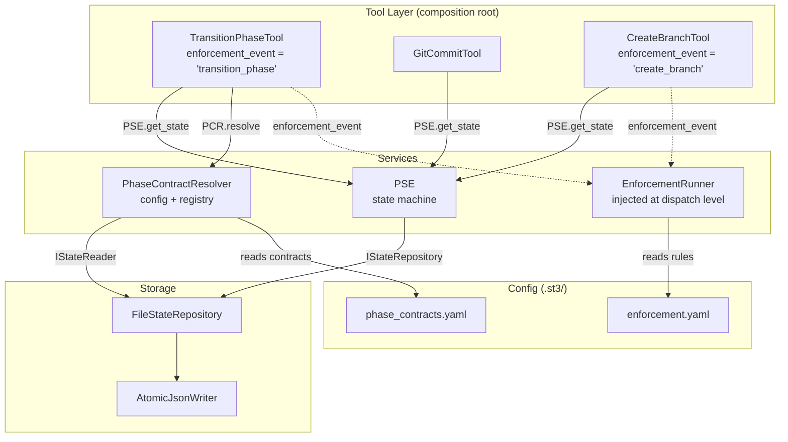

<!-- docs\development\issue257\design.md -->
<!-- template=design version=5827e841 created=2026-03-12T12:06Z updated= -->
# Config-First PSE Architecture

**Status:** APPROVED  
**Version:** 1.0  
**Last Updated:** 2026-03-12

---

## Purpose

Define the design decisions for refactoring the Phase State Engine (PSE) to a Config-First architecture: business rules extracted to YAML config, PSE reduced to a pure state machine, and supporting infrastructure (StateRepository, EnforcementRunner, PhaseContractResolver) introduced as SRP components.

## Scope

**In Scope:**
phase_contracts.yaml (per-workflow x phase gate contract, renamed from phase_deliverables.yaml); enforcement.yaml (phase- and tool-level enforcement rules, renamed from lifecycle.yaml); deliverables.json (issue-specific additive register for TDD/cycle planning); AtomicJsonWriter (shared utility for all atomic JSON writes); PhaseContractResolver (SRP class composing config + registry into list[CheckSpec]); StateRepository (SRP class for atomic state read/write, extracted from PSE); EnforcementRunner (replaces HookRunner, handles phase and tool enforcement events); IStateReader + IStateRepository (ISP-split Protocols in core/interfaces/); PSE refactor: StateRepository injection, get_state(branch) -> BranchState, legacy phase param removal; GitConfig.extract_issue_number(branch) -> int | None; tdd -> implementation phase rename (flag-day, full removal); projects.json abolishment

**Out of Scope:**
SHA-256 tamper detection for deliverables.json (issue #261); multi-project support; performance and caching optimizations; backward-compatible migration layer for renamed phases

## Prerequisites

Read these first:
1. Research complete: research_config_first_pse.md frozen as source + decision backlog
2. Issue #257 active on branch feature/257-reorder-workflow-phases
---

## 1. Context & Requirements

### 1.1. Problem Statement

The Phase State Engine (PSE) accumulates business logic directly in Python: phase gate contracts, branch policy enforcement, lifecycle hooks, and commit-type resolution are all hardcoded. This causes: (1) config changes requiring code changes (OCP violation), (2) PSE doing state management + business validation + hook orchestration (SRP violation), (3) tools reaching into StateRepository directly instead of through PSE (Law of Demeter violation), (4) no startup validation of config consistency (missing Fail-Fast).

### 1.2. Requirements

**Functional:**
- [ ] phase_contracts.yaml loader validates config at startup: ConfigError if cycle_based=true and commit_type_map is empty
- [ ] Enforcement rules in enforcement.yaml apply to both phase transitions and tool calls via EnforcementRunner
- [ ] State reads return frozen BranchState; save() is never called by query methods (CQS)
- [ ] PhaseContractResolver.resolve(workflow_name, phase, cycle_number) returns list[CheckSpec] with no StateRepository dependency
- [ ] All JSON writes are atomic via shared AtomicJsonWriter (temp-file + rename)
- [ ] state.json removed from .gitignore: git-tracked per branch, never silently lost
- [ ] GitConfig provides extract_issue_number(branch) -> int | None for all branch-name parsing
- [ ] Phase rename: tdd -> implementation, flag-day, no alias, no migration layer
- [ ] projects.json abolished: single-branch state.json as source of truth per branch
- [ ] Branch policies modeled as enforcement rules in enforcement.yaml (check_branch_policy action)

**Non-Functional:**
- [ ] Fail-fast: all invalid config combinations raise ConfigError at server startup, not at runtime
- [ ] Testability: InMemoryStateRepository for unit tests; EnforcementRunner independently testable from PSE
- [ ] Type safety: BranchState frozen=True enforces CQS at type system level (Pyright-strict)
- [ ] ISP: IStateReader (load-only) for read-only consumers; IStateRepository (load+save) for writers
- [ ] DIP: all dependencies injected via constructor; no module-level singletons with import-time side effects
- [ ] Explicit over Implicit: PSE emits explicit warning when state.json has uncommitted changes on initialize_branch()

### 1.3. Constraints

- Flag-day breaking changes are acceptable (BC approach per F24 in research)
- No migration layer for renamed phases or abolished config files
- SHA-256 tamper detection is deferred to issue #261
---

## 2. Design Options
---

## 3. Chosen Design

**Decision:** Adopt Config-First architecture: extract business rules to YAML (phase_contracts.yaml, enforcement.yaml); reduce PSE to pure state machine via StateRepository extraction; introduce PhaseContractResolver (SRP), EnforcementRunner (SRP), and ISP-split interfaces (IStateReader / IStateRepository). All decisions follow SOLID, Config-First, Fail-Fast, CQS, and Explicit-over-Implicit principles.

**Rationale:** The existing PSE is a God Class: it does state I/O, phase validation, hook orchestration, and branch-name parsing simultaneously. Config-First makes the system observable (YAML is readable), testable (swap FileStateRepository for InMemoryStateRepository), and extensible without code changes (new workflows/gates/actions via YAML). Fail-fast startup validation catches config errors before any tool call, eliminating a class of hard-to-debug runtime failures.

### 3.1. Key Design Decisions

| Decision | Rationale |
|----------|-----------|
| **A** — `phase_contracts.yaml`: required vs. recommended gates, Fail-Fast validation | `cycle_based=true` + empty `commit_type_map` = `ConfigError` at startup. Two-file split: `workphases.yaml` = metadata, `phase_contracts.yaml` = contracts. |
| **B** — `deliverables.json`: nested structure, completed-cycle guard, AtomicJsonWriter, `state.json` git-tracked | Nested JSON per issue number. Completed cycles read-only (`ValidationError` on update). Single `AtomicJsonWriter` for all JSON writes. `state.json` committed after every `transition_phase`. |
| **C** — `projects.json` abolished, flag-day | GitHub issues + local git branches are single source of truth. Multi-branch register adds complexity without benefit. |
| **D** — `PhaseContractResolver`: explicit `cycle_number` parameter, `CheckSpec` Pydantic, empty list valid | DIP: resolver has no dependency on `StateRepository`. Tool layer reads `cycle_number` from `PSE.get_state()`. Empty list is valid (e.g. `docs` workflow has no `implementation` phase). |
| **E** — `StateRepository`: ABC + File/Memory impls, `BranchState(frozen=True)`, ISP split | CQS enforced by type system. `IStateReader` for read-only consumers; `IStateRepository` for writers. Interfaces in `core/interfaces/`. |
| **F** — `enforcement.yaml`: explicit `event_source/timing/actions`, plugin registration, `EnforcementRunner` + `BaseTool.enforcement_event` class var (Option C) | Explicit avoids implicit key-encoding. Plugin fail-fast at startup (unregistered type = `ConfigError`). Option C keeps tools declarative and runner injected at dispatch level. |
| **G** — `WorkflowConfig` consolidated in `workflows.py`, `ClassVar` + lazy init, `PhaseConfigContext` facade | Eliminates duplicate module; `ClassVar` replaces module-level singleton to avoid import-time side effects. |
| **H** — `tdd` → `implementation` rename, flag-day, no alias; GitHub labels unchanged | Clean break consistent with BC approach. Label migration for external system is not cost-effective. |
| **I** — `branch_name_pattern` validates name-part only; branch policies as enforcement rules; `GitConfig.extract_issue_number()` | Combined pattern built dynamically via `build_branch_type_regex()` + name pattern. Cohesion: issue number extraction belongs to `GitConfig`. |
| **J** — Tool layer is composition root; `PSE.get_state(branch)` → `BranchState`; legacy `phase` param dropped | Law of Demeter: tool talks to PSE, not `StateRepository` directly. `frozen=True` confirms CQS. Flag-day removal: all callers already use `workflow_phase`. |

---

## 4. Detailed Design Decisions

### A — `phase_contracts.yaml` Schema

#### A1 — Field defaults and startup validation

**Decision:** Fields are optional with defaults: `subphases: []`, `commit_type_map: {}`, `cycle_based: false`. The loader fills missing fields with these defaults.

**Fail-Fast constraint:** `cycle_based: true` + `commit_type_map: {}` = `ConfigError` at server startup. A cycle-based phase without a commit_type_map causes a silent failure on the first commit — detected at startup, not at runtime.

#### A3 — `cycle_based` is a boolean

**Decision:** `cycle_based` is a boolean. `max_cycles` is a planning artifact stored in `deliverables.json`, not in config. No range check at config level.

#### A5 — Two files, two responsibilities

**Decision:** `workphases.yaml` = pure phase metadata (display_name, description, subphase whitelist). `phase_contracts.yaml` = per-workflow×phase contracts (exit_requires, commit_type_map, cycle_based). No overlap.

#### A6 — Required vs. recommended gate distinction

**Decision:** Issue-specific gates may *extend* (`recommended`) but may **not** override `required` config gates. Merge order in `PhaseContractResolver`:
- `required` gates in `phase_contracts.yaml`: immutable contract, never overridable
- `recommended` gates: extendable and overridable via `deliverables.json`, but only via authorized tools (`save_planning_deliverables`, `update_planning_deliverables`)

The `required`/`recommended` distinction is a field on each gate-spec in `phase_contracts.yaml`. Tamper detection for `deliverables.json` (SHA-256 sidecar) is out of scope — issue #261.

---

### B — `deliverables.json` Schema and Lifecycle

#### B1 — JSON structure

**Decision:** Nested: `{ "<issue_nr>": { "phases": { "design": [...], "implementation": {...} }, "created_at": "...", "workflow_name": "feature" } }`. Nested structure allows issue-level metadata alongside phase entries.

#### B2 — Mutability and completed-cycle guard

**Decision:** Mutable. `save_planning_deliverables` creates, `update_planning_deliverables` modifies.

**Guard:** `update_planning_deliverables` contains a guard on closed cycles: a cycle in `cycle_history` (status: completed) is read-only. Attempting to modify raises `ValidationError`. Open cycles are mutable.

#### B3 — 1-writer principle

**Decision:** Only `save_planning_deliverables` and `update_planning_deliverables` write to `deliverables.json`. Shared private `AtomicJsonWriter` utility for all JSON writes (incl. `state.json`), so atomic writing is implemented in one place.

#### B4 — Post-merge cleanup via enforcement

**Decision:** Delete on PR merge. Config over code: cleanup is a `post_merge` enforcement action in `enforcement.yaml`, not hardcoded in Python. Git history is the ultimate source of truth after merge.

#### B5 — `state.json` git-tracked per branch + startup guard

**Decision:** `state.json` removed from `.gitignore` so it is tracked per branch in git.

**Enforcement:** A `post`-enforcement rule on `transition_phase` triggers `commit_state_files` action, ensuring uncommitted `state.json` is never silently lost.

**Startup guard:** PSE checks at `initialize_branch()` whether `state.json` has uncommitted local changes not from a known tool call. If so: explicit warning to the agent. Not blocked, not silently ignored. (Explicit over Implicit)

---

### C — `projects.json` Abolishment

#### C2/C3 — Single-branch state + graceful degradation

**Decision:** Single-branch `state.json` remains — `projects.json` as multi-branch register is abolished. GitHub issues + local git branches are single source of truth.

Mode 2 reconstruction graceful degradation: `workflow_name: "unknown"` if GitHub API is unreachable. Offline scenario is not a priority.

#### C4 — Flag-day

**Decision:** Flag-day. `projects.json` is deleted. Existing entries are not migrated.

---

### D — `PhaseContractResolver` Interface

#### D1 + D5 — Explicit cycle_number parameter

**Decision (DIP):** `cycle_number` as explicit parameter. Signature: `resolve(workflow_name: str, phase: str, cycle_number: int | None) -> list[CheckSpec]`. Tool layer reads `cycle_number` from `StateRepository` and passes it explicitly. `PhaseContractResolver` has no dependency on `StateRepository`.

#### D2 — CheckSpec is a Pydantic model

**Decision:** Pydantic model. Already in the stack. Gives runtime validation when loading `phase_contracts.yaml` entries and a type-safe interface with `DeliverableChecker`.

#### D3 — Empty list is normal

**Decision:** Empty list is normal and not an error. Example: `docs` workflow has no `implementation` phase in `phase_contracts.yaml` — resolver returns `[]` without error.

#### D4 — ConfigError from resolver

**Decision:** `ConfigError` with `file_path=".st3/config/phase_contracts.yaml"`. `ConfigError` is a subclass of `MCPError` and is caught by `@tool_error_handler` on the tool layer. No try/except needed in PSE or manager.

---

### E — `StateRepository` Interface

#### E1 — Abstract base class

**Decision:** ABC (`abc.ABC` + `@abstractmethod`). Production: `FileStateRepository(StateRepository)`. Tests: `InMemoryStateRepository(StateRepository)`. Constructor injection.

#### E2 — Typed return: BranchState (Pydantic, frozen)

**Decision:** Typed Pydantic model `BranchState`. Consistent with D2 (CheckSpec is also Pydantic). Pyright-strict compatible, runtime validation when reading `state.json`.

`BranchState` is declared with `model_config = ConfigDict(frozen=True)`. The type system enforces CQS: queries can never mutate.

#### E3 — AtomicJsonWriter utility

**Decision:** Temp-file + rename moves to shared `AtomicJsonWriter` utility (see B3). No new dependency on `filelock`. Existing approach proven on Windows.

#### E4 — ISP split: IStateReader + IStateRepository

**Decision:** `IStateReader` (Protocol): `load()` only — for read-only consumers (ScopeDecoder, PhaseContractResolver). `IStateRepository(IStateReader)` (Protocol): `load()` + `save()` — for writing consumers (PSE, EnforcementRunner).

`FileStateRepository` implements both via structural subtyping. Interfaces live in `core/interfaces/`.

---

### F — PSE OCP Hook Registry → `enforcement.yaml`

#### F1 — `enforcement.yaml` explicit structure

**Decision:** YAML in `.st3/enforcement.yaml`. Enforcement works on two levels: phase events and tool-call events. Explicit field structure — no implicit key-encoding:

```yaml
enforcement:
  - event_source: phase
    phase: planning
    timing: exit
    actions:
      - type: check_deliverable

  - event_source: tool
    tool: transition_phase
    timing: post
    actions:
      - type: commit_state_files
        paths: [".st3/state.json"]
        message: "chore: persist state after phase transition"

  - event_source: tool
    tool: create_branch
    timing: pre
    actions:
      - type: check_branch_policy
        policy: base_restriction

  - event_source: merge
    timing: post
    actions:
      - type: delete_file
        path: .st3/state.json
      - type: delete_file
        path: .st3/registries/deliverables.json
```

`event_source`, `timing`, and the identifier are each separately validated Pydantic fields. Identified action types: `check_deliverable`, `state_mutation`, `delete_file`, `commit_state_files`, `check_branch_policy`.

#### F2 — Plugin registration at startup + fail-fast

**Decision:** Plugin pattern (module registration at startup) + fail-fast. At server startup each module registers its action-handler. The `enforcement.yaml` loader validates at startup that every `type` name has a registered handler — `ConfigError` if not.

#### F3 — EnforcementRunner + BaseTool class variable (Option C)

**Decision:** `EnforcementRunner` as separate service. PSE's responsibility: validate and persist state transitions. `EnforcementRunner` orchestrates enforcement rules, delegating to SRP-helpers per action type.

**Tool-level enforcement — Option C:** `BaseTool` declares `enforcement_event: str | None = None` as a **class variable**. `EnforcementRunner` is injected at server dispatch level — not in each tool. Each tool declares its event declaratively:

```python
class TransitionPhaseTool(BaseTool):
    name = "transition_phase"
    enforcement_event = "transition_phase"  # declarative, visible in class
```

At dispatch: `runner.run(tool.enforcement_event, timing="pre"|"post", context)`.

#### F4 — EnforcementRegistry testable via constructor injection

**Decision:** Trivially testable via constructor injection of a fake `EnforcementRegistry` with no-op action-handlers. `EnforcementRunner` is independently testable from PSE and server-dispatcher. Each action-helper is independently testable with its own unit tests.

#### F5 — `force_transition` uses same hooks with exception catching

**Decision (Option C):** `force_transition()` calls the same hooks as `transition()`. Exceptions (`DeliverableCheckError`, `ConfigError`) are caught by PSE and returned as active warnings in the ToolResult — not blocked, not silently ignored.

The blocking/warn distinction is a transition-mechanism property, not a hook property.

---

### G — Consumer Consolidation

#### G1 + G2 — WorkflowConfig consolidated, ClassVar pattern

**Decision:** `workflow_config.py` deleted. All methods (`get_workflow`, `validate_transition`, `get_first_phase`, `has_workflow`) in one `WorkflowConfig` in `workflows.py`. All callers migrate to this single import path. Module-level singleton removed, replaced with `ClassVar` + lazy init pattern.

#### G3 — PhaseConfigContext facade

**Decision:** `PhaseConfigContext` facade (dataclass with `workphases: WorkphasesConfig` + `phase_contracts: PhaseContractsConfig`). Injected via constructor. Tests inject one mock object.

---

### H — `tdd` → `implementation` Rename

#### H1 — Manual fix for existing state.json files

**Decision:** Manual fix if needed. No automatic migration at startup, no backward-compat read code.

#### H2 — Full removal, no alias

**Decision:** Fully removed. No alias, no deprecation period. Consistent with flag-day BC approach.

#### H3 — GitHub labels unchanged

**Decision:** GitHub labels (`phase:tdd`, `phase:red`, etc.) retained as-is. External system; label migration is overkill. `phase:red`, `phase:green`, `phase:refactor` remain valid as sub-labels of `implementation`.

#### H4 — `docs` workflow has no implementation phase

**Decision:** Phase absent from `phase_contracts.yaml` for the `docs` workflow. Resolver returns `[]` (see D3).

---

### I — `branch_name_pattern` and `branch_types`

#### I1 — Name-only pattern + fail-fast combined validation

**Decision:** `branch_name_pattern` validates the name-part (after the slash) only. `GitConfig` builds the combined validation pattern dynamically via `build_branch_type_regex()` + name pattern. Applied fail-fast at `create_branch()`.

Combined pattern: `^{build_branch_type_regex()}/{branch_name_pattern.lstrip('^')}` — config-driven, built once at startup.

#### I2 — Branch policies as enforcement rules

**Decision:** Branch policies (`base_restrictions`, `merge_targets`) modeled as enforcement rules in `enforcement.yaml` with `event_source: tool, tool: create_branch, timing: pre`. No separate branch policies config file.

#### I3 — `GitConfig.extract_issue_number()` (Option B)

**Decision:** `GitConfig.extract_issue_number(branch: str) -> int | None` as its own method on `GitConfig`. Extraction of an issue number from a branch name is a question about git conventions — the domain of `GitConfig`. PSE `_extract_issue_from_branch()` is deleted. PSE gets `GitConfig` as injectable dependency.

---

### J — `commit_type_map` Availability in Tool Layer

#### J1 — Tool layer resolves (Option A)

**Decision:** Option A — tool layer is composition root. `GitManager.commit_with_scope()` receives `commit_type` as explicit parameter. `PhaseContractResolver` sits in the tool layer. `GitManager` remains pure and has no dependency on `PhaseContractResolver`.

#### J2 — `PSE.get_state(branch)` → `BranchState` (Option B)

**Decision:** `PSE.get_state(branch: str) -> BranchState` as public method. PSE delegates internally to `StateRepository` for I/O (DIP). Tool layer talks to PSE as single point of contact (Law of Demeter). `get_current_phase()` becomes a convenience wrapper over `get_state()`.

`BranchState` declared with `model_config = ConfigDict(frozen=True)` — CQS enforced by type system.

#### J3 — Legacy `phase` parameter dropped (Option a)

**Decision:** Legacy `phase` parameter fully dropped. Breaking change; all callers already use `workflow_phase`. Backward-compat tests deleted.

#### J4 — ConfigError from PhaseContractResolver

**Decision:** `ConfigError` with `file_path=".st3/config/phase_contracts.yaml"`. Caught by `@tool_error_handler` on tool layer.

---

## 5. Interface Specifications

### BranchState (Pydantic, frozen)

```python
class BranchState(BaseModel):
    model_config = ConfigDict(frozen=True)

    branch: str
    workflow_name: str
    current_phase: str
    current_cycle: int | None = None
    last_cycle: int | None = None
    cycle_history: list[dict[str, Any]] = Field(default_factory=list)
    required_phases: list[str] = Field(default_factory=list)
    execution_mode: str = "normal"
    skip_reason: str | None = None
    issue_title: str | None = None
    parent_branch: str | None = None
    created_at: str | None = None
```

### IStateReader / IStateRepository (Protocols in `core/interfaces/`)

```python
class IStateReader(Protocol):
    def load(self, branch: str) -> BranchState: ...

class IStateRepository(IStateReader, Protocol):
    def save(self, state: BranchState) -> None: ...
```

### CheckSpec (Pydantic)

```python
class CheckSpec(BaseModel):
    id: str
    type: str                    # "file_glob", "heading_present", etc.
    required: bool = True        # True = required gate, False = recommended
    file: str | None = None
    heading: str | None = None
    # ... type-specific fields
```

---

## 6. Architecture Diagram (Component Boundaries)


- **[research_config_first_pse.md — Research: Config-First PSE Architecture (frozen, source of truth)][related-1]**
- **[../../coding_standards/ARCHITECTURE_PRINCIPLES.md — Architecture Principles (binding contract)][related-2]**
- **[../../coding_standards/QUALITY_GATES.md — Quality Gates (Gate 7: architectural review)][related-3]**

<!-- Link definitions -->

[related-1]: research_config_first_pse.md — Research: Config-First PSE Architecture (frozen, source of truth)
[related-2]: ../../coding_standards/ARCHITECTURE_PRINCIPLES.md — Architecture Principles (binding contract)
[related-3]: ../../coding_standards/QUALITY_GATES.md — Quality Gates (Gate 7: architectural review)

---

## Version History

| Version | Date | Author | Changes |
|---------|------|--------|---------|
| 1.0 |  | Agent | Initial draft |