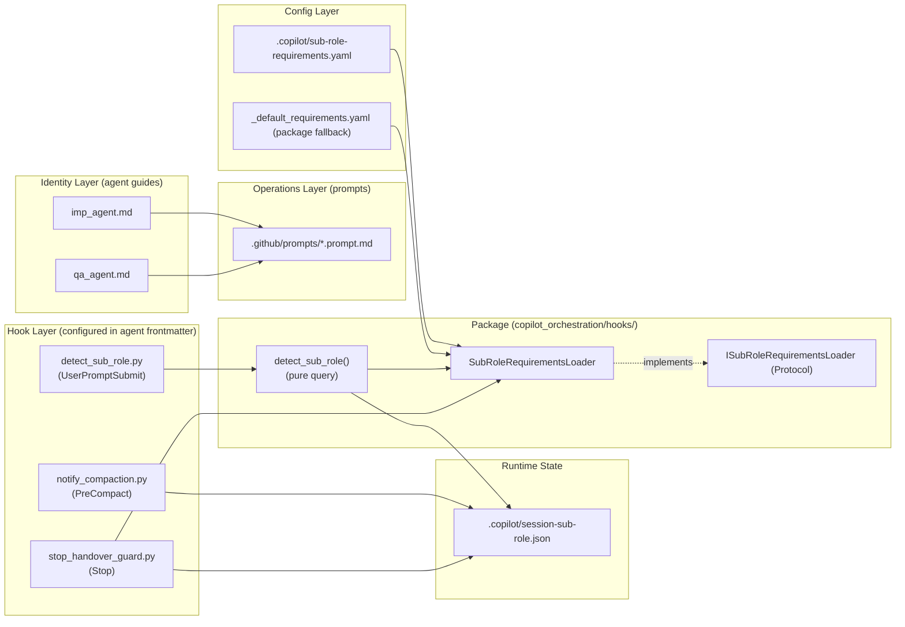
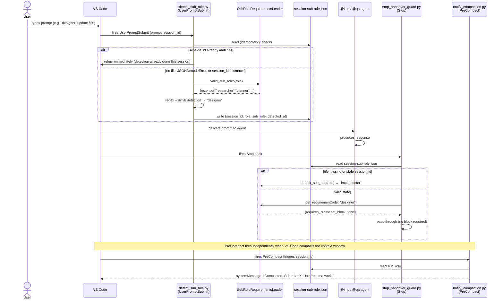
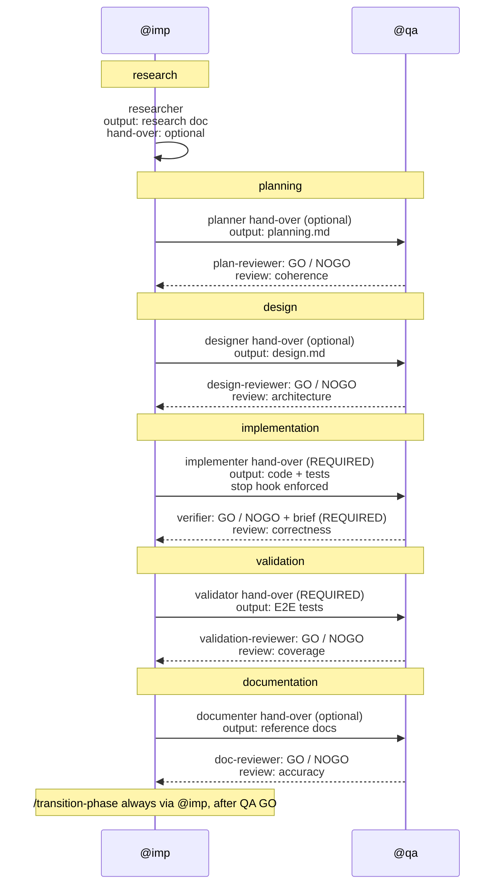

<!-- docs\development\issue263\design_v2_sub_role_orchestration.md -->
<!-- template=design version=5827e841 created=2026-03-18T14:21Z updated=2026-03-21T00:00Z -->
# Sub-Role Orchestration — Phase-Aware Agent Cooperation Without MCP Coupling

**Status:** DRAFT  
**Version:** 2.7  
**Last Updated:** 2026-03-21

---

## Purpose

Define the evolved orchestration model for VS Code agent cooperation that extends the compact design (v1.0) with phase-aware sub-roles while maintaining zero runtime coupling to the MCP workflow server.

## Scope

**In Scope:**
Sub-role definitions for imp and qa agents across all 6 workflow phases; sub-role-specific output formats; stop hook sub-role detection and enforcement; slash prompt restructuring; argument-hint updates for .agent.md wrappers; cross-chat handover block redesign with neutral language; transition ownership model

**Out of Scope:**
MCP server changes; .st3 schema changes; runtime workflow state coupling; automatic phase detection; tool gating; new agent roles beyond imp and qa

## Prerequisites

Read these first:
1. Existing compact design v1.0 (docs/development/issue263/design.md) implemented and working
2. stop_handover_guard.py with TypedDict-based RoleRequirement already in place
3. Current hook infrastructure (SessionStart, PreCompact, Stop) operational

---

## 1. Context & Requirements

### 1.1. Problem Statement

The current imp_agent.md and qa_agent.md are monolithic — they mix identity, operational instructions, and output format templates into single documents. They provide no phase-specific differentiation: the agent behaves identically during research as during implementation. The imp-to-qa handover format is overly directive, and the qa-to-imp brief uses prescriptive tasking language. The stop hook enforces a single output format regardless of the workflow phase being worked on. These issues create unnecessary friction in multi-phase workflows and violate role sovereignty.

### 1.2. Requirements

**Functional:**
- [ ] Define sub-roles per workflow phase for both @imp (researcher, planner, designer, implementer, validator, documenter) and @qa (plan-reviewer, design-reviewer, verifier, validation-reviewer, doc-reviewer)
- [ ] Sub-role selection is driven by explicit user input via argument-hint, not by MCP server state
- [ ] Each sub-role has a dedicated output format with phase-relevant sections only — no n/a fields
- [ ] Stop hook enforcement is sub-role-aware: only implementer/validator (imp) and verifier (qa) require cross-chat handover blocks
- [ ] Cross-chat handover blocks use neutral non-directive language — role doctrine lives in the role guide, not in the prompt
- [ ] Phase transitions are executed by @imp via /transition-phase after explicit user instruction and QA GO
- [ ] Default sub-role when none specified: implementer (imp) / verifier (qa) for backward compatibility

**Non-Functional:**
- [ ] Complete decoupling from MCP server state — no runtime dependency on .st3/state.json or .st3/projects.json
- [ ] Backward compatible — unrecognized or missing sub-role falls back to current strict enforcement
- [ ] Sub-role detection via `UserPromptSubmit` hook on first user prompt — result persisted to `.copilot/session-sub-role.json`
- [ ] Stop hook reads state file, never parses transcript — no file I/O beyond the state read
- [ ] Graceful degradation when .st3 is unavailable
- [ ] Each implementation step is independently testable

### 1.3. Constraints

- No runtime dependency on MCP server or .st3 state files
- Must remain backward compatible with current handover enforcement
- Sub-role detection uses `UserPromptSubmit` hook (VS Code 1.112+); result written to `.copilot/session-sub-role.json`; `Stop` hook reads the state file — no transcript parsing, no JSONL I/O
- Sub-role names come from `sub-role-requirements.yaml` via `SubRoleRequirementsLoader` — never hardcoded in hook logic
- `sub-role-requirements.yaml` missing → explicit `FileNotFoundError`; malformed → Pydantic `ValidationError`, never silent
- Stop hook must default to strictest enforcement when sub-role is undetectable

---

## 2. Design Principles

### 2.1. Strict Separation of Concerns

The design introduces three conceptually separated layers:

| Layer | Content | Location |
|---|---|---|
| **Identity** | Mission, boundaries, contracts, truthfulness, sub-role definitions | `imp_agent.md` / `qa_agent.md` (workspace root) |
| **Operations** | Output format requirements, startup steps, recovery protocol | `.github/prompts/*.prompt.md` |
| **Enforcement** | Structural validation of agent output per role × sub-role | `scripts/copilot_hooks/stop_handover_guard.py` |

Each layer references the one above it but never duplicates it.

### 2.2. No Workflow Coupling

Phase context comes from explicit user input (sub-role name), not from `.st3/state.json`, `.st3/projects.json`, or any MCP tool call. The system works identically whether the MCP server is running, stopped, or uninstalled.

### 2.3. Safe Defaults

When the sub-role is not specified or not detectable, the system defaults to the strictest enforcement: `implementer` for @imp, `verifier` for @qa. This preserves backward compatibility with all existing handover workflows.

### 2.4. Architecture Overview

#### Component Layers



#### Detection and Enforcement Flow



---

## 3. Design Options

### Option A: Universal Format With Contextual Fields

Every sub-role uses the same handover format (Scope, Files, Proof, etc.). Sections not relevant to the current sub-role contain "n/a". The stop hook enforces the same structure for all sub-roles.

**Pros:** Simple, one format to maintain, backward compatible by default.
**Cons:** Agent produces templating noise ("Proof: n/a for planning sub-role"), user must mentally filter irrelevant sections, stop hook cannot differentiate meaningful output.

### Option B: Sub-Role-Specific Formats (Chosen)

Each sub-role has a dedicated output format with only phase-relevant sections. The stop hook knows which markers to expect per sub-role. Only sub-roles that produce code changes require cross-chat handover blocks.

**Pros:** Zero noise per interaction, precise enforcement, enables progressively sharper agent behavior.
**Cons:** More initial definitions to maintain (one TypedDict entry per sub-role in the hook).

---

## 4. Chosen Design

**Decision:** Implement Option B — sub-role-specific output formats per workflow phase with `UserPromptSubmit`-based sub-role detection (VS Code 1.112+), state-file coordination between hooks, explicit user-driven sub-role selection via argument-hint, strict separation of role identity from operational prompts, and non-directive cross-chat language.

**Rationale:** Option B was chosen because: (1) it eliminates per-interaction friction; (2) the stop hook can enforce precisely the right structure per phase; (3) it enables progressively sharper agent behavior as sub-role definitions mature; (4) the extra maintenance cost is bounded and predictable. Full MCP decoupling was chosen because the MCP server is not yet stable enough to serve as an orchestration dependency. Transcript-based sub-role detection (original v2.0 approach) was replaced by the `UserPromptSubmit` hook: it receives the prompt text directly via stdin, requires no JSONL parsing, and handles the resume-after-compaction scenario correctly (research finding §10.2).

---

## 5. Sub-Role Definitions

### 5.1. @imp Sub-Roles

The active sub-role is determined by the user's invocation text. If the user does not specify a sub-role, the default is **implementer**.

| Sub-Role | Phase | Focus | Output Type | Hand-Over Required |
|---|---|---|---|---|
| `researcher` | research | Problem analysis, requirements, technical exploration | Research document | No |
| `planner` | planning | Cycle breakdown, deliverables, dependency analysis | Planning sections | No |
| `designer` | design | Interface contracts, data flows, architecture decisions | Design document | No |
| `implementer` | implementation | Code, tests, targeted verification | Code changes + hand-over | **Yes (stop hook enforced)** |
| `validator` | validation | E2E tests, acceptance tests, system integration | Validation tests + report | **Yes (stop hook enforced)** |
| `documenter` | documentation | Reference docs, guides, agent instructions | Documentation files | No |

### 5.2. @qa Sub-Roles

The active sub-role is determined by the user's invocation text. If the user does not specify a sub-role, the default is **verifier**.

| Sub-Role | Phase | Focus | Output Type | Hand-Over Required |
|---|---|---|---|---|
| `plan-reviewer` | planning | Planning coherence, testability, dependencies | Planning review + verdict | No |
| `design-reviewer` | design | Architecture compliance, SOLID, layer boundaries | Design review + verdict | No |
| `verifier` | implementation | Correctness, proof verification, architecture compliance | Verification review + hand-over | **Yes (stop hook enforced)** |
| `validation-reviewer` | validation | Test coverage, critical path assessment | Validation review + verdict | No |
| `doc-reviewer` | documentation | Accuracy, completeness, code-reference correctness | Documentation review + verdict | No |

### 5.3. Core Identity vs Sub-Role

The sub-role defines **focus and output format**, not identity. The core doctrine in each `_agent.md` remains active regardless of sub-role:
- Architecture Contract always applies
- Truthfulness Rules always apply
- Scope Lock always applies
- QA Boundary (for imp) always applies
- Role Boundaries (for qa) always apply

The sub-role narrows what the agent is expected to produce, not what standards it follows.

---

## 6. Sub-Role Output Formats

Output format definitions (sections, headings, field order) are implementation artefacts — they belong in `.github/prompts/*.prompt.md`, not here. See §10.1 for the prompt set and §13 Step 8 for when they are written.

This section specifies only what the **stop hook needs**: the required markers per sub-role and whether a cross-chat block is enforced. These values feed directly into `sub-role-requirements.yaml` (§9) and must stay in sync with the prompt files.

### 6.1. @imp Marker Specification

| Sub-Role | Required Markers | Cross-Chat Block |
|---|---|---|
| `researcher` | `Problem Statement`, `Findings`, `Open Questions` | no |
| `planner` | `Cycle Breakdown`, `Deliverables Per Cycle`, `Stop-Go Criteria` | no |
| `designer` | `Interface Contracts`, `Architecture Decisions` | no |
| `implementer` | `Scope`, `Files Changed`, `Proof`, `Ready-for-QA` + cross-chat block markers | **yes** |
| `validator` | `Test Surface`, `Results`, `Ready-for-QA` + cross-chat block markers | **yes** |
| `documenter` | `Documents Changed` | no |

### 6.2. @qa Marker Specification

| Sub-Role | Required Markers | Cross-Chat Block |
|---|---|---|
| `plan-reviewer` | `Findings`, `Plan Coherence`, `Verdict` | no |
| `design-reviewer` | `Findings`, `Architecture Compliance`, `Verdict` | no |
| `verifier` | `Findings`, `Proof Verification`, `Verdict` + cross-chat block markers | **yes** |
| `validation-reviewer` | `Findings`, `Coverage Assessment`, `Verdict` | no |
| `doc-reviewer` | `Findings`, `Verdict` | no |

> **Rule:** A sub-role's marker list here is the authoritative source for `sub-role-requirements.yaml`. The prompt file for that sub-role must use these exact heading strings. If they diverge, the stop hook will fail silently on the wrong markers.

> **Design property — rename without code impact:** Sub-role names are config-driven. `valid_sub_roles(role)`, `default_sub_role(role)`, and `get_requirement(role, sub_role)` all read from YAML. Renaming a sub-role requires only a YAML edit, a role-guide update, and matching prompt file updates — no Python code changes. This applies to both @imp and @qa sub-roles including their defaults.

---

## 7. Cross-Chat Block Language

### 7.1. imp → qa: Facts, Not Instructions

The `imp → qa` cross-chat block carries **facts** only. The receiving QA agent's role guide defines how to respond. The block must not contain imperatives like "Verify…", "Check whether…", "Confirm that…", "Required fixes:".

### 7.2. qa → imp: Work Specification

The `qa → imp` cross-chat block **is** a directive. It is a work specification. The QA agent has reviewed the implementation and found issues that must be resolved before the cycle can proceed. The block uses prescriptive language: "must", "resolve", "proof required".

### 7.3. imp → qa (implementer/validator sub-roles)

```text
@qa verifier: Review the latest implementation work on this branch.

Review target:
- Branch: [branch name]
- Files in scope:
  1. [file path]

Implementation claim:
- [what was changed and what is claimed complete]

Proof provided:
- Tests: [exact tests run]
- Checks: [exact checks run]
- Outcomes: [exact outcomes]
- Gaps: [explicit list or none]
```

### 7.4. qa → imp (verifier sub-role)

```text
@imp implementer: QA review for [branch name] produced findings that must be resolved.

Findings — must all be resolved before this cycle is done:
1. [severity: critical/major/minor] [finding with file + line reference if applicable]

Scope — only touch these:
1. [file path]

Do not touch:
- [what is explicitly out of scope]

Proof required on re-review:
- [exact test or check that must pass]
- [what evidence proves the finding is resolved]

This brief is the sole work specification. Do not expand scope.
```

---

## 8. Agent Wrapper Updates

### 8.1. argument-hint in imp.agent.md

```yaml
argument-hint: >
  Sub-role + task. Available sub-roles: researcher, planner, designer,
  implementer (default), validator, documenter.
  Example: "implementer: start cycle C_LOADER.5 for issue 257"
```

### 8.2. argument-hint in qa.agent.md

```yaml
argument-hint: >
  Sub-role + review target. Available sub-roles: plan-reviewer,
  design-reviewer, verifier (default), validation-reviewer, doc-reviewer.
  Example: "verifier: review latest implementation handover for cycle C_LOADER.5"
```

---

## 9. Stop Hook Design

### 9.1. Sub-Role Detection via UserPromptSubmit Hook

VS Code 1.112+ fires the `UserPromptSubmit` hook for every user prompt, before the agent begins its response. The hook receives `{"prompt": "..."}` via stdin. This replaces the v2.0 approach of transcript parsing in the stop hook.

**`detect_sub_role` function (package location: `copilot_orchestration/hooks/detect_sub_role.py`):**

```python
def detect_sub_role(
    prompt: str,
    loader: ISubRoleRequirementsLoader,
    role: str,
) -> str:
    """Detect sub-role from prompt text.

    Pure query — no I/O, no side effects.
    Returns the detected sub-role name (always a member of loader.valid_sub_roles(role)).
    Falls back to loader.default_sub_role(role) when no match is found.
    """
    candidates = loader.valid_sub_roles(role)

    # Step 1: exact / normalised match
    match = re.search(
        r'\b(' + '|'.join(re.escape(s) for s in candidates) + r')\b',
        prompt,
        re.IGNORECASE,
    )
    if match:
        return match.group(1).lower().replace(' ', '-')

    # Step 2: typo correction via difflib (only words ≥ 7 chars)
    words = [w for w in re.split(r'\W+', prompt) if len(w) >= 7]
    close = difflib.get_close_matches(
        ' '.join(words), list(candidates), n=1, cutoff=0.85
    )
    return close[0] if close else loader.default_sub_role(role)
```

**Script entry point (`__main__` block — handles all I/O):**

```python
if __name__ == "__main__":
    role = sys.argv[1]                          # injected by agent frontmatter hook config
    payload = json.loads(sys.stdin.read())
    prompt: str = payload.get("prompt", "")
    session_id: str = payload.get("sessionId", "")

    state_path = Path(".copilot/session-sub-role.json")
    loader = SubRoleRequirementsLoader.from_copilot_dir(Path.cwd())

    # Idempotency check — sub-role is set exactly once per session
    try:
        existing = json.loads(state_path.read_text())
        if existing.get("session_id") == session_id:
            sys.exit(0)  # already detected for this session
    except (FileNotFoundError, json.JSONDecodeError):
        pass  # no state file or malformed — proceed with detection

    sub_role = detect_sub_role(prompt, loader, role)

    state: SessionSubRoleState = {
        "session_id": session_id,
        "role": role,
        "sub_role": sub_role,
        "detected_at": datetime.utcnow().isoformat() + "Z",
    }
    state_path.write_text(json.dumps(state))
```

**Design rationale:**
- `detect_sub_role` is a **pure query**: returns a value, no side effects. Fully testable without file system mocking.
- The `__main__` block is the **command**: owns all I/O (read payload, idempotency guard, write state). Not part of the testable unit contract — it is the thin entry point.
- `state_path` is resolved in the entry point, not inside the query function (DIP: the query has no dependency on paths or file system).

**Stop hook integration:** the stop hook no longer parses any transcript. It calls `loader.get_requirement(role, sub_role)` where `sub_role` is read from `.copilot/session-sub-role.json`. If the state file is missing or stale (`session_id` mismatch), the hook defaults to the role's `default_sub_role` from the loader.

### 9.2. ISubRoleRequirementsLoader Protocol

The `ISubRoleRequirementsLoader` Protocol is the single interface through which all hook code and tests access sub-role configuration. Hooks never read `sub-role-requirements.yaml` directly.

```python
from typing import Protocol, TypedDict

class SubRoleSpec(TypedDict, total=False):
    requires_crosschat_block: bool          # required
    heading: str                            # required when requires_crosschat_block=True
    block_prefix: str
    guide_line: str
    markers: list[str]                      # required when requires_crosschat_block=True


class ISubRoleRequirementsLoader(Protocol):
    def valid_sub_roles(self, role: str) -> frozenset[str]:
        """All valid sub-role names for the given role. Used for detection candidate set."""
        ...

    def default_sub_role(self, role: str) -> str:
        """Default sub-role when none is detected from the user prompt."""
        ...

    def requires_crosschat_block(self, role: str, sub_role: str) -> bool:
        """True only for sub-roles that must produce a cross-chat handover block."""
        ...

    def get_requirement(self, role: str, sub_role: str) -> SubRoleSpec:
        """Full requirement spec for the given (role, sub_role) pair.
        
        Raises ConfigError if (role, sub_role) combination is unknown.
        Never returns None or raises KeyError.
        """
        ...
```

**Package location:** `copilot_orchestration/hooks/interfaces.py`

**Concrete implementation:** `SubRoleRequirementsLoader(requirements_path: Path)` in `copilot_orchestration/hooks/requirements_loader.py`
- Constructor accepts a `Path` — resolved from `.copilot/sub-role-requirements.yaml` or package default `_default_requirements.yaml`
- Parses YAML at construction using `PyYAML`; validates schema with a `pydantic.BaseModel` — raises `pydantic.ValidationError` on schema violations
- Raises `FileNotFoundError` if neither project config nor package default exists
- Parsed data is cached; subsequent calls read cached data

**Dependency injection in hooks:**

```python
# UserPromptSubmit hook
loader = SubRoleRequirementsLoader.from_copilot_dir(Path.cwd())
sub_role = detect_sub_role(prompt, loader, role)

# Stop hook
loader = SubRoleRequirementsLoader.from_copilot_dir(Path.cwd())
spec = loader.get_requirement(role, sub_role)
```

**Test isolation:**

```python
# Tests receive a loader constructed from a fixture YAML path
# No module-level state to patch; no inline dicts
loader = SubRoleRequirementsLoader(Path("tests/fixtures/sub_role_requirements_test.yaml"))
```

### 9.3. Enforcement Matrix Summary

| Role | Sub-Role | Output Heading | Cross-Chat Block | Default |
|---|---|---|---|---|
| imp | researcher | Research Output | no | no |
| imp | planner | Planning Output | no | no |
| imp | designer | Design Output | no | no |
| imp | **implementer** | Implementation Hand-Over | **yes** | **yes** |
| imp | validator | Validation Hand-Over | **yes** | no |
| imp | documenter | Documentation Output | no | no |
| qa | plan-reviewer | Planning Review | no | no |
| qa | design-reviewer | Design Review | no | no |
| qa | **verifier** | Verification Review | **yes** | **yes** |
| qa | validation-reviewer | Validation Review | no | no |
| qa | doc-reviewer | Documentation Review | no | no |

### 9.4. Backward Compatibility

When sub-role is not detected (default), the hook behaves identically to the current implementation: it enforces the `implementer` / `verifier` format including cross-chat blocks. No existing workflow breaks.

---

### 9.5. State File Schema: SessionSubRoleState

The `.copilot/session-sub-role.json` file is the coordination layer between `UserPromptSubmit` (writer) and `Stop` (reader). Its schema is explicitly typed:

```python
class SessionSubRoleState(TypedDict):
    session_id: str   # VS Code session identifier; used for stale detection
    role: str         # "imp" or "qa"
    sub_role: str     # detected sub-role name (must be in valid_sub_roles(role))
    detected_at: str  # ISO 8601 UTC timestamp, e.g. "2026-03-20T14:05:33Z"
```

**Stale detection logic (Stop hook):**

```python
state_path = Path(".copilot/session-sub-role.json")
try:
    state = json.loads(state_path.read_text())
except FileNotFoundError:
    # No state file — first turn or state was cleared; use role default
    sub_role = loader.default_sub_role(role)
except json.JSONDecodeError:
    # State file exists but is malformed (e.g. partial write); treat as missing
    sub_role = loader.default_sub_role(role)
else:
    if state.get("session_id") != current_session_id:
        # Stale state from a previous session — use role default
        sub_role = loader.default_sub_role(role)
    else:
        sub_role = state["sub_role"]
```

**Why `session_id` is required:** Without it, a state file from a previous session (e.g. `sub_role="researcher"`) would silently suppress cross-chat block enforcement for the new session, even if the new session is an `implementer` session. `session_id` mismatch is always an explicit skip, never a silent error.

**File location:** `.copilot/session-sub-role.json` in the workspace root. The `.copilot/` directory is already used by VS Code for hook scripts and is excluded from version control via `.gitignore`.

---

### 9.6. Role Resolution in the UserPromptSubmit Hook

**Problem:** `detect_sub_role(prompt, loader, role)` requires `role` to be resolved before detection. The VS Code docs confirm that the `UserPromptSubmit` hook payload does **not** include an agent identifier — common fields are `timestamp`, `cwd`, `sessionId`, `hookEventName`, and `transcript_path`. The `agent_type` field only appears in `SubagentStart`/`SubagentStop` payloads.

**Decision: configuration over code.** VS Code supports agent-scoped hooks via the `hooks` field in `.agent.md` frontmatter (requires `chat.useCustomAgentHooks = true`). Agent-scoped hooks run **only** when that agent is active. This means the role can be injected as a command-line argument in the hook configuration — no role-specific Python wrapper file needed.

**One shared script — two agent configurations:**

```yaml
# .github/agents/imp.agent.md frontmatter (relevant excerpt)
hooks:
  UserPromptSubmit:
    - type: command
      command: "python copilot_orchestration/hooks/detect_sub_role.py imp"
  PreCompact:
    - type: command
      command: "python copilot_orchestration/hooks/notify_compaction.py"
```

```yaml
# .github/agents/qa.agent.md frontmatter (relevant excerpt)
hooks:
  UserPromptSubmit:
    - type: command
      command: "python copilot_orchestration/hooks/detect_sub_role.py qa"
  PreCompact:
    - type: command
      command: "python copilot_orchestration/hooks/notify_compaction.py"
```

The script reads `role = sys.argv[1]` and the hook payload from stdin. The role originates from configuration (agent frontmatter), not from code logic or hardcoded wrapper files.

**Pre-condition:** `chat.useCustomAgentHooks` setting must be `true` in the user's VS Code workspace. This is a documented restriction; the design cannot control it. The workspace `.vscode/settings.json` should include this setting.

**Package location for shared logic:** `copilot_orchestration/hooks/detect_sub_role.py` — exports `detect_sub_role(prompt, loader, role) -> str` (pure query). The `__main__` block reads `sys.argv[1]` for `role` and the JSON payload from stdin for `prompt` and `session_id`, handles idempotency, and writes the state file.

**Why agent-scoped (frontmatter) over alternatives:**
- Option (a) — two wrapper Python files: hardcodes "config" decisions in code; rejected (config over code)
- Option (b) — global hook JSON file with shared command: `UserPromptSubmit` payload doesn't include `agent_type`, so a global hook cannot distinguish @imp from @qa at runtime
- Option (c) — agent-scoped frontmatter hooks: role is injected via `sys.argv[1]` from the agent's own configuration; explicit, testable, zero runtime ambiguity — **chosen**

---

### 9.7. PreCompact Hook

**Purpose:** When VS Code compacts the conversation context, the agent loses its in-context awareness of which sub-role it is active in. The PreCompact hook fires *before* the compaction takes place, allowing the system to inject a reminder into the surviving context window.

**VS Code behaviour (confirmed):**

| Property | Value |
|----------|-------|
| Hook event | `PreCompact` |
| Trigger mode | `"auto"` (VS Code-controlled) or `"manual"` |
| Payload fields | `trigger`, `sessionId`, `hookEventName`, `timestamp`, `cwd` |
| Output fields | `systemMessage` only (`additionalContext` is **not** available) |

**State file survives compaction.** The `sessionId` is unchanged across compaction, so the `__main__` entry point of `detect_sub_role.py` has already written the sub-role to disk on the first prompt. After compaction the state file is still valid and the next UPS hook read will succeed unchanged. The PreCompact hook does NOT need to rewrite state — it only reinjects context.

**Script:** `copilot_orchestration/hooks/notify_compaction.py`

```python
# copilot_orchestration/hooks/notify_compaction.py
"""
PreCompact hook — injects sub-role reminder into the surviving context window.

Reads state file for current sub_role, writes a systemMessage so the agent
remembers its active sub-role after context compaction.

Exit 0: always (soft failure — hook errors must not break the agent session).
"""
import json
import sys
from pathlib import Path

# Relative to workspace root — resolved against __file__ in __main__ block.
# Do NOT use Path(".copilot/...") directly: CWD is not guaranteed to be
# workspace root when VS Code fires this hook.
STATE_RELPATH = Path(".copilot/session-sub-role.json")


if __name__ == "__main__":
    # Resolve workspace root from this file's location:
    # copilot_orchestration/hooks/notify_compaction.py → parents[2] = workspace root
    workspace_root = Path(__file__).resolve().parents[2]
    state_path = workspace_root / STATE_RELPATH

    payload = json.loads(sys.stdin.read())
    session_id = payload.get("sessionId", "")

    if state_path.exists():
        try:
            state = json.loads(state_path.read_text())
        except json.JSONDecodeError:
            state = {}

        if state.get("session_id") == session_id:
            sub_role = state.get("sub_role", "unknown")
            print(json.dumps({
                "systemMessage": (
                    f"Context was compacted. Your active sub-role is **{sub_role}**. "
                    "Use /resume-work to restore full behavioral context before continuing."
                )
            }))
        else:
            # State file exists but belongs to a different session — nothing to inject
            print(json.dumps({}))
    else:
        # No state yet — compaction before first UPS hook; nothing to inject.
        print(json.dumps({}))
```

**Agent frontmatter configuration** (added to BOTH `.imp.agent.md` and `.qa.agent.md`; `notify_compaction.py` is appended to the existing `PreCompact` array — see §13 M.2 note):

```yaml
# .github/agents/imp.agent.md frontmatter (relevant excerpt — full format identical to §9.6)
hooks:
  UserPromptSubmit:
    - type: command
      command: "python copilot_orchestration/hooks/detect_sub_role.py imp"
  PreCompact:
    - type: command
      command: "python3 ./scripts/copilot_hooks/pre_compact_agent.py"
      windows: ".\\.venv\\Scripts\\python.exe .\\scripts\\copilot_hooks\\pre_compact_agent.py"
      timeout: 15
    - type: command
      command: "python copilot_orchestration/hooks/notify_compaction.py"
```

**Why `additionalContext` is not used:** The PreCompact hook output spec only supports `systemMessage` for the surviving window. `additionalContext` would be stripped. The `systemMessage` approach is the minimum viable signal: it tells the agent its sub-role and prompts a `/resume-work` call for full re-context.

**Relationship to `/resume-work`:** The `systemMessage` from this hook is a short trigger — it does not rebuild full doctrine. The `/resume-work` slash prompt (see §10) does the full reload: re-reads the role guide, confirms phase, confirms active issue.

---

## 10. Slash Prompt Design

### 10.1. Proposed Prompt Set

| Prompt | Agent | Purpose |
|---|---|---|
| `/start-work` | imp | Begin session with active sub-role |
| `/resume-work` | imp | Rebuild context after compaction |
| `/prepare-handover` | imp | Produce cross-chat block (required for implementer/validator, optional for others) |
| `/transition-phase` | imp | Check exit gates and execute phase transition |
| `/request-review` | qa | Start review with active sub-role |
| `/prepare-brief` | qa | Produce implementation brief for @imp chat |

### 10.2. Relationship: Prompts vs Role Guides

**Role guides** (`imp_agent.md`, `qa_agent.md`) define identity and doctrine. They contain:
- What the agent IS (role, persona, prime directives)
- What the agent may and may not do (tool restrictions, scope limits)
- Behaviors that are invariant across all sessions and sub-roles
- Sub-role definitions: what each sub-role means behaviorally

**Prompt files** (`*.prompt.md`) define task-specific entry points. They contain:
- Operational instructions for ONE invocation (what to do right now)
- Which sub-role to activate and how to activate context
- Output format expectations for this specific task
- References back to the role guide for identity and doctrine

**Key distinction:** The role guide is always loaded; it defines the agent permanently. A prompt is invoked per-task; it assumes the role guide has been read and builds on it. Prompts do NOT repeat doctrine — they reference it.

**Every prompt follows this opening structure:**

```markdown
## Role Activation
1. Read [imp_agent.md](../../imp_agent.md) (or qa_agent.md).
2. Identify the sub-role from the user's argument.
3. Follow the sub-role definition in the role guide for that sub-role.
4. If no sub-role is specified, default to implementer / verifier.
```

**Concrete example — `/start-work implementer`:**

```markdown
---
description: Begin an implementation session with the active sub-role.
applyTo: "**"
---

## Role Activation
1. Read [imp_agent.md](../../imp_agent.md).
2. Sub-role: implementer (from argument).
3. Follow the implementer definition in the role guide.

## Task
1. Read active issue and branch state.
2. Identify the current cycle and its deliverables.
3. State your scope and what is explicitly out of scope.
4. Begin implementation following TDD cycle: RED → GREEN → REFACTOR.

## Output
Produce the Implementation Hand-Over format defined in `.github/prompts/implementer.prompt.md`
when wrapping up. The stop hook will enforce the required markers.
```

The prompt contains no identity statements, no tool restrictions, no doctrine. Those live in `imp_agent.md`. The prompt's only job is: orient to the task, specify the output contract.

---

## 11. Phase Transition Ownership

> **Note:** §11 is contextual information. It documents the separation of responsibilities between @imp and @qa regarding MCP-driven phase transitions. No code, configuration, or test is produced directly from this section. The system functions correctly even if the MCP workflow server is unavailable — see §11.3.

### 11.1. Rule

@imp executes all state mutations. @qa remains read-only.

Transitions are write operations (`transition_phase`, `transition_cycle`). If QA executed them, it would breach the read-only boundary. QA functions as a gate — the transition may only happen after QA has given GO.

### 11.2. Transition Flow

```
1. @imp works in current phase (user specifies sub-role)
2. @imp produces output → optional copy-paste to QA chat
3. @qa reviews → gives GO/NOGO for the phase
4. On GO: user triggers /transition-phase in @imp chat
5. @imp checks exit gates, executes transition_phase (if MCP available)
   OR: @imp documents the transition textually (if MCP unavailable)
6. @imp activates new sub-role for the next phase
```

### 11.3. Double Decoupling

- From MCP: if the transition tool doesn't work, the transition is not blocking
- From QA: QA advises GO but does not execute

---

## 12. Flow Overview



---

## 13. Component Inventory and Architecture Prerequisites

### Prerequisites — V1 Technical Debt (must be resolved before TDD)

Delete the two v1 test files that test internals which will not exist after the v2 refactor:

```
tests/mcp_server/unit/utils/test_stop_handover_guard.py   ← delete
tests/mcp_server/unit/utils/test_pre_compact_agent.py     ← delete
```

These test `ROLE_REQUIREMENTS` and `parse_transcript_content` — neither exists in v2. Moving them forward carries the technical debt. See research §10.9.

---

### Files to Create (new)

| File | Type | Purpose |
|------|------|---------|
| `copilot_orchestration/__init__.py` | Package init | New top-level package |
| `copilot_orchestration/hooks/__init__.py` | Package init | Hook scripts package |
| `copilot_orchestration/hooks/interfaces.py` | Interface | `ISubRoleRequirementsLoader` Protocol + `SubRoleSpec`, `SessionSubRoleState` TypedDicts (§9.2, §9.5) |
| `copilot_orchestration/hooks/requirements_loader.py` | Implementation | `SubRoleRequirementsLoader` — YAML + Pydantic validation, package fallback (§9.2, §9.3) |
| `copilot_orchestration/hooks/detect_sub_role.py` | Hook script | Entry point (`__main__` block reads `sys.argv[1]` for role, owns I/O); exports `detect_sub_role()` pure query (§9.1, §9.6) |
| `copilot_orchestration/hooks/notify_compaction.py` | Hook script | PreCompact hook; injects sub-role `systemMessage` after compaction (§9.7) |
| `.copilot/sub-role-requirements.yaml` | Config | Canonical sub-role requirements per role (§9.3); `.copilot/` is the user-overridable location |
| `copilot_orchestration/hooks/_default_requirements.yaml` | Config | Package fallback; used when `.copilot/` file is absent (§9.3) |
| `tests/copilot_orchestration/__init__.py` | Test init | New test namespace |
| `tests/copilot_orchestration/unit/__init__.py` | Test init | — |
| `tests/copilot_orchestration/unit/hooks/__init__.py` | Test init | — |
| `tests/copilot_orchestration/unit/hooks/test_requirements_loader.py` | Test | Loader, Fail-Fast, fallback, DI contract |
| `tests/copilot_orchestration/unit/hooks/test_detect_sub_role.py` | Test | Detection, idempotency, stale state, default |
| `tests/copilot_orchestration/unit/hooks/test_stop_handover_guard.py` | Test | Pass-through, block enforcement, missing state |

---

### Files to Modify (existing)

| File | Change |
|------|--------|
| `copilot_orchestration/hooks/stop_handover_guard.py` | Remove `ROLE_REQUIREMENTS` dict + transcript parsing; accept `ISubRoleRequirementsLoader` via DI; read sub-role from state file (§9.4) |
| `.github/agents/imp.agent.md` | Add `UserPromptSubmit` hook entry (§9.6); append `notify_compaction.py` as a second entry in the existing `PreCompact` array (see note below) |
| `.github/agents/qa.agent.md` | Add `UserPromptSubmit` hook entry (§9.6); append `notify_compaction.py` as a second entry in the existing `PreCompact` array (see note below) |
| `imp_agent.md` | Add sub-role definitions + output format expectations per sub-role (§5.1) |
| `qa_agent.md` | Add sub-role definitions + output format expectations per sub-role (§5.2) |
| `.vscode/settings.json` | Add `"chat.useCustomAgentHooks": true` (§9.6 prerequisite) |
| `.github/prompts/*.prompt.md` | Rename + revise prompt set to 6 prompts per §10.1; add output format definitions per §6 markers |

> **Note — `notify_compaction.py` vs `pre_compact_agent.py`:**
> These two PreCompact hooks have different responsibilities and **coexist**. They do not replace each other.
> - `pre_compact_agent.py` (v1, existing): reads the conversation transcript, extracts goal/files/active-role, writes a rich session snapshot to `.copilot/sessions/{chat_id}.json` and `.copilot/session-state.json` for `SessionStart` recovery across chats. Outputs `systemMessage`: "Saved agent snapshot to ...".
> - `notify_compaction.py` (v2, new): reads the sub-role state file, injects `systemMessage`: "Compacted. Sub-role: X. Use /resume-work.".
>
> **Order in `PreCompact` array:** `pre_compact_agent.py` first (existing position preserved), `notify_compaction.py` appended second. VS Code runs both and concatenates their `systemMessage` outputs. There is no conflict — the messages are complementary.
>
> **`argument-hint` update** (in both agent files): add the available sub-role names to the hint so the user sees the list when invoking the agent. This is a text-only change with no code impact.

---

## 14. Risks and Mitigations

| Risk | Impact | Mitigation |
|---|---|---|
| User forgets to specify sub-role | Hook defaults to strictest enforcement (implementer/verifier) — may block unnecessarily | argument-hint in agent wrapper reminds user of available sub-roles |
| Sub-role keyword appears in task description but is not the intended sub-role | Wrong enforcement profile applied | `UserPromptSubmit` hook uses regex + difflib with high cutoff (0.85); mismatch is only possible if the user types a sub-role name embedded in a sentence — the strictest-default fallback is the safety net |
| Sub-role definitions in role guide drift from hook requirements | Inconsistent behavior | Hook is the enforcement authority; role guide is the behavioral authority — prompts connect them |
| Prompt proliferation | Maintenance burden | Set is deliberately minimal (6 prompts, down from current 7) |
| MCP transition tools unavailable | Phase transition cannot be recorded in .st3 | @imp documents transition textually; state can be reconstructed later |
| VS Code does not inject `session_id` into `UserPromptSubmit` payload | Stale-detection logic in §9.5 cannot function; state file from a previous session may apply wrong sub-role to a new session | **Assumption:** VS Code 1.112 injects `session_id` in the hook payload (consistent with `SessionStart` behavior). **Fallback if not available:** use `detected_at` timestamp in `SessionSubRoleState` with a freshness window (e.g. 8 hours). If `detected_at` is older than the window, treat the state file as stale and use the role default. This is less precise than session_id matching but eliminates the silent-carry-over risk in most practical workflows. The fallback strategy (session_id vs timestamp window) is applied in the hook entry point, not in the loader. If session_id is absent from the payload, the hook code selects timestamp-based freshness checking using the `detected_at` field from `SessionSubRoleState`. |

---

## Related Documentation

- [Compact Orchestration Design v1.0](docs/development/issue263/design.md)
- [Research Baseline](docs/development/issue263/research.md)
- [imp_agent.md](imp_agent.md) — implementation role guide
- [qa_agent.md](qa_agent.md) — QA role guide
- [ARCHITECTURE_PRINCIPLES.md](docs/coding_standards/ARCHITECTURE_PRINCIPLES.md)

---

## 15. Deferred Items

### OQ-1 — Slash Prompt Body Content

The prompt set revision (§10.1 / §10.7) is resolved at the title and purpose level: which 6 prompts exist, what they rename to, and what each one's role is. The **body content** of each prompt (exact instructions, recovery steps, format references) is deferred to the planning phase.

**Why deferred:** Prompt body content depends on stable sub-role definitions in `imp_agent.md` / `qa_agent.md` (Step 1), stable marker vocabulary in `sub-role-requirements.yaml` (Step 3), and a stable cross-chat block format. None of these are finalized until the TDD phase validates the full stack. Writing prompt bodies before that would create a dependency inversion.

**Impact:** Steps 1–9 of the implementation plan are unaffected. Prompt body content is the last thing written, after the enforcement machinery is tested and verified.

### Gap D — Content Validation Extension Point

Validation beyond marker presence (e.g. "is research.md present after a researcher session?") is project-specific and outside the package scope. If needed in the future, it requires a declared extension point in `ISubRoleRequirementsLoader`. Not in scope for v2.

---

## Version History

| Version | Date | Author | Changes |
|---------|------|--------|---------|
| 2.6 | 2026-03-21 | Design phase | SRP/CQS/DIP violation fixes: `detect_sub_role_and_persist` split into `detect_sub_role()` pure query + `__main__` I/O block (§9.1). State path removed from function signature; resolved from `__file__` in entry point (DIP). §9.7 `notify_compaction.py`: state path corrected `.st3/agent_state/` → `.copilot/session-sub-role.json` (SSOT fix); `session_id` staleness guard and `JSONDecodeError` guard added. §9.6 and §13 function references updated to reflect new signature. Component diagram `PERSIST` node label updated. |
| 2.5 | 2026-03-21 | Design phase | §2.4 component diagram: `PreCompact` node (`notify_compaction.py`) added; two UPS nodes unified to single `detect_sub_role.py` node; `detect_sub_role()` pure-query label. §2.4 sequence diagram: `notify_compaction.py (PreCompact)` participant added with independent flow after Stop hook. §13 renamed to "Component Inventory and Architecture Prerequisites": numbered implementation steps replaced by Files to Create / Files to Modify tables + Prerequisites block. |
| 2.4 | 2026-03-21 | Design phase | §2.4 sequence diagram: idempotency check arrow (`UPS->>SF: read`) added before loader call. §6: config-naming note added (sub-role renaming requires only YAML + prompt updates, no code change). §7: restructured into §7.1 (imp→qa: facts only), §7.2 (qa→imp: work specification), §7.3 (imp→qa template), §7.4 (qa→imp directive template with severity labels, "must" language). §9.1: `detect_and_persist` → `detect_sub_role_and_persist`. §9.6: full rewrite — agent-scoped frontmatter hooks, `sys.argv[1]` role injection, `chat.useCustomAgentHooks` prerequisite, two-entry examples. §9.7 (new): PreCompact hook design (`notify_compaction.py`). §10.2: expanded with role-guides-vs-prompts distinction + `/start-work implementer` example. §11: contextual-information disclaimer note added. §12: ASCII flow diagram replaced by Mermaid `sequenceDiagram`. |
| 2.3 | 2026-03-20 | Design phase | §2.4: Mermaid architecture diagrams added (component diagram + detection/enforcement sequence diagram). §6: marker table reduced; config schema updated from JSON to YAML + Pydantic (`SubRoleRequirementsLoader`). §9.5: `JSONDecodeError` guard added to stale-detection logic. §9.1: function renamed to `detect_and_persist` (intermediate step). §13: steps 3 (YAML config), 4 (loader + protocol), 5 (UPS hook), 8 (prompt restructuring) expanded with detail. |
| 2.2 | 2026-03-20 | Design phase | F.1: corrected §1.2 functional requirement — removed validation-reviewer from cross-chat block requirement (only implementer/validator + verifier). F.2: added §9.6 specifying role resolution via two separate entry-point files (detect_sub_role_imp.py / detect_sub_role_qa.py), consistent with _imp/_qa naming pattern. F.3: added session_id assumption row to §14 Risks with timestamp-based fallback; updated Risk #2 text to reflect UserPromptSubmit context. F.4: corrected §9.5 stale detection code to handle FileNotFoundError (missing state file) with try/except. |
| 2.1 | 2026-03-20 | Design phase | Replaced transcript-based sub-role detection (§9.1) with UserPromptSubmit hook; replaced SubRoleRequirement TypedDict (§9.2) with ISubRoleRequirementsLoader Protocol; added SessionSubRoleState schema (§9.5); corrected §1.2/§1.3 constraints; corrected §4 rationale; rewrote §13 implementation plan (9 steps + pre-step delete v1 tests); added §15 deferred items. Resolves all coding standards violations identified in research §10.8. |
| 2.0 | 2026-03-18 | QA analysis session | Initial draft based on QA/user collaborative design session |
