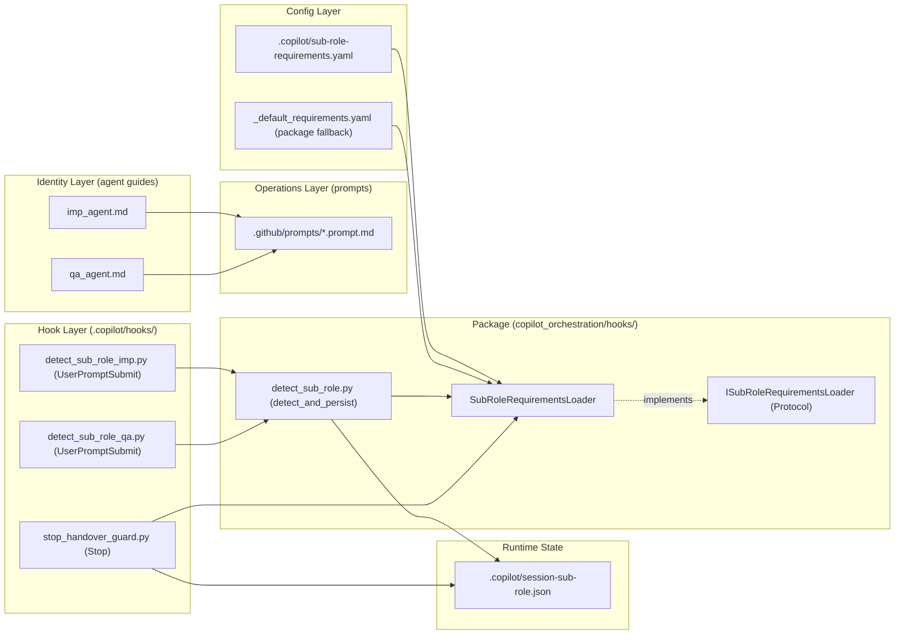
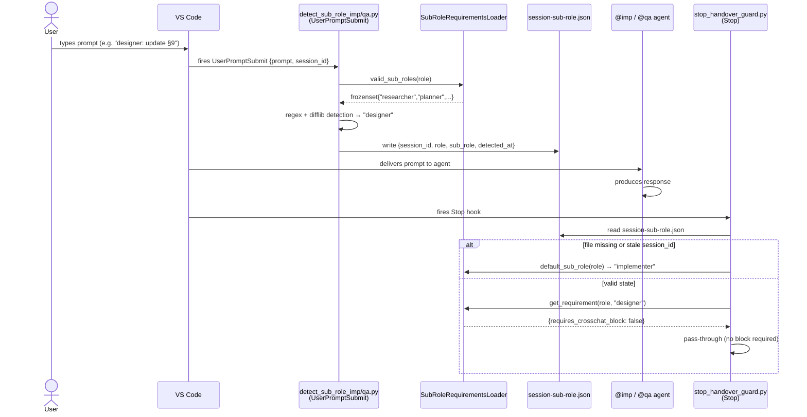

<!-- docs\development\issue263\design_v2_sub_role_orchestration.md -->
<!-- template=design version=5827e841 created=2026-03-18T14:21Z updated=2026-03-21T00:00Z -->
# Sub-Role Orchestration — Phase-Aware Agent Cooperation Without MCP Coupling

**Status:** DRAFT  
**Version:** 2.3  
**Last Updated:** 2026-03-21

---

## Purpose

Define the evolved orchestration model for VS Code agent cooperation that extends the compact design (v1.0) with phase-aware sub-roles while maintaining zero runtime coupling to the MCP workflow server.

## Scope

**In Scope:**
Sub-role definitions for imp and qa agents across all 6 workflow phases; sub-role-specific output formats; stop hook sub-role detection and enforcement; slash prompt restructuring; argument-hint updates for .agent.md wrappers; cross-chat handover block redesign with neutral language; transition ownership model

**Out of Scope:**
MCP server changes; .st3 schema changes; runtime workflow state coupling; automatic phase detection; tool gating; new agent roles beyond imp and qa

## Prerequisites

Read these first:
1. Existing compact design v1.0 (docs/development/issue263/design.md) implemented and working
2. stop_handover_guard.py with TypedDict-based RoleRequirement already in place
3. Current hook infrastructure (SessionStart, PreCompact, Stop) operational

---

## 1. Context & Requirements

### 1.1. Problem Statement

The current imp_agent.md and qa_agent.md are monolithic — they mix identity, operational instructions, and output format templates into single documents. They provide no phase-specific differentiation: the agent behaves identically during research as during implementation. The imp-to-qa handover format is overly directive, and the qa-to-imp brief uses prescriptive tasking language. The stop hook enforces a single output format regardless of the workflow phase being worked on. These issues create unnecessary friction in multi-phase workflows and violate role sovereignty.

### 1.2. Requirements

**Functional:**
- [ ] Define sub-roles per workflow phase for both @imp (researcher, planner, designer, implementer, validator, documenter) and @qa (plan-reviewer, design-reviewer, verifier, validation-reviewer, doc-reviewer)
- [ ] Sub-role selection is driven by explicit user input via argument-hint, not by MCP server state
- [ ] Each sub-role has a dedicated output format with phase-relevant sections only — no n/a fields
- [ ] Stop hook enforcement is sub-role-aware: only implementer/validator (imp) and verifier (qa) require cross-chat handover blocks
- [ ] Cross-chat handover blocks use neutral non-directive language — role doctrine lives in the role guide, not in the prompt
- [ ] Phase transitions are executed by @imp via /transition-phase after explicit user instruction and QA GO
- [ ] Default sub-role when none specified: implementer (imp) / verifier (qa) for backward compatibility

**Non-Functional:**
- [ ] Complete decoupling from MCP server state — no runtime dependency on .st3/state.json or .st3/projects.json
- [ ] Backward compatible — unrecognized or missing sub-role falls back to current strict enforcement
- [ ] Sub-role detection via `UserPromptSubmit` hook on first user prompt — result persisted to `.copilot/session-sub-role.json`
- [ ] Stop hook reads state file, never parses transcript — no file I/O beyond the state read
- [ ] Graceful degradation when .st3 is unavailable
- [ ] Each implementation step is independently testable

### 1.3. Constraints

- No runtime dependency on MCP server or .st3 state files
- Must remain backward compatible with current handover enforcement
- Sub-role detection uses `UserPromptSubmit` hook (VS Code 1.112+); result written to `.copilot/session-sub-role.json`; `Stop` hook reads the state file — no transcript parsing, no JSONL I/O
- Sub-role names come from `sub-role-requirements.yaml` via `SubRoleRequirementsLoader` — never hardcoded in hook logic
- `sub-role-requirements.yaml` missing → explicit `FileNotFoundError`; malformed → Pydantic `ValidationError`, never silent
- Stop hook must default to strictest enforcement when sub-role is undetectable

---

## 2. Design Principles

### 2.1. Strict Separation of Concerns

The design introduces three conceptually separated layers:

| Layer | Content | Location |
|---|---|---|
| **Identity** | Mission, boundaries, contracts, truthfulness, sub-role definitions | `imp_agent.md` / `qa_agent.md` (workspace root) |
| **Operations** | Output format requirements, startup steps, recovery protocol | `.github/prompts/*.prompt.md` |
| **Enforcement** | Structural validation of agent output per role × sub-role | `scripts/copilot_hooks/stop_handover_guard.py` |

Each layer references the one above it but never duplicates it.

### 2.2. No Workflow Coupling

Phase context comes from explicit user input (sub-role name), not from `.st3/state.json`, `.st3/projects.json`, or any MCP tool call. The system works identically whether the MCP server is running, stopped, or uninstalled.

### 2.3. Safe Defaults

When the sub-role is not specified or not detectable, the system defaults to the strictest enforcement: `implementer` for @imp, `verifier` for @qa. This preserves backward compatibility with all existing handover workflows.

### 2.4. Architecture Overview

#### Component Layers



#### Detection and Enforcement Flow



---

## 3. Design Options

### Option A: Universal Format With Contextual Fields

Every sub-role uses the same handover format (Scope, Files, Proof, etc.). Sections not relevant to the current sub-role contain "n/a". The stop hook enforces the same structure for all sub-roles.

**Pros:** Simple, one format to maintain, backward compatible by default.
**Cons:** Agent produces templating noise ("Proof: n/a for planning sub-role"), user must mentally filter irrelevant sections, stop hook cannot differentiate meaningful output.

### Option B: Sub-Role-Specific Formats (Chosen)

Each sub-role has a dedicated output format with only phase-relevant sections. The stop hook knows which markers to expect per sub-role. Only sub-roles that produce code changes require cross-chat handover blocks.

**Pros:** Zero noise per interaction, precise enforcement, enables progressively sharper agent behavior.
**Cons:** More initial definitions to maintain (one TypedDict entry per sub-role in the hook).

---

## 4. Chosen Design

**Decision:** Implement Option B — sub-role-specific output formats per workflow phase with `UserPromptSubmit`-based sub-role detection (VS Code 1.112+), state-file coordination between hooks, explicit user-driven sub-role selection via argument-hint, strict separation of role identity from operational prompts, and non-directive cross-chat language.

**Rationale:** Option B was chosen because: (1) it eliminates per-interaction friction; (2) the stop hook can enforce precisely the right structure per phase; (3) it enables progressively sharper agent behavior as sub-role definitions mature; (4) the extra maintenance cost is bounded and predictable. Full MCP decoupling was chosen because the MCP server is not yet stable enough to serve as an orchestration dependency. Transcript-based sub-role detection (original v2.0 approach) was replaced by the `UserPromptSubmit` hook: it receives the prompt text directly via stdin, requires no JSONL parsing, and handles the resume-after-compaction scenario correctly (research finding §10.2).

---

## 5. Sub-Role Definitions

### 5.1. @imp Sub-Roles

The active sub-role is determined by the user's invocation text. If the user does not specify a sub-role, the default is **implementer**.

| Sub-Role | Phase | Focus | Output Type | Hand-Over Required |
|---|---|---|---|---|
| `researcher` | research | Problem analysis, requirements, technical exploration | Research document | No |
| `planner` | planning | Cycle breakdown, deliverables, dependency analysis | Planning sections | No |
| `designer` | design | Interface contracts, data flows, architecture decisions | Design document | No |
| `implementer` | implementation | Code, tests, targeted verification | Code changes + hand-over | **Yes (stop hook enforced)** |
| `validator` | validation | E2E tests, acceptance tests, system integration | Validation tests + report | **Yes (stop hook enforced)** |
| `documenter` | documentation | Reference docs, guides, agent instructions | Documentation files | No |

### 5.2. @qa Sub-Roles

The active sub-role is determined by the user's invocation text. If the user does not specify a sub-role, the default is **verifier**.

| Sub-Role | Phase | Focus | Output Type | Hand-Over Required |
|---|---|---|---|---|
| `plan-reviewer` | planning | Planning coherence, testability, dependencies | Planning review + verdict | No |
| `design-reviewer` | design | Architecture compliance, SOLID, layer boundaries | Design review + verdict | No |
| `verifier` | implementation | Correctness, proof verification, architecture compliance | Verification review + hand-over | **Yes (stop hook enforced)** |
| `validation-reviewer` | validation | Test coverage, critical path assessment | Validation review + verdict | No |
| `doc-reviewer` | documentation | Accuracy, completeness, code-reference correctness | Documentation review + verdict | No |

### 5.3. Core Identity vs Sub-Role

The sub-role defines **focus and output format**, not identity. The core doctrine in each `_agent.md` remains active regardless of sub-role:
- Architecture Contract always applies
- Truthfulness Rules always apply
- Scope Lock always applies
- QA Boundary (for imp) always applies
- Role Boundaries (for qa) always apply

The sub-role narrows what the agent is expected to produce, not what standards it follows.

---

## 6. Sub-Role Output Formats

Output format definitions (sections, headings, field order) are implementation artefacts — they belong in `.github/prompts/*.prompt.md`, not here. See §10.1 for the prompt set and §13 Step 8 for when they are written.

This section specifies only what the **stop hook needs**: the required markers per sub-role and whether a cross-chat block is enforced. These values feed directly into `sub-role-requirements.yaml` (§9) and must stay in sync with the prompt files.

### 6.1. @imp Marker Specification

| Sub-Role | Required Markers | Cross-Chat Block |
|---|---|---|
| `researcher` | `Problem Statement`, `Findings`, `Open Questions` | no |
| `planner` | `Cycle Breakdown`, `Deliverables Per Cycle`, `Stop-Go Criteria` | no |
| `designer` | `Interface Contracts`, `Architecture Decisions` | no |
| `implementer` | `Scope`, `Files Changed`, `Proof`, `Ready-for-QA` + cross-chat block markers | **yes** |
| `validator` | `Test Surface`, `Results`, `Ready-for-QA` + cross-chat block markers | **yes** |
| `documenter` | `Documents Changed` | no |

### 6.2. @qa Marker Specification

| Sub-Role | Required Markers | Cross-Chat Block |
|---|---|---|
| `plan-reviewer` | `Findings`, `Plan Coherence`, `Verdict` | no |
| `design-reviewer` | `Findings`, `Architecture Compliance`, `Verdict` | no |
| `verifier` | `Findings`, `Proof Verification`, `Verdict` + cross-chat block markers | **yes** |
| `validation-reviewer` | `Findings`, `Coverage Assessment`, `Verdict` | no |
| `doc-reviewer` | `Findings`, `Verdict` | no |

> **Rule:** A sub-role's marker list here is the authoritative source for `sub-role-requirements.yaml`. The prompt file for that sub-role must use these exact heading strings. If they diverge, the stop hook will fail silently on the wrong markers.

---

## 7. Cross-Chat Block Language

### 7.1. Design Principle — Non-Directive

The cross-chat block carries **facts**, not instructions. The receiving agent's role guide already defines how to respond. The block must not contain imperatives like "Verify…", "Check whether…", "Return findings first…", "Required fixes:", or "Return requirement:".

### 7.2. imp → qa (implementer/validator sub-roles)

```text
@qa verifier: Review the latest implementation work on this branch.

Review target:
- Branch: [branch name]
- Files in scope:
  1. [file path]

Implementation claim:
- [what was changed and what is claimed complete]

Proof provided:
- Tests: [exact tests run]
- Checks: [exact checks run]
- Outcomes: [exact outcomes]
- Gaps: [explicit list or none]
```

### 7.3. qa → imp (verifier sub-role)

```text
@imp implementer: Latest QA review produced findings for this branch.

Findings to resolve:
1. [finding]

Files in scope:
1. [file path]

Out of scope:
- [what must not be touched]

Proof expected:
- [what evidence QA expects on re-review]
```

---

## 8. Agent Wrapper Updates

### 8.1. argument-hint in imp.agent.md

```yaml
argument-hint: >
  Sub-role + task. Available sub-roles: researcher, planner, designer,
  implementer (default), validator, documenter.
  Example: "implementer: start cycle C_LOADER.5 for issue 257"
```

### 8.2. argument-hint in qa.agent.md

```yaml
argument-hint: >
  Sub-role + review target. Available sub-roles: plan-reviewer,
  design-reviewer, verifier (default), validation-reviewer, doc-reviewer.
  Example: "verifier: review latest implementation handover for cycle C_LOADER.5"
```

---

## 9. Stop Hook Design

### 9.1. Sub-Role Detection via UserPromptSubmit Hook

VS Code 1.112+ fires the `UserPromptSubmit` hook for every user prompt, before the agent begins its response. The hook receives `{"prompt": "..."}` via stdin. This replaces the v2.0 approach of transcript parsing in the stop hook.

**`detect_and_persist` function (package location: `copilot_orchestration/hooks/detect_sub_role.py`):**

```python
def detect_and_persist(
    prompt: str,
    loader: ISubRoleRequirementsLoader,
    role: str,
    session_id: str,
) -> None:
    """Detect sub-role from prompt and write to session state file.

    Idempotent: skips if state file already contains a matching session_id.
    Called by detect_sub_role_imp.py and detect_sub_role_qa.py.
    """
    state_path = Path(".copilot/session-sub-role.json")

    # Idempotency check — first prompt of a new chat sets sub-role exactly once
    try:
        existing = json.loads(state_path.read_text())
        if existing.get("session_id") == session_id:
            return  # already detected for this session
    except (FileNotFoundError, json.JSONDecodeError):
        pass  # no state file or malformed — proceed with detection

    candidates = loader.valid_sub_roles(role)  # frozenset from sub-role-requirements.yaml

    # Step 1: exact / normalised match
    match = re.search(
        r'\b(' + '|'.join(re.escape(s) for s in candidates) + r')\b',
        prompt,
        re.IGNORECASE,
    )
    if match:
        detected = match.group(1).lower().replace(' ', '-')
    else:
        # Step 2: typo correction via difflib (only words ≥ 7 chars)
        words = [w for w in re.split(r'\W+', prompt) if len(w) >= 7]
        close = difflib.get_close_matches(
            ' '.join(words), list(candidates), n=1, cutoff=0.85
        )
        detected = close[0] if close else loader.default_sub_role(role)

    state: SessionSubRoleState = {
        "session_id": session_id,   # passed in hook payload (VS Code 1.112+)
        "role": role,               # "imp" or "qa", read from hook payload
        "sub_role": detected,
        "detected_at": datetime.utcnow().isoformat() + "Z",
    }
    state_path.write_text(json.dumps(state))
```

**Stop hook integration:** the stop hook no longer parses any transcript. It calls `loader.get_requirement(role, sub_role)` where `sub_role` is read from `.copilot/session-sub-role.json`. If the state file is missing or stale (`session_id` mismatch), the hook defaults to the role's `default_sub_role` from the loader.

### 9.2. ISubRoleRequirementsLoader Protocol

The `ISubRoleRequirementsLoader` Protocol is the single interface through which all hook code and tests access sub-role configuration. Hooks never read `sub-role-requirements.yaml` directly.

```python
from typing import Protocol, TypedDict

class SubRoleSpec(TypedDict, total=False):
    requires_crosschat_block: bool          # required
    heading: str                            # required when requires_crosschat_block=True
    block_prefix: str
    guide_line: str
    markers: list[str]                      # required when requires_crosschat_block=True


class ISubRoleRequirementsLoader(Protocol):
    def valid_sub_roles(self, role: str) -> frozenset[str]:
        """All valid sub-role names for the given role. Used for detection candidate set."""
        ...

    def default_sub_role(self, role: str) -> str:
        """Default sub-role when none is detected from the user prompt."""
        ...

    def requires_crosschat_block(self, role: str, sub_role: str) -> bool:
        """True only for sub-roles that must produce a cross-chat handover block."""
        ...

    def get_requirement(self, role: str, sub_role: str) -> SubRoleSpec:
        """Full requirement spec for the given (role, sub_role) pair.
        
        Raises ConfigError if (role, sub_role) combination is unknown.
        Never returns None or raises KeyError.
        """
        ...
```

**Package location:** `copilot_orchestration/hooks/interfaces.py`

**Concrete implementation:** `SubRoleRequirementsLoader(requirements_path: Path)` in `copilot_orchestration/hooks/requirements_loader.py`
- Constructor accepts a `Path` — resolved from `.copilot/sub-role-requirements.yaml` or package default `_default_requirements.yaml`
- Parses YAML at construction using `PyYAML`; validates schema with a `pydantic.BaseModel` — raises `pydantic.ValidationError` on schema violations
- Raises `FileNotFoundError` if neither project config nor package default exists
- Parsed data is cached; subsequent calls read cached data

**Dependency injection in hooks:**

```python
# UserPromptSubmit hook
loader = SubRoleRequirementsLoader.from_copilot_dir(Path.cwd())
sub_role = detect_sub_role(prompt, loader, role)

# Stop hook
loader = SubRoleRequirementsLoader.from_copilot_dir(Path.cwd())
spec = loader.get_requirement(role, sub_role)
```

**Test isolation:**

```python
# Tests receive a loader constructed from a fixture YAML path
# No module-level state to patch; no inline dicts
loader = SubRoleRequirementsLoader(Path("tests/fixtures/sub_role_requirements_test.yaml"))
```

### 9.3. Enforcement Matrix Summary

| Role | Sub-Role | Output Heading | Cross-Chat Block | Default |
|---|---|---|---|---|
| imp | researcher | Research Output | no | no |
| imp | planner | Planning Output | no | no |
| imp | designer | Design Output | no | no |
| imp | **implementer** | Implementation Hand-Over | **yes** | **yes** |
| imp | validator | Validation Hand-Over | **yes** | no |
| imp | documenter | Documentation Output | no | no |
| qa | plan-reviewer | Planning Review | no | no |
| qa | design-reviewer | Design Review | no | no |
| qa | **verifier** | Verification Review | **yes** | **yes** |
| qa | validation-reviewer | Validation Review | no | no |
| qa | doc-reviewer | Documentation Review | no | no |

### 9.4. Backward Compatibility

When sub-role is not detected (default), the hook behaves identically to the current implementation: it enforces the `implementer` / `verifier` format including cross-chat blocks. No existing workflow breaks.

---

### 9.5. State File Schema: SessionSubRoleState

The `.copilot/session-sub-role.json` file is the coordination layer between `UserPromptSubmit` (writer) and `Stop` (reader). Its schema is explicitly typed:

```python
class SessionSubRoleState(TypedDict):
    session_id: str   # VS Code session identifier; used for stale detection
    role: str         # "imp" or "qa"
    sub_role: str     # detected sub-role name (must be in valid_sub_roles(role))
    detected_at: str  # ISO 8601 UTC timestamp, e.g. "2026-03-20T14:05:33Z"
```

**Stale detection logic (Stop hook):**

```python
state_path = Path(".copilot/session-sub-role.json")
try:
    state = json.loads(state_path.read_text())
except FileNotFoundError:
    # No state file — first turn or state was cleared; use role default
    sub_role = loader.default_sub_role(role)
except json.JSONDecodeError:
    # State file exists but is malformed (e.g. partial write); treat as missing
    sub_role = loader.default_sub_role(role)
else:
    if state.get("session_id") != current_session_id:
        # Stale state from a previous session — use role default
        sub_role = loader.default_sub_role(role)
    else:
        sub_role = state["sub_role"]
```

**Why `session_id` is required:** Without it, a state file from a previous session (e.g. `sub_role="researcher"`) would silently suppress cross-chat block enforcement for the new session, even if the new session is an `implementer` session. `session_id` mismatch is always an explicit skip, never a silent error.

**File location:** `.copilot/session-sub-role.json` in the workspace root. The `.copilot/` directory is already used by VS Code for hook scripts and is excluded from version control via `.gitignore`.

---

### 9.6. Role Resolution in the UserPromptSubmit Hook

**Problem:** `detect_sub_role(prompt, loader, role)` requires `role` to be resolved before detection. The hook payload from VS Code does not include a `role` field distinguishing `@imp` from `@qa`. Resolution must happen at hook wiring time, not at runtime.

**Decision: Option (a) — two separate hook entry-point files**, consistent with the existing `_imp` / `_qa` naming pattern already established for `SessionStart` hooks.

```
.copilot/hooks/detect_sub_role_imp.py   ← UserPromptSubmit hook wired for @imp agent
.copilot/hooks/detect_sub_role_qa.py    ← UserPromptSubmit hook wired for @qa agent
```

Each file is a thin wrapper that hardcodes `role = "imp"` or `role = "qa"` and delegates to the shared `detect_sub_role(prompt, loader, role)` function from `copilot_orchestration/hooks/`:

```python
# detect_sub_role_imp.py
import sys, json
from pathlib import Path
from copilot_orchestration.hooks.requirements_loader import SubRoleRequirementsLoader
from copilot_orchestration.hooks.detect_sub_role import detect_and_persist

payload = json.loads(sys.stdin.read())
loader = SubRoleRequirementsLoader.from_copilot_dir(Path.cwd())
detect_and_persist(prompt=payload["prompt"], loader=loader, role="imp")
```

```python
# detect_sub_role_qa.py — identical except role="qa"
detect_and_persist(prompt=payload["prompt"], loader=loader, role="qa")
```

**Why option (a) over alternatives:**
- Option (b) (extract role from filename at runtime) is fragile: the hook filename is not guaranteed to be available via `__file__` in all VS Code hook execution contexts.
- Option (c) (injected via hook payload) is not documented in VS Code 1.112 hook API. Relying on undocumented payload fields is a maintenance risk.
- Option (a) is explicit, testable, and consistent with the established `session_start_imp.py` / `session_start_qa.py` pattern already in `src/copilot_orchestration/hooks/`.

**Package location for shared logic:** `copilot_orchestration/hooks/detect_sub_role.py` — exports `detect_and_persist(prompt, loader, role)` which is called by both entry-point files.

**VS Code agent wiring:** Each `.agent.md` wrapper (`imp.agent.md`, `qa.agent.md`) specifies its own `UserPromptSubmit` hook file in its hooks configuration. The hook file determines the role — not the payload.

---

## 10. Slash Prompt Design

### 10.1. Proposed Prompt Set

| Prompt | Agent | Purpose |
|---|---|---|
| `/start-work` | imp | Begin session with active sub-role |
| `/resume-work` | imp | Rebuild context after compaction |
| `/prepare-handover` | imp | Produce cross-chat block (required for implementer/validator, optional for others) |
| `/transition-phase` | imp | Check exit gates and execute phase transition |
| `/request-review` | qa | Start review with active sub-role |
| `/prepare-brief` | qa | Produce implementation brief for @imp chat |

### 10.2. How Prompts Reference Role Definitions

Every prompt contains a standard Role Activation section:

```markdown
## Role Activation
1. Read [imp_agent.md](../../imp_agent.md) (or qa_agent.md for qa prompts).
2. Identify the sub-role from the user's argument.
3. Follow the sub-role definition in the role guide.
4. If no sub-role is specified, default to implementer / verifier.
```

The prompt contains **only operational instructions** (what to do, what format). The prompt does **not** contain identity, boundaries, or doctrine — those live in the role guide.

---

## 11. Phase Transition Ownership

### 11.1. Rule

@imp executes all state mutations. @qa remains read-only.

Transitions are write operations (`transition_phase`, `transition_cycle`). If QA executed them, it would breach the read-only boundary. QA functions as a gate — the transition may only happen after QA has given GO.

### 11.2. Transition Flow

```
1. @imp works in current phase (user specifies sub-role)
2. @imp produces output → optional copy-paste to QA chat
3. @qa reviews → gives GO/NOGO for the phase
4. On GO: user triggers /transition-phase in @imp chat
5. @imp checks exit gates, executes transition_phase (if MCP available)
   OR: @imp documents the transition textually (if MCP unavailable)
6. @imp activates new sub-role for the next phase
```

### 11.3. Double Decoupling

- From MCP: if the transition tool doesn't work, the transition is not blocking
- From QA: QA advises GO but does not execute

---

## 12. Flow Overview

```
                    @imp                              @qa
                    ────                              ───
research    ┌─ researcher ──────────────────────────────────────┐
            │  output: research doc                             │
            │  hand-over: optional                              │
            └───────────────────────────────────────────────────┘

planning    ┌─ planner ───────────────┐  ┌─ plan-reviewer ─────┐
            │  output: planning.md     │→│  review: coherence   │
            │  hand-over: optional     │  │  verdict: GO/NOGO   │
            └──────────────────────────┘  └─────────────────────┘

design      ┌─ designer ──────────────┐  ┌─ design-reviewer ───┐
            │  output: design.md       │→│  review: architecture│
            │  hand-over: optional     │  │  verdict: GO/NOGO   │
            └──────────────────────────┘  └─────────────────────┘

implement.  ┌─ implementer ───────────┐  ┌─ verifier ──────────┐
            │  output: code + tests    │→│  review: correctness │
            │  hand-over: REQUIRED     │  │  verdict: GO/NOGO   │
            │  (stop hook enforced)    │  │  hand-over: REQUIRED│
            └──────────────────────────┘  └─────────────────────┘

validation  ┌─ validator ─────────────┐  ┌─ validation-reviewer┐
            │  output: E2E tests       │→│  review: coverage    │
            │  hand-over: REQUIRED     │  │  verdict: GO/NOGO   │
            └──────────────────────────┘  └─────────────────────┘

document.   ┌─ documenter ────────────┐  ┌─ doc-reviewer ──────┐
            │  output: reference docs  │→│  review: accuracy    │
            │  hand-over: optional     │  │  verdict: GO/NOGO   │
            └──────────────────────────┘  └─────────────────────┘

transitions: always @imp via /transition-phase, after QA GO
```

---

## 13. Implementation Plan

### Pre-Step — Delete Misplaced V1 Tests (technical debt resolution)

Before any TDD work begins, delete the two v1 test files that live in the wrong namespace and test v1 internals that the v2 refactor replaces entirely:

```
tests/mcp_server/unit/utils/test_stop_handover_guard.py   ← delete
tests/mcp_server/unit/utils/test_pre_compact_agent.py     ← delete
```

These must be **deleted**, not relocated. They test the v1 `ROLE_REQUIREMENTS` dict and `parse_transcript_content` — neither of which will exist after the v2 refactor. Moving them carries the technical debt forward. See research §10.9 for the full rationale.

New tests are written in the TDD phase under `tests/copilot_orchestration/unit/hooks/`.

---

### Step 1 — Sub-Role Sections in Role Guides (textual only)
Add sub-role definitions and output format expectations to `imp_agent.md` and `qa_agent.md`. No code changes.

### Step 2 — argument-hint Updates
Update `argument-hint` in both `.github/agents/imp.agent.md` and `.github/agents/qa.agent.md` to list available sub-roles. No code changes.

### Step 3 — sub-role-requirements.yaml (canonical config)
Create `.copilot/sub-role-requirements.yaml` with the structure defined in research §10.5, using the marker values from §6 as the authoritative source. Include package fallback `_default_requirements.yaml` in `copilot_orchestration/hooks/`. No hook code changes yet — config only.

### Step 4 — SubRoleRequirementsLoader + ISubRoleRequirementsLoader Protocol
Implement:
- `copilot_orchestration/hooks/interfaces.py` — `ISubRoleRequirementsLoader` Protocol + `SubRoleSpec` TypedDict
- `copilot_orchestration/hooks/requirements_loader.py` — `SubRoleRequirementsLoader` concrete class; uses `PyYAML` for parsing and a `pydantic.BaseModel` for schema validation (see §9.2)

Tests: `tests/copilot_orchestration/unit/hooks/test_requirements_loader.py`

This step is the SSOT fix. All subsequent hook code uses the loader via DI.

### Step 5 — UserPromptSubmit Hook (detect_sub_role.py + two wrappers)
Implement three files (see §9.1 and §9.6):
- `copilot_orchestration/hooks/detect_sub_role.py` — shared `detect_and_persist(prompt, loader, role, session_id)` function
- `.copilot/hooks/detect_sub_role_imp.py` — thin wrapper; hardcodes `role="imp"`, delegates to `detect_and_persist`
- `.copilot/hooks/detect_sub_role_qa.py` — thin wrapper; hardcodes `role="qa"`, delegates to `detect_and_persist`

Tests: `tests/copilot_orchestration/unit/hooks/test_detect_sub_role.py`

### Step 6 — Stop Hook Refactored (stop_handover_guard.py)
Refactor `stop_handover_guard.py`:
- Remove `ROLE_REQUIREMENTS` dict and all transcript / first-message parsing
- Accept `ISubRoleRequirementsLoader` via DI
- Read sub-role from state file (with `session_id` staleness check)
- Enforce per `loader.get_requirement(role, sub_role)`

Tests: `tests/copilot_orchestration/unit/hooks/test_stop_handover_guard.py`

### Step 7 — New Test Suite (copilot_orchestration namespace)
Ensure `tests/copilot_orchestration/unit/hooks/__init__.py` exists. Verify full test coverage for:
- `test_requirements_loader.py` — loader, Fail-Fast errors, fallback, DI contract
- `test_detect_sub_role.py` — detection, idempotency, stale state, default
- `test_stop_handover_guard.py` — pass-through, block enforcement, missing state

Test matrix targets behavior-condition cases (≈12), not sub-role names. Fixture configs (test YAML files), not inline dicts.

### Step 8 — Slash Prompt Restructuring
Create or rename prompts per §10.1. For each sub-role prompt, add the full output format definition (section headings, field descriptions, example content) using the marker table in §6 as the authoritative source for required heading strings. The prompt files are the single authoritative source for format definitions — §6 specifies the markers that the stop hook validates against them.

### Step 9 — Cleanup
Remove deprecated `ROLE_REQUIREMENTS` dict and any remaining v1 transcript-parsing code. Verify backward compatibility. Run full quality gates.

---

Each step is independently testable and backward compatible. Steps 4–6 are the core TDD target. Steps 1–3 and 7–9 are textual or structural.

---

## 14. Risks and Mitigations

| Risk | Impact | Mitigation |
|---|---|---|
| User forgets to specify sub-role | Hook defaults to strictest enforcement (implementer/verifier) — may block unnecessarily | argument-hint in agent wrapper reminds user of available sub-roles |
| Sub-role keyword appears in task description but is not the intended sub-role | Wrong enforcement profile applied | `UserPromptSubmit` hook uses regex + difflib with high cutoff (0.85); mismatch is only possible if the user types a sub-role name embedded in a sentence — the strictest-default fallback is the safety net |
| Sub-role definitions in role guide drift from hook requirements | Inconsistent behavior | Hook is the enforcement authority; role guide is the behavioral authority — prompts connect them |
| Prompt proliferation | Maintenance burden | Set is deliberately minimal (6 prompts, down from current 7) |
| MCP transition tools unavailable | Phase transition cannot be recorded in .st3 | @imp documents transition textually; state can be reconstructed later |
| VS Code does not inject `session_id` into `UserPromptSubmit` payload | Stale-detection logic in §9.5 cannot function; state file from a previous session may apply wrong sub-role to a new session | **Assumption:** VS Code 1.112 injects `session_id` in the hook payload (consistent with `SessionStart` behavior). **Fallback if not available:** use `detected_at` timestamp in `SessionSubRoleState` with a freshness window (e.g. 8 hours). If `detected_at` is older than the window, treat the state file as stale and use the role default. This is less precise than session_id matching but eliminates the silent-carry-over risk in most practical workflows. The fallback is selected at `SubRoleRequirementsLoader` construction time based on whether `session_id` is present in the payload. |

---

## Related Documentation

- [Compact Orchestration Design v1.0](docs/development/issue263/design.md)
- [Research Baseline](docs/development/issue263/research.md)
- [imp_agent.md](imp_agent.md) — implementation role guide
- [qa_agent.md](qa_agent.md) — QA role guide
- [ARCHITECTURE_PRINCIPLES.md](docs/coding_standards/ARCHITECTURE_PRINCIPLES.md)

---

## 15. Deferred Items

### OQ-1 — Slash Prompt Body Content

The prompt set revision (§10.1 / §10.7) is resolved at the title and purpose level: which 6 prompts exist, what they rename to, and what each one's role is. The **body content** of each prompt (exact instructions, recovery steps, format references) is deferred to the planning phase.

**Why deferred:** Prompt body content depends on stable sub-role definitions in `imp_agent.md` / `qa_agent.md` (Step 1), stable marker vocabulary in `sub-role-requirements.json` (Step 3), and a stable cross-chat block format. None of these are finalized until the TDD phase validates the full stack. Writing prompt bodies before that would create a dependency inversion.

**Impact:** Steps 1–9 of the implementation plan are unaffected. Prompt body content is the last thing written, after the enforcement machinery is tested and verified.

### Gap D — Content Validation Extension Point

Validation beyond marker presence (e.g. "is research.md present after a researcher session?") is project-specific and outside the package scope. If needed in the future, it requires a declared extension point in `ISubRoleRequirementsLoader`. Not in scope for v2.

---

## Version History

| Version | Date | Author | Changes |
|---------|------|--------|---------|
| 2.2 | 2026-03-20 | Design phase | F.1: corrected §1.2 functional requirement — removed validation-reviewer from cross-chat block requirement (only implementer/validator + verifier). F.2: added §9.6 specifying role resolution via two separate entry-point files (detect_sub_role_imp.py / detect_sub_role_qa.py), consistent with _imp/_qa naming pattern. F.3: added session_id assumption row to §14 Risks with timestamp-based fallback; updated Risk #2 text to reflect UserPromptSubmit context. F.4: corrected §9.5 stale detection code to handle FileNotFoundError (missing state file) with try/except. |
| 2.1 | 2026-03-20 | Design phase | Replaced transcript-based sub-role detection (§9.1) with UserPromptSubmit hook; replaced SubRoleRequirement TypedDict (§9.2) with ISubRoleRequirementsLoader Protocol; added SessionSubRoleState schema (§9.5); corrected §1.2/§1.3 constraints; corrected §4 rationale; rewrote §13 implementation plan (9 steps + pre-step delete v1 tests); added §15 deferred items. Resolves all coding standards violations identified in research §10.8. |
| 2.0 | 2026-03-18 | QA analysis session | Initial draft based on QA/user collaborative design session |
