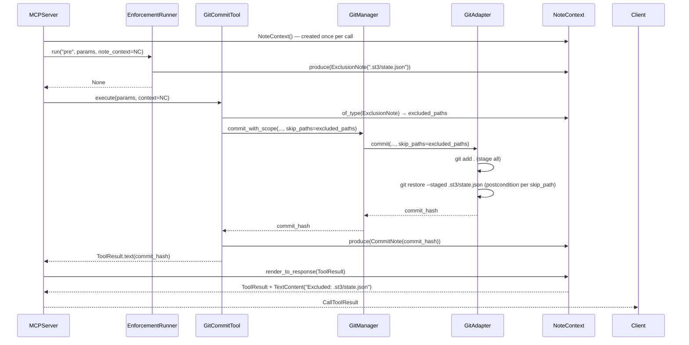
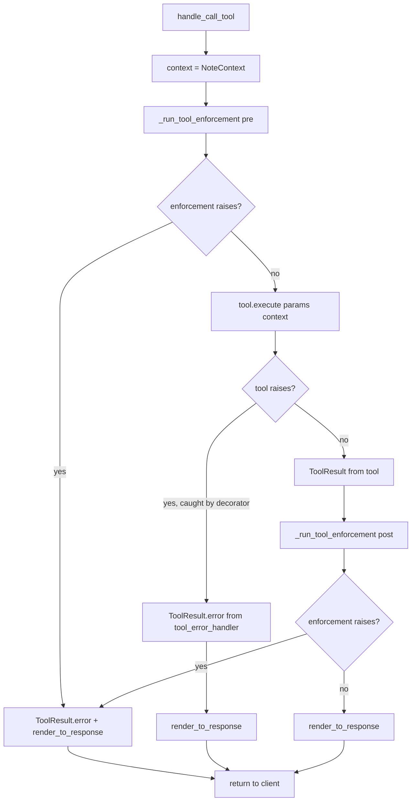

<!-- docs\development\issue283\design-git-add-commit-regression-fix.md -->
<!-- template=design version=5827e841 created=2026-04-11T18:58Z updated= -->
# git_add_or_commit regression fix — NoteContext protocol, config-boundary closure

**Status:** DRAFT  
**Version:** 9.0  
**Last Updated:** 2026-04-13

---

## Purpose

Define the complete design for the `git_add_or_commit` ready-phase regression fix. This covers five coordinated changes:

1. **Index-state preservation** — `GitCommitTool` reads `ExclusionNote` entries from the per-call `NoteContext` to determine which paths to skip when staging; the server has no knowledge of this decision.
2. **Typed notes protocol** — A symmetric bidirectional `NoteContext` replaces all `ToolResult.hints` and `MCPError.hints` usage.
3. **Exception path migration** — `tool_error_handler` decorator migrated; `SuggestionNote`, `BlockerNote`, and `RecoveryNote` replace exception hints; semantic contract between diagnostic exception messages and actionable notes formalised.
4. **Config-boundary closure** — All five raw-Path violations replaced with `WorkphasesConfig` injection.
5. **`create_pr` check correction** — `_handle_check_merge_readiness` uses the correct proxy: `git log merge_base..HEAD -- path` (commits touching path) replaces `git ls-files` (is-tracked check).

---

## Scope

**In Scope:**

| Area | What changes |
|------|-------------|
| `GitAdapter.commit()` | `skip_paths: frozenset[str]` applied as absolute postcondition after all staging, regardless of `files=` route |
| `EnforcementRunner.run()` | Return type → `None`; **declarative only** — writes `ExclusionNote` to `NoteContext`; no git operations |
| `GitAdapter` owns all git exclusion ops | `git restore --staged` for each `skip_path` executed in `GitAdapter.commit()`, after staging — produces zero delta (no deletion record) |
| `NoteEntry` union | Tagged Union with `Renderable` Protocol; adds `BlockerNote`, `RecoveryNote`; `CommitNote` intentionally not Renderable |
| `NoteContext` | New bidirectional per-call component: `produce()` / `of_type()` / `render_to_response()` |
| `BaseTool.execute()` | Gains `context: NoteContext` as required second parameter |
| `tool_error_handler` decorator | `hints` extraction removed; **context-agnostic** — does not interact with `NoteContext` |
| `MCPError.hints` | **REMOVED** (flag-day) |
| `PreflightError(blockers=)` constructor param | **REMOVED** — raise-sites write `BlockerNote` before raising |
| `ExecutionError(recovery=)` constructor param | **REMOVED** — raise-sites write `RecoveryNote` before raising |
| Raise-site migration (26 callsites) | Each callsite that used `blockers=` or `recovery=` writes a typed note to `note_context` before raising |
| `ToolResult.hints` | **REMOVED** (flag-day); `ToolResult.error(hints=...)` parameter removed |
| Exception semantic contract | Notes = actionable; exception message = diagnostic; the two reinforce, never repeat |
| `context.render_to_response()` | Called unconditionally on both success and error paths |
| WorkphasesConfig injection | 5 callsites: `ScopeDecoder` (×2), `GitManager`, `PhaseDetection`, `PhaseStateEngine` |
| Structural regression tests | Config-path guardrail + `hints=` keyword guardrail |
| `_handle_check_merge_readiness` corrected proxy | `git log merge_base..HEAD -- path` (commit-history check) replaces `_git_is_tracked` / `git ls-files` (is-tracked check); `base` extracted from tool call params — no hard-coded branch names |

**Out of Scope:**

| Area | Reason |
|------|--------|
| `workphases.yaml` / `phase_contracts.yaml` schema | Not needed for this fix |
| Commit message formatting | Separate concern |
| `OperationResult[T]` / `NotesAggregator` | Superseded by `NoteContext`; never implemented |
| `MCPSystemError.fallback` | Separate concern — `fallback: str | None` is not in `hints`; handled independently |

---

## Prerequisites

Read before starting implementation:

1. `docs/development/issue283/research-git-add-or-commit-regression.md` v1.5 — QA-approved research baseline
2. `docs/development/issue257/planning.md` — `ConfigLoader` / `WorkphasesConfig` injection design
3. `mcp_server/tools/tool_result.py` — current `ToolResult` contract (`hints` field will be **removed**)
4. `mcp_server/core/exceptions.py` — current `MCPError` hierarchy (`hints` field will be **removed**; `blockers=` and `recovery=` params removed from subclasses)
5. `mcp_server/core/error_handling.py` — `tool_error_handler` decorator that intercepts all tool exceptions before the server sees them
6. `mcp_server/tools/base.py` — `BaseTool.__init_subclass__` wrapping mechanism
7. `mcp_server/managers/enforcement_runner.py` — current `list[str]` return path
8. `mcp_server/adapters/git_adapter.py` — current `git add .` re-staging defect

---

## 1. Context & Requirements

### 1.1 Problem Statement

The ready-phase `git_add_or_commit` path contains five compounding defects:

**Defect A — Index re-staging:** `GitAdapter.commit(files=None)` calls `git add .`, which re-stages branch-local artifacts (`.st3/state.json`, `.st3/deliverables.json`) that `EnforcementRunner` just removed from the index via `git rm --cached`. The commit therefore contaminates `main` with files that were deliberately excluded.

**Defect B — Silenced success notes:** `EnforcementRunner.run()` returns `list[str]` describing which files were excluded. `_run_tool_enforcement()` discards this return value on the success path. The user receives no confirmation that enforcement ran.

**Defect C — Config-boundary violations:** Five production callsites reconstruct `.st3/config/workphases.yaml` as a raw `Path` object instead of consuming an already-loaded `WorkphasesConfig`. This violates the Config-First boundary from issue #257 and means five classes independently open the same file.

**Defect D — Parallel untyped hint channels:** `ToolResult.hints` and `MCPError.hints` are independent `list[str]` fields with no shared contract. `ToolResult.hints` is dead on the success path: `_augment_text_with_error_metadata` only renders it when `is_error=True`. Both channels are replaced by `NoteContext`.

**Defect E — Wrong proxy in `create_pr` check:** `_handle_check_merge_readiness` uses `_git_is_tracked` → `git ls-files --error-unmatch` to test whether an artifact path would contaminate the merge target. This proxy tests the local HEAD tree, not the commit history. A path can be tracked locally and yet never appear in any commit, because the `git restore --staged` postcondition (§3.8) removes it from staging before every commit. The proxy therefore blocks `create_pr` despite zero contamination risk. The correct proxy is `git log merge_base..HEAD -- path` — presence of commits carrying a delta for the path.

### 1.2 Requirements

**Functional:**

- [ ] Branch-local artifacts must not appear in any ready-phase commit after enforcement has run.
- [ ] The user must receive an explicit, non-silent confirmation listing every artifact the tool excluded from the commit index.
- [ ] Notes must be machine-readable per entry so tests can assert on specific file paths and note types without parsing strings.
- [ ] Every component that produces notes does so without knowing who consumes them (`context.produce()`).
- [ ] Every component that consumes notes queries typed entries without knowing who produced them (`context.of_type(T)`).
- [ ] The server must not contain decision logic about what note content means for tool behaviour — that is the consumer's sole responsibility.
- [ ] Exception messages and notes must be semantically distinct and complementary: exception = diagnostic; note = actionable. They reinforce each other; they never repeat each other.
- [ ] All five config-root hardcoding violations must be eliminated; no production callsite may reconstruct `.st3/config/...` after the composition root.
- [ ] A structural regression test must prevent future re-introduction of `.st3/config/` path literals in production code.
- [ ] `MCPError.hints` and `ToolResult.hints` must be removed; all user-visible supplementary output routes through `NoteContext`.
- [ ] The `create_pr` pre-flight check must use `git log merge_base..HEAD -- path` as its proxy for "commits touching this path on this branch" — not `git ls-files` (is-tracked).

**Non-Functional:**

- [ ] Flag-day breaking refactor: no backward-compatibility shims, no deprecated overloads, no transitional interfaces.
- [ ] SRP: the server must not inspect or format note content; rendering is `NoteContext`'s sole responsibility.
- [ ] SRP: `tool_error_handler` decorator is exception-to-`ToolResult` translation only; it must not interact with `NoteContext`.
- [ ] OCP: the `NoteEntry` union is extensible by adding a new variant without modifying existing producers, consumers, or `NoteContext`.
- [ ] Principle 14 (§14 ARCHITECTURE_PRINCIPLES): integration tests assert on server-dispatch observable response. Unit tests may additionally use `context.of_type(T)` as a supplementary assertion at the unit boundary of individual components.
- [ ] DI / Config-First: `WorkphasesConfig` injected at composition root; no downstream class opens any YAML file independently.

### 1.3 Constraints

| Constraint | Detail |
|------------|--------|
| Flag-day | No backward compatibility. All callsites updated in one implementation cycle. |
| `ToolResult` schema | Must not gain new fields. Note delivery routes through `render_to_response()`, not a new field. |
| `ToolResult.hints` | **REMOVED** — flag-day. All callers migrated. |
| `MCPError.hints` | **REMOVED** — flag-day. Notes route via typed note written to `NoteContext` before raising. |
| `PreflightError(blockers=)` | **REMOVED** — raise-sites write `BlockerNote` to context before raising. |
| `ExecutionError(recovery=)` | **REMOVED** — raise-sites write `RecoveryNote` to context before raising. |
| `tool_error_handler` stays context-agnostic | Decorator must not access or inspect `NoteContext`; it translates exceptions to `ToolResult` only. |
| `EnforcementRunner` is declarative | No git operations in enforcement; only `context.produce(ExclusionNote(...))`. |
| `GitAdapter` owns all git exclusion ops | `skip_paths` postcondition in `commit()` is the single site for `git restore --staged`. |
| Exception path ownership | `tool_error_handler` intercepts tool exceptions before the server sees them. The server only catches enforcement exceptions directly. Both paths end with `context.render_to_response()`. |
| `NoteContext` lifetime | Per-call only. Constructed as a local variable in `handle_call_tool`. Never stored as server instance state. |
| `NoteProducer` / `NoteConsumer` | Structural protocols only — no abstract base class, no inheritance. |
| `NoteEntry` union | Single extensibility point — new variants via union expansion only. No registry, no plugin mechanism. |
| `Renderable` Protocol | `@runtime_checkable` — only variants implementing `to_message()` appear in user output. |
| Pyright exhaustiveness | `match` statements over `NoteEntry` must be exhaustive; pyright rejects unhandled variants. |
| Principle 14 | Integration tests: public server dispatch + observable response as primary contract boundary. Unit level: `context.of_type(T)` as supplementary assertion only. |

---

## 2. Design Options

### 2.A — Staging semantics: how to preserve the post-enforcement index

| Option | Description | Verdict |
|--------|-------------|---------|
| **A1** — Adapter detects pre-staged state | `GitAdapter.commit` checks `repo.index.diff("HEAD")` to decide whether to skip `git add .` | **Rejected** — fragile heuristic; git index state is not a reliable signal across all working tree conditions |
| **A2** — Explicit files list from enforcement | Enforcement passes the list of staged files explicitly; adapter stages only those | **Rejected** — tight coupling between enforcement and commit path; enforcement must not know what else the user has staged |
| **A3** — `preserve_index: bool` flag | Server sets flag based on whether enforcement ran | **Rejected** — server contains decision logic; violates SRP and §8 (Explicit over Implicit) |
| **A4** — Tool reads `ExclusionNote` from context; `skip_paths` as postcondition | `GitCommitTool` queries `context.of_type(ExclusionNote)` to build `skip_paths`; `GitAdapter.commit()` applies `git restore --staged` for each skip_path as absolute postcondition after all staging (both `files=` and `add .` routes); enforcement writes only notes — no git ops | **Chosen** — “Explicit over Implicit” (§8) at the correct level; enforcement is declarative; `GitAdapter` is the single owner of git exclusion operations |

### 2.B — Notes contract

| Option | Description | Verdict |
|--------|-------------|---------|
| **B1** — `list[str]` (current) | Untyped string notes | **Rejected** — unvalidatable in tests; implicit coupling via string content |
| **B2** — `NoteEntry(kind, message, target)` | Single class with a generic `target` field | **Rejected** — `target` carries different semantics per `kind`; untyped catch-all reintroduces implicitness |
| **B3** — Tagged Union with `Renderable` Protocol | Each variant is a frozen dataclass with semantically named fields; variants intended for user output implement `Renderable.to_message()` | **Chosen** — fully typed; machine-inspectable per entry; `Renderable` is the clean separation between user-visible and machine-only coordination notes |

### 2.C — Notes delivery to user

| Option | Description | Verdict |
|--------|-------------|---------|
| **C1** — New `ToolResult` field | Add `notes: list[NoteEntry]` to `ToolResult` | **Rejected** — flag-day constraint: no new fields on `ToolResult` |
| **C2** — `ToolResult.hints` | Format notes into the existing `hints: list[str]` field | **Rejected** — `hints` only renders when `is_error=True` (confirmed in `_augment_text_with_error_metadata`); dead on success path; semantically wrong for enforcement success output |
| **C3** — `NoteContext.render_to_response()` | Context appends all `Renderable` notes as an additional `TextContent` block in `ToolResult.content`; called unconditionally on success and error paths | **Chosen** — server-agnostic; renders on both paths; insertion order preserved; no schema change |

### 2.D — Bidirectional vs. write-only aggregation

| Option | Description | Verdict |
|--------|-------------|---------|
| **D1** — Server formats inline | Server inspects enforcement and tool results to build user output | **Rejected** — SRP violation (§1.1); server gains content responsibility |
| **D2** — `NotesAggregator` (write-only) | Collects notes, formats to `hints` | **Rejected** — asymmetric: no consumer query API; delivery routes via the dead `hints` channel (see C2) |
| **D3** — `NoteContext` bidirectional | Per-call context; `produce()` for writers; `of_type(T)` for readers; `render_to_response()` for the server | **Chosen** — symmetric producer/consumer; per-call lifetime prevents cross-call leakage; server interaction is purely mechanical |

### 2.E — Config-boundary: eliminating raw Path in 5 callsites

| Option | Description | Verdict |
|--------|-------------|---------|
| **E1** — Contextvar / global resolution | Classes self-resolve config via contextvar | **Rejected** — hidden dependency (§8 Explicit over Implicit); worse than the current raw-Path pattern |
| **E2** — Keep `workphases_path: Path`, change default | Use passed root instead of CWD | **Rejected** — still a raw Path; partial fix; does not eliminate the file-open-in-constructor pattern |
| **E3** — Replace with `workphases_config: WorkphasesConfig` | All five classes receive the already-loaded typed config; none open any file | **Chosen** — eliminates all five violations in one interface change; composition root already holds the loaded object |

### 2.F — Exception hints migration

| Option | Description | Verdict |
|--------|-------------|---------|
| **F1** — Retain `MCPError.hints` alongside `NoteContext` | Keep `hints: list[str]`; add `NoteContext` in parallel | **Rejected** — two parallel channels (typed + untyped); contradicts the flag-day constraint; DRY violation (§2) |
| **F2** — Contextvar for deep-stack context access | Access `NoteContext` implicitly without threading | **Rejected** — hidden dependency (§8); same structural problem as E1 |
| **F3** — Thread context to callsites; remove `MCPError.hints`; migrate raise-sites | All modified components receive `NoteContext`; write typed note before raising; decorator removes `hints` extraction | **Chosen** — flag-day clean break; decorator migration is an explicit, bounded deliverable; both exception and non-exception paths end with `context.render_to_response()` |

### 2.G — Who translates `blockers=`/`recovery=` to typed notes

This sub-decision concerns where `PreflightError(blockers=...)` and `ExecutionError(recovery=...)` content becomes a `BlockerNote`/`RecoveryNote`.

| Option | Description | Verdict |
|--------|-------------|---------|
| **G1** — Decorator extracts from exception fields | `tool_error_handler` accesses `args[2]` (context), inspects exception type, writes note | **Rejected** — SRP violation: decorator gains a second responsibility (note production) alongside exception-to-`ToolResult` translation; `args[2]` is fragile positional coupling; decorator gains an import dependency on `operation_notes.py`; at decoration-time, rich local context (phase names, paths) is already gone from scope; creates asymmetry with `SuggestionNote` which uses the raise-site pattern |
| **G2** — Raise-site writes note before raising | Component calls `note_context.produce(BlockerNote(...))` then `raise PreflightError(...)` — same pattern as `SuggestionNote` | **Chosen** — SRP intact: decorator is context-agnostic; all note production is at the site with full domain context; uniform raise-site pattern across all note types; `blockers=` and `recovery=` constructor params become obsolete and are removed |

---

## 3. Chosen Design

**Summary:** Replace the `preserve_index` flag, `ToolResult.hints`, and `MCPError.hints` with a symmetric `NoteContext` protocol. A per-call context flows through enforcement → tool; producers write typed notes via `context.produce()`; consumers query via `context.of_type(T)`; the server calls `context.render_to_response(result)` mechanically with no content awareness. `BaseTool.execute()` gains `context: NoteContext` as a required second parameter. `GitCommitTool` reads `ExclusionNote` from context to determine `skip_paths`; `GitAdapter` applies `skip_paths` as an absolute postcondition after all staging — the server is unaware this decision exists. `EnforcementRunner` is declarative: it writes `ExclusionNote` entries to context and performs no git operations. `tool_error_handler` removes `hints` extraction and remains context-agnostic. All raise-sites write typed notes (`SuggestionNote`, `BlockerNote`, `RecoveryNote`) before raising. Config-boundary closure proceeds for all five callsites in the same cycle.

### 3.1 Key Design Decisions

| Decision | Rationale |
|----------|-----------|
| `NoteContext` bidirectional per-call | Symmetric: same object serves producers and consumers; per-call lifetime prevents cross-call data leakage |
| `BaseTool.execute(params, context: NoteContext)` | Uniform contract: all tools receive context; consumers cherry-pick what they need; producers write what they emit |
| `GitCommitTool` reads `ExclusionNote` → `skip_paths` | Tool owns its staging behaviour; the decision is explicit at the site that acts on it (§8 Explicit over Implicit); server has no domain reason to know |
| `EnforcementRunner` declarative — no git ops | SRP: enforcement identifies what to exclude and communicates via notes; `GitAdapter` owns all git exclusion operations |
| `GitAdapter.commit()` postcondition | `git restore --staged` for each `skip_path` applied after all staging, regardless of `files=` or `add .` route — single ownership, no path-branching; produces **zero delta** in the commit (no add/modify/delete record); parent branch state fully intact regardless of parent type (main or epic) |
| `CommitNote` is NOT `Renderable` | Commit hash lives in `ToolResult.text(sha)` — the primary user-visible output. `CommitNote` exists for type-safe test assertions only; no duplication in the response |
| `Renderable` Protocol on selected variants | Separates user-visible notes from machine-only coordination notes; `render_to_response()` renders only `Renderable` entries |
| `SuggestionNote`, `BlockerNote`, `RecoveryNote` replace `MCPError.hints` | Typed notes; semantically distinct; uniform raise-site pattern: write note, then raise |
| Raise-site writes note — decorator stays context-agnostic | SRP: decorator translates exceptions to `ToolResult`; note production belongs at the site with full domain context (§8); symmetric with `SuggestionNote` pattern already in design |
| `tool_error_handler` migrated as explicit deliverable | Removes `hints` extraction from all exception branches; decorator responsibility remains exception-to-`ToolResult` translation only |
| `context.render_to_response(result)` called unconditionally | Both success and error paths render notes; notes and exclusion confirmations visible on all paths |
| `ToolResult.hints` REMOVED | Dead on success path (confirmed in `_augment_text_with_error_metadata`); delivery exclusively via `NoteContext` |
| `MCPError.hints` REMOVED | Flag-day clean break; all note-producing callsites migrate to typed notes at raise-site |
| `WorkphasesConfig` replaces `workphases_path: Path` in 5 callsites | Single interface change eliminates all five violations; composition root already holds the loaded object |
| `_handle_check_merge_readiness` proxy corrected | `git log merge_base..HEAD -- path` (commit-history check) replaces `git ls-files` (is-tracked check); postcondition (§3.8) ensures the check normally always passes; check provides defense-in-depth against tool bypass |

### 3.2 Component Overview — Happy Path



The server never inspects `ExclusionNote`, never sees `skip_paths`, and has no knowledge that enforcement output influences commit behaviour. It creates the context, passes it uniformly, and renders once. `EnforcementRunner` writes only notes — all git operations live in `GitAdapter`.

### 3.3 NoteEntry Type Definitions

```python
# mcp_server/core/operation_notes.py
from __future__ import annotations

from dataclasses import dataclass, field
from typing import Literal, Protocol, Sequence, TypeVar, runtime_checkable

T = TypeVar("T")


@runtime_checkable
class Renderable(Protocol):
    """Note variants that produce user-visible output implement this protocol.

    Variants without to_message() are machine-readable coordination notes only
    and do not appear in the rendered user-facing response.
    """

    def to_message(self) -> str: ...


@dataclass(frozen=True)
class ExclusionNote:
    """Written by EnforcementRunner when a file is confirmed tracked and identified for exclusion from the commit index."""

    kind: Literal["exclusion"] = field(default="exclusion", init=False)
    file_path: str  # workspace-relative path

    def to_message(self) -> str:
        return f"Excluded from commit index: {self.file_path}"


@dataclass(frozen=True)
class CommitNote:
    """Written by GitCommitTool after a successful commit.

    NOT Renderable: the commit hash is already in ToolResult.text(sha).
    Exists solely for type-safe test assertions via context.of_type(CommitNote).
    Implementing to_message() would duplicate the primary output — a DRY violation.
    """

    kind: Literal["commit"] = field(default="commit", init=False)
    commit_hash: str
    # Intentionally does not implement to_message()


@dataclass(frozen=True)
class SuggestionNote:
    """Written immediately before raising an exception where the action is advisory.

    Semantic contract:
      - message is ACTIONABLE — tells the user what to do next.
      - The exception message is DIAGNOSTIC — describes what failed.
      - The two must not overlap. Together they are more informative than either alone.

    Example:
      Exception:      ConfigError("Phase 'foo' not found in workphases config")
      SuggestionNote: "Verify phase names in workphases.yaml"
    """

    kind: Literal["suggestion"] = field(default="suggestion", init=False)
    message: str
    subject: str | None = None  # optional named context (e.g., config file path)

    def to_message(self) -> str:
        base = f"Suggestion: {self.message}"
        return f"{base} ({self.subject})" if self.subject else base


@dataclass(frozen=True)
class BlockerNote:
    """Written immediately before raising PreflightError.

    Replaces the former PreflightError(blockers=[...]) constructor parameter.
    Each blocking condition becomes a separate BlockerNote for machine-readability.

    Semantic contract:
      - message describes a condition that BLOCKS further execution.
      - The exception message is DIAGNOSTIC — describes that preflight failed.
      - Together: exception says "preflight failed"; BlockerNote says "because X".

    Example:
      Exception:   PreflightError("Preflight checks failed")
      BlockerNote: "Branch 'feature/42' is not in a clean state — commit or stash changes"
    """

    kind: Literal["blocker"] = field(default="blocker", init=False)
    message: str

    def to_message(self) -> str:
        return f"Blocker: {self.message}"


@dataclass(frozen=True)
class RecoveryNote:
    """Written immediately before raising ExecutionError.

    Replaces the former ExecutionError(recovery=[...]) constructor parameter.
    Each recovery action becomes a separate RecoveryNote for machine-readability.

    Semantic contract:
      - message describes a RECOVERY ACTION the user can take.
      - The exception message is DIAGNOSTIC — describes what execution failed.
      - Together: exception says "execution failed"; RecoveryNote says "try X".

    Example:
      Exception:    ExecutionError("Git commit failed")
      RecoveryNote: "Run 'git status' to check for unresolved merge conflicts"
    """

    kind: Literal["recovery"] = field(default="recovery", init=False)
    message: str

    def to_message(self) -> str:
        return f"Recovery: {self.message}"


@dataclass(frozen=True)
class InfoNote:
    """General informational note produced by any component."""

    kind: Literal["info"] = field(default="info", init=False)
    message: str

    def to_message(self) -> str:
        return self.message


NoteEntry = ExclusionNote | CommitNote | SuggestionNote | BlockerNote | RecoveryNote | InfoNote
```

**Variant responsibilities:**

| Variant | Renderable | Produced by | Consumed by | Replaces |
|---------|-----------|-------------|-------------|---------|
| `ExclusionNote` | Yes | `EnforcementRunner` | `GitCommitTool` (skip_paths) + user output | — |
| `CommitNote` | **No** | `GitCommitTool` | Tests only (`context.of_type(CommitNote)`) | — |
| `SuggestionNote` | Yes | Any component before raising (advisory) | User output | `MCPError.hints` (advisory) |
| `BlockerNote` | Yes | Raise-sites of `PreflightError` | User output | `PreflightError(blockers=...)` |
| `RecoveryNote` | Yes | Raise-sites of `ExecutionError` | User output | `ExecutionError(recovery=...)` |
| `InfoNote` | Yes | Any component | User output | — |

### 3.4 NoteContext

```python
# mcp_server/core/operation_notes.py (continued)
from mcp_server.tools.tool_result import ToolResult  # same import direction as core/error_handling.py


@dataclass
class NoteContext:
    """Bidirectional per-call notes bus.

    Lifetime: exactly one tool invocation. Constructed as a local variable
    in handle_call_tool. Never stored as server instance state.

    Producers call produce(). Consumers call of_type(). The server calls
    render_to_response() once, unconditionally, after execution completes.
    """

    _entries: list[NoteEntry] = field(default_factory=list)

    def produce(self, note: NoteEntry) -> None:
        """Write a note. Preserves insertion order."""
        self._entries.append(note)

    def of_type(self, t: type[T]) -> Sequence[T]:
        """Return all notes of the given type, in insertion order.

        Type-safe: pyright infers the return element type from the argument.
        Example: context.of_type(ExclusionNote) -> Sequence[ExclusionNote]
        """
        return [n for n in self._entries if isinstance(n, t)]

    def render_to_response(self, base: ToolResult) -> ToolResult:
        """Append all Renderable notes as an additional TextContent block.

        Called once by the server after tool execution, on both success and
        error paths. Returns base unchanged when no Renderable entries exist.
        Insertion order is preserved.
        """
        renderable = [n for n in self._entries if isinstance(n, Renderable)]
        if not renderable:
            return base
        notes_text = "\n".join(n.to_message() for n in renderable)
        augmented = list(base.content) + [{"type": "text", "text": notes_text}]
        return base.model_copy(update={"content": augmented})
```

**NoteContext invariants:**

| Invariant | Detail |
|-----------|--------|
| Per-call lifetime | Local variable in `handle_call_tool`; never assigned to `self` |
| Insertion order | `of_type()` and `render_to_response()` both preserve production order |
| Unconditional render | `render_to_response()` is called on both success and error results; returns base unchanged if empty |
| Server does not inspect entries | Server calls only `render_to_response()`; never calls `of_type()` or reads `_entries` |

### 3.5 BaseTool Contract Change

```python
# CURRENT
class BaseTool(ABC):
    @abstractmethod
    async def execute(self, params: Any) -> ToolResult: ...

# DESIGNED
class BaseTool(ABC):
    @abstractmethod
    async def execute(self, params: Any, context: NoteContext) -> ToolResult: ...
```

All tool implementations receive `context` as a required second parameter. Tools that neither produce nor consume notes accept and ignore it. No `BaseProducerTool` / `BaseConsumerTool` split is needed — `NoteContext` provides symmetric access uniformly.

The `tool_error_handler` wrapper uses `*args, **kwargs` and passes through transparently; no change to the dispatch mechanism is needed. The only change to the decorator is removing `hints` extraction (see 3.11).

### 3.6 Producer Boundary — EnforcementRunner

```python
# CURRENT
def run(self, event: str, timing: str, context: EnforcementContext) -> list[str]: ...

# DESIGNED — 'context' renamed to 'enforcement_ctx' to avoid collision
def run(
    self,
    event: str,
    timing: str,
    enforcement_ctx: EnforcementContext,
    note_context: NoteContext,
) -> None:
    ...
```

Inside `_handle_exclude_branch_local_artifacts`, each excluded file writes an `ExclusionNote` — **no git operations**:

```python
for file_path in branch_local_files:
    if not self._is_tracked(file_path):  # only confirmed-tracked paths produce ExclusionNote
        continue
    # No git operations here — GitAdapter owns all exclusion ops via skip_paths postcondition
    note_context.produce(ExclusionNote(file_path=file_path))
# Returns None — notes conveyed via context, not return value
```

When an exception must be raised, note written first — `SuggestionNote` for advisory, `BlockerNote` for blocking conditions:

```python
note_context.produce(SuggestionNote(
    message="Verify phase names in workphases configuration",
    subject=str(self._workphases_config.source_path),
))
raise ConfigError("Phase 'foo' not found")
# MCPError carries no hints= — field removed
```

**`_run_tool_enforcement()` — current vs. designed:**

```python
# CURRENT
def _run_tool_enforcement(...) -> ToolResult | None:
    self.enforcement_runner.run(...)  # return value discarded
    return None

# DESIGNED
def _run_tool_enforcement(
    ...,
    note_context: NoteContext,
) -> ToolResult | None:
    try:
        self.enforcement_runner.run(..., note_context=note_context)
        return None
    except MCPError as exc:
        # Any note already in context (written before raise)
        base = ToolResult.error(message=exc.message, error_code=exc.code)
        return note_context.render_to_response(base)
```

### 3.7 Consumer Boundary — GitCommitTool Reads ExclusionNote

No `preserve_index` flag exists anywhere in the call chain. `GitCommitTool` is the sole decision-maker about which paths to skip — this decision is explicit and visible at the site that acts on it.

```python
# DESIGNED
async def execute(self, params: GitCommitInput, context: NoteContext) -> ToolResult:
    excluded_paths = frozenset(
        n.file_path for n in context.of_type(ExclusionNote)
    )
    commit_hash = self.git_manager.commit_with_scope(
        workflow_phase=params.workflow_phase,
        message=params.message,
        skip_paths=excluded_paths,
        ...
    )
    context.produce(CommitNote(commit_hash=commit_hash))
    return ToolResult.text(commit_hash)
```

The server passes the same `NoteContext` instance to both enforcement and the tool. `ExclusionNote` entries written by enforcement are available to the tool via `of_type()`. The server never sees `skip_paths` or `excluded_paths`.

### 3.8 GitAdapter `skip_paths` Semantics

```python
# CURRENT
def commit(self, message: str, files: list[str] | None = None) -> str:
    if files is None:
        self.repo.git.add(".")   # ← re-stages everything, defeating enforcement
    ...

# DESIGNED
def commit(
    self,
    message: str,
    files: list[str] | None = None,
    skip_paths: frozenset[str] = frozenset(),
) -> str:
    # Stage: explicit list or all
    if files is not None:
        self.repo.git.add(*files)
    else:
        self.repo.git.add(".")

    # Postcondition: restore each skip_path from index — produces zero delta in commit
    for path in skip_paths:
        self.repo.git.restore("--staged", path)

    commit = self.repo.index.commit(message)
    return commit.hexsha
```

**Postcondition:** No file in `skip_paths` produces any delta in the resulting commit. The postcondition is applied after all staging, regardless of whether `files=` was used or `git add .`. This covers both the explicit-files route and the stage-all route without branching.

For tracked files: `git restore --staged` unstages the file from the index without creating a deletion record. The path does not appear in the commit diff at all — neither as an addition, modification, nor deletion. After a merge to any parent branch, that branch sees its own state for the file exactly as before: `main` (no `state.json`) is untouched; an epic branch (has its own `state.json`) retains it intact. This is the **desired behaviour** — the commit contains zero trace of branch-local artifacts.

For paths not in the current index (defense-in-depth): `git restore --staged` is a no-op — no error, no delta, no side effect.

**`GitManager.commit_with_scope()` — added parameter:**

```python
# CURRENT
def commit_with_scope(self, ..., preserve_index: bool = False) -> str: ...

# DESIGNED
def commit_with_scope(self, ..., skip_paths: frozenset[str] = frozenset()) -> str: ...
```

`skip_paths` flows strictly top-down: `GitCommitTool → GitManager → GitAdapter`. The server never sees this parameter.

### 3.9 `_handle_check_merge_readiness` — Corrected Proxy

The `create_pr` pre-flight check is implemented in `_handle_check_merge_readiness`. Its current proxy — `_git_is_tracked` → `git ls-files --error-unmatch` — tests whether a path is present in the local HEAD tree. This is wrong for the purpose of merge-safety: a file can be tracked in HEAD (created on this feature branch) and yet never appear in any commit, because the `git restore --staged` postcondition (§3.8) consistently removes it from staging before every commit. The proxy therefore produces a false positive: it blocks `create_pr` despite zero contamination risk.

**Correct proxy:** does the branch have commits carrying a delta for this path?

```python
# CURRENT (wrong proxy — in _handle_check_merge_readiness)
del action, context  # ← context discarded; base unavailable
tracked = [
    artifact
    for artifact in ctx.branch_local_artifacts
    if _git_is_tracked(workspace_root, artifact.path)   # ← HEAD tree check
]

# DESIGNED (correct proxy)
# Inside _handle_check_merge_readiness — signature unchanged
del action          # context kept: needed to read base
base = str(context.get_param("base"))                  # always non-None: apply_default_base_branch() fills it
contaminated = [
    artifact
    for artifact in ctx.branch_local_artifacts
    if _has_branch_commits_touching(workspace_root, artifact.path, base)  # ← commit history check
]

# Module-level helper — same pattern as _git_rm_cached (fail-fast on non-zero returncode)
def _has_branch_commits_touching(workspace_root: Path, path: str, base: str) -> bool:
    """Return True if HEAD has commits touching path not reachable from base.

    base is read from EnforcementContext via context.get_param("base").
    CreatePRInput.apply_default_base_branch() ensures base is always non-None before
    enforcement runs — no "main" fallback needed or safe here (Config-First principle).
    Module-level function; follows the same _run_git_command pattern as _git_is_tracked.
    Raises ExecutionError on non-zero git returncode (Fail-Fast principle).
    """
    merge_base_result = _run_git_command(
        workspace_root,
        ["merge-base", "HEAD", base],
        failure_context=f"git merge-base failed for HEAD and '{base}'",
    )
    if merge_base_result.returncode != 0:
        stderr = merge_base_result.stderr.strip() or "unknown git error"
        raise ExecutionError(
            f"git merge-base failed for HEAD and '{base}': {stderr}",
            recovery=[
                f"Verify the target branch '{base}' exists locally and is fetched",
                f"Manually run: git merge-base HEAD {base}",
            ],
        )

    merge_base_sha = merge_base_result.stdout.strip()
    log_result = _run_git_command(
        workspace_root,
        ["log", "--oneline", f"{merge_base_sha}..HEAD", "--", path],
        failure_context=f"git log failed for path '{path}'",
    )
    if log_result.returncode != 0:
        stderr = log_result.stderr.strip() or "unknown git error"
        raise ExecutionError(
            f"git log failed for path '{path}': {stderr}",
            recovery=[
                "Verify that the branch history is readable",
                f"Manually run: git log --oneline {merge_base_sha}..HEAD -- {path}",
            ],
        )

    return bool(log_result.stdout.strip())
```

Non-zero git exit codes are **not** interpreted as `False`. They are promoted to `ExecutionError`, because `_run_git_command` only wraps process-launch and timeout failures; semantic git failures remain the caller's responsibility.

**Relationship to §3.8 postcondition:** The two fixes are complementary — they share a single invariant: *no commit on the feature branch carries a delta for artifact paths.*

| Layer | Mechanism | Effect |
|-------|-----------|--------|
| Commit (§3.8) | `git restore --staged` postcondition | Prevents artifact delta from entering any commit |
| Gate (§3.9) | `git log merge_base..HEAD -- path` | Detects if any commit on the branch carries artifact delta |

Normal operation: §3.8 ensures §3.9 never fires. Defense-in-depth: §3.9 catches any bypass of §3.8.

**Recovery for already-contaminated branches:** If `create_pr` is blocked because `_has_branch_commits_touching` returns `True`, the branch history carries artifact delta that predates this fix. Recovery requires rewriting the branch history to remove those commits:

```
git rebase -i $(git merge-base HEAD <base>)
# drop or edit the commit(s) listed by:
# git log --oneline $(git merge-base HEAD <base>)..HEAD -- .st3/state.json .st3/deliverables.json
```

After rebasing, the `create_pr` gate will pass because `_has_branch_commits_touching` will return `False` for the cleaned branch. This situation only arises on branches created before this fix is deployed; new branches are protected by §3.8 from the first commit.

**`base` parameter source:** `create_pr` tool params include `base=` (the target branch). `_handle_check_merge_readiness` reads `context.get_param("base")`. `CreatePRInput.apply_default_base_branch()` ensures this value is always non-None by the time enforcement runs — no fallback required and none permitted (Config-First principle: the default comes from `GitConfig.default_base_branch`, not from a hardcoded string in enforcement logic). No hard-coded branch names in enforcement logic.

### 3.10 Server Flow

The server's role is entirely mechanical: create the context, pass it uniformly, render once.



**Key point for the G → H path:** `tool_error_handler` catches the exception inside `execute()` before the server sees it. Any note the tool wrote to `context` before raising is already there. The decorator returns `ToolResult.error(message, code)` with no hints and without touching `NoteContext`. The server then calls `render_to_response(result)`, which appends all notes from context. The server cannot distinguish this path from a normal return — it always calls `render_to_response`.

**Server code — simplified diff:**

```python
# DESIGNED — handle_call_tool, key changes only
context = NoteContext()

pre_result = self._run_tool_enforcement(tool, "pre", validated, note_context=context)
if pre_result is not None:
    return self._convert_tool_result_to_mcp_result(pre_result)

raw_result = await tool.execute(validated, context)

post_result = self._run_tool_enforcement(tool, "post", validated, note_context=context)
if post_result is not None:
    return self._convert_tool_result_to_mcp_result(post_result)

final = context.render_to_response(raw_result)
return self._convert_tool_result_to_mcp_result(final)
```

Methods deleted in this cycle: `_augment_text_with_error_metadata()`, `_tool_result_from_exception()`.

### 3.11 Exception Path — Note Contract and Decorator Migration

#### Semantic Contract

Exception messages and notes are **complementary, never overlapping:**

| Channel | Answers | Example |
|---------|---------|---------|
| Exception message in `ToolResult` text | *What failed and the technical context* | `"Phase 'deploy' not found in workphases config"` |
| `SuggestionNote.message` | *What the user should do next (advisory)* | `"Verify phase names in workphases.yaml"` |
| `BlockerNote.message` | *A condition that blocks execution* | `"Branch is not clean — commit or stash changes"` |
| `RecoveryNote.message` | *A recovery action the user can take* | `"Run 'git status' to check for unresolved conflicts"` |

A note that restates the error is a contract violation. Both will appear in the final response; together they must be more informative than either alone. Implementers must verify this property manually at each write site.

#### Raise-Site Pattern

All note types follow the same uniform pattern — write note to context, then raise:

```python
# SuggestionNote — advisory context
note_context.produce(SuggestionNote(
    message="Verify phase names in workphases configuration",
    subject=str(self._workphases_config.source_path),
))
raise ConfigError("Phase 'foo' not found")

# BlockerNote — replaces PreflightError(blockers=[...])
note_context.produce(BlockerNote(
    message="Branch 'feature/42' is not in a clean state — commit or stash changes",
))
raise PreflightError("Preflight checks failed")

# RecoveryNote — replaces ExecutionError(recovery=[...])
note_context.produce(RecoveryNote(
    message="Run 'git status' to check index state before retrying",
))
raise ExecutionError("Git commit failed: index in unexpected state")
```

Multiple notes of the same type are allowed — one `BlockerNote` per blocking condition, one `RecoveryNote` per recovery option.

#### Legacy Constructor Parameter Removal

| Class | Parameter removed | Migration |
|-------|------------------|-----------|
| `PreflightError` | `blockers: list[str] \| None` | Raise-site writes `BlockerNote` per entry |
| `ExecutionError` | `recovery: list[str] \| None` | Raise-site writes `RecoveryNote` per entry |
| `MCPError` | `hints: list[str] \| None` | Removed entirely; no migration path (use typed note at raise-site) |

`MCPSystemError.fallback: str | None` is **not** in `hints` and is a separate concern — it is not in scope for this issue.

#### `tool_error_handler` Decorator Migration

`mcp_server/core/error_handling.py` is an **explicit deliverable** of this issue. The following changes are required:

| Change | Detail |
|--------|--------|
| Remove `hints: list[str] \| None` extraction | Variable `hints` and all references to `exc.hints` removed |
| Remove `hints=hints` from both `ToolResult.error(...)` call sites | The field no longer exists on `ToolResult` |
| Remove `hints=hints` from the `ToolResult(...)` constructor call in the `ValidationError` branch | Same |
| `file_path` extraction | Retain if still needed for `ConfigError`; verify independently |
| **No `NoteContext` interaction** | Decorator must not access `args[2]`, must not import `operation_notes`, must not call `produce()` |

The decorator's responsibility remains unchanged: exception-to-`ToolResult` translation. It does not interact with `NoteContext`.

#### `MCPError.hints` Removal — All Call Sites

The `hints: list[str] | None` constructor parameter is removed from `MCPError` and all subclasses. Every call site that currently passes `hints=` will raise `TypeError` at runtime after the flag-day change. The structural regression test (3.14) catches re-introduced uses.

#### `ToolResult.hints` Removal

`ToolResult.hints: list[str] | None` field removed from the model. `ToolResult.error(hints=..., ...)` parameter removed. Tests in `test_tool_error_contract_e2e.py` that assert on `hints` content must be rewritten to assert on the rendered `TextContent` blocks in the response (server dispatch → observable response, per §14).

### 3.12 WorkphasesConfig Injection — All 5 Callsites

| # | File | Line | Current (violation) | Designed (fixed) |
|---|------|------|---------------------|------------------|
| 1 | `server.py` | 211 | `ScopeDecoder(workphases_path=workspace_root / ".st3/config/workphases.yaml")` | `ScopeDecoder(workphases_config=workphases_config)` |
| 2 | `server.py` | 222 | `ScopeDecoder(workphases_path=workspace_root / ".st3/config/workphases.yaml")` | `ScopeDecoder(workphases_config=workphases_config)` |
| 3 | `phase_detection.py` | 85 | `self.workphases_path = workphases_path or Path(".st3/config/workphases.yaml")` | Constructor accepts `workphases_config: WorkphasesConfig`; stores typed object |
| 4 | `phase_state_engine.py` | 91 | File-existence check on raw path to decide config behaviour | Remove check; operate on already-injected `WorkphasesConfig` |
| 5 | `git_manager.py` | 26 | `self._workphases_path = workphases_path or Path(...)` re-opened in `commit_with_scope` | Constructor accepts `workphases_config: WorkphasesConfig`; `commit_with_scope` reads object directly |

**`GitManager` constructor — before/after:**

```python
# CURRENT
def __init__(self, ..., workphases_path: Path | None = None):
    self._workphases_path = workphases_path or Path(".st3/config/workphases.yaml")

# DESIGNED
def __init__(self, ..., workphases_config: WorkphasesConfig):
    self._workphases_config = workphases_config
```

`commit_with_scope` reads `self._workphases_config.phases[workflow_phase]` directly — no file opened.

### 3.13 Module Placement

All new types live in a single new module to avoid circular imports and make the contract discoverable:

| Symbol | Module | Rationale |
|--------|--------|-----------|
| `ExclusionNote`, `CommitNote`, `SuggestionNote`, `BlockerNote`, `RecoveryNote`, `InfoNote` | `mcp_server/core/operation_notes.py` | Consumed by tools, managers, and server; depends on none of them |
| `NoteEntry` (type alias) | `mcp_server/core/operation_notes.py` | |
| `Renderable` (Protocol) | `mcp_server/core/operation_notes.py` | |
| `NoteContext` | `mcp_server/core/operation_notes.py` | |

`core/` holds cross-cutting runtime contracts (exceptions, enums, interfaces). `operation_notes.py` sits alongside `exceptions.py`. `NoteContext.render_to_response()` imports `ToolResult` using the same `core → tools` direction already established in `mcp_server/core/error_handling.py`.

### 3.14 Test Strategy

#### Primary and Supplementary Contract Boundaries

Per §14 of ARCHITECTURE_PRINCIPLES: the primary contract boundary for integration tests is **server dispatch + observable response**. Unit tests may additionally use `context.of_type(T)` as a supplementary assertion when testing individual component contracts in isolation.

Existing tests in `tests/mcp_server/unit/managers/test_enforcement_runner_c3.py` that call `_handle_exclude_branch_local_artifacts` directly are **replaced**, not extended.

#### Test Targets

| Test target | Primary assertion | Supplementary assertion | Level |
|-------------|------------------|------------------------|-------|
| Full `git_add_or_commit` in ready-phase | no delta for `.st3/state.json` in commit diff; rendered response TextContent includes exclusion message | — | Integration (real git) |
| Full `git_add_or_commit` with `files=` param in ready-phase | no delta for `.st3/state.json` in commit diff even when explicit `files=` list passed | — | Integration (real git) |
| `EnforcementRunner.run(...)` | Public `run()` returns without error; no git operations called on adapter | `note_context.of_type(ExclusionNote)` contains `ExclusionNote(file_path=".st3/state.json")` | Unit |
| `GitAdapter.commit(skip_paths={".st3/state.json"})` with `files=None` | `".st3/state.json"` not in resulting commit diff | — | Unit |
| `GitAdapter.commit(skip_paths={".st3/state.json"})` with explicit `files=` | `".st3/state.json"` not in resulting commit diff | — | Unit |
| `GitAdapter.commit(skip_paths=frozenset())` | `git add .` called; no `git restore --staged` invocation | — | Unit |
| `NoteContext.produce()` + `of_type()` | Type-safe query returns correct variants in insertion order | — | Unit |
| `NoteContext.render_to_response()` with Renderable entries | Additional `TextContent` block appended; messages in insertion order | — | Unit |
| `NoteContext.render_to_response()` with no Renderable entries | Returns base `ToolResult` unchanged | — | Unit |
| `BlockerNote` written + full dispatch | Rendered response contains both error text and blocker text; no overlap | — | Integration |
| `RecoveryNote` written + full dispatch | Rendered response contains both error text and recovery text; no overlap | — | Integration |
| `tool_error_handler` after migration | `ToolResult.error` returned; no `hints` field on result; no note written by decorator | — | Unit |
| `WorkphasesConfig` injection | `GitManager.commit_with_scope` executes without `open()` call | — | Unit (mock) |
| `_handle_check_merge_readiness` with clean branch (artifact never committed) | `create_pr` not blocked; `_has_branch_commits_touching` returns `False` for all artifact paths | — | Integration (real git) |
| `_handle_check_merge_readiness` with artifact directly committed (tool bypass) | `create_pr` blocked; `_has_branch_commits_touching` returns `True` for contaminated path | — | Integration (real git) |
| Full `create_pr` with explicit non-existent `base=` | Fail-fast error response; no PR created; merge-base non-zero exit code is surfaced as `ExecutionError`, never treated as clean history | — | Integration (real git) |
| `_has_branch_commits_touching` when `git log` returns non-zero | `ExecutionError` raised; helper never returns `False` on git failure | — | Unit (mocked git) |

#### Structural Regression Tests

```python
# tests/mcp_server/unit/config/test_c_loader_structural.py
import ast
import pathlib


def test_no_raw_st3_config_paths_in_production():
    """No production code may construct .st3/config/ as a string literal."""
    for path in pathlib.Path("mcp_server/").rglob("*.py"):
        tree = ast.parse(path.read_text())
        for node in ast.walk(tree):
            if isinstance(node, ast.Constant) and isinstance(node.value, str):
                assert ".st3/config/" not in node.value, (
                    f"{path}:{node.lineno} contains raw config path: {node.value!r}"
                )


def test_no_hints_kwarg_on_mcp_error_callsites():
    """No MCPError subclass call may pass hints= after flag-day migration.

    If this test fails: migrate the callsite to a typed note written to
    NoteContext before the raise (BlockerNote, RecoveryNote, or SuggestionNote).
    """
    for path in pathlib.Path("mcp_server/").rglob("*.py"):
        tree = ast.parse(path.read_text())
        for node in ast.walk(tree):
            if isinstance(node, ast.Call):
                for kw in node.keywords:
                    assert kw.arg != "hints", (
                        f"{path}:{node.lineno} passes hints= — "
                        f"migrate to typed note in NoteContext before raise"
                    )


def test_no_blockers_or_recovery_kwargs_on_exception_callsites():
    """PreflightError(blockers=) and ExecutionError(recovery=) removed after flag-day.

    If this test fails: remove the blockers=/recovery= kwarg and write
    BlockerNote/RecoveryNote to NoteContext before the raise instead.
    """
    banned = {"blockers", "recovery"}
    for path in pathlib.Path("mcp_server/").rglob("*.py"):
        tree = ast.parse(path.read_text())
        for node in ast.walk(tree):
            if isinstance(node, ast.Call):
                for kw in node.keywords:
                    assert kw.arg not in banned, (
                        f"{path}:{node.lineno} passes {kw.arg}= — "
                        f"migrate to BlockerNote/RecoveryNote in NoteContext before raise"
                    )
```

---

## Related Documentation

- **[docs/development/issue283/research-git-add-or-commit-regression.md][related-1]**
- **[docs/development/issue283/design-ready-phase-enforcement.md][related-2]**
- **[docs/development/issue257/planning.md][related-3]**
- **[docs/coding_standards/ARCHITECTURE_PRINCIPLES.md][related-4]**
- **[mcp_server/tools/tool_result.py][related-5]**
- **[mcp_server/core/error_handling.py][related-6]**
- **[mcp_server/tools/base.py][related-7]**

<!-- Link definitions -->
[related-1]: docs/development/issue283/research-git-add-or-commit-regression.md
[related-2]: docs/development/issue283/design-ready-phase-enforcement.md
[related-3]: docs/development/issue257/planning.md
[related-4]: docs/coding_standards/ARCHITECTURE_PRINCIPLES.md
[related-5]: mcp_server/tools/tool_result.py
[related-6]: mcp_server/core/error_handling.py
[related-7]: mcp_server/tools/base.py

---

## Version History

| Version | Date | Author | Changes |
|---------|------|--------|----------|
| 9.0 | 2026-04-13 | Agent | Final fail-fast blocker closed from QA v8 verdict: §3.9 now states explicitly that non-zero `git merge-base` and `git log` exit codes raise `ExecutionError` and are never interpreted as clean history; recovery messages aligned with runtime helper style; test matrix extended with one public integration case for invalid `base=` and one unit case for `git log` non-zero. |
| 8.0 | 2026-04-13 | Agent | §3.9 API contract finalized (Findings 1–3 from QA v7.0): (1) `_run_git_command` calls now include required `failure_context=` parameter; (2) `or "main"` fallback removed — `CreatePRInput.apply_default_base_branch()` guarantees non-None `base` before enforcement runs; `Config-First` note added to docstring and prose; (3) §3.9 now includes recovery path for already-contaminated branches (`git rebase -i` to drop offending commits). |
| 7.0 | 2026-04-13 | Agent | §3.9 API contract corrected (Finding 2 from QA v6.0): `_has_branch_commits_touching` rewritten as module-level function using `_run_git_command` (same pattern as `_git_is_tracked`); `self.git_adapter.merge_base/.git.log` (non-existent methods) replaced with explicit subprocess calls; `enforcement_ctx.params.get()` → `context.get_param()`; `del action, context` → `del action` (context retained to read `base`). Finding 1 accepted without change: `ExclusionNote` based on `is_tracked` reflects configured behavior per `phase_contracts.yaml`, not actual commit delta — accurately describes what the enforcement *would* exclude. |
| 6.0 | 2026-04-12 | Agent | Corrected `create_pr` proxy (Defect E): `_handle_check_merge_readiness` now uses `_has_branch_commits_touching` → `git log merge_base..HEAD -- path` (commit-history check) instead of `_git_is_tracked` → `git ls-files` (is-tracked check); `create_pr` enforcement path moved from Out of Scope to In Scope; §3.9 added; §3.8 postcondition and §3.9 check documented as complementary defense with shared invariant; sections §3.9–§3.13 renumbered §3.10–§3.14. |
| 5.0 | 2026-04-12 | Agent | QA remediation (4 findings from v4.0): (B1) `EnforcementRunner` retains `is_tracked` check — `ExclusionNote` only written for confirmed-tracked paths; `skip_paths` contains only confirmed-tracked files; (B2) `git restore --staged` replaces `git rm --cached` throughout — produces zero delta in commit (no deletion record); parent branch state intact regardless of parent type (main or epic); prose, Mermaid, test matrix updated; (B3) `of_type(BlockerNote)` and `of_type(RecoveryNote)` removed from supplementary assertion column of integration rows (Principle 14: primary contract at integration level only); (B4) moot — `git restore --staged` on not-in-index path is already a no-op. |
| 4.0 | 2026-04-12 | Agent | QA remediation (3 findings from v3.0): (1) `skip_paths` as absolute postcondition — applied after all staging regardless of `files=` route; if/elif/else branching removed; (2) `EnforcementRunner` becomes declarative — all `git rm --cached` removed from enforcement; `GitAdapter` is single owner of git exclusion ops via postcondition; Mermaid diagram updated; (3) Optie Y: raise-site writes `BlockerNote`/`RecoveryNote` — decorator stays context-agnostic; `PreflightError(blockers=)` and `ExecutionError(recovery=)` constructor params **REMOVED**; 26 callsites migrate to raise-site pattern; Section 2.G added; third structural regression test added for `blockers=`/`recovery=` keywords; `MCPSystemError.fallback` explicitly out of scope. |
| 3.0 | 2026-04-12 | Agent | QA remediation: `ErrorNote` removed; `CommitNote` explicitly not Renderable with DRY justification; `tool_error_handler` decorator migration as explicit deliverable with change table; SuggestionNote semantic contract formalised (action ≠ diagnostic, reinforcing not repeating) with implementer responsibility note; `render_to_response` unconditional; server flow Mermaid flowchart added; Principle 14 corrected (integration = server dispatch + observable response, PRIMARY; `context.of_type()` = supplementary unit level); `hints=` structural regression test targets both decorator and MCPError callsites; exception-before-decorator flow clarified in 3.9 narrative; `test_tool_error_contract_e2e.py` migration noted explicitly. |
| 2.0 | 2026-04-12 | Agent | Full redesign: `NoteContext` bidirectional replaces `NotesAggregator` + `OperationResult` + `preserve_index` flag; `ToolResult.hints` and `MCPError.hints` removed; `SuggestionNote` + `ErrorNote` replace exception hints; `BaseTool.execute()` gains `context: NoteContext` parameter; server reduced to mechanical pass-through. |
| 1.1 | 2026-04-11 | Agent | Added sections 3.5–3.10: producer/consumer boundaries, preserve_index chain, WorkphasesConfig injection table, module placement, test strategy. |
| 1.0 | 2026-04-11 | Agent | Initial draft. |
