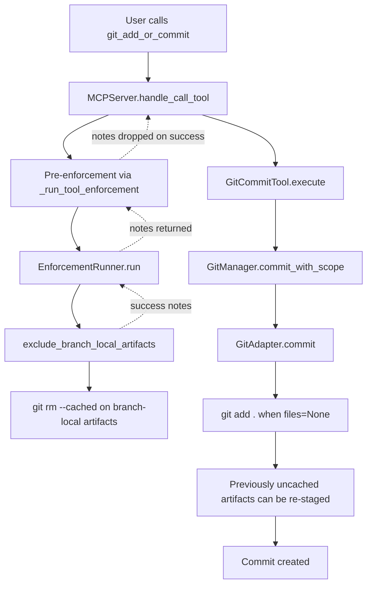

<!-- docs\development\issue283\research-git-add-or-commit-regression.md -->
<!-- template=research version=8b7bb3ab created=2026-04-10T16:26Z updated=2026-04-15 -->
# Research — git_add_or_commit branch-local artifact regression (Issue #283)

**Status:** DRAFT  
**Version:** 2.0  
**Last Updated:** 2026-04-15

---

## Purpose

Capture the current observed behavior and verified findings around git_add_or_commit before designing a durable fix. This document is intentionally limited to research and problem framing.

## Scope

**In Scope:**
Observed runtime behavior of git_add_or_commit in ready phase; interaction between pre-enforcement and commit execution; user-visible response semantics; current test coverage boundaries; architecture-boundary findings related to issue #257 ConfigLoader wiring; verified Git evidence from the active branch; **closure of the five remaining config-root hardcoding violations** (`workphases.yaml` callsites in `ScopeDecoder`, `GitManager`, `PhaseDetection`, `PhaseStateEngine`, and `server.py`).

**Out of Scope:**
Implementation proposal, patch shape, API redesign, commit message formatting changes unrelated to the defect, and any workaround that edits state directly instead of using workflow tools.

**Flag-day constraint (binding, non-negotiable):**

The fix resulting from this research is a **breaking refactor**. No backward compatibility is required and no legacy interfaces shall be preserved. The sole binding architectural constraint at research level is: no callsite in production code may accept raw `Path` objects for YAML configuration after the composition root — this is already closed by the Config-First / DI principles in `ARCHITECTURE_PRINCIPLES.md`. Transitional shims and deprecated overloads are forbidden. All other clean-cut requirements (note contract shape, staging semantics) are design-phase decisions and must not be pre-empted here.

## Prerequisites

Read these first:
1. Issue #283 context and current branch state
2. Existing issue-283 research and design documents
3. Recent runtime verification of create_pr and git_add_or_commit behavior
4. Issue #257 ConfigLoader / constructor-injection design history

---

## Problem Statement

Issue #283 aims to prevent branch-local artifacts from contaminating main. The create_pr guard now blocks correctly, but the preceding git_add_or_commit path still behaves inconsistently: branch-local artifacts can be uncached during pre-enforcement yet still end up tracked or even included again in the resulting commit, while the tool response reports only a generic commit success message. This leaves both repository hygiene and operator feedback unreliable at the exact point where the workflow expects ready-phase preparation to be safe and explicit.

## Research Goals

- Confirm the exact interaction between ready-phase pre-enforcement and the subsequent commit execution path.
- Document why branch-local artifacts can still remain tracked or re-enter the commit path after pre-enforcement.
- Record what the user currently sees in the commit tool response and why that is insufficient for non-silent behavior.
- Identify the current test coverage gap between enforcement-only tests and the full server dispatch plus commit execution path.
- Audit whether the issue-257 config-root boundary is still respected in the current runtime, especially inside the issue-283 path.
- Prepare a clean factual basis for joint design of a durable fix without relying on short cuts or masking behavior.

---

## Background

The active branch refactor/283-ready-phase-enforcement already fixed the create_pr pre-enforcement path so blocked PR creation returns a proper validation response instead of hanging. After that fix, a ready-phase git_add_or_commit run was expected to remove .st3/state.json and .st3/deliverables.json from the commit index before creating a PR-preparation commit. Inspection of the resulting HEAD commit showed that .st3/state.json still appeared in the commit diff and .st3/deliverables.json remained tracked in the repository tree, which triggered a deeper review of the commit path and response semantics.

Issue #257 is also directly relevant. Its planning and research documents establish ConfigLoader plus constructor injection as the normative boundary for YAML-backed configuration: resolve the config root once at the composition root, load typed config objects once, and stop allowing downstream runtime classes to rediscover `.st3/config/...` for themselves.

---

## Findings

### Verified runtime behavior

- A live create_pr call now returns a direct validation error when branch-local artifacts remain tracked, which confirms the create_pr pre-enforcement path is functioning as intended.
- Inspection of the current HEAD commit showed that `.st3/state.json` was still part of the latest ready-phase commit diff.
- Inspection of the HEAD tree also showed that both `.st3/state.json` and `.st3/deliverables.json` remain tracked in the repository.

### Architecture interaction map

The current ready-phase commit path is not a single cohesive operation. It is a chain of four components whose responsibilities only partially line up:

1. `MCPServer.handle_call_tool(...)` runs pre-enforcement via `_run_tool_enforcement(...)` before dispatching the actual tool.
2. `EnforcementRunner.run(...)` executes `exclude_branch_local_artifacts`, mutates the git index with `git rm --cached`, and returns human-readable success notes.
3. `GitCommitTool.execute(...)` delegates to `GitManager.commit_with_scope(...)` and returns only `Committed: <hash>`.
4. `GitAdapter.commit(...)` stages all changes with `git add .` when `files=None`, which can re-stage files that enforcement just uncached.

This yields two separate interaction defects:

- The server discards successful enforcement notes by returning `None` on success from `_run_tool_enforcement(...)`.
- The adapter re-stages the entire working tree after pre-enforcement has intentionally removed branch-local artifacts from the index.



### Commit-path findings

- The ready-phase pre-enforcement handler in `mcp_server/managers/enforcement_runner.py` does produce a note stating that branch-local artifacts were excluded from the commit index.
- The server currently treats those notes as side information and does not propagate them into the final git_add_or_commit response.
- The downstream commit path in `mcp_server/adapters/git_adapter.py` stages all changes with `git add .` when `files=None`.
- That means a successful pre-enforcement uncache can be undone later in the same tool invocation when the commit executes the default stage-all path.
- The current behavior is therefore not a pure enforcement failure; it is an interaction defect between pre-enforcement, response assembly, and commit execution semantics.

### Design/runtime gap inside issue #283

Issue #283's design is strongly config-first, but its implementation boundary was drawn around enforcement hooks rather than around the full commit transaction.

- The issue-283 design and planning documents correctly route new policy through `workphases.yaml`, `phase_contracts.yaml`, `enforcement.yaml`, `ConfigLoader`, and server-level composition.
- The same design explicitly treated `GitCommitTool` as an enforcement-event declaration only, with no planned change to `execute()`.
- That assumption is safe only if the downstream commit path preserves the index state created by pre-enforcement.
- In the actual runtime, `GitAdapter.commit(files=None)` performs a fresh stage-all operation, so the enforcement-only design boundary was too narrow for the real behavior.

This is important because it means issue #283 did not fail due to a missing rule. It failed because the abstraction boundary stopped at enforcement, while the observable behavior depends on the later commit implementation as well.

### Response/UX findings

- The server now preserves error semantics for blocked enforcement paths such as create_pr, which fixed the original hang.
- The success path is still asymmetric: successful enforcement notes are generated, but the user never sees them.
- The git commit tool itself returns only `Committed: <hash>` on success.
- As a result, even when the tool performs non-trivial index mutation before commit, the user does not receive an explicit success message that files were uncached.
- This creates silent success for behavior that is workflow-critical and operationally significant.

### Config-root boundary audit

Issue #257 established a clear rule: YAML-backed configuration should be resolved once via `ConfigLoader(config_root)` at the composition root and injected downward. The current runtime only partially follows that rule.

**What is still correct:**

- `mcp_server/server.py` resolves `config_root` through `resolve_config_root(...)`.
- `mcp_server/server.py` constructs `ConfigLoader(config_root=config_root)` and loads typed config objects there.
- Issue #283's new configuration data is loaded through that path: `workphases.yaml`, `phase_contracts.yaml`, and `enforcement.yaml` all enter the runtime via `ConfigLoader`.
- `PhaseContractResolver` and `MergeReadinessContext` are then built from typed config objects, which is consistent with issue #257's intended boundary.

**What still violates the boundary in active runtime code:**

Five callsites in production code bypass `ConfigLoader` and reconstruct `.st3/config/...` paths directly. All five involve the same file: `workphases.yaml`.

| # | File | Line | Nature |
|---|------|------|--------|
| 1 | `mcp_server/server.py` | 211 | `ScopeDecoder(workphases_path=workspace_root / ".st3" / "config" / "workphases.yaml")` for `StateReconstructor` |
| 2 | `mcp_server/server.py` | 222 | Identical for `PhaseStateEngine` internal `scope_decoder` |
| 3 | `mcp_server/core/phase_detection.py` | 85 | `self.workphases_path = workphases_path or Path(".st3/config/workphases.yaml")` — CWD-sensitive fallback |
| 4 | `mcp_server/managers/phase_state_engine.py` | 91 | Checks file existence to decide whether to relax an already-injected `WorkphasesConfig` object |
| 5 | `mcp_server/managers/git_manager.py` | 26 | Default `_workphases_path`; re-opened as raw YAML inside `commit_with_scope(...)` |

All other `.st3/config` strings in production are display-only constants in `ConfigError.file_path` (`_ENFORCEMENT_DISPLAY_PATH`, `_PHASE_CONTRACTS_DISPLAY_PATH`). These do not open files, but they still violate the total-ban policy established in the regression fix design: in implementation they will be replaced with a generic `{configRoot}/filename` form (e.g. `{configRoot}/enforcement.yaml`). Additionally, `_WORKPHASES_DISPLAY_PATH` in `phase_contract_resolver.py` is dead code — defined but never referenced anywhere — and will be removed without replacement.

The root cause in all five cases is the same: `ScopeDecoder` and `GitManager` still accept a `workphases_path: Path` in their constructor instead of a typed `WorkphasesConfig` object. Replacing that interface eliminates all five violations simultaneously.

**What is not a config-root violation:**

- Direct access to `.st3/state.json` and `.st3/deliverables.json` is not, by itself, evidence of a config-boundary problem. Those files are runtime state and registry artifacts, not YAML configuration sources.

**Conclusion of the audit:**

- The issue-257 boundary is not fully respected in the current post-257 runtime.
- Issue #283 itself partially respects that boundary: its new policy inputs are config-driven and loaded through `ConfigLoader`, which is good.
- Issue #283 also still runs through downstream consumers that directly reconstruct `.st3/config/...` paths, which means the architecture remains mixed at execution time.
- The current defect therefore sits at the intersection of two debts: interaction debt in the commit path, and remaining config-boundary debt in downstream consumers.

### Config-root hardcoding — expected result (in scope for issue #283)

**Finding summary:** Five production callsites reconstruct `.st3/config/workphases.yaml` as a raw `Path` instead of consuming an already-loaded `WorkphasesConfig` object. This is the only remaining category of config-root hardcoding in production code.

**Expected result when resolved:**

- `ScopeDecoder.__init__` accepts `workphases_config: WorkphasesConfig` instead of `workphases_path: Path`.
- `GitManager.__init__` accepts `workphases_config: WorkphasesConfig` instead of `workphases_path: Path`; `commit_with_scope(...)` no longer opens any file.
- `PhaseStateEngine.__init__` removes the file-existence check at line 91; config-relaxation logic operates on the already-injected config object.
- `server.py` wires `ScopeDecoder(workphases_config=workphases_config)` at both construction sites.
- A structural test (`tests/mcp_server/unit/config/test_c_loader_structural.py`) fails on any future re-introduction of direct `.st3/config/` path construction in production code, acting as a mechanical guardrail.

### Architecture-principles assessment

Against `ARCHITECTURE_PRINCIPLES.md`, the strongest confirmed tensions are:

- **SRP / cohesive boundaries:** enforcement, success messaging, and final staging behavior are split across existing layers (server, runner, tool, adapter). Each layer has its own responsibility; the defect is not that no single class owns everything, but that the **contract between layers is broken** — pre-enforcement mutates the index under an implicit assumption that downstream stages will preserve that state. No layer communicates this invariant explicitly.
- **Config-First / constructor injection:** server startup follows the issue-257 pattern, but downstream consumers still rediscover `.st3/config/...` instead of consuming injected config state. The architecture principles close this question: raw config paths must not cross injection boundaries after the composition root.
- **Fail-Fast:** blocked enforcement now fails fast correctly for create_pr, but successful enforcement still degrades into silent behavior later in the call chain.
- **Explicit over implicit:** the user-visible success response hides the fact that the tool is mutating the index before commit. The implicit assumption that stage-all is safe post-enforcement is the architectural root of the regression.
- **Test via Public API (Principle 14):** the runner is tested, but those tests access private methods directly. The full public-path interaction is not yet locked down — and the existing private-method tests provide a false sense of coverage.

### Test-coverage findings

- Existing enforcement tests validate `EnforcementRunner.run(...)` and the exclusion note format in isolation.
- There is a real-git enforcement test that proves the runner can remove an artifact from the index before commit.
- There is not yet a server-level or end-to-end test that proves `git_add_or_commit` preserves that exclusion through the subsequent stage-and-commit path and surfaces the exclusion note in the final response.
- This leaves the most important defect boundary under-tested: the full dispatch path from pre-enforcement into commit execution and final user-visible output.

**Principle 14 (Test via Public API) debt — explicit finding:**

The existing unit tests in `tests/mcp_server/unit/managers/test_enforcement_runner_c3.py` violate Principle 14 by calling private methods and accessing internal state directly (e.g. `_handle_exclude_branch_local_artifacts`, `_merge_readiness_context`). This is not a minor gap — it is the exact antipattern that `ARCHITECTURE_PRINCIPLES.md` Principle 14 forbids. The consequence is that those tests are structurally coupled to implementation details and provide no protection against behavioral regressions in the public dispatch path. Design must treat the existing test coverage as partially invalid and must require replacement tests that only call public API surfaces.

### Success-notes problem statement

The research surfaced a concrete transparency defect: enforcement produces operationally significant output, but that output is discarded before reaching the user.

**The observable problem:**

- `EnforcementRunner.run(...)` returns a `list[str]` describing what it did (e.g. files excluded from the index).
- `MCPServer._run_tool_enforcement(...)` receives this list but returns `None` on success, dropping all notes.
- The user sees only `Committed: <hash>` — no indication that branch-local artifacts were uncached.

**Why `list[str]` is structurally insufficient as a contract:**

A `list[str]` cannot be validated in tests without string parsing. No test can assert that `.st3/state.json` was specifically excluded without inspecting message content, binding the test to the exact wording of the note. This is implicit coupling between producer and consumer through untyped text rather than a machine-readable contract.

**Existing contract to evaluate first:**

`ToolResult` in `mcp_server/tools/tool_result.py` already has a `hints: list[str] | None` field as a secondary output channel. Before introducing any new contract type, design must evaluate whether `ToolResult.hints` can carry enforcement notes with the necessary semantics. Only if `ToolResult` demonstrably cannot carry the required structure (e.g. because notes need to be machine-inspectable per-entry) may a richer contract be introduced — and even then, that is strictly a design decision, not a research conclusion.

**Research boundary:**

This section records the problem only. What typed structure enforcement notes should have, whether `ToolResult.hints` suffices, and who assembles the final response are design decisions to be made in the design phase with full visibility of the existing contracts.

## Conclusions

1. The ready-phase regression is an interaction failure, not merely a missing rule in enforcement configuration.
2. The defect is a **contract breach between existing layers**, not the absence of a single central owner. Each layer (server, runner, tool, adapter) already has a defined responsibility; the failure is that no layer explicitly communicates the invariant "index state after enforcement must be preserved through commit execution". Design must harden this inter-layer contract, not replace the layer structure.
3. The runtime contains five active downstream `.st3/config/...` path dependencies that violate the issue-257 config-root boundary. Closing these is **in scope for issue #283** and is a non-negotiable part of the flag-day refactor.
4. Any durable fix needs to address both correctness and visibility: excluded files must stay excluded, and the user must be told explicitly what the tool did.
5. The next design step should be based on full-path ownership and tests, not on another isolated enforcement-only patch.

## Architecture Constraints (binding, answered by existing principles)

The following questions were raised during research but are **already answered** by `ARCHITECTURE_PRINCIPLES.md` and issue #257. They are not open for reconsideration in design; they are constraints.

- **Phase-aware consumers must receive typed config objects, not raw `Path` values.** Constructor injection is the normative pattern (Config-First / DI principles). `ScopeDecoder`, `GitManager`, and `PhaseStateEngine` accepting `workphases_path: Path` is a violation, not a design choice. This also applies after the flag-day refactor: no production callsite may reconstruct `.st3/config/...` paths independently of the composition root.
- **The five hardcoded `workphases.yaml` callsites (server.py:211, server.py:222, phase_detection.py:85, phase_state_engine.py:91, git_manager.py:26) must be eliminated as part of this issue.** The root cause is a `Path`-accepting interface — replacing that interface eliminates all five simultaneously. These violations are explicitly in scope for issue #283 and must not remain in the codebase when this issue closes.

## Open Questions (v1.5 — answered by C1–C6)

> These questions were open at v1.5 and are now answered by the C1-C6 implementation.
> They are preserved here for traceability.

- ~~Should ready-phase commit execution preserve the post-enforcement index state rather than re-stage the entire working tree when `files=None`?~~ → **Answered:** `skip_paths` postcondition in `GitAdapter.commit()` carries forward the `ExclusionNote` entries set by pre-enforcement.
- ~~Which layer should own the explicit inter-layer contract for index-state preservation?~~ → **Answered:** `GitAdapter.commit(skip_paths=)` owns the postcondition; `GitCommitTool.execute()` reads `ExclusionNote` entries and builds `skip_paths`.
- ~~Should successful enforcement notes be surfaced via `ToolResult.hints` or richer structure?~~ → **Answered:** typed `NoteEntry` variants in `mcp_server/core/operation_notes.py`; surfaced via `NoteContext.render_to_response()`.
- ~~What full-path regression tests are required?~~ → **Answered:** C6 added integration tests for both `git_add_or_commit` and `create_pr` dispatch paths.

---

## Post-C6 Status — What C1–C6 Fixed

C1–C6 resolved all five original defects documented in this research:

| Defect | Fix | Cycle |
|--------|-----|-------|
| A — re-staging via `git add .` after `git rm --cached` | `skip_paths: frozenset[str]` postcondition in `GitAdapter.commit()` via `git restore --staged` | C2 |
| B — successful enforcement notes discarded | `NoteContext` wired through server dispatch; `render_to_response()` appends all `Renderable` entries to the final response | C3 |
| C — five `.st3/config/workphases.yaml` raw-path violations | `WorkphasesConfig` constructor injection for `ScopeDecoder`, `GitManager`, `PhaseStateEngine`; structural guardrail test added | C5 |
| D — `ToolResult.hints` / untyped recovery kwargs | Replaced with typed `NoteEntry` variants (`ExclusionNote`, `CommitNote`, `SuggestionNote`, `BlockerNote`, `RecoveryNote`, `InfoNote`) | C3 |
| E — wrong `create_pr` proxy (`git log merge_base..HEAD`) | Replaced with `_has_net_diff_for_path()` using `git diff --name-only merge_base..HEAD -- path` | C6 |

2762 tests pass on the branch tip after C6. `_run_tool_enforcement` correctly propagates `NoteContext` through pre-enforcement, tool execution, and post-enforcement, then renders notes into the final response via `note_context.render_to_response(raw_result)`.

### Residual situation at C6

Despite C6 being complete, [`create_pr`](mcp_server/tools/pr_tools.py) is still blocked for this branch. The gate correctly detects a net diff:

```
git diff --name-only <merge-base>..HEAD -- .st3/state.json .st3/deliverables.json
# output:
.st3/deliverables.json
.st3/state.json
```

Both paths show in `git ls-tree HEAD` (branch tree contains these files) and both are absent from `git ls-tree main` (main does not have them). The `skip_paths` + `git restore --staged` mechanism prevented these files from appearing in the *delta of the most recent commit*, but they remain in the *branch tree* from earlier commits. The `create_pr` gate checks the branch tree against the merge-base, not the most recent commit delta — so the gate still fires correctly.

This is not a gate defect. The gate is right. The problem is that the ready-commit mechanism does not neutralize the branch tip.

---

## Residual Gap — Model 1: Branch-Tip Neutralization

### Accepted invariant (binding product decision — 2026-04-15)

> **For every `artifact.path` in `MergeReadinessContext.branch_local_artifacts`:**
> After the ready-phase cleanup commit, merging the child branch into the base branch
> must not change the base's state for these paths.
>
> Practically: `git diff --name-only MERGE_BASE(HEAD, BASE)..HEAD -- artifact.path`
> must be empty immediately after the ready-phase cleanup commit.

This was accepted as "Model 1" on 2026-04-15 and is not open for reconsideration in design.

**Corollary:** the child branch may retain the real history of these files in its commit log.
The history is preserved. Only the branch-tip state is neutralized before PR merge.

### Why `skip_paths` + `git restore --staged` does NOT satisfy this invariant

`git restore --staged path` operates on the staging area only. Its effect:

- Removes pending changes for `path` from the index relative to HEAD.
- Does **not** change the working tree.
- Does **not** change the branch tree. The file is still tracked from previous commits.

After a `git add . && git restore --staged .st3/state.json && git commit`:

```
# The new commit C has no delta for .st3/state.json relative to its parent.
# But .st3/state.json is still present in C's tree (inherited from parent tree).
# git diff --name-only MERGE_BASE(C, main)..C -- .st3/state.json → .st3/state.json
```

The `create_pr` gate sees the file in the branch tree and the merge-base tree doesn't have it,
so the diff is non-empty. Gate fires. **The `skip_paths` mechanism is commit-level exclusion,
not branch-tip neutralization.**

### What Model 1 requires

The ready-phase commit must perform an explicit structural alignment of the branch tip to the
base on each excluded path. The operation differs based on whether the path exists on `BASE`:

| Case | Required git operation |
|------|------------------------|
| `git ls-tree BASE -- path` is empty (path absent from base) | `git rm -- path` (removes from index AND worktree) |
| `git ls-tree BASE -- path` is non-empty (path present on base) | `git restore --source=BASE --staged --worktree -- path` |

After this commit, `HEAD` tree for `path` equals `BASE` tree for `path`, making the net diff
for that path empty.

**Live branch evidence:**

```
git ls-tree main -- .st3/state.json .st3/deliverables.json   # empty (not on main)
git diff --name-only <merge-base>..HEAD -- .st3/state.json   # .st3/state.json (non-empty)
```

Both artifacts are absent from `main`. The correct neutralization is `git rm` for both.
After the neutralization commit, both diffs would be empty and `create_pr` would pass.

---

## Precise Code-Gap Map (post-C6)

### Gap 1 — Ready-commit performs staging-level exclusion instead of branch-tip neutralization

**File:** `mcp_server/tools/git_tools.py`  
**Location:** `GitCommitTool.execute()` lines ~352–361  
**Current behavior:**
```python
excluded_paths = frozenset(n.file_path for n in ctx.of_type(ExclusionNote))
commit_hash = self.manager.commit_with_scope(
    ...
    skip_paths=excluded_paths,
)
```
**What this does:** the `skip_paths` postcondition in `GitAdapter.commit()` runs
`git restore --staged path` after staging. The path delta is absent from the new commit.
The path remains in the branch tree.

**What Model 1 requires:** when `ExclusionNote` entries are present (terminal phase), run
branch-tip neutralization instead of staging-level exclusion:
1. For each `ExclusionNote.file_path`, determine whether the path exists on `BASE`.
2. If absent from `BASE`: `git rm -- path` (remove from index and worktree).
3. If present on `BASE`: `git restore --source=BASE --staged --worktree -- path`.
4. Commit the resulting tree change. This commit is the "readiness commit".
5. Do NOT use `skip_paths` for the excluded paths in this route — they become part of the commit.

**Signal:** The presence of `ExclusionNote` entries in `NoteContext` is the session-level
signal that terminal-phase enforcement has run. This is the correct trigger for route selection.

### Gap 2 — GitCommitTool has no base-branch knowledge

**File:** `mcp_server/tools/git_tools.py`  
**Location:** `GitCommitInput` model (lines ~218–281); `GitCommitTool.execute()` (line ~312)  
**Current state:** `GitCommitInput` has no `base` field. `GitCommitTool` has no base-branch
resolution logic.

**Required:** resolve `BASE` in `execute()` using the three-tier chain:
1. `params.base` — explicit caller override (requires adding `base: str | None` to `GitCommitInput`).
2. `_state_engine.get_state(current_branch).parent_branch` — from `BranchState` in state.json.
3. `git_config.default_base_branch` — from injected `GitConfig`.

This chain is consistent with the resolution used by `GetParentBranchTool.execute()` (lines ~692-710)
and compatible with the fallback in `CreatePRInput.apply_default_base_branch()`.

**Note:** `PhaseStateEngine.get_state()` is already available in `GitCommitTool` via the injected
`_state_engine`. The `BranchState.parent_branch` field is populated by `initialize_branch`.

### Gap 3 — EnforcementRunner hardcodes `"main"` as base fallback

**File:** `mcp_server/managers/enforcement_runner.py`  
**Location:** `_handle_check_merge_readiness()`, line ~330:
```python
base = str(context.get_param("base") or "main")
```
**Gap:** `"main"` is a hardcoded literal. For a non-`main` default base (e.g., epic-parent),
the check computes the wrong merge-base. The enforcement runner does not receive `GitConfig`
and cannot access `git_config.default_base_branch`.

**Required:** inject `git_config.default_base_branch` (or the full value) into
`EnforcementRunner.__init__` so the fallback aligns with the PR tool and the ready-commit.
The `"main"` literal must be replaced.

### Gap 4 — Remediation messaging in `create_pr` guard refers to obsolete mechanism

**File:** `mcp_server/managers/enforcement_runner.py`  
**Location:** `_handle_check_merge_readiness()` suggestion notes (lines ~358–368)  
**Current messages** imply `skip_paths` auto-exclusion is the fix:
> "Commit first in the ready phase to auto-exclude them"

**Model 1 meaning:** a ready-phase `git_add_or_commit` call will now neutralize these paths
to the base branch via `git rm` or `git restore --source=BASE`. The suggestion notes must
direct the user to that operation, not to the obsolete staging-exclusion mechanism.

---

## Updated Conclusions (v2.0)

1. C1–C6 fully resolved the original five defects. The `NoteContext` architecture, `skip_paths`
   postcondition, and `_has_net_diff_for_path` proxy are correct foundations for the Model 1 fix.
2. The `create_pr` gate using `git diff --name-only merge_base..HEAD` is the correct invariant
   check and must not be changed.
3. The ready-commit mechanism needs to be replaced (not extended) for the terminal phase:
   `skip_paths` (staging exclusion) → branch-tip neutralization (`git rm` or `git restore --source=BASE`).
4. Base-branch resolution must be consistent across `GitCommitTool`, `CreatePRTool`, and
   `EnforcementRunner`. A three-tier chain (explicit → state.json → git_config) satisfies all cases.
5. The neutralization operations are surgical. No new abstraction layer is required; `GitAdapter`
   already has a `restore(files, source)` method. The missing piece is a pre-commit step that
   handles the "path absent from base → delete" case.
6. The `ExclusionNote` signal in `NoteContext` is the correct branch-point for route selection
   in `GitCommitTool.execute()`. No additional phase detection is needed at the tool level.

## Open Questions (v2.0)

- Should `GitAdapter.restore()` be extended to accept `delete_if_absent: bool` to handle the
  "path absent from base → delete from index and worktree" case, or should this be a new
  `neutralize_to_base(paths, base)` method?
- Should `git ls-tree BASE -- path` be called per-path inside `GitCommitTool.execute()` or
  delegated to `GitAdapter` / `GitManager` as a pre-commit operation?
- Should `EnforcementRunner.__init__` receive `default_base_branch: str` directly, or the full
  `GitConfig` object? The former is simpler; the latter opens the door to future config-aware
  enforcement without further injection.
- Are the existing skip_paths integration tests (`test_git_adapter_skip_paths.py`,
  `test_git_add_commit_regression_c6.py`) to be retained as regression coverage for the generic
  `skip_paths` primitive, or replaced entirely by Model 1 contract tests?
- What is the exact message contract for the readiness commit? Should the commit message be
  driven by `workphases.yaml` scope (e.g., `chore(P_READY): neutralize branch-local artifacts`)
  or left to the caller?

## Related Documentation
- **[tests/mcp_server/integration/test_ready_phase_enforcement.py][related-1]**
- **[tests/mcp_server/unit/managers/test_enforcement_runner_c3.py][related-2]**
- **[mcp_server/tools/git_tools.py][related-3]**
- **[mcp_server/managers/git_manager.py][related-4]**
- **[mcp_server/adapters/git_adapter.py][related-5]**
- **[mcp_server/server.py][related-6]**
- **[docs/development/issue283/design-ready-phase-enforcement.md][related-7]**
- **[docs/development/issue283/planning-ready-phase-enforcement.md][related-8]**
- **[docs/development/issue257/planning.md][related-9]**
- **[docs/development/issue257/research_config_layer_srp.md][related-10]**
- **[docs/coding_standards/ARCHITECTURE_PRINCIPLES.md][related-11]**

<!-- Link definitions -->

[related-1]: tests/mcp_server/integration/test_ready_phase_enforcement.py
[related-2]: tests/mcp_server/unit/managers/test_enforcement_runner_c3.py
[related-3]: mcp_server/tools/git_tools.py
[related-4]: mcp_server/managers/git_manager.py
[related-5]: mcp_server/adapters/git_adapter.py
[related-6]: mcp_server/server.py
[related-7]: docs/development/issue283/design-ready-phase-enforcement.md
[related-8]: docs/development/issue283/planning-ready-phase-enforcement.md
[related-9]: docs/development/issue257/planning.md
[related-10]: docs/development/issue257/research_config_layer_srp.md
[related-11]: docs/coding_standards/ARCHITECTURE_PRINCIPLES.md

---

## Version History

| Version | Date | Author | Changes |
|---------|------|--------|---------|
| 1.5 | 2026-04-11 | Agent | QA round 2: flag-day constraint scoped to raw-Path prohibition only; config-boundary closure pulled into issue-283 scope; "out of scope" note removed; Architecture Constraints and Conclusion 3 made consistent. |
| 1.4 | 2026-04-11 | Agent | QA remediation: flag-day constraint, Principle 14 debt explicit, 'single owner' → contract breach, NoteEntry stripped → problem-only section with ToolResult anchor, config-path moved to Architecture Constraints. |
| 1.3 | 2026-04-11 | Agent | Added design considerations: NoteEntry contract, NotesAggregator pattern, research boundary. |
| 1.2 | 2026-04-11 | Agent | Added config-root violation table, expected-result block (future cycle), clarified display-path exclusions. |
| 1.1 | 2026-04-11 | Agent | Added architecture interaction map, design/runtime gap analysis, config-root boundary audit, and principles alignment. |
| 1.0 | 2026-04-10 | Agent | Initial draft |
