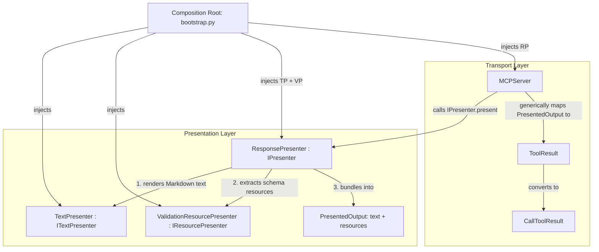

<!-- docs\development\issue414\design.md -->
<!-- template=design version=5827e841 created=2026-08-19T18:51Z updated=2026-08-19T19:00Z -->
# Design: Composite Presentation Architecture & Validation Resource Delegation

**Status:** APPROVED  
**Version:** 1.0  
**Last Updated:** 2026-08-19

---

## Purpose

Define the formal interface contracts, Pydantic DTO models, component composition, and verification strategy for delegating validation schema generation from `MCPServer` to the presentation layer.

## Scope

**In Scope:**
- Definition of `PresentationResource` and `PresentedOutput` DTO models.
- Definition of segregated interface protocols: `ITextPresenter`, `IResourcePresenter`, and the unified `IPresenter`.
- Specification of component roles: `TextPresenter`, `ValidationResourcePresenter`, `ResponsePresenter`, and `MCPServer`.
- Composition root wiring in [`mcp_server/bootstrap.py`](file:///c:/temp/pgmcp/mcp_server/bootstrap.py).
- Testing and verification strategy across unit and integration test suites.

**Out of Scope:**
- Modifications to individual tool business logic, schema definitions, or validation decorators.
- Changes to client-side JSON-RPC protocol handling or response caching internals.

---

## 1. Context & Requirements

### 1.1. Problem Statement

In [`mcp_server/server.py`](file:///c:/temp/pgmcp/mcp_server/server.py#L160-L176), `MCPServer` directly checks whether a tool execution result has `error_type == "ValidationError"`, extracts `result_dto.input_schema`, and appends an embedded resource dictionary (`{"type": "resource", "resource": {"uri": "schema://validation", ...}}`) to `ToolResult.content`. Furthermore, `MCPServer.__init__` type-annotates `presenter` with the concrete class `TextPresenter`.

This violates:
1. **Presentation Boundary (SRP §1.1):** Transport logic performs presentation resource formatting.
2. **Presenter Single Responsibility (§1.1):** `TextPresenter` cannot handle both text templating and binary/JSON schema serialization without becoming a God Class.
3. **Dependency Inversion Principle (DIP §1.5):** `MCPServer` couples directly to concrete `TextPresenter` instead of an abstraction.

### 1.2. Requirements

**Functional:**
- `MCPServer` must have zero knowledge of `ValidationErrorOutput`, `schema://validation`, or JSON serialization of validation schemas.
- The presentation layer must produce both the user-facing Markdown message and the `schema://validation` embedded resource upon validation failure.
- `MCPServer` must depend strictly on `IPresenter` via constructor injection.
- MCP clients (e.g. VS Code) must continue to receive identical `CallToolResult` wire payloads containing `TextContent` and `EmbeddedResource`.

**Non-Functional:**
- 100% strict type safety under Pyright and mypy with zero type ignores.
- Immutable, frozen Pydantic DTO models (`model_config = ConfigDict(frozen=True)`).
- Complete isolation and testability of each presentation component with unit mocks.

### 1.3. Approved Strategy & Constraints

- **Internal Python Interfaces:** **Clean Break** — Replace old signatures directly without legacy compatibility wrappers.
- **External MCP Protocol:** **Preserve Wire Contract** — Maintain exact JSON-RPC `CallToolResult` structure.
- **Architecture Contract:** Strict compliance with [ARCHITECTURE_PRINCIPLES.md](file:///c:/temp/pgmcp/docs/coding_standards/ARCHITECTURE_PRINCIPLES.md).

---

## 2. Design Options & Trade-offs

| Criterion | Option A: Monolithic `TextPresenter` | Option B: Transport Protocol Converter | Option C: Composite Presentation Architecture (Chosen) |
|---|---|---|---|
| **Architecture Contract** | Violates SRP (Rule 1.1). | Compromises Presentation Boundary. | **Strictly compliant (SRP, ISP, DIP).** |
| **Component Responsibilities** | `TextPresenter` does text + JSON schemas. | Transport adapter extracts schemas. | `TextPresenter` does text; `ValidationResourcePresenter` does schemas; `ResponsePresenter` coordinates. |
| **Transport Layer Coupling** | Low. | High (transport knows error types). | **Zero coupling (pure transport pipe).** |
| **Test Isolation** | Harder to test text and resources separately. | Requires integration tests for transport. | **100% isolated unit testability per component.** |

---

## 3. Chosen Architecture

**Decision:** Adopt Option C — Composite Presentation Architecture with Segregated Interfaces.



---

## 4. Detailed Interface Contracts & Schema Specifications

### 4.1. Presentation Schemas ([`mcp_server/schemas/presentation_output.py`](file:///c:/temp/pgmcp/mcp_server/schemas/presentation_output.py))

```python
from pydantic import BaseModel, ConfigDict, Field

class PresentationResource(BaseModel):
    """Immutable representation of an embedded presentation resource."""
    model_config = ConfigDict(frozen=True, extra="forbid")

    uri: str
    mime_type: str = "application/json"
    content: str

class PresentedOutput(BaseModel):
    """Unified immutable presentation result produced by the presentation layer."""
    model_config = ConfigDict(frozen=True, extra="forbid")

    text: str
    resources: list[PresentationResource] = Field(default_factory=list)
```

### 4.2. Core Presentation Interfaces ([`mcp_server/core/interfaces/ipresenter.py`](file:///c:/temp/pgmcp/mcp_server/core/interfaces/ipresenter.py))

```python
from typing import Any, Protocol, runtime_checkable
from pydantic import BaseModel
from mcp_server.core.operation_notes import NoteEntry
from mcp_server.schemas.cache_publication import CachePublication
from mcp_server.schemas.presentation_output import PresentationResource, PresentedOutput

@runtime_checkable
class ITextPresenter(Protocol):
    """Interface for rendering DTOs and operation notes into Markdown text."""

    def present_text(
        self,
        tool_name: str,
        data: BaseModel | dict[str, Any],
        notes: list[NoteEntry] | None = None,
        cache_pub: CachePublication | None = None,
        success: bool | None = None,
    ) -> str:
        """Format data and notes into a Markdown text string."""
        ...

    def present_notes(
        self,
        tool_name: str,
        notes: list[NoteEntry],
    ) -> str | None:
        """Format operation notes into Markdown text blocks."""
        ...

@runtime_checkable
class IResourcePresenter(Protocol):
    """Interface for extracting and formatting embedded presentation resources."""

    def present_resources(
        self,
        tool_name: str,
        data: BaseModel | dict[str, Any],
    ) -> list[PresentationResource]:
        """Extract and format presentation resources from the execution data."""
        ...

@runtime_checkable
class IPresenter(Protocol):
    """Unified interface for presenting execution results and resources to clients."""

    def present(
        self,
        tool_name: str,
        data: BaseModel | dict[str, Any],
        notes: list[NoteEntry] | None = None,
        cache_pub: CachePublication | None = None,
        success: bool | None = None,
    ) -> PresentedOutput:
        """Present data, notes, and resources as a complete PresentedOutput."""
        ...
```

### 4.3. Concrete Component Specifications

#### 1. `TextPresenter` ([`mcp_server/presenters/text_presenter.py`](file:///c:/temp/pgmcp/mcp_server/presenters/text_presenter.py))
- **Role:** Implements `ITextPresenter`.
- **Behavior:** Retains template resolution from `presentation.yaml`, emoji prefixing, next instruction generation, note grouping, and cache footnote formatting.
- **Contract:**
  - `present_text(tool_name, data, notes=None, cache_pub=None, success=None) -> str`
  - `present_notes(tool_name, notes) -> str | None`

#### 2. `ValidationResourcePresenter` ([`mcp_server/presenters/validation_resource_presenter.py`](file:///c:/temp/pgmcp/mcp_server/presenters/validation_resource_presenter.py))
- **Role:** Implements `IResourcePresenter`.
- **Behavior:** Inspects `data`. If `isinstance(data, ValidationErrorOutput)` (or dict with `error_type == "ValidationError"`) and `input_schema` is present, serializes `input_schema` as JSON and returns `[PresentationResource(uri="schema://validation", mime_type="application/json", content=json_schema)]`. Otherwise returns `[]`.
- **Contract:**
  - `present_resources(tool_name, data) -> list[PresentationResource]`

#### 3. `ResponsePresenter` ([`mcp_server/presenters/response_presenter.py`](file:///c:/temp/pgmcp/mcp_server/presenters/response_presenter.py))
- **Role:** Implements `IPresenter` as a coordinating facade.
- **Dependencies (Constructor Injection):**
  - `text_presenter: ITextPresenter`
  - `resource_presenter: IResourcePresenter`
- **Behavior:** Invokes `text_presenter.present_text(...)` and `resource_presenter.present_resources(...)`, assembling the results into `PresentedOutput(text=text, resources=resources)`.
- **Contract:**
  - `__init__(text_presenter: ITextPresenter, resource_presenter: IResourcePresenter) -> None`
  - `present(tool_name, data, notes=None, cache_pub=None, success=None) -> PresentedOutput`

---

## 5. Transport Layer Integration ([`mcp_server/server.py`](file:///c:/temp/pgmcp/mcp_server/server.py))

### 5.1. Constructor Injection & Type Decoupling
`MCPServer.__init__` accepts `IPresenter | None`:
```python
def __init__(
    self,
    settings: Settings,
    tools: list[ITool],
    resources: list[BaseResource],
    presenter: IPresenter | None = None,
    publisher: IToolResponsePublisher | None = None,
) -> None: ...
```

### 5.2. Tool Execution & Response Mapping
In `MCPServer.handle_call_tool`:
```python
# 1. Execute tool
result_dto = await tool.execute(arguments or {}, note_context)

# 2. Publish cache
cache_pub = self.response_cache_manager.put(tool.name, result_dto) if self.response_cache_manager else None

# 3. Present result
if self.presenter is not None:
    presented = self.presenter.present(
        tool_name=tool.name,
        data=result_dto,
        notes=note_context.entries,
        cache_pub=cache_pub,
    )
else:
    presented = PresentedOutput(text=str(result_dto), resources=[])

# 4. Map PresentedOutput generically to ToolResult
content: list[dict[str, Any]] = [{"type": "text", "text": presented.text}]
for res in presented.resources:
    content.append({
        "type": "resource",
        "resource": {
            "uri": res.uri,
            "mimeType": res.mime_type,
            "text": res.content,
        },
    })

success = getattr(result_dto, "success", True)
raw_result = ToolResult(content=content, is_error=not success)
return self._convert_tool_result_to_mcp_result(raw_result)
```

---

## 6. Composition Root Wiring ([`mcp_server/bootstrap.py`](file:///c:/temp/pgmcp/mcp_server/bootstrap.py))

In `ApplicationBootstrap._build_server`:
```python
text_presenter = TextPresenter(config=configs.presentation_config)
validate_presentation_alignment(text_presenter, core_tools)
resource_presenter = ValidationResourcePresenter()
presenter = ResponsePresenter(
    text_presenter=text_presenter,
    resource_presenter=resource_presenter,
)

return MCPServer(
    settings=settings,
    tools=tools,
    resources=resources,
    presenter=presenter,
    publisher=managers.response_cache,
)
```

---

## 7. Verification & Testing Strategy

1. **Schema Unit Tests:** Test `PresentedOutput` and `PresentationResource` immutability and serialization.
2. **Presenter Unit Tests:**
   - Test `TextPresenter.present_text` in isolation.
   - Test `ValidationResourcePresenter.present_resources` with validation errors vs. normal DTOs.
   - Test `ResponsePresenter` composite coordination with mock sub-presenters.
3. **Server Unit Tests:** Test `MCPServer.handle_call_tool` verifying generic translation of `PresentedOutput` to `ToolResult`.
4. **Integration Tests:** Execute `test_strict_input_validation_response.py` to prove end-to-end wire compatibility for `schema://validation`.
5. **Quality Gates:** Run `run_quality_gates` ensuring 0 Pyright/mypy typing errors and 0 linting warnings.

---

## Related Documentation
- **[docs/coding_standards/ARCHITECTURE_PRINCIPLES.md][related-1]**
- **[docs/coding_standards/DOCUMENTATION_STANDARD.md][related-2]**
- **[docs/development/issue414/research.md][related-3]**

<!-- Link definitions -->

[related-1]: docs/coding_standards/ARCHITECTURE_PRINCIPLES.md
[related-2]: docs/coding_standards/DOCUMENTATION_STANDARD.md
[related-3]: docs/development/issue414/research.md

---

## Version History

| Version | Date | Author | Changes |
|---------|------|--------|---------|
| 1.0 | 2026-08-19 | Agent | Initial design specifying composite presentation architecture, interface contracts, and transport decoupling |
