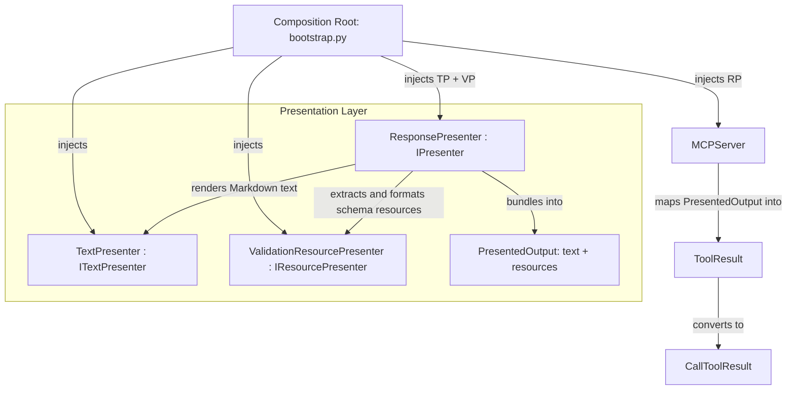

<!-- docs\development\issue414\research.md -->
<!-- template=research version=8b7bb3ab created=2026-08-19T17:40Z updated=2026-08-19T18:20Z -->
# Research: Delegate Validation Resource Schema Generation to IPresenter

**Status:** APPROVED  
**Version:** 1.2  
**Last Updated:** 2026-08-19

---

## Purpose

Investigate architectural boundaries, interface designs, presentation mechanisms, and migration strategies for delegating `schema://validation` resource generation from the transport layer (`MCPServer`) to the presentation layer (`IPresenter`).

## Scope

**In Scope:**
- Analysis of `MCPServer.handle_call_tool` and `MCPServer.__init__` in [`mcp_server/server.py`](file:///c:/temp/pgmcp/mcp_server/server.py).
- Analysis of the [`IPresenter`](file:///c:/temp/pgmcp/mcp_server/core/interfaces/ipresenter.py) contract and [`TextPresenter`](file:///c:/temp/pgmcp/mcp_server/presenters/text_presenter.py) implementation.
- Handling of [`ValidationErrorOutput`](file:///c:/temp/pgmcp/mcp_server/schemas/error_outputs.py) and generation of `schema://validation` embedded presentation resources.
- Enforcement of [ARCHITECTURE_PRINCIPLES.md](file:///c:/temp/pgmcp/docs/coding_standards/ARCHITECTURE_PRINCIPLES.md) (SRP, ISP, DIP, Composition over Inheritance).
- Composite presentation design: separating `ITextPresenter` (Markdown text rendering), `IResourcePresenter` (structured payload generation), and `ResponsePresenter` (coordination returning `PresentedOutput`).
- Mapping of the blast radius across production code, unit tests, and integration test suites.
- Definition of candidate planning seams and preservation invariants.

**Out of Scope:**
- Modifying individual MCP tool business logic or validation decorators.
- Altering the MCP wire protocol format or JSON-RPC schema contracts.
- Redesigning the response caching layer or cache key normalization.

---

## Problem Statement

In the current implementation of [`mcp_server/server.py`](file:///c:/temp/pgmcp/mcp_server/server.py#L160-L176), the transport layer (`MCPServer`) directly inspects the execution result DTO for `error_type == "ValidationError"`, extracts `result_dto.input_schema`, and appends an embedded resource dictionary (`{"type": "resource", "resource": {"uri": "schema://validation", ...}}`) to `ToolResult.content`.

This creates several architectural violations according to [ARCHITECTURE_PRINCIPLES.md](file:///c:/temp/pgmcp/docs/coding_standards/ARCHITECTURE_PRINCIPLES.md):
1. **Presentation Boundary & SRP (Rule 1.1):** The transport layer performs formatting and assembly of presentation resources instead of leaving output rendering entirely to the presentation layer.
2. **SRP & Nomenclature Violation on Presenter:** If `TextPresenter` were modified to generate both Markdown text and JSON-schema payloads, it would fail the single-sentence SRP test (*"TextPresenter formats markdown text and extracts and formats JSON validation schema resources"*).
3. **Dependency Inversion Principle (Rule 1.5):** `MCPServer.__init__` is annotated with the concrete class `TextPresenter` instead of the abstraction `IPresenter`.

---

## Research Goals

1. Analyze current responsibilities and coupling between `MCPServer`, `IPresenter`, and validation schema formatting.
2. Formulate a composition-based presentation architecture that strictly satisfies SRP, ISP, and DIP.
3. Clarify the distinction between text URI references in Markdown and `PresentationResource` payload identifiers.
4. Identify all invariants and externally observable behaviors that must be preserved.
5. Map the full blast radius across production files, test suites, and helpers.
6. Define candidate seams for safe planning and execution.

---

## Findings & Evidence

### 1. The Interactive Presentation Nature of `schema://validation`

In MCP-compliant client environments (such as VS Code and AI agent chats), embedded resources in a `CallToolResult` are active UI elements:
- An `EmbeddedResource` with `uri="schema://validation"` is rendered as an interactive, clickable schema view for the user and LLM.
- It directly informs the client of the expected schema structure alongside the formatted error text.
- Consequently, the generation of `schema://validation` is fundamentally a **Presentation concern** (how domain error data is visualised and structured for the client), rather than a transport routing concern.

### 2. Distinction Between Text References and Resource Payloads

A critical architectural distinction emerged regarding URIs:
- **Chat Markdown Text (`TextPresenter`):** The visible text presented in chat to the user/LLM (e.g. error summaries, tips, next steps, and explanatory footnote text). Formatted entirely from templates in `presentation.yaml`.
- **Resource Payload (`ValidationResourcePresenter`):** The structured data payload with its identifier (`uri="schema://validation"`), MIME-type (`application/json`), and serialized JSON schema string.

### 3. Current Code Paths and Responsibilities

#### Transport Layer (`mcp_server/server.py`)
In `MCPServer.handle_call_tool`:
```python
# 1. Execute tool -> returns BaseModel DTO
result_dto = await tool.execute(arguments or {}, note_context)

# 2. Publish result to cache
cache_pub = self.response_cache_manager.put(tool.name, result_dto) if self.response_cache_manager else None

# 3. Format markdown output
if self.presenter is not None:
    markdown = self.presenter.present(
        tool_name=tool.name,
        data=result_dto,
        notes=note_context.entries,
        cache_pub=cache_pub,
    )
else:
    markdown = str(result_dto)

# 4. Construct normalized ToolResult and manually inject validation resource
raw_result = ToolResult.text(markdown)
success = getattr(result_dto, "success", True)
if not success:
    raw_result = raw_result.model_copy(update={"is_error": True})
    if getattr(result_dto, "error_type", None) == "ValidationError":
        raw_result.content.append(
            {
                "type": "resource",
                "resource": {
                    "uri": "schema://validation",
                    "mimeType": "application/json",
                    "text": json.dumps(
                        getattr(result_dto, "input_schema", {})
                    ),
                },
            }
        )
response_content = self._convert_tool_result_to_mcp_result(raw_result)
```

**Key Observation:** `server.py` assumes `IPresenter.present()` only returns a plain Markdown string (`str`). Because `IPresenter` currently cannot return structured embedded resources, `server.py` compensates by mutating `ToolResult.content` directly.

---

## Architectural Design: Composite Presentation Architecture

In strict compliance with [ARCHITECTURE_PRINCIPLES.md](file:///c:/temp/pgmcp/docs/coding_standards/ARCHITECTURE_PRINCIPLES.md), we establish a composite architecture in the presentation layer:



### Component Responsibilities & Contracts

1. **`ITextPresenter` / `TextPresenter`:**
   - **Responsibility (SRP):** Formats DTOs and operation notes into Markdown text using `presentation.yaml` templates.
   - **Contract:** `present_text(tool_name, data, notes, cache_pub, success) -> str`.
2. **`IResourcePresenter` / `ValidationResourcePresenter`:**
   - **Responsibility (SRP):** Translates `ValidationErrorOutput.input_schema` into a `PresentationResource` payload.
   - **Contract:** `present_resources(tool_name, data) -> list[PresentationResource]`.
3. **`IPresenter` / `ResponsePresenter` (Coordinating Facade):**
   - **Responsibility (ISP & DIP):** Injected with `ITextPresenter` and `IResourcePresenter` at the composition root (`bootstrap.py`). Coordinates both text and resource generation and returns a frozen `PresentedOutput` DTO.
   - **Contract:** `present(tool_name, data, notes, cache_pub, success) -> PresentedOutput`.
4. **`MCPServer` in `server.py`:**
   - **Responsibility:** Pure transport coordinator. Receives `IPresenter`, obtains `PresentedOutput`, and generically translates `PresentedOutput.text` and `PresentedOutput.resources` into `ToolResult`. Zero knowledge of validation errors or schema URIs.

### Presentation Schemas

```python
class PresentationResource(BaseModel):
    """Immutable representation of an embedded MCP resource payload."""
    model_config = ConfigDict(frozen=True)
    uri: str
    mime_type: str = "application/json"
    content: str

class PresentedOutput(BaseModel):
    """Unified presentation result containing chat text and embedded resources."""
    model_config = ConfigDict(frozen=True)
    text: str
    resources: list[PresentationResource] = Field(default_factory=list)
```

---

## Invariants & Preservation Goals

1. **MCP Wire Format Invariant:**
   For any tool call failing input validation:
   - `CallToolResult.isError` must be `True`.
   - `CallToolResult.content` must contain:
     1. `TextContent`: Formatted error message and notes.
     2. `EmbeddedResource`: Resource with `uri="schema://validation"`, `mimeType="application/json"`, and `text` containing the valid JSON schema.
2. **Type Safety & Strict Checking:**
   - Full compliance with `pyright` and `mypy` without global ignores.
   - `MCPServer.__init__` must accept `IPresenter | None` rather than `TextPresenter | None`.
3. **Resilience & Fallbacks:**
   - If `presenter is None` or formatting encounters an edge case, `MCPServer` falls back gracefully without unhandled crashes.

---

## Blast Radius Analysis

### Production Files
- [`mcp_server/schemas/presentation_output.py`](file:///c:/temp/pgmcp/mcp_server/schemas/presentation_output.py) *(NEW)*: Define `PresentationResource` and `PresentedOutput`.
- [`mcp_server/core/interfaces/ipresenter.py`](file:///c:/temp/pgmcp/mcp_server/core/interfaces/ipresenter.py): Update `IPresenter` protocol to return `PresentedOutput`. Add `ITextPresenter` and `IResourcePresenter` protocols.
- [`mcp_server/presenters/text_presenter.py`](file:///c:/temp/pgmcp/mcp_server/presenters/text_presenter.py): Implement `ITextPresenter` (retains pure text formatting focus).
- [`mcp_server/presenters/validation_resource_presenter.py`](file:///c:/temp/pgmcp/mcp_server/presenters/validation_resource_presenter.py) *(NEW)*: Implement `IResourcePresenter` for `schema://validation`.
- [`mcp_server/presenters/response_presenter.py`](file:///c:/temp/pgmcp/mcp_server/presenters/response_presenter.py) *(NEW)*: Implement `IPresenter` composite.
- [`mcp_server/server.py`](file:///c:/temp/pgmcp/mcp_server/server.py):
  - Change `presenter: TextPresenter | None` parameter to `presenter: IPresenter | None`.
  - Remove inline `schema://validation` resource appending.
  - Map `PresentedOutput.resources` to `ToolResult.content`.
- [`mcp_server/bootstrap.py`](file:///c:/temp/pgmcp/mcp_server/bootstrap.py): Wire composite presenter at the composition root.

### Test Files
- [`tests/mcp_server/unit/test_presenter.py`](file:///c:/temp/pgmcp/tests/mcp_server/unit/test_presenter.py): Verify `TextPresenter` and composite `ResponsePresenter`.
- [`tests/mcp_server/unit/server/test_validate_tool_arguments.py`](file:///c:/temp/pgmcp/tests/mcp_server/unit/server/test_validate_tool_arguments.py): Validate server argument validation tests continue to receive `schema://validation`.
- [`tests/mcp_server/integration/test_strict_input_validation_response.py`](file:///c:/temp/pgmcp/tests/mcp_server/integration/test_strict_input_validation_response.py): Verify end-to-end MCP response structure.
- [`tests/mcp_server/unit/test_server.py`](file:///c:/temp/pgmcp/tests/mcp_server/unit/test_server.py): Update mocked presenter fixtures to return `PresentedOutput`.

---

## Candidate Seams for Planning

1. **Seam 1: Presentation Schemas & Presenter Subcomponents**
   - Introduce `PresentedOutput` / `PresentationResource` schemas.
   - Define `ITextPresenter`, `IResourcePresenter`, and updated `IPresenter` interfaces.
   - Implement `ValidationResourcePresenter` and `ResponsePresenter`.
   - Update and add unit tests in `test_presenter.py`.

2. **Seam 2: Transport Layer Integration & Decoupling (`MCPServer`)**
   - Decouple `MCPServer` type annotations to `IPresenter | None`.
   - Update `MCPServer.handle_call_tool` to map `PresentedOutput` into `ToolResult`.
   - Remove inline error checking and manual resource construction from `server.py`.
   - Wire dependencies in `bootstrap.py`.
   - Update server unit tests.

3. **Seam 3: End-to-End Verification & Quality Gates**
   - Verify integration test suites.
   - Run quality gates (`run_quality_gates`).

---

## Approved Strategy

**Selected Strategy:** Preserve Compatibility

**Boundary & Preservation Scope:**
- Preserves 100% backward compatibility for all external MCP clients and JSON-RPC consumers.
- Preserves the exact structure, mime-type (`application/json`), and URI (`schema://validation`) of the validation error resource block.
- Introduces composite presentation components (`ResponsePresenter`, `TextPresenter`, `ValidationResourcePresenter`) and `PresentedOutput`, strictly adhering to `ARCHITECTURE_PRINCIPLES.md`.

**Constraints for Later Phases:**
- Design must specify the exact Pydantic schema for `PresentedOutput` and `PresentationResource` and interface signatures.
- Implementation must follow strict TDD (Red -> Green -> Refactor) across each planning seam.

---

## Expected Results

1. `mcp_server/server.py` contains zero references to `schema://validation` or inline resource dictionary generation.
2. `MCPServer` depends strictly on `IPresenter` abstraction.
3. Composite `ResponsePresenter` coordinates `TextPresenter` and `ValidationResourcePresenter` to produce `PresentedOutput`.
4. All existing presenter tests, server tests, and validation integration tests pass with 100% type safety and zero linter warnings.

---

## Related Documentation
- **[docs/coding_standards/ARCHITECTURE_PRINCIPLES.md][related-1]**
- **[docs/coding_standards/DOCUMENTATION_STANDARD.md][related-2]**
- **[docs/development/archive/issue406/design_gaps.md][related-3]**
- **[docs/development/archive/issue411/research.md][related-4]**

<!-- Link definitions -->

[related-1]: docs/coding_standards/ARCHITECTURE_PRINCIPLES.md
[related-2]: docs/coding_standards/DOCUMENTATION_STANDARD.md
[related-3]: docs/development/archive/issue406/design_gaps.md
[related-4]: docs/development/archive/issue411/research.md

---

## Version History

| Version | Date | Author | Changes |
|---------|------|--------|---------|
| 1.0 | 2026-08-19 | Agent | Initial research document analyzing presentation delegation and interface design |
| 1.1 | 2026-08-19 | Agent | Refined presentation architecture with PresentedOutput DTO |
| 1.2 | 2026-08-19 | Agent | Applied ARCHITECTURE_PRINCIPLES.md composite design (TextPresenter + ValidationResourcePresenter -> ResponsePresenter) |
