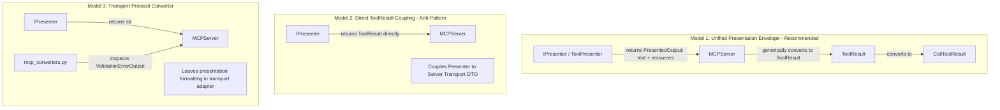

<!-- docs\development\issue414\research.md -->
<!-- template=research version=8b7bb3ab created=2026-08-19T17:40Z updated=2026-08-19T18:15Z -->
# Research: Delegate Validation Resource Schema Generation to IPresenter

**Status:** DRAFT  
**Version:** 1.1  
**Last Updated:** 2026-08-19

---

## Purpose

Investigate architectural boundaries, interface designs, presentation mechanisms, and migration strategies for delegating `schema://validation` resource generation from the transport layer (`MCPServer`) to the presentation layer (`IPresenter` / `TextPresenter`).

## Scope

**In Scope:**
- Analysis of `MCPServer.handle_call_tool` and `MCPServer.__init__` in [`mcp_server/server.py`](file:///c:/temp/pgmcp/mcp_server/server.py).
- Analysis of the [`IPresenter`](file:///c:/temp/pgmcp/mcp_server/core/interfaces/ipresenter.py) contract and [`TextPresenter`](file:///c:/temp/pgmcp/mcp_server/presenters/text_presenter.py) implementation.
- Handling of [`ValidationErrorOutput`](file:///c:/temp/pgmcp/mcp_server/schemas/error_outputs.py) and generation of `schema://validation` embedded presentation resources.
- Comparison of presentation models: string-only rendering, protocol-level mapping, and unified presentation envelopes (`PresentedOutput` / `PresentationResource`).
- Assessment of architectural nomenclature tensions (e.g. `TextPresenter` vs. multi-resource presentation).
- Mapping of the blast radius across production code, unit tests, and integration test suites.
- Definition of candidate planning seams and preservation invariants.

**Out of Scope:**
- Modifying individual MCP tool business logic or validation decorators.
- Altering the MCP wire protocol format or JSON-RPC schema contracts.
- Redesigning the response caching layer or cache key normalization.

---

## Problem Statement

In the current implementation of [`mcp_server/server.py`](file:///c:/temp/pgmcp/mcp_server/server.py#L160-L176), the transport layer (`MCPServer`) directly inspects the execution result DTO for `error_type == "ValidationError"`, extracts `result_dto.input_schema`, and appends an embedded resource dictionary (`{"type": "resource", "resource": {"uri": "schema://validation", ...}}`) to `ToolResult.content`.

This creates several architectural violations:
1. **Presentation Boundary Violation:** The transport layer performs formatting and assembly of presentation resources instead of leaving output rendering entirely to the presentation layer.
2. **Single Responsibility Principle (SRP):** `MCPServer` mixes transport orchestration (request routing, caching, response serialization) with domain-specific presentation logic.
3. **Dependency Inversion Principle (DIP):** `MCPServer.__init__` is annotated with the concrete class `TextPresenter` instead of the abstraction `IPresenter`.

---

## Research Goals

1. Analyze current responsibilities and coupling between `MCPServer`, `IPresenter`, and validation schema formatting.
2. Investigate the semantic nature of `schema://validation` as an interactive client presentation element.
3. Evaluate interface models (`PresentedOutput` envelope vs. string-only presentation vs. transport converter).
4. Identify all invariants and externally observable behaviors that must be preserved.
5. Map the full blast radius across production files, test suites, and helpers.
6. Define candidate seams for safe planning and execution.

---

## Findings & Evidence

### 1. The Interactive Presentation Nature of `schema://validation`

In MCP-compliant client environments (such as VS Code and AI agent chats), embedded resources in a `CallToolResult` are not merely hidden protocol metadata; they are active UI elements:
- An `EmbeddedResource` with `uri="schema://validation"` is rendered as a clickable, expandable schema view for the user and LLM.
- It directly informs the client of the expected schema structure alongside the formatted error text.
- Consequently, the generation of `schema://validation` is fundamentally a **Presentation concern** (how domain error data is visualised and structured for the client), rather than a pure transport routing concern.

### 2. Current Code Paths and Responsibilities

#### Transport Layer (`mcp_server/server.py`)
In `MCPServer.handle_call_tool`:
```python
# 1. Execute tool -> returns BaseModel DTO
result_dto = await tool.execute(arguments or {}, note_context)

# 2. Publish result to cache
cache_pub = self.response_cache_manager.put(tool.name, result_dto) if self.response_cache_manager else None

# 3. Format markdown output
if self.presenter is not None:
    markdown = self.presenter.present(
        tool_name=tool.name,
        data=result_dto,
        notes=note_context.entries,
        cache_pub=cache_pub,
    )
else:
    markdown = str(result_dto)

# 4. Construct normalized ToolResult and manually inject validation resource
raw_result = ToolResult.text(markdown)
success = getattr(result_dto, "success", True)
if not success:
    raw_result = raw_result.model_copy(update={"is_error": True})
    if getattr(result_dto, "error_type", None) == "ValidationError":
        raw_result.content.append(
            {
                "type": "resource",
                "resource": {
                    "uri": "schema://validation",
                    "mimeType": "application/json",
                    "text": json.dumps(
                        getattr(result_dto, "input_schema", {})
                    ),
                },
            }
        )
response_content = self._convert_tool_result_to_mcp_result(raw_result)
```

**Key Observation:** `server.py` assumes `IPresenter.present()` only returns a plain Markdown string (`str`). Because `IPresenter` currently cannot return structured embedded resources, `server.py` compensates by mutating `ToolResult.content` directly.

#### Presentation Layer (`mcp_server/core/interfaces/ipresenter.py` & `text_presenter.py`)
- `IPresenter` is defined as:
  ```python
  @runtime_checkable
  class IPresenter(Protocol):
      def present(
          self,
          tool_name: str,
          data: BaseModel,
          notes: list[Note],
          cache_pub: CachePublication | None = None,
      ) -> str: ...
  ```
- `TextPresenter.present` formats Markdown text. It already receives the full `data` DTO (`BaseModel | dict[str, Any]`), including `ValidationErrorOutput` when an error occurs.
- **Nomenclature Tension:** The class name `TextPresenter` reflects the initial design when presentation was text-only. However, `IPresenter` represents the architectural capability of presenting tool execution results (which encompasses text, notes, links, and embedded schema resources).

---

## Architectural Options & Evaluation

We evaluate the architectural models for resolving this boundary violation:



### Option Comparison Table

| Dimension | Model 1: `PresentedOutput` DTO (Recommended) | Model 2: `IPresenter -> ToolResult` | Model 3: Transport Converter |
|---|---|---|---|
| **Interface Contract** | `present(...) -> PresentedOutput` (with `text` and `resources`) | `present(...) -> ToolResult` | `present(...) -> str` |
| **Layering & Ownership** | **Pure:** Presenter owns `PresentedOutput`; `MCPServer` owns `ToolResult`. | **Violation:** Leaks server transport DTO (`ToolResult`) into core interfaces. | **Compromise:** Treats schema resources as transport rather than presentation. |
| **SRP & Presentation Boundary** | **Clean:** Presenter formats all human- and machine-visible presentation elements. | **Clean:** Single presentation call. | **Leaky:** Presentation logic split across presenter and converter. |
| **Transport Simplicity** | `server.py` is a dumb pipe with zero DTO/error-type knowledge. | `server.py` is a dumb pipe. | `server.py` or converter must inspect `ValidationErrorOutput`. |
| **Type Safety & DIP** | 100% strict Pydantic DTOs with frozen configuration. | 100% typed. | 100% typed. |

### Rationale for Model 1 (`PresentedOutput`)

1. **Clean Layering:** The Presenter should not know about `ToolResult` (a server transport envelope). Instead, the Presenter returns a pure, frozen presentation model:
   ```python
   class PresentationResource(BaseModel):
       model_config = ConfigDict(frozen=True)
       uri: str
       mime_type: str = "application/json"
       content: str

   class PresentedOutput(BaseModel):
       model_config = ConfigDict(frozen=True)
       text: str
       resources: list[PresentationResource] = Field(default_factory=list)
   ```
2. **Generic Transport Mapping:** `MCPServer` simply converts `presented.text` to `TextContent` and any `presented.resources` to `EmbeddedResource`, without knowing what specific resources are inside or why they were created.
3. **Evolution of `TextPresenter`:** While `TextPresenter` retains its historic name, it satisfies `IPresenter` by coordinating both Markdown text formatting and associated presentation resources.

---

## Invariants & Preservation Goals

1. **MCP Wire Format Invariant:**
   For any tool call failing input validation:
   - `CallToolResult.isError` must be `True`.
   - `CallToolResult.content` must contain:
     1. `TextContent`: Formatted error message and notes.
     2. `EmbeddedResource`: Resource with `uri="schema://validation"`, `mimeType="application/json"`, and `text` containing the valid JSON schema.
2. **Type Safety & Strict Checking:**
   - Full compliance with `pyright` and `mypy` without global ignores.
   - `MCPServer.__init__` must accept `IPresenter | None` rather than `TextPresenter | None`.
3. **Resilience & Fallbacks:**
   - If `presenter is None` or formatting encounters an edge case, `MCPServer` falls back gracefully without unhandled crashes.

---

## Blast Radius Analysis

### Production Files
- [`mcp_server/schemas/presentation_output.py`](file:///c:/temp/pgmcp/mcp_server/schemas/presentation_output.py) *(NEW)*: Define `PresentationResource` and `PresentedOutput`.
- [`mcp_server/core/interfaces/ipresenter.py`](file:///c:/temp/pgmcp/mcp_server/core/interfaces/ipresenter.py): Update `present()` signature to return `PresentedOutput`.
- [`mcp_server/presenters/text_presenter.py`](file:///c:/temp/pgmcp/mcp_server/presenters/text_presenter.py): Update `present()` to construct `PresentedOutput`, attaching `schema://validation` resource on `ValidationErrorOutput`.
- [`mcp_server/server.py`](file:///c:/temp/pgmcp/mcp_server/server.py):
  - Change `presenter: TextPresenter | None` parameter to `presenter: IPresenter | None`.
  - Remove inline `schema://validation` resource appending.
  - Map `PresentedOutput.resources` to `ToolResult.content`.
- [`mcp_server/bootstrap.py`](file:///c:/temp/pgmcp/mcp_server/bootstrap.py): Verify presenter wiring.

### Test Files
- [`tests/mcp_server/unit/test_presenter.py`](file:///c:/temp/pgmcp/tests/mcp_server/unit/test_presenter.py): Update tests to assert on `result.text` and `result.resources`.
- [`tests/mcp_server/unit/server/test_validate_tool_arguments.py`](file:///c:/temp/pgmcp/tests/mcp_server/unit/server/test_validate_tool_arguments.py): Validate server argument validation tests continue to receive `schema://validation`.
- [`tests/mcp_server/integration/test_strict_input_validation_response.py`](file:///c:/temp/pgmcp/tests/mcp_server/integration/test_strict_input_validation_response.py): Verify end-to-end MCP response structure.
- [`tests/mcp_server/unit/test_server.py`](file:///c:/temp/pgmcp/tests/mcp_server/unit/test_server.py): Update mocked presenter fixtures to return `PresentedOutput`.

---

## Candidate Seams for Planning

1. **Seam 1: Presentation Schema & Contract (`PresentedOutput` & `IPresenter`)**
   - Introduce `PresentedOutput` and `PresentationResource` DTOs.
   - Update `IPresenter` protocol.
   - Update `TextPresenter.present` to return `PresentedOutput` (with `schema://validation` generation).
   - Update `test_presenter.py`.

2. **Seam 2: Transport Layer Integration (`MCPServer`)**
   - Decouple `MCPServer` type annotations to `IPresenter | None`.
   - Update `MCPServer.handle_call_tool` to map `PresentedOutput` into `ToolResult`.
   - Remove inline error checking and manual resource construction from `server.py`.
   - Update server unit tests.

3. **Seam 3: End-to-End Verification & Quality Gates**
   - Verify integration test suites.
   - Run quality gates (`run_quality_gates`).

---

## Approved Strategy

**Selected Strategy:** Preserve Compatibility

**Boundary & Preservation Scope:**
- Preserves 100% backward compatibility for all external MCP clients and JSON-RPC consumers.
- Preserves the exact structure, mime-type (`application/json`), and URI (`schema://validation`) of the validation error resource block.
- Introduces `PresentedOutput` as a clean presentation-layer boundary, eliminating transport leakage and respecting ownership boundaries.

**Constraints for Later Phases:**
- Design must specify the exact Pydantic schema for `PresentedOutput` and `PresentationResource`.
- Implementation must follow strict TDD (Red -> Green -> Refactor) across each planning seam.

---

## Expected Results

1. `mcp_server/server.py` contains zero references to `schema://validation` or inline resource dictionary generation.
2. `MCPServer` depends strictly on `IPresenter` abstraction.
3. `TextPresenter` generates the `schema://validation` resource block whenever a `ValidationErrorOutput` with `input_schema` is presented.
4. All existing presenter tests, server tests, and validation integration tests pass with 100% type safety and zero linter warnings.

---

## Related Documentation
- **[docs/coding_standards/ARCHITECTURE_PRINCIPLES.md][related-1]**
- **[docs/coding_standards/DOCUMENTATION_STANDARD.md][related-2]**
- **[docs/development/archive/issue406/design_gaps.md][related-3]**
- **[docs/development/archive/issue411/research.md][related-4]**

<!-- Link definitions -->

[related-1]: docs/coding_standards/ARCHITECTURE_PRINCIPLES.md
[related-2]: docs/coding_standards/DOCUMENTATION_STANDARD.md
[related-3]: docs/development/archive/issue406/design_gaps.md
[related-4]: docs/development/archive/issue411/research.md

---

## Version History

| Version | Date | Author | Changes |
|---------|------|--------|---------|
| 1.0 | 2026-08-19 | Agent | Initial research document analyzing presentation delegation and interface design |
| 1.1 | 2026-08-19 | Agent | Refined presentation architecture with PresentedOutput DTO, resolving nomenclature and layering boundaries |
