# Issue #42: Technical Design - 8-Phase Model Architecture

**Issue:** #42 - Phase workflow contradicts TDD principles  
**Date:** 2025-12-25  
**Phase:** Design  
**Status:** IN PROGRESS

## Design Philosophy

### Core Principles

1. **Config Over Code** - Phase definitions live in declarative config, not hardcoded logic
2. **Single Responsibility** - Each component has ONE job (PHASE_TEMPLATES = data, PhaseStateEngine = transitions, ProjectManager = initialization)
3. **Fail Fast** - Invalid states should be impossible to create, not caught later
4. **Explicit Over Implicit** - Phase transitions are explicit user actions, never automatic
5. **No Backwards Compatibility** - Clean break, no legacy support (simplifies design)

### Architectural Constraints

| Constraint | Enforcement Strategy |
|------------|---------------------|
| **No code in config** | JSON/dict only, no lambdas or callables |
| **Immutable phase lists** | Use tuples, not lists |
| **Type safety** | Pydantic models for validation |
| **Single source of truth** | PHASE_TEMPLATES is authoritative |
| **Separation of concerns** | ProjectManager ≠ PhaseStateEngine ≠ ValidationEngine |

---

## Architecture Overview

### Component Responsibilities (SRP)

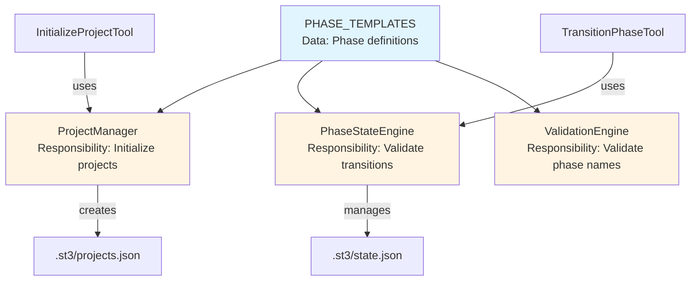

**Key:** 
- Blue = Data (config)
- Orange = Logic (components with single responsibility)

### Separation of Concerns

| Component | Single Responsibility | Does NOT Do |
|-----------|----------------------|-------------|
| **PHASE_TEMPLATES** | Define phase sequences per issue type | ❌ Validate transitions |
| **ProjectManager** | Initialize project metadata | ❌ Track current phase |
| **PhaseStateEngine** | Validate and execute transitions | ❌ Initialize projects |
| **InitializeProjectTool** | Coordinate project setup | ❌ Define phases |
| **TransitionPhaseTool** | Coordinate phase changes | ❌ Validate transitions (delegates to engine) |

---

## Phase Model Design

### 8-Phase Lifecycle (State Machine)

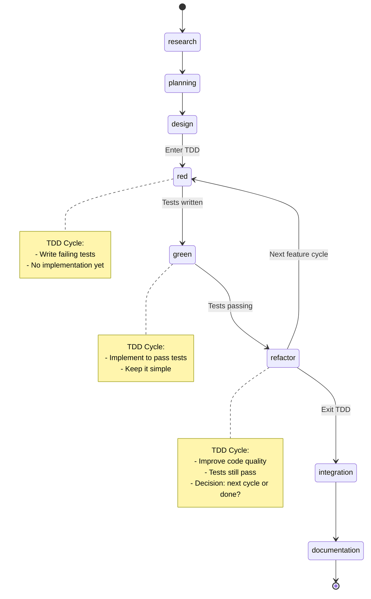

**Key Decision Point:** At `refactor` phase, choose:
- `refactor → red`: Add more features (next TDD cycle)
- `refactor → integration`: Feature complete (exit TDD)

### Issue Type Templates (Config-Driven)

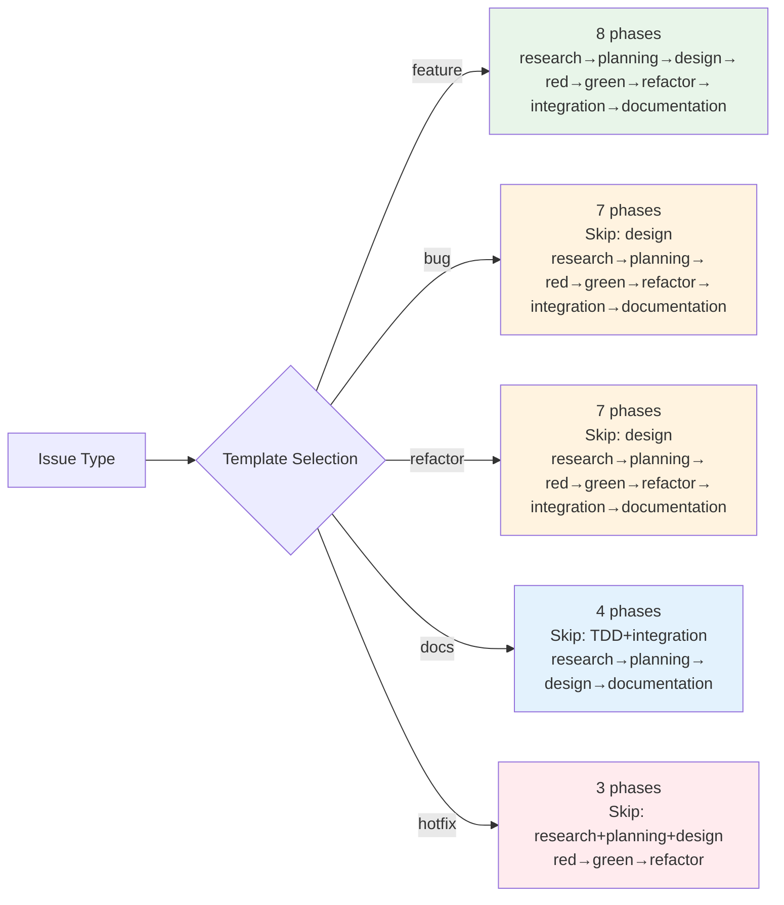

**Rationale:**
- **Feature**: Full lifecycle (new capabilities require design)
- **Bug/Refactor**: Skip design (system unchanged)
- **Docs**: Skip TDD (no code changes)
- **Hotfix**: Emergency only (minimal process)

---

## Data Structure Design

### PHASE_TEMPLATES Structure (Config)

**Location:** `mcp_server/managers/project_manager.py`

**Design Constraints:**
- ✅ Pure data (no functions, no logic)
- ✅ Immutable phase lists (tuples)
- ✅ Self-documenting (description + rationale fields)
- ✅ Single source of truth for all phase definitions

**Schema:**
```
PHASE_TEMPLATES: dict[str, PhaseTemplate]
  └─ <issue_type>: PhaseTemplate
       ├─ required_phases: tuple[str, ...]  # Immutable
       ├─ description: str                   # Human-readable
       └─ rationale: str                     # Why this sequence?
```

**Validation Rules:**
1. Phase names must be in: `{research, planning, design, red, green, refactor, integration, documentation}`
2. First phase must be `research` (except hotfix → `red`)
3. If TDD phases present, must be in order: `red → green → refactor`
4. Last phase must be `documentation` (except hotfix → `refactor`)

---

## Transition State Machine Design

### Valid Transitions (Declarative)

**Location:** `mcp_server/core/phase_state_engine.py`

**Design Constraint:** Transition rules as **data**, not code logic

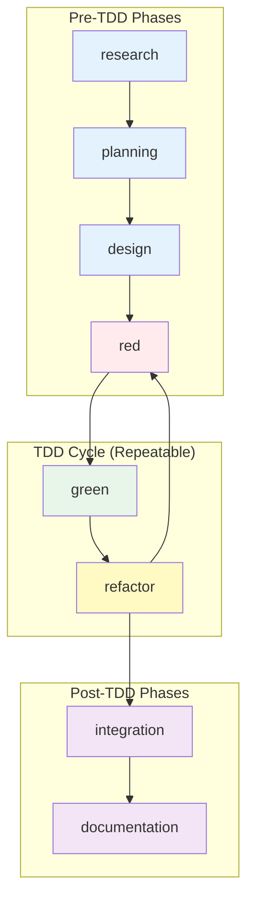

**Transition Table (Declarative Config):**

| From Phase | Valid Next Phase(s) | Rationale |
|------------|---------------------|-----------|
| research | planning | Sequential pre-TDD |
| planning | design | Sequential pre-TDD |
| design | red | Enter TDD cycle |
| red | green | Tests written, implement |
| green | refactor | Tests pass, improve quality |
| refactor | red, integration | Next cycle OR exit TDD |
| integration | documentation | Sequential post-TDD |
| documentation | (terminal) | Workflow complete |

**SRP Enforcement:** PhaseStateEngine validates transitions ONLY. Does not define phases (PHASE_TEMPLATES) or initialize projects (ProjectManager).

---

## Component Architecture

### ProjectManager Responsibility

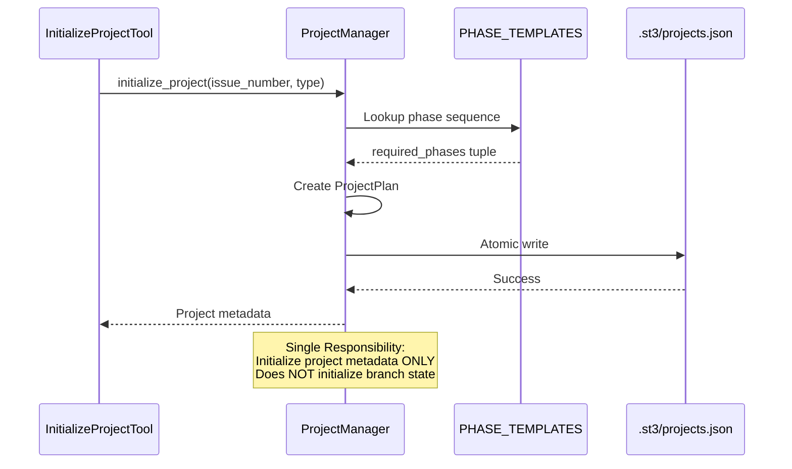

**What it does:**
- ✅ Reads PHASE_TEMPLATES
- ✅ Creates `.st3/projects.json` entry
- ✅ Returns phase list to caller

**What it does NOT do:**
- ❌ Track current phase (PhaseStateEngine's job)
- ❌ Validate transitions (PhaseStateEngine's job)
- ❌ Initialize branch state (Issue #39 - missing integration)

### PhaseStateEngine Responsibility

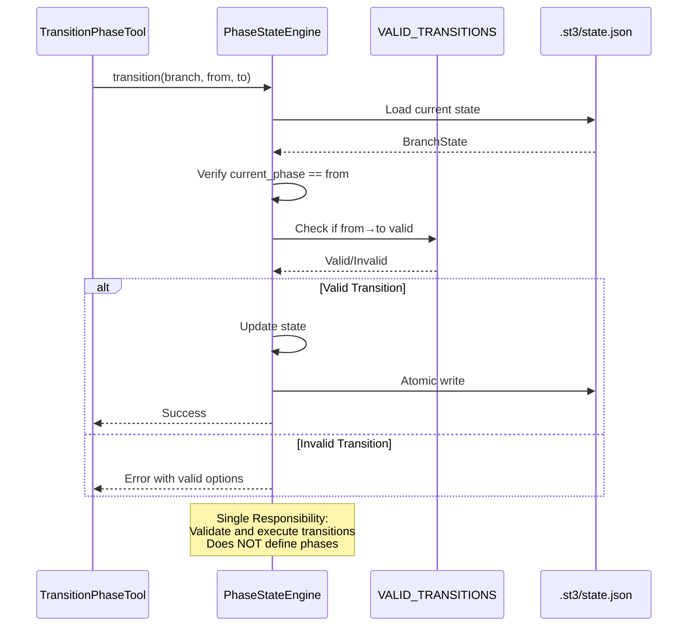

**What it does:**
- ✅ Validates transitions against state machine
- ✅ Updates `.st3/state.json`
- ✅ Tracks transition history

**What it does NOT do:**
- ❌ Define phases (PHASE_TEMPLATES' job)
- ❌ Initialize projects (ProjectManager's job)
- ❌ Enforce commit rules (Issue #18 - future)

---

## Enforcement Strategy

### 1. Type Safety Enforcement

**Pydantic Models:**
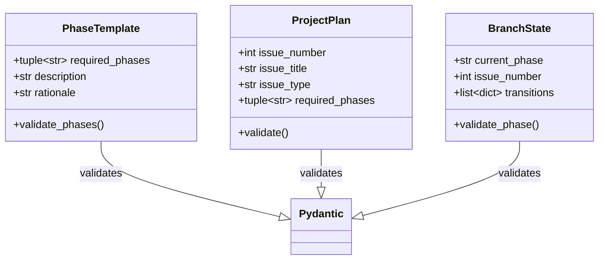

**Enforcement:**
- ❌ Cannot create ProjectPlan with invalid phase names
- ❌ Cannot create BranchState with unknown phase
- ❌ Type errors caught at model instantiation, not runtime

### 2. Immutability Enforcement

**Design Decision:** Phase lists are **tuples**, not lists

**Why:**
- ✅ Cannot be modified after creation
- ✅ Hashable (can be dict keys)
- ✅ Signals intent: "this is fixed"

**Enforcement:**
```python
# ✅ Allowed
required_phases = ("research", "planning", "design")

# ❌ Compiler error
required_phases[0] = "discovery"  # TypeError: tuple doesn't support assignment
```

### 3. State Machine Enforcement

**Impossible States Design:**

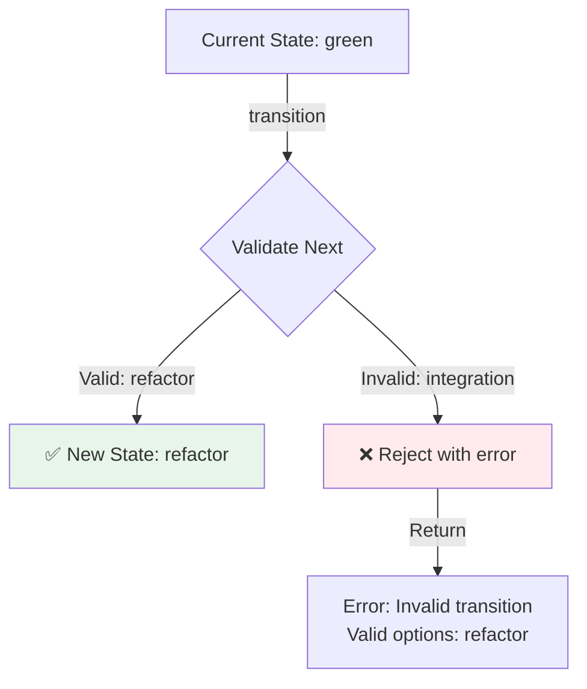

**Cannot Create:**
- ❌ Branch state with invalid phase name
- ❌ Transition from green → integration (must go through refactor)
- ❌ Project with phase list not in PHASE_TEMPLATES

### 4. Config Validation Enforcement

**Startup Validation:**

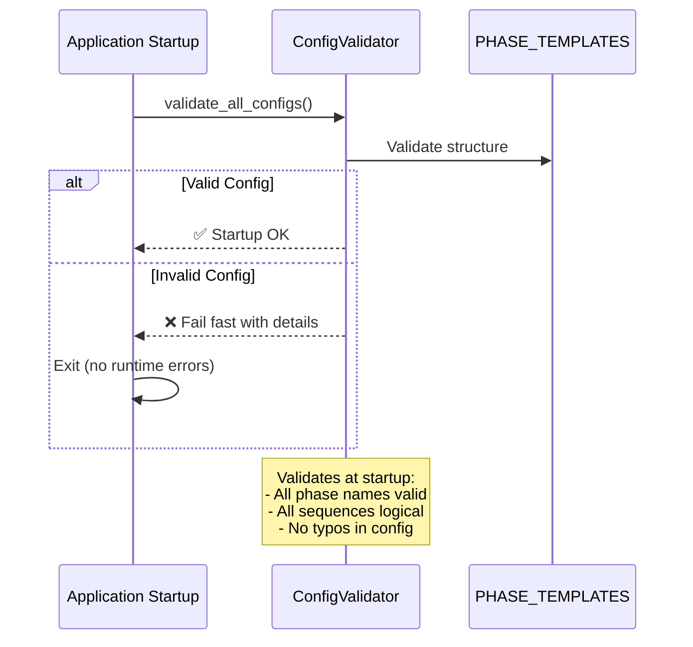

**Enforcement:**
- ✅ Validate PHASE_TEMPLATES at module import
- ✅ Application won't start with invalid config
- ✅ No runtime surprises

---

## Testing Strategy Design

### Test Architecture

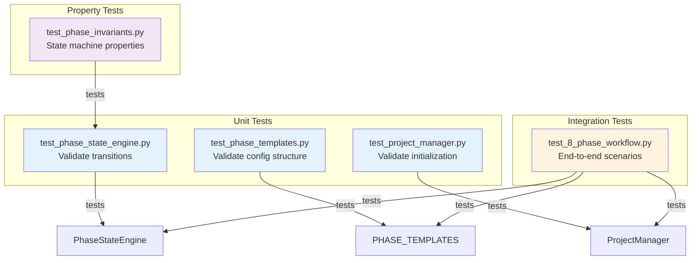

### Test Coverage Requirements

| Component | Coverage Target | Rationale |
|-----------|-----------------|-----------|
| PHASE_TEMPLATES | 100% | Pure data, must be correct |
| PhaseStateEngine | ≥95% | Critical path (transitions) |
| ProjectManager | ≥90% | Important but simpler logic |
| Tools (Init/Transition) | ≥85% | Integration layer |

### Property-Based Testing

**Invariants to Test:**

1. **Reflexivity:** Cannot transition from phase to itself
2. **Acyclicity (except TDD):** No cycles except refactor→red
3. **Reachability:** All phases reachable from start
4. **Termination:** All paths lead to terminal state

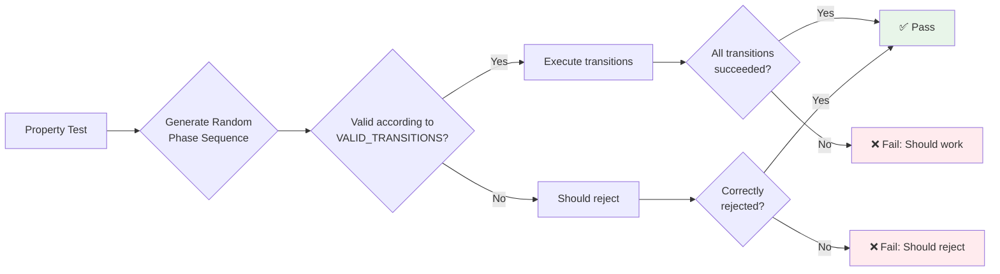

---

## Design Decisions

### Decision 1: Config Over Code

**Rationale:** Phase definitions change more often than transition logic

**Enforcement:**
- PHASE_TEMPLATES is pure data (no functions)
- VALID_TRANSITIONS is dict (declarative)
- Adding new issue type = add dict entry (no code changes)

**Alternative Rejected:** Hardcoded if/else logic for each issue type

### Decision 2: No Backwards Compatibility

**Rationale:** Clean design > migration complexity

**Impact:**
- ✅ Simpler code (no migration logic)
- ✅ Clear semantics (no "component" confusion)
- ✅ Easier to test (one code path)

**Mitigation:** No existing enforced projects (confirmed in research)

### Decision 3: Tuples for Phase Lists

**Rationale:** Immutability prevents bugs

**Enforcement:**
- Tuples cannot be modified
- Type hints enforce tuple usage
- Pydantic validates tuple structure

**Alternative Rejected:** Lists (mutable, error-prone)

### Decision 4: Separate ProjectManager and PhaseStateEngine

**Rationale:** Single Responsibility Principle

**Enforcement:**
- ProjectManager: `.st3/projects.json` ONLY
- PhaseStateEngine: `.st3/state.json` ONLY
- No cross-contamination of responsibilities

**Alternative Rejected:** Single "ProjectEngine" doing both (violates SRP)

---

## SRP Compliance Matrix

| Component | Responsibility | State File | Can Call | Cannot Call |
|-----------|----------------|------------|----------|-------------|
| **PHASE_TEMPLATES** | Define phases | None (data) | Nothing | Everything |
| **ProjectManager** | Initialize projects | projects.json | PHASE_TEMPLATES | PhaseStateEngine |
| **PhaseStateEngine** | Validate transitions | state.json | VALID_TRANSITIONS | ProjectManager |
| **InitializeProjectTool** | Coordinate setup | None | ProjectManager | PhaseStateEngine directly |
| **TransitionPhaseTool** | Coordinate transitions | None | PhaseStateEngine | ProjectManager |

**Violations Prevented:**
- ❌ ProjectManager calling PhaseStateEngine (coupling)
- ❌ PhaseStateEngine reading projects.json (wrong concern)
- ❌ Tools implementing validation logic (should delegate)

---

## Error Handling Design

### Fail Fast Strategy

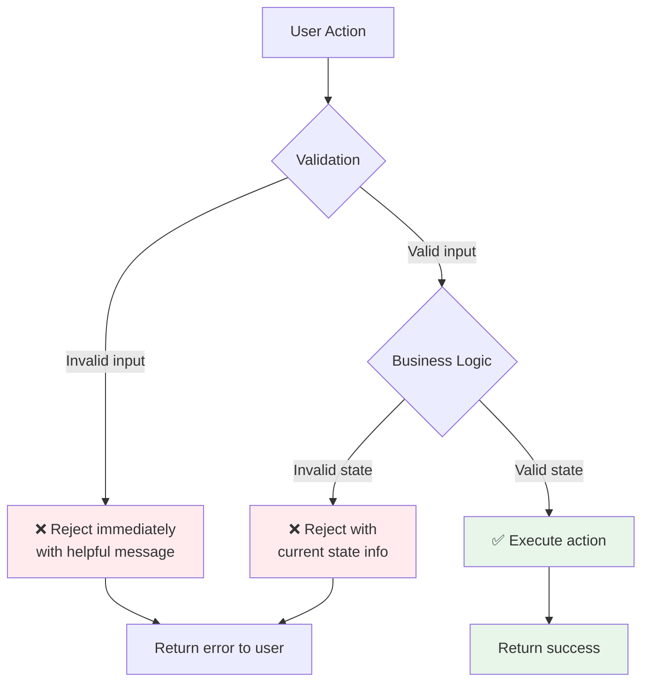

**Error Message Requirements:**
1. **What failed:** Clear description
2. **Why it failed:** Explain the rule violated
3. **How to fix:** Suggest valid actions
4. **Current state:** Show relevant context

**Example:**
```
❌ Invalid transition: green → integration

Why: Must complete refactor phase before integration
Current state: Branch 'feature/42-test' is in 'green' phase
Valid next phases: refactor

Hint: Run `transition_phase --to refactor` first
```

---

## Success Criteria

### Architectural Quality
- [ ] Each component has single, clear responsibility
- [ ] No component does two jobs
- [ ] PHASE_TEMPLATES is pure data (no code)
- [ ] State machine is declarative (dict, not if/else)
- [ ] Type safety enforced via Pydantic

### Enforcement Quality
- [ ] Invalid phases impossible to create
- [ ] Invalid transitions rejected at validation
- [ ] Config validated at startup (fail fast)
- [ ] Immutability enforced via tuples
- [ ] No backwards compatibility code

### Testability
- [ ] Unit tests cover all components
- [ ] Integration tests cover workflows
- [ ] Property tests cover invariants
- [ ] Test coverage ≥90% overall

---

## Next Phase: Red (TDD)

**Handover:**
- ✅ Architecture designed (SRP enforced)
- ✅ State machine specified (declarative)
- ✅ Data structures defined (config over code)
- ✅ Enforcement strategy planned
- ✅ No backwards compatibility

**Ready for:** Write failing tests that enforce these architectural constraints

**Status:** Design phase COMPLETE. Ready for Red (test-first) phase.
