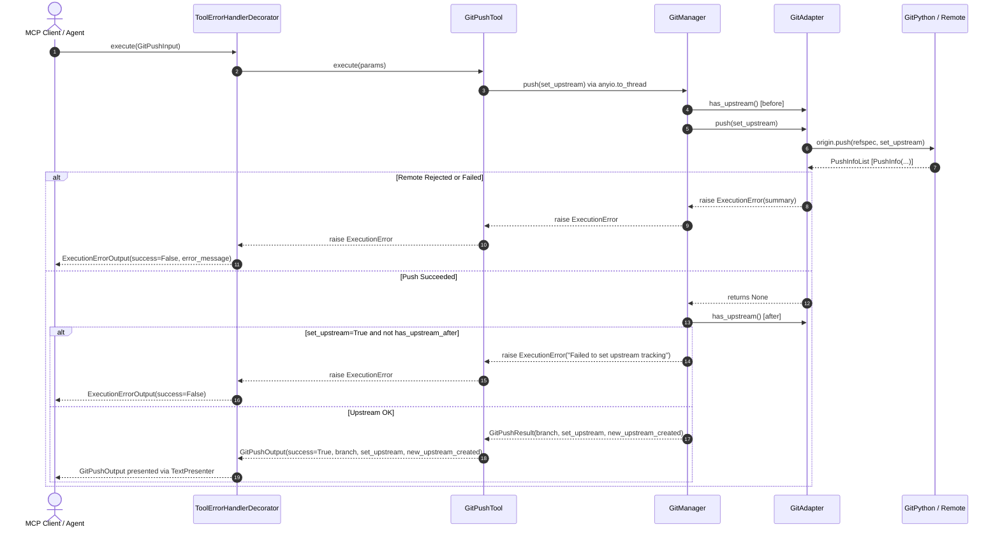

<!-- docs\development\issue442\design.md -->
<!-- template=design version=5827e841 created=2026-08-19T12:01Z updated=2026-08-19T14:05Z -->
# Design: Fix git_push false-success reporting and upstream result detection

**Status:** APPROVED  
**Version:** 1.0.0  
**Last Updated:** 2026-08-19

---

## Purpose

Define the technical architecture, interface contracts, error handling flow, and test verification strategy for fixing `git_push` false-success reporting and upstream tracking result detection.

## Scope

### In Scope
- `GitAdapter.push()` result evaluation of GitPython `PushInfoList` and rejection flag interpretation.
- `GitManager.push()` upstream tracking coordination and frozen domain result contract (`GitPushResult`).
- `GitPushTool` execution refactoring (async thread offload, domain mapping, decorator pipeline integration).
- Response presentation configuration in `presentation.yaml`.
- Comprehensive unit and integration test coverage across all rejection and upstream state combinations.

### Out of Scope
- Automatic network retries, transport reconfigurations, or credential helper adjustments.
- Alterations to `submit_pr` preflight checks.
- Overhaul of unrelated tool presentation templates or response formatting.

## Prerequisites

Read these first:
1. [Issue #442 Research Document](research.md)
2. [Architecture Principles](../../coding_standards/ARCHITECTURE_PRINCIPLES.md) (SOLID, CQS, Law of Demeter, Presentation Boundary)
3. [Documentation Standard](../../coding_standards/DOCUMENTATION_STANDARD.md)

---

## 1. Context & Requirements

### 1.1. Problem Statement

`git_push` can report `success=true` when GitPython encounters a remote rejection or error without raising an exception. `GitAdapter.push()` discards the returned `PushInfoList`, so remote failure diagnostics are lost. `GitPushTool` reports unconditional success and hardcodes `new_upstream_created=False`, leaving callers believing a push succeeded when no remote branch or upstream tracking exists.

### 1.2. Requirements

**Functional:**
- **FR.1 (PushInfo Validation)**: `GitAdapter.push()` must evaluate the returned `PushInfoList`. If the list is empty or any item contains failure flags (`ERROR`, `REJECTED`, `REMOTE_REJECTED`, `REMOTE_FAILURE`), it must raise an `ExecutionError` containing the remote diagnostic `summary`.
- **FR.2 (Success Flag Recognition)**: `GitAdapter.push()` must recognize `NEW_HEAD (1)`, `FAST_FORWARD (64)`, `FORCED_UPDATE (128)`, and `UP_TO_DATE (4)` as valid push successes without raising an exception.
- **FR.3 (Upstream Postcondition)**: When `set_upstream=True` is requested, `GitManager.push()` must verify that upstream tracking is established after the push; if tracking is missing, it must raise an `ExecutionError`.
- **FR.4 (Dynamic Tracking Delta)**: `GitManager.push()` must accurately calculate `new_upstream_created = (not has_upstream_before and has_upstream_after)` and return a frozen `GitPushResult` dataclass.
- **FR.5 (Async Execution & DTO Mapping)**: `GitPushTool` must execute the push operation asynchronously via `anyio.to_thread.run_sync` and return the backward-compatible `GitPushOutput` DTO.

**Non-Functional:**
- **NFR.1 (Architecture Adherence)**: Strictly comply with SOLID, CQS, Law of Demeter, and Presentation Boundary rules from `ARCHITECTURE_PRINCIPLES.md`.
- **NFR.2 (Schema Stability)**: Maintain exact backward compatibility for the public `GitPushOutput` model.
- **NFR.3 (Test Rigor)**: Provide 100% test branch coverage for remote rejections, empty result lists, successful new upstream creation, existing up-to-date tracking, and pushes without `set_upstream`.

### 1.3. Constraints

- **Approved Strategy**: Clean Break internally for Adapter/Manager/Tool boundaries; Preserve Compatibility for public `GitPushOutput` schema.
- **Immutable Domain Objects**: All domain models between Manager and Tool must be `@dataclass(frozen=True)`.
- **Layer Isolation**: GitPython-specific classes and bitmasks must never escape `GitAdapter`.

---

## 2. Design Options

### 2.1. Options Comparison

| Dimension | Option A: Status Quo (Discard PushInfo) | Option B: Layered Contract Fix with PushInfo Validation (Chosen) |
|---|---|---|
| **Push Validation** | Discards `PushInfoList`; swallows rejections | Evaluates `PushInfoList` flags; raises `ExecutionError` on failure |
| **Upstream Detection** | Hardcodes `new_upstream_created=False` | Dynamically detects delta (`has_upstream` before vs after) |
| **Manager Contract** | Returns `None` | Returns frozen `GitPushResult` domain dataclass |
| **Async Offloading** | Synchronous execution on event loop | Asynchronous thread offload (`anyio.to_thread.run_sync`) |
| **Architecture Contract** | Violates CQS, Law of Demeter, and Fail-Fast | 100% compliant with `ARCHITECTURE_PRINCIPLES.md` |
| **Pros** | No changes required | Accurate reporting, rich remote diagnostics, reliable upstream verification |
| **Cons** | Callers misled; downstream tools break | Requires updating test fixtures where `origin.push()` was mocked to return `None` |

### 2.2. Chosen Direction & Rationale

**Decision:** Option B — Layered Contract Fix with PushInfo Validation.

**Rationale:** Distributing responsibilities across Adapter, Manager, and Tool layers adheres to the Single Responsibility Principle, Command/Query Separation, and Dependency Inversion Principle. GitPython details stay inside the adapter, the manager coordinates domain logic and tracking state, and the tool delegates error handling to the Russian Doll Decorator Pipeline.

---

## 3. Architecture & Interface Specifications

### 3.1. Layered Interaction Flow



### 3.2. Concrete Interface Contracts

#### 3.2.1. Domain Contract (`mcp_server/managers/git_manager.py`)

```python
from dataclasses import dataclass

@dataclass(frozen=True)
class GitPushResult:
    """Domain result of a git push operation."""

    branch: str
    set_upstream: bool
    new_upstream_created: bool
```

#### 3.2.2. Adapter Method Signature (`mcp_server/adapters/git_adapter.py`)

```python
class GitAdapter:
    """Low-level Git operations adapter."""

    def push(self, set_upstream: bool = False) -> None:
        """Push current branch to origin remote.

        Raises:
            ExecutionError: If origin remote is missing, push is rejected by remote,
                            Git returns error flags, or push result list is empty.
        """
        ...
```

#### 3.2.3. Manager Method Signature (`mcp_server/managers/git_manager.py`)

```python
class GitManager:
    """Manager for Git operations and conventions."""

    def push(self, set_upstream: bool = False) -> GitPushResult:
        """Push current branch to origin remote and verify upstream tracking.

        Returns:
            GitPushResult containing branch name, set_upstream flag, and
            whether a new upstream tracking relationship was established.

        Raises:
            ExecutionError: If push fails or requested upstream tracking is not established.
        """
        ...
```

#### 3.2.4. Public MCP Tool & Output DTO (`mcp_server/schemas/tool_outputs.py`)

```python
class GitPushOutput(BaseToolOutput):
    """Output for GitPushTool (Public MCP Contract)."""

    branch: str
    set_upstream: bool
    new_upstream_created: bool = False
```

---

## 4. Error Handling & Presentation Specifications

### 4.1. Error Classification Matrix

| Error Scenario | Root Cause | Raised By | DTO Output | Presenter Rendering |
|---|---|---|---|---|
| **Non-Fast-Forward Rejection** | Remote ref moved ahead (`PushInfo.REJECTED`) | `GitAdapter` | `ExecutionErrorOutput(success=False)` | `❌ Failed: Push rejected by remote: [rejected] (non-fast-forward)` |
| **Remote Hook Rejection** | Pre-receive hook blocked push (`REMOTE_REJECTED`) | `GitAdapter` | `ExecutionErrorOutput(success=False)` | `❌ Failed: Push rejected by remote: [remote rejected] (pre-receive hook declined)` |
| **Empty Result List** | Transport/network returned empty `PushInfoList` | `GitAdapter` | `ExecutionErrorOutput(success=False)` | `❌ Failed: Push failed: No push status returned by remote` |
| **Missing Origin Remote** | No remote named 'origin' configured | `GitAdapter` | `ExecutionErrorOutput(success=False)` | `❌ Failed: No origin remote configured` |
| **Tracking Failed** | `set_upstream=True` requested but no upstream exists after push | `GitManager` | `ExecutionErrorOutput(success=False)` | `❌ Failed: Requested upstream tracking branch could not be established on 'origin/<branch>'` |
| **Successful Push** | Push accepted by remote (`NEW_HEAD`, `FF`, `UP_TO_DATE`) | `GitPushTool` | `GitPushOutput(success=True)` | `✅ Pushed branch '<branch>' to origin (Upstream branch created: <bool>).` |

### 4.2. Presentation Configuration (`mcp_server/assets/config/presentation.yaml`)

The existing declarative template for `git_push` in `presentation.yaml` will dynamically format the calculated `new_upstream_created` field:

```yaml
  git_push:
    category: mutation
    template_success: "Pushed branch '{branch}' to origin (Upstream branch created: {new_upstream_created})."
```

Failures will automatically fall back to the global failure template:
```yaml
  default_failure_template: "Failed: {error_message}"
```

---

## 5. Test & Verification Strategy

### 5.1. Unit Test Matrix

| Test File | Test Case | Target Boundary | Assertion / Verification |
|---|---|---|---|
| `test_git_adapter.py` | `test_push_rejected_by_remote_raises_error` | `GitAdapter.push` | Asserts `ExecutionError` is raised with remote summary when `PushInfo.REJECTED` or `PushInfo.ERROR` is set. |
| `test_git_adapter.py` | `test_push_empty_result_list_raises_error` | `GitAdapter.push` | Asserts `ExecutionError` is raised when `origin.push()` returns an empty list. |
| `test_git_adapter.py` | `test_push_success_flags_pass_without_error` | `GitAdapter.push` | Asserts no exception is raised when `PushInfo.UP_TO_DATE`, `NEW_HEAD`, or `FAST_FORWARD` is returned. |
| `test_git_manager.py` | `test_push_new_upstream_created_true` | `GitManager.push` | Asserts `new_upstream_created=True` when `has_upstream` was `False` before and `True` after. |
| `test_git_manager.py` | `test_push_new_upstream_created_false_when_preexisting` | `GitManager.push` | Asserts `new_upstream_created=False` when `has_upstream` was already `True` before. |
| `test_git_manager.py` | `test_push_set_upstream_missing_raises_error` | `GitManager.push` | Asserts `ExecutionError` when `set_upstream=True` but `has_upstream` is `False` after push. |
| `test_git_tools.py` | `test_git_push_tool_success_maps_result` | `GitPushTool.execute` | Asserts `GitPushOutput` accurately reflects `GitPushResult` fields. |
| `test_git_tools.py` | `test_git_push_tool_propagates_execution_error` | `GitPushTool.execute` | Asserts `ExecutionError` bubbles up to decorator pipeline. |

### 5.2. Integration Verification

- Verify `test_submit_pr_atomic_flow.py` handles push failure recovery notes correctly.
- Run complete quality gates: `ruff`, `mypy` (strict), `pylint` (10.00/10.00).

---

## Related Documentation

- [Issue #442 Research Document](research.md)
- [Architecture Principles](../../coding_standards/ARCHITECTURE_PRINCIPLES.md)
- [Documentation Standard](../../coding_standards/DOCUMENTATION_STANDARD.md)
- [Quality Gates](../../coding_standards/QUALITY_GATES.md)

---

## Version History

| Version | Date | Author | Changes |
|---|---|---|---|
| 1.0.0 | 2026-08-19 | @imp designer | Initial approved technical design for Issue #442. |
