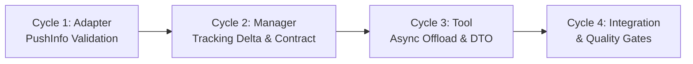

<!-- docs\development\issue442\planning.md -->
<!-- template=planning version=a44a6f23 created=2026-08-19T12:32Z updated=2026-08-19T14:34Z -->
# Planning: Fix git_push false-success reporting and upstream result detection

**Status:** APPROVED  
**Version:** 1.0.0  
**Last Updated:** 2026-08-19

---

## Purpose

Define the sequential TDD cycle breakdown, deliverables, exit criteria, and validation obligations for implementing the approved technical design of Issue #442.

## Scope

### In Scope
- Cycle 1: `GitAdapter.push()` result evaluation of GitPython `PushInfoList` and rejection flag interpretation.
- Cycle 2: `GitManager.push()` upstream tracking coordination and frozen domain result contract (`GitPushResult`).
- Cycle 3: `GitPushTool` execution refactoring (async thread offload, domain mapping, decorator pipeline integration).
- Cycle 4: End-to-end integration testing and quality gates compliance.

### Out of Scope
- Automatic network retries, transport reconfigurations, or credential helper adjustments.
- Alterations to `submit_pr` preflight checks.
- Overhaul of unrelated tool presentation templates or response formatting.

## Prerequisites

Read these first:
1. [Issue #442 Design Document](design.md)
2. [Issue #442 Research Document](research.md)
3. [Architecture Principles](../../coding_standards/ARCHITECTURE_PRINCIPLES.md) (SOLID, CQS, §14 Public API Testing, Presentation Boundary)
4. [Type Checking Playbook](../../coding_standards/TYPE_CHECKING_PLAYBOOK.md)
5. [Quality Gates](../../coding_standards/QUALITY_GATES.md)

---

## 1. Plan Summary

Implement a 4-cycle sequential TDD plan (RED ➔ GREEN ➔ REFACTOR) to eliminate false-success reporting in `git_push`, ensure accurate upstream tracking detection, enforce strict domain contracts, and guarantee that all tests validate real observable behavior through public interfaces.

---

## 2. TDD Cycle Breakdown

### Cycle 1: `GitAdapter` PushInfo Validation

**Goal:** Evaluate GitPython's `PushInfoList` in `GitAdapter.push()`. Raise `ExecutionError` with remote diagnostics on any rejection or failure flag, or empty result list. Pass cleanly on valid push successes (`NEW_HEAD`, `FAST_FORWARD`, `FORCED_UPDATE`, `UP_TO_DATE`).

- **Deliverables:**
  - `D1.1`: Unit tests in `tests/mcp_server/unit/adapters/test_git_adapter.py` validating observable push outcomes (remote rejection, empty result list, hook refusal, up-to-date, new head) via public `adapter.push()` API (§14).
  - `D1.2`: `GitAdapter.push()` implementation validating `PushInfoList` flags and raising `ExecutionError` on failure.
- **Exit Criteria:** `GitAdapter.push()` raises `ExecutionError` with remote summary when `PushInfo.ERROR`, `REJECTED`, `REMOTE_REJECTED`, `REMOTE_FAILURE` is set or list is empty; returns `None` on valid successes (`NEW_HEAD`, `FAST_FORWARD`, `FORCED_UPDATE`, `UP_TO_DATE`); all adapter tests pass.

### Cycle 2: `GitManager` Tracking Delta & Domain Contract

**Goal:** Coordinate pre- and post-push upstream state in `GitManager.push()`. Return an immutable `@dataclass(frozen=True) GitPushResult`. Raise `ExecutionError` if `set_upstream=True` was requested but tracking was not established.

- **Deliverables:**
  - `D2.1`: Unit tests in `tests/mcp_server/unit/managers/test_git_manager.py` testing upstream state delta calculation (`new_upstream_created`), preexisting tracking retention, and failed tracking verification via public `manager.push()` API (§14).
  - `D2.2`: `@dataclass(frozen=True) GitPushResult` and `GitManager.push()` returning `GitPushResult`.
- **Exit Criteria:** `GitManager.push()` calculates `new_upstream_created` accurately based on pre/post push tracking state; raises `ExecutionError` if `set_upstream=True` fails to establish tracking; all manager unit tests pass.

### Cycle 3: `GitPushTool` Async Execution & DTO Mapping

**Goal:** Refactor `GitPushTool.execute()` to run `manager.push()` asynchronously via `anyio.to_thread.run_sync`, map `GitPushResult` to `GitPushOutput`, and let exceptions bubble naturally to `ToolErrorHandlerDecorator`.

- **Deliverables:**
  - `D3.1`: Unit tests in `tests/mcp_server/unit/tools/test_git_tools.py` testing `GitPushTool.execute()` success mapping, dynamic `new_upstream_created` propagation, and exception bubbling to decorator pipeline.
  - `D3.2`: `GitPushTool.execute()` refactored with `anyio.to_thread.run_sync` and `GitPushResult` mapping.
- **Exit Criteria:** `GitPushTool` executes asynchronously, maps all domain fields to `GitPushOutput`, and passes all tool tests.

### Cycle 4: Integration Verification & Quality Gates

**Goal:** Verify atomic flow integration (`test_submit_pr_atomic_flow.py`) and validate complete static analysis and quality gates.

- **Deliverables:**
  - `D4.1`: Integration test suite verification confirming submit-pr rollback and recovery behavior.
  - `D4.2`: Quality gates verification (Pylint 10.00/10.00, strict Mypy 0 errors, branch coverage >= 90%).
- **Exit Criteria:** All unit and integration test suites pass; strict quality gates pass with zero warnings or errors.

---

## 3. Testing Principles & Architectural Rules (§14)

1. **Public API Testing Only**: Tests interact exclusively with public entry points (`adapter.push()`, `manager.push()`, `tool.execute()`). No private attribute inspection or calling private methods.
2. **Behavioral Realism**: Mocks must represent valid Git porcelain structures (`PushInfo` with realistic flags: `NEW_HEAD`, `FAST_FORWARD`, `UP_TO_DATE`, `REJECTED`, `REMOTE_REJECTED`). All legacy mocks returning `None` are updated in the same cycle.
3. **No Testing for Testing's Sake**: Every test asserts a concrete functional requirement or failure mode defined in `design.md`. No redundant tests or tests verifying internal implementation mechanics.

---

## 4. Dependencies & Sequencing

| Cycle | Depends On | Unlocks | Risk & Mitigation |
|---|---|---|---|
| **Cycle 1** | Base GitPython API | Cycle 2 | Legacy test mocks returning `None` fail -> Update mock fixtures in same cycle. |
| **Cycle 2** | Cycle 1 (`GitAdapter.push`) | Cycle 3 | Upstream state inspection edge cases -> Covered by `has_upstream()` mock matrix. |
| **Cycle 3** | Cycle 2 (`GitManager.push`) | Cycle 4 | Async event loop bridging -> Tested with `pytest-asyncio` and `anyio`. |
| **Cycle 4** | Cycle 3 (`GitPushTool`) | Completion | Quality gate regressions -> Verified with `run_quality_gates`. |

---

## 5. Related Documentation

- [Issue #442 Design Document](design.md)
- [Issue #442 Research Document](research.md)
- [Architecture Principles](../../coding_standards/ARCHITECTURE_PRINCIPLES.md)
- [Quality Gates](../../coding_standards/QUALITY_GATES.md)

---

## Version History

| Version | Date | Author | Changes |
|---|---|---|---|
| 1.0.0 | 2026-08-19 | @imp planner | Initial approved 4-cycle TDD planning breakdown for Issue #442. |
