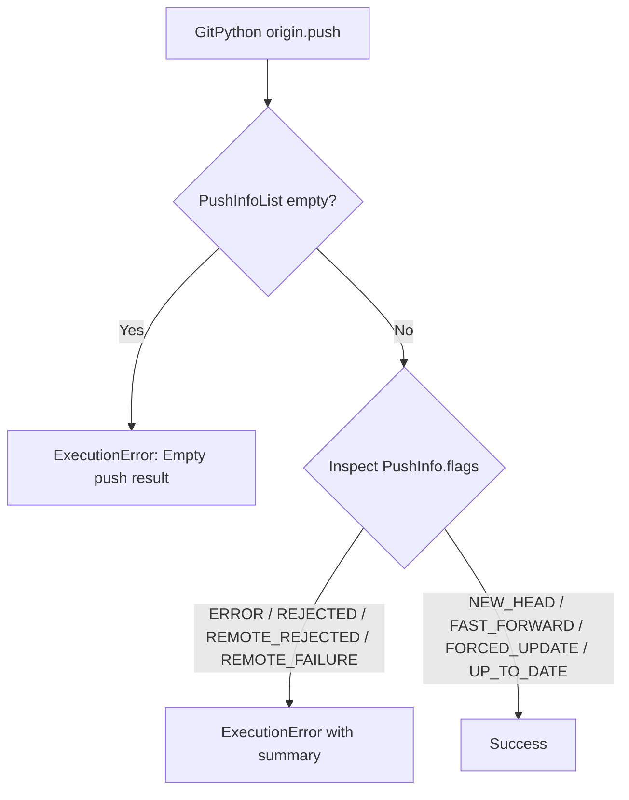

<!-- docs\development\issue442\research.md -->
<!-- template=research version=8b7bb3ab created=2026-08-19T11:36Z updated=2026-08-19T13:40Z -->
# Fix git_push false-success reporting and upstream result detection

**Status:** APPROVED  
**Version:** 1.0.0  
**Last Updated:** 2026-08-19

---

## Purpose

Define the defect analysis, evidence, architectural boundaries, Approved Strategy, and Expected Results for fixing `git_push` false-success reporting and upstream tracking result detection.

## Scope

### In Scope
- `GitAdapter.push()` result validation of GitPython `PushInfoList` and rejection flag interpretation.
- `GitManager.push()` upstream tracking coordination and frozen domain result contract (`GitPushResult`).
- `GitPushTool` and `GitPushOutput` contract compliance with the Russian Doll Decorator Pipeline.
- Alignment of unit and integration test suites covering all push and upstream tracking scenarios.

### Out of Scope
- Automatic network retries, transport reconfigurations, or credential helper adjustments.
- Alterations to `submit_pr` preflight checks.
- Overhaul of unrelated tool presentation templates or response formatting.

## Prerequisites

Read these first:
1. Understanding of GitPython `Remote.push()` and `PushInfo` flag semantics
2. Familiarity with the Russian Doll Decorator Pipeline and `ToolFactory` architecture
3. [Architecture Principles](../../coding_standards/ARCHITECTURE_PRINCIPLES.md) (SOLID, CQS, Law of Demeter, Presentation Boundary)
4. [Documentation Standard](../../coding_standards/DOCUMENTATION_STANDARD.md)

---

## Problem Statement

`git_push` can report `success=true` when GitPython returns a rejected or failed push without raising an exception. `GitAdapter.push()` discards the returned `PushInfoList`, so remote failure diagnostics are lost. `GitPushTool` reports unconditional success and hardcodes `new_upstream_created=False`, leaving callers believing a push succeeded when no remote branch or upstream tracking exists.

---

## Research Goals

1. Investigate the failure mechanisms of GitPython push execution, `PushInfo` error flags, and empty `PushInfoList` results.
2. Analyze the upstream tracking state detection and new upstream creation conditions.
3. Identify all affected boundaries, callers, managers, tools, and test suites.
4. Establish the architectural constraints (SOLID, CQS, Law of Demeter, Presentation Boundary) governing git push operations.
5. Define the binding Approved Strategy per boundary and Expected Results for downstream design, planning, and verification.

---

## Findings & Evidence

### 1. GitPython Push Execution & PushInfo Evaluation

In GitPython, calling `origin.push(...)` executes `git push` under the hood and parses the porcelain output into a `PushInfoList` containing `PushInfo` instances. Crucially, GitPython **does not raise a Python exception** when a push is rejected by the remote (e.g. non-fast-forward push, pre-receive hook failure, or remote repository rejection).

Each `PushInfo` object contains:
- `flags: int`: Bitmask indicating the status of the ref push.
- `summary: str`: Human-readable status or diagnostic line emitted by Git/remote (e.g. `[rejected] (non-fast-forward)`).
- `remote_ref_string: str`: Target remote ref name.

#### PushInfo Flags Classification

| Flag Bit | Constant Name | Category | Interpretation |
|---|---|---|---|
| `1` | `NEW_HEAD` | Success | A new remote branch was created. |
| `2` | `NEW_TAG` | Success | A new tag was created. |
| `4` | `UP_TO_DATE` | Success | Remote is already up-to-date (no changes needed). |
| `64` | `FAST_FORWARD` | Success | Remote ref was fast-forwarded. |
| `128` | `FORCED_UPDATE` | Success | Forced update succeeded. |
| `16` | `REJECTED` | Failure | Push was rejected (e.g. non-fast-forward). |
| `256` | `REMOTE_FAILURE` | Failure | Remote server failed to update ref. |
| `512` | `REMOTE_REJECTED` | Failure | Remote hook/policy rejected push. |
| `1024` | `ERROR` | Failure | General error occurred during push. |

### 2. Upstream Tracking State Detection Matrix

When `git_push(set_upstream=True)` is called, the tool must distinguish whether an upstream tracking branch was newly established, already existed, or failed to be configured.

| Scenario | Tracking before push | Remote ref state | Tracking after push | Expected `success` | Expected `new_upstream_created` |
|---|---|---|---|---|---|
| **New branch creation** | No | New (`NEW_HEAD`) | Yes | `True` | `True` |
| **Attach to existing remote** | No | Up-to-date / FF | Yes | `True` | `True` |
| **Existing tracking branch** | Yes | Up-to-date / FF | Yes | `True` | `False` |
| **Push without upstream request** | Yes/No | Up-to-date / FF | Unchanged | `True` | `False` |
| **Remote rejection / Conflict** | Any | Rejected | Unchanged | `False` | `False` |
| **Failed tracking establishment** | No | Up-to-date / FF | No | `False` | `False` |

### 3. Pipeline & Decorator Integration

The repository uses the Russian Doll Decorator Pipeline (`ToolFactory`):
1. **`InputValidationDecorator`**: Validates input arguments against `GitPushInput`.
2. **`EnforcementDecorator`**: Executes policy rules.
3. **`ToolErrorHandlerDecorator`**: Intercepts unhandled `ExecutionError` and `ConfigError` exceptions, generating structured `ExecutionErrorOutput` (`success=False`).
4. **`CoreTool` (`GitPushTool`)**: Executes the business logic by calling `GitManager.push()`. On successful completion, returns `GitPushOutput(success=True, branch=..., set_upstream=..., new_upstream_created=...)`.
5. **`TextPresenter`**: Uses `presentation.yaml` templates to format the final user response. When `success=False`, uses `default_failure_template: "Failed: {error_message}"`.

### 4. Blast Radius & Traceability

| Layer | Component / File | Current Role | Necessary Change |
|---|---|---|---|
| **Adapter** | `mcp_server/adapters/git_adapter.py` | Discards `PushInfoList` | Validate `PushInfoList` and error flags; raise `ExecutionError` on failure with remote summary. |
| **Manager** | `mcp_server/managers/git_manager.py` | Returns `None`; ignores tracking delta | Measure `has_upstream` before and after; return `GitPushResult` dataclass; raise `ExecutionError` if requested upstream missing. |
| **Tool** | `mcp_server/tools/git_tools.py` | Hardcodes `new_upstream_created=False` | Delegate to `GitManager.push()`; map `GitPushResult` to `GitPushOutput`; let `ToolErrorHandlerDecorator` handle exceptions. |
| **Presentation** | `mcp_server/assets/config/presentation.yaml` | `git_push` success template | Template displays dynamic `{new_upstream_created}` value; failures handled by standard failure template. |
| **Tests** | `tests/mcp_server/unit/adapters/test_git_adapter.py` | Mocks `origin.push()` returning `None` | Update mocks to return `PushInfoList`; add tests for `ERROR`, `REJECTED`, `REMOTE_REJECTED`, empty list, and success flags. |
| **Tests** | `tests/mcp_server/unit/managers/test_git_manager.py` | Asserts `adapter.push()` called | Test `new_upstream_created` calculation (True when newly created, False when preexisting) and failure cases. |
| **Tests** | `tests/mcp_server/unit/tools/test_git_tools.py` | Asserts hardcoded `GitPushOutput` | Test `GitPushOutput` populated from `GitPushResult` and error handling. |
| **Integration** | `tests/mcp_server/integration/test_submit_pr_atomic_flow.py` | Validates `submit_pr` rollback | Verify integration flow remains consistent when push fails. |

---

## Architectural Constraints

1. **SOLID & Single Responsibility Principle (§1.1)**:
   - GitPython-specific flag evaluation belongs exclusively in `GitAdapter`.
   - Tracking delta calculation and domain coordination belong in `GitManager`.
   - Tool execution and DTO mapping belong in `GitPushTool`.
2. **Command/Query Separation & Value Objects (§5)**:
   - `GitPushResult` must be an immutable `@dataclass(frozen=True)`.
   - `GitPushOutput` must remain frozen with `extra="forbid"`.
3. **Law of Demeter (§7)**:
   - `GitPushTool` communicates only with `GitManager`, never inspecting `GitAdapter` or `GitPython` directly.
4. **Presentation Boundary (§15)**:
   - Manager and tool layers produce pure structured domain data and exceptions; visual layout and Markdown formatting are managed exclusively by `TextPresenter`.

---

## Approved Strategy

| Boundary | Selected Strategy | Rationale & Constraints |
|---|---|---|
| **Public MCP Interface (`GitPushOutput`)** | **Preserve Compatibility** | Maintain existing fields (`success`, `branch`, `set_upstream`, `new_upstream_created`, `error_message`). No breaking schema changes for MCP clients. |
| **Adapter Boundary (`GitAdapter.push`)** | **Clean Break (Correctness Fix)** | Stop discarding `PushInfoList`. Immediately evaluate GitPython flags and raise `ExecutionError` on errors or rejections. |
| **Manager Boundary (`GitManager.push`)** | **Clean Break (Domain Contract)** | Change return type from `None` to frozen `GitPushResult` contract. Enforce postcondition that `set_upstream=True` yields an active tracking branch. |
| **Tool Boundary (`GitPushTool.execute`)** | **Clean Break** | Consume `GitPushResult` and eliminate hardcoded `new_upstream_created=False`. Delegate error trapping to the Russian Doll Decorator Pipeline. |

---

## Expected Results

1. **Rejection Diagnostics**: Pushes rejected by the remote (e.g. non-fast-forward or hook rejection) return `success=false` with the remote diagnostic summary in `error_message`.
2. **Upstream Verification**: A push with `set_upstream=True` succeeds if and only if upstream tracking is verified to exist after the push.
3. **Accurate Tracking Delta**: `new_upstream_created` is `True` when tracking did not exist before the push and exists afterward; `False` when tracking was already established or not requested.
4. **Existing Remote Handling**: Pushing with `set_upstream=True` to an existing, up-to-date remote branch succeeds (`success=true`) and correctly sets `new_upstream_created` based on prior local tracking state.
5. **Contract Adherence**: All affected unit tests in `test_git_adapter.py`, `test_git_manager.py`, and `test_git_tools.py` pass with full branch coverage.

---

## Open Questions for Design Phase

1. **Tool Response vs. Resource Cache Representation**:
   - Exact shape of the presented Markdown text summary in `presentation.yaml` vs. the structured payload cached in `pgmcp://cache/runs/{run_id}`.
2. **Async Offloading**:
   - Verify `GitPushTool` offloads blocking network operations via `anyio.to_thread.run_sync` matching the standard set in `git_pull` and `git_fetch`.
3. **Empty PushInfoList Error Message**:
   - Standardize the exact error message format when GitPython returns an empty result list without individual ref status.

---

## Related Documentation

- [docs/coding_standards/ARCHITECTURE_PRINCIPLES.md](../../coding_standards/ARCHITECTURE_PRINCIPLES.md)
- [docs/coding_standards/DOCUMENTATION_STANDARD.md](../../coding_standards/DOCUMENTATION_STANDARD.md)
- [docs/coding_standards/QUALITY_GATES.md](../../coding_standards/QUALITY_GATES.md)

---

## Version History

| Version | Date | Author | Changes |
|---|---|---|---|
| 1.0.0 | 2026-08-19 | @imp researcher | Complete research findings, evidence, boundaries, Approved Strategy, and Expected Results for Issue #442. |
