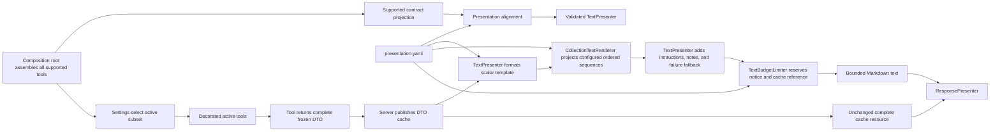
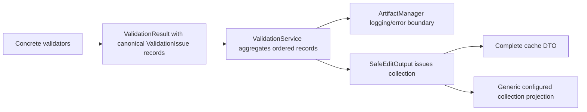

<!-- docs/development/issue456/design.md -->
<!-- template=design version=5827e841 created=2026-08-20T19:53Z updated=2026-08-20 -->
# Compact Actionable Tool Summaries — Design

**Status:** REVIEW  
**Version:** 1.7  
**Last Updated:** 2026-08-21

---

## Purpose

Define the structured DTO, configuration, and presentation-layer contracts for bounded, actionable MCP tool text while preserving complete resource-cache evidence.

## Scope

**In Scope:** The approved workflow-state, canonical SafeEdit-validation, pytest-duration, and duplicate-field clean breaks; a runtime-derived complete supported-tool catalog with a settings-dependent active subset; TextPresenter orchestration; generic ordered-sequence and recursive collection projection; UTF-8 byte limiting; presentation configuration validation; the complete 29-tool mechanics matrix within all 50 approved projections; and durable behavioral tests.

**Out of Scope:** Tool execution semantics, DTO changes outside the explicitly approved workflow-state, SafeEdit-validation, pytest-duration, and presentation-debt clean breaks; cache payload changes beyond those DTO serializations, transport-wide resource limits, sorting/filtering, tool-name-specific renderer code, and unrelated documentation modernization.

## Prerequisites

1. [Approved Research v1.9](research.md)
2. [Architecture Principles](../../coding_standards/ARCHITECTURE_PRINCIPLES.md)
3. [Documentation Standard](../../coding_standards/DOCUMENTATION_STANDARD.md)

---

## 1. Context & Requirements

### 1.1. Problem Statement

Current scalar-only presentation templates make routine tool results under-informative, while inlining complete DTOs would recreate context growth. The design must add bounded declarative projections and a hard text budget, replace the approved presentation-only DTO debt with structured data, and preserve cache authority.

### 1.2. Requirements

**Functional:**

- Render configured flat and nested ordered sequences in DTO order with one per-tool item limit; support the concrete `list[T]` and `tuple[T, ...]` shapes used by tool-output contracts.
- Keep user-facing collection, omission, and truncation wording in presentation.yaml.
- Apply one configurable 8,000 UTF-8-byte ceiling to every TextPresenter result.
- Preserve a truncation notice and cache URI inside the budget whenever a cache URI exists.
- Handle cache-publication failure explicitly when no resource URI can be retained.
- Validate collection paths and placeholders against tool output models at startup.
- Enforce exact bidirectional parity between the complete runtime-derived supported-tool catalog and `presentation.yaml` keys at startup while allowing the settings-dependent active subset to be smaller.
- Implement the human-approved inline/cache-only target for all 50 supported tool templates exactly as recorded in the field audit, including explicit mechanics and limits for all 29 tools with bounded sequences or collections.
- Keep deep logs, tracebacks, schemas, diffs, and full result sets in the cache.
- Represent `get_work_context` state availability with structured enum data and no human-facing warning/recovery text in the tool.
- Select status-specific warning blocks declaratively from `presentation.yaml` without arbitrary expressions or tool-name dispatch.
- Enrich scalar templates and correct contradictory outcome templates only according to the approved field audit; changing that matrix requires reopening Design.

**Non-Functional:**

- Introduce no tool-name or DTO-type branches in presentation code; presentation configuration remains the content source of truth.
- Preserve tool inputs, cache URI shape, resource publication, and unaffected DTO contracts; limit DTO breakage to the explicitly approved clean breaks.
- Fail fast on invalid or internally inconsistent presentation configuration, unresolved output models, duplicate supported identities, and catalog/config drift.
- Use cohesive, testable presentation services without speculative interfaces.
- Test durable observable behavior rather than exact prose snapshots.
- Preserve valid UTF-8 and readable Markdown after truncation.

### 1.3. Constraints

- The Approved Strategy is binding.
- PresentationConfig remains a frozen pure Pydantic value object loaded only by ConfigLoader.
- Tests use public APIs only.
- The existing ResponsePresenter and ITextPresenter external contracts remain unchanged.
- Approved clean breaks replace `GetWorkContextOutput.invalid_phase_warning`, SafeEdit string issues, pytest summary text, and seven duplicate presentation fields with structured contracts; SafeEdit reuses the canonical validation record and introduces no duplicate DTO or compatibility bridge.
- Both obsolete documentation-test modules and their 62 cases are deleted during Implementation, without replacement by textual snapshot tests.
- The supported-tool catalog is an in-memory projection of one composition-root assembly. No static catalog file, second tool-name list, public catalog API, descriptive metadata, or generalized capabilities system is introduced.

---

## 2. Design Options

### 2.1. Option A: Extend TextPresenter only

Put recursive collection rendering, alignment, and byte limiting directly into the existing presenter.

**Pros:**

- Smallest file-count change.
- Keeps one public entry point.

**Cons:**

- Combines orchestration, recursive projection, and byte-budget policy.
- Makes focused behavioral testing and maintenance harder.
- Increases the risk of another monolithic presentation service.

### 2.2. Option B: Compose concrete presentation services

Keep TextPresenter as coordinator and delegate collection projection and final byte limiting to two concrete, pure presentation services.

**Pros:**

- Preserves single responsibility.
- Supports focused public-contract tests.
- Needs no speculative protocol or domain change.
- Leaves ResponsePresenter and the transport boundary untouched.

**Cons:**

- Adds two small production components.
- Requires explicit construction in the existing presentation composition path.

### 2.3. Option C: Tool-specific renderers

Create specialized renderer logic for each long-output tool.

**Pros:**

- Maximum per-tool flexibility.

**Cons:**

- Violates the Approved Strategy.
- Creates tool-name branching and configuration drift.
- Scales linearly with every new tool.

### 2.4. Supported-tool catalog and activation options

| Option | Benefit | Cost / risk | Decision |
|---|---|---|---|
| Validate only the settings-dependent active tool list | Reuses the current bootstrap return value. | Tokenless startup rejects the bundled templates for twelve supported but inactive tools. | Rejected |
| Add a separately maintained static catalog or descriptive registration metadata | Avoids constructing inactive tool objects. | Duplicates identity/output knowledge and expands into an unnecessary capabilities model. | Rejected |
| Assemble every supported core tool once, derive its identity/output contract at runtime, and partition the same objects into the active subset | One source drives catalog validation and runtime registration; current constructors use already-built dependencies and perform no external call. | Bootstrap must expose a small immutable assembly result and resolve every output model fail-fast. | Chosen |

The chosen option relies only on current evidence: token-gated tool constructors accept injected managers/configuration, and [GitHubManager](../../../mcp_server/managers/github_manager.py) constructs its external adapter lazily. A future tool that cannot be safely constructed at bootstrap would require reopening this design rather than adding speculative factories now.

---

## 3. Chosen Design

**Decision:** Compose a generic CollectionTextRenderer and TextBudgetLimiter under TextPresenter, driven by a recursive ordered-sequence schema and one per-tool item limit in presentation.yaml. At the composition root, build one complete `ToolAssembly`, validate presentation parity against its supported catalog, and decorate/register only its settings-dependent active subset.

**Rationale:** This is the smallest design that handles flat and nested tool results, preserves the supported/active distinction without a second catalog source, and retains configuration ownership, DTO order, cache authority, SRP, and fail-fast validation. Concrete services and the immutable assembly value avoid unnecessary interface hierarchies or metadata systems.

### 3.1. Component Responsibilities

| Component | Responsibility | Explicitly does not own |
|---|---|---|
| Tool and output DTO | Produce complete structured result data. | Markdown, item limits, byte limits. |
| ConfigLoader and PresentationConfig | Parse and validate presentation policy. | Runtime rendering, tool registration ownership, or cache publication. |
| Runtime ToolAssembly | Hold the complete supported core-tool tuple and the settings-dependent active tuple derived from the same assembled objects. | Presentation content, descriptive metadata, persistence, or public catalog APIs. |
| Supported-tool contract projection | Derive each supported tool's identity and output model from the assembled tool object and fail if either is unavailable or duplicated. | Construct tools, decide activation, or duplicate tool declarations. |
| Startup presentation alignment | Compare the complete supported-tool contract projection with configured keys and validate every configured template against its output model. | Register tools, reject known inactive templates, or choose presentation content. |
| SafeNoneFormatter | Format scalar values and bounded flat scalar sequences consistently. | Tool identity, nested model rendering, final byte enforcement. |
| CollectionTextRenderer | Project configured `list`/`tuple` ordered-sequence fields into bounded Markdown in DTO order. | Tool identity, DTO identity, sorting, filtering, final byte enforcement. |
| TextBudgetLimiter | Enforce the final UTF-8 byte ceiling and retain required tail content. | DTO traversal or tool-specific semantics. |
| TextPresenter | Coordinate scalar template, collections, instructions, notes, cache fallback, URI, and limiter. | Tool execution and resource creation. |
| ResponsePresenter | Combine text with separately embedded presentation resources. | Text budgeting for embedded resources. |
| Server/cache publisher | Publish the complete DTO before presentation. | Selecting inline content. |

No new Protocol is introduced for either helper. Each has one concrete implementation, and its narrow public method is directly testable.

The composition-root boundary is:

    @dataclass(frozen=True)
    class SupportedToolContract:
        name: str
        output_model: type[BaseModel]

    @dataclass(frozen=True)
    class ToolAssembly:
        supported_tools: tuple[ICoreTool[Any, Any], ...]
        active_tools: tuple[ICoreTool[Any, Any], ...]
        supported_contracts: tuple[SupportedToolContract, ...]

Required invariants:

- `supported_tools` contains every tool the binary supports, independent of current credentials.
- `active_tools` contains only objects from `supported_tools` and may equal the complete tuple. With the current registrations, token-enabled startup activates all 50 supported tools and tokenless startup activates 38; those counts are observed evidence, not encoded catalog constants.
- `supported_contracts` is derived from `supported_tools` in the same order. It is not independently declared or persisted.
- Every supported object resolves to exactly one non-empty name and one Pydantic output model. An absent or ambiguous output model is a startup `ConfigError`, not a validation skip. When an explicit `output_model` and the concrete generic output argument both exist, they must identify the same model.
- Duplicate supported names fail before set comparison or decorator construction.
- Presentation alignment consumes `supported_contracts`; the tool factory decorates only `active_tools`.
- Tool description, category, documentation metadata, capability tags, and activation explanations are intentionally absent from the contract projection.

Output-model resolution may use an explicit `output_model` class declaration when present or the concrete `ICoreTool[Input, Output]` type argument. Both are existing tool contracts; resolution does not add a second maintained output-model registry.

### 3.2. Structured Workflow-State Contract

The tool reports domain state only; presentation configuration owns all human-facing labels, warnings, and recovery instructions.

    class WorkflowStateStatus(StrEnum):
        AVAILABLE = "available"
        MISSING = "missing"
        UNREADABLE = "unreadable"
        INVALID_PHASE = "invalid_phase"

    class GetWorkContextOutput(BaseToolOutput):
        # Existing orientation and instruction fields remain unless stated below.
        workflow_state_status: WorkflowStateStatus
        valid_phases: tuple[str, ...] = ()
        # invalid_phase_warning is removed in this approved clean break.

Status semantics:

| Status | Producer condition | Structured supporting data |
|---|---|---|
| `available` | Branch state loads and its workflow/phase resolves in the active contract. | Existing workflow, issue, phase, role, instructions, and hand-over fields. |
| `missing` | `StateNotFoundError` or `FileNotFoundError`. | Branch remains available; unresolved orientation fields retain their existing empty/None representation. |
| `unreadable` | State access or decoding fails through the currently handled `OSError`/`KeyError` path. | Branch remains available; no raw exception text is exposed as presentation content. |
| `invalid_phase` | State loads, workflow exists, but the stored phase is absent from that workflow contract. | Existing workflow and phase plus ordered `valid_phases`. |

A successful query retains `success=true` for all four statuses. The enum describes the discovered workflow-state condition; it is not an execution failure. `phase_source` and `phase_confidence` remain in the complete DTO for compatibility and diagnostics but are cache-only once the enum is inline.

### 3.3. Structured DTO Cleanup Contracts

The existing validation-layer record becomes the single frozen, serializable contract and remains owned by the validation boundary; `SafeEditOutput` depends on that shared inward contract, while no validation component imports a tool-output DTO:

    class ValidationIssue(BaseModel):
        model_config = ConfigDict(frozen=True, extra="forbid")
        message: str
        line: int | None = None
        column: int | None = None
        code: str | None = None
        severity: str = "error"

    class SafeEditOutput(BaseToolOutput):
        # Existing path/mode/result fields remain.
        issues: tuple[ValidationIssue, ...] = ()
        # The former issues string is removed.

The shared service boundary becomes:

    class ValidationService:
        async def validate(
            self,
            path: str,
            content: str,
        ) -> tuple[bool, tuple[ValidationIssue, ...]]: ...

Concrete validators continue to return their existing `ValidationResult` contract, but its issue elements use the canonical frozen `ValidationIssue`. ValidationService concatenates those records in validator/result order and returns them without Markdown, emojis, labels, copying, or field mapping. It does not invent aggregation semantics for validator scores, hints, or guidance because neither service consumer uses those values.

ArtifactManager uses the boolean for its existing strict/warn policy and forwards the same issue tuple to its logging/error boundary without interpreting issue contents. SafeEditTool assigns that tuple directly to `SafeEditOutput.issues`. Pydantic serialization turns the nested records into ordinary structured output for cache publication; `presentation.yaml` selects bounded fields through the generic model-collection path. TextPresenter and its helpers never import, detect, or branch on `ValidationIssue`.

Startup configuration validation, `InputValidationDecorator`/`ValidationErrorOutput`, and `TemplateValidationTool`/`TemplateValidationErrorDTO` retain their separate responsibilities and contracts.

The pytest result contract becomes:

    class RunTestsOutput(BaseToolOutput):
        # Existing exit code, counts, failures, coverage, and diagnostics remain.
        duration_seconds: float | None = None
        # summary_line is removed.

`PytestRunner` parses duration as numeric data when the pytest summary exposes it. Missing duration stays `None`; tools do not synthesize human-facing fallback wording. The presenter renders exit code, counts, duration, coverage, and bounded failures.

The following duplicate fields are removed atomically after their templates use structured data:

- `AutoFixOutput.formatted_modified_files`;
- `LabelOperationOutput.formatted_labels`;
- `ScaffoldArtifactOutput.formatted_files_created`;
- `PhaseTransitionOutput.skipped_gates_warning`;
- `PhaseTransitionOutput.passing_gates_info`;
- `ScaffoldArtifactOutput.schema_info`;
- `GetWorkContextOutput.invalid_phase_warning`.

No replacement compatibility properties, aliases, dual writes, or deprecated fields are introduced.

### 3.4. Configuration Contracts

The existing configuration version remains 1.0.0 because schema and bundled YAML move atomically and no external migration contract exists.

The following design-level Pydantic contracts are authoritative; method bodies and patch sequencing belong to Implementation.

    class CollectionPresentationConfig(BaseModel):
        model_config = ConfigDict(frozen=True, extra="forbid")
        field: str
        heading: str | None = None
        item_template: str
        children: tuple["CollectionPresentationConfig", ...] = ()

    class FormattingConfig(BaseModel):
        model_config = ConfigDict(frozen=True, extra="forbid")
        none_value: str = "-"
        inline_sequence_separator: str = ", "
        inline_sequence_omission_template: str
        collection_omission_template: str
        truncation_notice: str
        cache_unavailable_truncation_notice: str

    class GlobalPresentationConfig(BaseModel):
        model_config = ConfigDict(frozen=True, extra="forbid")
        max_text_response_bytes: int = Field(default=8000, gt=0)
        # Existing fields remain unchanged.

    class EnumCasePresentationConfig(BaseModel):
        model_config = ConfigDict(frozen=True, extra="forbid")
        field: str
        cases: dict[str, str]

    class ToolPresentationConfig(BaseModel):
        model_config = ConfigDict(frozen=True, extra="forbid")
        max_items: int | None = Field(default=None, gt=0)
        collections: tuple[CollectionPresentationConfig, ...] = ()
        enum_cases: tuple[EnumCasePresentationConfig, ...] = ()
        # Existing fields remain unchanged.

Contract rules:

- A tool with configured collections or an inline scalar-sequence placeholder must define max_items.
- `enum_cases.field` names a direct enum-valued DTO field; configured case keys must be valid serialized enum values and unique.
- The active enum value selects at most one configured template. An enum value with no configured case renders no block; `available` therefore adds no normal-path noise.
- Enum-case templates may reference validated top-level DTO scalar fields and bounded flat scalar sequences. They contain all human-facing status labels and recovery text.
- Arbitrary predicates, boolean expressions, fall-through defaults, and tool-name checks are unsupported.
- max_items applies independently to every sibling collection, recursively at every child depth, and to every inline scalar sequence rendered for that tool.
- A max_items value unused by either mechanism is rejected by startup alignment as orphaned configuration.
- `field` names a direct ordered-sequence field on the current model; dotted paths are deliberately unsupported.
- Supported ordered-sequence annotations and runtime containers are exactly `list[T]` and `tuple[T, ...]`. Strings, bytes, mappings, sets, and arbitrary iterables are not collection inputs.
- For an ordered sequence of Pydantic models, `item_template` may reference only fields on the element model.
- For an ordered sequence of scalar values, `item_template` may reference only `item`.
- `children` are valid only when the current sequence element is a Pydantic model; each child field must itself be a supported ordered sequence.
- heading is optional literal Markdown and has no placeholders.
- Sibling field declarations must be unique.
- collection_omission_template accepts only omitted_count and field.
- inline_sequence_omission_template accepts only omitted_count.
- Inline scalar sequences preserve source order, join retained values with inline_sequence_separator, append the configured inline omission text when bounded, and render an empty sequence as none_value.
- Model-valued or nested sequences may not be interpolated as scalar placeholders; they require a collection declaration.
- truncation notices contain no dynamic payload content.
- Cross-field validation rejects a byte budget that cannot contain the configured truncation notice plus a formatted cache URI using the fixed 32-character run-id shape.

The recursive shape is intentionally minimal. It supports phases → tasks, but does not introduce selectors, sorting, filters, arbitrary JSON paths, per-depth limits, or conditional expressions.

| Aligned field shape | Inline scalar placeholder | Configured collection | Child collection |
|---|---|---|---|
| `list[scalar]` or `tuple[scalar, ...]` | Allowed and bounded | Allowed with `{item}` | Allowed when declared under a model item |
| `list[BaseModel]` or `tuple[BaseModel, ...]` | Rejected | Allowed with validated element fields | Allowed when its element exposes supported direct child sequences |
| Nested scalar/model sequence inside an element model | Rejected at root interpolation | Parent item may format only flat scalar child fields | Model-valued nesting requires an explicit direct child declaration |
| Any other container/iterable | Rejected | Rejected | Rejected |

SafeNoneFormatter remains the generic value-formatting boundary for both scalar templates and collection item templates. In addition to its existing None behavior, it formats only flat scalar `list[T]` and `tuple[T, ...]` sequences according to `inline_sequence_separator`, `inline_sequence_omission_template`, and the active tool's `max_items`. This yields labels such as bug, priority:high, … 2 more rather than Python repr output. It does not inspect field, tool, or DTO names.

### 3.5. Presentation Service Contracts

    class CollectionTextRenderer:
        def render(
            self,
            data: Mapping[str, Any],
            collections: tuple[CollectionPresentationConfig, ...],
            max_items: int,
        ) -> str: ...

Observable behavior:

- Traverse configured collections depth-first and preserve DTO order.
- Render a heading only when the associated collection contains items.
- Render at most `max_items` items from each encountered supported ordered sequence.
- Append the configured omission text when items remain; the presentation layer may indent it to the active nesting depth.
- Render each child collection immediately after its parent item.
- Return an empty string for configured empty collections.
- Never inspect tool_name.
- Treat already aligned DTO data as authoritative, while still requiring the runtime container to be `list` or `tuple` and every item to match the aligned scalar/model category; any mismatch raises `ConfigError` with tool-independent field/path context.

    class TextBudgetLimiter:
        def limit(
            self,
            body: str,
            cache_reference: str | None,
        ) -> str: ...

Observable behavior:

- Return the assembled text unchanged when its UTF-8 encoded size is within max_text_response_bytes.
- On overflow, reserve the configured notice and complete cache reference first, then retain as much body content as fits.
- Prefer the last complete Markdown block, then the last complete line, then a UTF-8 code-point-safe boundary.
- Never return invalid UTF-8 or more than the configured byte count.
- When truncation occurs without a cache reference, use cache_unavailable_truncation_notice and retain as much sanitized fallback body as fits. It must not claim that complete details are cached.
- If truncation intersects a fenced block, close that fence before the notice.
- Never truncate the cache URI when one exists; invalid configuration that makes this impossible fails at startup.

TextPresenter retains its current public signature. Internally it produces semantic blocks in this order:

1. scalar success or failure template;
2. configured collection projection;
3. next instructions;
4. operation notes;
5. sanitized cache-publication-failure fallback, when applicable;
6. cache reference as a separately reserved tail;
7. final byte-limit application.

The emoji remains part of the scalar body. Cache publication still happens before this flow in the server, so limiting text cannot mutate or reduce the cached DTO.

### 3.6. Data and Control Flow

SafeEdit preserves the same record identity across the structured boundary:

The embedded validation schema produced by ValidationResourcePresenter remains a separate PresentationResource and is not counted toward the TextPresenter ceiling. That input-validation resource path is independent from the canonical SafeEdit issue flow.

### 3.7. Projection Review Authority

The DTO-to-chat projection is a human-facing product contract, not an implementation detail. The human owner and designer reviewed all 50 tools in five functional batches using [Tool Presentation Field Audit](tool-presentation-field-audit.md). The resulting matrix records the immediate decision supported by each response, every inline field and mechanism, every cache-only field and rationale, item limits, and the explicit approval disposition.

All five batches are closed. The audit is therefore the binding projection authority for Implementation. Implementation may not reinterpret, extend, or silently override a row; new evidence that changes an inline/cache-only split must reopen Design.

### 3.8. Complete Tool Configuration Matrix

The approved 50-tool field matrix is [Tool Presentation Field Audit](tool-presentation-field-audit.md). Every row is an implementation deliverable, including templates intentionally retained after confirming that their compact output is optimal.

Exactly 29 tools require at least one bounded inline scalar sequence or configured collection. The table below is the complete mechanics authority. Limits follow the approved density rule: five diagnostic test failures; ten normal records, cycles, labels, and validation findings; twenty short gate/phase identifiers and paths. One tool-level `max_items` applies independently to every listed sequence at every configured depth; the final byte ceiling remains authoritative.

| Tool | max_items | Inline scalar sequence(s) | Root collection(s) | Child collection(s) | Item contract |
|---|---:|---|---|---|---|
| transition_cycle | 20 | — | skipped_gates | — | Scalar gate name |
| force_cycle_transition | 20 | — | skipped_gates | — | Scalar gate name |
| get_work_context | 20 | valid_phases | — | — | Scalar phase name |
| initialize_project | 20 | — | required_phases, files_created | — | Scalar phase/path |
| get_project_plan | 10 | — | phases | phases[].tasks | Phase name/status; task id/title/status |
| save_planning_deliverables | 10 | — | cycles | — | Cycle number and deliverables count |
| update_planning_deliverables | 10 | — | cycles | — | Cycle number and deliverables count |
| transition_phase | 20 | — | skipped_gates | — | Scalar gate name |
| force_phase_transition | 20 | — | skipped_gates | — | Scalar gate name |
| git_list_branches | 20 | — | branches | — | Name, current marker, upstream |
| git_status | 20 | — | modified_files, untracked_files | — | Scalar path |
| git_add_or_commit | 20 | — | files | — | Scalar path |
| git_restore | 20 | — | files | — | Scalar path |
| git_stash | 10 | — | stashes | — | Scalar stash description |
| create_issue | 10 | labels | — | — | Scalar label |
| update_issue | 10 | labels | — | — | Scalar label |
| get_issue | 10 | labels | — | — | Scalar label |
| list_issues | 10 | issues[].labels | issues | — | Issue number/title/state/URL/assignee/created metadata; scalar labels within each item |
| list_prs | 10 | — | pull_requests | — | Number, title, state, refs, URL |
| list_labels | 10 | — | labels | — | Name, color, description |
| add_labels | 10 | labels | — | — | Scalar label |
| remove_labels | 10 | labels | — | — | Scalar label |
| list_milestones | 10 | — | milestones | — | Number, title, state |
| scaffold_artifact | 20 | — | files_created, missing_fields, provided_fields | — | Scalar path or context-field name; path-specific templates select the applicable collections |
| auto_fix | 20 | — | gates_executed, modified_files | — | Scalar gate/path |
| run_quality_gates | 10 | — | gates | — | Name, status, passed, score; details excluded |
| run_tests | 5 | — | failures | — | Test id, location, short reason, collection-error marker; traceback excluded |
| safe_edit_file | 10 | — | issues | — | Canonical issue message, severity, line, column, code |
| validate_template | 10 | — | errors | — | Severity and message |

The approved scalar additions not otherwise represented by the mechanics columns are:

| Tool | Added scalar content |
|---|---|
| get_work_context | phase_instructions and handover_template |
| get_issue | html_url, body, and the remaining approved issue metadata |
| get_pr | state and body |

The semantic templates become outcome-neutral:

- run_quality_gates states that gate execution completed and reports overall_pass as data.
- validate_template states that validation completed and reports passed and errors_count as data.

scaffold_schema remains deliberately resource-oriented.

### 3.9. Alignment and Failure Behavior

`validate_presentation_alignment` remains the startup authority for presentation contracts. `ServerBootstrapper` first creates `ToolAssembly`; alignment receives its complete `supported_contracts`, compares those names with the configured tool-key set, and recursively validates every matched template and collection against the resolved output model. The tool factory subsequently decorates only `active_tools`. Alignment neither constructs tools nor treats a supported-but-inactive template as obsolete.

| Condition | Required behavior |
|---|---|
| Supported tool has no presentation key | Startup `ConfigError` listing missing tool names in deterministic order. |
| Presentation key has no supported tool | Startup `ConfigError` listing unknown/obsolete keys in deterministic order. |
| Supported name is empty or duplicated | Startup `ConfigError`; ambiguity must not be hidden by set comparison. |
| Supported tool output model cannot be resolved to one Pydantic model | Startup `ConfigError` naming the tool class/identity; template validation is never skipped. |
| Active tool is absent from the supported tuple | Startup `ConfigError`; the active set must be an object subset of the supported assembly and may equal it. |
| Supported-but-inactive tool has a valid presentation key | Accept; the bundled configuration describes the complete supported catalog. |
| Exact supported-catalog/config parity | Continue with output-model and template validation for every supported tool. |
| Enum-case field is absent or not enum-valued | Startup `ConfigError` naming tool and field. |
| Enum-case key is not a member of the DTO enum | Startup `ConfigError` naming tool, field, and invalid key. |
| Enum-case template has an invalid placeholder | Startup `ConfigError` using the existing output-model alignment rules. |
| Enum value has no configured case | Render no conditional block; this is intentional for normal states such as `available`. |
| Unknown root or child field | Startup `ConfigError` naming tool and path. |
| Configured field annotation is not exactly `list[T]` or `tuple[T, ...]` | Startup `ConfigError` naming the incompatible field. |
| Sequence item type is neither supported scalar nor Pydantic model | Startup `ConfigError` naming tool, path, and item type. |
| Invalid model-item placeholder | Startup `ConfigError` naming template, DTO, and placeholder. |
| Scalar-sequence collection `item_template` uses anything except `item` | Startup `ConfigError`. |
| Inline placeholder targets a model-valued or nested sequence | Startup `ConfigError` requiring a collection declaration. |
| Inline scalar-sequence placeholder has no `max_items` | Startup `ConfigError` naming tool and field. |
| `max_items` is unused by collections or inline scalar sequences | Startup `ConfigError` for orphaned configuration. |
| Duplicate sibling collection field | Pydantic configuration error. |
| Budget cannot preserve mandatory tail | Startup configuration error. |
| Configured runtime field is missing | Runtime `ConfigError` with direct field/path context. |
| Configured runtime value is neither `list` nor `tuple` | Runtime `ConfigError` with direct field/path context. |
| Runtime item contradicts the aligned scalar/model category | Runtime `ConfigError` with item index and field/path context. |
| Empty collection | No heading, items, or omission line. |
| More items than `max_items` | Preserve first items in DTO order and add omission notice. |
| Oversized scalar or collection text | Apply final limiter; cache stays complete. |
| Cache publication fails | Preserve current sanitized inline fallback, bound it, and use the cache-unavailable notice. |
| Formatter receives `None` or an empty inline sequence | Render `none_value`. |
| Inline scalar sequence exceeds `max_items` | Preserve the first values in DTO order, join with the configured separator, and append the inline omission text. |

No new persisted state, metrics store, migration task, or cache format is introduced. The visible truncation and omission notices are sufficient user-facing observability; complete evidence remains at the existing resource URI.

### 3.10. Compatibility and Migration

This is an atomic configuration, composition-root, DTO, and presenter change:

- Tool inputs, cache publication, cache URI shape, and PresentationResource payloads do not change.
- One runtime ToolAssembly replaces the duplicated token/no-token registration branches as the source for both complete supported contracts and active tool objects. Existing 50-with-token and 38-without-token behavior remains unchanged.
- The approved DTO clean breaks remove the enumerated presentation-debt fields, reuse canonical structured validation records in SafeEdit, replace pytest `summary_line` with numeric duration, and add structured workflow-state status.
- Each tool follows the approved field-audit target; a template explicitly retained as unchanged remains byte-for-byte stable below the global safety ceiling.
- Existing success/failure scalar placeholders continue to work.
- Generic sequence support accepts existing `list` fields and the approved tuple-based outputs without changing their JSON-array serialization.
- The two helper services are wired only in the presentation composition path.
- No static catalog, compatibility bridge, dual schema, deprecation period, or data migration is needed.
- No presentation-debt field outside the explicitly enumerated clean-break set is removed in this issue.

---

## 4. Test Design

Tests are organized around lasting public behavior, not around the wording of all 50 tool templates.

| Test seam | Durable behavior |
|---|---|
| ToolAssembly and supported contracts | Token and tokenless bootstrap derive identical complete supported contracts from one assembly; token-enabled activation equals the supported set and tokenless activation is the expected credential-free subset without a separately maintained count/name list; duplicate names, unresolved/conflicting output models, or active objects outside supported fail. |
| PresentationConfig validation | Frozen recursive config, list/tuple sequence settings, and enum-case mappings load; invalid fields, enum keys, placeholders, max_items combinations, duplicates, and insufficient budget fail. |
| Complete catalog alignment | Missing supported templates, unknown keys, and duplicate identities fail; known inactive templates pass; every supported output model is validated rather than skipped. |
| GetWorkContextOutput workflow state | Available, missing, unreadable, and invalid-phase paths produce only structured enum/supporting data; no human-facing warning text originates in the tool. |
| SafeEdit validation boundary | Validators, ValidationService, ArtifactManager, and SafeEdit preserve canonical issue message/severity/location/code records; the output collection contains the shared record type and no layer preformats, parses, copies, or maps it for chat. |
| RunTests duration boundary | Numeric duration parsing covers normal pytest summaries; absent duration remains None; output has no `summary_line`. |
| Removed presentation fields | DTO construction/schema behavior proves all seven duplicate fields are absent and structured replacements remain. |
| Enum-case presentation | Available state adds no warning block; each abnormal state selects exactly its configured warning/recovery block; invalid phase renders bounded valid phases. |
| SafeNoneFormatter public formatting contract | Scalar list/tuple joining, empty sequence, exact limit, omission count, multibyte values, and rejection through alignment for nested/model sequences. |
| CollectionTextRenderer.render | Scalar/model list and tuple values, empty sequences, order, per-sequence limit, omission count, sibling fields, and nested phases/tasks; malformed runtime field/container/item shapes raise path-rich ConfigError. |
| TextBudgetLimiter.limit | Under-budget identity, exact boundary, multibyte safety, block/line preference, fenced-block closure, hard byte ceiling, notice, URI retention, and cache-unavailable behavior. |
| validate_presentation_alignment | Reject unknown/unsupported-sequence fields, invalid root/item/nested placeholders, unbounded inline sequences, model-valued inline sequences, orphaned max_items, and runtime-contract ambiguity; accept representative flat, scalar-sequence, nested, list, and tuple declarations. |
| TextPresenter.present_text | Correct block order, scalar expansion, generic collection append, notes/instructions retention where space permits, and final budget enforcement without tool/DTO-type dispatch. |
| Representative output DTOs | run_tests excludes traceback/stderr; run_quality_gates excludes details; both expose bounded actionable rows. |
| Issue label regression | get_issue and list_issues render ordered, bounded labels without Python sequence representation or tool-specific logic. |
| Semantic outcome regression | overall_pass=False and passed=False produce neutral, non-contradictory summaries. |
| Server/presenter integration | Cached DTO content remains complete while presented text is bounded. |

The configuration matrix is checked structurally at two levels: all 50 supported contracts have exact key parity and match the approved field-audit target, while all 29 sequence/collection tools declare every required field, mechanism, and limit from Section 3.8. No Python source branches on those tool or DTO names. Evidence uses capability and field-classification matrices rather than 50 exact-wording snapshots.

Implementation deletes:

- tests/documentation/test_c4_doc_alignment.py
- tests/documentation/test_agent_instruction_search_contract.py

No replacement test asserts mutable prose across agent or documentation files. Documentation validation is a targeted link and claims review.

---

## 5. Risks and Planning Consequences

| Risk | Design control | Planning consequence |
|---|---|---|
| Recursive renderer becomes a generic query language | Direct child fields only; no paths, conditions, sorting, filters, or arbitrary iterables. | Keep schema and renderer in one bounded slice. |
| List and tuple outputs diverge or trigger a DTO-specific exception | One ordered-sequence classifier is shared by alignment, scalar formatting, and collection rendering; only list/tuple are supported. | Cover both containers at generic seams before tool integration. |
| TextPresenter remains too broad | Two concrete services own projection and limiting. | Integrate only after their public contracts are green. |
| UTF-8 or Markdown corruption | Block/line/code-point boundary contract and fenced-block closure. | Include multibyte and fenced-content cases before template expansion. |
| Cache URI is lost | Mandatory-tail reservation and startup budget validation. | Treat URI-retention failure as stop-go blocking. |
| Diagnostics leak verbose data | Templates can reference only selected item fields; representative DTO tests exclude verbose fields. | Include quality/test outputs in integration coverage. |
| Config drifts from DTO shapes | Recursive startup alignment with unresolved-model failure. | Configuration declarations and validator evolve together. |
| Catalog, config, and active tools drift | One ToolAssembly derives supported contracts and active objects; exact supported parity and subset invariants fail fast. | Establish composition-root behavior before presentation rollout. |
| Constructing inactive tools starts external work | Current constructors receive existing dependencies and GitHub adapter creation is lazy; no constructor may execute external work. | Add tokenless bootstrap evidence and stop if a constructor violates the assumption. |
| Partial rollout misses audited mechanics | Complete 50-tool field audit plus the explicit 29-tool mechanics matrix. | Plan structural evidence for every Section 3.8 row, not a thirteen-tool subset. |
| Validation records are copied into a presentation DTO or renderer exception | One canonical frozen ValidationIssue is reused directly; generic collection rendering has no type/tool dispatch. | Keep service/output propagation tests separate from generic presenter tests. |
| Workflow-state recovery text leaks into the tool | Enum-only DTO contract and validated enum-case templates. | Plan DTO producer tests separately from presenter wording/selection tests. |
| Test explosion returns | Capability matrix, not per-tool prose snapshots. | Delete 62 obsolete tests and keep new coverage seam-oriented. |

Planning must keep configuration/schema, generic services, integration, tool declarations, and documentation traceable as separate concerns, but must not reinterpret the Approved Strategy.

## Open Questions

None at the Design decision boundary. All five functional batches, all 50 tool projections, the complete 29-tool mechanics matrix, supported/active catalog semantics, canonical validation-record reuse, and generic list/tuple sequence behavior are specified. Design is ready for independent QA review; Planning remains blocked until that review returns GO.

## Related Documentation

- [Research](research.md)
- [Tool Presentation Field Audit](tool-presentation-field-audit.md)
- [Presentation Architecture](../../reference/presentation_architecture.md)
- [Tools Overview](../../reference/tools/README.md)
- [Architecture Principles](../../coding_standards/ARCHITECTURE_PRINCIPLES.md)
- [Documentation Standard](../../coding_standards/DOCUMENTATION_STANDARD.md)

---

## Version History

| Version | Date | Author | Changes |
|---|---|---|---|
| 1.0 | 2026-08-20 | Agent | Approved configuration, presentation-service, failure, compatibility, and test design |
| 1.1 | 2026-08-20 | Agent | Define generic bounded inline scalar-sequence formatting for issue labels |
| 1.2 | 2026-08-21 | Agent | Add exact registration/config parity and make the approved 50-tool field audit the complete rollout contract |
| 1.3 | 2026-08-21 | Agent | Reopen Design and require interactive human approval of every DTO-to-chat projection before Planning |
| 1.4 | 2026-08-21 | Agent | Define structured workflow-state enum and declarative enum-case presentation with no tool-owned human text |
| 1.5 | 2026-08-21 | Agent | Approve structured SafeEdit issues, numeric pytest duration, removal of duplicate DTO presentation fields, and all five review batches |
| 1.6 | 2026-08-21 | Agent | Normalize the approved projection authority, DTO compatibility boundary, and implementation-facing narrative |
| 1.7 | 2026-08-21 | Agent | Resolve catalog parity, complete the 29-tool mechanics matrix, reuse canonical validation records, and generalize ordered-sequence contracts |
